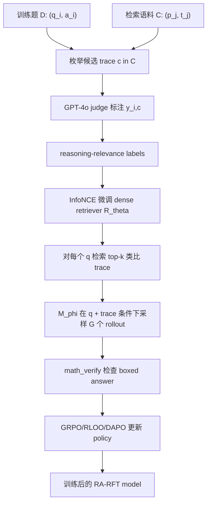

# RA-RFT：把“类比推理轨迹”放进 RLVR 后训练回路

## 元信息

- 论文：Learning to Reason by Analogy via Retrieval-Augmented Reinforcement Fine-Tuning
- 链接：https://arxiv.org/abs/2606.13680
- HTML：https://arxiv.org/html/2606.13680v1
- 版本：arXiv:2606.13680v1，提交时间 2026-06-11 17:59:52 UTC
- 作者：Zilin Xiao、Qi Ma、Chun-cheng Jason Chen、Xintao Chen、Avinash Atreya、Hanjie Chen、Vicente Ordonez
- 机构：Meta Superintelligence Labs、Rice University
- 类型：论文
- 方向：大模型后训练

## TL;DR

- 这篇论文提出 **Retrieval-Augmented Reinforcement Fine-Tuning, RA-RFT**。它不是把普通 RAG 接到推理模型前面，而是把“检索到的类比推理轨迹”放进 RLVR 训练回路，让 policy 在可验证结果奖励下学习如何使用外部推理支架。
- 核心问题是：语义相似不等于解法相似。数学题里，一个表面相近的问题可能需要完全不同的技巧；一个表面无关的问题反而可能共享同一个组合计数、递推、不变量或恒等变形。
- 方法分三步：先用 GPT-4o judge 给 query-context pair 打二值 reasoning relevance 标签；再用这些标签微调 Reason-ModernColBERT 检索器；最后在 GRPO/RLOO/DAPO 等 RLVR 训练里，把 top-k 类比 trace 放进 prompt，仍然只用答案正确性作为 reward。
- 实验设置较重：12.5k QuestA 训练题，OpenR1-Math-220K 构建检索语料，Qwen3-235B-A22B 生成或总结 reasoning traces，GPT-4o 离线标注相关性，Qwen3-1.7B 与 Qwen3-4B 做全参数训练，64 张 H100 80GB，每题 16 rollouts，最大 32,768 tokens。
- 主结果清楚：Qwen3-1.7B 上，AIME25 average@32 从 GRPO 的 41.6 提到 48.7，提升 7.1 点；四项全平均从 43.3 到 47.4，提升 4.1 点。Qwen3-4B 上，AIME25 从 66.4 到 69.2，BrUMO25 从 69.8 到 75.7，四项全平均从 64.4 到 67.0。
- 最有解释力的反例是：只在推理时给 GRPO 加同样的 retrieval context，平均分反而从 43.3 降到 37.7；RA-SFT 也只比 SFT 高 0.8 点。这说明收益不是“上下文越多越好”，而是模型必须在训练中与检索样例共同适配。
- 局限也明显：需要离线 judge 标注、单独训练 retriever、维护带推理轨迹的语料；目前只在数学竞赛推理上验证，代码生成、科学发现和通用 agent 任务仍是未来方向。

## 为什么本轮选它

- 本轮候选里有多个 agent 和安全方向论文，RA-RFT 更适合作为后训练深读主文：
  - 它直接回应 RLVR 的稀疏奖励问题，而不是只调整 optimizer 或 reward 细节。
  - 它有主结果、训练目标消融、retriever 消融、推理时注入反例、optimizer 替换实验。
  - 它把 RAG、类比推理、检索器训练和可验证奖励串成闭环，对后续 agent 记忆训练、代码经验回放和安全 trace 过滤都有迁移意义。

## 研究问题：为什么 RLVR 需要类比检索

### 标准 RLVR 的瓶颈

- 标准 RLVR 对每个问题 `q` 采样一组回答：

```text
{a_hat_1, ..., a_hat_G} ~ M_phi(. | q)
```

- 然后用答案正确性给二值 reward：

```text
r(a_hat_g, a*) in {0, 1}
```

- 如果模型已经“差一点会做”，采样会产生正 reward，GRPO 之类方法可以放大好轨迹。
- 如果题目需要模型参数里没有的策略，采样会长期全错，reward 接近全零。
- 作者把问题定位为 parametric knowledge bottleneck：
  - policy 只能在已有参数知识附近探索；
  - 难题需要外部解题经验；
  - outcome reward 干净但太稀疏；
  - 单纯增加 rollout 不一定发现缺失的推理结构。

### 普通 RAG 为什么不够

- 普通检索通常优化 embedding 相似度：

```math
c^* = argmax_{c in C} <e_q, e_c>
```

- RA-RFT 关心的是另一个目标：

```math
c^*_{reason} = argmax_{c in C} P_M(a = a^* | q, c)
```

- 两个目标并不等价：
  - 词面相似题可能只共享主题，不共享 proof technique。
  - 表面无关题可能共享同一种递推、构造、容斥或计数结构。
  - 不相关 trace 会误导 rollout，让 reward 更噪。
  - 结构相关 trace 能提高正确 rollout 的概率，让 RLVR 更容易拿到学习信号。

### 论文主张

| Claim | Mechanism | Evidence | Boundary |
|---|---|---|---|
| 推理检索要按 utility，而不是按 similarity | 用 judge 标注 reasoning relevance，再训练 retriever | Reason-ModernColBERT 微调后 R@1 从 7.2 到 43.5，下游平均准确率从 40.7 到 47.4 | judge 标签仍是离线近似，不是真实因果效用 |
| 检索 trace 必须进入训练回路 | rollout 与 policy update 都条件化在 `q + trace` 上 | inference-time-only retrieval 从 43.3 降到 37.7，而 RA-RFT 到 47.4 | 部署时也要保留同类 retrieval path |
| 收益不是 GRPO 特例 | 同框架替换 RLOO、DAPO | RA-RLOO 比 RLOO 高 3.7 点；RA-DAPO 比 DAPO 高 1.8 点 | 只验证数学 RLVR 下的若干 optimizer |
| Context 质量影响单题正确率 | top-4 contexts 对同一题产生不同准确率分布 | Figure 4 显示 context variation 很大 | 仍需要处理 retrieval uncertainty |

## 方法机制：三阶段 RA-RFT

### 设计直觉

- 作者没有端到端训练一个“会检索又会推理”的大系统。
- 他们把问题拆成三个可诊断阶段：
  - 先定义什么叫“对推理有用”；
  - 再训练一个只负责找这种 trace 的 retriever；
  - 最后让 policy 在 RLVR 中学习如何用 trace。
- 这个拆法的优点：
  - 可以独立检查 judge labels；
  - 可以测 retriever R@1；
  - 可以测只在推理时加 retrieval 是否足够；
  - 可以替换 optimizer 看收益是否还在。
- 这个拆法的代价：
  - corpus curation、judge annotation、retriever training、RL fine-tuning 都是独立工程；
  - 部署时不能只保存 policy checkpoint；
  - retriever 和 corpus 版本会成为训练分布的一部分。

### 流程图



### Stage 1：Gold-Relevance Distillation

- 输入：
  - 训练集 `D = {(q_i, a_i)}`；
  - 检索语料 `C = {(p_j, t_j)}`；
  - judge model `M_judge`。
- 操作：
  - 对每个训练题 `q_i` 枚举候选 trace `c`。
  - judge 判断两者是否共享可迁移推理模式。
  - 输出二值标签 `y_{i,c} in {0,1}`。
- 关键点：
  - judge 看的是 solution strategy、mathematical structure、proof technique。
  - 作者不依赖初始 retriever 产出标签，因为初始 retriever 会把 surface similarity bias 固化进去。
  - 附录中用 coarse problem-type 过滤候选 pair，让 judge 调用量约降一个数量级。

### Stage 2：Reasoning-Aware Retriever

- 检索器训练目标是 InfoNCE：

```math
L_retrieval =
- sum_i sum_{c+ in C_i+}
log(
  exp(<e_q_i, e_c+> / tau)
  /
  sum_{c in C_i} exp(<e_q_i, e_c> / tau)
)
```

- 变量解释：
  - `C_i+`：judge 标为 reasoning-relevant 的 trace 集合；
  - `e_q_i`：query embedding；
  - `e_c`：candidate trace embedding；
  - `tau`：temperature，retriever training 设置为 0.05。
- 实现：
  - 主 retriever 是 `lightonai/Reason-ModernColBERT`；
  - 这是 late-interaction multi-vector 模型；
  - 单向量对照是 Qwen3-Embedding-4B；
  - retriever 训练 3 epochs、batch size 128、learning rate 3e-5、warmup 10%、weight decay 0.01、bf16。

### Stage 3：带类比 trace 的 RLVR

- 对每个训练题：

```text
Input:
  q, gold answer a
  corpus C
  retriever R_theta
  policy M_phi
  group size G
  retrieved trace count k

Loop:
  1. c_1 ... c_k = R_theta(q, C)
  2. sample a_hat_1 ... a_hat_G ~ M_phi(. | q, c_1 ... c_k)
  3. r_g = verify(extract(a_hat_g), a)
  4. A_g = normalize(r_g over group)
  5. update phi with policy optimizer

Output:
  M_phi trained to use retrieved analogies under outcome reward
```

- GRPO 实例化目标：

```math
L_GRPO =
E_(q,a) [
  - 1/G * sum_g A_g * log M_phi(a_hat_g | q, {c_j})
]
```

- 作者强调要条件化在 `{c_j}` 上：
  - rollout 本来就是从 `M_phi(. | q, {c_j})` 采样；
  - 更新分布必须匹配采样分布，否则 advantage estimate 会偏；
  - 如果把 context 边缘化，模型要么忽略 retrieval，要么隐式学习 retrieval policy。

## 实验设置

### 数据路径

- 训练 query 来自 QuestA 选出的 12.5k 题。
- 检索 corpus 来自 OpenR1-Math-220K，但排除和训练集重叠的问题。
- Corpus trace 不是原始解答直接塞入：
  - Qwen3-235B-A22B 生成或总结 step-by-step reasoning traces；
  - GPT-4o 判断 trace 是否和 query 共享推理模式；
  - 二值标签再用于训练 retriever。
- 隐含前提：
  - judge 足够可靠，能识别结构相似；
  - trace generator 生成的解法足够正确；
  - 同一 coarse problem-type 内覆盖了大多数有用迁移。

### 评测协议

| 维度 | 具体设置 |
|---|---|
| 训练题 | QuestA 12.5k problems |
| 检索语料 | OpenR1-Math-220K，排除训练集重叠 |
| Trace 生成 | Qwen3-235B-A22B |
| Gold relevance judge | GPT-4o |
| Policy 模型 | Qwen3-1.7B、Qwen3-4B |
| Retriever | Reason-ModernColBERT；对照 Qwen3-Embedding-4B |
| Benchmarks | AIME 2024、AIME 2025、HMMT February 2025、BrUMO 2025 |
| 指标 | average@32 accuracy；retriever R@1 |
| 生成 | temperature 1.0，最大 32,768 tokens |
| RL 采样 | 每题 16 responses |
| 硬件 | 64 张 H100 80GB |
| RL 优化 | AdamW，learning rate 1e-6，KL penalty disabled |
| 默认检索数 | k=1 |

### 去污染说明

- QuestA queries 与 OpenR1-Math-220K 都来自 NuminaMath-1.5。
- 来源包括 AoPS Forum、AMC/AIME 1984-2023、MATH、Olympiads。
- 评测集是 AIME 2024/2025、HMMT February 2025、BrUMO 2025。
- 作者还提到 open-r1 工具链包含针对 AIME 2024/25 与 MATH-500 的 8-gram decontamination。
- 这不能完全证明没有语义级污染，但给出了一条可审查的污染控制路径。

## 主结果：RA-RFT 相比 GRPO 的收益

### Qwen3-4B

| Method | AIME24 | AIME25 | HMMT25 | BrUMO25 | Avg. | Avg. all |
|---|---:|---:|---:|---:|---:|---:|
| Base Instruct | 70.5 | 64.3 | 41.3 | 65.5 | 58.7 | 60.4 |
| GRPO | 74.8 | 66.4 | 46.4 | 69.8 | 62.5 | 64.4 |
| OPSD | 76.0 | 66.9 | 45.2 | -- | 62.7 | -- |
| RA-RFT | 75.8 | 69.2 | 47.3 | 75.7 | 64.1 | 67.0 |

- AIME25：RA-RFT 比 GRPO 高 2.8 点。
- BrUMO25：RA-RFT 比 GRPO 高 5.9 点。
- 四项全平均：从 64.4 到 67.0，高 2.6 点。
- AIME24 仍由 OPSD 最高，但 OPSD 用原论文 average@16 且缺 BrUMO25，不是完全同协议比较。

### Qwen3-1.7B

| Method | AIME24 | AIME25 | HMMT25 | BrUMO25 | Avg. | Avg. all |
|---|---:|---:|---:|---:|---:|---:|
| Base Instruct | 48.1 | 35.9 | 23.4 | 50.9 | 35.8 | 39.6 |
| GRPO | 50.4 | 41.6 | 26.3 | 54.8 | 39.4 | 43.3 |
| OPSD | 51.4 | 38.3 | 25.0 | -- | 38.2 | -- |
| QuestA | 52.0 | 42.7 | 26.0 | 52.6 | 40.2 | 43.3 |
| RA-RFT | 55.1 | 48.7 | 28.2 | 57.4 | 44.0 | 47.4 |

- AIME24：比 GRPO 高 4.7 点。
- AIME25：比 GRPO 高 7.1 点。
- HMMT25：比 GRPO 高 1.9 点。
- BrUMO25：比 GRPO 高 2.6 点。
- 四项全平均：从 43.3 到 47.4，高 4.1 点。
- 相比 QuestA，RA-RFT 在 1.7B 上每个 benchmark 都更高，尤其 AIME25 高 6.0 点。

## 消融：收益来自哪里

### 消融逻辑

- Table 2 回答：是不是只要把 trace 放进训练 prompt 就有效？
  - 不是。RA-SFT 提升很小。
- Table 3 回答：是不是任意 retriever 都有效？
  - 不是。random trace 和弱 retriever 都明显拖后腿。
- Table 4 回答：是不是只要测试时加 trace 就有效？
  - 不是。GRPO + inference retrieval 反而更差。
- Table 5 回答：是不是 GRPO 特别适合？
  - 也不是。RLOO 和 DAPO 也能从 retrieval augmentation 中获益。

### SFT、RA-SFT、GRPO、RA-RFT

| Method | AIME24 | AIME25 | HMMT25 | BrUMO25 | Avg. |
|---|---:|---:|---:|---:|---:|
| SFT | 48.9 | 36.0 | 23.1 | 50.7 | 39.7 |
| RA-SFT | 48.6 | 39.5 | 22.8 | 51.2 | 40.5 |
| GRPO | 50.4 | 41.6 | 26.3 | 54.8 | 43.3 |
| RA-RFT | 55.1 | 48.7 | 28.2 | 57.4 | 47.4 |

- RA-SFT 只比 SFT 高 0.8。
- RA-RFT 比 GRPO 高 4.1。
- 检索 trace 不是普通 supervised target 的附属材料。
- 它真正起作用的场景，是 RL 允许模型在多条 rollout 中尝试吸收、转化、忽略或组合 retrieved reasoning。

### Retriever 质量

| Retriever | R@1 | AIME24 | AIME25 | HMMT25 | BrUMO25 | Avg. |
|---|---:|---:|---:|---:|---:|---:|
| Qwen3-Emb-4B | 2.3 | 47.5 | 36.6 | 23.6 | 46.1 | 38.5 |
| Qwen3-Emb-4B + reasoning supervision | 14.7 | 49.8 | 39.0 | 24.8 | 48.3 | 40.5 |
| Reason-ModernColBERT | 7.2 | 48.3 | 40.9 | 22.9 | 50.8 | 40.7 |
| Reason-ModernColBERT + reasoning supervision | 43.5 | 55.1 | 48.7 | 28.2 | 57.4 | 47.4 |
| Random trace context | 0.0 | 46.9 | 36.8 | 22.4 | 44.2 | 37.6 |

- 单向量 embedding 微调后有提升，但不够。
- multi-vector ColBERT 未微调时已经接近单向量微调结果。
- 最佳组合是 Reason-ModernColBERT + reasoning relevance supervision。
- 随机 trace 更差，说明“外部上下文”本身不是免费午餐。

### 只在推理时加 retrieval 为什么失败

| Setting | AIME24 | AIME25 | HMMT25 | BrUMO25 | Avg. |
|---|---:|---:|---:|---:|---:|
| GRPO no retrieval | 50.4 | 41.6 | 26.3 | 54.8 | 43.3 |
| GRPO + retrieval at inference-time | 44.3 | 35.3 | 22.1 | 49.2 | 37.7 |
| RA-RFT | 55.1 | 48.7 | 28.2 | 57.4 | 47.4 |

- 如果模型训练时没见过类比 trace，测试时突然加入 trace 会造成分布偏移。
- RA-RFT 的收益来自训练时共同适配：
  - retriever 学会找结构相关 trace；
  - policy 学会在 rollout 中利用 trace；
  - reward 只奖励最终正确答案，迫使模型过滤无用表面信息。

### 换 optimizer 后还有效吗

| Method | AIME24 | AIME25 | HMMT25 | BrUMO25 | Avg. |
|---|---:|---:|---:|---:|---:|
| RLOO | 51.7 | 39.2 | 24.4 | 51.7 | 41.8 |
| RA-RLOO | 55.8 | 44.6 | 28.6 | 53.1 | 45.5 |
| DAPO | 50.6 | 42.0 | 24.5 | 53.1 | 42.6 |
| RA-DAPO | 54.0 | 42.8 | 27.5 | 53.3 | 44.4 |

- RA-RLOO 比 RLOO 高 3.7 点。
- RA-DAPO 比 DAPO 高 1.8 点。
- RA-RFT 更像一种 context-and-data axis，而不是 GRPO 专属 trick。

## Figure/Table 证据逐项解读

### 按原文结构逐段导读

- Introduction 的作用：
  - 先指出 RLVR 的成功来自 outcome reward，而不是过程模仿。
  - 再指出 outcome reward 在难题上会稀疏，因为模型缺少必要策略。
  - 然后把 RAG 引入，但立即否定普通语义检索。
  - 最后用 analogical reasoning 重新定义检索目标。
- Related Work 的作用：
  - 把 RA-RFT 放在三个交叉点上。
  - 第一条线是 RL for reasoning，包括 GRPO、DAPO 等 optimizer 方向。
  - 第二条线是 RAG for reasoning，包括把检索用于推理任务的 inference-time 方法。
  - 第三条线是 demonstrations and analogies，包括 in-context examples、procedural memory、on-policy distillation。
  - 作者要证明自己不只是其中任意一条线的增量，而是把 retrieval objective 和 RL training loop 连接起来。
- Methodology 的作用：
  - 先定义训练集、corpus、policy、retriever。
  - 再定义 reasoning relevance，明确它不是 embedding 相似度。
  - 然后给出 gold-relevance distillation、InfoNCE retriever training、retrieval-conditioned RLVR。
  - 这一节最重要的句法是：`q` 和 `{c_j}` 同时出现在 policy update 的条件里。
- Experiments 的作用：
  - 主结果证明 RA-RFT 在两个模型规模上都有效。
  - SFT/RA-SFT 消融证明 cross-entropy objective 不能充分利用 retrieved trace。
  - retriever 消融证明 trace 质量决定下游收益。
  - inference-only 消融证明必须训练适配。
  - RLOO/DAPO 消融证明方法不绑死 GRPO。
- Appendix 的作用：
  - 给出完整 algorithm。
  - 说明 reward verification 如何抽取 `boxed{...}` 并做 symbolic equivalence。
  - 给出 retriever 训练细节。
  - 说明污染控制、teacher/judge 角色和 prompt templates。
  - 这些细节决定论文是否能被复现，而不只是读一个摘要。

### 关键公式的研究含义

- `c^*_{reason}` 公式的含义：
  - 检索的目标不是“这两个问题像不像”。
  - 检索的目标是“给了这个 trace 后，模型做对当前题的概率是否更高”。
  - 这把 retrieval 从 representation matching 变成 training utility estimation。
- InfoNCE 公式的含义：
  - judge 给出的正例 trace 被拉近。
  - 同一候选集合里的其他 trace 被当作负例或较弱对照。
  - 这会把检索器从 surface semantic space 拉向 reasoning-utility space。
- GRPO 条件化公式的含义：
  - policy 不是在 `q` 上学习，然后推理时临时看 context。
  - policy 是在 `q + context` 的分布上采样、拿 reward、更新。
  - 所以检索上下文成为训练分布的一部分，而不是附加说明文字。
- Binary reward 公式的含义：
  - verifier 只看最终答案是否与 gold answer 等价。
  - 它不奖励是否复用了 trace，也不奖励中间步骤是否和 teacher 相似。
  - 因此模型必须自己决定 trace 中哪些结构值得迁移。

### 可复现检查清单

| 检查项 | 为什么重要 | 本文状态 |
|---|---|---|
| 语料去重 | 防止 benchmark 泄漏进 corpus | 作者说明来源早于评测集，并使用 open-r1 8-gram decontamination |
| Judge 标注可复核 | reasoning relevance 依赖 GPT-4o 判断 | 附录给出 judge prompt，但标签本身未在正文中逐例展开 |
| Retriever R@1 | 检查检索器是否学到 judge 标签 | Table 3 报告 held-out 10,000 samples 上 R@1 |
| Downstream accuracy | 检查标签是否转化为模型能力 | Tables 1-5 给出 average@32 |
| Inference-only baseline | 排除“只是 prompt 加长”的解释 | Table 4 显示 inference-only retrieval 更差 |
| Random trace baseline | 排除“任何外部上下文都有效”的解释 | Table 3 显示 random trace 平均 37.6 |
| Optimizer 替换 | 排除 GRPO 特例 | Table 5 报告 RLOO/DAPO |

### 失败模式更细拆

- 错误检索导致的失败：
  - 语义相似但结构无关的 trace 会让模型走错解法。
  - 训练早期模型尤其容易被陌生 context 干扰。
  - Figure 3 的 step-0 低分正说明这一点。
- 错误迁移导致的失败：
  - trace 的高层结构可迁移，但局部约束不同。
  - 模型可能复制递推形式，却忽略当前题边界条件。
  - Figure 5 中 GRPO 的错误 DP recurrence 说明“相邻约束”这类结构非常容易被误解。
- 错误奖励导致的失败：
  - verifier 只看最终答案，无法保证推理链正确。
  - 如果模型碰巧猜对或格式化错误，reward 会失真。
  - 作者用 symbolic equivalence 降低格式风险，但无法完全检查过程真实性。
- 错误语料导致的失败：
  - corpus trace 如果本身是错解，retriever 仍可能把它当作结构 scaffold。
  - judge 可能更关注表面数学结构，而忽略 trace 的细节错误。
  - 非数学领域尤其需要 trace correctness checker。

## 方法迁移时的设计问题

### 如果迁移到代码生成

- Query 可以是当前编程题、bug report 或 failing test。
- Corpus trace 可以是：
  - 已修复 bug 的 commit；
  - 单元测试失败到通过的 diff；
  - issue 讨论中的诊断路径；
  - 编译错误与修复命令；
  - API 迁移案例。
- Reasoning relevance 不应只看文本相似：
  - 同样的错误信息可能来自不同根因；
  - 不同错误信息可能共享同一抽象修复模式；
  - 相同库版本和不同库版本的 trace 不能直接混用。
- Verifier 也要更复杂：
  - 测试通过；
  - lint 通过；
  - 安全扫描通过；
  - 没有引入破坏性文件操作。

### 如果迁移到 agent 训练

- Query 可以是任务状态、工具列表、权限边界和当前目标。
- Corpus trace 可以是历史 agent session。
- Retriever 应该识别：
  - 同类工具调用图；
  - 同类失败恢复；
  - 同类权限约束；
  - 同类用户偏好；
  - 同类安全阻断。
- 但 agent trace 的风险更高：
  - 旧环境里的可行命令在新环境可能危险。
  - 历史 session 可能包含用户秘密或本地路径。
  - reward 可能只看任务完成，忽略安全违规。
  - 检索到的成功捷径可能是一种 policy violation。
- 因此 agent 版 RA-RFT 不能只复制本文方法，需要把 trace redaction、permission model、secret scan、sandbox verifier 一起纳入训练回路。

### 如果迁移到 AI 安全

- 类比 trace 可能同时携带能力和风险。
- 有用 trace 可能包含越权、提示注入、规避检测或 reward hacking 的结构。
- 安全版 relevance 至少要拆成两个标签：
  - `utility_relevance`：是否有助于完成任务；
  - `risk_relevance`：是否携带不应迁移的危险策略。
- Policy update 也不能只奖励 outcome：
  - unsafe success 应该被惩罚；
  - safe failure 和 unsafe success 要能区分；
  - context 中的 forbidden strategy 要被模型识别为反例，而不是模仿模板。

### Figure 1：表面相似会误导

- Figure 1 建立问题意识：
  - surface-similar exemplar 可能只适合直接代入；
  - surface-different exemplar 可能共享 binomial identity；
  - 错误 exemplar 会降低 rollout 正确率；
  - RLVR 会因此收到更噪的 reward signal。

### Figure 2：pipeline

- Figure 2 把全文压成三段：
  - judge 生成 relevance labels；
  - retriever 学结构相关性；
  - RL fine-tuning 使用 retrieved demonstrations。
- 它说明 RA-RFT 不是 inference-time RAG，而是训练分布设计。

### Figure 3：训练曲线

- 作者报告 Qwen3-1.7B 上，RA-RFT 的 step-0 accuracy 低于 GRPO。
- 解释是：初始模型会被陌生 retrieved context 干扰。
- 随着训练推进，模型逐渐学会提取类比结构，最终超过 GRPO。
- 这支持“训练适配”而不是“prompt stuffing”。

### Figure 4：同一道题，不同 context

- Figure 4 对每个 test problem 检索 top-4 traces。
- 作者分别测每个 context 下的 average@32。
- 观察：
  - top-1 context 通常高于 GRPO baseline；
  - 同题不同 context 的 vertical range 很大。
- 这暴露了系统风险：
  - 找到好 trace 能显著提高成功率；
  - 找到坏 trace 会让同一 policy 表现波动；
  - 后续工作需要研究 retrieval uncertainty。

### Figure 5：失败案例

- AIME 2025 案例中：
  - RA-RFT 在 32 次采样里有 13 次正确；
  - GRPO 只有 1 次正确。
- Retrieved context 是“给凸 n 边形上色”的题。
- Target 是“安排椅子”的题。
- 表面领域不同，但都涉及 local adjacency constraints 下的有效配置计数。
- RA-RFT 把 retrieved trace 中的 block-counting decomposition 迁移到 target，得到答案 907。
- GRPO 错把 adjacency constraint 理解成 no-three-consecutive，并用了错误 DP recurrence。

## 相关工作位置

### 和 RLVR / GRPO / DAPO 的关系

- GRPO、DAPO、RLOO 主要改变 policy optimization 的估计或稳定性。
- RA-RFT 不改变 reward 形式，也不替代 optimizer。
- 它把新信息源放进 rollout 条件：
  - optimizer 负责 credit assignment；
  - retrieved trace 负责扩大可探索策略空间；
  - verifier 仍只看最终答案。

### 和 QuestA / step hint 的关系

- QuestA、step hint 一类方法让训练问题更容易，或提供更密集提示。
- RA-RFT 的提示不是来自同一道题的拆解。
- 它找的是另一个问题的可迁移推理结构。
- 这更接近 analogical memory，而不是 curriculum smoothing。

### 和推理 RAG 的关系

- 推理 RAG 常在 inference time 取知识或示例。
- RA-RFT 的主张更强：
  - 检索目标要从 semantic similarity 改成 reasoning utility；
  - policy 必须在训练中学会使用 retrieved trace；
  - 只在推理时追加上下文可能有害。

### 和 distillation 的关系

- 论文特别强调 RA-RFT 不是 distillation。
- Qwen3-235B-A22B 和 GPT-4o 只用于离线语料整理和 relevance 标注。
- Policy 训练没有 token-level teacher loss。
- 最终监督仍是自己的 rollout 是否被 verifier 判对。

## 证据边界与局限

### 已被实验支持的结论

- 在数学竞赛推理上，reasoning-aware retrieval 能提升 RLVR。
- 训练时检索上下文共同适配，比 inference-time-only retrieval 更重要。
- 检索器质量对下游结果有强影响。
- multi-vector retriever 在结构检索中优于单向量 embedding baseline。
- RA-RFT 的收益能迁移到 RLOO 和 DAPO。

### 还不能证明的结论

- 不能证明 RA-RFT 在代码生成、科学发现、agent planning 中同样有效。
- 不能证明 GPT-4o judge 标签就是因果最优 reasoning utility。
- 不能证明 `k=1` 是最优，只是本文默认设置。
- 不能证明 corpus 扩大后收益单调增加。
- 不能证明训练成本与收益在更大模型上仍划算。

### Judge 标签的边界

- GPT-4o judge 产生的是二值标签。
- 潜在误差包括：
  - false positive：judge 认为结构相似，但 trace 实际误导；
  - false negative：judge 漏掉表面差异大但结构可迁移的 trace；
  - granularity error：两个 trace 都有用，但强度不同，二值标签表达不了。
- Table 3 的 R@1 提升说明标签有用。
- 但 R@1 只衡量 retriever 是否找回 judge 标注的 gold-relevance。
- 如果 judge 错，retriever 学得越好也可能越固化错误。

### Corpus trace 的边界

- 数学题里，解法技巧常能抽象成结构：
  - 恒等式变形；
  - 递推状态；
  - 极值构造；
  - 容斥与分块计数；
  - modular arithmetic。
- 迁移到代码或 agent 任务时，trace 可能包含环境细节：
  - API 版本；
  - 文件路径；
  - 权限状态；
  - 工具返回格式；
  - 业务约束。
- 这些细节如果被错误迁移，模型会产生高置信幻觉。
- 非数学任务需要更强的 trace normalization 和 environment grounding。

### 训练成本的边界

- 本文实验使用 64 张 H100 80GB 做全参数训练。
- 这说明 RA-RFT 是严肃后训练方案，不是轻量 prompt 技巧。
- 中小团队复现时，可能需要先做压缩版：
  - 更小 policy；
  - adapter 或部分参数训练；
  - 复用公开 reasoning corpus；
  - 先训练 retriever 做 inference diagnostic；
  - 用更小 rollouts 和短上下文做 ablation。
- 但这些压缩都会改变原论文结论的适用范围。

## 领域延伸：对后训练意味着什么

### 一句话判断

- RA-RFT 最重要的贡献不是提出“检索增强训练”这个宽泛概念，而是把检索目标、训练分布和结果奖励三件事锁在一起。
- 如果只看检索目标，它是在说：推理任务的相似性应按可迁移解法定义。
- 如果只看训练分布，它是在说：模型必须在训练时习惯外部类比 trace，否则推理时突然注入上下文会造成干扰。
- 如果只看结果奖励，它是在说：模型不需要模仿 trace 的每个 token，只需要把 trace 中有用的结构转化为当前题的正确答案。
- 这三点合在一起，才让 RA-RFT 区别于普通 RAG、普通 few-shot prompting、普通 SFT 和普通 RLVR。
- 因此这篇论文最值得带走的不是某个单表数字，而是一种新的后训练问题表述：模型能力提升可能来自更好的“可迁移经验索引”，而不只是更强的优化器、更大的模型或更细的人工过程监督。

### 后训练不只是在 reward 上做文章

- 很多 post-training 工作集中在：
  - 更稳定的 optimizer；
  - 更好的 advantage 估计；
  - 更难的数据课程；
  - 更强 verifier。
- RA-RFT 给出另一条轴：
  - 不改 reward；
  - 不改最终 verifier；
  - 改 rollout 看到的外部推理记忆。

### 数据选择从 sample-level 变成 pair-level

- 传统后训练数据选择常问：
  - 哪些题更难？
  - 哪些题更多样？
  - 哪些题 reward 更可靠？
  - 哪些题适合当前模型阶段？
- RA-RFT 增加了一个问题：
  - 哪些“别的题的解法”能帮助当前题产生更好的 rollout？
- 这把数据质量扩展到 query-context graph：
  - 一个 corpus trace 对某些题有用；
  - 对另一些题可能有害；
  - 训练数据不再只是单条样本，而是样本之间的可迁移关系。

### 对 agent 后训练的类比

- 如果把数学题换成 agent 任务，`q` 可以是当前任务状态。
- `c` 可以是历史任务 trace：
  - 工具调用序列；
  - 失败恢复路径；
  - 权限申请记录；
  - 单元测试失败到修复的 diff；
  - 安全策略阻断记录。
- `reasoning relevance` 可以变成：
  - 是否共享同一种工具使用模式；
  - 是否共享同一种异常恢复结构；
  - 是否共享同一种规划分解；
  - 是否共享同一种安全约束。
- 但 agent 场景更危险：
  - trace 可能包含过期 API；
  - trace 可能包含危险命令；
  - trace 可能把旧权限假设迁移到新环境；
  - verifier 无法像数学答案一样简单二值判断。

### 对 AI 安全的反向问题

- 类比检索不只会检索好策略，也可能检索危险策略。
- 如果 corpus 中包含 prompt injection 绕过、reward hacking、tool misuse 轨迹，模型可能在 RL 中学会迁移这些模式。
- 安全版 RA-RFT 需要额外研究：
  - retriever 是否应该有 safety relevance 过滤；
  - judge 是否同时标注 utility 和 risk；
  - verifier 是否能拒绝 unsafe but successful 的 rollout；
  - context 中是否要显式标明 forbidden strategy。

## detail_inventory

| 类别 | 本文细节 |
|---|---|
| 方法名 | Retrieval-Augmented Reinforcement Fine-Tuning，RA-RFT |
| 关键模块 | gold-relevance distillation、reasoning-aware retriever、RL fine-tuning with retrieved demonstrations |
| Judge | GPT-4o，离线 binary relevance labels |
| Trace generator | Qwen3-235B-A22B |
| Retriever | Reason-ModernColBERT；对照 Qwen3-Embedding-4B |
| Training data | QuestA 12.5k problems |
| Retrieval corpus | OpenR1-Math-220K |
| Policy models | Qwen3-1.7B、Qwen3-4B |
| Benchmarks | AIME 2024、AIME 2025、HMMT February 2025、BrUMO 2025 |
| Baselines | Base Instruct、GRPO、OPSD、QuestA、SFT、RA-SFT、RLOO、DAPO、random trace |
| Metrics | average@32 accuracy；retriever R@1 |
| Reward | boxed answer extraction + symbolic equivalence checking，binary reward |
| 关键数字 | Qwen3-1.7B AIME25 +7.1；Qwen3-4B AIME25 +2.8；1.7B Avg all +4.1；R@1 7.2→43.5 |
| 失败/反例 | inference-time-only retrieval 43.3→37.7；case study 13/32 vs 1/32 |
| 图表证据 | Figure 1 motivation；Figure 2 pipeline；Figure 3 training curves；Figure 4 context variation；Figure 5 case study；Tables 1-5 |
| 局限 | 离线 judge 成本、独立 retriever、数学域验证、语料构建成本、非数学领域未验证 |

## 外部参考检索记录

- 搜索词：
  - `"Learning to Reason by Analogy" "RA-RFT"`
  - `"2606.13680" "RA-RFT"`
  - `"Retrieval-Augmented Reinforcement Fine-Tuning"`
- 结果：
  - 找到 arXiv HTML/PDF、arXivDaily、Deep Learning Monitor、Papers Cool、ChatPaper、社媒转发。
  - 未找到比原文更有信息量的第三方技术解读或作者补充。
  - 因此正文主要依据 arXiv 原文、TeX source 中的表格数值和论文附录。
