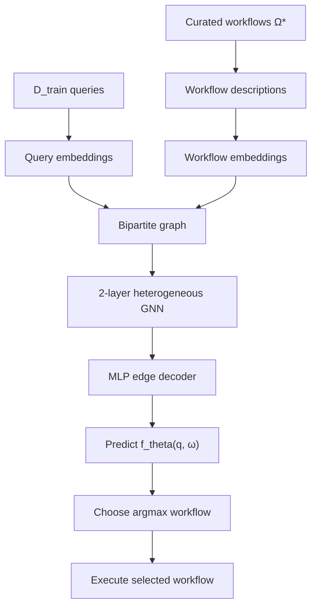

# FlowBank：把 Agent 工作流从“一次性答案”变成可复用资产

## 元信息

- **论文**：[FlowBank: Query-Adaptive Agentic Workflows Optimization through Precompute-and-Reuse](https://arxiv.org/abs/2606.11290)
- **项目页**：[agentic-flowbank.github.io](https://agentic-flowbank.github.io/)
- **版本**：arXiv:2606.11290v1，提交时间 2026-06-09 17:58:21 UTC
- **作者**：Lingzhi Yuan、Chenghao Deng、Fangxu Yu、Souradip Chakraborty、Mohammad Rostami、Furong Huang
- **机构**：University of Maryland, College Park；Amazon
- **类型**：论文
- **方向**：大模型 Agent / Agentic Workflow Optimization

## TL;DR

- **FlowBank 研究的问题**：现有 Agent 工作流优化在两个极端之间摇摆。task-level 方法离线搜索很多候选，最后只部署一个静态 workflow；query-level 方法每个 query 临时生成 workflow，适配性强但推理成本高。
- **核心主张**：这些 workflow 不应该被看成“一次性搜索产物”，而应该被看成可复用资产。系统可以离线构建一个小型、互补的 workflow bank，再在推理时按 query 路由到最合适的成员。
- **方法结构**：FlowBank 分三阶段：
  - **DiverseFlow**：基于 MCTS 搜索 workflow，先用性能 warm-up，再把搜索权重转向当前 pool 尚未覆盖的困难 query。
  - **CuraFlow**：用 coverage-aware combinatorial search 从 raw pool 中选出小而互补的 portfolio。
  - **Graph-based Matching**：把 query 与 workflow 构成二分图，用 2 层异构 GNN 预测每条 query-workflow 边的效用。
- **关键数字**：论文在 MATH、AMC、MBPP、DROP、MMLU Pro 五个 benchmark 上测试。FlowBank 平均 performance 为 **73.40**，高于最强自动 baseline AFlow(GPT-4o) 的 **70.40**，相对提升 **4.26%**；高于最强手写 workflow MultiPersona 的 **63.87**，相对提升 **14.92%**。
- **成本证据**：FlowBank 平均推理 cost 为 **1.65**，低于 AFlow(GPT-4o) 的 **1.95** 与 ScoreFlow 的 **2.37**；AgentSquare 更便宜，为 **1.02**，但平均 performance 低 **6.70** 点。
- **消融结论**：去掉 DiverseFlow、把 CuraFlow 换成 top-k accuracy set、保留 full candidate pool、把 GNN selector 换成 flat MLP 都会下降。尤其 full pool 的 oracle coverage 很高，但最终 performance 更差，说明“候选越多”会给 selector 增加冗余噪声。
- **局限**：FlowBank 的 portfolio 一旦构建就固定，不能自动吸收后续新 workflow；$\tau$ 与 $\lambda$ 仍需调参；实验使用 GPT-4o mini 作为固定 executor，任务集中在五个标准 benchmark，尚未覆盖真实长程工具环境、权限系统和多轮状态漂移。

## 为什么本轮选 FlowBank

### 它不是又一个“让 Agent 更复杂”的框架

FlowBank 的价值在于把 Agent workflow 优化的问题重写了一遍：

- 常见做法会问：
  - 哪个 workflow 平均分最高？
  - 能不能让模型为每个 query 重新生成更合适的 workflow？
  - 多 Agent、self-refine、debate、planner/executor 谁更强？
- FlowBank 换成了另一个问题：
  - 已经搜索出来的 workflow 里，有没有互补能力？
  - 能不能用少量 workflow 覆盖更多 query？
  - 能不能用轻量路由恢复 query-level adaptivity，而不是每次重新生成 workflow？

这个问题对当前 Agent 系统很现实：

- 工程上，workflow 搜索、prompt 优化、多 Agent 编排都很贵。
- 产品上，真实流量并不需要每次都重新设计工作流。
- 研究上，平均分最高的单一 workflow 未必覆盖最多失败类型。
- 安全上，复用 workflow bank 会带来 provenance、权限、偏差和不安全模式继承问题。

### 它补上了 AFlow/ScoreFlow 两类方法之间的空白

论文把现有方法分成两个范式：

| 范式 | 代表方法 | 优点 | 代价 | FlowBank 的判断 |
|---|---:|---|---|---|
| Task-level optimization | AFlow、ADAS、AgentSquare | 离线搜索，部署成本较低 | 最后只选一个 workflow，丢掉互补候选 | 被丢掉的 workflow 仍有 set-level reuse value |
| Query-level optimization | ScoreFlow、MaAS | 每个 query 可定制 workflow | 推理时要生成或路由复杂结构，成本高 | 一部分 query 可以由预计算 workflow 更便宜地解决 |
| Portfolio-based reuse | FlowBank | 离线保留互补 workflow，在线轻量匹配 | 需要构建 bank、curate、训练 selector | 在五个 benchmark 上获得更好性能-成本折中 |

## 研究问题：为什么单一最佳 workflow 不够

### 定义：workflow 是 LLM 调用图

论文把 agentic workflow 定义为：

```text
给定任务数据集 D：

workflow ω(.) 是一个 LLM 调用构成的 computation graph。
它把 query q 映射为 prediction ω(q)。

每个 workflow-query pair 有两个量：
1. performance: e(ω, q) ∈ [0, 1]
2. token cost: c(ω, q) > 0
```

这个定义很克制：

- 它不假设 workflow 一定是多 Agent。
- 它不假设 workflow 一定有工具调用。
- 它只关心一个 query 经由某个计算图后得到的效果和成本。
- 因此 CoT、self-consistency、debate、self-refine、自动搜索出的代码化 workflow 都能进入同一评价框架。

### Task-level optimization 的目标

Task-level 方法会选一个静态 workflow：

```math
\omega_{\text{stat}}
= \arg\max_{\omega}
\sum_{q \in D_{\text{train}}} e(\omega, q)
```

这个目标的问题不在于“错”，而在于它只优化单点平均：

- 一个 workflow 在整体上最高分，可能只是对常见 query 强。
- 另一个 workflow 平均分略低，却可能解决第一名完全不会的 query。
- 离线搜索过程已经产生了很多候选，但部署时把它们丢掉。
- 这些被丢掉的候选，可能作为集合有更高 coverage。

### Query-level optimization 的目标

Query-level 方法会训练一个 meta-generator：

```math
\omega_{\mathrm{dyn}}^q = G_\phi(q)

\phi^* =
\arg\max_{\phi}
\sum_{q \in D_{\text{train}}} e(G_\phi(q), q)
```

它的收益来自 query adaptation：

- 每个 query 都能有定制 workflow。
- 对异质任务更灵活。
- 可以为难题生成更复杂的调用结构。

但它的代价也直接：

- 推理阶段要先生成 workflow，再执行 workflow。
- 成本包含 generation cost 与 execution cost。
- 在大流量场景中，很多 query 可能不值得付出完整动态生成成本。

## 核心观察：互补性比“谁赢谁输”更重要

### Observation 1：AFlow 候选集合本身有复用价值

论文用 AFlow 在 MATH 上搜索出的 20 个候选 workflow 做分析。

它定义 workflow set 的 coverage：

```math
\mathrm{Coverage}(\Omega)
=
\frac{1}{|D|}
\sum_{q \in D}
\max_{\omega \in \Omega} e(\omega, q)
```

变量解释：

| 变量 | 含义 | 直觉 |
|---|---|---|
| $D$ | query 数据集 | 所有待处理问题 |
| $\Omega$ | workflow 集合 | 可复用 workflow bank |
| $e(\omega,q)$ | workflow 对 query 的效果 | 正确性或任务指标 |
| $\max_{\omega \in \Omega}$ | 对每个 query 取最强 workflow | 看 bank 是否覆盖该 query |
| Coverage | query-wise best performance 的平均值 | 衡量集合互补性 |

关键结果不是某个单点数字，而是曲线形态：

- 随着 set size $k$ 增大，coverage 稳定上升。
- top-k accuracy set 不如 combinatorially best size-k subset。
- 说明“平均准确率最高的 k 个 workflow”不等于“互补性最好的 k 个 workflow”。


### Observation 2：ScoreFlow 的动态能力有冗余成本

论文还把 ScoreFlow 与 AFlow 的 best static workflow 放在一起比较。

实验方式是：

- 对 DROP 上每个 query，同时看：
  - ScoreFlow 动态生成 workflow 的表现与成本。
  - AFlow 静态 workflow 的表现与成本。
- 让 oracle 选择效果更高的 workflow。
- 如果效果相同，就选成本更低的 workflow。

结论是：

- 一部分由 ScoreFlow 解决的 query，可以被更便宜的静态 workflow 解决。
- 这说明 query-level generation 的收益不是每个 query 都必要。
- 如果系统能正确分流，就能保留适配性，同时减少冗余 token cost。

这两条观察共同推出 FlowBank 的目标：

```text
不要只找一个平均最强 workflow。
不要每个 query 都重新生成 workflow。

先离线构建一个互补 workflow bank，
再在线选择最合适的 workflow。
```

## 方法一：DiverseFlow 怎样搜索互补候选

### 它继承 AFlow 的 MCTS 搜索结构

DiverseFlow 仍然基于 Monte Carlo Tree Search。

每一轮包含四步：

1. 从已有 workflow pool 中采样一个 parent workflow。
2. 让 optimizer LLM 基于 parent 与搜索经验，在代码空间提出新 workflow。
3. 在训练集上执行新 workflow，得到 per-query performance 与 token cost。
4. 与 parent 比较，给本轮经验打 success/failure 标签，并加入搜索树。

论文的改动不是把搜索过程变得更玄，而是改变 parent sampling 的权重。

### Warm-up：先保证候选不是一堆弱 workflow

前 $N_0$ 轮使用 performance-oriented warm-up。

采样概率为：

```math
P(\omega_i)
=
\rho \cdot \frac{1}{n}
+
(1-\rho)
\cdot
\frac{
\exp(\alpha(\eta(\omega_i)-\eta_{\max}))
}{
\sum_{j=1}^{n}\exp(\alpha(\eta(\omega_j)-\eta_{\max}))
}
```

这里：

| 符号 | 含义 |
|---|---|
| $\rho$ | 均匀探索比例 |
| $\alpha$ | softmax 温度相关系数 |
| $\eta(\omega)$ | workflow 的采样权重 |
| $\eta_{\max}$ | 当前 pool 中最大权重，用于数值稳定 |
| $n$ | 当前 workflow pool 大小 |

在 warm-up 中：

```math
\eta(\omega)
=
\sum_{q \in D_{\text{train}}} e(\omega,q)
```

直觉：

- 先让强 workflow 更可能被扩展。
- 避免早期 pool 被大量低质量候选污染。
- 但这一阶段还不是互补优化，只是打底。

### Expansion：把注意力转向未覆盖 query

warm-up 之后，DiverseFlow 切换到 complementarity-oriented expansion。

新的 query 权重为：

```math
\overline{\mu}(q)
=
\frac{\mu(q)}{\sum_{q \in D_{\text{train}}}\mu(q)}

\mu(q)
=
\frac{1}{1+\sum_i e(\omega_i,q)}
```

这个式子的含义很直接：

- 如果没有 workflow 解出 query，$\sum_i e(\omega_i,q)$ 低，$\mu(q)$ 接近 1。
- 如果很多 workflow 已经能解出 query，$\mu(q)$ 下降。
- 搜索会更偏向能解决“当前 pool 盲区”的 parent。

于是 workflow 权重变成：

```math
\eta(\omega)
=
\sum_{q \in D_{\text{train}}}
\overline{\mu}(q)\cdot e(\omega,q)
```

这一步的研究意义是：

- 它把 workflow 搜索从“提升平均分”转为“补覆盖缺口”。
- 它允许平均分不最高但能解罕见 query 的 workflow 被保留。
- 它使 MCTS 的探索经验服务于 portfolio construction，而不是只服务于最终单点 winner。

## 方法二：CuraFlow 怎样把 raw pool 压成小 portfolio

### 为什么不能直接部署 full pool

DiverseFlow 会生成更丰富的 raw pool，但 full pool 不是越大越好。

原因包括：

- 许多 workflow 只是在相同 query 上一起成功，互补价值低。
- selector 面对太多相似候选会更难学习。
- 部署复杂度和维护成本会上升。
- query-workflow graph 中边数量按 $|D|\times|\Omega|$ 增长。

论文把 Stage 1 与 Stage 2 的关系说得很清楚：

| 阶段 | 目标 | 类比 |
|---|---|---|
| DiverseFlow | 扩大 raw pool，发现尽可能多的有用行为 | 提高 recall |
| CuraFlow | 从 raw pool 中保留小而互补的 subset | 提高 precision |

### Coverage-aware subset search

CuraFlow 对每个 portfolio size $k$ 求：

```math
\Omega_k^*
=
\arg\max_{\Omega \subseteq \Omega_{\mathrm{raw}}, |\Omega|=k}
\mathrm{Coverage}(\Omega)
```

如果多个 subset coverage 相同：

- 优先选择 per-query performance vector 的 mean pairwise correlation 更低的 subset。
- 换句话说，表现模式越不相似越好。

最终 size 由饱和比例 $\tau$ 决定：

```math
k^*
=
\min
\left\{
k:
\max_{|\Omega|=k}\mathrm{Coverage}(\Omega)
\ge
\tau \cdot \mathrm{Coverage}(\Omega_{\text{raw}})
\right\}
```

论文默认 $\tau=0.96$。

这里的含义是：

- 不追求保留 full pool 的 100% oracle coverage。
- 保留 96% 已经足够接近饱和。
- 用少量 workflow 换取 selector 更可学、部署更简单。

### 为什么 exhaustive search 在这里可行

论文的实验设置里：

- Stage 1 搜索 30 轮。
- 再加入 ScoreFlow 的 query-level candidate。
- raw pool 大小为 $30+1=31$。
- Coverage curve 通常在 $k \le 6$ 附近饱和。

因此对小 $k$ 做 combinatorial enumeration 仍可接受。

作者也给了 scalable greedy variant：

1. 从空集合开始。
2. 每一步加入能带来最大 marginal Coverage 增益的 workflow。
3. 因为 Coverage 是 monotone submodular function，固定预算 $k$ 下 greedy 至少达到 $(1-1/e)$ 近似。
4. 再选择第一个达到 saturation threshold 的 $k$。

这点很重要：

- 主论文结果用的是小 pool 下的精确/近似精确搜索。
- 但如果真实系统积累了上千 workflow，就必须切换成 greedy 或近似检索。
- FlowBank 的方向能扩展，但论文实验还没有证明大规模 workflow library 下的系统行为。

## 方法三：用二分图做 query-adaptive matching

### 为什么不是普通分类器

一个 naive 做法是：

- 输入 query。
- 输出 workflow class。
- 训练一个 multiclass classifier。

论文认为这有两个问题：

- workflow 之间不是无关 label。
- 多个 workflow 可能对同一个 query 同样好，只是成本不同。

因此 FlowBank 把选择问题建成二分图：

```text
Query nodes:       q1, q2, q3, ...
Workflow nodes:    ω1, ω2, ω3, ...
Edges:             every (q, ω)
Edge target:       cost-aware utility v(q,ω)
```

### 边监督值同时包含效果和成本

FlowBank 给每条边定义：

```math
v_{q,\omega}
=
(1-\lambda)\cdot \tilde{e}_{q,\omega}
+
\lambda\cdot(1-\tilde{c}_{q,\omega})
```

变量解释：

| 变量 | 含义 | 作用 |
|---|---|---|
| $\tilde{e}_{q,\omega}$ | 归一化 performance | 奖励解题效果 |
| $\tilde{c}_{q,\omega}$ | 归一化 cost | 惩罚 token 消耗 |
| $\lambda$ | 成本权重 | 控制效果-成本折中 |
| $v_{q,\omega}$ | edge utility | selector 的训练目标 |

当 $\lambda=0$：

- selector 只关心效果。

当 $\lambda$ 增大：

- 低成本 workflow 的 utility 上升。
- 高成本 workflow 必须有更明显的性能优势才会被选中。

### 训练与部署流程



实现细节：

- query 与 workflow description 都用 `text-embedding-3-small` 编码。
- workflow description 由 GPT-4o 生成自然语言描述。
- selector 是 2-layer heterogeneous GNN 加 MLP decoder。
- 训练时随机 mask 一批 edge target，用 per-edge BCE loss 拟合 soft target。
- 部署时新 query 被接入图中，连接到所有 workflow node。
- 一次 forward pass 得到所有 $f_\theta(q,\omega)$，选择最大者。
- 平手时优先选训练成本更低的 workflow。

这个 matching 阶段的定位很明确：

- 它不是重新生成 workflow。
- 它不是执行多个 workflow 再投票。
- 它只是执行前的轻量选择器。
- 主要成本仍然来自最终被选中 workflow 的执行。

## 实验设置：五个 benchmark、统一 executor

### 数据集与划分

论文覆盖四类任务、五个 benchmark：

| Benchmark | 领域 | Train | Test |
|---|---|---:|---:|
| MATH | 数学推理 | 119 | 486 |
| AMC | 数学推理 | 165 | 655 |
| MBPP | 代码生成 | 86 | 341 |
| DROP | 阅读理解 | 200 | 800 |
| MMLU Pro | 问答 | 260 | 1040 |

数据选择细节：

- MATH 选取 605 道 level 5 题，覆盖 Combinatorics & Probability、Number Theory、Pre-algebra、Pre-calculus。
- AMC 来自 Easy2Hard，保留 IRT difficulty 在 $[0.25,0.40]$ 的问题，共 841 道。
- MMLU Pro 排除重复的 math category，再从 13 个类别各采样 100 道，共 1300 道。
- 所有 benchmark 按 $1:4$ 拆分，训练集用于 workflow search、curation 与 selector training，测试集用于最终评估。

### 模型配置

| 组件 | 模型/设置 |
|---|---|
| FlowBank Stage 1 optimizer | Qwen3-8B |
| AFlow baseline | Qwen3-8B 与 GPT-4o 两个版本 |
| ADAS / AgentSquare optimizer | GPT-4o |
| ScoreFlow generator | Qwen3-8B |
| 所有 workflow executor | GPT-4o mini，temperature 0 |
| Qwen3-8B 设置 | non-reasoning mode，temperature 0.7 |
| GNN selector 训练硬件 | 单张 NVIDIA RTX A5000 24GB |
| selector 内存与时间 | 约 300-400MB；500 steps 约 7-8 分钟；完整 $\lambda$ sweep 一小时内 |

这个设置的好处：

- executor 固定，减少“谁用了更强执行模型”的混淆。
- FlowBank 用 Qwen3-8B 做 optimizer，却超过 AFlow(GPT-4o)，说明收益不只是 optimizer 模型强。
- 但它也留下一个边界：真实系统中 executor、optimizer、selector 的模型组合可能更复杂。

## 主结果：FlowBank 的收益来自性能-成本共同优化

### 五个 benchmark 的 performance

| 方法 | MATH | AMC | MBPP | DROP | MMLU Pro | 平均 |
|---|---:|---:|---:|---:|---:|---:|
| IO | 56.58 | 53.59 | 72.92 | 75.49 | 50.89 | 60.44 |
| CoT | 55.76 | 52.47 | 74.29 | 77.96 | 51.35 | 60.98 |
| Multi-agent Debate | 58.92 | 53.82 | 74.68 | 78.65 | 57.56 | 63.86 |
| MultiPersona | 57.41 | 53.74 | 70.38 | 76.13 | 61.70 | 63.87 |
| AgentSquare | 62.76 | 58.78 | 72.73 | 76.84 | 63.75 | 66.70 |
| AFlow(Qwen3-8B) | 63.24 | 62.75 | 79.37 | 77.08 | 64.62 | 68.56 |
| AFlow(GPT-4o) | 63.99 | 63.77 | 83.77 | 80.26 | 65.61 | 70.40 |
| ScoreFlow | 62.00 | 60.15 | 83.63 | 82.10 | 64.58 | 69.51 |
| **FlowBank** | **69.34** | **67.94** | **84.26** | **83.49** | **67.40** | **73.40** |

最关键的比较：

- 对 AFlow(GPT-4o)：平均 **+3.00** 点，relative **+4.26%**。
- 对 MultiPersona：平均 **+9.53** 点，relative **+14.92%**。
- 五个 benchmark 上 FlowBank 都是第一。
- MATH 与 AMC 的提升尤其明显，说明 workflow 互补性在推理任务中很强。

### 成本不是被忽略的副指标


成本比较：

| 方法 | 平均 performance | 平均 cost |
|---|---:|---:|
| AgentSquare | 66.70 | **1.02** |
| AFlow(Qwen3-8B) | 68.56 | 1.79 |
| AFlow(GPT-4o) | 70.40 | 1.95 |
| ScoreFlow | 69.51 | 2.37 |
| **FlowBank** | **73.40** | 1.65 |

解读：

- FlowBank 不是最低成本方法。
- 但它比 AFlow(GPT-4o) 和 ScoreFlow 都更便宜，且性能更高。
- AgentSquare 更便宜，但低 **6.70** 点。
- 因此 FlowBank 的主张是 Pareto 改善，而不是纯 cost cutting。

## 消融：三个阶段各自解决什么失败

### 消融表说明

论文在 MATH 与 DROP 上做四类替换：

| 变体 | 被替换部分 | MATH Perf. | MATH Oracle | DROP Perf. | DROP Oracle |
|---|---|---:|---:|---:|---:|
| Full FlowBank | 无 | **69.34** | 83.74 | **83.49** | 90.47 |
| AFlow 替代 DiverseFlow | Stage 1 | 67.69 | 79.01 | 82.98 | 89.95 |
| Top-k accuracy set 替代 CuraFlow | Stage 2 | 67.90 | 80.66 | 82.37 | 86.73 |
| Full candidate pool 替代 curated portfolio | Stage 2 | 68.11 | **92.04** | 82.45 | **96.59** |
| MLP classifier 替代 GNN selector | Stage 3 | 68.72 | 83.74 | 82.83 | 90.47 |

### 失败一：只用 AFlow，会少发现互补候选

把 Stage 1 从 DiverseFlow 换回 AFlow：

- MATH oracle 从 83.74 降到 79.01。
- DROP oracle 从 90.47 降到 89.95。
- 最终 performance 也下降。

这说明：

- AFlow 能发现强 workflow。
- 但它的搜索目标不直接面向 coverage。
- 它对“当前 pool 还没覆盖的问题”探索不足。

### 失败二：按单体准确率选 top-k，不等于 coverage 最优

把 CuraFlow 换成 top-k accuracy set：

- MATH oracle 从 83.74 降到 80.66。
- DROP oracle 从 90.47 降到 86.73。
- 最终 performance 分别降到 67.90 与 82.37。

这对应前面的 motivating observation：

- 单体高分 workflow 之间可能高度相关。
- 它们一起失败的 query 很多。
- coverage-aware subset 才能保留互补行为。

### 失败三：full pool 的 oracle 很高，但 selector 更难学

最有意思的是 full candidate pool：

- MATH oracle 达到 92.04，高于 full FlowBank 的 83.74。
- DROP oracle 达到 96.59，高于 full FlowBank 的 90.47。
- 但最终 performance 反而降到 68.11 与 82.45。

这说明一个关键边界：

```text
Oracle coverage 高，不代表可学习路由高。

如果 pool 里 workflow 太多、太相似、噪声太大，
selector 可能无法稳定学到“哪个 query 该走哪个 workflow”。
```

这对 Agent 系统很有提醒意义：

- 工作流库不是越大越好。
- memory bank 不是越全越好。
- route 前的 curation 是系统能力的一部分。

### 失败四：flat MLP 不能充分利用 query-workflow 关系

把 GNN selector 换成 MLP classifier：

- MATH 从 69.34 降到 68.72。
- DROP 从 83.49 降到 82.83。
- oracle 不变，因为 portfolio 没变。

这说明：

- 提升来自 selector 对二分图边值的建模。
- workflow 不是彼此独立的 class label。
- edge-level utility 比单一 winner label 更适合处理 tied workflows 与 cost-aware trade-off。

## 超参数：portfolio size 与 cost weight 的边界


### Portfolio size K

AMC 上的结果：

- $K=1$ 时 performance 为 **61.07**。
- $K=5$ 时上升到 **67.94**。
- $K=6$ 时略有下降。

这支持两个判断：

- 单一 workflow 不够。
- 但 portfolio 也不是越大越好。

更合理的解释是：

```text
K 太小：覆盖不足。
K 适中：互补性最大化。
K 太大：冗余候选增加 selector 负担。
```

### Cost weight lambda

MMLU Pro 上的 $\lambda$ 实验显示：

- $\lambda$ 增大时，inference cost 持续下降。
- $\lambda \in [0.1,0.4]$ 时 performance 基本稳定。
- $\lambda=0.5$ 时 performance 开始明显下降。

这说明：

- 成本正则不是装饰项。
- 轻到中等 cost pressure 可以减少浪费。
- 过强 cost pressure 会让 selector 过度偏向便宜 workflow。

## Figure/Table 证据逐项解读

### Figure 1 / 项目页 overview

项目页的 Figure 1 把 FlowBank 的核心立场画成两半：

- 左侧：不再部署单一 universal workflow，也不为每个 query 生成全新 workflow。
- 右侧：离线构建 portfolio，在线做 query-adaptive assignment。

它支撑的是论文的 design reframing：

- workflow 从 final answer 变成 reusable asset。
- offline search 从 winner-take-all 变成 asset discovery。
- inference adaptation 从 workflow generation 变成 workflow routing。

### Figure 2：Coverage-k 曲线

Figure 2 支撑 Observation 1：

- AFlow 候选集合随 $k$ 增大 coverage 上升。
- combinatorial best subset 持续优于 top-k accuracy subset。
- 说明“平均最强”与“集合最互补”是不同目标。

它不能证明：

- 所有任务都有同样强的互补性。
- coverage 最优 subset 一定可被 selector 学会。

这正是后面 CuraFlow 与 matching 需要分别处理的问题。

### Figure 3：ScoreFlow 与 oracle selector

Figure 3 支撑 Observation 2：

- Query-level workflow generation 的收益并非每个 query 都必要。
- 静态 workflow 可以覆盖一部分原本由 ScoreFlow 动态生成解决的问题。
- oracle selector 展示了理论上的性能-成本潜力。

它的边界：

- oracle 使用测试时真实表现，部署时不可用。
- FlowBank 必须用 learned selector 近似这个 oracle。
- 因此真正难点不只是构建 bank，而是可学习路由。

### Table 1：主结果

Table 1 的关键不是单个 benchmark 的最好数字，而是组合：

- 五个 benchmark 全部第一。
- 平均 performance 第一。
- 平均 cost 低于 AFlow(GPT-4o) 和 ScoreFlow。
- 使用 Qwen3-8B optimizer，却超过使用 GPT-4o optimizer 的 AFlow。

它支持论文主张：

- 收益来自三阶段框架。
- 不是简单换更强模型。
- 不是单纯加更多推理成本。

### Table 2：消融

Table 2 是最能解释方法机制的证据：

- DiverseFlow 影响 raw pool 的互补质量。
- CuraFlow 影响 portfolio 的可学性。
- GNN matching 影响 query-level assignment。
- Full pool 反而下降，说明 pruning 不是为了省事，而是为了降低 selector 学习难度。

## 相关工作位置：它站在 workflow optimization 与 routing 之间

### 与手写 workflow 的关系

手写 workflow 包括：

- Chain-of-Thought
- Self-Consistency
- Multi-agent Debate
- Self-Refine
- MedPrompt
- MultiPersona

它们的共同点：

- 证明结构化推理流程有价值。
- 但依赖人工设计。
- 很难针对每个任务自动发现最佳组合。

FlowBank 不否定这些方法：

- 它可以把这些手写 workflow 当作 bank 的初始成员。
- 也可以把自动搜索出的 workflow 和手写 workflow 放进同一 pool。

### 与自动 workflow 搜索的关系

自动方法包括：

- GPTSwarm
- ADAS
- AgentSquare
- AFlow
- Weak-for-strong
- MAS-GPT
- ScoreFlow
- MaAS
- MasRouter
- DyFlow

FlowBank 的区别：

- 不是只选一个 final workflow。
- 也不是每个 query 都在线生成 workflow。
- 它把 offline search 产物保留下来，再做 portfolio-level curation 和 query-level matching。

因此它更像一个 Agent workflow 的资产管理层：

```text
Search discovers workflows.
Curation keeps complementary assets.
Routing decides when to use each asset.
Execution runs only one selected workflow.
```

## 证据边界与局限

### 固定 portfolio 无法持续吸收新 workflow

论文自己承认：

- Stage 3 的 curated portfolio 一旦构建就固定。
- 后续发现的新 workflow 不会自动进入 bank。
- 如果任务分布变化，旧 portfolio 可能失效。

这对真实 Agent 系统很关键：

- 长期运行的系统会不断积累新工具、新 prompt、新失败案例。
- 如果 bank 不能持续更新，就会变成静态模型选择器。
- 如果 bank 持续更新，又会引入 selector retraining、versioning、回归测试与安全审计问题。

### tau 与 lambda 仍然是人工控制旋钮

两个关键超参数：

- $\tau$：coverage saturation ratio，决定 portfolio 多大。
- $\lambda$：cost trade-off weight，决定 selector 多重视成本。

论文展示了中等范围的 robust behavior，但没有完全自动化：

- 不同任务的最佳 $\tau$ 可能不同。
- 不同部署场景的 $\lambda$ 取决于成本预算、延迟要求与风险偏好。
- 如果错误 workflow 的代价不只是答错，而是工具误操作或安全事故，单纯 token cost 不够。

### benchmark 还不是完整真实 Agent 环境

五个 benchmark 覆盖数学、代码、问答、阅读理解，但仍有局限：

- 多数任务是单轮输入输出。
- 没有真实文件系统、浏览器、API 权限、长期 memory。
- workflow cost 主要以 token 计算，没有覆盖 wall-clock latency、tool failure、权限请求、外部副作用。
- selector 错选 workflow 的风险，在真实 Agent 中可能远高于 benchmark 中答错一道题。

### 公开代码页目前更像项目展示页

项目页提供 paper、图示、BibTeX 与 GitHub 链接。

但从公开 GitHub 页面看：

- 仓库主要是项目站点内容。
- 没有看到完整训练/评测实现 release。
- 这意味着复现仍依赖论文细节、TeX source 和作者后续是否开放代码。

因此当前可复现性应谨慎表述：

- 算法与实验设置写得较具体。
- 但 full pipeline 代码和 workflow search 细节若未开放，第三方复现实验仍有成本。

## 研究者视角的延伸问题

### 1. FlowBank 能否变成 Agent memory 的 workflow 层？

论文最后把 workflow bank 类比为 reusable memory。

这个类比很有启发：

- 传统 memory 存事实、对话、经验片段。
- FlowBank 存的是“解决问题的计算图”。
- 它不仅记住答案，还记住如何组织 LLM 调用。

一个自然延伸是：

```text
Memory item = workflow + success contexts + failure contexts + cost profile + safety constraints
```

这样 bank 不只是 workflow library，而是带条件分布的经验库。

### 2. 路由目标应加入风险，而不只是 performance 与 cost

当前 edge utility 是：

```math
v = (1-\lambda)\tilde e + \lambda(1-\tilde c)
```

真实 Agent 可能需要第三项：

```math
v =
\alpha \cdot \tilde e
+
\beta \cdot (1-\tilde c)
-
\gamma \cdot \tilde r
```

其中 $\tilde r$ 可以表示：

- 工具权限风险。
- 数据泄露风险。
- 操作不可逆风险。
- 历史 hallucination rate。
- 对抗 prompt 暴露程度。

这会把 FlowBank 从性能-成本路由扩展成性能-成本-安全路由。

### 3. Curation 需要引入 provenance 与许可约束

论文 broader impact 提到：

- heterogeneous workflow sources 可能带来 bias。
- workflow 可能继承 unsafe reasoning pattern。
- workflow reuse 可能放大 licensing 与 attribution 问题。

如果 FlowBank 用在生产系统，CuraFlow 的目标不应只有 coverage：

| 约束 | 需要记录什么 |
|---|---|
| Provenance | workflow 来源、生成模型、训练数据、作者 |
| License | 是否可商用、是否允许派生 |
| Safety | 是否调用高风险工具、是否绕过 guardrail |
| Drift | 最近一次验证时间、失效任务类型 |
| Audit | selector 选择该 workflow 的理由与日志 |

这会让 FlowBank 更接近安全可审计的 workflow registry。

### 4. Selector 错误需要被当成一等公民分析

论文目前主要报告最终 performance 与消融。

后续值得补充：

- selector 何时选错？
- 错选时通常选到相似 workflow 还是完全错误 workflow？
- 错选是否集中在某类 query？
- selector confidence 能否预测需要 fallback 到动态 generation？
- portfolio 成员之间的 confusion matrix 是否能指导下一轮 search？

一个可能的闭环是：


这正好回应论文的 fixed portfolio 局限。

### 5. “预计算”不等于“离线后就不用治理”

FlowBank 把在线生成成本前移到离线搜索与离线整理，这个方向很有工程吸引力，但也会把治理问题从单次调用扩展到资产生命周期：

- **创建时**：workflow 是由哪个模型、哪些 prompt、哪些工具能力生成的？
- **入库时**：它解决了哪些 query，也失败在哪些 query 上？
- **路由时**：selector 为什么选择它，而不是更便宜或更安全的候选？
- **复查时**：当 executor 模型、工具 API、外部网页或任务分布变化后，它是否仍然可靠？
- **退役时**：一个 workflow 被发现有系统性偏差或安全风险后，哪些历史结果需要重新评估？

因此，FlowBank 更像一个起点：

```text
workflow bank 的研究问题 =
优化问题 + 数据治理问题 + 安全审计问题 + 生命周期管理问题
```

如果下一步研究能把这些治理字段纳入 curation 与 matching，Agent workflow 优化才会真正接近生产系统需要的“可复用能力层”。

## 结论

FlowBank 的核心贡献不是又提出一个更复杂的 Agent workflow，而是提出一个更清楚的系统抽象：

- workflow 搜索不应该只产出一个 winner。
- 被丢弃的候选可能是可复用资产。
- query-level adaptivity 不一定要通过在线生成实现。
- 小而互补的 workflow bank，加上轻量 selector，可以在性能与成本之间取得更好的折中。

它的证据链相对完整：

- motivating analysis 证明 workflow set 有 coverage 价值。
- DiverseFlow 针对未覆盖 query 搜索。
- CuraFlow 用 coverage 最大化压缩 portfolio。
- GNN matching 用 edge utility 做 query-adaptive routing。
- 五个 benchmark 与消融表明三阶段都必要。

但它也留下清晰边界：

- portfolio 更新、selector drift、真实工具风险、workflow provenance、完整代码复现都还没有解决。
- 对下一阶段 Agent 研究来说，最值得继续追问的不是“能不能搜索更多 workflow”，而是“如何维护一个会增长、可审计、可安全路由的 workflow bank”。
