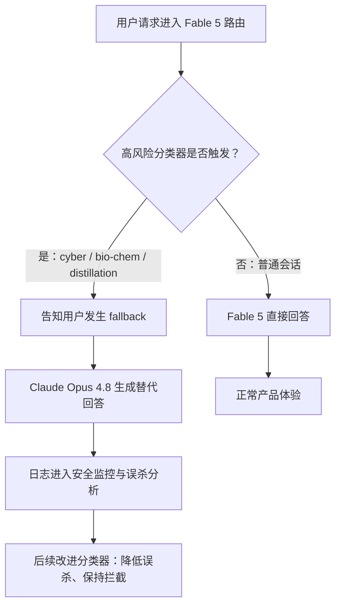
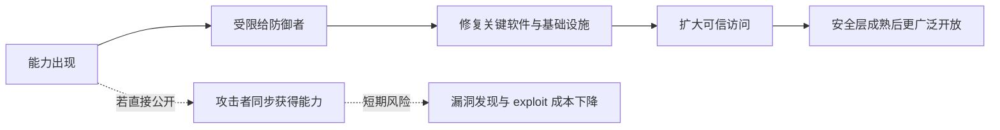

# Claude Fable 5 / Mythos 5：Anthropic 把“同一底座模型”拆成公开能力与可信高危访问

## 元信息

- **原文**：[Claude Fable 5 and Claude Mythos 5](https://www.anthropic.com/news/claude-fable-5-mythos-5)
- **发布时间**：2026-06-09
- **类型**：官方发布与安全治理说明
- **方向**：AI 安全 / Agent 能力治理 / 高危能力访问控制
- **相关材料**：
  - [Assessing Claude Mythos Preview’s cybersecurity capabilities](https://red.anthropic.com/2026/mythos-preview/)
  - [Project Glasswing: An initial update](https://www.anthropic.com/research/glasswing-initial-update)
  - [Anthropic Risk Report: February 2026](https://cdn.sanity.io/files/4zrzovbb/website/097c63b5fe7dd8b14866e1f15bb1910ec713658a.pdf)

## TL;DR

- Anthropic 在 2026-06-09 同时发布 **Claude Fable 5** 与 **Claude Mythos 5**，核心说法不是“又一个更强模型”，而是把同一 Mythos-class 底座模型拆成两种访问面：
  - **Fable 5**：面向一般用户开放，但在网络安全、生物化学、模型蒸馏等高风险主题上触发分类器，由 Claude Opus 4.8 接管回答。
  - **Mythos 5**：同一底座模型，在部分高风险能力上解除 safeguard，只给 Project Glasswing 的网络防御伙伴和未来少量生命科学研究者使用。
- 这篇发布最值得读的点是 **安全产品结构**：
  - 它把“能力是否开放”从单一开关改成三层控制：公开可用模型、fallback 低风险响应、可信访问计划。
  - 它承认高能力模型在网络攻防与生物研究里具有显著双重用途，并把误杀率、数据留存、红队与政府协作写进发布叙事。
- 关键数字与证据：
  - Fable 5 / Mythos 5 定价为每百万输入 token **10 美元**、每百万输出 token **50 美元**，低于 Mythos Preview 的一半。
  - Anthropic 称 Fable 5 的高风险分类器平均在 **低于 5% 的 sessions** 中触发，因此超过 95% 的 sessions 不会 fallback。
  - Mythos Preview 的网络安全技术报告里，模型在 Firefox 漏洞转 exploit 的复现实验中，相比 Opus 4.6 的数百次尝试仅 2 次 shell exploit，Mythos Preview 产出 181 次工作 exploit，并有 29 次额外达到寄存器控制。
  - 在约 7000 个 OSS-Fuzz entry points 的内部评估里，Mythos Preview 达到 595 个 tier 1/2 crash，并在 10 个 fully patched targets 上达到 tier 5 control-flow hijack。
  - 对 198 份人工复核漏洞报告，外部专家与模型严重性评级完全一致的比例为 **89%**，相差不超过一级的比例为 **98%**。
- 局限与边界：
  - 发布页里的能力表、客户反馈和生命科学案例仍主要是厂商自述；完整系统卡没有在可访问页面中展开所有细节。
  - “fallback 到 Opus 4.8”不是拒答，也不是证明高危能力完全安全；它更像把高风险能力从一般模型通道迁移到较低风险能力层。
  - 30 天数据留存能帮助检测跨请求攻击和误杀，但同时改变了企业用户对高能力模型的数据治理预期。

## 这篇发布真正关心什么？

### 不是模型命名，而是“同一能力如何分发”

Anthropic 对 Fable 5 与 Mythos 5 的叙事很清楚：

- **底座层**：Fable 5 与 Mythos 5 是同一 Mythos-class 能力层。
- **默认开放层**：Fable 5 面向一般用户，保留高风险 safeguard。
- **例外访问层**：Mythos 5 给特定网络防御、基础设施和未来生命科学研究者，解除部分 safeguard。
- **降级响应层**：触发高风险分类器时，不让 Fable 5 直接回答，而是切到 Claude Opus 4.8。

换句话说，这不是传统“旗舰模型全面发布”的路线。

它更像一个能力分发实验：

| 层级 | 面向对象 | 能力状态 | 风险控制 | 文章里的证据 |
|---|---|---|---|---|
| Fable 5 | 普通用户、API、企业计划 | Mythos-class，默认开放 | 网络安全、生化、蒸馏等主题触发分类器后 fallback | 平均低于 5% sessions 触发 safeguard |
| Opus 4.8 fallback | 被分类器拦截的普通请求 | 次高能力模型 | 作为较低风险替代回答 | 用户会被告知 fallback 发生 |
| Mythos 5 | Glasswing 伙伴、可信 cyber 组织 | 同一底座模型，部分 safeguard 解除 | 受限访问、政府协作、可信计划 | 面向 cyber defenders 与基础设施提供者 |
| Biology trusted access | 未来少量生命科学组织 | 去除生物/化学 safeguard，但保留 cyber safeguard | 小规模准入、逐步扩展 | 覆盖基础与转化研究组织 |

这个结构的关键含义是：

- “开放模型”不再等于“开放完整能力”。
- “安全发布”不再只是系统提示词、拒答策略或模型卡，而是访问面、替代模型、数据留存、红队和伙伴计划的组合。
- “能力评估”被放进产品发布页，但真正要判断其安全性，需要把发布页与风险报告、Glasswing 技术报告放在一起读。

### 为什么这和 AI 安全强相关？

Fable 5 / Mythos 5 的发布把一个长期抽象的安全问题变成了产品接口问题：

- 当前沿模型在某些高风险领域已经足够强时，厂商应该：
  - 完全不发布？
  - 全量发布但加强拒答？
  - 只给可信用户？
  - 公开一个被截断能力面的版本？
- Anthropic 的答案是第三和第四种的组合：
  - 对普通用户给 Fable 5。
  - 对高风险能力给分类器、fallback、留存和监控。
  - 对防御性高价值场景给 Mythos 5 的受限访问。

这使文章的主线不是“Fable 5 跑分很强”，而是：

> 当模型能力跨过 cyber / bio / agentic autonomy 的高风险阈值，发布策略本身必须变成安全机制。

## 作者如何展开论证？

### 第一段：先承认能力越强，风险越具体

发布页开头先把 Fable 5 定义为“已经适合一般使用的 Mythos-class model”。

随后紧接着承认：

- 它在软件工程、知识工作、视觉、科学研究等任务上达到 Anthropic 迄今最高的公开能力。
- 任务越长、越复杂，Fable 5 相比旧模型的优势越明显。
- 但在网络安全等领域，如果没有 safeguard，这种能力可能被滥用造成严重损害。

这是一种有意的论证顺序：

1. 先给出能力提升。
2. 立即把能力提升和 misuse risk 绑定。
3. 再提出 Fable / Mythos 双轨发布作为解决方案。

这和常见模型发布不同。

很多模型发布会把安全章节放在后半段，像附录一样补上；这里安全是产品命名和访问结构的一部分。

### 第二段：用 fallback 替代简单拒答

Fable 5 的新 safeguard 不是简单地拒绝所有高风险请求。

文章说，当分类器判断请求涉及特定高风险主题时：

- Fable 5 不直接响应。
- 请求会由 Claude Opus 4.8 处理。
- 用户会被告知发生了 fallback。
- Anthropic 表示 Opus 4.8 本身仍是高能力模型，因此体验会优于直接拒答。

这个设计的安全意义在于：

| 传统拒答 | Fable 5 fallback |
|---|---|
| 输出“不能帮助” | 输出由较低风险模型生成的替代回答 |
| 安全边界直接暴露为拒答体验 | 安全边界变成路由机制 |
| 用户可能反复改写提示试探边界 | 用户至少能得到低风险层的回答 |
| 容易把 benign 和 malicious 同时挡掉 | 仍可能误杀，但目标是降低体验损失 |

但是，这里也有一个重要边界：

- fallback 并不等于请求本身安全。
- fallback 只说明 Fable 5 这层能力没有被释放。
- 如果 Opus 4.8 在某些高风险主题上也存在误判或能力足够强，仍需要单独评估。

### 第三段：把误杀写进发布叙事

Anthropic 明确说分类器会比较保守，有时会拦截 harmless requests。

这个声明很关键。

它承认三个现实：

- 高风险分类器不可能只拦恶意请求。
- 双用途领域里，合法研究和攻击准备经常共享词汇、工具和步骤。
- 高能力模型的 safeguard 不只是“能否拦住坏请求”，还要看误杀对正常科研、防御、工程工作的影响。

文章给出的运营指标是：

$$
fallback\_rate = \frac{\text{触发分类器并改由 Opus 4.8 处理的 sessions}}{\text{所有 Fable 5 sessions}}
$$

发布页里的说法可以转成一个粗略解释：

- 平均而言，fallback_rate < 5%。
- 因此：

$$
non\_fallback\_sessions > 95\%
$$

这个数字不能证明 safeguard 准确。

它只能说明：

- 对多数普通会话，Fable 5 不会被降级。
- 对高风险会话，用户体验和能力释放会被安全层重写。
- 对厂商来说，后续关键优化目标是降低 false positive，同时不扩大 false negative。

## 能力证据：哪些是强证据，哪些只是发布页叙事？

### 发布页给了哪些能力线索？

发布页把能力分成几组：

- **软件工程**：
  - Stripe 的早测案例称，Fable 5 在 5000 万行 Ruby 代码库中完成一次全代码库迁移。
  - Cognition 的 FrontierCode 评估中，Fable 5 在中等 effort 下也表现很强。
- **知识工作**：
  - Hebbia 金融 benchmark、IMC 交易分析评估、法律 redline 等客户反馈。
- **视觉与长程任务**：
  - 从科学图中抽取精确数字。
  - 仅用视觉完成 Pokémon FireRed。
  - 用文件式 persistent memory 玩 Slay the Spire，收益高于 Opus 4.8。
- **生命科学**：
  - Mythos 5 加速蛋白设计流程。
  - 内部科学家在分子生物学假设盲评中更偏好 Mythos 产出。
  - 一个 genomics 研究案例中，模型自主工作超过一周，训练出比一篇 Science 近期模型小 100 倍但表现更好的模型。

这些材料适合当作 **能力线索**，但不都能当作强实验证据。

原因很简单：

- 很多数字来自客户反馈或内部评估。
- benchmark 表以图片形式展示，公开页没有给出完整评测协议。
- 生命科学结果还说会在未来数月发布，并非完整论文。
- “长期自主任务”案例有很强展示价值，但缺少可复现实验细节。

因此，读者应该把发布页里的能力证据分级：

| 证据类型 | 可用性 | 适合支持的结论 | 不适合支持的结论 |
|---|---:|---|---|
| 官方定价、可用性、访问限制 | 高 | 产品策略与访问边界 | 模型真实性能 |
| fallback 触发率 | 中 | 普通 sessions 的降级频率 | 分类器准确率、攻击防护上限 |
| 客户 quote | 中低 | 早期用户感受、任务方向 | 横向模型排名 |
| 内部 benchmark 图片 | 中 | Anthropic 自评能力方向 | 独立可复现排名 |
| Glasswing 技术报告 | 较高 | 网络安全能力阈值已明显变化 | Fable 5 当前全部安全性 |
| 风险报告 | 较高 | Anthropic 的威胁模型与治理框架 | 某个新模型的完整系统卡结论 |

### 真正强的背景证据来自 Mythos Preview 技术报告

Fable/Mythos 5 发布页不断引用 Project Glasswing 与 Mythos Preview。

这很重要，因为 Mythos Preview 技术报告给了更具体的网络安全证据。

其中几个数字说明了为什么 Anthropic 认为必须限制 Mythos-class 能力：

| 评估或案例 | 报告里的关键发现 | 安全意义 |
|---|---|---|
| Firefox 147 JavaScript engine | Opus 4.6 数百次尝试只生成 2 次 shell exploit；Mythos Preview 生成 181 次 working exploits，并有 29 次额外达到 register control | exploitation 能力从偶发现象变成可重复能力 |
| OSS-Fuzz corpus | 约 7000 个 entry points 中，Mythos Preview 达到 595 个 tier 1/2 crash，并有 10 个 tier 5 control-flow hijack | 模型能规模化搜索真实开源项目 bug |
| OpenBSD SACK | 找到一个存在 27 年的 bug | 能发现经过长期审计仍遗漏的问题 |
| FFmpeg H.264 | 找到 16 年历史的漏洞，且 ASan 等工具可验证 crash | 语言模型能补足 fuzzing 与人工审计的盲区 |
| 人工复核 | 198 份漏洞报告中，专家完全同意严重性评级 89%，一级内一致 98% | 模型不只是产生噪声，也能辅助优先级判断 |

这类证据比发布页里的客户 quote 更能支撑安全主张。

它说明：

- 高能力模型不仅能修 bug，也可能显著降低找 exploit 的成本。
- 防御与攻击的能力边界高度重叠。
- 厂商如果公开完整能力，就不能只依赖“用途声明”来防止滥用。

## Safeguard 机制：分类器、fallback、可信访问和留存

### 机制一：高风险主题分类器

Fable 5 的分类器覆盖三类主题：

- **Cybersecurity**：
  - exploitation。
  - offensive cyber tasks。
  - agentic hacking 中的侦察、发现、横向移动等链式任务。
- **Biology and chemistry**：
  - 可能提升危险生物/化学能力的查询。
  - 与 AAV 等双用途设计相关的高能力任务。
- **Distillation**：
  - 大规模抽取模型能力，训练竞争模型或扩散近前沿能力。

这三个类别不是随机选择。

它们对应的是 Anthropic 风险报告里的几条高优先级路径：

- 化学/生物武器相关能力。
- 高能力模型自动化研发。
- 高风险网络攻击。
- 高能力模型扩散。

### 机制二：fallback，而不是“硬拒答”

可以把 Fable 5 的路由写成一个简化流程：

这个流程有两个研究意义：

- 它把 safeguard 从输出层拒答前移到 **模型选择层**。
- 它把模型安全从“单模型行为”扩展成 **系统路由行为**。

也就是说，真实产品里的安全性不是 Fable 5 单独决定的。

它由下面的组合决定：

$$
Safety = f(Classifier, Routing, FallbackModel, Logging, AccessControl, RedTeam)
$$

变量解释：

- $Classifier$：能否识别高风险请求与 jailbreak 尝试。
- $Routing$：触发后是否可靠切换到低风险响应路径。
- $FallbackModel$：替代模型本身是否足够有用且风险较低。
- $Logging$：能否发现跨请求攻击、长期滥用和误杀模式。
- $AccessControl$：谁能拿到解除 safeguard 的能力层。
- $RedTeam$：内部与外部攻击者能否持续发现绕过路径。

### 机制三：Mythos 5 的可信访问

Mythos 5 的定位更敏感：

- 它和 Fable 5 是同一底座模型。
- 但在部分场景下移除 safeguard。
- 先给 Project Glasswing 当前用户升级。
- 未来通过 trusted access program 扩展到更多网络安全组织。
- 生命科学方向也会开放小规模可信访问，但 cyber safeguard 仍保留。

这构成一个分区模型：

| 风险领域 | 普通 Fable 5 | Mythos 5 cyber 访问 | Mythos 5 biology 访问 |
|---|---|---|---|
| 一般知识工作 | 开放 | 开放 | 开放 |
| 软件工程 | 开放 | 开放 | 开放 |
| 攻防网络安全 | 分类器触发，fallback | 对可信 cyber 防御组织解除部分限制 | 仍保留 cyber safeguard |
| 生物/化学 | 分类器触发，fallback | 未必解除 | 对少量生命科学研究者解除相关 safeguard |
| 模型蒸馏 | 分类器触发，fallback | 仍需约束 | 仍需约束 |

这个设计最值得注意的地方是：

- Anthropic 没有把“可信访问”定义成一个统一白名单。
- 它按风险领域拆权限：
  - 网络安全可信访问不必自动包含生物化学能力。
  - 生物研究可信访问也不应自动包含网络攻击能力。

这是比“给某个机构完整高级模型访问”更细的安全边界。

### 机制四：30 天数据留存

Fable 5 / Mythos 5 及未来同级能力模型会要求 30 天数据留存。

文章给出的理由是：

- 检测复杂和新型攻击。
- 识别跨多请求的 jailbreak。
- 降低 false positives。
- 支撑安全调查与模型防护改进。

这对企业用户是一个明确变化：

- 过去高端企业模型常把“短保留或零保留”作为卖点。
- 这里 Anthropic 把更高能力层和更强留存绑定。
- 用户获得更高能力，也接受更强安全观测。

可以把它理解成：

$$
HighCapabilityAccess \Rightarrow MonitoringObligation
$$

这个公式不是技术必然，而是治理选择。

它把高能力模型的访问成本从价格扩展到数据治理：

- 钱的成本：10 / 50 美元每百万 token。
- 误杀成本：高风险主题可能 fallback。
- 隐私成本：30 天保留和人工访问审计。
- 组织成本：可信访问需要申请、准入、监控和用途边界。

## 关键段落细读

### “少于 5% sessions fallback”说明什么？

这个数字容易被误读。

它并不说明分类器“准确率 95%”。

更合理的读法是：

- 在整体产品流量中，大多数会话不会触及高风险边界。
- 因此 Fable 5 的大部分使用体验接近 Mythos 5。
- 但在网络安全、生物化学、蒸馏等主题上，能力会被系统性降级。

需要追问的是：

- fallback sessions 里，哪些是真正恶意？
- 哪些是合法防御或研究？
- false positive 在网络防御团队、生物研究者、教育用户中是否分布不均？
- 攻击者是否能通过多轮交互把高风险意图拆成低风险片段？

所以这个数字的研究价值在于提供了一个运营观测入口，而不是安全结论。

### “外部红队没找到 universal jailbreak”说明什么？

发布页提到外部红队组织目前没有找到长程 agentic tasks 上的 universal jailbreak，但 UK AISI 在短时间窗口内取得了一些进展。

这段话的边界非常重要：

- 没找到 universal jailbreak，不等于没有 jailbreak。
- 没找到长程通用绕过，不等于单任务、短任务、工具链绕过不存在。
- 红队时间窗口、任务复杂度、可用工具和模型版本都会改变结果。

这更像一个动态安全声明：

| 声明 | 可支持程度 | 仍需验证 |
|---|---|---|
| 长程任务上没有被外部团队快速打穿 | 中 | 红队时间、任务集、攻击预算 |
| 系统比旧公开模型更抗 cyber jailbreak | 中 | 公平横向对比与公开协议 |
| 可完全阻止 universal jailbreak | 低 | 文章自己也承认几乎不可能完全防止 |
| 可把剩余绕过成本提高到可检测范围 | 待观察 | 需要真实滥用监控与后续透明报告 |

### “Fable 与 Mythos 只是 safeguards 不同”意味着什么？

这句话是整篇发布最关键的产品事实。

如果两个模型底座相同：

- 能力差异主要来自安全层，而不是模型本体。
- 公开模型的真实上限被 safeguard 截断。
- 可信访问计划实际上是在管理“截断前能力”的分发。

这会改变我们读模型评测的方式。

当一个任务涉及高风险能力时，公开用户测到的 Fable 5 表现可能不是底座模型能力，而是：

$$
ObservedPerformance = BaseCapability - SafeguardIntervention + FallbackUtility
$$

其中：

- $BaseCapability$ 是 Mythos-class 底座能力。
- $SafeguardIntervention$ 是分类器拦截带来的能力损失。
- $FallbackUtility$ 是 Opus 4.8 替代回答保留的有效帮助。

因此，普通 benchmark 如果没有区分 safeguard 是否触发，可能会混淆两个问题：

- 模型本体会不会做？
- 产品安全层允许不允许做？

## 这套发布策略的优点

### 优点一：承认高风险能力不是二元开关

很多 AI 安全讨论容易落入二分：

- 要么开放。
- 要么封禁。

Fable/Mythos 方案更接近权限系统：

- 一般能力开放。
- 高风险主题 fallback。
- 可信防御者可申请更高权限。
- 不同领域权限独立控制。

这符合双用途技术的现实。

网络安全里，同一个能力可以用于：

- 找漏洞并修复。
- 找漏洞并攻击。
- 写 PoC 做验证。
- 写 exploit 做滥用。

简单地全拒绝会伤害防御者。

简单地全开放会提升攻击者。

### 优点二：把监控写入能力分发条件

30 天留存会让一些企业用户不舒服，但它也体现了一条安全假设：

- 对越强模型，越不能只看单轮输出。
- 很多滥用需要跨请求、跨任务、跨账号拼接。
- 如果完全不保留数据，厂商很难发现慢速 jailbreak、分布式滥用和误杀模式。

从研究角度看，这和 Agent 安全尤其相关。

Agent 不是一次性问答系统。

Agent 风险常常来自：

- 多轮规划。
- 工具调用。
- 文件记忆。
- 任务拆解。
- 外部环境反馈。

因此，安全监控也必须跨轮次和跨工具链。

### 优点三：把可信访问限定在防御性收益更高的场景

Project Glasswing 的逻辑是：

- 既然高能力模型迟早会扩散，防御者需要提前适应。
- 关键基础设施、开源维护者和安全测试者应先拿到能力。
- 但这种访问不应等同于一般公开发布。

这实际上是在构造一个时间差：

这个时间差是否足够，文章没有证明。

但它给出了 Anthropic 当前的治理假设：

- 先让防御方建立实践。
- 再逐步扩大可用范围。
- 用分类器和留存降低公开面的风险。

## 主要风险与未解问题

### 风险一：分类器边界可能被任务拆解绕过

高风险请求不一定长得像高风险请求。

攻击者可以把一个危险目标拆成：

- 合法调试请求。
- 普通系统配置问题。
- 代码解释。
- 环境枚举。
- 伪装成防御目的的 exploit 验证。

如果分类器按单轮请求判断，可能漏掉跨轮意图。

如果分类器按 session 判断，问题又变成：

- session 边界如何定义？
- 多账号、多项目、多 API key 如何关联？
- 企业隐私与安全监控如何平衡？

这也是 30 天留存的动机之一，但发布页没有给出足够细的监控协议。

### 风险二：fallback 模型也可能有足够高能力

Opus 4.8 被用作 fallback，是因为它相比 Fable/Mythos 风险更低。

但它仍是强模型。

因此要追问：

- 对哪些 cyber / bio / distillation 请求，Opus 4.8 足够安全？
- fallback 是否也会触发自己的拒答或更细分类器？
- 如果用户把高风险任务拆成多步，Opus 4.8 是否仍可能提供关键帮助？

如果没有这些细节，fallback 更像一个合理方向，而不是完整安全证明。

### 风险三：可信访问本身需要治理

Mythos 5 解除部分 safeguard 后，安全压力转移到准入与审计。

需要回答的问题包括：

- 哪些组织能申请？
- 谁判断“防御性用途”？
- 使用过程是否受限于隔离环境？
- 产出的漏洞报告如何处理？
- 是否允许自动化批量扫描？
- 模型输出的 exploit 或 PoC 如何保存、分享和销毁？

Glasswing 技术报告中有负责任披露、人工复核和 hash commitment 等做法。

但当 trusted access 从少数伙伴扩展到更多组织时，治理成本会显著上升。

### 风险四：生命科学 trusted access 的边界更难解释

网络安全至少有较成熟的 bug bounty、CVE、responsible disclosure、隔离测试环境。

生命科学更复杂：

- 实验验证周期更长。
- 生物化学知识的危险边界更难通过请求文本判断。
- 一个假设是否危险，常常取决于实验资源、试剂、设施和背景知识。
- “去除生物/化学 safeguard，但保留 cyber safeguard”说明权限可以拆分，但没有说明生物能力的细粒度控制方式。

因此，biology trusted access 可能比 cyber trusted access 更需要制度设计，而不只是技术分类器。

## 与 Anthropic 风险报告的关系

Anthropic 2026 年 2 月风险报告把高优先级风险分成几个大类：

- 高风险 sabotage。
- 自动化 R&D。
- 非新型化学/生物武器生产。
- 新型化学/生物武器生产。

Fable/Mythos 发布几乎正好落在这些威胁模型的交叉点上：

| 风险报告威胁模型 | Fable/Mythos 发布中的对应点 |
|---|---|
| 高风险 sabotage | 长程 autonomous work、agentic coding、企业系统接入 |
| 自动化 R&D | 生命科学假设、基因组研究、科学图表理解 |
| 非新型 CB weapons | 生物/化学分类器与 fallback |
| 新型 CB weapons | biology trusted access 小规模开放 |
| 网络攻击能力 | Project Glasswing、cyber classifier、Mythos 受限访问 |
| 能力扩散 | distillation 请求触发 fallback |

这说明 Fable/Mythos 不是一个孤立产品发布。

它像是风险报告中抽象威胁模型的一次产品化落地：

- 威胁模型变成分类器覆盖范围。
- 安全缓解变成 fallback 和访问控制。
- 监控需求变成 30 天保留。
- 高价值正用途变成 trusted access。

## 对 Agent 安全研究的启发

### 启发一：评测应该区分“底座能力”和“产品能力”

未来 Agent benchmark 如果测公开模型，需要记录：

- 是否触发 safety fallback。
- 触发在哪一步。
- fallback 后是哪一个模型回答。
- 任务失败是因为能力不足，还是因为安全层介入。

否则，同一模型可能出现两种完全不同的解释：

- “模型不会做这个任务。”
- “模型会做，但产品路由不允许它在这个场景释放能力。”

对高风险 benchmark，这个区分非常关键。

### 启发二：Agent 安全要从单轮拒答转向系统权限

Fable/Mythos 的方案更像操作系统权限：

- 普通用户默认权限。
- 高危操作触发权限检查。
- 可信用户在特定目录下获得更高权限。
- 操作日志用于审计。
- 不同能力域分别授权。

这比“模型应该拒绝什么”更接近 Agent 时代的安全问题。

Agent 会使用工具、读写文件、调用 API、持续执行任务。

因此需要的安全对象包括：

- prompt。
- tool call。
- memory。
- external environment。
- user identity。
- organization policy。
- task history。

### 启发三：防御者优先访问是一种安全实验

Project Glasswing 的逻辑不是没有争议。

它默认：

- 防御者能比攻击者更快把能力转化为修复。
- 受限访问能防止能力泄漏或滥用。
- 厂商能足够准确地识别可信组织。
- 披露和修复流程能承载模型发现的大量漏洞。

这些假设都需要后续证据。

但它提出了一个重要研究方向：

> 当前沿模型能显著降低安全研究成本时，关键问题可能不再是“模型能不能找漏洞”，而是“社会能不能吸收它找出的漏洞”。

## 继续追问

### 给研究者的问题

- 如何公开评测 safeguard，而不暴露可直接复用的绕过方法？
- 如何衡量 fallback 机制的 false positive 与 false negative？
- 如何设计 benchmark，区分模型底座能力、产品路由、安全拒答和访问权限？
- 如何判断 trusted access 真的让防御者获得净优势？
- 如何在不泄露敏感数据的前提下审计 30 天留存的访问和使用？

### 给工程团队的问题

- 如果企业使用 Fable 5 做安全扫描或代码审计，哪些请求会被 fallback？
- fallback 后结果是否满足合规、审计和复现要求？
- 组织能否配置自己对 cyber / bio / distillation 分类器的误杀反馈？
- 高风险任务是否需要独立的审计日志、审批流和沙箱？
- 使用 Mythos-class 能力时，数据保留政策是否改变合同、合规和内部安全流程？

### 给政策制定者的问题

- trusted access 应该由厂商单独定义，还是需要行业或政府共同标准？
- 高危能力访问是否需要类似漏洞披露制度的透明报告？
- 当模型能规模化发现漏洞时，维护者是否有足够资源处理报告？
- 生命科学能力的可信访问是否需要比 cyber 更严格的实验设施和用途审查？

## 结论：这是一次“能力产品化”的安全边界实验

Claude Fable 5 / Mythos 5 的发布，最重要的不是模型名字。

它展示了一种新的前沿模型分发方式：

- 同一底座能力。
- 两个产品面。
- 三类高风险分类器。
- 一个 fallback 模型。
- 一个 cyber trusted access 计划。
- 一个 biology trusted access 计划。
- 一个 30 天留存与安全监控制度。

这套设计有清晰优点：

- 它承认高危能力的双用途。
- 它没有把防御者和攻击者简单混为一谈。
- 它把能力释放、访问控制和安全观测绑在一起。

但它也留下关键不确定性：

- 分类器能否抵抗跨轮、跨账号、跨工具链拆解？
- fallback 到 Opus 4.8 是否足够安全？
- trusted access 扩大后，治理和审计是否跟得上？
- 30 天留存如何被企业和研究机构接受？
- 公开发布页里的能力主张何时能被独立复现？

从 AI 安全角度看，这篇文章值得持续跟踪。

因为它把“前沿能力发布”从一次模型上线，变成了一个包含路由、权限、监控、误杀、可信访问和披露流程的系统问题。

如果未来模型能力继续沿这个方向增长，那么真正需要评测的对象将不只是模型，而是：

$$
FrontierDeployment = Model + Safeguards + AccessPolicy + Monitoring + DisclosureProcess
$$

Fable 5 / Mythos 5 是这个公式的一次高调公开试验。

