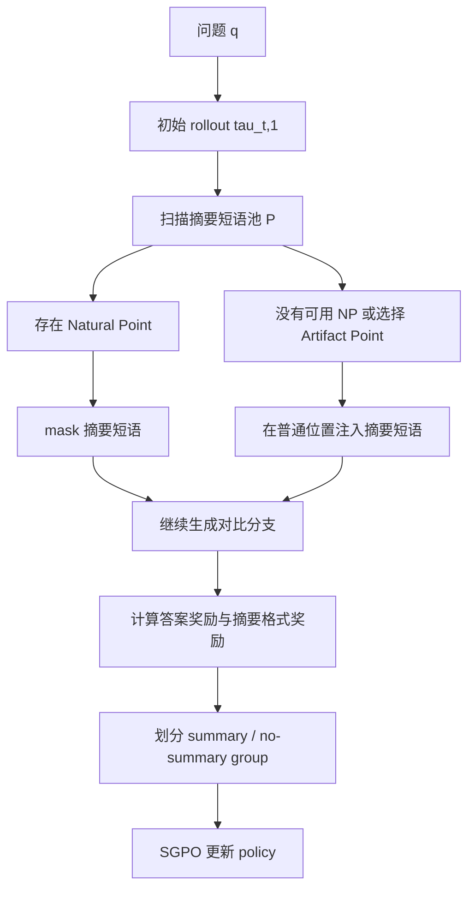

# ReSum：把“自我摘要”训练成长程推理里的内生控制器

## 元信息与 TL;DR

- **原文**：[ReSum: Synergizing LLM Reasoning and Summarization with Reinforcement Learning](https://arxiv.org/abs/2606.13316)
- **类型**：论文
- **发布时间**：2026-06-11 13:10:48 UTC
- **作者**：Xucong Wang、Ziyu Ma、Yong Wang、Shidong Yang、Hailang Huang、Renda Li、Pengkun Wang、Xiangxiang Chu
- **机构**：中国科学技术大学、阿里巴巴高德
- **方向**：大模型后训练、RLVR、长链推理、自我摘要、上下文压缩
- **代码页**：[github.com/xuc865/Resum](https://github.com/xuc865/Resum)
- **图片取舍**：未本地化图片。论文图和表的关键信息已在正文中用 Mermaid、Markdown 表格、公式解释块和伪代码重建。

### TL;DR

- **问题**：RLVR 能提升长链推理，但也会奖励越来越长的 rollout。模型在长推理中容易重复验证、遗忘早期步骤、把错误前缀继续放大，最终消耗上下文预算。
- **核心想法**：ReSum 不把摘要当外部模块，而是训练模型在推理内部自己判断“何时总结、怎样总结”。摘要在这里不是输出压缩，而是长程推理里的控制动作。
- **方法**：ReSum 从 rollout 中找两类分支点：Natural Points 是模型自然写出摘要短语的位置，Artifact Points 是非摘要位置上人工注入摘要短语的位置。它用成对分支比较“有摘要”和“无摘要”后续轨迹，训练 Summarization-aware Group-relative Policy Optimization。
- **奖励设计**：基础奖励仍是可验证答案正确性，同时给自然摘要和人工摘要一个小的格式奖励；优势函数把 summary group 和 no-summary group 分开标准化，再合并为训练信号。
- **关键数字**：Qwen2.5-Math-7B 上，GRPO 六个数学 benchmark 平均 37.61，DGPO 39.79，ReSum 41.64；相对 GRPO 提升 **4.03 个百分点**。
- **跨模型证据**：Qwen2.5-Math-1.5B 从 GRPO 29.39 提升到 ReSum 33.07；Qwen2.5-3B 从 25.47 提升到 28.81；DeepSeek-Math-7B 从 14.91 提升到 17.32。
- **多模态证据**：GEOQA-8K 上，Qwen2.5-3B-VL-Instruct 的 GRPO 为 57.43，DGPO 为 59.95，ReSum 达到 **62.04**，说明收益不只来自纯文本数学。
- **效率证据**：论文报告 ReSum 平均提升约 **4%**，同时 rollout 长度减少 **18.6%**；Appendix E 说明训练开销相对 DGPO 增加约 **13%**，主要来自分支点识别与分支执行。
- **局限**：自然摘要点依赖简单关键词匹配；任务主要是数学推理和一个几何多模态 benchmark；T/J 分支超参需要人工调；代码生成、开放问答和真实 Agent 环境未验证。

## 研究问题：为什么“越想越久”会变成后训练问题？

### RLVR 的收益和副作用

论文讨论的对象是 **Reinforcement Learning with Verifiable Rewards**，也就是用可验证奖励训练模型：

- 数学题：答案是否正确。
- 代码题：测试是否通过。
- 搜索题：最终回答是否满足可检查标准。
- Agent 任务：轨迹是否达到可判定终点。

这个范式的吸引力很直接：

- 不需要复杂的人类偏好标注。
- 可以用二值或规则奖励推动长链推理。
- 与 GRPO、DAPO、GSPO、DGPO 等 critic-free 或轻量 RL 方法兼容。

但 ReSum 关注的是另一个副作用：

- 训练奖励常常偏向更长的 Chain-of-Thought。
- 模型学会多写步骤、多验证、多重试。
- 长 rollout 会积累无关历史，让关键条件被稀释。
- 错误前缀一旦进入上下文，后续 token 会围绕这个错误继续展开。

用一句话概括：

> ReSum 不是问“怎样让模型多想一步”，而是问“怎样让模型在该整理上下文时停下来，把自己已经想过的东西压成可继续使用的状态”。

### 论文把摘要重新定义成控制动作

传统摘要常被看成：

- 任务后的说明。
- 长文压缩。
- 外部 memory manager。
- 上下文工程里的独立模块。

ReSum 的定义更窄，也更有训练意义：

- 摘要发生在推理途中。
- 摘要由同一个 policy 自己生成。
- 摘要影响后续 rollout 的分布。
- 摘要是否有价值由后续答案奖励反推。

这使摘要从“文本操作”变成了“策略动作”：

| 视角 | 摘要的角色 | 风险 | ReSum 的处理 |
|---|---|---|---|
| 外部压缩 | 工程模块把历史缩短 | faithfulness 由外部模块承担 | 不引入外部摘要器 |
| prompt 指令 | 提示模型定期总结 | 模型未必知道何时总结 | 用 RL 选择时机 |
| ReSum | policy 自己触发并优化摘要 | 摘要可能无效或错误 | 用对比分支和优势函数筛掉 |

关键转折是：

- 如果摘要真的让后续推理更好，它应该提高最终可验证奖励。
- 如果摘要只是形式化套话，它不应该得到优势。
- 如果某个错误前缀在摘要后被纠正，分支比较会把这种收益转成训练信号。

## 论文主张与论证路线

### Claim → Mechanism → Evidence → Boundary

| 层级 | 论文怎么说服读者 | 具体证据 |
|---|---|---|
| Claim | 自我摘要是长推理中的内生控制机制 | Figure 1 先展示摘要短语前后 entropy 变化和错误前缀恢复 |
| Mechanism | 用 AP/NP 对比 rollout，让模型学会何时摘要 | Methodology 里定义 Artifact Points、Natural Points、SGPO |
| Evidence | 数学、多模型、多模态、消融、效率都支持 | Table 1-6、Figure 3-5、Appendix E |
| Boundary | 不是所有任务已验证，不是无开销，不是完美摘要检测 | Appendix H 明确说明任务范围和 keyword matching 局限 |

### 两个 pilot study 的作用

论文开头不是直接提出算法，而是先证明“摘要行为值得被训练”：

1. **Entropy 观察**：
   - 模型在写出摘要短语之前，token-level entropy 往往更高。
   - 摘要短语之后，entropy 明显下降。
   - 解释：模型可能在高不确定状态下自然寻找一种整理机制。

2. **错误前缀干预**：
   - 论文截断错误 rollout 的不同位置。
   - 分别继续生成：不注入摘要短语 vs 注入摘要短语。
   - 注入摘要短语后，继续生成的正确率最高可提升约 **30%**。

这两个实验承担的论证功能不同：

- entropy 结果说明摘要不是随机装饰，而可能是模型遇到混乱状态时的自发反应。
- 错误前缀干预说明摘要不仅能缩短文本，还可能改变后续推理分布。

## 方法机制：ReSum 如何把摘要训练进 RLVR？

### 记号与基础设定

论文沿用 RLVR 记号：

- `q`：训练问题，来自数据集 `D`。
- `pi_theta`：当前策略模型。
- `pi_old`：采样 rollout 时冻结的旧策略。
- `pi_ref`：KL 正则使用的参考模型。
- `tau`：一次 rollout 轨迹。
- `R_A(tau)`：答案正确性的可验证奖励。
- `P`：摘要短语池，例如“总结一下”“归纳目前思路”等触发词集合。
- `T`：rollout tree 数量。
- `J`：每棵树的生成循环数。
- `B = T * J`：总 rollout budget，和 GRPO 的 group size 对齐。

GRPO 的基本思想是：

```text
同一个问题 q 采样 M 个回答
用组内 reward 均值和方差标准化 advantage
把每个 token 的 PPO-style ratio 乘上同一个 rollout advantage
```

ReSum 保留这个 critic-free 框架，但改变两件事：

- rollout 不再只是平铺的 M 个回答，而是从关键位置展开的树。
- advantage 不只看答案 reward，还看“摘要分支相对非摘要分支是否更有用”。

### 两类分支点：AP 与 NP

ReSum 的核心是构造对比：

| 分支点 | 来源 | 操作 | 它要回答的问题 |
|---|---|---|---|
| Natural Point, NP | 模型自然生成了摘要短语 | mask 掉摘要短语，再从该前缀继续生成 | 这个自然摘要是否真的帮助了后续推理？ |
| Artifact Point, AP | 普通非摘要位置 | 人工插入摘要短语，再继续生成 | 如果此处强制整理上下文，会不会更好？ |

这套设计很有意思：

- NP 是“保守验证”：模型本来想总结，ReSum 检查这个总结是否必要。
- AP 是“探索干预”：模型本来没总结，ReSum 试探此处摘要是否能改善结果。
- 两者合起来覆盖“何时保留自然摘要”和“何时主动引入摘要”。

### 数据流：从一次问题到一棵 rollout 树



这张图对应论文 Algorithm 1 的训练过程：

- 第一次生成给每棵树一个 anchor rollout。
- 从 anchor 中提取 NP 和 AP 候选。
- 后续循环只从 anchor 的分支点继续，不无限展开整棵树。
- 所有轨迹最后进入同一组 reward 和 advantage 计算。

## 奖励与目标函数：SGPO 到底多了什么？

### 基础奖励仍然是可验证正确性

论文没有把摘要奖励做成主目标。它先保留最硬的任务奖励：

```text
R_A(tau) = 1[Correct(tau)]
```

含义：

- 数学题最终答案正确，得 1。
- 答案错误，得 0。
- 这保证优化方向仍然是“解题正确”，不是“多写摘要”。

### 摘要格式奖励是小权重辅助项

Algorithm 1 里还定义了摘要相关奖励：

```text
如果轨迹 tau 中有摘要行为：

R_F(tau) = (0.2 * N_NP(tau) + 0.05 * N_AP(tau)) / (N_NP(tau) + N_AP(tau))

总奖励：

R(tau) = R_A(tau) + R_F(tau)
```

变量解释：

- `N_NP(tau)`：自然摘要短语出现数量。
- `N_AP(tau)`：人工注入摘要短语数量。
- `0.2`：自然摘要的辅助权重。
- `0.05`：人工摘要的辅助权重。

这个设计体现了一个偏好：

- 自然出现的摘要更接近模型真实策略，应更强地被识别和强化。
- 人工注入的摘要主要用于探索，不应该被过度奖励。
- 最终正确性仍由 `R_A` 决定，避免模型只学会模板化“总结一下”。

### Summarization-aware advantage

ReSum 把 rollout 分成两组：

```text
G_sum   = {tau: tau 中有摘要行为，或 tau 是 AP 分支}
G_nosum = {tau: tau 不属于 G_sum}
```

然后分别做组内标准化：

```text
A_sum(tau) =
  (R(tau) - mean(G_sum)) / (std(G_sum) + xi)

A_nosum(tau) =
  (R(tau) - mean(G_nosum)) / (std(G_nosum) + xi)

A_hat(tau) = A_sum(tau) + A_nosum(tau)
```

这个写法的含义不是简单“摘要好就奖励”：

- 在 summary group 内，它比较不同摘要位置和摘要轨迹谁更好。
- 在 no-summary group 内，它保留非摘要轨迹作为对照。
- 合并后的 advantage 让 policy 学到“哪些摘要行为相对同类更有效”。

### SGPO 目标函数的直觉版

论文的目标函数保留 PPO/GRPO 风格的 clipped ratio：

```text
maximize over theta:

E [
  average over trees t,
  average over rollouts e,
  average over tokens i:

  min(
    rho_{t,e,i}(theta) * A_hat(tau_{t,e}),
    clip(rho_{t,e,i}(theta), 1-epsilon, 1+epsilon) * A_hat(tau_{t,e})
  )
  - beta * KL(pi_theta || pi_ref)
]
```

变量解释：

- `rho_{t,e,i}`：新旧 policy 在某个 token 上的概率比。
- `A_hat(tau)`：上面定义的摘要感知优势。
- `epsilon`：PPO-style trust region 裁剪范围。
- `beta`：KL 正则强度。

换成训练直觉：

- 如果某条摘要分支比同问题的非摘要分支更容易得分，相关 token 被强化。
- 如果某个自然摘要点被 mask 后表现变差，原来的自然摘要行为被强化。
- 如果人工注入摘要没有改善，AP 分支不会获得优势。

## 伪代码：ReSum 训练管线

```text
Input:
  policy pi_theta
  reference policy pi_ref
  training set D
  tree count T
  generation loops J
  phrase pool P
  clipping epsilon
  KL coefficient beta
  stabilizer xi

For each training step:
  sample q from D
  freeze pi_old = pi_theta

  For each tree t in 1..T:
    generate initial rollout tau_t,1 from pi_old(q)
    detect Natural Points N_t by phrase pool P
    collect non-summary positions A_t
    save tau_t,0 as branching anchor

  For generation loop j in 1..J:
    For each tree t:
      If j == 1:
        keep the root rollout
      Else if N_t is not empty:
        choose next natural summary position p
        mask the matched summary phrase
        continue generation from masked prefix
        mark branch kind = np
      Else:
        sample artifact position p from A_t
        append a phrase sampled from P
        continue generation from injected prefix
        mark branch kind = ap

  For every trajectory tau:
    compute answer reward R_A(tau)
    count summary phrase matches
    compute format reward R_F(tau)
    set R(tau) = R_A(tau) + R_F(tau)

  Split trajectories into G_sum and G_nosum
  Compute summary-aware advantage A_hat(tau)
  Update pi_theta with clipped SGPO objective

Output:
  policy that learns when and how to self-summarize
```

这段伪代码里最关键的边界是：

- 分支来自初始 anchor，不是无限递归搜索。
- rollout budget 与 baseline 对齐，避免用更多样本换性能。
- 摘要短语池是行为检测工具，不是最终能力来源。

## 理论视角：摘要什么时候不伤害推理？

论文给出的理论解释可以压缩成一个条件式判断。

设：

- `H_<i`：第 `i` 个 token 之前的推理前缀。
- `S(H_<i)`：把前缀加上摘要操作后的压缩状态。
- `p*`：理想目标 continuation 分布。
- `Delta_i`：摘要前后目标 continuation 的 KL 差异。

公式：

```text
Delta_i = D_KL(
  p*(· | q, H_<i) || p*(· | q, S(H_<i))
)
```

如果满足：

- 摘要足够 faithful，`Delta_i <= delta`。
- reward 对 continuation distribution 的小扰动局部稳定。
- 被删除的上下文主要是冗余历史。

那么：

- summary branch 不会降低期望回报。
- 当冗余上下文阻碍后续推理时，summary branch 还会严格提升回报。

这个理论段落的价值不在于给出强保证，而在于解释 ReSum 的经验现象：

- 摘要不是越多越好。
- 摘要只有在压缩冗余且保留关键状态时才有用。
- 因此训练目标必须学习“何时摘要”，而不是固定间隔摘要。

## 实验设置：作者怎么控制比较公平？

### 数据、模型与评测

| 维度 | 设置 |
|---|---|
| 训练数据 | MATH，沿用 DGPO 设置 |
| 文本评测 | AIME24、AIME25、AMC23、Minerva、MATH500、Olympiad |
| 多模态评测 | GEOQA-8K |
| 文本 backbone | Qwen2.5-Math-7B、Qwen2.5-Math-1.5B、Qwen2.5-3B、DeepSeek-Math-7B |
| 多模态 backbone | Qwen2.5-3B-VL-Instruct |
| 实验硬件 | 8 张 NVIDIA H20 |
| 训练温度 | 1.0 |
| 评测温度 | 0.6 |
| 评测 top-p | 0.95 |
| 最大 completion 长度 | 4096 |

评测重复次数也有区分：

- AIME24、AIME25、AMC23：32 次平均。
- Minerva、MATH500、Olympiad：4 次平均。
- GEOQA-8K：4 次平均。

### baseline 的选择

论文比较的 baseline 覆盖几类后训练路线：

| Baseline | 核心关注点 |
|---|---|
| GRPO | critic-free group relative policy optimization |
| Dr. GRPO | 修正 R1-zero-like 训练中的若干问题 |
| GPG | 回到更简洁的 policy gradient 形式 |
| DAPO | token-level loss、动态采样、长度惩罚等大规模 RL 技巧 |
| GSPO | sequence-level importance ratio 与 trust region |
| GRPO-AD | difficulty-aware advantage reweighting |
| DGPO | difficulty-aware group policy optimization |

为了公平，作者做了三类调整：

- GPG 和 DAPO 中关闭 resampling 设计。
- GRPO-Lead 只保留 advantage reweighting，称为 GRPO-AD。
- MathForge 关闭 MQR，只保留 DGPO 核心 loss。

这个设置说明 ReSum 的比较目标不是“打败所有工程 trick”，而是验证摘要感知 advantage 是否是一个可叠加的训练信号。

## 主结果：ReSum 真的提升了吗？

### Table 1：Qwen2.5-Math-7B 六项数学任务

| Method | AIME24 | AIME25 | AMC23 | MATH500 | Minerva | Olympiad | Avg. |
|---|---:|---:|---:|---:|---:|---:|---:|
| Base Model | 12.19 | 4.79 | 35.23 | 48.60 | 15.07 | 16.33 | 22.04 |
| GRPO | 20.94 | 8.44 | 58.98 | 72.20 | 27.76 | 37.33 | 37.61 |
| DGPO | 23.85 | 10.21 | 61.02 | 74.25 | 31.07 | 38.33 | 39.79 |
| ReSum | 25.42 | 13.33 | 62.50 | 76.45 | 32.44 | 39.67 | 41.64 |

最值得看的是三个差距：

- ReSum vs GRPO：`41.64 - 37.61 = 4.03`。
- ReSum vs DGPO：`41.64 - 39.79 = 1.85`。
- AIME25 上 ReSum 达到 13.33，DGPO 为 10.21，GRPO 为 8.44。

这说明：

- 难题上收益更明显。
- ReSum 不是只靠 difficulty weighting。
- 自我摘要信号能补上 outcome-level reward 的盲区。

### Table 2：不同 backbone 上是否稳定？

| Backbone | GRPO Avg. | DGPO Avg. | ReSum Avg. | ReSum - GRPO |
|---|---:|---:|---:|---:|
| Qwen2.5-Math-1.5B | 29.39 | 30.71 | 33.07 | +3.68 |
| Qwen2.5-3B | 25.47 | 27.19 | 28.81 | +3.34 |
| DeepSeek-Math-7B | 14.91 | 16.53 | 17.32 | +2.41 |

这个表的意义是：

- ReSum 不依赖单个 Qwen Math 7B 设置。
- 小模型受益明显，可能因为小模型更容易在长上下文中遗忘或循环。
- DeepSeek-Math-7B 绝对分数较低，但相对仍提升。

更谨慎的理解是：

- 论文没有覆盖更多现代 instruction/reasoning 模型。
- 不同 backbone 的 baseline 绝对强弱差异很大。
- 但“摘要感知训练信号可迁移”这个结论有初步支撑。

### Table 3：能不能叠加到 GPG/DAPO/GSPO？

| Base Method | Base Avg. | +DGPO | +ReSum | ReSum 增益 |
|---|---:|---:|---:|---:|
| GPG | 37.93 | 38.92 | 40.76 | +2.83 |
| DAPO | 37.94 | 39.91 | 40.88 | +2.94 |
| GSPO | 37.71 | 39.32 | 40.17 | +2.46 |

这张表支持论文一个重要但容易被忽略的判断：

- ReSum 不是一个替代 DAPO/GSPO 的完整 RL 框架。
- 它更像一层“摘要感知 advantage adapter”。
- 现有方法负责 token/sequence 级更新稳定性，ReSum 负责上下文组织行为。

如果这个结论能在更大模型上成立，它对后训练工程很有价值：

- 可以把自我摘要作为行为层信号叠加到不同优化器。
- 不必重写整个 RL 系统。
- 适合长程 Agent、搜索和代码任务里的 rollout 管理。

### Table 4：多模态 GEOQA-8K

| Method | GEOQA-8K Avg. |
|---|---:|
| Base Model | 39.79 |
| GRPO | 57.43 |
| DGPO | 59.95 |
| ReSum | 62.04 |

多模态结果的作用是扩大适用边界：

- 几何题有图像输入和文本推理链。
- ReSum 没有改视觉编码器，也没有外部图像摘要模块。
- 收益来自文本推理链内部的自我整理。

但它不能证明：

- ReSum 已适用于任意多模态 Agent。
- 图像证据本身被更好利用。
- 工具调用或环境状态能被同样压缩。

这里更合理的结论是：

- 长链生成的冗余和自相矛盾不只出现在纯文本数学。
- 但真实 Web/GUI/代码 Agent 仍需要单独验证。

## 消融与失败边界：哪些组件真正重要？

### Table 5：rollout tree 怎么配？

| Rollout Budget | 配置 | Avg. | 相对 GRPO |
|---|---|---:|---:|
| B=2 | T=2, J=1 | 24.97 | -0.50 |
| B=4 | T=2, J=2 | 26.75 | +1.28 |
| B=4 | T=4, J=1 | 27.46 | +1.99 |
| B=16 | T=2, J=8 | 27.98 | +2.51 |
| B=16 | T=8, J=2 | 28.55 | +3.08 |
| B=16 | T=4, J=4 | 28.81 | +3.34 |

解释：

- 太小的 budget 下，分支开销压过收益。
- `T=4,J=1` 优于 `T=2,J=2`，说明初始轨迹多样性很重要。
- `T=4,J=4` 最好，说明多样初始轨迹和适度分支要平衡。

这给工程实现一个直接提示：

- ReSum 不是免费技巧。
- 训练时要给分支足够样本。
- 只在极低 budget 下套用，可能不如 GRPO。

### Table 6：AP、NP、SGPO 的消融

| Model | Full ReSum | w/o APs | w/o NPs | w/o SGPO |
|---|---:|---:|---:|---:|
| Qwen2.5-Math-1.5B | 33.07 | 31.21 | 30.11 | 32.39 |
| Qwen2.5-Math-7B | 41.64 | 40.73 | 38.94 | 40.48 |

最强信号是：

- 去掉 NP 下降最大。
- 去掉 AP 也下降，但幅度较小。
- 去掉 SGPO 后仍比 GRPO 好，说明 tree branching 本身有用，但优势函数确实进一步提升。

这说明自然摘要点很重要：

- 模型原本自然出现的摘要行为，可能携带真实的内部状态信号。
- 人工注入摘要更像探索补充。
- 如果只靠 prompt 强行要求“定期总结”，很可能抓不到合适时机。

### Appendix E：prompt refinement 为什么不够？

论文还比较了 naive prompt refinement：

- 在 prompt 里显式加入周期性摘要指令。
- 不做 RL 分支训练。
- 与 ReSum 比较。

作者报告的结论是：

- prompt refinement 没有带来稳定改善，有些设置还更差。
- 原因可能是模型没有经过训练，不知道在错误、冗余、混乱状态下如何使用摘要。
- 也就是说，摘要不是一句提示词就能稳定激活的能力，而要通过 reward 和分支比较塑形。

这个结论对 Agent 也很有启发：

- “每 N 步总结一次上下文”是常见工程手段。
- 但固定频率摘要可能压缩掉关键状态，或者只产生无效流水账。
- ReSum 指向的是 adaptive summarization：摘要时机应由轨迹状态决定。

## 训练动态与效率

### Figure 3：reward 动态

论文比较了 ReSum 和 DGPO 在 Qwen2.5-Math-1.5B、Qwen2.5-Math-7B 上的训练/评测 reward：

- ReSum 在两个模型规模上都保持更高 reward。
- 作者认为训练期提升可能有部分 latent overfitting。
- 但 inference 期更高上界和更快收敛，支持 ReSum 的泛化收益。

这里要注意：

- 论文没有给出所有曲线原始数据。
- 曲线结论主要作为辅助证据。
- 更强的证据仍是 Table 1/2 的 benchmark 结果和 Appendix E 的显著性检验。

### Figure 4：长度动态

长度结果更接近 ReSum 的核心 claim：

- 训练早期，ReSum rollout 可能更长。
- 原因是模型还不熟悉摘要行为。
- 随着训练推进，平均 rollout 长度下降。
- 最终相对 DGPO 减少约 **18.6%**。

关键不是“变短”本身，而是：

- 变短同时 reward 更高。
- 说明减少的是重复、自检、绕圈，而不是关键推理。
- 这与论文题目里的 synergizing 相呼应：summary 和 reasoning 不是互相牺牲，而是配合。

### Appendix E：效率开销

论文报告：

- ReSum 相比 DGPO 总体开销约增加 **13%**。
- 主要来自分支点识别和分支执行。
- 训练后期 overhead 增长下降，因为模型学会在更合适位置摘要，rollout 长度减少。

因此工程取舍是：

| 成本 | 收益 |
|---|---|
| 分支实现更复杂 | 更细粒度过程监督 |
| 训练阶段多约 13% 开销 | rollout 长度减少约 18.6% |
| 需要维护短语池和分支逻辑 | 不需要外部摘要模型 |
| T/J 需调参 | 可叠加到 DAPO、GSPO、GPG |

## Figure 与 Table 的证据边界

### Figure 1 支持什么？

Figure 1 支持：

- 摘要短语附近存在 entropy 结构。
- 注入摘要短语可以帮助错误前缀恢复。
- 自我摘要值得作为训练对象。

Figure 1 不支持：

- 任意摘要都 faithful。
- 所有任务都能靠摘要恢复。
- 摘要短语就是最优检测方式。

### Table 1-4 支持什么？

Table 1-4 支持：

- ReSum 在数学 benchmark 上优于多个 RLVR baseline。
- 收益跨不同 backbone。
- 与 GPG/DAPO/GSPO 有叠加性。
- 多模态几何问答上也有初步收益。

Table 1-4 不支持：

- 大闭源 reasoning model 上同样有效。
- 代码、Web Agent、工具调用任务同样有效。
- 自我摘要一定比外部 memory manager 更好。

### Table 5-6 支持什么？

Table 5-6 支持：

- rollout tree 的 budget 和形状影响结果。
- Natural Points 是最关键组件。
- SGPO 的 dual-group advantage 有额外价值。

Table 5-6 不支持：

- 超参可以无脑迁移。
- keyword-based NP 检测足够稳健。
- AP/NP 权重 0.2/0.05 是普适最优。

## 相关工作位置：ReSum 插在后训练版图哪里？

### 与 GRPO/DAPO/GSPO 的关系

可以把后训练方法分成三层：

| 层 | 代表 | 关注点 | ReSum 的位置 |
|---|---|---|---|
| 优化稳定性 | GRPO、DAPO、GSPO | ratio、clipping、token/sequence loss | 可叠加 |
| 样本/难度调度 | DGPO、GRPO-AD | 难题加权、样本选择 | 互补 |
| 轨迹组织行为 | ReSum | 何时压缩和整理上下文 | 本文核心 |

ReSum 的新意在第三层：

- 不是换一个 policy gradient 基础公式。
- 不是给难题更高权重。
- 是把“上下文组织”本身变成可训练行为。

### 与外部上下文工程的关系

此前很多长程 Agent 系统会加：

- memory manager。
- cache monitor。
- context compressor。
- planner/summarizer 子 Agent。
- harness-level context engineering。

ReSum 与这些方法的区别：

- 它不依赖外部模块判断何时摘要。
- 它不把摘要当固定工程流程。
- 它让被训练的 policy 自己承担整理行为。

但这不是说外部上下文工程不需要了：

- 外部模块仍更容易审计。
- 真实工具环境的状态不一定能被纯文本摘要忠实保留。
- 对安全关键任务，policy 自己摘要可能需要 provenance、引用和可回放轨迹配合。

## 局限与可复现性

### 论文承认的局限

Appendix H 列出几条重要限制：

- tree-structured rollout 增加实现复杂度。
- NP 检测依赖简单 keyword matching。
- 主要评测数学推理和一个多模态数据集。
- 代码生成、开放语言任务、真实 Agent 任务未研究。
- `T` 和 `J` 需要按模型规模和 budget 手动调。

这些局限都不是边角问题，而是决定 ReSum 能否进入真实后训练管线的关键：

- 如果 NP 检测不稳，训练信号会漏掉隐式摘要行为。
- 如果任务奖励不是二值可验证，advantage 质量会下降。
- 如果真实 Agent 状态包括文件、浏览器、数据库和工具 side effect，摘要是否 faithful 更难判断。

### 复现需要注意什么？

复现 ReSum 至少需要：

- Open-R1 风格训练基础设施。
- 可生成多分支 rollout 的采样器。
- 摘要短语池 `P`。
- AP/NP 分支点检测和 prefix 重写。
- 支持 summary/no-summary group 的 advantage 计算。
- 与 baseline 对齐的 rollout budget。
- 多次评测平均，尤其是 AIME/AMC 这种采样敏感任务。

更容易踩坑的是：

- 把分支样本数变多，导致与 baseline 计算预算不公平。
- 只加 prompt，而没有对比分支和 SGPO。
- 用错误的短语池，导致 NP 检测偏向模板。
- 只看长度下降，不检查准确率是否同步提升。

## 领域延伸：这对 Agent 和安全有什么启发？

### 对长程 Agent：摘要应从工程规则变成可学习策略

很多 Agent 系统都会遇到：

- 轨迹太长。
- 工具返回太多。
- 中间状态污染上下文。
- 旧假设持续影响后续计划。

常见做法是：

- 每几步总结一次。
- 超过 token budget 时压缩。
- 由外部 memory module 写摘要。
- 让另一个 Agent 做 reflection。

ReSum 提供了一个更细的方向：

- 不只压缩 token。
- 训练模型识别“什么时候进入高不确定状态”。
- 用后续任务成功反推摘要是否真的有用。

如果迁移到 Agent，需要把 `Correct(tau)` 换成环境 reward：

```text
R_A(tau) =
  1[任务成功且无安全违规]

summary branch gain =
  E[R | summary at state s] - E[R | no summary at state s]
```

这会把“总结上下文”变成可优化的 action。

### 对 AI 安全：摘要也可能是风险面

ReSum 讨论的是效率和准确率，但安全视角还要问：

- 摘要是否会遗漏约束？
- 摘要是否会洗掉不可信来源标记？
- 摘要是否会把 malicious instruction 重新包装成普通任务状态？
- 摘要是否会让审计者看不到原始轨迹？

因此，真实 Agent 中的 self-summarization 不能只看 reward：

- 需要保留原始轨迹引用。
- 需要标记摘要覆盖了哪些来源。
- 需要记录摘要时的工具状态和权限状态。
- 需要可回放地比较摘要前后决策差异。

ReSum 的 AP/NP 对比框架可以扩展为安全检测：

| 分支 | 安全解释 |
|---|---|
| 摘要后更安全 | 摘要去除了噪声或误导上下文 |
| 摘要后更危险 | 摘要丢失了约束或 provenance |
| 无摘要更安全 | 任务需要完整上下文，不能压缩 |
| 两者都失败 | 问题不在摘要，而在策略或工具权限 |

### 对后训练：下一步该验证什么？

最值得继续追问的不是“ReSum 是否又高 1-2 分”，而是：

- **代码任务**：摘要能否降低错误前缀导致的无效 patch？
- **搜索 Agent**：摘要能否减少重复检索，同时保留证据引用？
- **Web Agent**：摘要会不会丢掉页面来源和权限边界？
- **长上下文推理**：NP 检测能否从关键词升级到 learned classifier？
- **安全 RLVR**：能否把 harmlessness/constraint preservation 加进摘要分支 reward？

一个合理的扩展实验设计是：

```text
任务：
  SWE-bench Lite 或 WebArena

分支点：
  AP: 工具返回后随机插入任务状态摘要
  NP: 模型自然写出 plan recap / state summary 的位置

奖励：
  task_success
  test_pass
  no_policy_violation
  citation/provenance preservation

对照：
  GRPO
  fixed-interval summary prompt
  external memory summarizer
  ReSum-style learned self-summary

观察：
  成功率
  token/step 数
  重复工具调用
  丢失约束比例
  错误前缀恢复率
```

## 结论：ReSum 的真正贡献不是“摘要”，而是“摘要的 credit assignment”

ReSum 最重要的点不在于发现“总结有用”。这个判断很多工程系统早就知道。

它更具体地回答了三个问题：

- **什么时候总结？** 通过 AP/NP 分支从轨迹状态中学习。
- **总结是否真的有用？** 通过有摘要/无摘要的后续 reward 对比判断。
- **怎样把这个判断训练回模型？** 通过 summary-aware group-relative advantage 更新 policy。

因此，ReSum 可以被看成后训练里的一个小但清晰的结构化信号：

- 它不替代 RLVR。
- 它不替代上下文工程。
- 它把长程推理中原本靠 prompt 和人工经验处理的“自我整理”变成了可优化对象。

证据方面，论文给出了比较完整的一组支撑：

- 数学任务平均提升。
- 多 backbone 迁移。
- 多模态 GEOQA-8K 迁移。
- 与 DAPO/GSPO/GPG 叠加。
- AP/NP/SGPO 消融。
- rollout 长度减少和效率分析。

边界也很清楚：

- 真实 Agent、代码任务、安全约束和开放任务还没有被证明。
- keyword-based NP 检测过于简单。
- 训练实现复杂度和分支超参仍是工程负担。

对研究者来说，这篇论文最值得带走的不是一个固定算法，而是一个问题重述：

> 长程推理的能力提升，不只来自更强奖励或更多 token；也来自模型能否在关键时刻把自己的中间状态重新组织成更适合继续推理的形式。

## 参考链接

- [arXiv 摘要页](https://arxiv.org/abs/2606.13316)
- [arXiv HTML 全文](https://arxiv.org/html/2606.13316)
- [arXiv PDF](https://arxiv.org/pdf/2606.13316)
- [官方代码页](https://github.com/xuc865/Resum)
