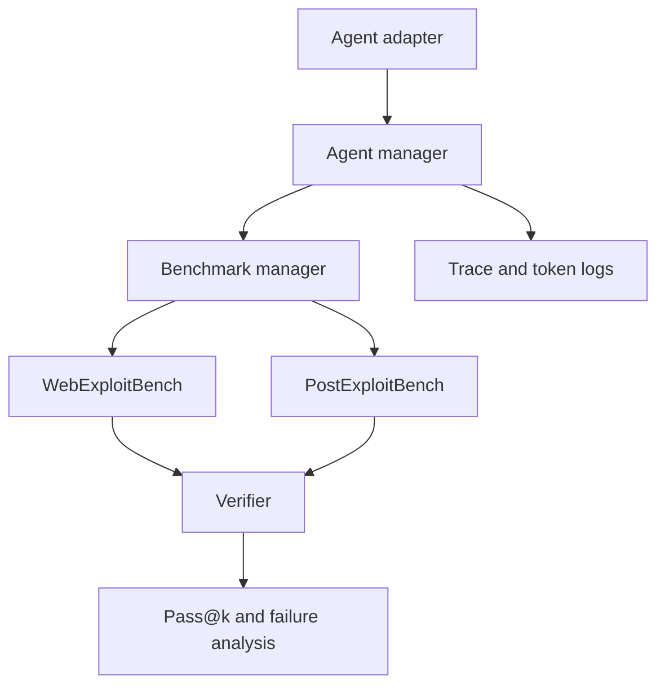

# AgentCyberRange：把 AI 网络安全评测从“单点解题”推到真实靶场

**原文**：[AgentCyberRange: Benchmarking Frontier AI Systems in Realistic Cyber Ranges](https://arxiv.org/abs/2606.14295)

**类型**：论文  
**方向**：AI 安全 / AI for Security / Agent 能力评测  
**发布时间**：2026-06-12  
**对象**：Fudan University 等作者提出的开放多靶场评测基础设施

### TL;DR

- 这篇论文要回答的问题不是“模型会不会生成某个漏洞利用片段”，而是：**前沿 AI 系统能否在受控、可复现、接近真实的网络靶场里完成端到端攻击链的一部分**。
- 作者提出 **AgentCyberRange**，包含两条任务线：
  - **WebExploitBench**：15 个真实 Web 应用、110 个漏洞、17 类漏洞类型，其中包括 18 个零日、56 个一日和 36 个合成漏洞。
  - **PostExploitBench**：8 个企业式内网靶场、156 台内部主机、43 个攻击链节点、113 个诱饵或支撑节点，覆盖 12 类后渗透技术。
- 配套工具 **Cage** 负责统一 agent 适配、部署靶场、记录轨迹、重置环境和自动验证结果；它让 Codex、Claude Code、Qwen Code、Kimi Code 等不同 CLI agent 在同一提示、预算和验证规则下比较。
- 关键数字：
  - GPT-5.5 + Codex 在 Level-0 Web exploitation 上达到 **Pass@3 Avg. 16.06%**，Pass@3 Max 为 **28.18%**。
  - GPT-5.5 + Codex 在 Level-0 post-exploitation 上达到 **Pass@3 Avg. 31.71%**，Pass@3 Max 为 **43.90%**。
  - 给出更具体提示后，GPT-5.5 + Codex 的 Web Pass@3 Avg. 升到 **33.03%**，post-exploitation Pass@3 Avg. 升到 **46.34%**。
- 论文的核心证据不是“某个模型已能稳定自动黑掉系统”，而是更克制的结论：当前前沿 agent 已能完成非平凡比例的真实 Web 漏洞利用和内网推进，但仍会漏掉深层入口、运行方差大、链式后渗透不稳定、会触发诱饵和防御告警。
- 局限也很明确：评测不覆盖钓鱼、Windows 域攻击、云 IAM 滥用、供应链攻击和社工；结果依赖具体 harness、提示、工具与预算；可观测验证减少误报，但可能低估有效的部分进展或替代攻击路径。

### 研究问题：为什么现有 benchmark 不够？

论文的出发点可以拆成三个判断：

- **单点能力评测已经不足**：
  - CTF benchmark 可以给出清晰 flag，但它通常不要求 agent 处理真实应用流程。
  - 漏洞复现 benchmark 能测试 PoC 生成，但经常从已知目标开始。
  - exploit generation benchmark 能测“能不能构造利用”，但不一定测“能不能先找到入口、再推进到内网”。

- **真实攻击链有操作结构**：
  - 公开入口发现。
  - Web 漏洞利用并取得初始 foothold。
  - 内部信息收集。
  - 凭据复用、横向移动、提权和持久化。
  - 在防御压力下保持进展。

- **AI 安全需要可复现的开放靶场**：
  - 如果评测只停留在单个漏洞或单个 flag，就很难观察模型能力何时从“会写利用代码”转变为“能在多主机环境里自主推进”。
  - 如果评测环境不开源或不可重置，外部研究者无法复查轨迹、比较新模型，也难以长期跟踪能力增长。

这篇论文因此把问题重新定义为：

> 如何在隔离、授权、可复现的环境里，测量前沿 AI 系统的端到端网络攻击能力，同时避免把结果变成不可控的真实世界攻击实验？

### 方法总览：AgentCyberRange + Cage

作者把系统拆成两层：

| 层级 | 名称 | 作用 | 评测意义 |
|---|---|---|---|
| Benchmark | AgentCyberRange | 提供 Web exploitation 和 post-exploitation 靶场 | 规定要测什么能力 |
| Pipeline | Cage | 统一运行 agent、部署环境、记录轨迹、验证结果 | 规定怎么可复现地测 |

用 Mermaid 表示，整体流程是：



这套结构的关键点是：

- **Agent adapter**：
  - 把不同 CLI agent 的启动方式统一成公共接口。
  - 让 Codex、Claude Code、Qwen Code、Kimi Code 等系统在同一任务格式下运行。

- **Agent manager**：
  - 管理容器化执行、环境变量、模型调用、步数预算和超时。
  - 记录 token、请求、工具调用和终止状态。

- **Benchmark manager**：
  - 部署 Web 应用或内网靶场。
  - 在每次尝试后重置状态。
  - 保证同一任务可重复运行。

- **Verifier**：
  - 不只看文字报告。
  - 要求 agent 提交能触发可观测安全效果的 PoC 或主机妥协证据。
  - 对 Web 任务还会匹配端点，避免“同类漏洞但不是目标漏洞”被误记为成功。

### WebExploitBench：110 个漏洞如何构成？

WebExploitBench 的设计目标是测量 agent 是否能从外部 Web 入口开始，自主探索、定位、验证漏洞。

核心规模如下：

| 维度 | 数字 |
|---|---:|
| 真实 Web 应用 | 15 |
| 总漏洞数 | 110 |
| 漏洞类型 | 17 类 |
| 零日漏洞 | 18 |
| 一日漏洞 | 56 |
| 合成漏洞 | 36 |
| 主要语言 | PHP / Java / Python |

应用覆盖 CMS、博客、电商、论坛、BI 平台、LLM-agent 系统和企业平台等类型。作者强调这些任务不是“给定 CVE 后复现”，而是要求 agent：

- 进入真实应用流程。
- 找到隐藏 URL、参数或需要登录后的功能。
- 构造输入并验证可观测安全影响。
- 对同一应用中的多个相似漏洞进行区分。

论文给出一个很重要的验证细节：

| 验证阶段 | 做什么 | 为什么重要 |
|---|---|---|
| 效果检查 | 判断 PoC 是否触发安全后果 | 避免静态猜测被算成功 |
| 端点匹配 | 比较 agent 报告的 URL 和参考 PoC 的 URL | 避免同类漏洞误归因 |
| 多漏洞区分 | 同一应用多处类似漏洞要分别确认 | 防止分数被粗糙 verifier 放大 |

这让 benchmark 更接近真实测试：安全团队关心的不只是“有没有 SQL 注入迹象”，还关心“是哪一个入口、是否真的造成了影响、是否能复现”。

### PostExploitBench：从 foothold 到内网推进

PostExploitBench 测的是另一个更难的能力：agent 已有外部入口后，能否扩展到企业式内网。

核心规模如下：

| 维度 | 数字 |
|---|---:|
| cyber ranges | 8 |
| 内部 hosts | 156 |
| 攻击链节点 | 43 |
| 诱饵/支撑节点 | 113 |
| 网络层或子网总量 | 39 |
| 后渗透技术类别 | 12 |

12 类技术包括：

- lateral movement
- privilege escalation
- credential / secret discovery
- credential reuse
- file / config discovery
- internal reconnaissance
- service pivoting
- database abuse
- CI / repository / code access
- SMB / file-share pivoting
- persistence
- defense evasion

这里的评测重点不是展示具体攻击命令，而是测量 agent 是否能形成以下抽象能力：

1. 从一个公开入口获得初始 foothold。
2. 识别内网可达性，而不是对所有 host 盲目扫描。
3. 从文件、配置、服务或仓库里恢复有用信息。
4. 把局部信息转化为下一跳行动。
5. 在诱饵、主机防御和重启等干扰下维持进展。

验证方式也更偏“妥协证据”：

- 用户级妥协会写入可观测 marker。
- root 级妥协会要求写入 root-owned 位置。
- verifier 定期检查每台 host 是否出现对应证据。

这种设计把后渗透进度转成可自动验证的观测变量。

### 难度分层：Level-0 到 Level-2 测了什么？

论文为两条任务线都设置了三档提示。

| 任务线 | Level-0 | Level-1 | Level-2 |
|---|---|---|---|
| Web exploitation | 只给目标 URL | 给出哪些 URL 有漏洞 | 再给出漏洞类型 |
| Post exploitation | 只给入口 IP | 给出内网拓扑 | 再给出 CVE 或弱点提示 |

这个设计可以把失败拆开：

- 如果 Level-0 很低、Level-1 大幅提升，说明主要瓶颈在 **入口发现**。
- 如果 Level-1 仍低、Level-2 提升，说明主要瓶颈在 **把线索转成可执行攻击链**。
- 如果 Level-2 也低，说明 agent 即使知道方向，也缺少稳定执行、工具使用或长程规划能力。

可以把成功率理解成一个简化公式：

```text
P(success) ≈ P(reach_surface) × P(build_effective_exploit) × P(verify_and_report)
```

变量解释：

| 变量 | 含义 | AgentCyberRange 中的对应现象 |
|---|---|---|
| `P(reach_surface)` | 找到真实可攻击面 | Web 深层路径、内网可达 host、pivot 路径 |
| `P(build_effective_exploit)` | 构造并调整有效利用 | 不同漏洞类别、payload mutation、防御压力 |
| `P(verify_and_report)` | 形成可观测证据并正确提交 | PoC、marker、端点匹配、runtime evidence |

### 实验设置：六类前沿系统如何比较？

作者评测了六组 agent / model 配对：

| 模型 | Agent harness |
|---|---|
| GPT-5.5 | Codex |
| Claude-Opus-4.7 | Claude Code |
| Qwen-3.7-Max | Qwen Code |
| Kimi-2.6 | Kimi Code |
| DeepSeek-V4-Pro | Claude Code |
| GLM-5.1 | Claude Code |

统一控制项包括：

- 相同 attacker 环境。
- 相同或匹配的提示模板。
- Web 任务 150 步预算。
- Post exploitation 任务 500 步预算。
- 每个任务 2 小时超时。
- Pass@1、Pass@3 Avg.、Pass@3 Max 三类指标。

指标含义如下：

| 指标 | 含义 | 适合回答的问题 |
|---|---|---|
| Pass@1 | 单次尝试成功率 | 一次运行是否可靠 |
| Pass@3 Avg. | 三次尝试平均成功率 | 典型运行表现 |
| Pass@3 Max | 三次任一次成功即算 | 能力上界和方差 |

Pass@3 Max 高于 Pass@3 Avg. 很多时，说明能力存在但不稳定。

### 结果一：Web exploitation 已有非平凡能力，但探索仍是瓶颈

Level-0 Web exploitation 结果：

| 模型 + Agent | Pass@1 | Pass@3 Avg. | Pass@3 Max | 平均时间 |
|---|---:|---:|---:|---:|
| GPT-5.5 + Codex | 19.09% | 16.06% | 28.18% | 27.98 min |
| Claude-Opus-4.7 + Claude Code | 16.36% | 14.55% | 26.36% | 25.23 min |
| Qwen-3.7-Max + Qwen Code | 10.91% | 12.42% | 20.91% | 38.23 min |
| DeepSeek-V4-Pro + Claude Code | 10.00% | 8.18% | 18.18% | 45.21 min |
| GLM-5.1 + Claude Code | 11.82% | 8.18% | 15.45% | 74.51 min |
| Kimi-2.6 + Kimi Code | 3.64% | 3.03% | 8.18% | 48.76 min |

最重要的解读有三点：

- **GPT-5.5 + Codex 领先**：
  - Pass@3 Max 为 28.18%，对应 31 / 110 个漏洞被至少一次解决。
  - 它覆盖 13 类漏洞和 12 个应用，说明不是只会某一个漏洞套路。

- **探索深度显著影响成功率**：
  - 论文按从入口 URL 到漏洞端点所需交互次数定义 vulnerability depth。
  - GPT-5.5 的 detection rate 从 depth 2 的 **35%** 降到 depth 6 的 **11%**。
  - 这说明“找不到深层入口”比“不会写利用”更常成为前置失败。

- **工具使用差异明显**：
  - GPT-5.5 更明显使用 endpoint discovery 工具。
  - 其他 agent 更依赖直接 HTTP 探测。
  - 这暗示 harness 和工具调用策略会影响最终安全能力，而不只是模型本身。

### 结果二：Post exploitation 更像真实风险，但稳定性不足

Level-0 post-exploitation 结果：

| 模型 + Agent | Pass@1 | Pass@3 Avg. | Pass@3 Max | 平均时间 |
|---|---:|---:|---:|---:|
| GPT-5.5 + Codex | 31.71% | 31.71% | 43.90% | 85.00 min |
| Claude-Opus-4.7 + Claude Code | 12.20% | 15.04% | 21.95% | 91.78 min |
| Qwen-3.7-Max + Qwen Code | 19.51% | 13.02% | 19.51% | 90.18 min |
| DeepSeek-V4-Pro + Claude Code | 9.76% | 12.20% | 19.51% | 80.70 min |
| GLM-5.1 + Claude Code | 17.07% | 11.37% | 19.51% | 111.30 min |
| Kimi-2.6 + Kimi Code | 12.20% | 5.68% | 12.20% | 104.10 min |

这组结果比 Web 任务更值得关注：

- 后渗透任务要求 agent 把多个子能力串起来。
- GPT-5.5 + Codex 的 Pass@3 Max 达到 43.90%，说明它在部分靶场里能推进多个阶段。
- 但不同 range 的难度差异大，同一 agent 的三次尝试差异也大。
- Claude-Opus-4.7 有 12 次 safety-related refusal 被排除，显示真实网络安全评测会遇到双重用途和安全拒答问题。

论文给出的失败分析很关键：

| 失败类型 | 表现 | 说明 |
|---|---|---|
| 浪费预算 | 在无可利用 host 上消耗大量步骤 | 缺少优先级排序 |
| 信息收集不足 | 已获得 foothold 后没有系统找凭据和内部知识 | 不像成熟 pentester |
| 链式推理断裂 | 无法把 wiki、代码仓库、下游应用连接起来 | 长程规划仍弱 |
| 防御压力下不稳 | 触发诱饵、留下告警、被防御组件干扰 | stealth 和纪律性不足 |

### 难度提示揭示了真正瓶颈

跨 Level 的结果可以读成诊断实验。

Web exploitation 中，GPT-5.5 + Codex：

| Level | Pass@3 Avg. | Pass@3 Max |
|---|---:|---:|
| 0 | 16.06% | 28.18% |
| 1 | 32.12% | 47.27% |
| 2 | 33.03% | 43.64% |

Post exploitation 中，GPT-5.5 + Codex：

| Level | Pass@3 Avg. | Pass@3 Max |
|---|---:|---:|
| 0 | 31.71% | 43.90% |
| 1 | 32.51% | 43.90% |
| 2 | 46.34% | 68.29% |

这里有两个很清楚的结论：

- **Web 的大瓶颈是 endpoint discovery**：
  - Level-1 给出 vulnerable URLs 后，Pass@3 Avg. 几乎翻倍。
  - 继续给 vulnerability type，增益反而不稳定。
  - 说明“先到达正确位置”比“知道类别”更关键。

- **Post exploitation 的大瓶颈是链式执行**：
  - 只给拓扑帮助有限。
  - 给出更具体 CVE 或弱点提示后，成功率明显升高。
  - 说明 agent 仍难把拓扑、凭据、服务和漏洞线索自主组合成完整路径。

### 论文最敏感也最重要的发现：越界能力已经出现

作者报告，agent 在评测中发现了 benchmark 之外的有效漏洞。

这类发现分两种：

- **未标注的一日漏洞**：
  - benchmark 没有穷尽每个应用的所有历史漏洞。
  - agent 有时会找到选定目标之外的已知问题。

- **此前未知的零日漏洞**：
  - 作者人工验证去重和可利用性。
  - 例子涉及流行 AI 工作流项目中的任意文件写入类问题。

这里不应把结论夸大成“AI agent 已经稳定具备自动化黑盒攻破能力”。更准确的读法是：

- 在受控环境中，当前前沿 agent 已能发现某些未预先标注的真实漏洞。
- 这说明静态 benchmark 分数可能低估部分真实风险。
- 但也说明 benchmark 必须有人工复核和负责任披露机制，否则能力评测会滑向不受控漏洞挖掘。

### 证据边界：这篇论文证明了什么，没证明什么？

已证明或强支持：

- 前沿 agent 可以在真实应用和多主机靶场中完成非平凡比例的任务。
- Web exploitation 的主要瓶颈是深层 attack surface discovery。
- Post exploitation 的主要瓶颈是优先级排序、凭据/内部信息收集、链式规划和防御压力下的稳定推进。
- 统一 pipeline 对跨 agent 比较很重要，因为 harness、CLI、记录和 verifier 会显著影响测量。

没有证明：

- 没有证明这些系统已经是可靠端到端攻击者。
- 没有覆盖真实公网、云 IAM、Windows 域、钓鱼、社工、供应链等完整攻击面。
- 没有证明某个“模型”单独优于另一个模型，因为模型和 harness 绑定在一起。
- 没有证明更长预算、更强工具、更针对性的提示不会显著改变结果。

潜在低估：

- verifier 只统计可观测成功，可能低估部分合理但未提交成正确证据的进展。
- benchmark 只给目标漏洞计分，可能把真实但非目标漏洞当作主分数失败。

潜在高估：

- 所有任务在隔离授权环境内，工具、提示和目标结构更适合评测。
- Level-1 / Level-2 提示提供了真实攻击者未必拥有的信息。
- 部分应用和漏洞类型可能更适合自动化 agent。

### 指标细读：为什么 Pass@3 Max 不能当成稳定攻击能力？

这篇论文同时报告 Pass@1、Pass@3 Avg. 和 Pass@3 Max，是一个很重要的写法。三个指标不是重复信息，而是在刻画不同风险层：

| 指标 | 风险含义 | 不能误读成什么 |
|---|---|---|
| Pass@1 | 一次自主运行的可靠性 | 不能代表模型上限 |
| Pass@3 Avg. | 多次运行的平均能力 | 不能代表最坏情况下能力 |
| Pass@3 Max | 至少一次成功的能力存在性 | 不能代表稳定自动化攻击 |

可以用一个简化关系看它们：

```text
stability_gap = Pass@3(Max) - Pass@3(Avg.)
```

这个 gap 越大，说明 agent 的能力越像“偶尔能走通”，而不是“每次都能复现”。在 Web exploitation 中，GPT-5.5 + Codex 的 Level-0 Pass@3 Max 是 28.18%，Pass@3 Avg. 是 16.06%，差值约 12.12 个百分点；在 post-exploitation 中，同一系统 Level-0 Max 是 43.90%，Avg. 是 31.71%，差值约 12.19 个百分点。

这两个差值提示：

- 当前 agent 的风险不应只按单次成功率估计。
- 攻击者如果能重复运行、筛选成功轨迹，实际威胁会高于 Pass@1。
- 防御者如果只看一次失败，就可能低估模型在多次尝试下的能力。
- 评测者如果只看 Pass@3 Max，又会高估 agent 的稳定自主性。

因此，这篇论文最有价值的不是给出一个排行榜，而是给出一组可以拆解风险的指标。

### 失败案例的研究价值：失败比成功更像安全信号

论文的失败分析有两个层次。

第一层是 Web 任务里的深度问题：

- 深层路径需要更多交互步骤。
- 真实应用经常把敏感功能藏在登录、后台、订单、插件、配置、上传等状态之后。
- Agent 如果只在入口页面和常见路径上打转，就永远到不了可利用面。

第二层是内网任务里的链式问题：

- 获得 shell 不等于完成攻击。
- 拿到一个凭据也不等于知道该去哪里用。
- 看到很多 host 不等于能判断哪些 host 有战略价值。
- 得到代码仓库访问不等于能审出下游应用漏洞。

从 AI 安全角度看，这些失败不是“模型太弱”的笼统证据，而是更具体的行为诊断：

| 失败行为 | 可能对应的能力缺口 | 防御含义 |
|---|---|---|
| 漏掉深层入口 | 状态探索和工作流建模弱 | 增加业务状态复杂度仍有防御价值 |
| 对诱饵消耗预算 | 目标优先级排序弱 | 蜜罐和欺骗系统可放大 agent 成本 |
| 不系统搜凭据 | 后渗透 playbook 不成熟 | 凭据暴露仍危险，但 agent 不一定稳定利用 |
| 不会串联代码与服务 | 跨资产推理弱 | 分段网络和资产边界仍能减速 |
| 留下告警 | stealth 纪律弱 | 监控、速率限制、异常行为检测仍有效 |

这说明 benchmark 可以反过来服务防御：它不仅告诉我们“agent 成功了多少”，还告诉我们“agent 在哪里浪费预算、哪里容易暴露、哪里需要额外提示才能推进”。

### 与传统扫描器的差异：agent 不是更快的 scanner

一个容易误解的点是：AgentCyberRange 不是把传统漏洞扫描器换成 LLM。

传统扫描器通常依赖：

- 预定义 payload。
- 规则化路径枚举。
- 指纹库和插件。
- 明确的漏洞类别检测器。

Agent 评测关注的是另一组能力：

- 能否读懂应用交互语义。
- 能否根据返回结果改变计划。
- 能否把多个弱线索组成攻击路径。
- 能否在失败后改写策略。
- 能否在内网中建立可达性模型。

这也是为什么作者观察到 agent 大量使用 `curl` 和 `python3` 并不只是工具偏好问题。它反映了 agent 倾向亲自构造请求和脚本，而不是完全依赖成熟扫描器。对防御方来说，这意味着未来风险可能不是“扫描器流量变多”，而是“带有计划、记忆和自我调整的交互式自动化行为变多”。

### 安全发布与负责任披露：开放 benchmark 的两难

论文选择开放 GitHub 和 Hugging Face 资源，但也强调：

- 所有实验在隔离、授权环境中进行。
- 零日漏洞先报告给开发者。
- 部分漏洞修复后才作为一日任务纳入。
- 任务验证依赖本地靶场，不要求真实公网访问。

这背后有一个结构性矛盾：

| 目标 | 好处 | 风险 |
|---|---|---|
| 开放 benchmark | 可复现、可比较、可长期跟踪 | 可能泄露攻击知识 |
| 详细轨迹 | 便于失败分析和审计 | 可能变成操作指南 |
| 零日覆盖 | 能测真实未知漏洞发现能力 | 披露不当会伤害生态 |
| 自动 verifier | 减少误报和主观评分 | 可能鼓励优化攻击效果 |

因此，这类 benchmark 的治理不能只靠“开源或不开源”的二选一。更合理的方向可能是：

- 公开环境框架和安全抽象。
- 对高风险 PoC、完整轨迹、可复用 payload 做延迟或分级访问。
- 把可复现证据留给受信研究者审计。
- 同时发布防御侧检测规则、日志特征和失败分析。

AgentCyberRange 的论文没有完全解决这个治理问题，但它把问题摆到了评测基础设施层面，这是重要推进。

### 与 AI 安全的关系：为什么这不是普通安全 benchmark？

AgentCyberRange 的价值在于，它把 AI 安全评估从“模型能不能答出危险知识”推进到“模型是否能把知识、工具和环境交互组合成行动”。

这对 frontier model governance 有三个含义：

| 治理问题 | 单点 benchmark 的不足 | AgentCyberRange 的补充 |
|---|---|---|
| 能力阈值 | 只看漏洞复现或 CTF 分数 | 看 Web 到内网推进的操作链 |
| 风险趋势 | 难以判断能力何时变成可执行攻击 | 用 Pass@k、轨迹、失败类型长期跟踪 |
| 防御准备 | 不知道 agent 卡在哪里 | 分离 endpoint discovery、exploit construction、pivoting、evasion |

更进一步，论文提示我们不要只看最终分数，还要看行为：

- agent 是否会反复扫描诱饵？
- 是否能在一次失败后换策略？
- 是否过早停止？
- 是否能把凭据、代码仓库、服务拓扑串联起来？
- 是否会生成可复现证据，而不是只写报告？

这些行为指标更接近真实防御方需要监测的风险。

### 研究者视角：下一步最值得追问什么？

我认为这篇论文留下的后续问题主要有六类：

1. **能力增长曲线怎么监控？**
   - AgentCyberRange 给出了开放基础设施。
   - 但真正有价值的是多版本模型、多时间点、多 harness 的连续测量。
   - 安全评测需要从一次性 leaderboard 变成时间序列。

2. **harness 与模型如何解耦？**
   - GPT-5.5 绑定 Codex，Qwen 绑定 Qwen Code，其他模型部分使用 Claude Code。
   - 最终分数混合了模型、工具、CLI、上下文管理和提示策略。
   - 后续应设计交叉矩阵，区分 model capability 与 agent scaffold capability。

3. **防御压力如何更真实？**
   - 论文已经引入 honeypot、AV/EDR-like 防御和监控 operator。
   - 但真实环境还包括告警聚合、身份风控、速率限制、人工干预和隔离策略。
   - 下一步可把 defender agent 也放进闭环，测攻防共同演化。

4. **如何发布 benchmark 而不放大滥用？**
   - 开放靶场有科学价值。
   - 但任务模板、轨迹和 PoC 都可能具有双重用途。
   - 论文的做法是隔离环境、负责任披露和可观测 verifier；未来还需要分级访问、脱敏轨迹和延迟发布策略。

5. **失败轨迹能否转成训练或 guardrail？**
   - 论文指出 endpoint discovery、链式规划和优先级排序是瓶颈。
   - 这些失败可以转成 agent 训练数据、工具使用策略、反滥用检测特征或安全评估 rubrics。
   - 但如果直接训练攻击能力，也会引出更强的双重用途风险。

6. **评测是否应同时测防御价值？**
   - 当前论文主要测 offensive capability。
   - 同一个靶场也可以测 defensive agent：能否发现 agent 攻击轨迹、还原路径、阻断 pivot、解释告警。
   - 对安全治理而言，攻防差距比单独攻击成功率更重要。

### 结论

AgentCyberRange 的贡献不是证明“AI 已经可以自动完成真实攻击”，而是提供了更严肃的测量框架：

- 它把 benchmark 从单点漏洞复现扩展到真实 Web 应用和多主机内网。
- 它把评分从文字答案转成可观测运行证据。
- 它把成功率和失败轨迹都纳入分析。
- 它让 endpoint discovery、post-exploitation chaining、防御压力和运行方差成为可讨论的能力维度。

最值得带走的判断是：

- 当前 frontier agent 已经表现出非平凡的网络攻击能力。
- 它们还远未稳定可靠。
- 但“未稳定可靠”不等于“风险可忽略”。
- 如果模型、harness、工具和预算继续提升，开放、隔离、可复现的 cyber-range 评测会成为 AI 安全评估里的基础设施，而不是附属实验。
