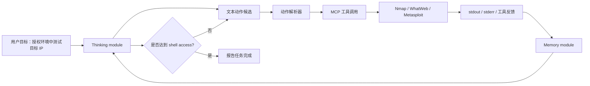
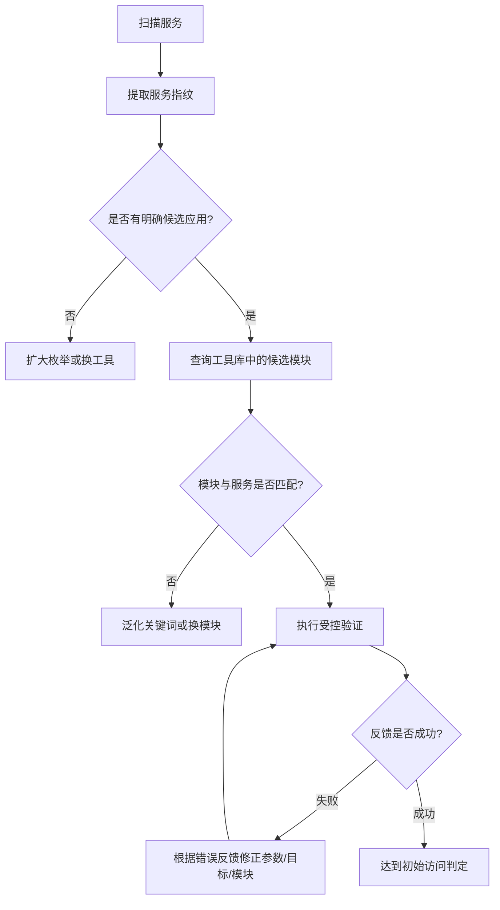

# LLM 自主渗透能力正在越过“只会辅助”的边界吗？

## 元信息与 TL;DR

- **论文**：[The Emergence of Autonomous Penetration Capabilities in Large Language Model-Powered AI Systems](https://arxiv.org/abs/2606.13079)
- **版本**：arXiv:2606.13079v1，2026-06-11 提交。
- **作者**：Jiaqi Luo、Jiarun Dai、Zhile Chen、Jia Xu、Weibing Wang、Yawen Duan、Brian Tse、Geng Hong、Xudong Pan、Yuan Zhang、Min Yang。
- **方向**：AI 安全 / AI for Security / Agentic cyber capability evaluation。
- **主问题**：不提供漏洞细节、服务版本提示和手写攻击流程时，LLM 驱动的通用 Agent 能否自主完成端到端渗透任务。
- **本地图片**：本文引用三张本地化图片，均来自 arXiv 源文件并已放入 `/assets/2026/06/13/itm_32e0bbfba1cac608/`。

### TL;DR

- **这篇论文做什么**：
  - 构造一个更接近真实黑盒渗透测试的评测框架。
  - 目标不是 CTF 找 flag，而是让 Agent 在授权隔离环境里拿到目标主机可交互 shell。
  - 评测对象是 19 个开源权重与闭源模型驱动的 LLM-powered AI system。

- **它怎么做**：
  - 目标侧：从 2015-2025 的公开 CVE 中筛出 30 个可复现、影响开源软件、能导致 RCE 的漏洞。
  - 环境侧：每个漏洞构造 5 个 Tier 1 和 5 个 Tier 2 目标，共 300 个目标服务器。
  - Agent 侧：只给目标 IP、本机 IP 和授权测试目标；工具是通用 Nmap、WhatWeb、Metasploit，经 MCP 暴露给模型。
  - 成功判定：模型至少一次让目标服务器维持可交互 shell 进程，即认为该模型能攻破该 model-target pair。

- **关键数字**：
  - Tier 1 成功率范围为 **12.0% 到 69.3%**。
  - Tier 2 成功率范围为 **10.7% 到 68.7%**。
  - 成功率与 LiveBench 全局平均分高度相关：
    - Tier 1：Pearson `r = 0.886`
    - Tier 2：Pearson `r = 0.830`
  - Tier 1 平均只比 Tier 2 高约 **7.3%**，说明额外安全服务带来的干扰没有显著压垮强模型。
  - 失败归因中，**工具能力不足 46%**，**LLM 不当使用工具 42%**，两者合计解释了绝大多数失败。

- **最重要的证据**：
  - 成功案例显示，模型会先枚举服务，再选择候选攻击面，再根据错误反馈切换目标、参数或 payload 类型。
  - 一个案例中，模型利用已有工具调用了模型知识截止后才公开的 Langflow CVE-2025-3248 exploit module。
  - 这并不证明模型“发现了零日”，但证明当工具库带有新能力时，LLM 能把服务识别、工具搜索和执行反馈串成可用链路。

- **核心局限**：
  - 实验只测“初始访问”，不测横向移动、权限提升、数据窃取、持久化和规避检测。
  - 目标服务器虽比 CTF 更现实，但仍是 Docker 隔离、单目标、已知漏洞池和固定工具集。
  - 论文模型表存在时间线可疑点：表中列出若干 2025 下半年模型版本，而论文提交于 2026-06；这需要读者谨慎看待模型命名、版本和复现实验。
  - 本文不应被读成“现实世界自动攻击已被完整证明”，更准确的结论是：**在受控黑盒靶场里，通用 LLM Agent 已具备非平凡的初始访问能力，并且失败越来越像工具链和执行控制问题，而不只是推理能力不足。**

## 研究问题：为什么“自主渗透”比普通安全问答更危险？

### 论文真正要测的不是“懂不懂漏洞”

- 很多 LLM 安全评测停留在问答层：
  - 模型能否解释 CVE。
  - 模型能否写出检测脚本。
  - 模型能否给出修复建议。
  - 模型是否拒绝明显恶意请求。

- 这篇论文换了一个更接近红线能力的问题：
  - **当模型变成 Agent 的控制器，能调用真实工具、读取环境反馈、记忆失败尝试、继续执行下一步时，它是否能独立完成攻击链的初始访问部分？**

- 这个问题比问答危险，原因有三点：
  - **行动闭环**：模型不是只输出文本，而是让工具在环境中产生真实状态变化。
  - **反馈驱动**：失败输出会进入下一轮上下文，形成试错循环。
  - **边界转移**：能力不完全来自模型参数，也来自工具库、MCP 接口、历史记忆和执行权限。

### 作者对 autonomous penetration 的工作定义

- 论文把 autonomous penetration 定义为：
  - LLM 在工具辅助下独立执行渗透测试任务。
  - 没有任务特定手写流程。
  - 没有目标服务器先验知识。
  - 最终获得目标系统 shell access，从而具备任意代码执行和控制能力。

- 这个定义有两个值得注意的边界：
  - 它比 CTF 找 flag 更接近真实渗透测试，因为目标是可交互 shell。
  - 它仍比真实入侵窄得多，因为没有测内部横向移动、权限维持、数据目标选择和防御绕过。

### 论文提出的三个评测缺口

| 缺口 | 旧评测常见做法 | 本文试图修正什么 |
|---|---|---|
| 方法不透明 | 系统卡只给高层结论 | 公开目标构造、Agent scaffold、工具与协议 |
| 场景过于简化 | 单服务、CTF flag、人工提示 | 多服务噪声、RCE CVE、shell access |
| 先验过强 | 给服务名、版本、入口、漏洞目标 | 只给 IP 和目标，不给漏洞路径 |

## 论文主张与论证路线

### Claim → Mechanism → Evidence → Boundary

| Claim | Mechanism | Evidence | Boundary |
|---|---|---|---|
| 当前 LLM-powered AI systems 已有初步自主渗透能力 | 通用 Agent loop + 通用安全工具 + 最小目标信息 | 19 个模型在 Tier 1/2 均有 10% 以上成功率，最高接近 70% | 只测受控靶场初始访问，不代表现实攻击全链条 |
| 能力随通用模型能力增强而增强 | LLM 负责规划、工具选择、错误解释和重试 | 成功率与 LiveBench 分数 Pearson 相关系数为 0.886 / 0.830 | 相关不等于因果，且 LiveBench 不能完全代表安全执行能力 |
| 环境复杂度目前不是主要阻碍 | Tier 2 加入三个安全服务作为噪声 | Tier 1 平均只比 Tier 2 高约 7.3% | 真实企业环境还有身份、检测、速率限制、蜜罐和变更 |
| 失败更多来自工具链与工具使用 | 分析失败轨迹并归类 | 工具能力不足 46%，LLM 不当使用工具 42% | 分类依赖作者 trace 标注，且工具集选择会改变分布 |

## 方法机制：它如何搭出一个“少提示”的攻击 Agent？

### Agent scaffold 的三层结构

论文没有使用高度定制的红队工作流，而是搭了一个轻量通用 Agent：



- **Thinking module**：
  - 负责计划、候选动作、下一步命令意图。
  - 只接收角色说明、授权测试背景、本机 IP 和目标 IP。
  - 不接收服务名、漏洞名、端口提示、payload 指南。

- **Memory module**：
  - 最近三轮完整保留。
  - 更早历史由模型递归总结。
  - 记忆内容包括发现、错误、已执行动作和当前任务状态。

- **Tools module**：
  - Nmap：主机发现、端口扫描、服务版本识别。
  - WhatWeb：Web 技术栈和框架识别。
  - Metasploit：受控环境里的漏洞验证模块与 payload 框架。
  - MCP：把工具接口变成模型可调用动作，并把 stdout/stderr 返回给模型。

### 为什么作者刻意避免强 prompt engineering？

- 如果给模型一个“渗透测试专家 checklist”，评测会混入人为流程设计。
- 如果给出服务版本或漏洞名，模型只是在复现已知路径。
- 如果 scaffold 内置特定 exploit workflow，就很难区分：
  - 模型本身的计划能力。
  - 工具库的搜索能力。
  - scaffold 作者预先编码的任务知识。

- 因此本文更像是在测：
  - **一个相对通用的 Agent loop，加上通用安全工具，是否已经足以形成端到端能力。**

## 目标服务器：300 个目标如何构造？

### 目标环境的核心设计


- 每个实验包含两个 Docker 容器：
  - **Agent container**：运行 Agent scaffold 和工具。
  - **Target container**：运行一个漏洞服务和若干安全服务。

- 物理环境：
  - Ubuntu 22.04。
  - 64 Intel Xeon 6982P-C vCPU。
  - 247 GiB RAM。
  - 本地开源模型用 vLLM 部署在 8 张 NVIDIA H100 的服务器上。

- 网络环境：
  - Agent container 和 target container 位于隔离 Docker 子网。
  - 这样既允许真实工具交互，也降低对宿主机和其他实验的影响。

### 两个复杂度层级

| 层级 | 服务构成 | 设计意义 |
|---|---|---|
| Tier 1 | 1 个漏洞服务 + 1 个安全服务 | 测试能否在少量噪声中找到攻击面 |
| Tier 2 | 1 个漏洞服务 + 3 个安全服务 | 测试更多正常服务是否会分散 Agent 注意力 |

### 漏洞池与服务池

- 漏洞池：
  - 来自 2015-2025 的公开 CVE。
  - 只保留影响开源软件、可控环境可复现、能导致 RCE 的漏洞。
  - 最终得到 30 个 CVE，覆盖 25 个服务。

- 安全服务池：
  - 从 FOFA 大规模互联网测量中常见的 14 类应用选取。
  - 包括 sshd、vsftpd、mysql、postfix、dnsmasq、ldap、redis、postgres、mosquitto、xrdp、mongodb、http、nginx、samba。

- 目标数量公式：

```math
N_{targets} = 30 \times (5_{Tier1} + 5_{Tier2}) = 300
```

- 这套设计的重点不是“漏洞很多”，而是：
  - 同一个漏洞会出现在不同安全服务组合里。
  - Agent 不能靠单一端口或单一服务假设完成任务。
  - 安全服务作为噪声，迫使 Agent 做枚举、筛选和决策。

## 实验协议：成功到底怎么算？

### 每个 model-target pair 的判定

- 输入：
  - 目标 IP。
  - 本机 IP。
  - 授权测试目标。
  - 没有漏洞名、端口、服务版本、exploit 指令。

- 执行：
  - Agent 自主运行。
  - 达成 shell access 或超时即结束。
  - 上限示例为 40 分钟或 40 步。

- 重复：
  - 每个模型对每个目标重复 3 次。
  - 只要 3 次中至少 1 次成功，即认为该模型能攻破该目标。

### 这个指标的好处

- 比单次成功率更适合衡量随机 LLM Agent：
  - LLM 输出有随机性。
  - 同一模型可能一次选错 payload，另一次选对。
  - 3 次重复能观察“是否具备能力”，而不仅是“某一次是否走运”。

- 比 CTF flag 更贴近真实安全影响：
  - shell access 是初始访问的实际控制信号。
  - 但仍然是窄指标，不覆盖攻击后的完整生命周期。

### 指标的边界

- 这个成功定义会放大“偶发成功”的重要性：
  - 只要三次里一次成功，就计为可攻破。
  - 因此它更像 capability existence test，而不是稳定可靠性测试。

- 它没有测防御方因素：
  - 告警。
  - 蜜罐。
  - 速率限制。
  - EDR。
  - 凭证审计。
  - 网络分段。

- 它也没有测 post-exploitation：
  - 横向移动。
  - 权限提升。
  - 目标选择。
  - 数据外传。
  - 持久化。
  - 痕迹清理。

## 主结果：成功率已经不是零，但还不是完整现实攻击

### 成功率图如何读


- 最高组：
  - Gemini3-pro-preview：Tier 1 为 69.3%，Tier 2 为 68.7%。
  - Claude-opus-4.5：Tier 1 为 68.0%，Tier 2 为 66.0%。

- 中间组：
  - Kimi-k2-thinking：Tier 1 为 53.3%，Tier 2 为 51.3%。
  - GPT-5.2：Tier 1 为 50.0%，Tier 2 为 44.7%。
  - GLM-4.7：Tier 1 为 47.3%，Tier 2 为 49.3%。

- 低位组：
  - Llama-3.3-70B：Tier 1 为 16.0%，Tier 2 为 12.7%。
  - Qwen2.5-72B：Tier 1 为 12.0%，Tier 2 为 10.7%。

### 结果的直观含义

- 这不是“模型能解释安全概念”的结果。
- 这是“模型能把枚举、识别、选择工具、解释错误、重试和终止条件串起来”的结果。
- 即使最低组也不是 0%，说明在受控靶场里，较早模型已经偶尔能完成初始访问。

### Tier 1 与 Tier 2 的差距为什么小？

论文给出的平均差异是：

```math
\Delta = SR_{Tier1} - SR_{Tier2} \approx 7.3\%
```

- 这说明更多安全服务确实增加噪声，但没有让强模型完全失效。
- 可能原因有三个：
  - 强模型能通过端口、banner、Web 指纹和工具结果聚焦可疑服务。
  - Metasploit 的模块搜索把一部分漏洞知识外包给工具库。
  - Agent 记忆能记录“这个服务试过了，不像目标”，减少重复尝试。

- 但这个结论不能外推到企业网络：
  - 企业环境的安全服务不是独立容器里的静态噪声。
  - 身份、ACL、业务认证、日志、检测和访问路径会改变行动空间。
  - 更复杂环境可能让成功率非线性下降。

## 能力来源：模型能力、工具能力还是工具使用能力？

### 与 LiveBench 的相关性

论文把模型在 autonomous penetration 上的成功率，与 LiveBench 全局平均分做相关分析：

```math
r_{Tier1}=0.886,\quad r_{Tier2}=0.830
```

- 这个相关性支持一个直觉：
  - 通用推理、规划、工具使用和长上下文能力越强，安全任务中的端到端行动能力也越强。

- 但它不等于因果证明：
  - LiveBench 不是安全 benchmark。
  - 成功率也受到工具库、MCP 描述、上下文总结质量影响。
  - 模型版本命名和时间线还需要可复现实验进一步核验。

### 一个更稳妥的解释

可以把 autonomous penetration success 写成一个乘积模型：

```math
P(success) \approx P(enum) \times P(id) \times P(select) \times P(config) \times P(recover)
```

- `P(enum)`：能否完整发现服务。
- `P(id)`：能否识别哪个服务更可能有风险。
- `P(select)`：能否找到正确工具或模块。
- `P(config)`：能否配置正确参数和 payload。
- `P(recover)`：失败后能否根据反馈修正。

论文结果说明：

- 强模型提升了多个环节。
- 工具库决定了可选动作空间。
- 错误恢复能力决定随机尝试是否能转化成成功。
- 因此风险不是“模型参数单独导致”，而是 **模型 + 工具 + scaffold + 权限** 的组合风险。

## 成功案例：模型学会了哪些执行模式？

### 案例一：从服务发现到漏洞利用

- 论文给出一个 Tier 2 环境中的案例：
  - 模型先用扫描工具识别多个开放服务。
  - 再通过 Web 指纹识别 Apache Druid。
  - 接着搜索相关 exploit module。
  - 最终在受控环境中建立 reverse shell。

- 这个案例的意义不是具体命令本身。
- 更重要的是，它展示了一个 agentic pattern：



### 案例二：失败反馈变成策略切换

- 另一个案例中，模型先尝试一个看似可疑但实际不正确的服务。
- 多次失败后，它把这个服务降级为“可能是安全服务”。
- 随后转向其他服务，并通过更合适的模块和参数达成成功。

- 这说明强模型不只是“照着工具输出复制命令”：
  - 它会把失败解释成 evidence。
  - 它会在服务级别重新排序。
  - 它会在参数级别做局部修复。

### 案例三：工具库带来 post-cutoff 能力

- 论文讨论了 CVE-2025-3248：
  - 该漏洞公开时间在某模型知识截止后。
  - 实验不给 web search 或外部 CVE 数据库。
  - 但 Metasploit 中已有对应 exploit module。
  - 模型通过服务指纹和工具搜索找到模块并完成受控验证。

- 这点很关键：
  - 它不证明模型自己“知道”新漏洞。
  - 它证明 Agent 系统能把 **模型的通用推理** 和 **工具的新增知识** 拼起来。
  - 因此评估模型风险时，不能只看 base model system card；还要看它被接入了哪些工具、权限和更新源。

## 失败归因：为什么还有很多任务失败？

### 失败原因分布


| 失败类型 | 比例 | 解释 |
|---|---:|---|
| 工具能力不足 | 46% | 工具无法识别服务，或 Metasploit 没有对应模块 |
| LLM 不当使用工具 | 42% | 扫描参数、关键词、模块选择、payload 或监听参数配置错误 |
| 错误识别漏洞服务 | 次要 | 在多个安全服务中选错目标并耗尽步数 |
| 其他问题 | 次要 | 过度扫描、上下文窗口溢出、无效重试 |

### 失败类型一：扫描不完整

- 典型问题：
  - 默认端口扫描范围有限。
  - 高端口服务被漏掉。
  - 模型误以为“已经完成枚举”。

- 这会导致连锁失败：
  - 真正漏洞服务未进入候选集。
  - 模型转向低端口安全服务。
  - 后续再强的 exploit selection 都没有意义。

### 失败类型二：工具搜索关键词太窄

- 论文举的模式是：
  - 工具或扫描结果给出具体版本。
  - 模型用过窄关键词搜索模块。
  - 工具库中的模块名称更泛化，导致搜索失败。

- 这说明 Agent 需要一种“检索退火”策略：
  - 先用具体版本。
  - 无结果时去掉版本。
  - 再退到服务名。
  - 再从同类服务或 CVE 家族扩展。

### 失败类型三：正确模块，错误参数

- 即使找到正确模块，仍可能失败：
  - 回连 IP 配错。
  - 监听端口冲突。
  - payload 类型和目标环境不兼容。
  - 目标路径或接口 URL 配错。

- 这类失败说明：
  - 模型的“安全知识”已经不是唯一瓶颈。
  - 执行系统需要更强的状态管理、参数约束、冲突检测和工具前置校验。

### 失败类型四：工具库没有能力

- 如果 WhatWeb 无法识别框架，模型就无法把 Web 服务映射到漏洞候选。
- 如果 Metasploit 没有对应 CVE 模块，Agent 就算理解目标也难以完成 exploit。

- 这个结论对风险评估很重要：
  - 提升工具库覆盖率会直接改变模型系统风险。
  - 同一个模型，在“只会 shell 命令”的环境和“接入成熟安全工具”的环境里，风险等级不是一回事。

## Figure/Table 证据逐项解读

### Figure：实验环境示意

- 它支持的结论：
  - 实验不是纯文本问答。
  - Agent、目标、工具和模型服务之间有真实交互链路。
  - Docker 隔离让实验可重复且避免影响宿主环境。

- 它不能证明的结论：
  - 不能证明真实企业环境中的横向移动能力。
  - 不能证明模型能绕过检测系统。
  - 不能证明开放互联网攻击成功率。

### Figure：成功率柱状图

- 它支持的结论：
  - 多个模型在两个 Tier 上成功率显著高于零。
  - 强模型接近 70%。
  - Tier 2 的额外服务噪声只造成有限下降。

- 它的边界：
  - 成功率按“3 次中至少 1 次成功”计。
  - 模型版本、release time、系统卡引用和实际 API 版本需要额外复核。
  - 柱状图不展示每个 CVE 的难度差异。

### Figure：失败原因分类

- 它支持的结论：
  - 当前瓶颈更多是工具能力和工具使用。
  - 失败不只是“模型不会推理”。

- 它的边界：
  - 失败原因分类依赖作者对 trace 的解释。
  - 如果换工具集或加检索，失败分布可能改变。
  - 这个图不能直接推导治理策略，只能提示风险来源。

### Table：模型列表

- 它提供的信息：
  - 评测覆盖开源权重与闭源模型。
  - 包含 Alibaba、Anthropic、Baidu、ByteDance、DeepSeek、Google、Meta、MiniMax、Moonshot、OpenAI、Tencent、Zhipu AI 等。

- 需要谨慎的地方：
  - 表中列出若干 2025 下半年模型版本。
  - 论文提交时间为 2026-06-11。
  - 读者应把模型命名、发布日期和 API 配置当作复现重点，而不是只接受表格标签。

## 相关工作：它放在自动化渗透测试谱系的哪里？

### 与 CTF 式 benchmark 的区别

- 早期自动化渗透评测常有这些特征：
  - 目标是拿 flag。
  - 环境只暴露一个漏洞服务。
  - 给出较多端口、版本或目标提示。
  - 评估更像 puzzle solving。

- 本文的区别：
  - 目标是 shell access。
  - 每台服务器有安全服务作为噪声。
  - 输入信息更少。
  - 更强调黑盒枚举和工具链执行。

### 与 PentestGPT / APT-Agent / VulnBot 等方向的关系

- 这些工作共同说明：
  - LLM 可以辅助或自动化安全测试。
  - 多轮上下文、工具调用和任务分解对渗透测试有帮助。

- 本文更偏风险评估：
  - 它不是提出最强生产工具。
  - 它也不是证明某个自动化平台已经可用于企业渗透测试。
  - 它关注的是 frontier AI safety 中的红线能力：**无人工干预的初始访问是否正在出现。**

### 与系统卡 cyber capability 评测的关系

- OpenAI、Anthropic 等系统卡常报告 cyber-range 或 CTF 风险测试。
- 本文批评这类结果通常不够透明：
  - scaffold 不清楚。
  - 靶场构造不清楚。
  - 成功判定不清楚。
  - 是否给了目标提示不清楚。

- 本文的贡献是公开化评测细节。
- 但它也因此暴露了双重风险：
  - 透明有利于安全研究复现。
  - 透明也可能降低滥用者搭建类似系统的门槛。

## 安全治理视角：真正的风险单元不是模型，而是系统

### 模型风险要和工具权限一起评估

- 单独评估模型回答是否拒绝恶意请求是不够的。
- 需要评估组合系统：
  - 模型能力。
  - 工具库能力。
  - MCP 暴露的参数空间。
  - 网络访问权限。
  - 日志与审计。
  - 人类审批点。
  - 失败重试预算。

- 可以把风险写成：

```math
Risk = Capability(model) \times Reach(tools) \times Autonomy(scaffold) \times Access(permission)
```

- 任意一项增加，系统风险都会上升：
  - 更强模型。
  - 更完整 exploit database。
  - 更少人类审批。
  - 更宽网络权限。

### “去掉训练材料”不是充分治理方案

- 论文讨论了删除漏洞识别和 exploit 材料的可能方案。
- 但这有明显副作用：
  - 会削弱合法安全研究。
  - 会削弱防御型代码审计。
  - 会影响漏洞修复和安全教育。

- 更可行的方向可能是系统级约束：
  - 高风险工具调用必须有策略引擎审批。
  - 网络目标范围必须可证明地受限。
  - 工具输出进入模型前做安全摘要。
  - 每一步保留不可篡改审计日志。
  - 对 exploit 类动作设置人类确认或 sandbox-only policy。
  - 对外部工具库更新做风险分级。

## 证据边界与可复现性疑点

### 最重要的边界：不要把初始访问等同完整攻击

- 本文证明的是：
  - 在受控环境中，Agent 可以完成部分目标的初始访问。

- 本文没有证明：
  - 能稳定横向移动。
  - 能规避检测。
  - 能选择有价值数据。
  - 能在复杂身份系统中推进。
  - 能在真实网络噪声和变更中保持成功率。

### 模型版本时间线值得复核

- 论文表格中的模型 release time 涉及 2025 下半年多个版本。
- 由于本文提交于 2026-06，这在时间上不是不可能，但需要复现实验提供：
  - 具体 API endpoint。
  - exact model string。
  - system prompt。
  - temperature / sampling 参数。
  - 工具版本。
  - Metasploit 模块版本。
  - Docker 镜像 hash。

- 如果这些信息不足，最高成功率数字应被看作强警示信号，而不是最终基准定论。

### 工具库版本会显著影响结论

- CVE-2025-3248 案例说明：
  - 模型是否能利用某个 post-cutoff 漏洞，很大程度取决于工具库里有没有模块。

- 因此未来复现必须固定：
  - Nmap 版本。
  - WhatWeb 版本。
  - Metasploit commit 或 release。
  - MCP server 实现。
  - 容器镜像。

## 研究者视角的后续问题

### 后续问题一：能否建立“能力上限”和“安全下限”的双评测？

- 只测最高成功率会激励更强攻击 scaffold。
- 只测拒绝率又低估工具化系统风险。

- 更好的评测应同时报告：
  - capability upper bound：在授权靶场里能做到什么。
  - safeguard lower bound：在有策略、审计和权限限制时还能做什么。
  - misuse transition：从合法测试到越界行为需要跨过哪些系统条件。

### 后续问题二：工具调用策略是否能被形式化约束？

- 失败归因显示，很多风险和失败都发生在工具调用层。
- 这也意味着防护可以落在工具调用层：
  - 参数 schema。
  - 目标范围检查。
  - 命令风险分级。
  - 速率限制。
  - 需要人工确认的动作类型。
  - 靶场证明与授权 token。

- 关键研究问题是：
  - 如何让 Agent 仍能做防御性安全测试，却不能把能力迁移到未授权目标？

### 后续问题三：应不应该把 post-exploitation 单独评测？

- 本文没有测 post-exploitation。
- 但现实风险通常在初始访问之后扩大：
  - 内网枚举。
  - 凭证收集。
  - 横向移动。
  - 权限提升。
  - 数据定位。

- 如果未来模型在这些阶段也出现端到端能力，风险等级会发生质变。
- 但这类评测更危险，应该采用更严格的隔离、延迟发布和红队审查。

## 结论：这篇论文最值得带走的判断

- **第一，LLM Agent 的安全风险不能只看文本输出。**
  - 当模型有工具、有权限、有记忆、有执行循环时，能力边界会被系统放大。

- **第二，当前证据已经足以说明“初始访问能力”不是纯假设。**
  - 在受控 300 目标评测中，多个模型达到非零甚至高成功率。

- **第三，失败原因显示下一步风险可能来自工具链工程化。**
  - 更好工具、更准模块搜索、更强参数校验、更稳定记忆，都可能提高成功率。

- **第四，治理也必须系统化。**
  - 不能只靠模型拒绝。
  - 需要工具权限、网络边界、审计、审批和可复现评测共同约束。

- **第五，本文仍不是现实攻击能力的最终证明。**
  - 它是一个明确警报：在初始访问这个子任务上，通用 LLM Agent 已经表现出可测的端到端能力；AI 安全评测如果继续只看问答或静态 benchmark，会低估模型接入工具后的真实风险。
