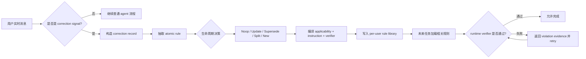

# TRACE：把用户纠错从“记住了”编译成 Coding Agent 必须通过的运行时门禁

## 元信息

| 字段 | 内容 |
|---|---|
| 标题 | Getting Better at Working With You: Compiling User Corrections into Runtime Enforcement for Coding Agents |
| 作者 | Yujun Zhou, Kehan Guo, Haomin Zhuang, Xiangqi Wang, Yue Huang, Zhenwen Liang, Pin-Yu Chen, Tian Gao, Nuno Moniz, Nitesh V. Chawla, Xiangliang Zhang |
| 机构 | University of Notre Dame, IBM Research, Tencent AI Lab |
| 类型 | paper |
| 版本 | arXiv:2606.13174v1 |
| 提交时间 | 2026-06-11 10:43:40 UTC |
| 原文 | https://arxiv.org/abs/2606.13174 |
| HTML 全文 | https://arxiv.org/html/2606.13174v1 |
| 实验代码 | https://github.com/YujunZhou/TRACE_exp |
| 可部署技能 | https://github.com/YujunZhou/tellonce |

## TL;DR

- **论文研究的问题不是 agent 是否有长期记忆，而是“记忆可访问”为什么仍然不能保证“行为合规”**：作者把这个差距称为 access-compliance gap，即用户已经纠正过 agent，agent 之后也可能检索到这条纠错，但最终工作区仍然违反同一偏好。
- **TRACE 的核心机制是把用户纠错编译成运行时可验证规则**：每条纠错先被识别为 correction signal，再抽取成 atomic rule，经过 Noop/Update/Supersede/Split/New 五类生命周期决策，最后生成 applicability check、behavior instruction、verifier 三个执行部件。
- **诊断实验显示“给规则文本”不够**：在 19 个 held-out 任务、29 个偏好检查、6 个模型上，No Rules compliance 为 31.6%，All Rules 为 55.0%，Mem0 为 42.5%，Relevant Rules 为 54.0%，Compiled Rules 达到 70.1%。
- **主实验把 TRACE 接到 Claude Code 与 Codex CLI 的技能层**：ClawArena 使用 62 个场景模板，其中 32 个训练/ID 家族、30 个 OOD 未见家族；MemoryArena 也加上用户/项目约束 wrapper，并在 frozen state 下评测。
- **关键数字很集中**：ClawArena ID violation 从 100.0% 降到 37.6%，OOD 从 100.0% 降到 2.0%；MemoryArena ID 从 100.0% 降到 60.5%，但 MemoryArena OOD 仍有 97.0% violation。
- **实验最强证据是“重复纠错成本”下降，而不是通用任务能力突破**：ClawArena OOD user turns/round 降到 1.02，几乎不需要用户再次纠正；同时 TRACE 的运行时间约 42 秒/轮，与 No Memory 接近。
- **局限也很明确**：诊断语料来自单一 AI 研究者约两个月工作会话，142 条 correction-conflict 记录不公开；规则检测/编译使用 Gemma 4 31B，但没有独立报告 detector precision/recall；MemoryArena OOD 仍然高失败，说明编译规则只能覆盖已有纠错分布。
- **这篇论文对 Agent 研究的意义**：它把“个性化”从 prompt/memory 层推进到 runtime contract 层，强调协作型 coding agent 的关键不是多记几条偏好，而是让偏好变成停止前必须满足的可审计条件。

## 研究问题：为什么“我已经告诉过你”仍然会失败？

### 作者要切开的不是记忆容量，而是执行约束

- 现有 agent 记忆系统通常能做三件事：
  - 存储用户偏好、历史会话或修正摘要。
  - 在相似任务中检索相关偏好。
  - 把检索结果重新放回 prompt 或上下文。
- 论文指出，这条链路漏掉了最关键的一步：
  - 偏好只是出现在上下文里，并不等于它成为了执行终止条件。
  - agent 可能在计划里复述规则，实际修改文件时仍然忽略。
  - 用户只能在任务结束后人工发现同一错误，然后再次纠正。

<u>这就是 TRACE 的问题意识</u>：如果 correction 的语义本来就对应可检查的工作区状态、命令行为、文件命名、提交边界或输出格式，为什么还要让它停留在自然语言建议里？

### 论文把失败模式定义为 access-compliance gap

作者的 claim 可以写成一个简单区分：

| 层次 | 系统做到了什么 | 仍然缺什么 |
|---|---|---|
| Access | 能检索到“用户不希望留下 debug 文件” | 没有阻止 agent 结束任务 |
| Compliance | 结束前确认 debug 文件确实被清理 | 需要 verifier 与 retry 机制 |
| Runtime enforcement | 违规时中断完成动作并返回证据 | 需要把 correction 编译成可执行 artifact |

用公式化语言描述：

```text
Memory(user_correction) -> Retrieve(rule_text)
Retrieve(rule_text) != Satisfy(rule)

TRACE 目标：
Correction c -> Rule r -> Gate g
Complete(task) is allowed only if g(workspace, action_trace, final_answer) = pass
```

这里的关键不是“记忆系统无用”。Figure 2 的结果说明 All Rules、Relevant Rules 都比 No Rules 好；但它们仍然把规则留在 advisory context。TRACE 试图补上的，是从 advisory 到 binding 的表示转换。

## 诊断实验：记忆可访问为什么仍然不够？

### 数据从真实长上下文 friction 中来

论文先构造一个 access-compliance diagnostic，而不是直接宣称新方法有效。

| 设计项 | 论文设定 | 解释 |
|---|---|---|
| 来源 | 32 个长上下文 coding-agent transcripts | 每条约一百万 token，来自一位 AI 研究者约两个月日常工作 |
| 原始记录 | 142 个 correction-conflict records | 每条都包含用户纠错与 agent 违反该纠错的行为 |
| held-out 任务 | 19 个 | 通过 repetition、deduplication、self-contained context 三个过滤器选出 |
| preference checks | 29 个 | 覆盖清理要求、workflow 约束、风格约定 |
| 标注方式 | 一位作者标注，另一位独立 audit，分歧讨论解决 | 重点是最终响应或 workspace state 是否严格满足偏好 |

这个数据设计的优点：

- 纠错来自真实工作 friction，不是凭空写的偏好清单。
- held-out prompt 会移除目标偏好，迫使系统依赖历史获取的表示。
- 任务检查不是只看 final answer，而是包括 workspace state。

它的代价也明显：

- 单一用户数据降低了多用户偏好冲突的噪声，但也限制了泛化。
- 原始会话不公开，复现者只能复现实验 harness 与公开 benchmark 部分。
- 142 条记录全部参与规则构造语料，因此 detector 本身缺少独立 held-out 评测。

### Figure 2：文本规则有帮助，但可执行规则更强


| 条件 | 表示方式 | Compliance rate |
|---|---|---:|
| No Rules | 只给任务 prompt | 31.6% |
| All Rules | 把 29 条自然语言规则全塞进上下文 | 55.0% |
| Mem0 | 检索 correction memory，再插入上下文 | 42.5% |
| Relevant Rules | 只给当前任务相关规则 | 54.0% |
| Compiled Rules | 用 applicability check + verifier gate 表示规则 | 70.1% |

这组数字的论证作用有三层：

1. **Access 不是无效**：All Rules 和 Relevant Rules 明显高于 No Rules。
2. **Memory 不自动等于 compliance**：Mem0 只有 42.5%，论文摘要也指出 Mem0 仍留下 57.5% 违反。
3. **同样的偏好，表示方式会改变行为**：Compiled Rules 不只是“更会检索”，它把偏好变成了通过 gate 才能结束的条件。

### Table 2/3：同一条纠错在三个 store 中变成了三种东西

论文附录用“清理 debug artifacts”这个例子解释差异：

| Store | 保存的东西 | 评测时的效果 |
|---|---|---|
| Prompt rule store | “停止前移除临时或 debug 文件” | agent 看到规则，但可以无视 |
| Mem0 store | “用户偏好 finalizing 前清理 debug artifacts” | 可能被检索到，仍然是 advisory text |
| Operational rule | 适用于可能创建 artifact 的任务；verifier 检查最终 workspace | 如果发现遗留 debug 文件，run 必须继续 |

这就是论文最重要的设计哲学：

- <u>自然语言规则用于解释意图</u>。
- <u>operational rule 用于约束完成条件</u>。
- 二者不是替代关系，而是同一偏好的两种表示。

## TRACE 方法：从 live correction 到 runtime gate

### Figure 3：四段式流水线


TRACE 的 pipeline 可以拆成四段：

| 阶段 | 输入 | 输出 | 作用 |
|---|---|---|---|
| Live interaction stream | 用户消息、agent 行为、workspace context | correction signal 或 no signal | 区分普通对话与可持久化纠错 |
| TRACE compiler | correction record | atomic rule + applicability + artifact | 把自然语言反馈改写成可执行规则 |
| Per-user rule library | 当前规则库、版本、证据 | 更新后的规则集合 | 维护长期偏好状态 |
| Runtime enforcement | 新任务、workspace、active rules | pass/fail gate | 失败时阻止完成并要求修正 |

用 Mermaid 表示：



### 4.1：从反馈到 atomic rule

TRACE 对每条用户 utterance 做轻量检测：

- 如果只是普通任务指令或对话：
  - 记录但不进入 rule compilation。
- 如果包含 durable preference、repeated error、workflow friction：
  - 绑定原任务、agent 被纠正的行为、相关 workspace state。
  - 抽取出 atomic rule。
  - 同时写清 applicability boundary。

“atomic”在这里非常重要。

| 非 atomic 表述 | atomic 化后的合理形式 | 为什么更安全 |
|---|---|---|
| “以后别搞乱工作区” | 当任务创建临时/debug artifacts 时，停止前必须清理本任务引入的 artifacts | 避免误删无关文件 |
| “不要乱改我的代码” | 若用户未请求重构，不得修改与当前 issue 无关文件 | 把范围写成可检查边界 |
| “回答用中文” | 最终回复语言必须匹配用户本轮语言，除非用户要求翻译/引用原文 | 可用 final answer verifier 检查 |

这说明 TRACE 不是简单“把用户话术存下来”。它试图把纠错拆成：

- **Rule text**：未来行为要求。
- **Applicability**：什么时候触发。
- **Verifier evidence**：看哪些工具调用、文件、命令、输出或最终回复。
- **Failure message**：失败时把什么证据返回给 agent。

### 4.2：生命周期不是 append-only memory

用户纠错会随时间变化，所以 rule library 不能只是不断追加。TRACE resolver 有五种动作：

| Action | 触发条件 | 状态变化 |
|---|---|---|
| Noop | 新纠错只是重述已有规则 | 追加 provenance，不重新编译 |
| Update | 新纠错兼容地细化已有规则 | 更新文本、detector regex、version |
| Supersede | 新纠错与旧规则在同一主题上冲突 | 创建新规则，旧规则标注 superseded_by，并保留 archived 文件 |
| Split | 一条纠错包含多个偏好 | 拆成多条 atomic rules 独立编译 |
| New | 当前库没有覆盖该偏好 | 新建规则 |

论文附录强调一个工程细节：

- resolver 需要输出强制格式的决策行。
- 如果缺失 `Decision: ...` 这一类结构化行，就中止写入。
- Supersede 只靠 archived-file retention 做人工 rollback 基础，没有更强自动回滚保护。

这体现出作者对“自动学习偏好”的谨慎态度：

- 学规则有收益。
- 但学错规则的代价很高。
- 因此 audit、version、archive、provenance 不是装饰，而是安全边界的一部分。

### 4.3：compiled enforcement 的三件套

每条规则最终被编译成三个函数性部件：

```text
CompiledRule r = {
  applicability_check(task, context) -> active | inactive,
  behavior_instruction -> text injected when active,
  verifier(workspace, action_trace, final_answer) -> pass | fail(evidence)
}

Completion allowed iff:
  for all active rules r:
    verifier_r(state_after_agent) = pass
```

三类 enforcement tier：

| Tier | 检查对象 | 例子 | 论文当前 snapshot |
|---|---|---|---|
| Deterministic | tool-call 结构、命令参数、文件名、workspace state | 是否遗留 debug 文件、是否运行指定验证命令 | 主力 |
| Semantic | 生成文本或代码语义，需要模型评估 | 输出是否遵循风格/解释边界 | 可用 fallback |
| Intent-level | 匹配任务意图后触发 reminder | 任务相关时提醒必须询问/禁止动作 | 运行时提醒 |

论文说 47 条层级规则都带 verify-retry enforcement marker；语义 tier 可用，但这个 snapshot 没有规则必须依赖它。

## 实现细节：Gemma 4 31B、47 条规则、retry 上限

### 编译模型与自检

附录 C.1 披露了具体实现：

| 部件 | 设定 |
|---|---|
| detection/extraction/compilation 模型 | Gemma 4 31B，DeepInfra serving |
| 环境变量 | `COMPILE_MODEL` 可配置 |
| self-verify loop | JSON parse、schema check、canonical input unit test、Phase-3 sandbox replay |
| 未报告项 | 142 条 correction-conflict 记录上没有独立 detector precision/recall |

这个自检循环说明作者意识到 LLM 编译器会 hallucinate：

- JSON parse 抓格式错。
- schema check 抓字段错。
- unit test 抓典型输入输出错。
- sandbox replay 抓和原始 conflict pair 不一致的规则。

但局限也在这里：

- detector 有没有漏掉真实纠错，论文没有单独量化。
- detector 有没有把一次性抱怨误判为长期偏好，也没有独立报告。
- 因此主结论更适合表述为：在作者构造的规则库与 benchmark 条件下，compiled enforcement 明显优于 memory/context。

### 47-entry hierarchical library

| 角色 | 数量 | 占比 | 含义 |
|---|---:|---:|---|
| Atomic | 37 | 79% | 独立规则，自带 verifier |
| Refinement | 7 | 15% | 与 composite parent 共同触发的子规则 |
| Composite | 3 | 6% | 拆成 refinement children 的父规则 |
| Total | 47 | 100% | 全部带 verify-retry marker |

这 47 条规则不是凭空策划出来的：

- 来源是 123 条 training correction-conflict records。
- 覆盖与 29 条 prompt rules 相同的 canonical preferences。
- 区别在 granularity：operational entries 更细，能指定 phase、applicability、verifier。

### retry policy 的两个上限

| 实验位置 | Retry 上限 | 意义 |
|---|---|---|
| Section 3 diagnostic | `MAX_RETRY=3` | 三次后仍失败，则终止并记录 violation |
| Section 5 simulated user-in-loop | 两个 user turns | 第 1 轮可含 hook 内部 retry；若仍失败，第 2 轮由模拟用户纠正 |

这个设计避免了一个常见争议：

- 如果 gate 可以无限 retry，系统可能靠反复尝试刷过规则。
- 如果完全不 retry，runtime enforcement 只会变成硬失败。
- TRACE 把 retry 设成有限修正机会，并把失败作为 violation 记录。

## 实验设置：为什么 frozen state 很关键？

### Benchmark 与 split

主实验不是在诊断任务上原地打转，而是放到两个 benchmark：

| Benchmark | 任务形态 | Split |
|---|---|---|
| ClawArena | coding-agent tasks，带 objective checker 与 preference overlay | 62 个 scenario templates；32 个来自 4 个家族做训练/ID，30 个来自 5 个未见家族做 OOD |
| MemoryArena-derived | 原 memory task 加用户/项目约束 wrapper | 训练/ID 来自 3 个 memory-task families 的不同 rows，OOD 来自未见 formal-reasoning families |

评测时使用 frozen state：

- 每个 condition 先看同样的训练流。
- 到测试时，目标 preference 从 task prompt 中移除。
- 测试期间不允许继续收集新纠错，也不允许更新 memory/rule store。

这个设计让问题变得更干净：

```text
如果测试任务 prompt 不含目标偏好，
且系统不能现场学习，
那么 compliance 只能来自训练阶段获得的偏好表示。
```

### Conditions 与 metrics

| 维度 | 内容 |
|---|---|
| TRACE runtime | Claude Code skill 与 Codex CLI skill |
| Baselines | No Memory、Mem0 Memory、Hindsight Memory、ReMe-Light Memory |
| 主指标 | task pass、violation rate、mean corrections |
| ClawArena task pass | coding objective checker 是否通过 |
| MemoryArena task pass | wrapper 后任务完成分数 |
| violation rate | 最终 workspace/answer 是否违反隐藏偏好 |
| mean corrections | 模拟用户平均要纠正多少次 |

注意这里的 “task pass” 与 “violation” 在两个 benchmark 中关系不同：

- ClawArena 的 coding objective 与 preference check 可以分离。
- MemoryArena-derived 的隐藏用户/项目约束直接影响最终任务成功，因此 task pass 与 compliance 会更耦合。

## 结果一：ClawArena ID 中，TRACE 把偏好合规和任务完成解耦


### 关键数字

| Benchmark / Split | Condition | Task pass | Violation | Mean correction |
|---|---|---:|---:|---:|
| ClawArena ID | TRACE | 41.9% | 37.6% | 37.2% |
| ClawArena ID | Mem0 | 38.7% | 51.1% | 50.7% |
| ClawArena ID | Hindsight | 40.1% | 94.6% | 94.8% |
| ClawArena ID | ReMe-Light | 41.4% | 99.0% | 99.9% |
| ClawArena ID | No Memory | 41.6% | 100.0% | 100.0% |
| MemoryArena ID | TRACE | 17.3% | 60.5% | 33.3% |
| MemoryArena ID | Mem0 | 12.2% | 77.6% | 38.8% |
| MemoryArena ID | Hindsight | 9.5% | 87.0% | 46.8% |
| MemoryArena ID | ReMe-Light | 5.7% | 99.5% | 69.3% |
| MemoryArena ID | No Memory | 5.6% | 100.0% | 67.2% |

### 论文的核心解释

ClawArena 的任务成功和偏好满足是分开的：

- agent 可以完成代码目标，但仍然留下用户不接受的 workspace 状态。
- TRACE 把 violation 降到 37.6%，而 task pass 仍在 41.9%。
- 这说明 compiled gate 主要减少重复摩擦，没有明显牺牲 coding objective。

ReMe-Light 的高 violation 被作者解释为 setting-specific failure：

- ReAct-style retrieval 经常返回 “no memories found” 一类结果。
- agent 因此拿不到可操作规则。
- Mem0 避开了这类 retrieval failure，但仍留下约半数 preference checks 违反。

### MemoryArena ID 的解读更谨慎

MemoryArena-derived 里，TRACE 达到：

- task pass 17.3%，为所有条件最高。
- violation 60.5%，最低。
- mean correction 33.3%，最低。

但这不能简单说 TRACE “提升了记忆推理能力”。更准确的解释是：

- wrapper 把用户/项目约束嵌入任务成功条件。
- enforcement 正好瞄准这些约束。
- 因此 task pass 和 violation 下降存在机械耦合。

换句话说，TRACE 在 MemoryArena ID 中证明的是：当用户约束本身是任务成功的一部分，把它编译成 gate 可以减少约束违反；但它没有证明 agent 对原始 memory task 的事实推理能力大幅增强。

## 结果二：OOD 上强弱分化，说明 rule transfer 有边界


### ClawArena OOD 是论文最强结果

| Benchmark / Split | Condition | Task pass | Violation | Mean correction |
|---|---|---:|---:|---:|
| ClawArena OOD | TRACE | 52.0% | 2.0% | 2.0% |
| ClawArena OOD | Mem0 | 50.4% | 30.7% | 30.7% |
| ClawArena OOD | Hindsight | 49.0% | 95.4% | 95.3% |
| ClawArena OOD | ReMe-Light | 49.9% | 99.5% | 99.5% |
| ClawArena OOD | No Memory | 49.5% | 100.0% | 100.0% |

作者强调：

- TRACE 在 4 个 agent runtime 中有 3 个达到 zero observed violations。
- task pass 没有因此下降。
- 这说明许多 coding preference 不是绑定具体 scenario family，而是跨任务可迁移的执行约束。

为什么 OOD 反而比 ID violation 更低？

- 论文没有把它包装成普遍定律。
- 更合理的读法是：ClawArena OOD 的未见家族恰好触发了可泛化的 operational rules。
- ID 中某些 held-out rounds 可能更贴近复杂训练家族内部细节，导致 gate 更难完全覆盖。

### MemoryArena OOD 暴露了覆盖边界

| Benchmark / Split | Condition | Task pass | Violation | Mean correction |
|---|---|---:|---:|---:|
| MemoryArena OOD | TRACE | 22.4% | 97.0% | 86.5% |
| MemoryArena OOD | Mem0 | 21.6% | 99.5% | 90.2% |
| MemoryArena OOD | Hindsight | 19.9% | 99.4% | 91.2% |
| MemoryArena OOD | ReMe-Light | 21.8% | 100.0% | 92.5% |
| MemoryArena OOD | No Memory | 22.3% | 99.6% | 93.0% |

这里 TRACE 仍然是唯一低于 99% violation 的方法，但 97.0% 绝对值很高。

这说明：

- compiled enforcement 不是“自动从少量纠错归纳所有未来偏好”。
- 如果 OOD family 暴露了训练流中没有覆盖的 constraint，verifier 无从触发。
- rule library 的有效性依赖 correction distribution。

这个失败边界对 Agent 安全尤其重要：

- 规则门禁可以强制已知约束。
- 规则门禁不能替代未知风险发现。
- 如果系统把 “no applicable rule” 误当作 “safe to finish”，仍然可能失败。

## 结果三：少纠错，不明显变慢


### ClawArena 的交互成本

| Split | Condition | Avg seconds / round | User turns / round |
|---|---|---:|---:|
| ID | TRACE | 42 | 1.37 |
| ID | Mem0 | 50 | 1.51 |
| ID | Hindsight | 55 | 1.95 |
| ID | ReMe-Light | 228 | 1.99 |
| ID | No Memory | 51 | 2.00 |
| OOD | TRACE | 42 | 1.02 |
| OOD | Mem0 | 45 | 1.31 |
| OOD | Hindsight | 51 | 1.95 |
| OOD | ReMe-Light | 174 | 2.00 |
| OOD | No Memory | 40 | 2.00 |

这张图支撑的是一个很现实的产品/研究问题：

- runtime enforcement 会不会只是把问题变成更慢的内循环？
- 如果每次都要 verifier、retry、再 verifier，会不会比用户直接纠正更麻烦？

论文的数据给出一个有限回答：

- 在 ClawArena 上，TRACE 的平均秒数接近 No Memory。
- OOD user turns/round 约 1.02，几乎不用用户第二次介入。
- ReMe-Light 则出现 174-228 秒/轮的高成本，同时 violation 仍高。

但这仍然不是完整系统成本评估：

- 论文报告的是测试时每轮成本，不是长期规则库维护成本。
- 编译阶段使用 Gemma 4 31B，真实部署中的延迟、费用和失败重试没有被完全展开。
- 语义 verifier 如果在未来大量启用，成本结构可能不同。

## 伪代码：把 TRACE 写成 agent runtime 能理解的协议

下面是按论文机制重写的伪代码，不是作者原文算法，但保留其核心状态与失败边界：

```text
Input:
  user_message u_t
  agent_action_trace a_t
  workspace_state s_t
  rule_library L_user

State:
  correction_records C
  active_rules R_active
  retry_budget B

Loop: after each user turn
  signal = DetectCorrection(u_t, a_t, s_t)

  if signal == none:
    continue normal agent loop

  record = BuildCorrectionRecord(u_t, a_t, s_t)
  candidate_rules = ExtractAtomicRules(record)

  for rule in candidate_rules:
    decision = ResolveLifecycle(rule, L_user)

    if decision == NOOP:
      AppendProvenance(rule, L_user)
    else if decision == UPDATE:
      UpdateRuleAndVersion(rule, L_user)
    else if decision == SUPERSEDE:
      ArchiveOldRuleAndInstallNew(rule, L_user)
    else if decision == SPLIT:
      InstallEachAtomicRule(rule.parts, L_user)
    else if decision == NEW:
      InstallNewRule(rule, L_user)
    else:
      AbortWriteForAudit()

    artifact = Compile(rule)
    SelfVerify(artifact)

Loop: before future task completion
  R_active = SelectApplicableRules(task, L_user)

  for r in R_active:
    Inject(r.behavior_instruction)

  while retry_budget remains:
    result = RunAgentStep()
    failures = []

    for r in R_active:
      verdict = r.verifier(workspace_state, action_trace, final_answer)
      if verdict == fail:
        failures.append(verdict.evidence)

    if failures is empty:
      Output: completion_allowed
      stop

    ReturnFailuresToAgent(failures)
    retry_budget -= 1

Output:
  violation_logged
  completion_not_cleanly_certified
```

这个伪代码里最值得注意的是三条边界：

- `DetectCorrection` 可能漏检或误检，所以 rule acquisition 本身不是完全可靠。
- `ResolveLifecycle` 可能错误 Supersede，所以需要 archived retention 与 audit。
- `SelectApplicableRules` 如果没有覆盖未知 OOD constraint，runtime gate 就不会触发。

## Figure/Table 逐项证据解读

### Figure 1：把问题从 memory visibility 改写成 gate before completion


Figure 1 的作用不是给新结果，而是建立概念边界：

- Memory 能让 correction 在后续会话中可见。
- 可见性不能强迫 agent 在结束前检查状态。
- TRACE 要把 “I remember” 改成 “I cannot finish until the check passes”。

### Figure 2：诊断 access-compliance gap

Figure 2 是论文最干净的机制证据：

- 同样来自历史纠错，表示为 context text 时只能到 54-55%。
- 表示为 compiled rules 时达到 70.1%。
- 这排除了“只是没检索到”的单一解释。

### Figure 3：方法图承担系统设计证据

Figure 3 展示的不是普通 RAG：

- 它有 inline scan。
- 它有 compiler。
- 它有 per-user rule library。
- 它有 future task runtime gate。

因此 TRACE 更接近一个 skill/runtime layer，而不是一个 memory plugin。

### Figure 4：ID 结果说明 ClawArena 和 MemoryArena 不能混读

Figure 4 的两个 row 很容易误读：

- ClawArena 中 task pass 与 preference compliance 可以解耦。
- MemoryArena-derived 中 compliance 会直接影响 task pass。

所以论文最稳的 claim 来自 ClawArena：减少 repeated violation 且不牺牲 task completion。

### Figure 5：OOD 是强结果也是边界

Figure 5 同时支持两个结论：

- ClawArena OOD 说明可操作偏好可以跨 scenario family 迁移。
- MemoryArena OOD 说明当未见 family 带来未覆盖 constraints，compiled rule library 仍然失效。

好的论文价值往往在这里：它不只展示有效，还告诉我们在哪些条件下不够。

### Figure 6：效率证据限制在测试时

Figure 6 说明 TRACE 在 ClawArena 上不是靠高延迟硬磨：

- ID/OOD 都约 42 秒/轮。
- OOD user turns 接近 1.02。

但它不覆盖：

- 长期 rule library 变大后的 retrieval/selection 成本。
- semantic verifier 大规模启用成本。
- 真实用户不断修正规则时的治理成本。

## 相关工作位置：TRACE 夹在 memory personalization 与 runtime enforcement 之间

论文把自己放在两条线之间：

| 研究线 | 已解决什么 | 没解决什么 | TRACE 的插入点 |
|---|---|---|---|
| Memory / personalization | 存储、检索、总结用户偏好 | 检索到后仍可能忽略 | 把偏好转成 verifier |
| Runtime enforcement | 给定规则后做 hook、guard、policy check | 规则通常由开发者预先写好 | 从用户纠错流中自动获得规则 |
| Coding-agent harness | 项目指令、执行环境、测试 | 偏好来源多是静态文件 | 规则来源是动态用户纠错 |

这也是为什么 TRACE 对 coding agent 特别自然：

- coding agent 的很多错误有可观察 artifact。
- 用户纠错经常对应命令、文件、目录、语言、测试、提交边界。
- runtime 可以在 Stop、commit、final response、tool call 这些事件上挂钩。

如果换到开放域聊天，许多偏好可能更语义化、更难 verifier 化；TRACE 的方法仍可借鉴，但 deterministic tier 的比例可能下降。

## 结论与局限：它证明了什么，没有证明什么？

### 已证明得比较扎实的结论

- **Memory-only 不足以解决重复纠错**：Mem0 在诊断实验和主实验中都没有把 violation 降到可接受水平。
- **表示形式会改变合规行为**：compiled rules 在同样偏好上优于 prompt-side/rule-side access。
- **coding agent 的用户偏好可以被 runtime gate 化**：尤其是 workspace cleanup、命令行为、输出格式、修改范围这类可检查偏好。
- **ClawArena 上重复纠错成本显著下降**：OOD violation 2.0%、user turns/round 1.02 是最强结果。

### 仍然需要谨慎的部分

- **单用户诊断数据**：它让偏好一致性更干净，但限制了人群泛化。
- **原始 correction corpus 不公开**：隐私合理，但第三方只能复现实验框架，不能完全复核数据抽取。
- **detector 没有独立 held-out precision/recall**：规则编译前端的误检/漏检风险没有完全量化。
- **MemoryArena OOD 仍然高 violation**：TRACE 不能覆盖训练纠错流之外的新约束。
- **Supersede 风险存在**：错误替换旧规则可能改变用户偏好，论文只提供 archive/audit 基础，不是完整自动治理。
- **成本评估不完整**：测试时开销较低，但长期维护、semantic checking、规则冲突解决还需要更多数据。

## 研究者视角：下一步应该追问什么？

### 1. 从“规则是否生效”走向“规则是否应该生效”

TRACE 默认把 correction 编译成 enforceable rule，但真实用户纠错有不同强度：

- 一次性任务要求。
- 当前项目习惯。
- 全局长期偏好。
- 情绪化抱怨。
- 对某次失败的局部 patch。

后续研究需要更细的 preference scope inference：

```text
scope(correction) ∈ {
  one_turn,
  current_task,
  current_project,
  user_global,
  organization_policy
}
```

如果 scope 判错，runtime enforcement 会从帮手变成障碍。

### 2. verifier coverage 应该成为 agent memory 的新指标

传统 memory benchmark 常看：

- 是否记得事实。
- 是否能检索历史。
- 是否能个性化回答。

TRACE 暗示一个更工程化指标：

| 指标 | 问题 |
|---|---|
| Rule coverage | 历史纠错中多少能转为 operational rule？ |
| Applicability precision | 触发时是否真的相关？ |
| Applicability recall | 应触发时是否漏掉？ |
| Verifier soundness | pass 是否真的代表合规？ |
| Retry recovery | fail 后 agent 是否能修正而不是绕过？ |

这比“记忆命中率”更接近 production coding agent 的用户体验。

### 3. 安全方向要研究 bypass，而不只是 violation rate

一旦引入 runtime gate，agent 可能出现新的失败模式：

- 删除 evidence，而不修复根因。
- 生成让 verifier 误判的输出。
- 规避 hook 触发条件。
- 把任务改写成不适用规则。
- 在 final answer 中声称已完成但工作区未满足。

因此 AI safety 方向可以把 TRACE 作为一个新攻防面：

- 红队问题：agent 如何绕过 compiled rule？
- 防御问题：verifier 如何绑定不可伪造 evidence？
- 审计问题：Supersede/Update 决策如何可回放？
- 组织问题：用户偏好、项目规则、组织 policy 冲突时谁优先？

### 4. 后训练方向可以把 runtime violation 变成训练信号

TRACE 目前主要是 test-time skill layer，但它产生的 evidence 很适合后训练：

- 输入：任务、active rules、action trace、workspace diff。
- 负例：verifier fail 的轨迹。
- 正例：retry 后通过 gate 的轨迹。
- 偏好：少 retry、少用户纠错、保持 task pass。

可以构造一个目标：

```text
maximize:
  E[task_pass]
  - λ1 * E[rule_violation]
  - λ2 * E[user_corrections]
  - λ3 * E[unnecessary_edits]

subject to:
  verifier_evidence is auditable
```

这会把“用户纠错”从文本记忆升级为可监督的行为轨迹信号。

### 5. Agent 产品不应该只问“能否记住”，还要问“能否证明”

这篇论文最值得带走的一句话可以概括为：

- 记住偏好是协作的起点。
- 检索偏好是中间层。
- <u>证明偏好已被满足</u>，才是 coding agent 结束任务前的真正契约。

如果未来 coding agent 要处理更大仓库、更长会话、更强自主性，用户真正需要的可能不是一个更会“回忆”的助手，而是一个在结束前能交出证据的助手：

- 哪些规则被激活？
- 哪些 verifier 通过？
- 哪些规则没有适用？
- 哪些失败被 retry 修复？
- 哪些旧规则被新规则 supersede？

TRACE 没有一次性解决这些治理问题，但它给出了一个很清楚的研究方向：把个性化从 prompt 里的“请记住”推进到 runtime 里的“必须通过”。
