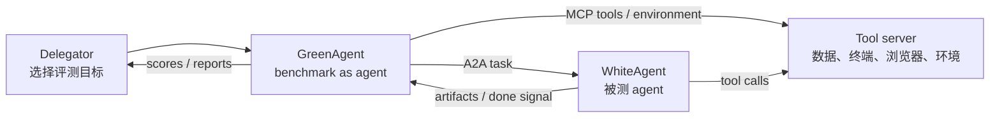

# AgentBeats：把 Agent 评测本身也做成 Agent

## 元信息与 TL;DR

- **标题**：AgentBeats: Agentifying Agent Assessment for Openness, Standardization, and Reproducibility
- **来源**：arXiv:2606.13608v1，2026-06-11 提交
- **方向**：大模型 Agent、Agent benchmark、A2A、MCP、coding-agent evaluation
- **核心问题**：现在的 Agent benchmark 太依赖各自 harness，导致“模型能力”“Agent harness 能力”和“benchmark 适配能力”混在一起。
- **作者方案**：提出 **Agentified Agent Assessment, AAA**，让 benchmark 也成为一个 Agent；评测方 agent 通过 A2A 下发任务，通过 MCP 暴露工具，被测 agent 只要遵循同一套 agent-native 接口即可接入。
- **系统落地**：AgentBeats 给出五种运行模式：Local、Remote、Hosted、Proxy、CI，分别处理本地开发、私有 Agent、平台托管、反向代理调试和可审计 CI 评测。
- **规模证据**：五个月开放竞赛中，作者记录到 **298 个 GreenAgent**、**467 个 WhiteAgent**、**12 个类别**，并观察到 Tau2-Bench 等已有 benchmark 被 agentify。
- **实验结果**：在 coding-agent case study 中，作者用统一 AAA 流程评估 4 组 model-harness 组合、3 个 benchmark；DevEval 上 GPT-5.4 x Codex 为 **94.8%**，SWE-Bench Pro 上 Claude Opus 4.7 x Claude Code 为 **69.1%**，Terminal-Bench 2.0 上 Claude Opus 4.7 x Claude Code 为 **68.5%**。
- **消融证据**：harness swap 显示 native pairing 在 6 个对照中赢 5 个，平均领先 **5.3 个百分点**；这说明 coding agent 的公开成绩不能只看模型名，harness 与模型存在共同适配。
- **局限**：论文更像标准化与系统论文，不是新模型训练论文；AAA 的安全、作弊防护、长任务成本、跨平台服务稳定性仍依赖具体 GreenAgent 实现。

### 一句话判断

- **AgentBeats 的价值不在“又做了一个排行榜”，而在把评测接口从 benchmark-specific harness 改成 agent-native protocol。**
- <u>如果这个方向成立，未来 Agent benchmark 的核心资产会从“脚本和 leaderboard”迁移到“可复用的评测 Agent、工具服务和可审计运行记录”。</u>

## 1. 研究问题：为什么 Agent 评测比 LLM 评测更难标准化？

### 1.1 传统 LLM benchmark 的隐含假设失效了

- 传统 LLM benchmark 常见流程：
  - 给模型一个 prompt。
  - 收集模型输出。
  - 用 exact match、unit test、judge model 或人工规则打分。
- 这个流程默认“被评测对象”主要是一个模型接口。
- 但 Agent 系统不是单一模型，它通常包含：
  - 工具调用协议。
  - 记忆或状态。
  - 环境初始化。
  - 文件系统、浏览器、终端或远程机器。
  - 任务执行 harness。
  - 多轮交互与失败恢复。

### 1.2 Agent benchmark 的真实瓶颈是接口碎片化

| 评测对象 | 传统 benchmark 默认看什么 | Agent 评测真正需要看什么 |
|---|---:|---:|
| 模型回答 | 单轮或多轮文本输出 | 工具、状态、执行轨迹和最终 artifact |
| 任务输入 | prompt 或固定样本 | 可执行环境、工具权限、上下文和目标 |
| 评测逻辑 | benchmark 自己控制 | benchmark 与 Agent 共同完成交互 |
| 适配成本 | 一个模型 API 适配很多任务 | N 个 benchmark x M 个 Agent 容易变成 N x M 集成 |
| 可复现性 | 输入输出较容易记录 | harness、环境、权限和交互时序都要记录 |

作者用一个非常直接的公式表达这种成本差异：

```text
传统做法：N 个 benchmark x M 个 agent = N * M 次定制集成
AAA 做法：N 个 benchmark agent + M 个被测 agent = N + M 次协议集成
```

这个公式不是数学证明，而是系统设计目标：

- benchmark 不再假设自己能直接控制每一种 Agent harness。
- 被测 Agent 不再为每个 benchmark 写专门适配层。
- 双方都只需要面向一个 agent-native 通信接口。


### 1.3 作者真正反对的不是 benchmark，而是 tightly coupled benchmark

论文反复强调两个问题：

- **test-production mismatch**：
  - 生产 Agent 可能通过 Claude Code、Codex CLI、OpenCode、mini-SWE-agent 等 harness 运行。
  - benchmark 却可能只允许替换底层 LLM，而不是替换完整 Agent。
  - 结果是测出来的能力不一定等于用户真实运行的能力。
- **public record incomplete**：
  - 公开分数常常来自供应商报告、专有 harness 或不同团队复现。
  - 同一模型在不同 harness 下可能差很多。
  - 仅靠 leaderboard 很难判断“模型强”还是“harness 强”。

## 2. 论文主张：评测 Agent 的 benchmark 也应该是 Agent

### 2.1 AAA 的一句话定义

**AAA 是一种把 benchmark 实现为评测 Agent 的范式。**

它包含三个角色：

| 角色 | 论文术语 | 作用 |
|---|---|---|
| 评测方 Agent | GreenAgent | 承载 benchmark 数据、任务分发、环境准备、评分和结果汇总 |
| 被测 Agent | WhiteAgent | 接收任务、使用工具、完成目标、返回结果 |
| 发起者 | Delegator | 选择 GreenAgent、指定 WhiteAgent、设置评测配置 |

这里最容易误解的是 GreenAgent：

- GreenAgent 不等于 LLM-as-a-judge。
- LLM judge 只是 GreenAgent 内部可能使用的一个评分组件。
- GreenAgent 可以是 deterministic workflow，也可以包含 prompt-driven user simulator 或 semantic judge。
- 重点是它以 Agent 服务形态暴露 benchmark 行为，而不是把 benchmark 写死在某个 harness 里。

### 2.2 为什么用 A2A 和 MCP？

作者选择两个已经在 Agent 工程中被采用的协议：

- **A2A**：
  - 负责任务管理。
  - 支持任务说明、进度、artifact、多模态数据和双向通信。
  - 让评测请求、任务分发和结果回传更像 Agent 间协作。
- **MCP**：
  - 负责工具访问。
  - 把环境能力、函数调用和资源访问包装成结构化服务。
  - 让 WhiteAgent 不必知道 benchmark 内部实现，只需要连接 GreenAgent 提供的工具。

作者的选择很务实：

- 不是发明一个全新的 benchmark protocol。
- 而是复用 Agent 开发者已经在接触的 production-facing protocol。
- 这样能降低 adoption friction。

### 2.3 AAA 的四步交互

论文中的交互流程可以压缩成下面四步：

1. **Delegation**：
   - Delegator 选择 GreenAgent 和一个或多个 WhiteAgent。
   - 请求里写明评测目标、配置和期望结果格式。
2. **Task distribution and authorization**：
   - GreenAgent 准备数据、环境和 MCP 工具。
   - GreenAgent 通过 A2A 把自包含任务发给 WhiteAgent。
3. **Task fulfillment**：
   - WhiteAgent 在权限范围内调用工具、探索环境、生成 artifact。
   - 如果任务需要，它可以继续与 GreenAgent 交互。
4. **Result reporting**：
   - GreenAgent 收集结果、运行评分逻辑、返回指标。




## 3. 方法机制：AgentBeats 如何把 AAA 落到真实评测系统？

### 3.1 AgentBeats 要同时满足三类现实约束

论文把 AAA 的落地约束拆成三类：

| 约束 | 含义 | 为什么重要 |
|---|---|---|
| Openness | 鼓励模块化、开源、可协作迭代 | benchmark 和 Agent 都需要社区复现 |
| Privacy | 支持闭源模型、私有 Agent、隐藏测试数据 | 真实生产 Agent 未必能公开代码 |
| Reproducibility | 明确流程、状态和自动化 | Agent 评测常受环境与时序影响 |

这三个目标天然冲突：

- 完全开放容易泄露测试数据。
- 完全私有又难以审计。
- 完全可复现可能牺牲线上服务型 Agent 的部署灵活性。

因此 AgentBeats 没有只给一个运行模式，而是给五种。

### 3.2 五种 operation mode

| 模式 | Agent 在哪里实例化 | 谁发起评测 | 结果在哪里展示 | 最适合什么场景 |
|---|---|---|---|---|
| Local Mode | 本机 | 本地脚本 | 本地终端或文件 | 本地开发、私有 on-prem 评测 |
| Remote Mode | 远程开发者服务器 | AgentBeats 平台 | AgentBeats 平台 | 私有 Agent 的公开评测 |
| Hosted Mode | 平台托管服务器 | AgentBeats 平台 | AgentBeats 平台 | 公开 blueprint 或 Docker image |
| Proxy Mode | 本地 + 远程 | AgentBeats 平台 | 平台日志 + 本地流式日志 | 本地开发时接入远程参与者 |
| CI Mode | CI 平台 | push 或 workflow trigger | CI log 或提交 artifact | 可审计、公开、自动化评测 |

### 3.3 三阶段 lifecycle

AgentBeats 的每种模式都围绕同一个生命周期：

1. **Agent construction**：
   - 准备 Agent blueprint 或 live A2A service。
   - 推荐提供 Dockerfile。
   - LLM API key、A2A host 等配置应通过环境变量注入。
2. **Agent registration**：
   - 把 GreenAgent 和 WhiteAgent 注册为可引用实体。
   - 可以是服务 URL、Git repo、Docker image 或平台 stub。
   - 如果是 blueprint，平台要先实例化服务。
3. **Assessment execution**：
   - Delegator 发起评测。
   - GreenAgent 分发任务、暴露环境、收集 artifact、运行评分。
   - 结果返回给请求者或公开展示。


### 3.4 这不是“多一个平台”，而是“把 benchmark 变成服务边界”

AgentBeats 的系统设计可以用下面的边界来理解：

```text
Benchmark dataset + env setup + scoring logic
        |
        v
GreenAgent service boundary
        |
        | A2A task + MCP tools
        v
WhiteAgent service boundary
        |
        v
Artifacts / completion signal
```

这个边界带来两个工程效果：

- benchmark 设计者可以把数据采样、环境 reset、评分粒度、judge prompt、工具描述封装到 GreenAgent。
- Agent 开发者只需要保证 WhiteAgent 能理解 A2A 任务，并能动态连接 GreenAgent 指定的 MCP 工具。

## 4. 关键设计：为什么 AAA 能同时支持确定性和语义评测？

### 4.1 Programmatic internalization

这种方式把 benchmark 原本的评测逻辑硬编码进 GreenAgent：

- 适合 terminal-bench、SWE-Bench 类任务。
- 评分脚本、单元测试、环境构建都可以确定性执行。
- 优点是可复现、可审计、争议较少。
- 缺点是迁移成本仍然不低，尤其是环境复杂时。

### 4.2 Semantic internalization

这种方式用自然语言 prompt 描述评测流程：

- 适合 user simulation、对话任务、主观质量评价。
- 可把 LLM-as-a-judge、模拟用户、任务生成器作为 GreenAgent 内部组件。
- 优点是迁移速度快，能覆盖更复杂的交互评测。
- 缺点是 judge 稳定性、prompt injection、评价一致性都要额外控制。

### 4.3 作者给出的开发者实践清单

对于 WhiteAgent 开发者：

- 如果现有 Agent 不支持 A2A：
  - 保留原包。
  - 加一个薄 A2A wrapper。
  - 把任务说明转成 Agent 原本能理解的输入。
- 如果现有 Agent 不支持动态 MCP：
  - 在 wrapper 层解析 A2A message 中的 MCP server 配置。
  - 动态加载新工具。
- 如果任务需要浏览器、终端、SSH、文件系统：
  - WhiteAgent 要么内建这些能力。
  - 要么通过 GreenAgent 提供的 MCP remote tool 访问。

对于 GreenAgent 开发者：

- 明确测试数据如何采样。
- 明确环境如何准备、重置、注入数据。
- 明确任务说明如何写成自包含 A2A message。
- 明确工具如何暴露、权限如何收敛。
- 明确完成后用哪些指标评分。
- 记录 sampled data id、dataset size、配置和运行元数据，方便聚合。

## 5. 规模证据：五个月竞赛说明 AAA 至少能被社区使用

### 5.1 竞赛设置

作者不是只做一个 toy demo，而是围绕 AgentX-AgentBeats competition 做 field study：

- 与 Agentic AI MOOC 社区相关。
- 社区规模约 **40,000 registered learners**。
- 比赛持续六个月，论文写作时已有五个月数据。
- Phase 1 主要鼓励构建 GreenAgent。
- Phase 2 邀请更多 WhiteAgent 参与评测。
- 所有提交要求遵循 AAA，并符合 A2A 与 MCP 标准。

### 5.2 采集到的规模数字

| 指标 | 数字 | 解释 |
|---|---:|---|
| GreenAgents | 298 | 被 agentify 的评测 Agent |
| WhiteAgents | 467 | 参与评测的被测 Agent |
| Categories | 12 | 覆盖工具使用、coding、浏览器、多 Agent 游戏、医疗、网络安全等 |
| Tau2-Bench assessments | 347 | 来自 42 个 unique WhiteAgents |
| 高频提交开发者 | 16 | 每人提交 10 个或更多 Agent 版本 |

### 5.3 代码与 prompt 统计

| 角色 | Python 平均 LOC | 含 prompt 的 repo 比例 | prompt 平均 LOC | prompt 平均字符数 | prompt 字符占比 |
|---|---:|---:|---:|---:|---:|
| GreenAgent | 5.3k | 78.3% | 241 | 11.6k | 5.00% |
| WhiteAgent | 3.8k | 87.1% | 184 | 8.7k | 7.35% |
| Total | 4.1k | 81.7% | 192 | 9.3k | 6.66% |

这些数字说明两点：

- AAA 不是只有一种“纯代码 benchmark”形态，prompt-driven evaluation logic 已经很常见。
- GreenAgent 的代码量不算轻，但也没有重到只能由 benchmark 官方团队维护。

### 5.4 这个 field study 能证明什么，不能证明什么？

能证明：

- 许多 benchmark 可以被转换成 GreenAgent。
- A2A + MCP 足以覆盖多类 Agent 评测场景。
- 社区开发者愿意按这个接口提交 Agent。
- Agentification 不只是论文里的抽象概念。

不能证明：

- 所有 GreenAgent 都公平、稳健、安全。
- 所有 prompt-based judge 都一致。
- 所有 benchmark 迁移成本都低。
- AAA 天然防止 benchmark leakage、overfitting 或 agent 作弊。

## 6. Coding-agent case study：为什么统一 harness 很重要？

### 6.1 实验设置

作者选了 4 组 model-harness 组合：

| 模型 | Harness | 说明 |
|---|---|---|
| Claude Opus 4.7 | Claude Code | proprietary model + production harness |
| GPT-5.4 | Codex CLI | proprietary model + production harness |
| Gemini 3.1 Pro | OpenCode | proprietary model + recommended harness |
| Qwen3.5-397B-A17B | mini-SWE-agent | open-weight model + research harness |

评测覆盖 3 个 benchmark：

- **DevEval**：
  - function-level completion。
  - 作者改造成 agentic setting。
  - 验证 ground-truth 后保留 **1,222 instances**。
- **SWE-Bench Pro**：
  - repository-level issue resolution。
  - 使用 public split 的 **731 instances**。
- **Terminal-Bench 2.0**：
  - terminal-mediated workflows。
  - 使用全部实例。

实验配置：

- 每个 Agent 使用默认 prompt、reasoning setting、inference configuration。
- Opus 4.7 thinking level 为 xHigh。
- GPT-5.4 为 Medium。
- Gemini 3.1 Pro 为 High。
- Qwen3.5 开启 thinking，但不额外设置 effort。
- 全部实验成本约 **6,000 美元**。

### 6.2 主结果：没有一个 Agent 在三个 benchmark 全部领先

| Benchmark | 第一名 | Solve rate | 成本线索 |
|---|---|---:|---:|
| DevEval | GPT-5.4 x Codex | 94.8% | $0.20 / instance |
| SWE-Bench Pro | Claude Opus 4.7 x Claude Code | 69.1% | $2.28 / instance |
| Terminal-Bench 2.0 | Claude Opus 4.7 x Claude Code | 68.5% | $1.09 / instance |

更完整的结果：

| Benchmark | Claude Opus 4.7 x Claude Code | GPT-5.4 x Codex | Gemini 3.1 Pro x OpenCode | Qwen3.5 x MSA |
|---|---:|---:|---:|---:|
| DevEval solve rate | 91.9% | **94.8%** | 88.8% | 71.4% |
| SWE-Bench Pro solve rate | **69.1%** | 62.1% | 54.4% | 45.8% |
| Terminal-Bench 2.0 solve rate | **68.5%** | 67.4% | 65.2% | 36.0% |

作者的解释很关键：

- Terminal-Bench 2.0 上前三名只差 **3.3 个百分点**，区分力有限。
- SWE-Bench Pro 上相邻系统约差 **7 个百分点**，更能拉开强弱。
- open-weight Qwen3.5 x MSA 有非零能力，但稳定落后于 proprietary production harness。
- Gemini 3.1 Pro x OpenCode 在 DevEval 成本最高、solve rate 却最低，作者把这归因于 repository exploration 低效和 model-harness incompatibility；其 tool-call error rate 为 **2%**，超过其他 Agent 的 **10 倍**。

### 6.3 与公开记录的差异：leaderboard 不是纯模型比较

论文指出，公开记录至少有三种混杂因素：

- 同一模型配不同 harness，分数可大幅变化。
- proprietary harness 不可复现，外部团队无法完全检查。
- public scores 常缺少生产 harness 下的完整矩阵，只给 vendor in-house pairing。

例子：

- SWE-Bench Pro 上，Gemini 官方 proprietary harness 分数比 benchmark 团队用 MSA 得到的同模型分数高 **8 个百分点**。
- Terminal-Bench 2.0 上，公开记录中 GPT-5.4 在 proprietary harness 下比 Opus 4.7 约高 **6 个百分点**。
- 但在作者统一的 model-harness setting 下，Opus 4.7 反而领先 GPT-5.4 **1.1 个百分点**。

这不是说公开记录错误，而是说：

- leaderboard 的单位不能只写“模型名”。
- 至少要写清模型、harness、reasoning effort、环境、memorization screen、数据版本和评分脚本。

## 7. 消融：harness swapping 暴露了模型与工具壳的共同适配

### 7.1 实验设计

作者把两个强 Agent 的 harness 互换：

- GPT-5.4 + Claude Code。
- Claude Opus 4.7 + Codex。
- 原生组合分别是 GPT-5.4 + Codex、Opus 4.7 + Claude Code。
- DevEval 与 SWE-Bench Pro 使用 20% subsample 控制成本。
- Terminal-Bench 2.0 因为总量小，使用全部 89 instances。

### 7.2 关键结果

| Benchmark | 原生组合表现 | 交换后表现 | 结论 |
|---|---:|---:|---|
| DevEval, Opus | 93.9% with Claude Code | 87.9% with Codex | 原生领先 6.0 点 |
| DevEval, GPT-5.4 | 96.0% with Codex | 88.7% with Claude Code | 原生领先 7.3 点 |
| SWE-Bench Pro, Opus | 71.9% with Claude Code | 67.8% with Codex | 原生领先 4.1 点 |
| SWE-Bench Pro, GPT-5.4 | 61.0% with Codex | 48.6% with Claude Code | 原生领先 12.4 点 |
| Terminal-Bench 2.0, Opus | 68.5% with Claude Code | 71.9% with Codex | 交换后在固定时间预算下更快 |
| Terminal-Bench 2.0, GPT-5.4 | 67.4% with Codex | 61.8% with Claude Code | 原生领先 5.6 点 |

作者总结：

- 6 个对照中，native pairing 赢 5 个。
- 原始组合平均领先 **5.3 个百分点**。
- 唯一例外是 Opus 4.7 在 Terminal-Bench 2.0 中配 Codex 更快；但如果给足时间，Opus 4.7 x Claude Code 可到 **79.8%**，Opus 4.7 x Codex 为 **73.6%**，原生优势恢复。

### 7.3 这个消融的研究意义

它说明 coding-agent 能力至少由三层共同决定：

```text
Observed score = f(model, harness, benchmark environment, evaluation protocol)
```

更细一点：

```text
SolveRate(agent, task)
  = g(
      model reasoning quality,
      harness tool policy,
      file/context reading strategy,
      edit loop design,
      terminal/runtime affordance,
      scoring protocol,
      time budget
    )
```

所以我们不应该把 leaderboard 当作纯模型排序：

- Codex CLI 可能更适配 GPT-5.4 的工具调用和上下文读取策略。
- Claude Code 可能更适配 Opus 4.7 的长程 repository editing。
- 同一个模型换壳后，能力会被工具接口、默认 prompt、错误恢复和上下文策略重塑。

## 8. Figure / Table 证据逐项解读

### 8.1 Figure: N*M 到 N+M

- 这张图支持论文最核心的系统论证。
- 它不是在证明性能提升，而是在说明接口边界变化。
- 传统模式中，每个 benchmark 与每个 Agent 都要互相理解。
- AAA 中，benchmark 与 Agent 都只需要理解 A2A/MCP。

### 8.2 Figure: AAA steps

- 这张图支持“benchmark as GreenAgent”的运行语义。
- 关键不是谁调用谁，而是 GreenAgent 持有评测流程。
- WhiteAgent 只暴露通用 Agent 能力。
- MCP tool server 把环境能力从 benchmark harness 中拆出来。

### 8.3 Figure: AgentBeats lifecycle

- 这张图说明 AgentBeats 不是一次性 script。
- 它要求 construction、registration、execution 三阶段。
- 这让不同运行模式可以共享流程，只改变实例化位置和发起方式。

### 8.4 Table: coding-agent 主结果

- 它支持“没有单一 Agent 全面领先”的结论。
- DevEval 偏函数级补全，GPT-5.4 x Codex 最强。
- SWE-Bench Pro 和 Terminal-Bench 2.0 更接近真实长程编辑与终端任务，Opus 4.7 x Claude Code 更强。

### 8.5 Table: harness swap

- 它支持“模型与 harness 共同适配”的结论。
- 如果只看模型名，无法解释 GPT-5.4 换到 Claude Code 后 SWE-Bench Pro 从 61.0% 降到 48.6%。
- 如果只看 harness，也无法解释 Opus 4.7 在 Terminal-Bench 2.0 固定时间预算下换 Codex 会更快。

## 9. 与相关工作的关系

### 9.1 和传统 Agent benchmark 的关系

AgentBeats 并不替代 OSWorld、SWE-Bench、Terminal-Bench、tau-bench 等 benchmark。

它更像一层标准化壳：

- 把已有 benchmark 的数据、环境、评分迁移到 GreenAgent。
- 让不同 WhiteAgent 通过一致接口接入。
- 让评测结果能记录完整运行过程，而不是只保留最终分数。

### 9.2 和 Agent Workflow / Agent Harness 的关系

论文把 Agent harness 从“被 benchmark 内部控制的执行器”变成“可被评测的完整系统”。

这对 coding agent 特别重要：

- Claude Code、Codex CLI、OpenCode、MSA 的差异不只是 UI。
- 它们代表不同工具策略、上下文策略、编辑策略和错误处理策略。
- 评测如果只替换底层 LLM，就会错过这些差异。

### 9.3 和 A2A / MCP 标准化的关系

AAA 借用了 A2A 和 MCP，但没有把自己绑定为唯一标准。

作者的实际立场是：

- 选择已广泛采用的 Agent operation standard，降低迁移成本。
- A2A 用来统一 task management。
- MCP 用来统一 tool access。
- 如果未来有更合适协议，也可以替换；关键是不要再为每个 benchmark 发明私有接口。

## 10. 证据边界与局限

### 10.1 Field study 的偏差

- 竞赛社区有自选择偏差。
- 参赛者可能更愿意尝试新协议。
- AgentX-AgentBeats 场景不能代表所有企业私有评测。
- 提交数量说明 adoption potential，但不等于长期维护质量。

### 10.2 GreenAgent 质量仍是核心风险

AAA 把 benchmark 变成 Agent 后，问题也随之转移：

- GreenAgent prompt 是否稳定？
- LLM-as-a-judge 是否被 WhiteAgent prompt injection 影响？
- GreenAgent 是否泄漏隐藏数据？
- MCP 工具权限是否过宽？
- 评分脚本是否可被 artifact injection 绕过？

这些问题不是 AAA 自动解决的。

### 10.3 A2A / MCP 覆盖能力不是无限的

论文说 A2A + MCP 能覆盖大多数已知 Agent 类型。

但有几类评测仍会很难：

- 需要真实 GUI 操作且环境状态复杂的任务。
- 需要长期运行、跨天状态积累的 Agent。
- 涉及外部付费 API、真实账号或敏感数据的任务。
- 多 Agent adversarial game 中的作弊、防串谋和身份验证。

### 10.4 成本与效率仍然重要

coding-agent case study 花费约 6,000 美元。

这说明：

- AAA 能把评测标准化，但不自动让评测便宜。
- 长程 Agent benchmark 的成本仍会被 token、工具调用、环境构建和失败重试放大。
- GreenAgent 需要设计 sampling、early stop、adaptive assessment 和预算控制。

## 11. 对 Agent 研究的启发

### 11.1 评测单位应该从 model 升级为 agent system

AgentBeats 强迫我们重新定义评测对象：

- 不是“GPT-5.4 在某 benchmark 上多少分”。
- 而是“GPT-5.4 x Codex CLI，在某 reasoning effort、某工具配置、某环境协议下多少分”。

这对论文、产品报告和 leaderboard 都有影响。

### 11.2 Benchmark 也会变成可组合软件

未来高质量 benchmark 可能包含：

- GreenAgent 服务。
- MCP tool server。
- 数据采样器。
- 环境 reset 机制。
- artifact validator。
- judge prompt 或 deterministic scorer。
- run manifest。
- replay trace。

这比今天的“数据集 + 评测脚本”更复杂，也更接近生产 Agent 的真实运行方式。

### 11.3 Agent 安全和 Agent 评测会合流

AAA 引入的 GreenAgent/WhiteAgent 分离，也会带来安全问题：

- WhiteAgent 可能试图利用 MCP 工具越权。
- WhiteAgent 可能向 GreenAgent 注入评分操纵指令。
- GreenAgent 可能持有隐藏测试数据，需要防止泄露。
- CI mode 需要严格 secret handling。

因此，Agent benchmark 标准化不能只谈性能，还要谈：

- 权限边界。
- trace 审计。
- hidden data isolation。
- artifact sanitization。
- judge robustness。

## 12. 如果要复现这篇论文，真正要复现什么？

### 12.1 不只是跑同一批题

复现 AgentBeats 不能只说“我也跑了一遍 SWE-Bench Pro”。

更完整的复现对象至少包括：

- **协议边界**：
  - WhiteAgent 是否真的通过 A2A 接收任务。
  - 工具是否真的通过 MCP 或等价工具服务暴露。
  - GreenAgent 是否只依赖公开声明的接口，而不是偷偷调用某个 harness 私有 API。
- **环境边界**：
  - coding benchmark 的容器如何构建。
  - test suite 如何隐藏。
  - 依赖如何安装。
  - 失败实例如何过滤。
  - WhiteAgent 是否在同等文件系统和终端权限下运行。
- **配置边界**：
  - reasoning effort 是否一致。
  - 默认 prompt 是否保留。
  - 时间预算是否一致。
  - 是否启用缓存、memorization screen 或专有纠错逻辑。
- **评分边界**：
  - artifact 如何收集。
  - 完成信号如何判定。
  - unit test、judge prompt、人工规则之间如何优先。
  - 失败、超时、工具错误如何计入分数。

这也是论文最有价值的地方：它把“评测复现”从下载数据集扩展成复现一个可执行评测会话。

### 12.2 GreenAgent 的设计可以按五个问题拆

如果我是 benchmark 维护者，按照 AgentBeats 的框架，需要先回答五个问题：

| 设计问题 | 需要明确的内容 | 如果不明确会发生什么 |
|---|---|---|
| 数据如何抽样 | 样本 id、难度、随机种子、隐藏集边界 | 多次运行不可比较 |
| 环境如何准备 | 容器、依赖、初始状态、reset 语义 | WhiteAgent 可能吃到不同环境 |
| 工具如何暴露 | MCP tool 名称、参数、权限、速率 | Agent 能力被工具差异污染 |
| 交互如何进行 | A2A message 格式、进度、artifact | 不同 Agent 理解任务不一致 |
| 分数如何计算 | 主指标、辅助指标、失败规则 | leaderboard 只能给粗糙数字 |

这个拆法比传统 benchmark README 更严格。

传统 README 常常只告诉你怎么运行脚本；GreenAgent 需要告诉你评测会话如何被构造。

### 12.3 AAA 对“自适应评测”有特殊意义

论文提到 GreenAgent 可以生成 adaptive assessment，这一点很值得继续追。

传统 benchmark 通常是固定题集：

- 每个 Agent 做同一批题。
- 评分公平但成本高。
- 题目之间很少根据中间表现动态调整。

GreenAgent 则可以变成主动评测者：

- 如果 WhiteAgent 早期失败，可以跳过同类低价值样本。
- 如果 WhiteAgent 表现很好，可以生成更难的 follow-up。
- 如果 WhiteAgent 某类工具调用频繁失败，可以集中测试工具鲁棒性。
- 如果 WhiteAgent 对某类 prompt injection 脆弱，可以进入安全子评测。

这个方向的风险也很明显：

- 自适应策略会改变每个 Agent 看到的题目分布。
- 如果不记录决策轨迹，结果很难审计。
- 如果 GreenAgent 用 LLM 做题目生成，评测稳定性可能下降。

所以更合理的形式不是“完全自由的自适应”，而是：

```text
AdaptivePolicy = fixed rubric + logged branching rule + bounded budget
```

变量解释：

- `fixed rubric`：每个分支的评分标准提前声明。
- `logged branching rule`：为什么加题、跳题或提高难度必须写入 trace。
- `bounded budget`：每个 Agent 的最大时间、最大工具调用、最大 token 预算一致。

### 12.4 为什么这篇论文适合放在 Agent 方向，而不是纯评测方向？

因为 AAA 的隐含判断是：

- Agent 的能力不只存在于模型内部。
- 能力也存在于任务协议、工具抽象、状态转移和执行环境中。
- 如果评测接口仍按“模型输出文本”设计，就会系统性低估或误判 Agent 的真实行为。

这和当前 Agent 研究里的几个趋势一致：

- browser-use、computer-use、coding agent 都越来越依赖外部环境。
- MCP 让工具服务成为 Agent 的标准组成部分。
- A2A 让 Agent 间通信成为可编程边界。
- long-horizon task 让轨迹、恢复和状态管理变得比单步回答更重要。

因此，AgentBeats 不是一个 isolated benchmark paper。

它更像是在说：

- 既然 Agent 已经变成一种分布式软件系统；
- 那么 Agent 的评测也必须变成一种分布式软件系统；
- 否则 benchmark 永远追不上真实 Agent 的部署形态。

## 13. 结论：AgentBeats 的真正贡献是什么？

### 13.1 最重要的贡献

AgentBeats 把 Agent 评测从“benchmark 适配 Agent”改成“benchmark 和 Agent 共同遵循 Agent 协议”。

这个变化带来三个直接收益：

- **Openness**：不同团队可以公开 GreenAgent 与 WhiteAgent，并独立迭代。
- **Standardization**：A2A 与 MCP 降低 N*M 集成成本。
- **Reproducibility**：CI mode、生命周期、注册与运行记录让评测更可审计。

### 13.2 最值得保留的数字

| 证据 | 数字 |
|---|---:|
| GreenAgents | 298 |
| WhiteAgents | 467 |
| 评测类别 | 12 |
| DevEval instances | 1,222 |
| SWE-Bench Pro public split | 731 |
| 主实验成本 | 约 $6,000 |
| Native pairing 平均优势 | 5.3 percentage points |
| GPT-5.4 x Codex on DevEval | 94.8% |
| Opus 4.7 x Claude Code on SWE-Bench Pro | 69.1% |
| Opus 4.7 x Claude Code on Terminal-Bench 2.0 | 68.5% |

### 13.3 最值得继续追问的问题

- GreenAgent 的评分逻辑如何做对抗鲁棒性测试？
- A2A message 与 MCP tool call 是否需要签名、权限 token 和 replay log？
- 长程 Agent benchmark 如何做 adaptive sampling，避免每次都花数千美元？
- 是否可以把 AAA 与已有 benchmark leaderboard 互操作，而不是另起一套生态？
- 对安全类 Agent，GreenAgent 是否应同时扮演 red-team controller 和 evaluator？

### 13.4 研究者视角的最后判断

- **短期**：AgentBeats 是一个非常实用的 benchmark 标准化提案，尤其适合 coding agent、web agent、tool-use agent 和多 Agent 任务。
- **中期**：如果 A2A/MCP 类协议继续普及，GreenAgent 可能成为 benchmark 发布的默认形态。
- **长期**：Agent 评测会从静态分数走向“可执行、可审计、可复现的评测服务”。这会让模型、harness、工具权限、环境和评分逻辑被放到同一个研究对象里，而不是被 leaderboard 粗略折叠成一个数字。
