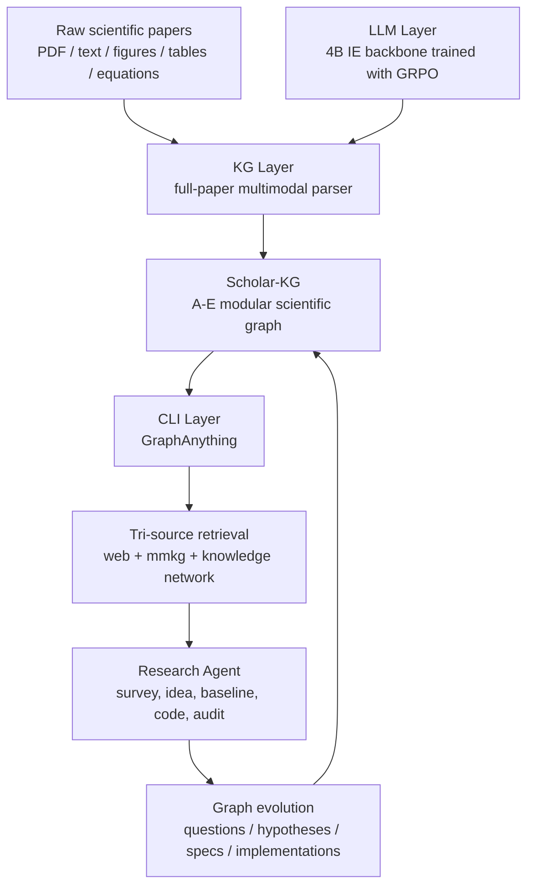
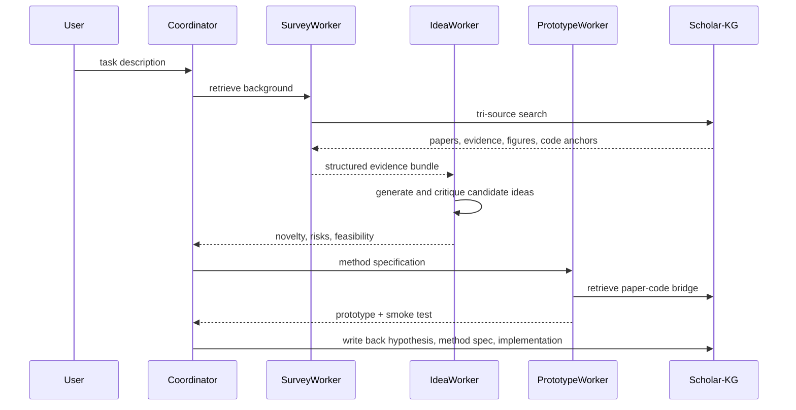

# Agents-K1：把科研 Agent 的“知识编排”从临时检索变成可审计图谱

## 元信息与 TL;DR

- **原文**：[Agents-K1: Towards Agent-native Knowledge Orchestration](https://arxiv.org/abs/2606.13669)
- **版本**：arXiv v1，2026-06-11 提交。
- **作者团队**：Zongsheng Cao、Bihao Zhan、Jinxin Shi 等，来自上海人工智能实验室、华东师范大学、复旦大学等机构。
- **代码与资产**：[GraphAnything](https://github.com/InternScience/GraphAnything)、[Scholar-KG 数据集](https://huggingface.co/datasets/InternScience/Scholar-kg)、[Agents-K1 模型](https://huggingface.co/InternScience/Agents-K1)。
- **本文类型**：大模型 Agent 论文深读；同时涉及后训练，因为论文使用 GRPO 训练 4B 信息抽取骨干。
- **图片本地化**：本文不引用原文图片；关键证据用表格、公式和 Mermaid 重构，因此没有新增本地图片资产。

### TL;DR

- **它要解决什么问题**：
  - 研究型 Agent 近两年主要在规划、工具调用、多 Agent 协作上进步。
  - 但它们使用的知识仍常停留在摘要、关键词、普通 chunk 和扁平 citation edge。
  - 这会丢掉论文中的 claim、evidence、mechanism、method lineage、figure/table/equation 证据。

- **它怎么做**：
  - Agents-K1 把论文转成面向 Agent 的科学知识图谱。
  - 图谱 schema 分成 A-E 五个模块：元信息、显式实体、抽象实体、引用关系、实体间知识关系。
  - 训练层用 Qwen3-4B-Instruct 初始化，基于 IEPile 和规则奖励做 GRPO，得到 4B 抽取骨干。
  - 接口层提供 GraphAnything CLI，把 web search、multimodal graph retrieval、knowledge network traversal 合成 Agent 可调用工具。

- **它给了什么证据**：
  - 处理 246 万篇科学论文，形成 Scholar-KG，并发布约 100 万篇子集。
  - 六个学科上的五模块抽取 AVG F1 约在 79.07% 到 87.11% 之间。
  - Geoscience QA 中，GPT-5.2 加 Agents-K1 后 research question answer accuracy 从 58.8% 到 69.7%。
  - FrontierScience-Research 中，GPT-5.2 overall 从 25.2% 到 39.4%，Gemini-3 overall 从 7.9% 到 24.6%。
  - 抽取骨干十个 NER/RE benchmark 平均 F1 为 0.5647，超过 Qwen3-4B 的 0.5316 和 Qwen3-8B 的 0.5382，接近 Qwen3-32B 的 0.5746。

- **关键局限**：
  - 关系抽取仍弱，尤其 CoNLL04 上 4B 训练模型 0.3181，明显落后 Qwen3-32B 的 0.4768。
  - 论文大量使用 LLM-as-judge，评估可信度取决于 judge 协议和 reference 质量。
  - 原文展示的 GraphAnything 仓库更像通用图工具雏形，和论文中的完整 Scholar-KG 生产系统之间还有工程落差。
  - 它证明“结构化外部知识能提高科研推理”，但还没有充分证明这种图谱在长期开放 Agent 循环中的成本、更新、冲突解决和安全边界。

## 研究问题：为什么 Agent 需要“知识编排”而不只是“Agent 编排”？

### 论文真正关心的不是再造一个 RAG

- 论文开头把研究 Agent 的能力拆成两层：
  - **Agent orchestration**：谁规划、谁检索、谁写代码、谁评审、谁执行。
  - **Knowledge orchestration**：知识以什么结构存在、如何被检索、如何被追溯、如何被更新。

- 作者的判断是：
  - 当 Agent 已能写实验计划、检索论文、生成代码、起草论文时，瓶颈不只在“会不会调用工具”。
  - 更大的瓶颈是：工具返回的知识是否足够细、是否能跨文档连接、是否能追溯到原始证据。

- 这和普通 RAG 的区别在于：
  - 普通 RAG 面向“回答当前问题”。
  - Agents-K1 面向“让 Agent 在后续任务中复用、审计、扩展同一套知识结构”。

### 现有知识基础设施的三类失败

| 失败点 | 现有做法 | Agents-K1 认为丢掉了什么 | 对 Agent 的后果 |
|---|---|---|---|
| 论文被压缩成摘要 | 只抽 title、abstract、chunk | 实验条件、图表证据、公式变量、失败案例 | Agent 只能做粗粒度综述 |
| citation edge 太扁平 | `paper A cites paper B` | 支持、对比、扩展、背景、基线等引用角色 | Agent 难以判断方法谱系 |
| 运行时重复读 PDF | 每次 query 临时 parse | 稳定 ID、证据位置、跨任务复用 | 答案难审计，成本高 |

### 一个更准确的问题表述

- 原文的问题可以改写为：
  - **能否把论文转成 Agent 原生的知识对象，使 Agent 不再只检索文本，而是检索 claim、evidence、method、citation role 和 graph path？**

- 这里的“Agent-native”有三个条件：
  - **可组合**：不同文档、图表、实体、关系能被拼成推理链。
  - **可审计**：每个答案能回到 graph id、span、page、section 或 citation context。
  - **可演化**：新的问题、回答、假设和代码原型能写回图谱。

## 论文主张与论证路线

### Claim → Mechanism → Evidence → Boundary

| Claim | Mechanism | Evidence | Boundary |
|---|---|---|---|
| 科研 Agent 缺的不是更多 chunk，而是结构化知识编排 | A-E 五模块 schema 覆盖元数据、实体、抽象知识、引用、关系 | Scholar-KG 处理 246 万篇论文，发布约 100 万篇子集 | 覆盖面大不等于所有字段都高质量；抽取误差会传导 |
| 小模型可通过任务化 RL 接近大模型抽取能力 | Qwen3-4B-Instruct + IEPile + GRPO + 规则奖励 | 十个 NER/RE benchmark 平均 F1 0.5647，超过 4B/8B base | RE 仍明显落后 32B，说明关系学习没被完全解决 |
| 科学推理需要图检索而不是只靠参数记忆 | GraphAnything 三源检索：web、mmkg、kn | GPT-5.2 在 FrontierScience-Research overall 从 25.2% 到 39.4% | 评测依赖构建的 task-specific sub-KG 和 judge 设置 |
| Agent 的研究循环应把新产物写回知识层 | evolve absorb/compress/gaps，把问题、假设、实现节点化 | CLI 任务表覆盖 idea grounding、paper-code bridge、swarm audit | 原文主要给框架和示例，未展示长期在线演化压力测试 |

### 这条路线的设计巧思

- <u>它没有把知识图谱当成后置检索插件</u>。
  - KG 是第一层基础设施。
  - LLM 是把非结构文档转成 KG 的抽取器。
  - CLI 是 Agent 使用 KG 的动作空间。

- <u>它把“科研可审计性”拆进 schema</u>。
  - 如果只存 entity/relation，Agent 仍可能编造证据。
  - 所以论文强调 provenance、citation role、multimodal evidence、atomic sentence。

- <u>它承认工具层需要确定性 primitive</u>。
  - `find-paper`、`paper-details`、`citations-of`、`lineage`、`baselines` 等命令是可验证操作。
  - Agent 层负责组合这些操作，而不是把所有逻辑藏进 prompt。

## 方法机制：三层系统如何互相咬合

### 总体结构



- **KG Layer**：
  - 接收全文论文。
  - 输出可查询的科学知识网络。
  - 重点是 schema，不是简单 embedding。

- **LLM Layer**：
  - 用小参数模型执行信息抽取。
  - 通过 RL 让输出更符合 JSON/schema/事实约束。
  - 目标是降低大规模论文处理成本。

- **CLI Layer**：
  - 给 Agent 一个“知识动作空间”。
  - 它不是只问答，而是支持 lineage、baseline、citation、gap、prototype 等研究操作。

## KG Layer：A-E 五模块 schema 为什么重要？

### Module A：Meta / Factual Entities

- 这一层处理低歧义、可验证字段：
  - 论文标题、DOI、arXiv ID、年份、venue、license。
  - 作者、ORCID、affiliation、ROR。
  - open-science resource，如代码仓库、模型、数据集。
  - 每个字段带 provenance 和 confidence。

- 它的作用不是“更完整的元数据卡片”。
  - 它给图谱提供稳定锚点。
  - 后续 Module B-E 的节点和边都需要挂在这些锚点上。

### Module B：Textually Mentioned Entities

- 这一层抽显式出现的科学对象：
  - task、method、dataset、metric、tool、model。
  - 别名、属性、上下文 span。

- 它解决的是检索召回问题：
  - 如果一个方法只在正文中出现，摘要检索可能找不到。
  - 如果 dataset/metric 名称有别名，Agent 很容易把对比实验漏掉。

### Module C：Implicit / Abstracted Entities

- 这一层更接近科学理解：
  - contribution。
  - finding / conclusion。
  - motivation。
  - mechanism。
  - limitation。

- 它是最像“读懂论文”的模块。
  - 不是逐字抽取。
  - 而是把段落层语义压成可查询对象。

- 风险也在这里：
  - 抽象越强，越依赖模型判断。
  - 因此 provenance 和 confidence 不是装饰，而是后续审计的入口。

### Module D：Citation Relationships

- 这一层把 citation 从“是否引用”变成“如何引用”。

| Citation role | 含义 | Agent 能做什么 |
|---|---|---|
| foundational | 当前工作建立在该论文上 | 找方法源头 |
| strong | 实验、理论或结论强依赖 | 找关键支柱 |
| moderate | 背景、启发或经验支持 | 找局部关联 |
| contextual | 文献综述式引用 | 建研究地图 |
| peripheral | 宽泛历史或边缘提及 | 降低权重 |

- 对研究 Agent 来说，这比 citation count 更有用。
  - 它能回答“这个方法继承自谁”。
  - 也能回答“哪个 baseline 是真正核心对比”。

### Module E：Knowledge Relations Between Entities

- 这一层把实体连接成可推理三元组：
  - `<head, head_type, relation, tail, tail_type>`。

- 论文实验里 Module E 的方差最大。
  - CS F1 为 89.33。
  - Physics F1 为 70.54。
  - 这说明“关系”高度依赖领域写作习惯。

- 对 Agent 的意义：
  - 没有关系边，图只是高级索引。
  - 有了关系边，Agent 才能做 path、lineage、gap、baseline traversal。

## LLM Layer：4B 抽取骨干为什么用 GRPO？

### 训练目标不是聊天，而是 schema-conformant extraction

- 模型从 Qwen3-4B-Instruct 初始化。
- 训练目标是让它在信息抽取任务中：
  - 输出合法 JSON。
  - 命中正确实体和关系。
  - 少漏关键字段。
  - 少产生幻觉字段。

- 这类任务不一定需要最大通用模型。
  - 关键在于奖励能否把格式、事实、schema 一起压进训练信号。

### 可以这样理解奖励函数

```text
Input:
  x = source document segment or task prompt
  y = model extraction output
  S = target schema / allowed fields
  G = reference or rule-checkable constraints

Reward:
  R(y | x, S, G) =
      w_format * valid_json(y, S)
    + w_entity * entity_match(y, G)
    + w_relation * relation_match(y, G)
    - w_hallucination * unsupported_items(y, x)
    - w_omission * missed_critical_items(y, G)

GRPO update:
  Sample a group of candidate outputs for the same input.
  Score each output with rule-based reward.
  Increase probability of higher-scoring outputs relative to group baseline.
  Penalize drift from the reference policy.
```

- 这不是原文逐字公式。
- 它是对论文训练意图的结构化解释：
  - **format reward** 保证 Agent 工具能解析。
  - **entity/relation reward** 保证信息抽取有效。
  - **hallucination/omission penalty** 对应 Precision/Recall 的两端。
  - **group-relative update** 对应 GRPO 的低成本偏好优化思路。

### 抽取指标如何对应任务风险

论文用 Precision、Recall、F1 衡量抽取质量，并把错误分成“错抽”和“漏抽”。

```text
TP = extracted_items - incorrect_items
GT_estimated = TP + missed_items

Precision = TP / extracted_items
Recall    = TP / GT_estimated
F1        = 2 * Precision * Recall / (Precision + Recall)
```

- **Precision 低**：
  - 图里混入 unsupported claim。
  - Agent 后续推理会引用不存在的证据。

- **Recall 低**：
  - 图里缺关键机制或限制。
  - Agent 会过度乐观地评价方法。

- **F1 高但关系弱**：
  - 说明实体抽取可能够用。
  - 但复杂 research lineage 仍可能断链。

## CLI Layer：GraphAnything 是 Agent 的知识动作空间

### 三源检索不是简单 ensemble

| 来源 | 作用 | 适用问题 |
|---|---|---|
| web search | 找最新外部材料 | 新论文、新代码、新讨论 |
| multimodal graph retrieval | 找图表、公式、表格、证据节点 | “这篇论文的关键实验是什么” |
| knowledge network traversal | 沿 citation、method、dataset、claim 边走图 | “这个想法和哪些前作冲突” |

- 论文把这三者融合成 `tri-search`。
- 关键不是“多搜几个地方”。
- 关键是 Agent 能在同一次任务里：
  - 从 web 找到新材料。
  - 从 mmkg 找到证据 anchor。
  - 从 kn 找到跨文档路径。

### CLI primitive 的边界很清楚

| 命令 | 可验证性 | Agent 组合后的能力 |
|---|---|---|
| `find-paper` | 关键词、DOI、arXiv、作者查找 | 建立种子集合 |
| `paper-details` | 返回方法、数据、贡献、引用卡片 | 生成结构化综述 |
| `citations-of` / `citations-to` | 出入引用边 | 追踪影响和依赖 |
| `lineage` | 两个概念之间的最短演化路径 | 方法谱系分析 |
| `baselines` | 数据集下的方法与指标 | 对比实验准备 |
| `tri-search` | 三源路由 | 开放问题检索 |
| `evolve gaps` | 找孤立方法、缺失引用、单例数据集 | 发现图谱盲区 |

- 这里的架构选择值得注意：
  - 图操作保持确定性。
  - Agent 负责规划和解释。
  - 这降低了“所有能力都靠 prompt 涌现”的不可控性。

### Idea-to-Experiment 的闭环



- 这个流程的强点：
  - novelty 不只由模型读 idea 文本判断。
  - 它被放回知识网络里和已有 evidence 对齐。

- 这个流程的弱点：
  - smoke test 不等于复现实验。
  - 原文也承认完整数值复现不是 idea-time 的闭环信号。

## 数据与开放资产：246 万篇处理、100 万篇发布意味着什么？

### Scholar-KG 的规模信号

- 论文称处理 246 万篇科学论文。
- 覆盖六个学科：
  - computer science。
  - chemistry。
  - biology。
  - earth science。
  - physics。
  - materials。

- Hugging Face 数据集卡说明：
  - 发布的 Scholar-kg 包含约 100 万篇经 Agents-K1 处理的论文。
  - 来源包括 arXiv、bioRxiv 等。
  - 每篇论文组织成 A-E 五模块。

### 规模不是唯一价值

- 如果只看数量，246 万篇像是 corpus 工程。
- 但论文真正想证明的是：
  - 全文多模态解析可以转成统一图谱。
  - 图谱可以服务 Agent 查询。
  - 抽取骨干可以用 4B 模型承担成本压力。

- 这会改变科研 Agent 的成本结构：
  - 过去每次任务都要读 PDF。
  - 现在把 PDF parsing 和 schema extraction 前置。
  - Agent 运行时更多做图检索和证据组合。

## 实验设置与结果：证据分别支持哪些主张？

### 六学科五模块抽取

| 学科 | AVG F1 | 论文给出的解释 |
|---|---:|---|
| Computer Science | 87.11 | 结构规范，Module D 和整体较均衡 |
| Chemistry | 84.43 | Module C 强，复杂机制抽象表现好 |
| Biology | 83.34 | 术语和命名多样，召回更难 |
| Earth Science | 86.62 | citation 模块表现突出 |
| Physics | 79.07 | 显式实体召回和关系抽取更难 |
| Material Science | 83.49 | Module C 强，但 Module E 相对低 |

- 这组结果支持：
  - schema 在不同学科可迁移。
  - 但 Module E 对领域写作风格敏感。

- 这组结果不能证明：
  - 每个字段都达到生产级可靠。
  - 图谱可直接作为自动科研决策依据。

### Geoscience knowledgeable / research QA

| Model | Knowledge Rationale | Knowledge Answer | Research Rationale | Research Answer |
|---|---:|---:|---:|---:|
| GPT-5.2 | 54.2 | 68.0 | 41.8 | 58.8 |
| Gemini-3 | 58.3 | 71.2 | 52.3 | 61.0 |
| GPT-5.2 w/ Agents-K1 | 65.8 | 75.0 | 66.3 | 69.7 |
| Gemini-3 w/ Agents-K1 | 67.5 | 77.9 | 69.5 | 71.5 |

- 最值得看的是 Research Rationale：
  - GPT-5.2 从 41.8 到 66.3。
  - Gemini-3 从 52.3 到 69.5。

- 这说明：
  - 图谱不只是补答案。
  - 它更明显地改善推理链的证据组织。

- 边界也很清楚：
  - 评估采用 LLM-as-a-judge。
  - judge 评价 reasoning trace 和 final answer，但仍可能偏向结构化输出。

### FrontierScience-Research

| Model | Physics | Chemistry | Biology | Overall |
|---|---:|---:|---:|---:|
| Gemini-3 | 0.0 | 18.8 | 5.0 | 7.9 |
| GPT-5.2 | 9.0 | 33.7 | 32.8 | 25.2 |
| Gemini-3 w/ Agents-K1 | 13.8 | 31.3 | 28.8 | 24.6 |
| GPT-5.2 w/ Agents-K1 | 46.7 | 36.7 | 35.0 | 39.4 |

- 关键数字：
  - Gemini-3 overall 提升 16.7 个百分点。
  - GPT-5.2 overall 提升 14.2 个百分点。
  - GPT-5.2 physics 从 9.0 到 46.7，是最显著单项。

- 这个实验最能支持论文主张：
  - 科研问题需要外部学术证据。
  - 参数知识不足时，结构化知识源能提供明显帮助。

- 但它也留下问题：
  - 任务相关 sub-KG 是如何构造和过滤的？
  - 如果问题域更开放，sub-KG 构建成本是否会吞掉收益？

### 开源多跳 benchmark

- 论文使用：
  - HotpotQA。
  - 2WikiMultiHopQA。
  - MuSiQue。

- 对比对象包括：
  - vanilla LLM。
  - dense retrieval top-k RAG。
  - KGP、G-retriever、RAPTOR、E2GraphRAG、LightRAG、HippoRAG、HippoRAG2、GFM-RAG 等图或高级 RAG 方法。

- 这部分的作用：
  - 证明 Agents-K1 不只适用于自家 geoscience 设置。
  - 也能放到标准多跳检索推理任务里比较。

- 阅读时要谨慎：
  - 标准 QA benchmark 和科研论文图谱之间仍有分布差异。
  - benchmark 得分不能直接等同于科研 Agent 能自动发现新问题。

### 4B 抽取骨干评估

| Regime | Qwen3-4B | Qwen3-8B | Qwen3-32B | Ours 4B |
|---|---:|---:|---:|---:|
| Held-out NER | 0.5731 | 0.5773 | 0.6006 | 0.6035 |
| In-distribution NER | 0.6803 | 0.6895 | 0.7059 | 0.7280 |
| Relation extraction | 0.2050 | 0.2136 | 0.3127 | 0.2226 |
| Overall | 0.5316 | 0.5382 | 0.5746 | 0.5647 |

- 这张表是整篇论文最重要的训练证据。

- 它说明：
  - 4B 训练模型在 NER 上能追上甚至超过 32B base。
  - 任务化后训练可以抵消一部分参数规模差距。
  - 4B 模型明显超过未调优 4B/8B base。

- 它也暴露：
  - relation extraction 是主要短板。
  - SciERC 和 CoNLL04 的关系任务仍需要更多关系监督或 schema-conditioned reward。

## 消融、失败与边界：这篇论文还没证明什么？

### 关系抽取是最硬的失败案例

- 论文明确指出 CoNLL04 上差距明显：
  - Qwen3-32B：0.4768。
  - Ours 4B：0.3181。
  - 差距约 15.9 F1 点。

- 这意味着：
  - 训练让小模型学会了很多实体边界和标签。
  - 但“谁和谁发生什么关系”仍更依赖语义组合、上下文和领域知识。

- 对 Agent 的影响：
  - 如果关系边错了，lineage 和 baseline traversal 会错。
  - 错关系比漏实体更危险，因为它会给 Agent 一个看似结构化的错误推理路径。

### LLM-as-judge 是必要但脆弱的评估工具

- 科研 reasoning 很难只用 exact match 评价。
- 论文用 judge 同时看 rationale 和 answer。

- 这有合理性：
  - 可以评估证据链。
  - 可以覆盖开放式 research question。

- 但也有风险：
  - judge 可能偏好更像论文语言的回答。
  - judge 未必能真正核查所有引用证据。
  - 不同 judge 模型会给出不同边界。

### GraphAnything 仓库显示了工程接口，但不是完整生产证明

- GitHub README 展示的是通用图工具：
  - 10 个 schema preset。
  - 8 个 extractor。
  - 9 种 render format。
  - 17 个 MCP tools。
  - 19 个 CLI sub-command。
  - 任意 OpenAI-compatible endpoint。

- 这说明项目有明确工具化方向。

- 但也要区分：
  - README 中的 GraphAnything 更偏通用框架。
  - 论文中的 Agents-K1 包含大规模 Scholar-KG、4B 抽取模型和科研 Agent pipeline。

- 因此，不能因为仓库存在就认为完整论文系统已可一键复现。

## Figure / Table 证据逐项解读

### Figure 1：架构图

- 支持的 claim：
  - Agents-K1 是三层系统，不是单个模型。

- 它不能证明：
  - 每层接口在真实长期运行中稳定。
  - 图谱更新、冲突合并和错误传播已被解决。

### Table 4：六学科五模块表现

- 支持的 claim：
  - A-E schema 能跨领域运行。

- 关键证据：
  - AVG F1 在 79.07%-87.11%。
  - Module C 在 Chemistry 和 Material Science 表现强。
  - Module E 方差最大。

- 不能证明：
  - 抽取图谱足以支持全自动科学发现。

### Table 5：Geoscience QA

- 支持的 claim：
  - 图谱检索能提升 rationale 和 answer。

- 关键证据：
  - Research Rationale 提升比 Knowledge Answer 更明显。

- 不能证明：
  - 所有学科都能同等收益。

### Table 6：FrontierScience-Research

- 支持的 claim：
  - 外部科学图谱能弥补模型参数知识不足。

- 关键证据：
  - GPT-5.2 physics 从 9.0 到 46.7。
  - overall 从 25.2 到 39.4。

- 不能证明：
  - 子图构建过程在所有任务上成本可控。

### Table 8/9：4B 抽取模型

- 支持的 claim：
  - 后训练能让小模型接近大模型抽取能力。

- 关键证据：
  - overall 0.5647 接近 32B 的 0.5746。
  - NER 超过 32B。

- 不能证明：
  - 关系抽取瓶颈已解决。
  - 所有 schema 都能用规则奖励训练出来。

## 相关工作位置：它和 GraphRAG、科研 Agent、后训练是什么关系？

### 和 GraphRAG 的关系

- LightRAG、HippoRAG、RAPTOR、E2GraphRAG 等工作强调：
  - 图结构能改善检索。
  - 层级或关系结构能支持多跳推理。

- Agents-K1 的不同点：
  - 它不只从文本 chunk 构图。
  - 它把科学论文的 argument、citation role、multimodal evidence 纳入 schema。

- 因此它更像：
  - **科学文献的 domain-specific graph operating system**。
  - 而不是另一个通用 retrieval algorithm。

### 和科研 Agent 的关系

- AI-Scientist、AI Co-Scientist、InternAgent 等系统更强调：
  - 任务分解。
  - 工具调用。
  - 实验循环。
  - 代码生成。

- Agents-K1 提醒一个基础问题：
  - 如果知识层仍是临时检索和摘要，Agent 编排越强，越可能把错误知识规模化传播。

- 这对科研 Agent 的启发是：
  - agent runtime 不应只管理任务状态。
  - 还应管理 evidence state。

### 和后训练的关系

- OPD、SFT、RLHF、GRPO 等后训练方法通常用于提升推理或对齐。
- Agents-K1 用 GRPO 训练抽取器，体现另一种路线：
  - 不是训练模型“更会聊天”。
  - 而是训练模型“更会生产可被系统消费的结构化知识”。

- 这个方向值得关注：
  - Agent 系统越工具化，模型输出越需要满足 contract。
  - contract-following extraction 可能比开放式推理更适合小模型专训。

## 研究者视角的结论与继续追问

### 最值得带走的判断

- **第一，Agent 的下一层基础设施可能不是更长上下文，而是更强的知识状态管理。**
  - 长上下文能把更多文本塞进 prompt。
  - 知识编排能让证据、引用、方法和失败边界有稳定身份。

- **第二，科研知识图谱如果只存实体不存证据，仍然不够 Agent-native。**
  - Agent 需要的是可行动知识。
  - 可行动知识必须能被追溯、比较、组合和更新。

- **第三，小模型后训练在系统型任务里有实际价值。**
  - 4B 模型不需要成为通用最强模型。
  - 它只要稳定执行 schema extraction，就能承担大规模 pipeline 的核心成本。

### 对 AI 安全和 Agent 安全的延伸

- Agents-K1 的方法也能反过来用于 Agent 安全：
  - 把 Agent 行为日志转成 evidence graph。
  - 把 tool call、permission、external write、citation、claim 分成 typed edges。
  - 让审计系统沿图追踪“某个危险动作由哪些证据和计划导致”。

- 这比只存 trace log 更强：
  - trace log 是时间序列。
  - typed graph 能表达因果、依赖、冲突和缺口。

- 但安全上必须补三类机制：
  - **污染防护**：恶意论文、prompt injection、伪代码仓库会污染图谱。
  - **冲突解析**：多个来源对同一 claim 给出不同证据时，图谱不能简单合并。
  - **权限隔离**：Agent 读图、写图、执行代码应有不同权限边界。

### 对后训练研究的延伸

- 可以继续问：
  - schema-conditioned reward 能否系统性提升 relation extraction？
  - GRPO 是否比 DPO/SFT 更适合结构化抽取？
  - rule reward 对复杂科学 claim 的覆盖上限在哪里？
  - 是否需要 human-in-the-loop 审核高风险 citation role？

- 一个可检验方向：
  - 固定同一批论文。
  - 比较 SFT、GRPO、DPO、self-correction pipeline。
  - 指标不仅看 F1，还看 downstream Agent QA 的证据可追溯性。

### 对科研 Agent 的继续追问

- Agents-K1 把“读论文”前置成图谱构建。
- 下一步真正难的是：
  - 图谱如何持续更新？
  - 旧结论如何被新证据推翻？
  - Agent 写回的 hypothesis 是否会污染原始 literature graph？
  - 如果 graph path 支持了错误 novelty 判断，谁负责发现？

- 因此，一个成熟科研 Agent 可能需要三张图：
  - **Literature graph**：来自论文和证据，尽量保守。
  - **Workspace graph**：来自当前 Agent 任务、假设、草稿、代码。
  - **Audit graph**：记录哪些工具、模型、证据导致了哪些决策。

- Agents-K1 的贡献在于：
  - 它把第一张图做得更细。
  - 它也隐约展示了第二张图的写回机制。
  - 但第三张图仍是后续研究和安全治理的关键空白。

## 参考链接

- [arXiv abstract](https://arxiv.org/abs/2606.13669)
- [arXiv HTML](https://arxiv.org/html/2606.13669v1)
- [GraphAnything GitHub](https://github.com/InternScience/GraphAnything)
- [Scholar-KG Hugging Face dataset](https://huggingface.co/datasets/InternScience/Scholar-kg)
- [Agents-K1 Hugging Face model](https://huggingface.co/InternScience/Agents-K1)
- [alphaXiv paper page](https://www.alphaxiv.org/abs/2606.13669)
