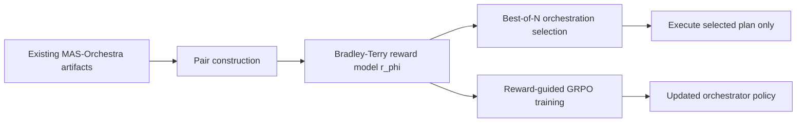
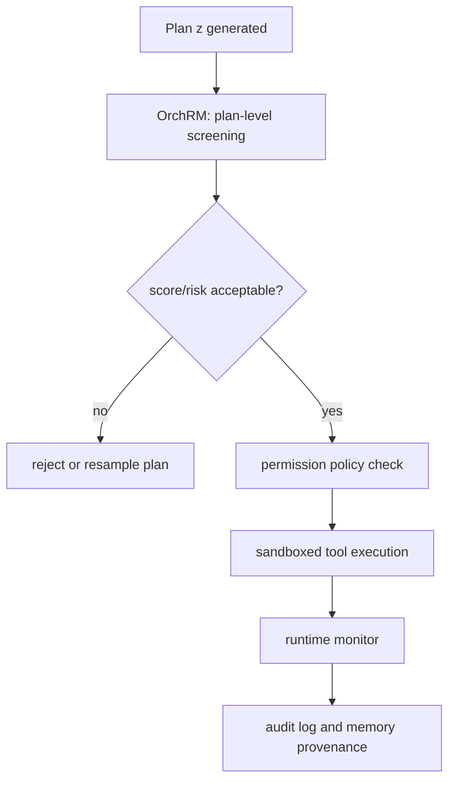

# OrchRM：把多 Agent 编排先评分，再决定要不要执行

### 元信息

- **论文**：Reward Modeling for Multi-Agent Orchestration
- **方法名**：Orchestration Reward Modeling，论文简称 **Orch-RM / OrchRM**
- **作者**：King Yeung Tsang, Zihao Zhao, Vishal Venkataramani, Haizhou Shi, Zixuan Ke, Semih Yavuz, Shafiq Joty, Hao Wang
- **机构线索**：Rutgers University；Salesforce AI Research
- **日期**：arXiv v1，2026-06-11 17:16:24 UTC
- **方向**：大模型 Agent；多 Agent 编排；reward modeling；test-time scaling；后训练
- **原文**：[arXiv 摘要](https://arxiv.org/abs/2606.13598)；[PDF](https://arxiv.org/pdf/2606.13598)；[Papers.cool 镜像](https://papers.cool/arxiv/2606.13598)
- **相关项目**：[MAS-Orchestra](https://github.com/SalesforceAIResearch/MAS-Orchestra)；论文声明的 OrchRM 代码地址目前仍返回 404

### TL;DR

- **这篇论文解决的问题**：多 Agent 系统越来越依赖 orchestrator 生成角色、交互图和执行流程，但训练 orchestrator 通常要完整执行多个子 Agent 后才能拿到 final-answer reward；MAS-Orchestra 一类 GRPO 训练在 100 个 update step 上可消耗超过 **1B tokens**，监督稀缺且 rollout 成本高。
- **核心方法 OrchRM**：作者不先执行完整子 Agent 轨迹，而是学习一个 reward model `r_phi(x, z)`，直接给“输入问题 `x` + 编排计划 `z`”打分；训练数据来自已有 MAS-Orchestra 训练过程中的中间 artifact，并构造两类偏好对：**specialized-over-base** 和 **correct-over-incorrect**。
- **训练目标**：OrchRM 使用 Bradley-Terry pairwise loss，让高质量编排 `z_w` 的分数高于低质量编排 `z_l`；继续训练 orchestrator 时，再把 `r_phi` 的组内均值差当作 GRPO advantage。
- **实验设置**：orchestrator 使用 `Qwen2.5-7B-Instruct`，子 Agent 调用 `GPT-OSS-120B`，reward model 从 `Skywork-Reward-LLaMA-3.1-8B` 初始化；评测覆盖 AIME 24&25、BrowseComp+、HotpotQA，并用 GPQA 做 OOD 科学推理测试。
- **关键数字**：test-time scaling 的 `N=8` 设置下，OrchRM 在 AIME 24&25 从 majority vote 的 **63.33%** 提到 **68.33%**，BrowseComp+ 从 **9.50%** 提到 **14.00%**；验证 token 分别为 **2.38M** 和 **8.26M**。BrowseComp+ 上，它比 trajectory-level `GPT-5-mini` judge 的 **12.50%** 更高，同时把验证成本从 **142.80M** 降到 **8.26M**。
- **训练收益**：从 base model 训练时，AIME majority-vote accuracy 从 **23.33%** 提到 **61.67%**，BrowseComp+ 从 **0.50%** 提到 **4.50%**；继续训练时，OrchRM 在 AIME 24&25 达到 **68.33%** majority vote，BrowseComp+ 达到 **11.00%**，并在 BrowseComp+ 上比 trajectory-level GRPO 少用超过 **10x** 训练 tokens。
- **主要边界**：HotpotQA 和 GPQA 的收益更弱；论文解释为 HotpotQA 编排结构差异不够大，GPQA 是 OOD；此外 reward model 是按 domain 训练的，代码和数据尚未公开，OrchRM 声明的 GitHub 仓库当前不可访问。

### 研究问题：为什么多 Agent 编排需要单独的 reward model？

论文的问题意识不是“再造一个多 Agent 框架”，而是拆开 MAS-Orchestra 这类系统的成本结构：

- **编排 `z` 先发生**：orchestrator 先决定要创建哪些角色、角色描述、协作结构、交互图。
- **子 Agent rollout 后发生**：编排被执行后，多个子 Agent 才产生中间回答 `Y = {y_1, ..., y_k}`。
- **最终答案 `a` 最晚出现**：系统聚合子 Agent 输出，得到最终答案。
- **训练信号更晚**：如果 reward 只看最终答案是否正确，训练必须支付完整 rollout 成本。

论文把一次 MAS 执行写成：

```text
tau = (x, z, Y, a)

x: 输入问题
z: 多 Agent 编排计划
Y: 子 Agent 的中间响应序列
a: 聚合后的最终答案
```

作者真正想问的是：

| 问题 | 常规做法 | OrchRM 的改写 |
|---|---|---|
| 编排质量怎样监督？ | 等完整执行后看 final answer | 直接训练 `r_phi(x, z)` 评分编排 |
| 多 Agent rollout 为什么贵？ | 每个候选计划都要调用多个子 Agent | 评分阶段只看计划，先过滤低质量编排 |
| 人类标注为什么不理想？ | 人类可能偏好可读或漂亮的计划 | 论文用训练 artifact 构造机器目标偏好对 |
| reward model 为什么不能直接套单 Agent？ | 单 Agent RM 多看回答或推理链 | MAS 的质量还包含角色分工、交互图和协作顺序 |

<u>关键判断</u>：OrchRM 把 reward modeling 的作用点从“回答文本”前移到“编排计划”。这一步让 reward model 不只是 judge，而是一个运行前的编排筛选器。

### 论文主张与证据链

| Claim | Mechanism | Evidence | Boundary |
|---|---|---|---|
| 多 Agent 编排可以在 rollout 前被评分 | 学习 `r_phi(x, z)`，只输入问题和编排计划 | Table 1 中 AIME、BrowseComp+ 的 Best-of-N 均超过 majority vote | 若候选 `z` 结构过于相似，HotpotQA 上区分度变弱 |
| 自监督偏好对足以训练 orchestration RM | 用 specialized-over-base 与 correct-over-incorrect 构造 win/lose pairs | Table 2 中默认 1:0:3 数据配比在 AIME 达到 68.33%，BrowseComp+ 达到 14.00% | 偏好对仍来自已有 orchestrator artifact，受模型与采样质量限制 |
| 编排层评分能省 token | 不让每个候选都执行完整子 Agent rollout | BrowseComp+ 上从 trajectory-level GPT-5-mini judge 的 142.80M 验证 tokens 降到 8.26M | 省的是验证/训练中的 rollout 成本，不等于最终任务完全零执行 |
| reward-guided training 可替代部分 full-trajectory RL | 用 `r_phi` 产生 GRPO advantage | Table 3 中 continued OrchRM 在 AIME/BrowseComp+ majority vote 最优 | HotpotQA/GPQA 未全面最优；domain-specific RM 仍是限制 |

### 方法图：论文的核心流水线


这张图承载了论文最重要的机制：

- **左侧是训练 artifact**：作者并不从零让人类写偏好标签，而是复用已有 MAS-Orchestra 训练留下的模型 checkpoint 和轨迹。
- **中间是 pairwise preference**：同一类输入下，把更可靠的编排当 winner，把 base 或错误编排当 loser。
- **右侧是两个用法**：一个用于 test-time selection；一个用于继续训练 orchestrator。

可以把它读成三层控制：



这里最值得注意的是：

- reward model 的输入不是完整 `tau`，而是早期的 `(x, z)`。
- test-time scaling 时，系统先采样多个 `z`，由 `r_phi` 选一个，再执行完整 MAS。
- 继续训练时，`r_phi` 代替 final-answer reward 给候选编排打分。

### 公式：Bradley-Terry 如何落到编排评分？

论文使用标准 pairwise reward modeling：

```text
L_OrchRM(phi) = - E_D [ log sigma( r_phi(x, z_w) - r_phi(x, z_l) ) ]
```

变量解释：

| 符号 | 含义 |
|---|---|
| `x` | 输入问题 |
| `z_w` | winner orchestration，高质量编排 |
| `z_l` | loser orchestration，低质量编排 |
| `r_phi` | orchestration reward model |
| `sigma` | sigmoid 函数 |
| `D` | 由训练 artifact 构造出的偏好对集合 |

这条公式的研究意义是：

- **不是评估最终答案**：最终答案 `a` 只用来构造偏好对，不是 reward model 的直接输入。
- **不是 process reward model**：它不沿着每个子 Agent step 打分。
- **是 plan-level reward model**：它判断“这个多 Agent 编排是否值得执行”。

继续训练 orchestrator 时，论文又把 reward 分数转成组内 advantage：

```text
A_n = r_phi(x, z_n) - (1/N) * sum_j r_phi(x, z_j)
```

这意味着：

- 同一问题下，系统采样 `N` 个候选编排。
- 每个候选的 advantage 是“比组内平均编排好多少”。
- GRPO 优化的不是最终答案 reward，而是 orchestration-level reward。

### 数据构造：两类偏好对分别解决什么问题？

论文构造了两类 winner/loser 来源：

| 偏好来源 | Winner | Loser | 解决的监督问题 |
|---|---|---|---|
| Specialized-over-base | 训练过的 domain orchestrator 产生的编排 | backbone/base policy 产生的编排 | 区分“经过任务优化的计划”和“通用模型随手写的计划” |
| Correct-over-incorrect | 最终答案正确的编排 | 最终答案错误的编排 | 利用已有 rollout outcome，把正确性转成偏好信号 |

这两类数据并不等价：

- **Specialized-over-base** 更像 domain adaptation 信号，告诉 RM 什么计划更像任务内成功 orchestrator。
- **Correct-over-incorrect** 更像 outcome-aligned 信号，告诉 RM 哪些计划在实际执行后更可能正确。
- **混合比例决定泛化**：Table 2 显示只用某一类信号并不稳定，默认配比在 AIME 和 BrowseComp+ 最强。

论文正文对比例有一个值得警惕的小细节：

- 方法段落写的是“固定 3:1”。
- Table 2 的默认设置写成 `SoB:SoO:CoI = 1:0:3`。
- 可以理解为最终消融表强调“correct-over-incorrect 权重更高”的配置，但文稿仍有表述统一问题。

这也是本文作为 preprint 的一个边界：实验结果很有信息量，但部分写法还像工作稿。

### 实验设置：不是单一数学题，而是四类测试场景

论文沿用 MAS-Orchestra 设定：

| 组件 | 设定 |
|---|---|
| Orchestrator policy | `Qwen2.5-7B-Instruct` |
| 子 Agent 模型 | `GPT-OSS-120B` |
| Reward model 初始化 | `Skywork-Reward-LLaMA-3.1-8B` |
| 训练硬件 | 2 x RTX PRO 6000 96GB |
| LoRA rank/alpha | `r=32`, `alpha=32` |
| Actor rollout | 8 |
| Learning rate | `1e-5` |

数据集分布如下：

| 数据集 | 领域 | Policy training | Full inference | Test |
|---|---:|---:|---:|---:|
| Deepscaler / AIME | 数学推理 | 5,000 | 500 | 60 |
| BrowseComp+ | Web QA | 1,066 | 500 | 200 |
| HotpotQA | 多跳推理 | 5,000 | 2,000 | 200 |
| GPQA | 科学推理 OOD | 0 | 0 | 199 |

这个设置说明了两点：

- **AIME/BrowseComp+/HotpotQA 是 in-domain 主战场**：reward model 有相关训练或 artifact。
- **GPQA 是外推检验**：它用来测试 reward model 是否能跨到科学推理，但论文自己也承认这是更难的泛化场景。

### Table 1：test-time scaling 的关键结果

Table 1 比较的是 `N=8` 的 Best-of-N 选择：

| 方法 | Level | AIME Acc. | BrowseComp+ Acc. | HotpotQA Acc. | GPQA Acc. | 主要成本线索 |
|---|---|---:|---:|---:|---:|---|
| MAS-Orchestra / majority vote | Trajectory | 63.33 | 9.50 | 42.50 | 63.63 | baseline |
| Trajectory GPT-5-mini judge | Trajectory | 70.00 | 12.50 | 44.00 | 68.89 | BrowseComp+ 142.80M tokens |
| Orchestration GPT-5.4-mini judge | Orchestration | 66.67 | 11.00 | 46.00 | 68.13 | 每项约 2.53M-8.72M tokens |
| Skywork-V2-Llama-3.2-3B | Orchestration | 58.33 | 12.00 | 41.50 | 64.65 | 开源 RM baseline |
| **OrchRM** | Orchestration | **68.33** | **14.00** | 42.50 | 66.16 | 2.38M / 8.26M / 7.32M / 7.49M |

可以逐项读：

- **AIME 24&25**：OrchRM 比 majority vote 高 **5.00** 点；略低于 trajectory-level GPT-5-mini judge 的 70.00%，但 token 成本明显更低。
- **BrowseComp+**：OrchRM 从 9.50% 到 14.00%，并超过 trajectory-level GPT-5-mini judge 的 12.50%；这是论文最强的效率-效果证据。
- **HotpotQA**：OrchRM 只有 42.50%，与 baseline 持平，低于 GPT-5.4-mini judge 的 46.00%。
- **GPQA**：OrchRM 66.16%，低于 GPT-5-mini orchestration judge 的 71.72%，也低于 logP 的 71.21%。

<u>结论不能过度外推</u>：

- OrchRM 不是所有任务上都最强。
- 它最有说服力的地方，是在有编排差异、且 reward model 训练分布接近的任务上，用少很多 token 达到更好的筛选。

### 图 1：为什么作者强调 accuracy-efficiency trade-off？


图 1 把论文的两个应用场景放在一起：

- **左图**：test-time scaling 中，OrchRM 先选择高分编排，再执行，被用来减少“为了筛选而执行大量子 Agent”的浪费。
- **右图**：continued orchestrator training 中，OrchRM 作为 reward signal，减少 trajectory-level RL 的 token 消耗。

这张图支持的不是“RM 一定比所有 judge 准”，而是：

- 当评估对象是编排计划时，专门训练的 RM 可以比通用 LLM judge 更便宜。
- 当训练目标是 orchestrator 时，plan-level reward 可以避免大量完整 rollout。
- 这种优势在 AIME 和 BrowseComp+ 上更明显，在 HotpotQA/GPQA 上仍有边界。

### Table 2：消融真正说明了什么？

Table 2 比较三类数据源：

- `SoB`：Specialized-over-Base。
- `SoO`：Specialized-over-Other-domains。
- `CoI`：Correct-over-Incorrect。

| Row | SoB | SoO | CoI | AIME Acc. | BrowseComp+ Acc. | HotpotQA Acc. | 解读 |
|---|---:|---:|---:|---:|---:|---:|---|
| a | 0 | 0 | 0 | 61.67 | 11.50 | 40.50 | 未训练 Skywork baseline |
| b | 3 | 2 | 0 | 63.33 | 14.00 | 41.00 | domain 对比能帮 BrowseComp+ |
| c | 0 | 0 | 1 | 63.33 | 10.50 | 42.00 | 只有 CoI 不够稳定 |
| d | 1 | 0 | 1 | 63.33 | 11.00 | 42.50 | 混合但 CoI 不占优 |
| e | 1 | 0 | 3 | **68.33** | **14.00** | **42.50** | 默认设置，AIME 最强 |
| f | Oracle | Oracle | Oracle | 76.67 | 24.50 | 57.00 | 上界 |

这张表最有价值的不是“哪一行最大”，而是三个现象：

- **AIME 需要强 CoI 信号**：默认 `1:0:3` 从 63.33 拉到 68.33。
- **BrowseComp+ 可从 domain 对比受益**：row b 和 row e 都到 14.00。
- **HotpotQA 分不开**：多个设置都在 40.50-42.50，说明编排层 signal 不足以区分候选。

这也解释了为什么作者在限制里强调“trajectory diversity”：

- 如果不同候选计划只是在字面上稍有差异，reward model 就很难学到有用排序。
- 如果任务本身需要的 orchestration depth 不高，编排 RM 的价值也会下降。

### Table 3：训练 orchestrator 时，OrchRM 在哪里赢？

Table 3 分成两段：

- **从 base model 训练**：比较 base `Qwen2.5-7B-Instruct`、`+ OrchRM`、`+ MAS-Orchestra`。
- **继续训练 MAS-Orchestra**：比较 DPO、RFT、GRPO、LLM-as-a-judge、OrchRM。

核心数字如下：

| 场景 | 方法 | AIME Maj. Vote | BrowseComp+ Maj. Vote | HotpotQA Maj. Vote | GPQA Maj. Vote |
|---|---|---:|---:|---:|---:|
| Base | Qwen2.5-7B-Instruct | 23.33 | 0.50 | 34.00 | 17.17 |
| From scratch | + OrchRM | 61.67 | 4.50 | 42.50 | 62.62 |
| From scratch | + MAS-Orchestra | 63.33 | 9.50 | 42.50 | 63.63 |
| Continue | + GRPO | 65.00 | 6.00 | **43.50** | **64.65** |
| Continue | + LLM-as-a-judge | 61.67 | 9.00 | 41.50 | 60.10 |
| Continue | + OrchRM | **68.33** | **11.00** | 42.50 | **64.65** |

读这张表要分层：

- **从零训练**：OrchRM 不能完全追上 MAS-Orchestra 在 BrowseComp+ 的 9.50%，但它把 base 从 0.50% 拉到 4.50%，说明 plan-level reward 至少能让 orchestrator 学到有效结构。
- **继续训练**：OrchRM 是 AIME 和 BrowseComp+ 的最强；HotpotQA 仍是 GRPO 更高。
- **GPQA**：OrchRM 和 GRPO 都到 64.65% majority vote，但 Acc. 上 GRPO 67.10 高于 OrchRM 66.70。

论文最强的训练主张其实是：

> 当已有 orchestrator checkpoint 且任务中存在可区分的编排结构时，OrchRM 可以成为比 trajectory-level RL 更省 token 的继续训练 reward。

它不是说：

- 所有多 Agent 任务都能靠编排 RM 替代 rollout。
- 单个 domain RM 可以自然泛化到所有外部任务。
- 不需要最终执行验证。

### 伪代码：把 OrchRM 放进运行时和训练时

```text
Input:
  question x
  orchestrator policy pi_theta
  orchestration reward model r_phi
  sample budget N

Test-time selection:
  Z = []
  for n in 1..N:
      z_n = sample_orchestration(pi_theta, x)
      s_n = r_phi(x, z_n)
      append (z_n, s_n) to Z
  z_hat = argmax_s Z
  Y = execute_sub_agents(x, z_hat)
  a = aggregate(Y)
  return a

Training:
  for each training question x:
      sample {z_1, ..., z_N}
      for each z_n:
          score_n = r_phi(x, z_n)
      A_n = score_n - mean(score_1..score_N)
      update pi_theta with GRPO-style objective

Failure boundaries:
  if sampled orchestrations are nearly identical:
      reward ranking has little useful signal
  if domain shifts far from RM training data:
      scores may not transfer
  if code/data artifacts are unavailable:
      independent reproduction remains limited
```

### 相关工作位置：它和 MAS-Orchestra 是什么关系？

OrchRM 强依赖 MAS-Orchestra 的问题设定：

- MAS-Orchestra 把多 Agent 设计看成一个可训练 orchestrator 的输出。
- 它提供 checkpoint、training log、rollout artifact 这类中间材料。
- 它已经证明 automated orchestration 在 AIME、HotpotQA、BrowseComp+ 和 GPQA 上可以形成 Pareto-frontier。

OrchRM 的贡献是补上另一层：

| MAS-Orchestra 做什么 | OrchRM 补什么 |
|---|---|
| 训练 orchestrator 生成 MAS 结构 | 训练 reward model 判断 MAS 结构质量 |
| 用 final answer reward 做 GRPO | 用 orchestration-level reward 降低 rollout 成本 |
| 展示多 Agent 编排能提升任务表现 | 展示编排本身可以被 preference model 学习 |
| 需要执行完整子 Agent 才拿反馈 | 在执行前先筛选编排 |

这不是替代 MAS-Orchestra，而是把 MAS-Orchestra 的 artifact 变成 reward-model 训练材料。

### 图 3：continued training 的效率证据


图 3 支持的核心结论：

- OrchRM 在 AIME 和 BrowseComp+ 的继续训练中，能在更少 training tokens 下取得更强或相近的 majority-vote accuracy。
- 论文正文给出两个效率量级：AIME 约 **10x** token 节省，BrowseComp+ 约 **46x** token 节省。
- 这张图与 Table 3 结合起来，说明作者不是只在 inference 省 token，也尝试把 reward model 放进训练闭环。

但它不能证明：

- reward model 永远不会 reward hacking。
- plan-level reward 足以覆盖所有子 Agent 执行失败。
- 多轮长期 Agent 部署中不会出现分布漂移。

### 失败与局限：HotpotQA、GPQA 和复现缺口

论文自己的限制很值得认真读：

- **数据受限**：reward model 训练仍依赖已有 orchestrator 模型和 sampled trajectories；如果 artifact 本身质量不足，偏好对也会偏。
- **domain-specific RM**：作者没有训练统一 reward model；不同领域的编排模式差异很大，混在一起可能带来噪声。
- **trajectory diversity 不足**：HotpotQA 中很多候选编排结构相近，reward model 难以拉开分数。
- **OOD 泛化不稳定**：GPQA 是严格 zero-shot，OrchRM 并未压过所有 baseline。
- **代码不可访问**：arXiv 摘要写 code will be available，但 `github.com/Wang-ML-Lab/OrchRM` 当前返回 404；独立复现还缺数据、训练日志和实现细节。

还有一个论文未充分展开、但对安全很关键的问题：

- 如果 reward model 学的是“看起来像好编排”的结构，它可能偏好复杂、格式漂亮、角色齐全的计划。
- 如果实际子 Agent 能力、工具权限或外部环境变化，计划级 reward 可能与执行级风险脱钩。
- 因此，在 AI 安全或高权限 Agent 中，OrchRM 更适合作为 **pre-execution filter**，不能替代工具权限检查、执行沙箱和事后审计。

### 更细的机制判断：OrchRM 为什么不是普通 verifier？

很多 verifier 的工作方式是：

- 先让模型或 Agent 完整回答。
- 再让 verifier 判断结果、推理链或证据是否可信。
- 如果有多个候选，就在完成品之间做排序。

OrchRM 的排序对象更早：

| Verifier 类型 | 输入 | 何时介入 | 主要成本 | 主要风险 |
|---|---|---|---|---|
| final-answer verifier | `x, a` | 答案生成后 | 已经支付完整执行成本 | 看不到过程结构 |
| trajectory verifier | `x, z, Y, a` | 多 Agent 完整执行后 | 最贵，需要完整子 Agent rollout | 更准确但无法省执行成本 |
| process verifier | step-level traces | 执行中或执行后 | 需要细粒度轨迹 | 标注与归因复杂 |
| **OrchRM** | `x, z` | 子 Agent 执行前 | 只评估编排计划 | 可能错估真实执行风险 |

这个位置变化带来一个重要研究含义：

- OrchRM 不直接证明最终答案正确。
- 它只提高“选中更可能成功的编排”的概率。
- 它的收益依赖候选编排之间确实存在质量差异。

这也解释了 Table 1 的差异：

- **BrowseComp+** 需要搜索、证据收集、角色分工和工具顺序；编排结构对结果影响大，所以 OrchRM 有空间。
- **AIME** 虽然常可由强单 Agent 解决，但复杂题仍受反思、辩论、验证 Agent 影响，所以有中等收益。
- **HotpotQA** 如果候选计划都像“检索两个实体、合并答案”，结构差异小，OrchRM 就难以超过强 judge。
- **GPQA** 的科学推理和训练域偏离，reward model 的 plan prior 可能失效。

### MAS-Orchestra 上下文：为什么这篇论文必须读它的前作？

MAS-Orchestra 官方仓库提供了理解 OrchRM 的背景：

- 它把 orchestrator 训练成一个能一次性生成完整多 Agent topology 的模型。
- 它的训练脚本显示，BrowseComp+ 场景会初始化 `COT`、`COT_SC`、`Reflexion`、`LLM_debate`、`WebSearch` 等 Agent archive。
- 它的案例说明，AIME 低 DoM 任务中，orchestrator 往往学会委托给单个强 sub-agent；BrowseComp+ 高 DoM 任务中，会生成更多 sub-agent，并让 SearchAgent 并行搜索。
- 它的结果表显示，MAS-Orchestra 在多个 IID/OOD benchmark 上形成较好的 accuracy-cost trade-off。

这给 OrchRM 提供了两个前提：

| 前提 | 对 OrchRM 的意义 |
|---|---|
| Orchestrator 的输出是结构化 plan | reward model 可以只看 `z`，而不是只看自然语言答案 |
| 训练日志和 checkpoint 可访问 | 可以构造 specialized-over-base 与 correct-over-incorrect 偏好对 |
| 不同任务的 DoM 不同 | reward model 的收益会随任务结构复杂度变化 |
| 子 Agent 调用成本高 | plan-level filtering 才有实际 token 价值 |

所以，OrchRM 更像 MAS-Orchestra 的“监督层”：

- MAS-Orchestra 负责生成可执行编排。
- OrchRM 负责判断编排是否值得继续执行或继续训练。
- 两者合在一起，形成“生成计划 - 计划评分 - 执行/训练”的闭环。

### 安全视角：计划级 reward 能防什么，不能防什么？

从 AI 安全看，OrchRM 的前置评分很有吸引力：

- 它可以在工具执行前拦截不合理编排。
- 它可以学习“哪些角色组合容易失败”。
- 它可以把高权限工具调用、外部写操作、跨 Agent 私信等结构特征纳入评分。
- 它可以减少不必要的危险 rollout。

但它也有明显盲区：

| 风险 | 为什么 OrchRM 不够 |
|---|---|
| Prompt injection | 编排计划看起来正常，执行时子 Agent 才读到恶意内容 |
| Tool misuse | `z` 写了合理工具，但参数在运行时才危险 |
| Memory poisoning | 历史记忆影响子 Agent 行为，不一定体现在当前 plan |
| Collusion | 多 Agent 的串谋可能来自交互内容，而非初始 topology |
| Reward hacking | orchestrator 可能学会写“高分样式”的计划，而不真正提高结果 |

因此，安全部署里更合理的分层是：



这张图强调：

- OrchRM 可以提前减少坏计划。
- 权限策略仍要独立存在。
- 运行时监控和审计不能省。
- 记忆来源、工具参数和外部输入仍需单独防护。

### 复现清单：代码公开后应该先验证哪些断言？

论文目前最强但也最需要复现的断言有四类：

| 断言 | 需要的复现实验 | 为什么重要 |
|---|---|---|
| BrowseComp+ token 节省 | 重跑 Table 1 的 trajectory-level GPT-5-mini judge 与 OrchRM | 这是论文最突出的效率证据 |
| 数据配比有效 | 重跑 `SoB/SoO/CoI` ablation | 证明不是偶然调参 |
| HotpotQA 结构相似 | 对候选 `z` 做 graph edit distance 或 role overlap 分析 | 验证作者对失败原因的解释 |
| Continued training 更省 | 复核 Figure 3 的 token accounting | 防止把不同训练阶段成本混在一起 |

复现还应补三个诊断指标：

- **Plan diversity**：同一问题采样的 `z` 有多不同。
- **Reward calibration**：`r_phi` 分数和真实 outcome 的相关性。
- **Cost-normalized accuracy**：每百万 token 带来的 accuracy gain。

如果这些指标能公开，OrchRM 的贡献会更清楚：

- 它在哪些任务上应该用。
- 它什么时候不值得用。
- 它是否只是学到 MAS-Orchestra 的格式偏好。
- 它能否迁移到其他 Agent 框架，如 tool-use coding agent 或安全分析 Agent。

### 怎么读这些指标：accuracy、majority vote、token cost 各自回答什么？

这篇论文的表格容易被读成“谁分数最高”，但更准确的读法是三条轴同时看：

| 指标 | 回答的问题 | 误读风险 |
|---|---|---|
| Acc. / Best-of-N Acc. | reward 或 judge 能不能选中更好的候选 | 忽略候选采样质量，把选择器能力和生成器能力混在一起 |
| Maj. Vote | 训练后的 orchestrator 整体输出是否更稳 | 多数票可能掩盖少数高质量计划 |
| #Tok / training tokens | 为了验证或训练支付了多少计算 | 不同方法统计口径必须一致，否则节省倍数会失真 |

因此，OrchRM 的强结论要限定在：

- 同样有 `N` 个候选编排时，它能更便宜地做排序。
- 同样继续训练 orchestrator 时，它能用更少完整 rollout 拿到可用 reward。
- 它的 token 优势来自“少执行子 Agent”，不是来自模型本身更小。

这里还有一个很细的边界：

- 如果 base orchestrator 采样不到好计划，OrchRM 无法凭空生成好计划。
- 如果候选计划都很好，RM 的排序收益也会变小。
- 如果候选计划都很像，RM 的分数差可能只是噪声。

这让 OrchRM 更像一个 **compute allocator**：

- 它决定哪些候选计划值得花后续 token。
- 它把 token 从“无差别执行”转移到“先验筛选后执行”。
- 它最适合子 Agent 执行昂贵、计划差异明显、历史 artifact 充足的场景。

对工程落地来说，最应该监控的不是单次 accuracy，而是：

- 每个任务平均采样多少个 `z`。
- 被 OrchRM 选中后实际执行成功率是多少。
- 被拒绝计划中是否存在本可成功的 false negative。
- 每个 domain 的 reward 分布是否漂移。
- orchestrator 是否学会生成高分但无效的格式化计划。

这些监控项决定 OrchRM 能否从论文实验变成真实 Agent 平台的一层基础设施。

### 对后训练研究的启发：reward 不一定只奖励答案

OrchRM 对后训练研究的一个启发是：

- reward 可以奖励系统结构。
- reward 可以奖励执行前计划。
- reward 可以奖励工具拓扑。
- reward 可以奖励“少执行但更准”的计算分配。

这和常见 RLHF/RLAIF 有明显不同：

| 训练对象 | reward 常看什么 | OrchRM 的变化 |
|---|---|---|
| Chat model | 回答偏好 | 前移到编排计划 |
| Reasoning model | 推理链或最终正确性 | 只看多 Agent topology |
| Tool-use agent | 工具调用结果 | 先看工具与角色配置 |
| MAS orchestrator | 完整 rollout outcome | 用 artifact 构造 plan preference |

未来可以把这个思路推广到更多层：

- **Memory-RM**：奖励哪些记忆该写入、压缩或拒绝。
- **Tool-RM**：奖励工具调用计划是否最小权限、可审计。
- **Routing-RM**：奖励任务被分派给哪个模型或 Agent。
- **Safety-RM**：奖励计划是否避免高风险权限组合。

这些方向都需要同一个前提：

- 系统必须保留结构化 artifact。
- artifact 必须能和 outcome 对齐。
- reward model 不能只学自然语言风格。

### 研究者视角：这篇论文改变了什么理解？

这篇论文的价值在于把“多 Agent 编排”从 prompt engineering 对象变成 reward modeling 对象。

可以把它放进三个趋势里看：

1. **Agent 后训练从回答层走向控制层**
   - 传统 RLHF/RM 多围绕最终回答。
   - OrchRM 把 reward 前移到控制结构。
   - 这意味着未来 Agent 系统可能训练多个层级的 reward：计划、工具调用、子任务分配、最终答案。

2. **test-time scaling 不一定要扩展完整执行**
   - 多 Agent 的 full rollout 太贵。
   - 先采样计划、再评分计划、最后只执行赢家，是一种更便宜的 compute allocation。
   - 这类似“先筛选搜索树节点，再展开昂贵分支”。

3. **安全监督可以前置，但不能只前置**
   - 在高风险 Agent 里，能提前筛掉坏编排很有价值。
   - 但计划和执行之间仍有 gap。
   - 真正安全的系统需要把 plan-level RM、runtime policy、tool sandbox、memory provenance 和 audit log 串起来。

### 继续追问

- **统一 reward model 是否可能？**
  - 如果 AIME、BrowseComp+、HotpotQA 的 orchestration pattern 差异过大，统一 RM 可能学到噪声。
  - 但如果加入结构化 plan representation、任务图特征和工具 schema，也许能跨 domain。

- **reward model 是否会偏好过度编排？**
  - 多 Agent 系统常见失败是“简单任务复杂化”。
  - 论文没有系统分析 plan complexity penalty。
  - 未来需要把 token cost、latency、tool risk 纳入 reward。

- **能否用于安全红队？**
  - 可以把危险工具组合、权限升级路径、不可审计通信图作为 loser。
  - 但这需要安全标注或攻击模拟 artifact。
  - 单靠最终答案正确性无法覆盖安全失败。

- **代码和数据公开后应优先复现什么？**
  - Table 1 的 BrowseComp+ token-cost 对比。
  - Table 2 的数据配比消融。
  - Table 3 的 continued training token 统计。
  - HotpotQA 中“候选编排相似”这一解释是否能被结构指标量化。

### 结论

- OrchRM 的核心不是新 Agent 架构，而是把“编排计划”变成 reward model 可学习、可排序、可训练的对象。
- 它在 AIME 和 BrowseComp+ 上给出了较强证据：少执行完整 rollout，也能做有效 test-time selection 和 continued training。
- 它在 HotpotQA/GPQA 上暴露边界：当编排差异不明显或 domain shift 较大时，plan-level reward 的判别力有限。
- 对 Agent 研究而言，这篇论文提供了一个重要方向：未来的 Agent 后训练可能不只优化答案，而要分层优化 **计划、执行、权限、记忆和审计**。
