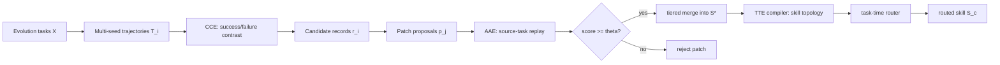

# SkillCAT：把 Agent 轨迹变成可验证、可路由的技能库

### 元信息

- **论文**：SkillCAT: Contrastive Assessment and Topology-Aware Skill Self-Evolution for LLM Agents
- **作者**：Kunfeng Chen, Qihuang Zhong, Juhua Liu, Bo Du
- **日期**：arXiv v1，2026-06-11 13:12:10 UTC
- **方向**：大模型 Agent；技能自演化；轨迹蒸馏；运行时上下文控制
- **原文**：[arXiv 摘要](https://arxiv.org/abs/2606.13317)；[HTML](https://arxiv.org/html/2606.13317)；[PDF](https://arxiv.org/pdf/2606.13317)

### TL;DR

- **这篇论文解决的问题**：现有 Agent 技能自演化方法常把单条执行轨迹直接改写成技能补丁，先合并再验证，并在推理时加载整份技能库；这会带来三类问题：单轨迹证据偏差、坏补丁污染技能库、技能上下文过长。
- **核心方法 SkillCAT**：论文把技能生命周期拆成三个可观测环节：**CCE** 从同一任务的成功/失败多 seed 轨迹中抽取“因果分水岭”附近的经验；**AAE** 在源任务克隆上回放候选补丁，只保留修复失败或保持成功的补丁；**TTE** 把合并后的 Markdown 技能编译成拓扑节点，推理时只路由相关节点。
- **关键证据**：在 SpreadsheetBench-Verified 上，Qwen3.5-35B-A3B 同模型 Skill Deepening 场景中，SkillCAT 达到 **55.50% Vrf**，比 Trace2Skill +Combined 的 **29.67%** 高 **25.83** 点；同一组平均分提升最高到 **40.40** 点。
- **泛化证据**：技能迁移到 OOD WikiTableQuestions 时，Qwen3.5-35B-A3B Skill Deepening 达到 **81.55%**；DocVQA 多模态实验中，Qwen3.5-35B-A3B authored SkillCAT 技能在同模型用户上达到 **0.9159 ANLS**。
- **消融结论**：去掉 CCE 后 Vrf 降到 **32.50%**，去掉 AAE 降到 **26.00%** 且低于 Trace2Skill，去掉 TTE 仍有 **46.50%** 但离完整系统差 **9.00** 点；说明三段分别对应证据、验证、部署，不是装饰模块。
- **成本与边界**：CCE 的 seed 数不是越多越好；1、3、5、7、9 seed sweep 中，5 seed 达到 **55.50%**，7/9 seed 反而降到 **46.00%/41.50%**，而采样时间从 **22m56s** 增到 **4h41m49s**。
- **最大局限**：论文展示的是训练免费、技能文档层面的改进，不是模型参数后训练；评测集中在表格、文档问答和若干模型迁移，尚未证明对开放 Web、真实工具权限、安全约束和长期部署漂移同样稳定。

### 研究问题：为什么“从轨迹学技能”不能只做总结？

论文的切入点很务实：很多 LLM Agent 不一定要重新训练模型，而是把任务经验、工具规则、错误修复和操作习惯写进外部技能文档。这样的技能可以在运行时注入上下文，让 Agent 少走弯路。

但作者指出，早期技能自演化 pipeline 往往把“轨迹转技能”看得过于线性：

- **轨迹来源过窄**：一个任务只看一条成功或失败轨迹，很难知道成功来自可复用策略，还是偶然碰对了工具顺序。
- **补丁进入太早**：候选 skill patch 先被合并进全局技能，再由后续表现间接暴露问题；坏补丁一旦进入，就可能污染后续 merge。
- **推理加载太重**：技能库越来越大，测试任务却仍加载整份技能；这让上下文包含大量无关规则，也增加冲突和 token 成本。

SkillCAT 的论证不是“写更长的技能文档”，而是把技能自演化拆成三个决策：

| 决策 | 论文里的问题化表达 | SkillCAT 的回答 |
|---|---|---|
| 哪些轨迹证据可信？ | 单条轨迹无法区分任务难度、随机 seed 和真正策略差异 | 用同一任务的成功/失败轨迹做对比，只抽取分歧点附近证据 |
| 哪些补丁应进入技能库？ | 未验证合并会把 harmful patch 带进全局技能 | 在源任务克隆上回放候选补丁，按 outcome transition 打分 |
| 推理时加载哪些技能？ | 全量技能库容易造成上下文过载 | 编译成技能拓扑，按任务描述路由相关节点 |

这三个问题对应 Agent 系统里的三条工程边界：**数据证据边界**、**状态更新边界**、**运行时上下文边界**。论文真正有价值的地方，是把这三条边界放进同一个训练免费 pipeline 里，而不是只优化其中一个环节。

### 论文主张与证据链

| Claim | Mechanism | Evidence | Boundary |
|---|---|---|---|
| 单轨迹技能抽取证据不足 | CCE 使用同任务多 seed 成功/失败对比，定位第一个动作分歧点 | 去掉 CCE 后，Vrf 从 55.50% 降到 32.50% | 需要同一任务下既有成功又有失败；全成功/全失败只能 fallback 或跳过 |
| 合并前必须验证补丁 | AAE 在源任务克隆上回放候选补丁，按失败到成功、成功到成功等转移排序 | 去掉 AAE 后 Vrf 为 26.00%，低于 Trace2Skill 的 29.67% | 回放只证明源任务近邻有效，不等于所有下游任务必然有效 |
| 技能使用应按任务路由 | TTE 把 Markdown 技能拆成核心技能和可路由节点，用 LLM graph router 选择节点 | LLM graph router top_k=7 达到 55.50% Vrf，并减少 41.6% 上下文 | 路由依赖技能文档结构质量；错误依赖边或摘要会影响召回 |
| 训练免费也能带来明显收益 | 不更新模型参数，只更新外部技能文档和运行时装配 | SpreadsheetBench、WikiTQ、DocVQA 均展示提升，最高平均分 +40.40 | 尚未覆盖更开放、更脏的真实 Web Agent 环境 |

### 方法总览：CCE、AAE、TTE 是三个不同的控制面



这张流程图可以帮助读者抓住论文结构：

- **CCE 是证据生成器**：它不直接相信单条轨迹，而是先制造成功/失败对照。
- **AAE 是补丁防火墙**：它不让候选补丁直接进入全局技能，而是先测试补丁是否损害源任务。
- **TTE 是上下文调度器**：它不把技能库当整块 prompt，而是把技能拆成可路由节点。

### 形式化：论文如何定义“技能自演化”

论文把技能演化任务写成一个输入输出问题：

```text
输入：
  X = {x_1, ..., x_N}                 # 用于技能演化的任务集合
  Z = {z_1, ..., z_K}                 # 每个任务的随机 seed 集合
  S_0                                 # 初始技能文档

轨迹：
  τ_{i,z} = agent(x_i, z, S_0)
  y_{i,z} ∈ {0,1}                     # 官方 evaluator 给出的成功/失败
  T_i = {(τ_{i,z}, y_{i,z}) : z ∈ Z}
  T = {T_i}_{i=1}^{N}

输出：
  S*                                  # 演化后的技能
  S_c                                 # 针对测试任务 c 路由后的技能片段
```

这里有一个关键变化：目标不是生成更厚的 `S*`，而是在提升未见任务 evaluator 表现的同时，约束每个测试任务实际注入的 `S_c`。这让论文的问题从“文档生成”转成“经验选择 + 补丁验证 + 上下文路由”。

### CCE：用同任务对比寻找因果分水岭

CCE 先把同一任务的多 seed 轨迹分成成功集合和失败集合：

```text
T_i^+ = {τ_{i,z} | y_{i,z}=1}
T_i^- = {τ_{i,z} | y_{i,z}=0}
```

当两个集合都非空时，它从各自集合中采样一条轨迹，形成同任务对比对：

```text
(τ_i^+, τ_i^-)
```

这个设计的意义是：成功轨迹和失败轨迹面对的是同一个输入、同一套工具、同一个官方 evaluator，因此差异更可能来自执行策略，而不是来自任务本身难度不同。

论文进一步定义“因果分水岭”：

```text
w_i = min { t : α_t^+ != α_t^- }
r_i = E(τ_i^+, τ_i^-, w_i)
```

变量解释：

- `α_t^+`：成功轨迹在第 `t` 步的动作。
- `α_t^-`：失败轨迹在第 `t` 步的动作。
- `w_i`：两条轨迹第一次发生动作分歧的位置。
- `E(...)`：对比分歧点附近证据的抽取器。
- `r_i`：候选经验记录，包含局部证据、推断失败原因和可改写为技能的 lesson。

这套机制的重点不是“总结整条成功轨迹”，而是只看成功/失败开始分叉的地方。对于 Agent 任务，这通常比全轨迹摘要更有信息密度：

- 如果成功轨迹先筛选 schema，再调用 spreadsheet tool，而失败轨迹直接写公式，那么分水岭就是 tool-use precondition。
- 如果成功轨迹先验证表头语义，失败轨迹直接按列号操作，那么分水岭就是 grounding 策略。
- 如果成功轨迹做了中间检查，失败轨迹跳过检查，那么分水岭就是 self-verification 规则。

论文也承认 CCE 的天然限制：如果同一个任务的所有 seed 都成功，或所有 seed 都失败，就没有严格的成功/失败对照。此时可启用单轨迹 fallback，也可以跳过该任务以保持严格对比证据。

### AAE：为什么源任务回放是补丁进入技能库前的防火墙？

AAE 接收 CCE 产生的候选记录，并把它们转成 candidate patch。每个 patch 都不会直接合并，而是先在源任务 clone 上回放。

AAE 不估计连续 reward，而是直接排序四种 outcome transition：

| baseline → replay | 解释 | 处理态度 |
|---|---|---|
| failure → success | 补丁修复了原本失败的源任务 | 最强证据，优先保留 |
| success → success | 补丁没有破坏已知成功行为 | 可接受，代表行为保持 |
| failure → failure | 补丁没有修复失败 | 降权或过滤 |
| success → failure | 补丁破坏了已知成功行为 | 拒绝 |

可以把 AAE 看成一个保守的 skill patch firewall：

```text
a_j = score(baseline_outcome, replay_outcome)
P_keep = { p_j : a_j >= θ }
```

论文配置中阈值是 `θ = 2.0`。这意味着只有“修复失败”或“保持成功”的补丁进入 merge；不能修复失败、或者把成功打坏的补丁被挡在全局技能库之外。

这个设计对 Agent 特别重要，因为技能文档的错误不是局部变量错误，而是会在未来任务中被反复注入 prompt：

- 一个错误的 spreadsheet rule 可能影响多个表格任务。
- 一个过度泛化的 DocVQA 经验可能让模型忽略图像中的具体证据。
- 一个看似有帮助但破坏成功任务的工具顺序，会被 merge 后的技能库长期携带。

AAE 的贡献不只是“多跑一次验证”，而是把技能库更新从无约束追加，改成了带 replay gate 的状态更新。

### 分层合并：为什么高分补丁后合并？

AAE 过滤后，还会按 score tier 分层 merge。论文的直觉是：

- 低分但通过阈值的补丁可能包含可用规则，但可信度不如 failure → success。
- 高分补丁在后续层级合并中拥有更高优先级，可以覆盖或整理低分补丁中的噪声。
- merge operator 仍复用 Trace2Skill 的技能编辑能力，AAE 改变的是“谁能进入 merge”和“以什么顺序进入”。

这个顺序让 SkillCAT 的增量相对清晰：它没有发明一个全新的 skill writer，而是给现有 writer 加了前置证据筛选和合并顺序控制。

### TTE：把技能文档编译成可路由拓扑

TTE 关注测试时如何使用 `S*`。论文将 AAE 生成的 Markdown 技能拆成两层：

| Markdown 层级 | TTE 解释 | 推理时角色 |
|---|---|---|
| Level-1 content | always-on core skill `S_∘` | 每次任务都带上，作为基础规则 |
| Level-2 sections | routable node set `V` | 由 router 按任务选择 |

每个节点保留原始正文作为注入内容，同时抽取 title、keywords、summary 和 dependency metadata。路由时，LLM graph router 只读紧凑的 topology summary，而不是读完整技能正文。

论文把 routing 写成：

```text
V_tilde_c = ρ(c, Σ; k)
V_c = Expand(V_tilde_c, Σ)
```

变量解释：

- `c`：测试任务描述。
- `Σ`：技能拓扑摘要。
- `k`：路由预算，即最多选择多少个 primary nodes。
- `ρ`：router。
- `V_tilde_c`：router 初选节点。
- `Expand`：确定性扩展步骤，包括节点 ID 校验、依赖边扩展、任务意图锚点和 foundational nodes 注入。
- `V_c`：最终用于组装 `S_c` 的节点集合。

TTE 的工程含义很明确：LLM 只负责“选节点”，runtime 负责“校验、补依赖、组装”。这比直接让模型写一段完整技能 prompt 更可靠，因为 runtime 可以把拓扑结构变成可审计的上下文装配过程。

### 伪代码复原：SkillCAT 的完整执行边界

```text
Input:
  tasks X, seeds Z, base skill S0, score threshold θ, routing budget k

State:
  R = empty candidate record set
  P = empty patch set

For each task x_i in X:
  Run agent with S0 under every seed z in Z
  Split trajectories into success set T_i^+ and failure set T_i^-

  If T_i^+ and T_i^- are both non-empty:
    Sample (τ_i^+, τ_i^-)
    Locate watershed w_i = first divergent action step
    Extract candidate record r_i = E(τ_i^+, τ_i^-, w_i)
    Add r_i to R
  Else:
    Use fallback single-trace extractor, or skip this task

For each record r_j in R:
  Propose temporary patch p_j
  Replay p_j on source-task clones
  Compute transition score a_j
  If a_j >= θ:
    Add p_j to P
  Else:
    Reject p_j

Merge:
  Group P by score tier
  Merge lower tiers first, higher tiers later
  Output evolved skill S*

Compile and route:
  Parse S* into core skill S_∘ and node topology V
  For each test task c:
    Select nodes with router ρ(c, Σ; k)
    Expand dependencies and foundational nodes
    Assemble routed skill S_c

Output:
  evolved skill topology and per-task routed skill
```

失败边界也要写清楚：

- 如果没有成功/失败对照，CCE 的严格因果解释会弱化。
- 如果 source-task clone 不能代表真实下游分布，AAE 的保留判断可能过窄。
- 如果 Markdown 技能层级写得差，TTE 的拓扑节点会粒度不稳定。
- 如果 router 选错节点，`Expand` 可以补依赖，但不能凭空恢复完全缺失的任务意图。

### 实验设置：作者到底测了什么？

论文实验分三类：

| 评测 | 作用 | 指标 |
|---|---|---|
| SpreadsheetBench-Verified | 测表格工具 Agent 在 held-out verified 子集上的能力 | Vrf accuracy |
| full SpreadsheetBench | 区分 soft/hard spreadsheet 任务 | Soft、Hard |
| WikiTableQuestions | 测 OOD 半结构化表格泛化 | WikiTQ accuracy |
| DocVQA | 测多模态文档问答迁移 | ANLS、Acc |

对比对象包括：

- **Human-Written**：人工技能文档基线。
- **Parametric**：无外部技能或仅模型参数能力基线。
- **Trace2Skill +Combined**：核心训练免费 baseline，代表从轨迹抽 patch 再 Map-Reduce 合并的路线。
- **SkillCAT variants**：完整系统、去掉 CCE/AAE/TTE、仅使用单模块等消融。

实现细节里有几个值得注意的数字：

- CCE 默认每个 evolution task 采 **5 个 trajectory seeds**。
- 使用 **128 parallel inference workers** 采集成功/失败证据。
- AAE 保留 `a_j >= 2.0` 的候选补丁。
- TTE 最终使用 prompt-based `llm_graph_router`，`top_k=7`。

这些参数说明，SkillCAT 虽然“不训练模型”，但并不是零成本。它把成本放在离线轨迹采样、源任务回放和拓扑编译上。

### 主结果：表格与 OOD 任务上的提升

论文最强的主结果来自 Qwen3.5-35B-A3B 同模型 Skill Deepening：

| 方法 | Vrf | Soft | Hard | WikiTQ | Avg |
|---|---:|---:|---:|---:|---:|
| Human-Written | 9.67 | 13.03 | 3.37 | 9.02 | 8.77 |
| Trace2Skill +Combined | 29.67 | 18.80 | 5.73 | 51.22 | 26.36 |
| SkillCAT | **55.50** | **39.02** | **20.61** | **81.55** | **49.17** |

这个表支撑了三个判断：

- SkillCAT 不只是比人工规则好，而是比同类训练免费 baseline 高很多。
- 提升不只集中在 Vrf，Soft、Hard、WikiTQ 都上涨，说明不是单一指标过拟合。
- WikiTQ 的 OOD 提升尤其关键，因为它检验的是技能是否能从 SpreadsheetBench 迁移到不同表格问答分布。

另一个重要结果是 Skill Creation 场景：

| author/user | baseline | Trace2Skill 对 Vrf 的影响 | SkillCAT Vrf | 说明 |
|---|---:|---:|---:|---|
| Qwen3.5-35B-A3B | Parametric 20.17 | -0.17 | **54.50** | Trace2Skill 几乎不改变 Vrf，SkillCAT +34.33 |
| Qwen3.5-122B-A10B | Parametric 26.17 | +0.16 | **64.50** | 大模型同样需要验证与路由，不只是模型更强 |

这里的研究意义是：当技能不是“深化已有人工技能”，而是从轨迹创建出来时，单纯 Trace2Skill 合并甚至可能基本无效；SkillCAT 的过滤与路由让技能创建变得可控。

### 跨模型：技能是否只服务于写它的模型？

论文还测试了技能作者和技能用户不同的情况。这里最重要的是“技能能否脱离作者模型迁移”。

作者报告：

- 用 Qwen3.5-35B-A3B authored skills 时，gemma-4-31B-it 的 Vrf 从 Human-Written baseline **39.00%** 上升到 **61.00%**。
- 同样技能给 gpt-5.4-mini 使用时，Vrf 从 **31.00%** 上升到 **37.00%**。
- 用 Qwen3.5-122B-A10B authored skills 时，gemma-4-31B-it 达到 **70.50% Vrf**。

这说明 SkillCAT 的技能不是纯粹的模型私有 scratchpad。至少在这些任务中，技能文档携带了可迁移的任务结构、工具使用顺序和错误避免规则。

边界也同样明显：

- 迁移收益对模型能力和任务类型敏感。
- gpt-5.4-mini 的提升较小，说明较弱或不同架构的用户模型未必能充分执行复杂技能。
- 论文没有展示真实部署中的多轮更新后，技能是否会随着用户模型变化而漂移。

### DocVQA：AAE 为什么特别重要？

DocVQA 是论文里最能说明“未验证补丁会伤害系统”的实验之一。

作者强调，在多模态 DocVQA 上：

- Qwen3.5-35B-A3B authored SkillCAT skills 在同模型用户上达到 **0.9159 ANLS**。
- 在 Qwen3.5-122B-A10B 用户上达到 **0.7200 ANLS**。
- 未验证补丁的 Trace2Skill +Error 会让性能低于 No Skill baseline。

这个结果的含义是：在文档图像任务里，坏技能可能比没有技能更糟。原因并不难理解：

- 技能若错误泛化，会诱导模型忽略图片局部证据。
- 技能若过度依赖某类版式，会伤害 OOD 文档。
- 技能若在工具顺序上给出错误建议，会把模型带离真实 evidence。

AAE 在这里不是锦上添花，而是防止技能库成为错误先验的必要 gate。

### 消融：三段都有效，但作用不同

| 条件 | CCE | AAE | TTE | Vrf |
|---|---|---|---|---:|
| Trace2Skill +Combined | 否 | 否 | 否 | 29.67 |
| SkillCAT Full | 是 | 是 | 是 | **55.50** |
| w/o CCE | 否 | 是 | 是 | 32.50 |
| w/o AAE | 是 | 否 | 是 | 26.00 |
| w/o TTE | 是 | 是 | 否 | 46.50 |
| Only CCE | 是 | 否 | 否 | 39.00 |
| Only AAE | 否 | 是 | 否 | 34.00 |
| Only TTE | 否 | 否 | 是 | 27.50 |

这张消融表比主结果更有解释力：

- **w/o CCE = 32.50**：没有同任务对比证据时，AAE 和 TTE 仍能工作，但输入补丁质量不够。
- **w/o AAE = 26.00**：有对比抽取和路由，但坏补丁进入 merge，会把系统打到低于 Trace2Skill。
- **w/o TTE = 46.50**：高质量技能已经能带来强提升，但全量加载仍损失 9 点。
- **Only TTE = 27.50**：只会路由旧技能或低质量技能没有用；上下文控制不能替代技能内容本身。

因此，SkillCAT 的三个模块不是平行堆叠，而是一个顺序依赖链：

```text
更可信的证据 -> 更安全的补丁集合 -> 更小且相关的推理上下文
```

### Figure 4：为什么 5 个 seed 是成本与准确率折中？

论文对 CCE seed 数做了 sweep：1、3、5、7、9。

| seed 数 | held-out Vrf | 采样成本趋势 |
|---:|---:|---|
| 1 | 32.50% | 22m56s |
| 5 | **55.50%** | 成本显著增加但收益最佳 |
| 7 | 46.00% | 继续增加 |
| 9 | 41.50% | 4h41m49s |

这个结果提醒我们：多 seed 不是为了暴力扩数据，而是为了构造足够多的成功/失败对照。超过一定数量后，额外轨迹可能带来更多噪声、重复模式或低质量 fallback，泛化不一定提升。

从 Agent 工程角度看，这个 finding 很实际：

- 多 seed 采样要服务于“对比证据”，不是服务于“更多日志”。
- 轨迹预算需要被当作数据质量预算，而不是只当算力预算。
- 如果真实系统没有稳定 evaluator，盲目增加轨迹数量不会自动产生可验证技能。

### Figure 5：AAE 分数是否真的预测下游有效性？

论文把 **197** 个 candidate patches 按 replay outcome transition 分桶，并单独评估每个桶。结果呈单调排序：

| replay transition | bucket-only Vrf | 相对 Trace2Skill |
|---|---:|---:|
| failure → success | **51.00%** | +21.33 |
| success → success | 41.00% | +11.33 |
| failure → failure | 32.00% | +2.33 |
| success → failure | 23.50% | -6.17 |

这张图支撑 AAE 的关键前提：源任务回放不是只做局部 sanity check，它对下游表现有可观的排序信号。

但边界也要保留：

- 这个单调性来自论文评测分布，不能保证所有 Agent 任务都有同样排序。
- `failure → success` 可能过度偏好修复某类源任务，而忽略长尾任务覆盖。
- `success → success` 被接受是保守合理的，但可能保留一些无实际贡献的补丁。

### Figure 6：TTE 如何减少上下文而不丢效果？

Figure 6 对比了不同路由器和不同 top_k 下的效果。论文选择 `llm_graph_router`，`top_k=7`：

- full skill loading without TTE：**46.50% Vrf**。
- embedding retrieval peak：`top_k=3` 时 **57.00% Vrf**。
- selected LLM graph router：`top_k=7` 时 **55.50% Vrf**，并减少 **41.6%** context。

这里最值得注意的不是 LLM router 比 embedding 更高，而是 full loading 不如路由后加载。也就是说，技能库不是越完整越好；无关技能会成为干扰项。

这个结论和长上下文 Agent 经验一致：

- Prompt 中的规则越多，冲突和注意力稀释越严重。
- 技能越结构化，runtime 越能控制上下文边界。
- “检索/路由”不是 RAG 独有问题，也是技能库部署问题。

### 相关工作位置：SkillCAT 不是简单记忆压缩

论文把自己放在 Agent skills 与 skill self-evolution 的交叉处。

| 方向 | 代表问题 | SkillCAT 的差异 |
|---|---|---|
| Reflexion / Self-Refine | 让 Agent 从反馈中迭代改进 | 多数更像单条经验或自反馈循环，缺少合并前验证 |
| Trace2Skill | 把轨迹局部 lesson 蒸馏成可迁移技能 | SkillCAT 继承训练免费路线，但加入 CCE、AAE、TTE 三个边界 |
| Graph of Skills / SkillRAE | 如何组织、检索已有技能 | SkillCAT 同时研究技能如何可靠产生，以及如何按拓扑路由 |
| Skill benchmarks | 评估技能跨任务使用 | SkillCAT 把评估结果反过来作为技能演化 pipeline 的设计约束 |

因此，SkillCAT 更像一个技能库控制平面，而不是一个单点 skill extraction prompt。

### 研究者视角：这篇论文真正改变了什么理解？

我认为它给 Agent 技能系统带来三点可迁移理解。

第一，**轨迹日志不是天然训练数据**。Agent 轨迹中有大量偶然动作、工具噪声、环境反馈和模型自我解释。SkillCAT 强调同任务成功/失败对比，等于把“轨迹转技能”从摘要任务改成因果诊断任务。

第二，**技能库更新需要像软件变更一样有回归测试**。AAE 的 source-task replay 很像最小回归测试：候选补丁至少不能破坏它声称相关的源任务。这对长期运行 Agent 尤其重要，因为技能文档会成为未来任务的隐性依赖。

第三，**技能使用需要 runtime，而不只是 retrieval prompt**。TTE 的 node validation、dependency expansion 和 foundational-node injection 都是 runtime 行为。它说明可控 Agent 不是把更多文本塞给模型，而是把上下文装配变成可验证程序。

### 局限与可复现性边界

这篇论文证据较完整，但仍有几类边界：

- **任务分布边界**：实验覆盖 spreadsheet、WikiTQ、DocVQA；尚未覆盖真实浏览器、代码仓库、企业 SaaS、多权限工具链等开放环境。
- **evaluator 边界**：CCE 和 AAE 都依赖成功/失败信号；如果 evaluator 不稳定、延迟反馈或只给主观评分，分水岭和 replay score 都会变弱。
- **技能结构边界**：TTE 默认技能文档能被 Markdown 层级合理拆解；如果技能 writer 生成结构混乱的文档，拓扑节点质量会下降。
- **安全边界**：论文关注性能提升，没有系统评估 prompt injection、恶意轨迹、投毒技能或权限升级风险；技能自演化在真实系统中本身也可能成为攻击面。
- **成本边界**：训练免费不等于执行免费；多 seed 采样、128 并行 worker、源任务 clone replay 都需要离线计算预算。

### 值得继续追问的问题

- **能否把 AAE 扩展成安全 gate？** 现在 replay 主要看任务成功/失败；真实 Agent 还需要检查权限边界、数据泄漏、工具副作用和 policy violation。
- **能否用不确定性选择 seed？** Figure 4 显示盲目增加 seed 会降效；下一步可以研究主动采样，只在高不确定任务上扩轨迹。
- **技能拓扑能否长期维护？** 当技能不断演化，节点依赖、过期规则和冲突规则需要版本管理；TTE 目前更多是单轮编译，不是长期数据库维护。
- **能否把 source-task replay 与下游 holdout 结合？** AAE 的回放排序有效，但仍可能过拟合源任务 clone；加入少量任务族 holdout 或 adversarial replay 可能更稳。
- **如何防止恶意轨迹写入技能？** 如果攻击者能控制部分环境反馈或轨迹内容，CCE 可能抽取到带毒 lesson；这需要安全版 AAE 或 provenance-aware skill merge。

### 结论

SkillCAT 的贡献不在于提出一个更花哨的 Agent prompt，而在于把“轨迹经验如何变成可靠技能”拆成三个可验证问题：

- 用 CCE 回答：这条经验为什么可信？
- 用 AAE 回答：这个补丁是否应该进入全局技能？
- 用 TTE 回答：测试任务真正需要加载哪些技能？

实验结果说明，这三个问题同时处理时，训练免费技能自演化可以在 SpreadsheetBench、WikiTQ 和 DocVQA 上获得明显收益；消融也说明，少任何一段都会改变失败模式。

对 Agent 研究而言，这篇论文的更大启发是：长期 Agent 能力不只来自更强模型，也来自围绕轨迹、技能、回放和上下文路由建立的控制面。未来如果要把 Agent 放进真实工作流，类似 SkillCAT 的证据筛选、补丁回归和拓扑路由可能会变成基础设施，而不是论文里的可选模块。
