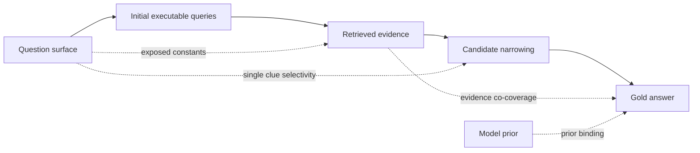

# FORT-Searcher：训练深度搜索 Agent，先堵住“捷径”

### 元信息

- **论文**：FORT-Searcher: Synthesizing Shortcut-Resistant Search Tasks for Training Deep Search Agents
- **方法名**：FORT，Framework of Shortcut-Resistant Training-Data Synthesis
- **作者**：Jia Deng, Yimeng Chen, Xiaoqing Xiang, Ziyang Zeng, Shuo Tang, Wayne Xin Zhao, Feng Chang, Chuan Hao, Yuan Wei, Ran Tao, Bryan Dai, Ji-Rong Wen
- **日期**：arXiv v1，2026-06-10 13:49:11 UTC
- **方向**：大模型 Agent；Deep Search；训练数据合成；搜索轨迹诊断；Agent shortcut
- **原文**：[arXiv 摘要](https://arxiv.org/abs/2606.12087)；[HTML 全文](https://arxiv.org/html/2606.12087)；[PDF](https://arxiv.org/pdf/2606.12087)
- **补充页面**：[Hugging Face Papers](https://huggingface.co/papers/2606.12087)；[Papers.cool 镜像](https://papers.cool/arxiv/2606.12087)
- **代码状态**：论文写明资源将发布到 `https://github.com/RUCAIBox/FORT-Searcher`；本轮检查 GitHub API 未返回可用仓库元数据，因此不能把代码、数据或 checkpoint 当作已公开资源分析。

### TL;DR

- **这篇论文做什么**：FORT-Searcher 研究如何为 deep search agent 合成更有训练价值的问题和轨迹。作者指出，很多“看起来多跳、长链、图结构复杂”的搜索题，真实求解时会被模型用更便宜的路径绕过；这些题训练出来的 Agent 学到的不是持续取证，而是快速撞答案和事后验证。
- **核心问题定义**：论文把搜索任务写成 `q=(X, C_q, Sigma)`，其中 `X` 是候选答案空间，`C_q` 是问题约束集合，`Sigma` 是检索接口。真正的难度不等于约束数或图节点数，而取决于是否存在一个便宜的 identifying subset，使 Agent 用少量检索就锁定唯一答案。
- **四类 shortcut**：作者归纳出 evidence co-coverage、single-clue selectivity、exposed constants、prior-knowledge binding。前三类让最便宜的取证路径变短；第四类让具体模型用参数记忆提前绑定答案。
- **FORT 方法**：FORT 从 Wikidata 长尾实体出发，用 cycle-based seed、异构证据图、多源 enrichment、derived fact、generic fact selection、name withholding、exact-value fuzzing 和 adversarial refinement，尽量让单条线索不够识别答案、多个线索不被同一网页共覆盖、后续查询不能从题面直接执行。
- **训练方式**：作者只用 SFT 训练 FORT-Searcher，底座是 Qwen3-30B-A3B-Thinking-2507，推理时约激活 3B 参数，最大上下文 256K；训练 6 epoch，global batch size 64，最大序列长度 262,144 tokens。
- **关键结果**：FORT-Searcher 在 comparable-size open-source agents 中 overall 得 **66.2**，高于 MiroThinker-1.7-mini 的 **64.6** 和 Qwen3.5-35B-A3B 的 **59.9**；BrowseComp 得 **72.2**，BrowseComp-ZH 得 **75.0**，xbench-DeepSearch-2505 得 **80.8**。
- **证据更重要的一组数字**：FORT 数据的平均求解成本 `Omega_hat` 达 **141.0**，答案命中时间 `T_hit` 为 **46.9**；REDSearcher 分别是 **92.1** 和 **18.7**。这说明它不只是让轨迹变长，而是延后了“答案第一次被看到”的时间。
- **局限**：代码和数据尚未可用，很多 trajectory-level proxy 由 GPT-5.5 标注，不是可枚举的真值；评测聚焦 BrowseComp、BrowseComp-ZH、xbench、Seal-0，尚未证明对开放企业搜索、恶意网页、实时页面变更或 RL 后训练同样稳定。

### 研究问题：为什么“长搜索轨迹”不等于“好训练数据”？

论文回应的是 deep search agent 训练里的一个常见误判：

- **表面难度**：
  - 多跳问题；
  - 更长的隐含证据图；
  - 更多约束；
  - 更多网页来源；
  - 更复杂的实体链。
- **真实难度**：
  - Agent 是否必须先找证据，再看到答案；
  - 单个 clue 是否已经几乎锁定答案；
  - 一个网页是否同时覆盖多个 clue；
  - 题面是否暴露了可以直接搜索的常量；
  - 模型是否能在检索前靠参数记忆猜出答案。

作者的关键判断是：

- **训练数据的价值不在轨迹长度本身**。
- **价值在于答案是否只能通过足够长的 pre-answer evidence acquisition 得到**。
- **如果答案第一轮就出现，后面几十轮只是 verification 或 detour，这种轨迹对训练 search agent 的意义会被高估**。

可以把论文的问题改写成一句话：

> 我们需要的不是“看上去难的搜索题”，而是“便宜识别路径被系统性堵住的搜索题”。

这也是 FORT 与普通 synthetic QA pipeline 的分界：

| 维度 | 普通合成思路 | FORT 的重心 |
|---|---|---|
| 难度来源 | 增加 hop、图深度、约束数 | 检查最便宜识别路径是否坍缩 |
| 数据质量 | 最终答案可验证即可 | 答案必须在足够取证后才出现 |
| 失败模式 | 题目不可答或答案错 | 题目可答但过早可答 |
| 训练目标 | 生成正确答案轨迹 | 生成迫使模型持续搜索的轨迹 |

### 论文主张与证据链

| Claim | Mechanism | Evidence | Boundary |
|---|---|---|---|
| 结构复杂不保证真实搜索难度 | 定义 cheapest identifying route `Q*_Sigma`，指出小子集约束可能直接锁定答案 | Difficulty framework 给出 `D_post(q) >= Q*_Sigma`，并列出四类 shortcut | 理论对象在开放 Web 中不可直接枚举，只能用轨迹代理指标近似 |
| shortcut-resistant data 能产生更有用的 SFT 监督 | FORT 控制 long-tail root、证据分散、低选择性 clue、常量模糊、对抗修复 | FORT 数据 `Omega_hat=141.0`、`T_hit=46.9`，高于开源数据集 | 轨迹由同一强搜索 Agent 复评，但仍依赖该 Agent 和检索环境 |
| SFT-only 也能训练出强 deep search agent | 用 FORT 轨迹微调 Qwen3-30B-A3B-Thinking-2507 | Overall 66.2，BrowseComp 72.2，BrowseComp-ZH 75.0 | 不是闭源 frontier 最强；GPT-5.5 在 BrowseComp 为 84.4 |
| 难题不能只靠“更长轨迹”筛选 | 比较同 `Omega_hat=140.0` 的数据，FORT 延后 answer hit 并降低 prior shortcut | FORT 设置 BrowseComp 52.9、BC-ZH 60.3，高于同长度开源数据 49.5、58.1 | 这是训练数据子集实验，不等于完整生产系统最优配方 |
| 每个抗捷径组件都有贡献 | 累积移除 cycle、long-tail、derived fact、source diversity、generic fact、fuzzing | 强 Agent 解题准确率从 Full 的 29.0 升到去掉 fuzzing 后的 81.6 | 这是 cumulative ablation，不能单独估计每个组件的独立因果效应 |

### 难度框架：把搜索题写成约束、答案空间和接口

论文把一个 multi-constraint agentic retrieval 任务定义为：

```text
q = (X, C_q, Sigma)
```

变量含义：

| 符号 | 解释 | 在 deep search 中的含义 |
|---|---|---|
| `X` | answer space | 可能的候选实体、年份、人物、地点或短答案 |
| `C_q` | question constraint set | 问题里表达的 clue 集合 |
| `Sigma` | retrieval interface | Web search、浏览器、数据库或其他检索工具 |
| `P` | subset of constraints | 一部分 clue，不一定是完整题面 |
| `Ans(P)` | 满足 `P` 的候选集合 | 只看部分 clue 后还剩哪些可能答案 |
| `y*` | gold answer | 满足完整约束集合的唯一答案 |

作者要求问题是 well-posed：

```text
Ans(C_q) = { y* }
```

但这里有一个关键转折：

- 求解者未必需要验证完整 `C_q`。
- 只要存在某个子集 `P` 也能让 `Ans(P)={y*}`，Agent 就可能走这条更便宜路径。
- 因此，多 clue 不自动代表高难度；有效难度受“最便宜识别子集”控制。

### 公式：真正要防的是 `Q*_Sigma` 坍缩

论文定义 no-prior、no-guessing solver 的 pure-posterior cost：

```text
D_post(q) = inf_{pi in Pi_post} E_{tau~pi}[ |tau| ]
```

解释：

- `Pi_post`：不能使用问题特定先验、不能瞎猜、只能发出 executable query 的求解策略集合。
- `tau`：检索查询序列。
- `|tau|`：检索步数。
- `D_post(q)`：只靠检索证据，理论上至少要付出的期望检索成本。

对任意能唯一识别答案的约束子集 `P`，论文定义：

```text
Q_Sigma(P) =
min { |theta| : theta 是在接口 Sigma 下验证 (y*, P) 的有效取证路径 }
```

最便宜的识别路径是：

```text
Q*_Sigma =
min_{P: Ans(P) = {y*}} Q_Sigma(P)
```

核心下界：

```text
D_post(q) >= Q*_Sigma
```

这条公式的含义非常直接：

- 如果某个 `P` 很小，而且一个查询就能验证它，`Q*_Sigma` 可能等于 1。
- 这时即使原题有十条线索、一个复杂图结构，真实训练价值也会坍缩。
- 因为模型可以不用学完整搜索过程，只学到“抓住最显眼 clue 搜一下”。

论文进一步把一个识别子集的取证成本拆成：

```text
Q_Sigma(P) >= max( M_ev(P), dep(P) )
```

变量解释：

| 符号 | 意义 | shortcut 风险 |
|---|---|---|
| `s(P)=|Ans(P)|` | 子集约束后的候选池大小 | 如果很小，单个 clue 可能直接定位答案 |
| `M_ev(P)` | 验证 `P` 所需的最少证据获取次数，不考虑查询可执行性 | 如果很小，多条 clue 可能被同一网页共覆盖 |
| `dep(P)` | 有效取证路径的最小依赖深度 | 如果题面暴露常量，后续查询从一开始就可执行 |
| `U_pi0(q)` | 具体模型相对 no-prior solver 节省的成本 | 如果模型先验强，会提前绑定答案 |

### 四类 shortcut：每一种都在破坏不同的难度来源

论文把 shortcut 分成四类，不是为了分类好看，而是为了把每一类对应到一个可干预的合成控制点。

| Shortcut | 发生机制 | 破坏的量 | 直观例子 |
|---|---|---|---|
| Evidence co-coverage | 一个网页同时验证多条 clue | `M_ev(P)` 降低 | 搜到一页百科同时写了人物、作品、奖项、年份 |
| Single-clue selectivity | 一条 clue 本身太独特 | `s(P)` 过小 | “第一次彩色电视常规播出”直接指向 1951 |
| Exposed constants | 题面暴露精确名称、数字、短语 | `dep(P)` 降低 | 题面给出一句新闻原话，直接复制搜索就出答案 |
| Prior-knowledge binding | 模型检索前已知道答案 | `U_pi0(q)` 增大 | 看到 Caesar、Actium、queen 就先猜 Cleopatra |

用流程看，shortcut 的位置大致如下：



论文的细节在于：

- 它不把 shortcut 当成“模型作弊”。
- 它把 shortcut 当成数据构造失败：题面、证据环境、模型先验之间出现了便宜路径。
- 因此，解决方式不是简单惩罚模型，而是从数据合成阶段改变题目的可搜索结构。

### FORT 方法总览：四个阶段共同堵住便宜路径

FORT 的数据构造分成四个阶段：

1. **Graph initialization**
   - 选择长尾 root entity。
   - 优先使用 cycle-based seed，而不是线性链。
   - 目标是降低 prior binding，并减少题面必须暴露中间常量的压力。

2. **Graph construction**
   - 构建异构 evidence graph。
   - 从 Wikidata、开放网页、结构化数据库、Google Scholar、Google Maps 等来源收集事实。
   - 用 derived fact 和 multi-source enrichment 降低 evidence co-coverage。

3. **Question formulation**
   - 从证据图中选出答案子图。
   - 保留 jointly identifying 的 clue，避免 individually identifying 的 clue。
   - 隐去中间实体名，并把精确数值、日期、名称改成 truthful but less searchable 的表达。

4. **Adversarial refinement**
   - 用强搜索 Agent 试做草稿题。
   - 如果太快解出，就定位 shortcut 并修复。
   - 如果解不出，就收窄过度模糊的线索，保证 solvable。

对应关系如下：

| Shortcut risk | FORT control | 实现阶段 |
|---|---|---|
| Single-clue selectivity | Generic fact selection；low-specificity clue formulation | Graph construction；Question formulation |
| Evidence co-coverage | Multi-source enrichment；derived fact construction | Graph construction |
| Exposed constants | Cycle-based initialization；name withholding；exact-value fuzzing | Graph initialization；Question formulation |
| Prior-knowledge binding | Long-tail root selection；adversarial refinement | Graph initialization；Adversarial refinement |

### 伪代码：Evidence graph construction 怎么工作？

论文的 graph construction 不是简单 BFS 扩张，而是带着 shortcut 目标扩张。

```text
Input:
  G0 = (V0, E0)        # 初始化子图，含 root r
  D                    # 深度限制
  B                    # 新增节点预算

State:
  G <- G0
  delta_G(u) <- dist_G(r, u)
  Q <- { u in V(G) : delta_G(u) < D }
  V_done <- empty
  b <- 0

Loop:
  while Q not empty and b < B:
    v <- deepest unprocessed node in Q
    remove v from Q

    if v already done or delta_G(v) >= D:
      continue

    A_v <- CollectAtomicFacts(v)
    D_v <- ConstructDerivedFacts(A_v)
    P_v <- A_v union D_v
    F_v <- VerifyFacts(v, P_v)
    S_v <- SelectFacts(F_v)

    for each selected fact (v, rho, w) in S_v:
      if w not in G and b < B:
        add edge (v, rho, w) to G
        delta_G(w) <- delta_G(v) + 1
        b <- b + 1
        if delta_G(w) < D:
          add w to Q

Output:
  evidence graph G
```

这段伪代码里，最重要的不是“深度优先”本身，而是每个子函数都服务于抗捷径：

- `CollectAtomicFacts`：尽量从异构来源拿事实，避免同一来源覆盖多条 clue。
- `ConstructDerivedFacts`：把多个事实组合成不容易被原文直接命中的 clue。
- `VerifyFacts`：防止名称相似、缩写歧义、时间漂移、地理漂移、系列版本混淆。
- `SelectFacts`：优先选择可靠但不太有代表性的事实，让单条 clue 不足以定位答案。

### Derived facts：为什么作者要造“间接事实”？

FORT 使用四种 derived fact constructor：

| Constructor | 定义 | 训练意义 |
|---|---|---|
| Coincidence bridging | 找两个实体共享的独立属性 | 让 Agent 必须连接两个来源，而不是搜一个唯一短语 |
| Count aggregation | 把集合与属性结合成计数约束 | 降低关键词直接命中的概率 |
| Numerical relation | 检索数值后做算术比较 | 把答案发现推迟到计算之后 |
| Meta-fact extraction | 从富文本中统计或概括表面特征 | 迫使 Agent 阅读原始内容，而不是只查实体页 |

举例说：

- 代表性事实：“Marie Curie won Nobel Prizes in two different scientific fields。”
- 泛化事实：“Worked at a university in France。”

前者太强，单独就能把候选池压到很小；
后者很弱，但和其他 clue 组合后仍可唯一识别。

FORT 的设计原则是：

- 单条 clue 要“真实但不够独特”。
- 多条 clue 合起来要“足够识别”。
- 每条 clue 的证据最好来自不同路径。
- 后续 clue 的搜索最好依赖前面检索到的信息。

### Exact-value fuzzing：不是把题写糊，而是避免直接搜索

论文列出五类 fuzzing 策略：

| Strategy | 做法 | 例子 |
|---|---|---|
| Category generalization | 具体实体改成更高层类别 | IMF -> an international financial institution |
| Range relaxation | 精确数值改成区间或近似范围 | 1863 -> the second half of the nineteenth century |
| Meta-attribute description | 用表面结构描述值 | September 9 -> month and day use the same number |
| Arithmetic encoding | 用算术或数字性质表达 | 42 -> a multiple of six |
| Contrastive exclusion | 通过排除其他候选描述 | Canada -> North American country that does not border Mexico |

这一步的边界也很清楚：

- **不能过度模糊**：否则题目变成不可解或多解。
- **不能虚构事实**：所有改写必须 truthful。
- **不能只追求难**：adversarial refinement 要把过难草稿修回可解区域。

因此 FORT 的 question formulation 更像“控制查询可执行性”的过程：

- 不让下游查询从题面一开始就能执行；
- 让 Agent 必须先发现中间实体或属性；
- 再用这些新信息发起下一步检索。

### Adversarial refinement：把“太容易”和“太难”都修掉

FORT 的对抗修复用强搜索 Agent 试做草稿题，然后按轨迹信号判断：

| 草稿状态 | 诊断 | 修复方式 |
|---|---|---|
| 太快答对 | 存在 shortcut-prone clue | 替换共覆盖证据、移除过强事实、隐藏或模糊常量 |
| 太早看到答案 | `T_hit` 过早 | 修改 clue，使答案不能早期出现 |
| 检索前已猜答案 | prior binding | 换长尾 root 或强化证据路径 |
| 预算内答不出 | 过度模糊、歧义、多解 | 收窄 clue、删掉歧义事实、恢复必要约束 |

论文给出的一个修复案例很典型：

- 原题暴露了 “shot down by the Soviet Union” 和 “4 runways”。
- 这两个短语可以直接定位冷战航空事件和年份。
- 再结合电影 runtime 的 digit-sum 约束，候选电影迅速坍缩。
- 修复后：
  - “Soviet Union” 变成 “a certain country during the Cold War”；
  - “4 runways” 变成 “a certain international airport”；
  - runtime digit-sum 从精确的 10 放宽成 5 的倍数。

这个案例说明：

- FORT 不是机械增加 hop。
- 它在问：哪一个 clue 让便宜路径成立？
- 然后只修这个 clue 的可搜索性或选择性。

### 训练设置：SFT-only，但长上下文和搜索协议很重

FORT-Searcher 的训练设置如下：

| 项目 | 设置 |
|---|---|
| Base model | Qwen3-30B-A3B-Thinking-2507 |
| 推理激活参数 | 约 3B / 30B |
| Context window | 256K |
| 训练方式 | Supervised fine-tuning only |
| Epoch | 6 |
| Global batch size | 64 |
| Max sequence length | 262,144 tokens |
| Precision | bf16 |
| Optimizer | Adam |
| Beta | `beta1=0.9`, `beta2=0.95` |
| Weight decay | 0.01 |
| Gradient clipping | 1.0 |
| Peak LR | `2e-5` |
| Min LR | `1e-7` |
| Warmup | 2 iterations |

MoE 训练并行设置：

- tensor parallelism：4
- pipeline parallelism：1
- context parallelism：1
- expert parallelism：4
- sequence parallelism：启用
- activation recomputation：启用
- distributed optimizer：启用

推理阶段采用 context-managed search protocol：

- 一个 rollout 内保留所有 tool-call result。
- 如果达到 turn limit 仍未回答，就清空交互历史，从原问题重启。
- BrowseComp 与 BrowseComp-ZH turn limit 是 **300**。
- xbench-DeepSearch-2505、xbench-DeepSearch-2510、Seal-0 turn limit 是 **200**。

这里的要点是：

- 训练是 SFT-only，不是 RL。
- 但数据不是普通 QA；它是经过 shortcut control 和 adversarial refinement 的搜索轨迹。
- 作者想证明：只要轨迹真的迫使 pre-answer search，SFT 也能显著提升 deep search 行为。

### 主结果：Comparable-size open-source 里 overall 第一

论文 Table 1 的 comparable-size open-source 结果：

| Model | BrowseComp | BC-ZH | xbench-05 | xbench-10 | Seal-0 | Overall |
|---|---:|---:|---:|---:|---:|---:|
| Tongyi DeepResearch | 43.4 | 46.7 | 75.0 | 47.5 | 45.8 | 51.7 |
| OpenSeekerV2 | 46.0 | 58.1 | 78.0 | 43.4 | 41.4 | 53.4 |
| REDSearcher | 57.4 | 58.2 | -- | -- | -- | -- |
| Qwen3.5-35B-A3B | 61.0 | 69.5 | 77.4 | 50.3 | 41.4 | 59.9 |
| MiroThinker-1.7-mini | 67.9 | 72.3 | 77.2 | **57.2** | **48.2** | 64.6 |
| **FORT-Searcher** | **72.2** | **75.0** | **80.8** | **57.2** | 46.0 | **66.2** |

逐项看：

- **BrowseComp**：
  - FORT-Searcher 72.2；
  - MiroThinker-1.7-mini 67.9；
  - 提升 **4.3** 点。
- **BrowseComp-ZH**：
  - FORT-Searcher 75.0；
  - MiroThinker-1.7-mini 72.3；
  - 提升 **2.7** 点。
- **xbench-DeepSearch-2505**：
  - FORT-Searcher 80.8；
  - OpenSeekerV2 78.0；
  - 提升 **2.8** 点。
- **xbench-DeepSearch-2510**：
  - FORT-Searcher 57.2；
  - MiroThinker-1.7-mini 57.2；
  - 打平。
- **Seal-0**：
  - FORT-Searcher 46.0；
  - MiroThinker-1.7-mini 48.2；
  - 低 **2.2** 点。

这组结果支持的结论要收窄：

- FORT-Searcher 在同规模开源搜索 Agent 里整体最强。
- 它不是所有单项都最好，Seal-0 仍落后。
- 它也没有超过最大闭源或超大开源系统，例如 GPT-5.5 在 BrowseComp 是 84.4。

### Context management：BrowseComp 类任务尤其依赖重启

论文单独做了 context management 消融：

| Context management | BrowseComp | BrowseComp-ZH | xbench-05 | xbench-10 | Seal-0 |
|---|---:|---:|---:|---:|---:|
| w/o | 55.9 | 62.1 | 80.1 | 54.1 | 43.7 |
| w/ | **72.2** | **75.0** | **80.8** | **57.2** | **46.0** |
| Gain | **+16.3** | **+12.9** | +0.7 | +3.1 | +2.3 |

这个结果说明：

- BrowseComp 与 BrowseComp-ZH 更容易进入低效搜索路径。
- 清空历史、从原题重启，可能让 Agent 走另一条搜索路径。
- xbench 与 Seal-0 的收益更小，说明它们的失败不全是“上下文污染或搜索路线卡死”。

这也给论文的主张增加了一个边界：

- FORT 数据提升的是 search behavior。
- 但推理协议仍然很重要。
- 如果没有 context reset，BrowseComp 上 72.2 会掉到 55.9。

### 数据难度实验：长轨迹不够，答案命中时间更关键

论文构造四组 12K 训练样本：

- 前三组来自开源 deep search data，按平均求解成本筛到约 40、85、140。
- 第四组来自 FORT，同样 `Omega_hat=140.0`，但答案命中更晚、prior shortcut 更少。

结果：

| `Omega_hat` | `T_hit` | `p_prior` | BrowseComp | BrowseComp-ZH |
|---:|---:|---:|---:|---:|
| 40.0 | 9.4 | 10.5 | 47.1 | 54.9 |
| 85.0 | 16.0 | 15.6 | 48.4 | 54.6 |
| 140.0 | 22.3 | 18.1 | 49.5 | 58.1 |
| **140.0 / FORT** | **47.0** | **11.4** | **52.9** | **60.3** |

这个消融很重要：

- 从 40 到 140 的开源长轨迹确实有小幅收益。
- 但同样 140 的成本下，FORT 因为 `T_hit` 更晚、`p_prior` 更低，效果更好。
- 这支持作者的核心论点：**训练价值来自 pre-answer search，而不只是总步数**。

### Shortcut-resistance ablation：去掉组件后题目迅速变容易

作者在 2K 合成题上做 cumulative ablation，用同一个强搜索 Agent 解题。

注意这里：

- **Acc. 越低表示越难**。
- 因为这是让强 Agent 解合成题，而不是最终下游 benchmark。

| Configuration | Acc. | `Omega_hat` | `T_hit` | `p_prior` |
|---|---:|---:|---:|---:|
| Full | **29.0** | **141.9** | **46.5** | **11.4** |
| - Cycle Construction | 36.5 | 124.8 | 42.7 | 12.6 |
| - Long-Tail Entity Selection | 42.7 | 101.2 | 39.6 | 15.0 |
| - Derived-Fact Construction | 53.2 | 87.7 | 38.3 | 16.3 |
| - Source Diversity | 57.4 | 74.3 | 36.8 | 17.7 |
| - Generic-Fact Selection | 65.0 | 69.5 | 35.3 | 20.3 |
| - Fuzzing | 81.6 | 43.7 | 11.8 | 22.3 |

这张表最值得读的不是最后一行，而是趋势：

- Acc. 从 29.0 升到 81.6，说明强 Agent 越来越容易解。
- `Omega_hat` 从 141.9 降到 43.7，说明所需搜索步数大幅变少。
- `T_hit` 从 46.5 提前到 11.8，说明答案出现得更早。
- `p_prior` 从 11.4 升到 22.3，说明模型提前绑定答案的比例更高。

但这个实验也有边界：

- 它是 cumulative ablation。
- 每一行都在上一行基础上继续移除组件。
- 因此不能说 “fuzzing 单独贡献最大”，只能说在这个移除顺序下，去掉后整体难度坍缩很明显。

### Adversarial refinement：不是越难越好，而是把题校准到可解区间

论文的 adversarial refinement 表明，修复有两个方向：

| Draft type | Version | `Omega_hat` | `T_hit` | `p_prior` |
|---|---|---:|---:|---:|
| Shortcut-prone | Original | 33.9 | 12.4 | 17.0 |
| Shortcut-prone | Refined | **82.7** | **31.4** | **12.0** |
| Initially unsolved | Original | -- | -- | -- |
| Initially unsolved | Refined | 123.0 | 50.2 | 13.0 |

两类修复含义不同：

- **Shortcut-prone**：
  - 原题太容易；
  - 修复目标是让答案更晚出现；
  - `Omega_hat` 从 33.9 到 82.7。
- **Initially unsolved**：
  - 原题太糊或有歧义；
  - 修复目标不是继续加难，而是让它能被解出；
  - refined 后仍保留 123.0 的搜索成本。

这说明 FORT 不是“生成刁钻谜题”的系统：

- 它需要题目可验证、可解、唯一答案。
- 它也需要题目不被早期 shortcut 解掉。
- adversarial refinement 正是在这两个目标之间调参。

### 数据集难度对比：FORT 延后了答案暴露

论文用同一个强搜索 Agent 复评每个数据集随机 200 个问题，指标只在成功轨迹上计算。

| Source | `Omega_hat` | `T_hit` | `p_prior` |
|---|---:|---:|---:|
| InfoSeek | 20.6 | 5.7 | 2.0 |
| MiroVerse-Voyager | 30.6 | 5.9 | 5.7 |
| DeepDive | 47.7 | 15.5 | 7.4 |
| DeepResearch-9K | 47.8 | 3.4 | 27.2 |
| OpenSeeker | 84.7 | 9.3 | 31.9 |
| REDSearcher | 92.1 | 18.7 | 11.8 |
| **FORT** | **141.0** | **46.9** | 11.0 |

对比 REDSearcher：

- `Omega_hat`：92.1 -> 141.0，增加 **48.9**。
- `T_hit`：18.7 -> 46.9，增加 **28.2**。
- `p_prior`：11.8 -> 11.0，基本持平略低。

这组数字支撑一个更细的结论：

- FORT 让 Agent 搜得更久。
- 更关键的是，FORT 让答案更晚出现。
- 这意味着更长轨迹不是 post-hit verification 或无意义绕路，而更可能是 pre-answer evidence acquisition。

### Trajectory-level proxy：理论指标不可枚举，所以用可观察代理

作者承认一个重要限制：

- 在开放 Web 里，无法枚举完整答案空间 `X`。
- 无法枚举所有 identifying constraint subset。
- 无法计算所有 valid evidence-acquisition route。
- 无法知道模型到底保存了哪些参数先验。

因此论文用 trajectory-level proxy：

| 理论因素 | 代理指标 | 解释 |
|---|---|---|
| Subset selectivity | `R_low` | 单条 clue 搜索后只剩 1-2 个候选的比例 |
| Evidence dispersion | `R_ev` | 不同 clue 被不同证据源支持的比例 |
| Dependency depth | `C_dep_hat` | 最费力 pre-answer dependency chain 的检索成本 |
| Prior binding | `p_prior_hat` | 模型在证据出现前提出答案的比例 |

结果：

| Data | `Omega_hat` | `R_low` | `R_ev` | `C_dep_hat` | `p_prior` |
|---|---:|---:|---:|---:|---:|
| Open-source | 73.7 | 55.2 | 78.7 | 3.1 | 27.0 |
| **FORT** | **139.6** | **40.2** | **90.2** | **5.9** | **16.0** |

这张表说明：

- FORT 的单 clue 低宽度比例更低：40.2 vs 55.2。
- 证据分散度更高：90.2 vs 78.7。
- 依赖链检索成本更高：5.9 vs 3.1。
- prior shortcut 更低：16.0 vs 27.0。

但边界也必须保留：

- 这些是 proxy，不是理论量的真值。
- 标注依赖 GPT-5.5 检查 question-trajectory pair。
- 如果 judge 对 clue 分解、证据对齐或语义等价判断有偏差，proxy 也会受影响。

### Figure/Table 证据逐项解读

| 证据位置 | 支持什么 | 不能证明什么 |
|---|---|---|
| Figure 1 | FORT-Searcher 在 BrowseComp 与 BrowseComp-ZH 上超过同规模开源基线 | 不能证明所有 benchmark 都最强，也不能证明超过闭源 frontier |
| Table 1 | SFT-only FORT-Searcher overall 66.2，comparable-size open-source 第一 | 不排除 context management、底座模型或搜索协议贡献很大 |
| Table 2 | context reset 对 BrowseComp 类任务提升很大 | 不能说明 FORT 数据本身独立于推理协议仍有同等收益 |
| Table 3 | 同 `Omega_hat` 下，FORT 的更晚 `T_hit` 带来更好训练效果 | 只是 12K 子集实验，不是全量训练配方搜索 |
| Table 4 | 移除抗捷径组件后题目更容易、答案更早出现 | cumulative ablation 不能给出每个组件独立贡献 |
| Table 5 | adversarial refinement 能修复太易和太难两种草稿 | 不能证明强 adversary 覆盖所有真实搜索 Agent |
| Table 6 | FORT 相比开源数据显著延后答案命中 | 成功轨迹上的统计不覆盖所有失败路径 |
| Table 7 | FORT 的代理指标沿四个难度因素改善 | proxy 依赖 LLM judge，不是形式化枚举真值 |

### 相关工作位置：FORT 与现有 deep search 数据的差异

论文把已有方法分成几类背景：

- **传统 retrieval QA**：
  - 问题可验证，但未必迫使长程证据获取。
  - 很多样本可以由少量 clue 或模型先验解决。
- **结构增强合成**：
  - 增加 hop count、treewidth、hierarchical constraints。
  - 能描述 intended solving process，但不保证 realized search process。
- **deep search agent 训练**：
  - 用 SFT 或 RL 训练工具使用和搜索轨迹。
  - 数据如果含 shortcut，会让模型学到提前猜答案或浅层检索。
- **FORT 的位置**：
  - 不仅生成问题；
  - 还诊断“答案什么时候出现”；
  - 并把 shortcut repair 放进合成闭环。

它的贡献不是一个新 search tool，也不是一个 RL 算法，而是训练数据理论和合成流程：

```text
apparent graph complexity
  != realized search difficulty

realized difficulty
  ~= cheap identifying route unavailable
     + answer hit delayed
     + prior binding reduced
     + trajectory still solvable
```

### 结论与局限：这篇论文最该带走什么？

最值得带走的判断：

- **Deep search agent 的训练数据应该按“答案发现过程”评估，而不是按“题面复杂度”评估。**
- **如果答案很早出现在检索结果或模型输出里，后续长轨迹不一定有训练价值。**
- **训练数据合成需要显式控制 clue selectivity、evidence co-coverage、exposed constants 和 prior binding。**
- **SFT-only 仍有空间，但前提是轨迹真的包含长 pre-answer evidence acquisition。**

主要局限：

1. **资源尚未完整公开**
   - 论文承诺发布 GitHub 资源。
   - 本轮检查没有拿到可用仓库元数据。
   - 因此外部研究者目前难以复现实验、数据合成和训练轨迹。

2. **理论量不可直接验证**
   - `Q*_Sigma`、`D_post(q)`、`M_ev(P)`、`dep(P)` 很有解释力。
   - 但开放 Web 场景无法枚举。
   - 论文最终依赖 trajectory-level proxy。

3. **LLM judge 参与诊断**
   - proxy 标注用 GPT-5.5 检查轨迹。
   - 这比字符串规则强，但也引入 judge 偏差。
   - 尤其在 clue decomposition 和 evidence alignment 上，需要更多人类审计或可复验工具。

4. **评测集中在 deep search benchmark**
   - BrowseComp、BC-ZH、xbench、Seal-0 很适合论文主题。
   - 但真实企业搜索还有权限、页面变动、噪声文档、恶意注入、隐私边界。
   - FORT 尚未证明能覆盖这些部署因素。

5. **尚未整合 RL**
   - 作者明确把 RL + FORT trajectories 留给未来工作。
   - 因此这篇论文没有回答：抗捷径数据能否稳定提升 RL 搜索策略、是否会诱导过度探索、是否改变 reward hacking 形态。

### 领域延伸：对 Agent 训练和评测的启发

从研究者视角看，FORT 的价值在于给 deep search 训练提供了一个更可操作的评估维度：

- **不要只看 answer accuracy**。
- **不要只看 trajectory length**。
- **要看 answer first appears when**。
- **要看 evidence before answer 是否真的建立了依赖链**。

这对后续 Agent 研究有三个直接问题：

1. **Search agent 的 reward 能否加入 answer-hit-time？**
   - 如果奖励只看最终正确，模型会偏向快捷路径。
   - 如果加入 `T_hit` 或 pre-answer evidence coverage，可能鼓励更扎实取证。
   - 但也要防止模型故意拖延、隐藏答案或做无效检索。

2. **Benchmark 能否发布 shortcut diagnostics，而不只是题目和答案？**
   - 每个样本可以附上：
     - 低宽度 clue 风险；
     - evidence co-coverage 风险；
     - exposed constant 风险；
     - prior-bound 风险；
     - answer hit time 分布。
   - 这样评测可以区分“真实难”和“表面难”。

3. **安全场景下，shortcut 可能变成攻击面**
   - 恶意网页可以故意 co-cover 多个 clue，引导 Agent 过早相信某个答案。
   - prompt injection 可以制造 exposed constants，让模型跳过验证链。
   - 记忆型 Agent 还会把 prior binding 放大成长期错误。

最后可以把 FORT 的研究主张压缩成一句：

```text
训练搜索 Agent 的关键，不是让题目看起来像迷宫，
而是确认 Agent 没法从迷宫入口旁边的小门直接走到答案。
```

这也是它相对同周多篇 Agent benchmark / memory / orchestration 论文的不同点：

- 它不只问 Agent 能否完成任务。
- 它问训练数据是否真的迫使 Agent 学会完成任务所需的证据获取过程。
- 这个问题会越来越重要，因为未来 Agent 的失败不一定是“不知道答案”，也可能是“太快相信自己已经知道答案”。
