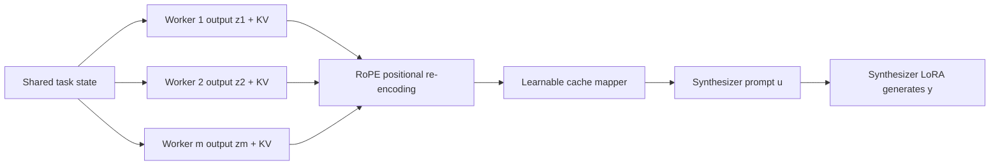
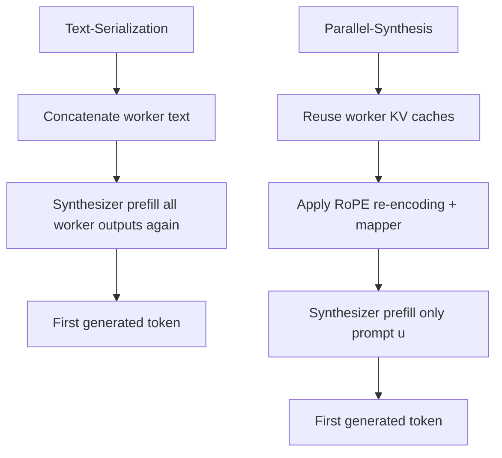

# Towards Direct Latent-Space Synthesis for Parallel Branches in LLM-Agent Workflows

## 元信息

| 字段 | 内容 |
| --- | --- |
| 原文 | [arXiv:2606.14672](https://arxiv.org/abs/2606.14672) |
| 标题 | Towards Direct Latent-Space Synthesis for Parallel Branches in LLM-Agent Workflows |
| 作者 | Shikun Liu, Mufei Li, Dongqi Fu, Haoyu Wang, Yinglong Xia, Hong Li, Hong Yan, Pan Li |
| 日期 | arXiv 提交于 2026-06-12；arXiv recent/HTML 页面在 2026-06-15 当前周列表展示 |
| 领域 | 大模型 Agent、KV cache 通信、并行分支合成、后训练 |
| 本文类型 | 论文深读 |

## TL;DR

- 这篇论文提出 **Parallel-Synthesis**：在并行 Agent workflow 里，最终 synthesizer 不再把多个 worker 的文本输出重新拼接进 prompt，而是直接消费这些 worker 生成输出时留下的 **KV cache**。
- 它处理的问题很具体：现代 Agent workflow 越来越像 DAG，多个分支会并行搜索、调用工具、生成候选答案，再由一个下游 Agent 合流；但 LLM 原生接口仍是单条顺序 token prefix。
- 方法由三块组成：**RoPE 位置重编码**把不同分支对齐到同一分叉点，**cache mapper**用轻量 MLP 对每层 K/V 做仿射校准，**synthesizer LoRA**让下游模型学会从非顺序 cache 中生成。
- 训练不是只靠一个 SFT 数据集：Track 1 用 WildChat、UltraChat、LMSYS、Toucan、DTA-Tool、FLAN、2Wiki 等数据建立并行 cache 读取能力；Track 2 用 BrowseComp 上的 text-serialization synthesizer 轨迹做蒸馏，补足复杂 Agent 合成里的判断与推理。
- 实验覆盖 9 个下游数据集：AIME 2024/2025、GSM8K、HumanEval-Plus、MBPP-Plus、GPQA、MedQA、GAIA、MARBLE Database。Parallel-Synthesis 在 7/9 个数据集上持平或超过 text serialization。
- 关键数字：AIME 2025 从 Text-Serialization 的 23.33 提到 46.67；GSM8K 从 92.80 到 94.69；GPQA 从 50.00 到 52.02；MARBLE Database 从 33/100 到 36/100。GAIA Level 1 和 Level 2 则略低于文本拼接。
- 效率证据同样重要：论文报告 TTFT 降低 **2.5x 到 11x**，原因是 synthesizer 避免重新 prefill worker 输出。
- 局限也很明确：它还没有证明能直接替代所有 Agent 框架里的文本通信，尤其是高度结构化、工具输出很细、证据必须逐字可审计的 workflow；GAIA 和 MBPP-Plus 的小幅落后也提醒我们，显式文本仍然有稳健性价值。

## 研究问题：Agent 已经是 DAG，LLM 接口仍是线性前缀

### 作者真正要拆的矛盾是什么？

论文的核心不是“怎样压缩 prompt”，而是指出一个接口错位：

- **workflow 形态**：复杂 Agent 任务常常先分叉，再合流。
- **LLM 形态**：自回归模型默认只理解一个线性 prefix。
- **工程惯例**：多个 worker 分支的输出被拼成文本，作为 synthesizer 的输入。
- **直接后果**：分支结构被抹平，worker 已经算过的内容又被 synthesizer prefill 一遍。

可以把这个矛盾写成一个合流点问题：

| 层面 | 并行 Agent workflow 想表达的结构 | 顺序 prompt 实际表达的结构 | 损失 |
| --- | --- | --- | --- |
| 拓扑 | 多个分支从同一任务状态展开 | 按任意顺序串成一条文本 | 分支独立性丢失 |
| 计算 | worker 已经处理并生成输出 | synthesizer 再次编码 worker 输出 | redundant prefill |
| 证据 | 每个分支有自己的上下文和轨迹 | 只剩序列化后的文本片段 | 局部状态被弱化 |
| 注意力 | 合流时应该比较、选择、整合 | 模型被迫读一个长上下文 | 可能出现位置偏置和干扰 |

### 为什么“让每个分支写摘要”不是根本解？

摘要当然能降低上下文长度，但作者认为它仍然没有改变通信接口：

- 摘要仍是自然语言文本。
- 摘要仍要被 synthesizer 重新 prefill。
- 摘要可能丢掉后续判断需要的中间推理、证据质量和分歧点。
- 摘要把“怎么合流”提前交给 worker，而不是交给最终 synthesizer。

这就引出了论文的问题：

> 下游 synthesizer 能否直接读取多个 worker 分支的 latent execution state，而不是读取 worker 输出文本？

这里的 latent state 具体指 **KV cache**。每个 worker 在生成输出段 `z_j` 时，会为每层 attention 留下键值状态。作者要问的是：这些状态能不能作为分支通信介质，传给合流 Agent。

## 问题形式化：同一批分支输出，两种通信接口

### 基本变量

论文把并行合流写成如下设置：

| 符号 | 含义 |
| --- | --- |
| `m` | 并行 worker 数量 |
| `f_theta` | 所有 Agent 共用的自回归 backbone |
| `c_j` | 第 `j` 个 worker 的上下文 |
| `c^sh` | worker 共享的任务前缀 |
| `c_j^br` | worker 自己的分支上下文 |
| `z_j` | worker 生成并传给 synthesizer 的输出段 |
| `u` | synthesizer 自己的指令或 prompt |
| `y` | synthesizer 最终生成的答案 |

上下文拆法是：

```text
c_j = c^sh ∘ c_j^br
```

这个拆法很关键，因为它把三类 workflow 都放进同一个框架：

- **单轮并行求解**：所有 worker 收到同一道数学题或代码题，差异只来自采样轨迹。
- **多轮轨迹 rollout**：每个 worker 从同一用户问题出发，但拥有不同工具调用、观察和中间消息。
- **子任务分解**：全局任务被拆成多个方向，每个 worker 处理一个独立子任务。

### Text-Serialization：现有基线

标准做法是把 worker 输出拼起来：

```text
x_text = u ∘ z_1 ∘ z_2 ∘ ... ∘ z_m
y_t ~ P_text(. | x_text ∘ y_<t)
```

这个公式表面简单，但隐藏了两个代价：

- worker 已经在生成 `z_j` 时处理过分支上下文。
- synthesizer 还要把 `z_1...z_m` 当成新文本再读一遍。

### Cache-Based Synthesis：论文要逼近的目标

worker 生成 `z_j` 时，得到每层 KV：

```text
KV_theta(z_j | c_j) = {(K_z,j^l, V_z,j^l)} for l = 1...L
```

synthesizer 只 prefill 自己的 `u`，然后把 worker cache 当作 past cache：

```text
K_syn^l = [K_z,1^l; ...; K_z,m^l; K_u^l]
V_syn^l = [V_z,1^l; ...; V_z,m^l; V_u^l]
```

目标不是创造一个完全不同的任务，而是让 cache route 近似 text route：

```text
P_kv(y | u, {KV_theta(z_j | c_j)}_j)
≈
P_text(y | u, z_1, ..., z_m)
```

这句话的含义是：**信息内容相同，通信介质不同**。如果 cache route 能逼近 text route，就可以保留 worker 已计算的状态，减少合流阶段的重复 prefill。

## 方法机制：Parallel-Synthesis 怎么让非顺序 cache 可读？

### 整体流水线

作者没有修改 worker 侧执行。worker 仍然正常生成输出，只是在结束后暴露输出段对应的 KV cache。所有改动集中在 synthesizer 侧：



三块组件各自回应一个失败点：

| 组件 | 解决的问题 | 直觉 |
| --- | --- | --- |
| Positional re-encoding | 每个分支 cache 的 RoPE 位置来自不同上下文 | 把分支都对齐到同一分叉点 |
| Cache mapper | 即使位置对齐，K/V 分布仍可能不适合合流读取 | 用轻量仿射变换校准每层 cache |
| Synthesizer LoRA | 预训练模型没学过从多个独立 cache 生成 | 给 synthesizer 一个只在并行合流时启用的适配器 |

### 位置重编码：把分支从“串行顺序”拉回“共同分叉点”

worker 输出 `z_j` 的第 `r` 个 token 原本位于：

```text
source_position = |c_j| + r
```

但合流时，作者希望每个分支都像从同一个 branching point 继续出来。令 `n` 是共享前缀之后的第一个位置，目标位置是：

```text
target_position = n + r
```

对 RoPE key 做旋转变换：

```text
k_tilde_z,j,r^l =
R(n + r) R(|c_j| + r)^(-1) k_z,j,r^l

v_tilde_z,j,r^l = v_z,j,r^l
```

变量解释：

| 变量 | 含义 |
| --- | --- |
| `R(.)` | RoPE 旋转算子 |
| `k_z,j,r^l` | 第 `j` 个 worker 输出第 `r` 个 token 在第 `l` 层的 key |
| `v_z,j,r^l` | 对应 value |
| `n` | 共享上下文后的分叉锚点 |
| `r` | 分支内部局部 token offset |

这个设计的意义不是“节省一点位置编号”，而是避免把分支顺序误认为语义顺序。假如把 worker 1、2、3 直接拼接，worker 3 的位置天然靠后；但在 DAG 语义里，它们都是从同一节点并行展开的证据。

### Cache mapper：用分支元数据预测 K/V 仿射校准

位置对齐后，cache 仍然来自不同 worker 前缀。作者因此再加入一个 MLP mapper。它读取 worker 元数据：

```text
s_j = (|z_j|, m)
```

然后为每层预测四组系数：

```text
alpha_K,j^l, beta_K,j^l, alpha_V,j^l, beta_V,j^l
```

映射公式是：

```text
K_hat_z,j^l =
alpha_K,j^l(s_j) ⊙ K_tilde_z,j^l + beta_K,j^l(s_j)

V_hat_z,j^l =
alpha_V,j^l(s_j) ⊙ V_tilde_z,j^l + beta_V,j^l(s_j)
```

这里 `⊙` 是逐元素乘法。这个 mapper 的角色可以理解成 cache-space 的“接口适配层”：

- 它不重新生成 worker 输出。
- 它不要求 worker 重跑。
- 它只在 synthesizer 消费 cache 前，按分支长度和分支数做轻量校准。

### Synthesizer LoRA：让模型学会读多分支 cache

作者强调 cache calibration alone is insufficient。原因很直接：

- 基座模型预训练时看到的是单个顺序 prefix。
- 并行合流时，模型要读多个独立 cache block。
- 这不是普通 KV cache continuation，而是一个新的输入接口。

所以他们训练 synthesizer-side LoRA，并让它和 cache mapper 联合优化。这个设计的工程优点是：

- worker 不需要改。
- backbone 主参数冻结。
- LoRA 只在 Parallel-Synthesis 路径启用。
- 同一个系统仍可保留普通 text route 作为 fallback。

## 训练设计：不是“直接接 cache 就能用”

### 训练目标

训练样本写成：

```text
(u, {(c_j, z_j)}_{j=1}^m, y*)
```

训练目标是 teacher-forced next-token loss：

```text
L_SFT =
- Σ_t log P_{theta,phi}(
  y*_t |
  u,
  { KV_hat_{theta,phi}(z_j | c_j) }_{j=1}^m,
  y*_<t
)
```

这里 `phi` 包括 cache mapper 和 synthesizer LoRA，`theta` 是冻结的 backbone。

### Track 1：广泛适配并行 cache 上下文

Track 1 不是单一任务，而是两类数据混合：

| 数据类型 | 数据集 | 构造方式 | 学到的能力 |
| --- | --- | --- | --- |
| continued-pretraining-style dialogue | WildChat、UltraChat、LMSYS-Chat | 最后一轮用户 query 是 `u`，前面多轮对话变成并行 cache，上一次 assistant response 是目标 | 稳定从非顺序 cache 继续生成 |
| explicit parallel-context SFT | Toucan、DTA-Tool、FLAN、2Wiki | 工具调用、few-shot exemplars、文档块变成多个分支 | 按指令读多个 parallel contexts 并回答 |

训练数据规模也说明作者不是只做小样例验证：

| 数据集 | 样本数 | 平均分支数 `m` | 平均 `z_j` 长度 |
| --- | ---: | ---: | ---: |
| WildChat | 206,788 | 4.77 | 471.79 |
| UltraChat | 140,520 | 2.72 | 380.39 |
| LMSYS-Chat | 175,635 | 4.42 | 234.08 |
| Toucan single-turn | 141,713 | 2.67 | 880.03 |
| Toucan multi-turn | 1,171 | 2.49 | 826.69 |
| DTA-Tool | 14,459 | 2.41 | 288.99 |
| FLAN | 33,351 | 4.16 | 95.96 |
| 2WikiMultiHopQA | 167,254 | 9.93 | 82.76 |
| BrowseComp text trajectory | 1,211 | 3.00 | 858.33 |

### Track 2：从 text-serialization 合成轨迹蒸馏

Track 1 让模型“读得懂 cache”，但复杂 Agent 合流还需要判断：

- 哪个 worker 的证据更可靠？
- worker 最终答案错了，但中间推理是否有可用片段？
- 多个工具轨迹冲突时，是否需要继续验证？
- 输出要不要服从目标 benchmark 的格式？

因此 Track 2 用 BrowseComp 构造三条 worker rollout，再用 text-serialization route 生成 teacher synthesis trajectory。过滤掉失败或低质量轨迹后，让 cache route 学着复现 teacher 的合成过程。

这个蒸馏设计有一个重要边界：它没有证明 cache route 天然更会推理，而是把 text route 中更稳健的 synthesis behavior 迁移到 cache route。也就是说，Parallel-Synthesis 的能力来自“接口改造 + 后训练”，不是只来自 KV cache 这个表示本身。

### 为什么要 checkpoint merging？

作者没有把 Track 1 再接着 Track 2 继续顺序微调，而是分别训练后做加权平均合并，默认 `lambda = 0.5`。论文给出的理由是：顺序 tuning 容易覆盖前一个 track 的能力。

消融表支持这个判断：

| 变体 | AIME 2024 | HumanEvalPlus | GPQA | GAIA L1 | MARBLE |
| --- | ---: | ---: | ---: | ---: | ---: |
| No training | 10.00 | 38.41 | 15.15 | 16/53 | 22/100 |
| Track 1 | 46.67 | 91.46 | 55.56 | 21/53 | 30/100 |
| Track 2 | 53.33 | 88.41 | 51.52 | 21/53 | 44/100 |
| Sequential Track 1+2 | 36.67 | 76.22 | 49.49 | 23/53 | 25/100 |
| Full merged model | 63.33 | 90.85 | 52.02 | 23/53 | 36/100 |

这个表的解读应当谨慎：

- Track 1 在 HumanEvalPlus、GPQA 上很强，说明广泛 parallel-context 适配有价值。
- Track 2 在 AIME 2024、MARBLE 上强，说明复杂合成和判断蒸馏有效。
- Sequential Track 1+2 多项下降，说明简单续训会遗忘。
- Full merged model 不在每一项都最高，但整体平衡最好。

## 实验设置：作者如何证明它不是只会快？

### 数据集覆盖

论文的 9 个 downstream benchmarks 分成四类：

| 类别 | 数据集 | worker 结构 |
| --- | --- | --- |
| 数学推理 | AIME 2024、AIME 2025、GSM8K | 3 个并行 worker 采样候选解 |
| 科学问答 | GPQA、MedQA | 3 个 worker 并行推理 |
| 代码生成 | HumanEval-Plus、MBPP-Plus | 3 个 worker 生成候选代码 |
| Agentic/tool-use | GAIA、MARBLE Database | GAIA 用并行工具轨迹；MARBLE 用 5 个 root-cause 子任务 worker |

所有任务都不和 post-training datasets 重叠。这个设置是论文证据链的关键：如果评测任务来自训练数据，Parallel-Synthesis 的泛化主张会弱很多。

### Baselines

作者比较了三类 baseline：

| baseline | 意义 |
| --- | --- |
| Single | 一个 worker 轨迹，检验并行是否有用 |
| Voting | 只聚合 final answers，检验是否只是多数投票 |
| Text-Serialization | 同样 worker 输出，但以文本拼接传给 synthesizer |
| APE / CacheBlend / KVLINK | RAG-style cache reuse 方法迁移到 Agent 合流 |

Voting baseline 很重要。因为如果 Parallel-Synthesis 只是读到最终答案并投票，它不算真正合成 worker 轨迹。论文在 8/9 个数据集上超过 Voting，说明它至少利用了 final answer 之外的信息。

## 主结果：哪些数字支持作者的主张？

### 普通 problem-solving 任务

| 方法 | AIME 2024 | AIME 2025 | GSM8K | HumanEval+ | MBPP+ | GPQA | MedQA |
| --- | ---: | ---: | ---: | ---: | ---: | ---: | ---: |
| Single | 23.33 | 13.33 | 92.42 | 84.15 | 76.19 | 31.31 | 82.72 |
| Voting | 30.00 | 20.00 | 92.20 | 89.63 | 79.37 | 48.99 | 83.74 |
| CacheBlend | 13.33 | 23.33 | 79.15 | 51.22 | 52.91 | 12.63 | 40.38 |
| APE | 6.67 | 10.00 | 49.66 | 36.59 | 52.91 | 10.10 | 17.05 |
| KVLINK | 50.00 | 40.00 | 92.72 | 87.80 | 78.31 | 35.35 | 67.05 |
| Text-Serialization | 63.33 | 23.33 | 92.80 | 90.24 | 81.75 | 50.00 | 82.72 |
| Parallel-Synthesis | 63.33 | 46.67 | 94.69 | 90.85 | 80.42 | 52.02 | 83.58 |

这张表支持三个判断：

- **数学和科学推理很受益**：AIME 2025、GSM8K、GPQA 都超过 text route。
- **代码生成接近但不稳定**：HumanEval+ 略高，MBPP+ 略低，说明显式代码文本仍然可能是更稳健载体。
- **RAG-style cache reuse 不能直接搬来**：APE 和 CacheBlend 多数任务明显落后，说明 Agent 分支 cache 不是普通文档 chunk cache。

### Agentic 任务

| 方法 | GAIA L1 | GAIA L2 | GAIA L3 | MARBLE Database |
| --- | ---: | ---: | ---: | ---: |
| Single | 14/53 | 18/86 | 1/26 | N/A |
| Voting | 19/53 | 16/86 | 1/26 | N/A |
| CacheBlend | 17/53 | 16/86 | 0/26 | 7/100 |
| APE | 20/53 | 13/86 | 2/26 | 18/100 |
| KVLINK | 20/53 | 20/86 | 1/26 | 10/100 |
| Text-Serialization | 24/53 | 22/86 | 2/26 | 33/100 |
| Parallel-Synthesis | 23/53 | 19/86 | 2/26 | 36/100 |

这张表比摘要更有信息量：

- GAIA L1/L2：Parallel-Synthesis 低于 text serialization，说明工具证据型任务里显式文本仍有优势。
- GAIA L3：两者都是 2/26，说明难题上还没有拉开。
- MARBLE：Parallel-Synthesis 超过 text route，说明数据库诊断这类多 root-cause 合成更适合从 worker 轨迹中抽取中间证据。

### 效率证据：TTFT 为什么能降？

TTFT 降低来自一个很具体的计算路径变化：



论文报告 Parallel-Synthesis 在 5 个数据集上 TTFT speedup 为 **2.5x 到 11x**。作者还把 cache transformation time 计入 Parallel-Synthesis latency，所以这个速度收益不是单纯漏算了 mapper 成本。

不过 TTFT 不是完整吞吐结论：

- 它衡量的是 first token latency，不等于完整生成时延。
- mapper 和 cache 搬运在不同部署系统中可能有额外工程成本。
- 如果 worker 输出非常短，收益会变小。
- 如果系统必须为审计保留显式文本，cache route 可能只是加速路径，而不是唯一通信路径。

## 消融与失败边界

### 模块消融：LoRA only 不够

论文报告 `Synthesizer LoRA only` 与 full merged model 的差异：

| 变体 | AIME 2024 | HumanEvalPlus | GPQA | GAIA L1 | MARBLE |
| --- | ---: | ---: | ---: | ---: | ---: |
| Synthesizer LoRA only | 60.00 | 88.41 | 40.40 | 22/53 | 35/100 |
| Full merged model | 63.33 | 90.85 | 52.02 | 23/53 | 36/100 |

差异最大的是 GPQA：40.40 到 52.02。这个结果说明 cache mapper 不是装饰项。对于科学问答这类需要细粒度证据整合的任务，K/V 的校准可能影响 synthesizer 是否能稳定读出分支里的关键线索。

### 传给 synthesizer 哪部分轨迹？

GAIA Level 1 的轨迹信息消融很有价值：

| 传递信息 | Parallel-Synthesis 正确数 | Text-Serialization 正确数 | Parallel-Synthesis TTFT | Text-Serialization TTFT |
| --- | ---: | ---: | ---: | ---: |
| final model output | 23/53 | 24/53 | 0.3769s | 1.0510s |
| each-turn model output | 18/53 | 22/53 | 0.3788s | 1.5053s |
| full trajectory | 26/53 | 26/53 | 0.6847s | 3.5383s |

这张表给了一个实际工程启示：

- 只传 final output 是最好的 accuracy-efficiency tradeoff。
- full trajectory 准确率更高，但 latency 上升。
- each-turn output 反而差，因为去掉 tool observations 后，模型看到的是碎片化、弱 grounding 的轨迹。

这也解释了为什么论文没有简单主张“越多 cache 越好”。Agent 合流的关键不是把所有内部状态塞给 synthesizer，而是传递足够 coherent 的分支单元。

### Case studies：它真的不只是投票吗？

附录里有三个 qualitative 证据方向：

| 案例 | 支撑的 claim | 关键含义 |
| --- | --- | --- |
| AIME 2024 | 没有多数正确答案时仍可合成正确答案 | synthesizer 能利用 worker 的中间因式分解证据 |
| GAIA video quote | 不新增 tool call，也能从 worker trace 中抽出正确短语 | cache route 可利用 prior tool evidence |
| GAIA insufficient evidence | 证据不足时可触发额外检索 | synthesizer 不只是被动压缩 worker 输出 |
| MARBLE Database | 数据库根因诊断能整合多 worker SQL 证据 | 适合多子任务证据合流 |

这些案例不能替代大规模结果，但能解释为什么 Voting baseline 不够。许多 Agent 任务里，worker 的最终答案可能错，但中间证据有用；真正的合流 Agent 应该读证据，而不是只数答案。

## Figure/Table 证据逐项解读

| 论文证据 | 支持什么 | 不能证明什么 |
| --- | --- | --- |
| Fig. 1 DAG workflow | 并行 worker + final synthesizer 是真实 Agent 形态 | 不证明 cache route 已适用于所有 DAG 编排器 |
| Fig. 2 pipeline | 方法包含位置重编码、mapper、LoRA、post-training | 不证明每个组件都独立必要，需看消融 |
| Table 1 problem-solving | 7 个普通任务里多数超过 text route | 不证明显式文本在代码/工具证据任务中可被完全替代 |
| Table 2 GAIA/MARBLE + TTFT | Agentic benchmark 上有质量与效率证据 | GAIA L1/L2 仍落后 text route |
| Table 3 checkpoint/module ablation | 后训练和 mapper 对最终性能关键 | 没有完全拆出 RoPE re-encoding 的独立贡献 |
| Table 4 trajectory information | final output/full trajectory tradeoff 清楚 | 不说明所有多轮 Agent 都应只传 final output |
| Table 5 training data stats | 训练覆盖多种并行上下文 | 数据质量、过滤规则、复现细节仍需代码公开支持 |

## 相关工作中的位置：它和 RAG cache reuse 不同在哪里？

作者专门区分了 RAG-style parallel encoding。这个区分值得保留：

| 维度 | RAG cache reuse | Parallel Agent synthesis |
| --- | --- | --- |
| cache 来源 | 静态文档 chunk | worker 在上下文中生成的输出 |
| `z_j` 语义 | 被切开的文档片段 | 分支答案、工具轨迹摘要、子任务结果 |
| 主要目标 | 检索并利用证据 | 比较、判断、整合多个 worker 进展 |
| 典型困难 | chunk 间依赖和 attention 校准 | 分支上下文不同、合流指令复杂 |
| 方法代表 | APE、CacheBlend、KVLINK | Parallel-Synthesis |

这个定位解释了为什么 APE/CacheBlend 在表格中掉得很厉害。它们处理的是“多个文档块怎么近似顺序 prefill”，而这篇论文处理的是“多个 Agent 轨迹怎么合成决策”。

## 结论与局限

### 逐层复盘：作者怎样让读者相信 cache route 不是捷径？

论文的说服路径其实很克制。它没有一开始就说“文本通信过时了”，而是先把问题限定在 **parallel-then-synthesize** 这一类 workflow。这个限定很重要，因为如果任务本来就是顺序执行，KV cache 复用只是在普通 decoding 里节省计算；只有在多个分支同时存在时，文本接口才会同时暴露两个问题：结构被线性化，计算被重复化。

可以把作者的论证拆成四个 claim：

| Claim | Mechanism | Evidence | Boundary |
| --- | --- | --- | --- |
| Agent 合流不是普通长上下文读取 | 用 `c^sh`、`c_j^br`、`z_j` 描述共享前缀和分支上下文 | 问题形式化覆盖单轮、多轮、子任务三种 workflow | 还没有覆盖动态生成/取消分支的复杂编排 |
| 直接拼接 cache 不可靠 | RoPE 位置重编码 + cache mapper + LoRA | No training、APE、CacheBlend 明显落后 | 未单独报告无位置重编码的完整消融 |
| 后训练能让 synthesizer 读懂分支 cache | Track 1 建立通用读取能力，Track 2 蒸馏合成判断 | merged checkpoint 在多类任务上平衡最好 | 训练数据构造和过滤规则仍决定上限 |
| cache route 能兼顾质量与速度 | 复用 worker KV，避免重新 prefill `z_j` | 7/9 数据集持平或更好，TTFT 2.5x-11x | GAIA、MBPP+ 说明文本证据仍有优势 |

这个表比单看主结果更能解释论文价值：作者没有把 Parallel-Synthesis 包装成所有任务的统一最优，而是把它放在一个“接口是否可以被训练出来”的研究问题里。换句话说，论文证明的是 **可训练的 latent 合流接口有希望**，不是证明所有 Agent 系统明天都该关掉文本通信。

### 为什么 GAIA 的小幅落后反而是重要信号？

GAIA Level 1 和 Level 2 里，Text-Serialization 分别是 24/53、22/86；Parallel-Synthesis 是 23/53、19/86。这个结果不应被轻描淡写。它说明在工具任务里，显式文本有三类优势：

- 工具返回通常是离散、可引用、可核查的证据。
- synthesizer 需要知道某条证据来自哪次搜索、哪个网页、哪个文件。
- benchmark 评测常常要求最终答案和原始证据字符串严格对齐。

KV cache 能保留 latent state，但不天然保留可审计 provenance。对于研究者来说，这正是下一步问题：如果 latent communication 要进入真实 Agent runtime，它必须和 trace、citation、tool observation、权限边界一起设计，而不能只当成底层加速技巧。

### 为什么 MARBLE 提升值得关注？

MARBLE Database 从 Text-Serialization 的 33/100 提到 Parallel-Synthesis 的 36/100。这个提升绝对值不大，但任务类型很有代表性：每个 worker 检查一个可能 root cause，例如插入大数据、锁竞争、冗余索引、vacuum 问题。最终 synthesizer 要做的是诊断式合流，而不是复制某个 worker 的答案。

这种任务更像真实运维 Agent：

- 每个分支都有自己的局部查询和观察。
- 最终答案通常是多证据汇总。
- 单个 worker 可能只看到局部异常。
- 合流时要区分“可疑迹象”和“根因证据”。

所以 MARBLE 的结果暗示：Parallel-Synthesis 可能更适合 **多假设诊断**、**多路径搜索**、**多候选推理** 这类任务，而不是所有工具问答任务。这个边界比“平均准确率提高”更有研究价值。

### 对复现者来说，最容易踩坑的地方

如果后续有人尝试复现或工程化，真正困难的部分可能不是公式，而是 runtime 细节：

- **cache extraction 粒度**：论文默认传递 worker 输出段 `z_j` 对应 KV；如果误传完整上下文或只传最后 token，语义会变。
- **RoPE anchor `n` 的选择**：不同 workflow 里共享前缀边界不同，分叉点识别错了会破坏位置对齐。
- **跨 batch/cache layout**：推理框架对 KV cache 的 layout、分页策略、量化格式并不统一。
- **LoRA 启用时机**：普通对话不应启用 parallel synthesizer adapter，否则可能影响常规生成行为。
- **文本 fallback**：当任务要求引用原文、输出代码、做安全审计时，显式文本路径仍应保留。

这些工程边界也解释了作者为什么说它是 plug-and-play synthesizer-side framework，而不是完整 Agent runtime 标准。论文把最难的科学问题先缩小到“同 backbone、同 tokenizer、同 worker 输出”的场景，这样实验才能隔离 communication interface 的影响。

### 我认为这篇论文最有价值的地方

- 它把 Agent workflow 的结构问题说得很清楚：不是所有上下文都应该被压成线性文本。
- 它给了一个可检验接口：同一批 worker 输出，比较 text route 和 cache route。
- 它没有只报 latency，而是同时看质量、Voting、RAG cache baseline、训练轨迹消融。
- 它把后训练放在核心位置，承认 base LLM 不会天然读非顺序 cache。

### 需要谨慎的地方

- **显式文本仍有强审计价值**：尤其在工具输出、代码、引用证据、合规审计里，cache 不能替代人类可读 trace。
- **GAIA 结果提醒边界**：复杂 tool-use 任务中，text serialization 仍然更稳，特别是 Level 1/2。
- **完整系统成本未完全展开**：跨进程、跨机器、跨模型服务传 KV cache 的工程成本可能很高。
- **worker 与 synthesizer 同 backbone 的假设较强**：现实 Agent 系统常混用不同模型、不同上下文窗口和不同推理服务。
- **可复现性还依赖实现公开**：论文给了公式、数据、配置，但真正复现需要 cache extraction、mapper、LoRA merge、benchmark prompt 的完整代码。

### 对 Agent 研究的后续问题

- 如果 Agent workflow 逐渐从 chain 变成 DAG，是否应该出现标准化的 latent branch interface？
- KV cache 能否带上 provenance，让 synthesizer 知道每段 cache 来自哪个工具、哪条证据、哪个失败边界？
- 是否可以同时保留两条通道：显式文本用于审计，KV cache 用于低延迟合流？
- 对不同模型之间的 branch cache，能否训练跨模型 mapper，而不是假设同一 backbone？
- 在安全场景中，latent cache communication 是否会引入新的 prompt injection 或数据泄露面？

## 一句话总结

Parallel-Synthesis 最重要的贡献不是“把 prompt 压短”，而是把并行 Agent 合流重新定义为一个 **latent interface learning** 问题：worker 已经计算出的分支状态不必总被翻译回文本再交给 synthesizer；只要位置、分布和生成行为经过训练校准，KV cache 可以成为 DAG 型 Agent workflow 的合流介质。不过，在工具证据、审计和跨模型部署上，它更像一个强研究原型，而不是已经可以无条件替换文本通信的工程标准。
