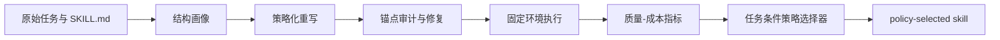

# What Should a Skill Remember?：把 Agent Skill 改写从“压缩提示词”改成“保留操作锚点”的成本工程

### 元信息

| 字段 | 内容 |
|---|---|
| 论文 | What Should a Skill Remember? Quality-Cost Trade-offs in Cost-Aware Skill Rewriting for Language Model Agents |
| 作者 | Qinghua Xing, Yinda Chen, Yaping Jin, Zhenhe Wu, Bohan Lin, Hang Zhou, Xinghao Chen, Hanting Chen, Zhiwei Xiong |
| 机构 | University of Science and Technology of China, Huawei Technologies, Tianjin University |
| 版本 | arXiv:2606.09421v2，2026-06-09 |
| 类型 | 大模型 Agent / Skill / 成本感知重写 / 论文 |
| 原文 | [arXiv](https://arxiv.org/abs/2606.09421) |
| 代码与结果 | [1Reminding/Skill_EE](https://github.com/1Reminding/Skill_EE) |

### TL;DR

- **这篇论文做什么**：研究 Agent 使用的 `SKILL.md` / procedural skill 应该“记住”什么，而不是简单问 skill 能不能更短。
- **核心问题**：短 skill 会减少直接输入 token，但如果删掉 API、公式、验证规则、恢复步骤等稀疏操作锚点，Agent 可能在执行时花更多 token 去试错、查错、重跑工具。
- **方法主张**：作者把 skill rewriting 定义成<u>成本感知的操作知识保留</u>，先分析 skill 结构，再用不同保留策略重写，最后用任务条件策略选择器为不同任务挑选保留方式。
- **实验设计**：在 SkillsBench 上只改 `environment/skills/` 下的 skill 文档，保持任务指令、环境和 verifier 不变；86 个可运行任务用于执行评估，其中 20 个任务作为 held-out 面板。
- **关键数字**：主 held-out 设置中，policy-selected rewrite 的总成本比 `rho=0.93`，下游 Agent token 比 `ra=0.94`，对应总成本降低 7.0%、下游执行 token 降低 6.0%，Verifier partial 由原始 skill 的 0.815 到 0.819。
- **跨模型证据**：冻结同一个策略迁移到 Gemini Pro、Codex + GPT-5.4、Claude Code + Opus 4.6 后，总成本比落在 0.83 到 0.93；Codex 设置中 partial 为 0.862，`rho=0.83`，下游 token 下降 16%。
- **最重要的反直觉**：workflow guarding 虽然把 skill 写短了，但主 held-out 中下游 Agent token 变成原始基线的 1.14 倍，总成本反而到 `rho=1.11`。
- **局限**：实验只覆盖文本 skill、固定任务环境和 token 成本；没有覆盖动态检索资源、持续更新 skill、延迟、缓存、供应商价格、人审成本或安全关键场景。

### 1. 这篇论文真正改写了哪个问题？

作者反对的不是“压缩 skill”，而是把 skill rewriting 等同于 prompt compression。

- 在普通 prompt 压缩里，主要目标通常是：
  - 保留语义；
  - 缩短上下文；
  - 降低输入成本；
  - 尽量不影响回答质量。
- 在 Agent skill 里，文本不是普通上下文，而是执行手册：
  - 它可能包含一个 API constructor；
  - 也可能包含 CLI flag；
  - 也可能包含校验阈值；
  - 还可能包含失败恢复规则、文件格式约定、公式和 tie-breaking convention。

这意味着 skill 的价值并不均匀分布在每一句话里。

| 文本类型 | 普通压缩视角 | Agent skill 视角 |
|---|---|---|
| 背景解释 | 可删减 | 可删减，但要看是否解释了失败边界 |
| API 调用样例 | 可能被当成细节 | 往往是防止 Agent 乱试 API 的锚点 |
| 验证步骤 | 可能被概括 | 常常决定能否通过 verifier |
| 公式 / schema | 可被自然语言改写 | 很可能必须逐项保留 |
| 错误处理 | 可被摘要 | 直接影响重跑、调试和恢复成本 |

因此，论文的问题不是：

> 怎样让 skill 更短？

而是：

> 在降低总执行成本的同时，skill 必须保留哪些操作锚点？

这个问题的重要性在于：Agent 的真实成本不是输入 skill 的 token 数，而是 **skill token + 执行轨迹 token + 调试和恢复 token**。

### 2. 作者的论证路线：claim -> mechanism -> evidence -> boundary

| 层次 | 论文怎么说服读者 | 关键证据 |
|---|---|---|
| Claim | skill rewriting 是成本感知知识保留，不是统一压缩 | workflow guarding 变短却让下游 token 上升 |
| Mechanism | 不同任务依赖不同操作锚点 | API/code、rule/formula、workflow 三类策略表现不同 |
| Evidence | SkillsBench 上固定任务、环境、verifier，只改 skill | held-out 20 任务 + cross-model 86 任务 |
| Boundary | 只衡量 token 成本，且环境固定 | 不覆盖动态资源、延迟、缓存、人审和高风险部署 |

这条路线很清楚：

1. 先说明 skill 与普通 prompt 的差异；
2. 再定义可观测的成本指标；
3. 接着构造可控实验，只让 skill 文档变化；
4. 然后比较固定策略与 learned selector；
5. 最后用消融说明哪些组件真的必要。

### 3. 方法机制：先画像，再重写，再学习选择策略

论文的 pipeline 可以拆成四步。



#### 3.1 结构画像记录什么？

作者为每个 task-skill pair 提取结构特征。

| 特征 | 研究意义 |
|---|---|
| skill count | 判断任务需要单一说明还是多个模块协作 |
| total skill tokens | 估计直接输入成本 |
| code-token ratio | 判断是否需要保留代码/API 锚点 |
| API/tool usage | 判断 Agent 是否容易因接口细节缺失而试错 |
| examples | 判断示例是否承担执行模板功能 |
| validation rules | 判断 verifier 前是否需要显式检查 |
| constraints | 判断是否存在不能违反的业务或格式边界 |
| formulas | 判断是否需要 rule/formula anchoring |
| dominant archetype | 为策略选择器提供任务族信号 |

这里的重点不是“画像越全越好”，而是要让策略选择器看到：哪些文本结构可能影响执行经济性。

#### 3.2 三类最终策略保留什么？

论文保留了三个 final policy arms。

| 策略 | 保留锚点 | 适合任务 | 可能风险 |
|---|---|---|---|
| API/code anchoring | imports、API calls、object construction、commands、minimal snippets | 代码、工具、文件操作、接口调用 | 可能保留较多 token，压缩率不一定最高 |
| Rule/formula anchoring | equations、schemas、units、thresholds、invariants | 科学计算、优化、规则密集任务 | 对 implementation-heavy task 可能删掉执行流程 |
| Workflow guarding | ordered procedures、validation checks、pitfalls、recovery cues | 多步流程、校验重、容易漏步骤的任务 | 如果只保留流程而丢接口细节，执行 token 可能上涨 |

`source_native_compact` 没进入最终 policy arms，只作为诊断策略保留。作者给出的理由是 pilot run 中有效性和质量较弱。

#### 3.3 锚点审计和修复为什么重要？

重写不是让模型自由总结。

作者在生成后做轻量检查：

- token ratio 是否落在目标区间；
- code/API terms 是否覆盖；
- code block 是否被保留；
- protected anchors 是否缺失；
- 缺失时用 source-derived anchor block 修复。

这一步在消融里很关键：去掉 anchor repair 后，partial 从 full policy 的 0.819 降到 0.776，QR 从 1.01 降到 0.95。

换句话说：

- 策略选择器决定“该保留哪类锚点”；
- 审计修复保证“这类锚点真的没被删掉”。

### 4. 公式：论文怎样把质量和成本放进同一个问题？

作者把一个任务记为 `tau`，一个 skill condition / strategy 记为 `a`，原始 skill baseline 记为 `a=0`。

#### 4.1 基本变量

| 符号 | 含义 |
|---|---|
| `q_tau^a` | verifier score |
| `C_skill,tau^a` | 直接 skill-token cost |
| `C_agent,tau^a` | 下游 Agent 执行 token cost |
| `C_tau^a` | 总成本，等于 skill cost + agent cost |

公式块：

```text
C_tau^a = C_skill,tau^a + C_agent,tau^a
```

#### 4.2 质量保持与总成本比

作者使用两个核心归一化指标：

```text
QR_tau^a = q_tau^a / max(q_tau^0, epsilon)

rho_tau^a = C_tau^a / max(C_tau^0, epsilon)
```

解释：

- `QR > 1`：重写后 verifier 质量高于原始 skill；
- `QR < 1`：重写后质量下降；
- `rho < 1`：总 token 成本低于原始 skill；
- `rho > 1`：总 token 成本高于原始 skill。

#### 4.3 下游执行膨胀和近无损红利

论文还特别看下游执行是否变贵：

```text
Delta_tau^a = r_agent,tau^a - 1
EO_tau^a = max(0, Delta_tau^a)
```

这里 `EO` 是 execution overrun。

它惩罚的不是 skill 本身长，而是“skill 被改短以后，Agent 执行阶段反而更啰嗦、更迷路、更爱重试”。

近无损红利 `NLD` 则强调：

```text
NLD_tau^a = I[QR_tau^a >= 1 - delta] * max(0, 1 - rho_tau^a)
```

这表示只有质量接近无损时，成本下降才算真正有价值。

### 5. 实验设置：为什么这个设计能隔离 skill 的作用？

论文在 SkillsBench 上做实验，但它没有让所有东西一起变化。

| 部分 | 是否改变 | 作用 |
|---|---|---|
| task instruction | 不变 | 防止任务描述变化带来混淆 |
| execution environment | 不变 | 防止工具和文件环境变化带来混淆 |
| verifier | 不变 | 保证质量信号可比 |
| `environment/skills/` | 改变 | 这是唯一主要实验变量 |
| agent stack | 主实验固定，迁移实验改变 | 检验策略是否跨 Agent 泛化 |

数据切分如下。

| Stage | Tasks | 用途 |
|---|---:|---|
| Corpus profiling | 88 | 只做静态 skill 结构画像 |
| Runnable pool | 86 | 通过环境和 verifier 检查，可执行 |
| Template calibration | 28 | 比较固定策略，调 rewrite prompt |
| Policy adaptation | 38 | 学习任务条件策略选择器 |
| Held-out evaluation | 20 | 冻结策略后的主测试面板 |
| Cross-model transfer | 86 | 冻结策略跨 Agent stack 迁移 |

这个设置的好处：

- 可以把结果归因到 skill 文档结构；
- 可以避免 held-out 任务泄漏到最终评估；
- 可以区分“固定模板是否好”和“选择器是否会选”；
- 可以看策略在 Codex、Claude Code 等不同 harness 上是否仍有用。

### 6. 主结果：短不是目标，成本-质量 frontier 才是目标

官方仓库的 `main_results.csv` 给出核心结果。

| Setting | Condition | Valid | Partial | QR | skill cost `rs` | agent cost `ra` | total `rho` | Delta | NLD |
|---|---|---:|---:|---:|---:|---:|---:|---:|---:|
| Held-out 20 / Gemini Flash | original | 18/20 | 0.815 | 1.00 | 1.00 | 1.00 | 1.00 | 0.00 | 0.00 |
| Held-out 20 / Gemini Flash | API/code | 17/20 | 0.792 | 0.97 | 0.60 | 0.96 | 0.94 | -0.04 | 0.04 |
| Held-out 20 / Gemini Flash | rule/formula | 19/20 | 0.555 | 0.68 | 0.65 | 0.94 | 0.92 | -0.06 | 0.00 |
| Held-out 20 / Gemini Flash | workflow | 19/20 | 0.731 | 0.90 | 0.58 | 1.14 | 1.11 | +0.14 | 0.00 |
| Held-out 20 / Gemini Flash | policy-selected | 19/20 | 0.819 | 1.01 | 0.62 | 0.94 | 0.93 | -0.06 | 0.07 |

可以读出四个结论。

1. **API/code anchoring 是强 baseline**：
   - skill cost 降到 0.60；
   - downstream cost 降到 0.96；
   - total cost 降到 0.94；
   - 但 partial 从 0.815 降到 0.792。

2. **Rule/formula anchoring 很省，但泛用会伤质量**：
   - total cost 是 0.92；
   - 但 partial 只有 0.555；
   - QR 只有 0.68。

3. **Workflow guarding 展示了“短 skill 变贵”的失败模式**：
   - skill cost 降到 0.58；
   - downstream agent cost 却升到 1.14；
   - 总成本到 1.11。

4. **Policy-selected 不是最短，但 frontier 最好**：
   - partial 0.819，高于 original 的 0.815；
   - total cost 0.93；
   - downstream cost 0.94；
   - NLD 为 0.07，是主表中最符合“近无损省成本”的方案。


这张图对应论文 Appendix C 的 held-out token 诊断：policy-selected rewriting 把 direct skill tokens 从 45.7K 降到 28.2K，把 downstream API tokens 从 720.1K 降到 680.2K，总 token 从 765.8K 降到 708.4K，同时 mean partial 略升。

### 7. 图表证据：Figure 3 为什么是全文最关键的图？


Figure 3 的意义不是展示“哪个柱子最低”，而是把成本转移拆开。

| 现象 | 解释 |
|---|---|
| API/code anchoring 同时降低 skill tokens 和 agent tokens | 保留接口、命令、构造方式，减少 Agent 后续摸索 |
| Workflow guarding skill 更短 | 流程文本可压缩，所以直接输入下降明显 |
| Workflow guarding 下游 token 上升 | 流程被保留，但执行细节不足，Agent 需要更多试错 |
| Rule/formula anchoring 成本低但质量掉 | 公式和规则保留了，但实现型任务缺少操作路径 |

这正是论文标题“skill should remember what”的答案：

- 如果任务需要 API，就记 API；
- 如果任务需要公式，就记公式；
- 如果任务容易漏步骤，就记 workflow；
- 如果不知道任务是哪类，就不要套一个固定压缩模板。

### 8. 跨模型迁移：为什么 Codex 行特别值得看？

作者把 frozen policy 迁移到其他 Agent stack，不重新调 prompt、utility weights 或策略。

| Agent stack | Partial | QR | total `rho` | downstream Delta | NLD |
|---|---:|---:|---:|---:|---:|
| Gemini Flash | 0.819 | 1.01 | 0.93 | -0.06 | 0.07 |
| Gemini Pro | 0.822 | 1.04 | 0.87 | -0.12 | 0.12 |
| Codex + GPT-5.4 | 0.862 | 1.03 | 0.83 | -0.16 | 0.16 |
| Claude Code + Opus 4.6 | 0.874 | 1.03 | 0.86 | -0.13 | 0.14 |

Codex 这一行特别有信息量：

- 它是代码和文件编辑型 Agent stack；
- policy-selected 的 partial 达到 0.862；
- total cost ratio 是 0.83；
- downstream agent-token change 是 -0.16；
- 说明对代码型 Agent，保留 API/code 锚点不是“多写细节”，而是降低执行试错的一种方式。

但这个结果也要谨慎读：

- cross-model transfer 用的是 86 个 runnable tasks；
- 其中部分任务曾用于 calibration 或 adaptation；
- 因此它更像 robustness evidence，而不是严格 held-out 结论。

### 9. 消融：哪些组件真的在工作？

`ablation_and_transfer.csv` 给出主 held-out 设置下的消融。

| Variant | Partial | QR | rho | Delta | NLD | 解读 |
|---|---:|---:|---:|---:|---:|---|
| Full policy | 0.819 | 1.01 | 0.93 | -0.06 | 0.07 | 质量略升，总成本下降 |
| Quality-only | 0.826 | 1.02 | 1.03 | +0.08 | 0.01 | 质量高一点，但下游执行变贵 |
| No overrun penalty | 0.817 | 1.00 | 0.99 | +0.03 | 0.02 | 没有惩罚下游膨胀，成本优势基本消失 |
| No NLD bonus | 0.802 | 0.98 | 0.91 | -0.07 | 0.03 | 更省，但质量保持变弱 |
| No anchor repair | 0.776 | 0.95 | 0.92 | -0.05 | 0.02 | 删掉关键锚点会伤任务质量 |
| Fixed API/code | 0.792 | 0.97 | 0.94 | -0.04 | 0.04 | 强 baseline，但不如按任务选择 |

最值得关注的是两个对照。

#### 9.1 Quality-only 为什么不够？

Quality-only partial 是 0.826，比 full policy 的 0.819 更高。

但它的 `rho=1.03`，`Delta=+0.08`。

这说明：

- 只追 verifier 分数会保留或生成更多会导致执行膨胀的内容；
- 或者它会选中让 Agent 更有把握但更啰嗦的重写；
- 对自动化 Agent 来说，质量不是唯一目标，稳定的执行成本也必须进入 objective。

#### 9.2 No anchor repair 为什么掉得最明显？

No anchor repair 的 partial 是 0.776，是表中最大的质量下降。

这说明策略名本身不够。

- 选择 API/code anchoring 不代表模型真的保留了 API；
- 选择 rule/formula anchoring 不代表公式没有被自然语言稀释；
- 选择 workflow guarding 不代表恢复路径没有被删掉。

所以 anchor repair 是从“想保留”到“确实保留”的桥。

### 10. 失败案例：论文没有回避边界

Appendix 里有一个重要失败例子：`r2r-mpc-control`。

作者指出，policy rewrite 保留了 Riccati recursion 和 MPC loop，但压缩了数学上下文；这些上下文对稳定控制设计似乎仍然必要。

结果是：

- quality 从 1.000 降到 0.667；
- total cost 上升到 baseline 的 1.114。

这个例子很关键，因为它提醒我们：

- 公式本身不是全部；
- 推导语境、变量含义、稳定性条件也可能是操作锚点；
- “保留公式”不等于“保留足够的工程可执行知识”。

对于科学计算、控制、优化、医疗、法律这类任务，skill 的“背景解释”有时并不是背景，而是防止错误迁移的约束条件。

### 11. 与相关工作的关系：它接在 SkillsBench 之后，但问了更细的问题

SkillsBench 的结论是：curated skills 能显著帮助 Agent，但效果不稳定。

公开摘要给出的几个关键点：

- SkillsBench 覆盖 86 个任务和 11 个领域；
- curated skills 平均提升 pass rate 16.2 个百分点；
- 不同领域差异很大；
- 16/84 个任务出现负向 delta；
- self-generated skills 平均没有收益。

这篇论文接着问：

> 如果 curated skills 有用但不稳定，那么 skill 内部到底哪些结构有用？

Anthropic 的 Agent Skills 和 OpenAI 的 ChatGPT Skills 则说明另一侧背景：

- skill 已经从研究概念变成产品接口；
- 它通常以文件夹、说明、示例、脚本、资源的形式存在；
- Agent 会在需要时加载一个或多个 skill。

因此，这篇论文的价值不是提出“要用 skill”，而是提出：

- skill 写法需要评估；
- skill 重写需要按任务保留锚点；
- skill 维护不能只看文件长度；
- skill 版本演进需要有质量-成本回归测试。

### 12. 对 Agent 系统的研究启发

这篇论文对 Agent 研究有三个直接启发。

#### 12.1 Skill 是一种可测试的操作知识资产

过去很多团队把 skill 当成文档。

这篇论文更接近把 skill 当成：

- 可 profile 的结构对象；
- 可 rewrite 的策略对象；
- 可 audit 的知识对象；
- 可通过 verifier 回归的执行对象。

这会改变维护方式。

| 传统维护 | 成本感知维护 |
|---|---|
| 人觉得太长就删 | 用 execution trace 看删掉后是否更贵 |
| 只看 prompt token | 同时看 direct skill tokens 和 downstream tokens |
| 统一模板化 | 按任务族选择保留锚点 |
| 靠人工 review | 加 anchor audit、verifier、回归指标 |

#### 12.2 Agent memory / skill compression 不能只优化语义相似度

如果一个 compression 方法只看语义相似度，它可能会保留“解释得差不多”的文字，却删掉：

- `--flag`；
- `import`；
- exact schema；
- threshold；
- exception branch；
- verifier 前置检查。

这些 token 很少，但执行价值很高。

因此，Agent memory 和 skill compression 需要从“语义摘要”转向“行动约束保留”。

#### 12.3 未来 benchmark 要纳入轨迹成本

只看 pass/fail 会漏掉一个重要现象：

- 两个 skill 都能通过 verifier；
- 一个让 Agent 一步到位；
- 另一个让 Agent 反复试错、读文件、跑测试、修 bug；
- 两者在 pass rate 上一样，在成本和稳定性上完全不同。

这篇论文把 downstream token 纳入指标，是一个更接近生产 Agent 的评价方向。

### 13. 可以继续追问的问题

- **动态 skill 怎么办**：论文固定 skill 文本，但真实 Agent 可能持续生成、合并、废弃 skill。
- **检索式 skill 怎么办**：如果 skill 是按需检索片段，锚点保留要和 retriever 一起优化。
- **安全约束怎么算成本**：安全规则被删掉可能短期降低 token，却增加外部风险；这不能只用 verifier score 衡量。
- **多 Agent 协作怎么算**：一个 skill 的缺失可能不在当前 Agent 暴露，而在下游 Agent 或 reviewer 暴露。
- **人审成本怎么计入**：高风险任务里，清晰的 skill 也许会增加 prompt token，却减少人类审计成本。
- **缓存和价格变化怎么办**：论文承认 token cost 是清晰可复现指标，但真实部署还受缓存、延迟、供应商价格影响。

### 14. 结论

这篇论文最有价值的地方，是把一个很容易被误解的问题重新表述了。

不是：

> skill 太长，压短一点。

而是：

> skill 是 Agent 的操作知识；改写它时，要保留能减少执行试错、调试和恢复的锚点。

主实验说明 policy-selected rewriting 可以在 held-out 面板上保持 verifier 质量并降低总成本；固定模板对照说明“更短”不等于“更便宜”；消融说明 overrun penalty、NLD 和 anchor repair 分别承担了不同约束。

从研究者视角看，这篇论文把 Agent skill 从经验工程推进到可度量的知识工程。

它没有解决所有问题，但给出了一个很实用的判断标准：

> 一个好 skill 不是包含最多信息，也不是包含最少 token，而是把 Agent 执行中最贵、最容易错、最难恢复的操作锚点留下来。

### 参考链接

- [arXiv:2606.09421](https://arxiv.org/abs/2606.09421)
- [论文 HTML 版本](https://arxiv.org/html/2606.09421v2)
- [官方代码与结果仓库 1Reminding/Skill_EE](https://github.com/1Reminding/Skill_EE)
- [SkillsBench: Benchmarking How Well Agent Skills Work Across Diverse Tasks](https://arxiv.org/abs/2602.12670)
- [Anthropic: Equipping agents for the real world with Agent Skills](https://www.anthropic.com/engineering/equipping-agents-for-the-real-world-with-agent-skills)
- [OpenAI Help: Skills in ChatGPT](https://help.openai.com/en/articles/20001066-skills-in-chatgpt)
