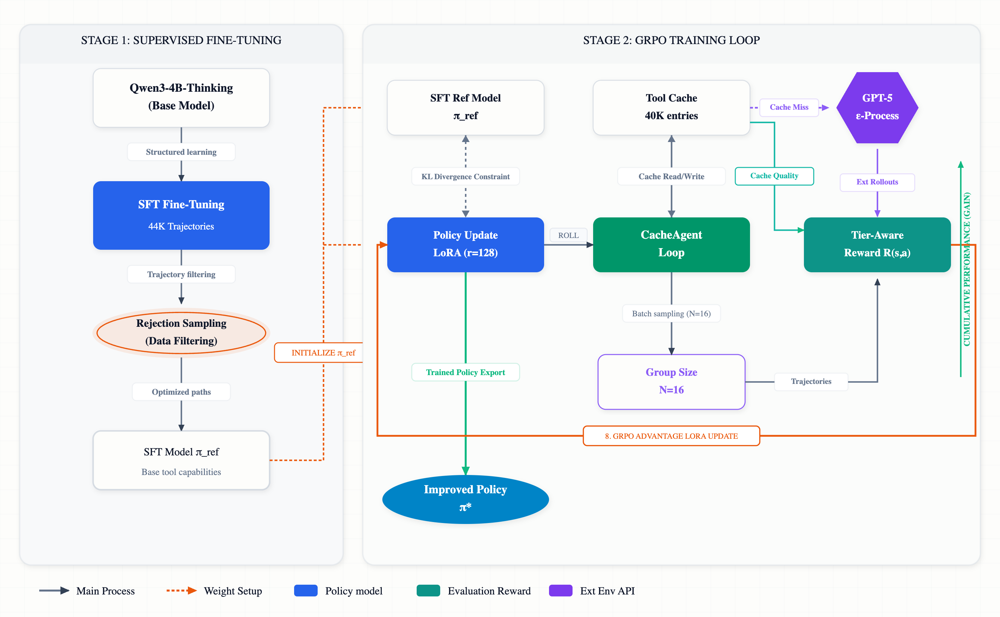
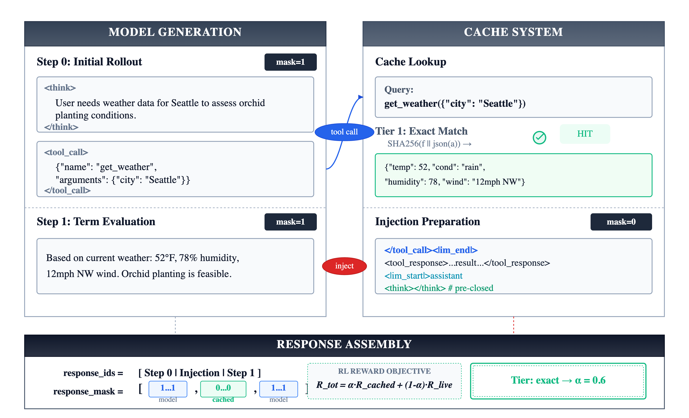
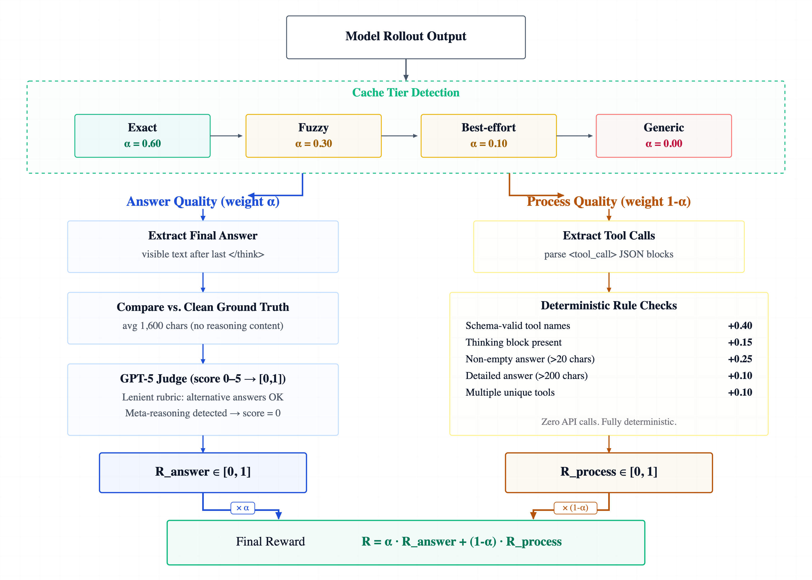
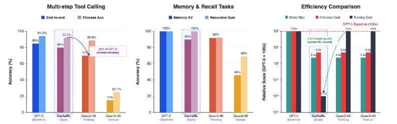

# CacheRL：用缓存 rollout 和分层奖励训练小型多轮工具调用 Agent

### 元信息

| 字段 | 内容 |
|---|---|
| 论文 | CacheRL: Multi-Turn Tool-Calling Agents via Cached Rollouts and Hybrid Reward |
| 作者 | Md Amirul Islam, Sumiran Thakur, Huancheng Chen, Su Min Park, Jiayun Wang, Gyuhak Kim |
| 机构 | Center for Advanced AI, Accenture |
| arXiv | https://arxiv.org/abs/2606.14179 |
| 版本信息 | arXiv v1 提交于 2026-06-12；arXiv cs.CL new 列表在 2026-06-15 当前批次收录 |
| 分类 | 大模型后训练；工具调用 Agent；小模型知识迁移 |

### TL;DR

- **这篇论文要解决的问题**：小模型已经能做推理，但要在多轮任务里稳定调用工具，还要同时处理工具 schema、上下文记忆、工具结果、最终回答；如果直接做 RL，在线执行工具的成本、延迟和副作用会把训练推到不可用。
- **CacheRL 的做法**：先用 GPT-5 给真实工具调用轨迹补上因果式 `<think>` 推理，形成 44,449 条思维轨迹；再用 Qwen3-4B-Thinking 做 SFT；最后在 RL 阶段用 `CacheAgentLoop` 从缓存注入工具结果，用三层缓存匹配和缓存层级感知奖励避免模型因缓存噪声被错误惩罚。
- **关键证据**：论文报告 CacheRL 在多步工具调用上达到 **92% process accuracy**，接近 GPT-5 的 **94%**；验证奖励从 **0.432** 逐步提升到 **0.779**；去掉 GPT-5 reasoning 会下降 **41.2%**，去掉缓存层级奖励会下降 **17.2%**。
- **最有价值的发现**：RL 在这个设置里主要提供稳定训练和轻微打磨，SFT 数据质量、缓存保真度、奖励归因比更复杂的优化算法更关键；论文甚至给出 `w/o GRPO` 只下降 **3.0%** 的消融。
- **主要局限**：缓存 rollout 的上限由缓存覆盖率决定；约一半 rollout 不是 exact cache match；GPT-5 同时当教师和 judge 会引入成本与偏差；`<think>` 带来 2-3 倍推理延迟；真实开放工具环境的泛化仍未被充分证明。

### 研究问题：为什么多轮工具调用后训练难？

- **单轮工具调用不等于 Agent 后训练**：
  - 单轮任务通常只要求模型选对一个函数和参数。
  - 多轮任务要求模型在观察结果后继续决策。
  - 失败可能发生在工具选择、参数、结果解释、状态记忆和最终回答任何一步。

- **传统 RL 的核心瓶颈不是算法名字，而是环境交互**：
  - 每次 rollout 可能触发多个 API 或工具。
  - 工具调用有真实费用、秒级延迟和潜在副作用。
  - GRPO 这类方法需要每个 prompt 多个 rollout，成本随训练步数乘法放大。

- **离线训练又缺少真实反馈链**：
  - 只让模型模仿历史 transcript，无法训练它在自己生成的工具调用之后如何恢复。
  - 只生成最终答案，无法训练中间工具选择的信用分配。
  - 只看 answer reward，会把缓存或环境噪声误判成模型错误。

### 论文主张与论证路线

| Claim | Mechanism | Evidence | Boundary |
|---|---|---|---|
| 小模型能学会多轮工具调用 | 用 GPT-5 给真实轨迹补因果推理，再 SFT Qwen3-4B-Thinking | 44,449 条轨迹、1,185 个工具、平均 5 次工具调用、平均 487 个 thinking tokens | 依赖教师模型质量，不能保证学生超过教师 |
| 多轮 RL 可以不用在线执行工具 | CacheAgentLoop 在生成到工具调用边界后查缓存并注入结果 | 缓存含 40,850 个 exact entries；rollout 成本从在线执行降到缓存读取 | 非 exact 匹配仍有系统性噪声 |
| 奖励必须知道缓存质量 | 按最差 cache tier 调整 answer reward 与 process reward 权重 | exact/fuzzy/best-effort 占比约 50%/17%/33%；去掉 tier-aware reward 下降 17.2% | 这仍不是 live environment reward |
| 数据质量比复杂 RL 更重要 | rejection sampling、combined SFT data、GPT-5 reasoning 是最大增益来源 | `w/o GPT-5 reasoning` 下降 41.2%；`w/o GRPO` 只下降 3.0% | 消融在作者自建数据与评测上完成，外部复现仍缺 |

### 方法全景：两阶段训练加一个缓存环境



图 3 给出的系统结构可以拆成三条线：

- **Stage 1：知识迁移**
  - 输入是已有工具调用轨迹。
  - GPT-5 不重新创造所有轨迹，而是给已有 assistant turn 补上因果推理。
  - Qwen3-4B-Thinking 用这些增强轨迹做 full fine-tuning。

- **Stage 2：缓存 RL**
  - SFT 模型在 VERL + vLLM 环境里做 GRPO。
  - 模型生成 `<think>` 和 `<tool_call>`。
  - 训练循环不执行真实工具，而是从 ToolResultCache 取结果。

- **Reward：缓存层级感知**
  - exact cache match 时，最终答案可信，可以多看 answer quality。
  - fuzzy 或 best-effort 时，工具结果可能错，应该更多奖励过程质量。
  - 这样可以把“模型调用错工具”和“缓存返回不完美结果”区分开。


### 知识迁移：不是生成更多数据，而是补上“为什么”

论文第三节的重点是：已有工具调用数据通常只告诉模型 **what tool to call**，但不告诉它 **why this tool now**。

- **输入轨迹的结构问题**：
  - 有 tool call 和 tool result。
  - 有用户任务和最终回答。
  - 缺少每一步工具选择背后的因果解释。

- **作者没有直接合成全新任务**：
  - 直接合成会丢掉真实工具交互的多样性。
  - 原始轨迹覆盖 1,185 个 unique tools。
  - 保留原始 tool call/result 可以避免把训练变成过度简化的玩具环境。

- **GPT-5 的角色是“推理补全器”**：
  - 对 user-facing message，生成新的因果推理。
  - 对已有分析内容，直接包进 `<think>`，减少无意义调用。
  - 对 final turn，总是生成完整推理，保证最终答案也有解释链。

| 轨迹片段类型 | 处理方式 | 设计目的 |
|---|---|---|
| User-facing content | 生成新的 `<think>` | 解释为什么需要下一步工具 |
| Analytical reasoning | 包裹已有分析 | 保留真实推理并节省 15-20% API 调用 |
| Final answer turn | 总是生成推理 | 让最终综合不是黑箱答案 |
| Tool calls/results | 原样保留 | 保持工具交互真实性 |

### CacheAgentLoop：把工具执行替换成可训练的缓存环境



CacheAgentLoop 的关键，不是简单查表，而是把 **模型生成 token** 和 **环境注入 token** 在训练图里分开。

公式化看，论文把一个轨迹写成：

```text
tau = (s_1, o_1, s_2, o_2, ..., s_n)
```

- `s_i`：模型生成片段，包括 reasoning、tool call 或 final answer。
- `o_i`：环境反馈，即工具结果。
- `m_i = 1`：模型自己生成的 token，可以回传梯度。
- `m_i = 0`：缓存注入的工具结果，不应被模型当成自己生成内容优化。

训练目标是：

```text
max_theta E_{tau ~ pi_theta}[R(tau)] - beta * KL(pi_theta || pi_ref)
```

变量解释：

- `pi_theta`：当前训练中的 Agent policy。
- `pi_ref`：SFT baseline 或 reference policy。
- `R(tau)`：缓存层级感知奖励。
- `beta = 0.15`：论文使用较强 KL 正则，避免多轮 RL 崩掉。

### CacheAgentLoop 伪代码

```text
Input:
  prompt p
  policy pi_theta
  cache C
  max rollout length T

State:
  context c = tokenize(p)
  trajectory tau = []
  token mask m = []
  worst_cache_tier = exact

Loop:
  for t in 1..T:
    x_t = pi_theta.generate(c)
    append x_t to tau with mask=1

    if x_t contains final answer:
      break

    if x_t contains tool_call:
      tool_name, args = parse(x_t)
      result, tier = C.lookup(tool_name, args)
      worst_cache_tier = min_quality(worst_cache_tier, tier)
      injected = preclose_think_and_wrap_tool_result(result)
      append injected to tau with mask=0
      c = c + tokenize(injected)

    else:
      break or continue according to termination rules

Output:
  trajectory tau
  masks m
  worst_cache_tier
```

这个伪代码对应论文图 4 的两个细节：

- **connected generation**：
  - 模型不是一次性生成完整 transcript。
  - 它在看到缓存工具结果后继续生成下一步。
  - 这保留了多轮工具调用最重要的“观察后再行动”结构。

- **token-level masking**：
  - 模型生成 reasoning 和 tool call 时 mask=1。
  - 缓存注入 tool result 时 mask=0。
  - 这避免模型被训练成“生成环境结果”的语言模型。

### 三层缓存：exact、fuzzy、best-effort

论文的 ToolResultCache 来自训练轨迹中所有 `(tool call, tool result)` 对：

- exact cache entries：40,850。
- unique tool names：1,185。
- exact match：约 50% rollout。
- fuzzy match：约 17% rollout。
- best-effort：约 33% rollout。

这组数字说明一个现实问题：

- 即使缓存来自训练轨迹，模型 rollout 也会生成新参数或轻微不同参数。
- 如果只允许 exact match，约一半工具调用会失败。
- 如果强行用 fuzzy/best-effort，又会把错误工具结果注入轨迹。

所以 CacheRL 的核心不是“缓存让训练便宜”这么简单，而是 **奖励函数必须知道缓存结果有多可信**。

### 分层奖励：把答案质量和过程质量按缓存可信度混合



论文的奖励函数是：

```text
R = alpha(tau) * R_answer + (1 - alpha(tau)) * R_process
```

变量解释：

- `R_answer`：GPT-5 judge 对最终答案的 0-5 分评价。
- `R_process`：确定性过程指标，如工具格式、参数合法性、调用顺序、是否泄露 thinking。
- `alpha(tau)`：由 rollout 中最差缓存匹配层级决定。

| Cache tier | alpha | 奖励重心 | 直觉 |
|---|---:|---|---|
| exact match | 0.60 | answer quality | 工具结果可信，可以评价最终答案 |
| fuzzy match | 0.30 | process > answer | 数据不完全可信，应更多看结构 |
| best-effort | 0.10 | mostly process | 结果可能偏离，重点看工具调用行为 |

这里最关键的判断是：

- 如果缓存返回了错误或近似结果，最终答案错未必是模型错。
- 如果模型选对工具、参数也合理，却被错误缓存结果带偏，纯 answer reward 会给错梯度。
- 分层奖励把 credit assignment 从“最终答案是否对”改成“在当前环境可信度下，模型行为是否合理”。

### 训练与数据设置：哪些数字真正支撑结论？

| 项目 | 数值 |
|---|---:|
| thinking trajectories | 44,449 |
| unique tools | 1,185 |
| exact cache entries | 40,850 |
| held-out validation samples | 120 |
| GRPO rollouts per prompt | 16 |
| LoRA rank / alpha | 128 / 128 |
| learning rate | 1e-6 |
| prompt / response length | 16K / 32K tokens |
| KL coefficient | 0.15 |
| framework | VERL + vLLM |

数据来源也值得注意：

- Toucan：84%。
- agent data：9%。
- Toolathlon：3%。
- specialized collections：4%。

这个比例说明，CacheRL 不是一个面向单一 benchmark 的工具调用调参，而是试图构造“通用工具调用 foundation model”的训练集。

### 主结果：小模型接近 GPT-5，但证据要分层读



ACEBench 多步与多轮结果如下：

| Model | Gen. | Multi-Step end-to-end | Multi-Step proc. acc. | Multi-Turn end-to-end | Multi-Turn proc. acc. |
|---|---|---:|---:|---:|---:|
| GPT-5 | N/A | 17/20 | 0.943 | 15/30 | 0.778 |
| Qwen3-4B-Instruct | N/A | 3/20 | 0.251 | 4/30 | 0.362 |
| Qwen3-4B-Thinking | N/A | 14/20 | 0.888 | 9/30 | 0.694 |
| Qwen3-4B-Think + LoRA (3689) | offline | 13/20 | 0.836 | 11/30 | 0.703 |
| Qwen3-4B-Think + Full (3689) | offline | 13/20 | 0.763 | 8/30 | 0.612 |
| Qwen3-4B-Think + Full (1000) | connected | 16/20 | 0.920 | 9/30 | 0.695 |

应当分开读两类指标：

- **process accuracy**：
  - 多步工具调用里，CacheRL 相关模型达到 0.920。
  - 这接近 GPT-5 的 0.943。
  - 它说明工具调用步骤本身被学到了。

- **end-to-end success**：
  - 多轮任务上，端到端成功仍只有 9/30。
  - GPT-5 是 15/30。
  - 这说明“调用过程正确”不等于“最终任务完成”。

### Figure 与 Table 逐项证据解读

#### Figure 3：系统图支撑了什么？

- **直接支撑的结论**：
  - CacheRL 不是单一 RL 算法，而是“数据增强 + SFT + 缓存 rollout + 混合奖励”的系统。
  - 论文的主张必须作为系统工程来看，不能只把 `GRPO` 当作核心贡献。
  - 图中 Stage 1 与 Stage 2 分开，说明作者认为小模型要先获得工具使用的基本语义，再谈 RL 优化。

- **不能支撑的结论**：
  - 图 3 本身不能证明 44K 轨迹足以覆盖真实企业工具。
  - 图 3 也不能证明 GPT-5 生成的 reasoning 一定忠实于原始轨迹。
  - 它只是结构证据，真正的因果证据要看 Table 5、Table 6 和失败案例。

#### Figure 4：CacheAgentLoop 为什么重要？

- **它证明了训练循环的一个关键约束**：
  - 模型不是在离线 transcript 上一次性学习。
  - 它必须在每个工具调用后读到一个 observation，再继续生成。
  - 这比普通 SFT 更接近真实 Agent 的行动-观察循环。

- **它也暴露了方法上限**：
  - observation 来自 cache，不来自真实工具。
  - 如果 cache lookup 错了，后续轨迹虽然形式上 connected，语义上可能已经偏离真实环境。
  - 因此 CacheAgentLoop 的成功依赖两个条件：缓存匹配足够好，奖励能识别匹配质量。

#### Figure 6：奖励图为什么比结果图更关键？

- **奖励图回答的是 credit assignment 问题**：
  - exact match 时，最终答案错误更可能是模型错误。
  - fuzzy match 时，最终答案错误可能来自缓存近似。
  - best-effort 时，最终答案分数甚至可能主要反映环境噪声。

- **因此 alpha 不是调参细节，而是环境置信度**：
  - `alpha=0.60` 表示“我相信环境结果，可以看答案”。
  - `alpha=0.30` 表示“答案只能部分可信，过程更重要”。
  - `alpha=0.10` 表示“结果很可能不准，主要训练工具调用结构”。

#### Figure 7：结果图该怎样谨慎读？

- **可肯定的部分**：
  - 4B 模型经过 CacheRL 后，在多步工具调用 process accuracy 上接近 GPT-5。
  - cached RL 的训练成本明显低于在线 frontier model 级训练。
  - 小模型并非只能做简单函数选择，也可以学到多步工具链。

- **需要保留的部分**：
  - process accuracy 高并不等于用户任务完成率高。
  - 多轮 end-to-end 仍明显低于 GPT-5。
  - 图中的“接近 GPT-5”更适合限定在多步工具调用过程正确性，不应扩展为总体 Agent 能力接近 GPT-5。

#### Table 5：逐步配置说明了什么？

| 观察 | 研究含义 | 可能误读 |
|---|---|---|
| v1 到 v2 只提升 +0.013 | 格式惩罚能修正一部分 meta-reasoning | 不能把格式惩罚当作能力来源 |
| v2 到 v3 提升 +0.057 | rejection sampling 能提高 ground truth 质量 | 不能只保留高分样本，否则工具调用多样性下降 |
| v3 到 v4 提升 +0.092 | 原始多样性和高分样本要结合 | 不是“数据越干净越好”，而是“质量和覆盖同时要有” |
| v4 到 v5 提升 +0.128 | 缓存层级奖励是最大训练侧增益 | 不能把 cache 只看成降本工具 |
| v5 到 v6 提升 +0.037 | 44K 数据更多带来稳定性 | 数据规模提升不等于 RL 能继续突破 SFT 上限 |

#### Table 6：消融说明了哪些因果链？

- **第一条因果链：reasoning trace 是能力载体**
  - `w/o GPT-5 reasoning` 从 0.779 掉到 0.458。
  - 这说明原始 tool-call transcript 的“动作序列”不足以教会模型决策原因。
  - 对小模型而言，推理文本不是附属解释，而是监督信号的一部分。

- **第二条因果链：cache tier 是环境建模**
  - `w/o cache tiers` 掉到 0.542。
  - 如果只做 exact cache，半数 rollout 失去可用工具反馈。
  - 如果不承认 fuzzy/best-effort 的不确定性，训练信号会被污染。

- **第三条因果链：GRPO 是最后一层，不是地基**
  - `w/o GRPO` 仍有 0.756。
  - 完整系统是 0.779。
  - 这说明当前设置里 RL 的边际收益小于数据、缓存和奖励归因。

### 更细的机制判断：CacheRL 到底训练了什么？

可以把 CacheRL 学到的能力拆成四层：

| 能力层 | 学习来源 | 论文证据 | 风险 |
|---|---|---|---|
| 工具 schema 识别 | 原始轨迹 + SFT | 覆盖 1,185 工具 | 长尾专有 API 仍弱 |
| 工具链顺序 | connected rollout | process accuracy 提升 | 可能学到缓存环境里的顺序偏好 |
| 因果式选择理由 | GPT-5 thinking augmentation | 去掉 reasoning 下降 41.2% | 教师 reasoning 不一定忠实 |
| 最终答案综合 | rejection sampling + answer judge | combined SFT 和 tier-aware reward 提升明显 | judge 偏差和缓存噪声会影响分数 |

这四层中，最接近“Agent 后训练”的不是单独某一层，而是它们之间的绑定：

- 模型要知道有哪些工具。
- 模型要知道什么时候调用。
- 模型要解释为什么调用。
- 模型要在工具结果返回后更新计划。
- 模型还要在 final answer 里停止 thinking 并回答用户。

如果只训练其中一层，就容易出现论文中的失败案例：

- 只会 reasoning，不会触发工具，会过早终止。
- 只会触发工具，不会停止，会过度链式调用。
- 只会格式，不会任务综合，会形成“漂亮但无效”的过程。
- 只看 final answer，会把缓存错误错误归因给模型。

### 对同类后训练工作的启发：评价环境要进入奖励函数

CacheRL 对后训练领域的更一般启发是：

- **环境反馈不是天然真值**：
  - 工具可能失败。
  - 模拟器可能简化。
  - 沙箱可能和真实部署不一致。
  - 缓存可能过期或近似。

- **奖励函数需要环境元数据**：
  - 不是只问“答案对不对”。
  - 还要问“给模型的 observation 是否可信”。
  - 如果 observation 不可信，就应降低 outcome reward 权重。

- **这可以推广到安全训练**：
  - 在 cyber range 里，某个 exploit 失败可能是模型策略错，也可能是靶场配置差异。
  - 在浏览器 Agent 里，页面状态变化可能导致动作失败，不一定是动作选择错。
  - 在代码 Agent 里，测试失败可能来自依赖漂移、沙箱限制或隐藏状态。

用 CacheRL 的语言说，这些场景都需要一个类似 `alpha(tau)` 的环境置信度变量。

```text
R_agent = confidence(env_feedback) * R_outcome
        + (1 - confidence(env_feedback)) * R_process
```

这不是为了纵容模型错误，而是为了避免把环境噪声写进策略梯度。

### 论文中最值得复查的假设

- **假设 1：GPT-5 reasoning 是可迁移的**
  - 作者用 GPT-5 解释工具选择原因。
  - 但 GPT-5 的解释可能是后验合理化。
  - 复查方式：对同一轨迹用多个教师生成 reasoning，比较学生是否学到相同工具策略。

- **假设 2：process metrics 足以代表工具行为质量**
  - 格式合法、工具名正确、参数合理，都只是代理指标。
  - 真实任务中，错误可能来自缺少业务背景或策略选择。
  - 复查方式：把 process reward 与真实用户任务完成率做相关性分析。

- **假设 3：cache fidelity 是 RL plateau 的主因**
  - 论文认为 RL 很快到 SFT 附近平台，是缓存保真度限制。
  - 这个解释合理，但还需要 live-tool 对照组确认。
  - 复查方式：在小规模可控工具环境里做 live rollout GRPO，与 cached rollout 比较。

- **假设 4：小模型部署收益大于 thinking 开销**
  - 4B 模型便宜，但 `<think>` 带来 2-3 倍延迟。
  - 如果任务本身工具调用很慢，thinking 开销可接受。
  - 如果是低延迟 API 编排，选择性 thinking 可能更重要。

### 如果我要复现实验，会优先检查哪些点？

1. **数据增强 prompt**
   - GPT-5 如何判断 user-facing、analytical reasoning、final turn？
   - 它是否看到未来 tool call？
   - 是否会把答案泄漏进 thinking？

2. **缓存匹配实现**
   - exact hash 如何定义？
   - fuzzy similarity 用什么字段？
   - best-effort 是否可能返回语义错误但格式相似的结果？

3. **mask 对齐**
   - 工具结果注入后是否重新 tokenize？
   - mask=0 是否覆盖完整 tool result？
   - `<think>` 预关闭是否会影响模型学到的自然停止行为？

4. **reward judge 稳定性**
   - GPT-5 0-5 分是否有重复采样一致性？
   - meta-reasoning clamp 是否误杀合理解释？
   - process reward 是否在不同工具域里同样有效？

5. **SFT 与 GRPO 分离评估**
   - 只做 SFT 的模型在同样测试集上是否已经接近上限？
   - GRPO 是否真正提高端到端完成率，而不只是 process score？
   - 训练中是否有 reward hacking 迹象？

### RL 训练曲线：奖励逐步改善，但最大增益来自数据和奖励设计

| 配置 | Val step 0 | Val best | 增量 | 关键变化 |
|---|---:|---:|---:|---|
| v1 original SFT | 0.432 | 0.452 | - | baseline |
| v2 + meta penalty | 0.458 | 0.465 | +0.013 | 惩罚 meta-reasoning |
| v3 + rejection SFT | 0.502 | 0.522 | +0.057 | rejection sampling |
| v4 + combined SFT | 0.607 | 0.614 | +0.092 | 合并 SFT 数据 |
| v5 cache-tier-aware | 0.711 | 0.742 | +0.128 | 缓存层级奖励 |
| v6 + 44K data | 0.756 | 0.779 | +0.037 | 数据扩大 29 倍 |

这张表的研究意义在于：

- **最大单步增益不是 GRPO 本身**：
  - `combined SFT data` 带来 +0.092。
  - `cache-tier-aware` 带来 +0.128。
  - 数据和奖励归因决定了可学信号。

- **RL 的价值更像稳定器**：
  - v6 在 200+ steps 中保持 0.756 ± 0.007。
  - 早期 1,527 样本设置会在约 10 steps 后下降。
  - 大数据和 KL 正则避免了多轮 RL 常见崩塌。

### 消融：哪些部件一拿掉就坏？

| 移除项 | Val reward | 下降 | 解释 |
|---|---:|---:|---|
| Full CacheRL | 0.779 | - | 完整系统 |
| w/o GPT-5 reasoning | 0.458 | -41.2% | 原始轨迹缺少因果理解 |
| w/o rejection sampling | 0.687 | -11.8% | SFT baseline 质量下降 |
| w/ 1.5K data | 0.614 | -21.2% | 工具多样性不够 |
| w/o cache tiers | 0.542 | -30.4% | 约半数 rollout 失效 |
| w/o tier-aware rewards | 0.645 | -17.2% | 缓存噪声污染学习信号 |
| w/o GRPO | 0.756 | -3.0% | RL 增益有限 |
| w/o KL regularization | 0.621 | -20.3% | 策略偏离稳定区域 |
| w/o thinking mode | 0.412 | -47.1% | 多步推理学不起来 |

最值得带走的判断：

- **`w/o thinking mode` 比 `w/o GRPO` 伤害大得多**。
- **`w/o GPT-5 reasoning` 是最大数据侧伤害之一**。
- **`w/o cache tiers` 说明缓存不是普通加速器，而是训练环境的一部分**。

### 失败案例：论文最诚实也最有用的部分

#### 1. 过早终止

- 没有 `min_tokens` 时：
  - 42% rollout 在第 0 步没有工具调用。
  - 失败样本中位数只有 39 tokens。
  - 成功工具调用通常需要中位数 134 tokens。

- 设置 `min_tokens=150` 只用于第 0 步后：
  - no-tool-call rate 降到 13%。
  - 不能把 `min_tokens` 用在所有步骤，否则会过度链式调用。
  - 作者报告全步骤强制会导致 4.2 turns，而期望约 3.2 turns。

#### 2. 缓存 mismatch 级联

- 模型可能选了合理工具和参数。
- 缓存却因为参数近似返回不完全匹配结果。
- 后续 reasoning 基于错误 observation，最终答案自然错。
- tier-aware reward 正是为这类场景设计。

#### 3. Meta-reasoning 泄露

- 一些模型会回答自己“应该如何回答”，而不是解决任务。
- 论文用 GPT-5 answer judge 和规则检测，把这类 final answer clamp 到 0。
- 这不是语言风格问题，而是 thinking-mode 模型在 final channel 里的行为边界问题。

#### 4. 未见工具 schema

- 训练覆盖 1,185 个工具，但真实企业环境有大量长尾 API。
- 论文承认 unseen tools 会有 15-20% 性能下降。
- 尤其是需要内部数据库语义、专有认证流程、领域特定参数的工具。

### 相关工作位置：CacheRL 在后训练谱系里的位置

| 方向 | 典型问题 | CacheRL 的位置 |
|---|---|---|
| 知识蒸馏 | 大模型能力迁移到小模型 | 用 GPT-5 补因果 reasoning，不只是蒸最终答案 |
| Tool RL | 用奖励训练工具调用 | 从单轮工具调用推进到多轮 connected rollout |
| Search-R1 / token masking | 工具反馈不应训练成模型生成 | 沿用并扩展 token mask 思路 |
| LLM-as-Judge | 用强模型评价答案 | 只在 cache 可信时提高 judge 权重 |
| Agent foundation model | 通用工具使用能力 | 用 1,185 工具和 44K 轨迹追求跨工具泛化 |

这篇论文不像只是在说“小模型也能调用工具”。更准确地说，它提出了一个后训练观点：

- Agent RL 的环境不只是 simulator。
- 缓存、token mask、工具结果注入方式、奖励归因共同定义训练环境。
- 如果环境有系统性噪声，就必须让 reward model 感知噪声来源。

### 证据边界与可复现性问题

- **代码与数据可用性**：
  - 本次深读没有看到公开代码仓库作为主要证据。
  - 论文给出足够多方法细节，但完整复现仍依赖数据构造、缓存实现、GPT-5 标注和 judge prompt。

- **教师依赖**：
  - GPT-5 同时参与 thinking trajectory augmentation、rejection sampling 和 answer judge。
  - 如果教师偏差进入训练，学生会继承偏差。
  - 如果换成别的教师，消融结果是否保持仍未知。

- **缓存上限**：
  - 作者自己指出约 50% rollout 是非 exact cached result。
  - RL plateau 可能不是模型容量问题，而是 reward signal 被 cache fidelity 限制。
  - 真正在线工具执行可能改善学习信号，但也会恢复成本与安全问题。

- **评测开放性不足**：
  - ACEBench 和 memory tests 有明确成功标准。
  - 真实 Agent 任务经常有模糊意图、工具错误、权限失败、部分完成和多目标冲突。
  - 80% end-to-end success 在受控环境里有意义，但不能直接外推到开放生产环境。

### 对后训练和 Agent 安全的延伸问题

- **问题 1：缓存环境会不会训练出“缓存过拟合 Agent”？**
  - 如果模型学会适配缓存分布，而不是工具真实语义，部署时可能在 live tools 上掉性能。
  - 后续需要 live shadow evaluation：同一 policy 同时跑 cache rollout 和真实工具 rollout，测分歧率。

- **问题 2：process reward 会不会奖励“形式正确但无效”的工具链？**
  - 当 alpha 很低时，模型主要按结构拿分。
  - 这会鼓励合法 JSON、合理顺序、无泄露 thinking。
  - 但它未必保证任务真实完成。

- **问题 3：Agent 安全是否也需要 cache-tier-aware credit assignment？**
  - 安全评测里也常有模拟环境、沙箱、mock API。
  - 如果环境反馈不真实，纯 outcome reward 同样会错罚或错奖模型。
  - CacheRL 的思路可以迁移到安全训练：先给每个环境反馈标可信度，再决定奖惩重点。

- **问题 4：小模型工具 Agent 的优势在哪里？**
  - 论文强调 4B 模型只有 GPT-5 约 2.4% model size。
  - cached RL 的训练成本约为 GPT-5 training cost 的 0.01 倍。
  - 但真实部署还要算 thinking latency、工具调用延迟和长上下文成本。

### 结论

- CacheRL 最重要的贡献不是“又一个 GRPO 工具调用训练方案”，而是把多轮工具调用后训练拆成可工程化的三件事：
  - 高质量 thinking trajectory。
  - 可连接生成的缓存 rollout 环境。
  - 知道缓存可信度的混合奖励。

- 论文最强的实验证据是消融：
  - 去掉 GPT-5 reasoning 下降 41.2%。
  - 去掉 tier-aware reward 下降 17.2%。
  - 去掉 GRPO 只下降 3.0%。

- 因此，对研究者更有用的 takeaway 是：
  - 先修数据质量和环境保真度。
  - 再谈 RL 算法复杂度。
  - 对 Agent 后训练来说，奖励函数必须知道“这个环境反馈到底有多可信”。
