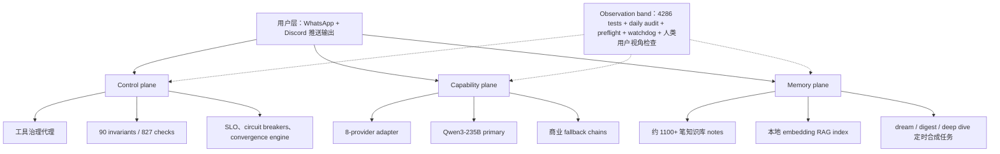
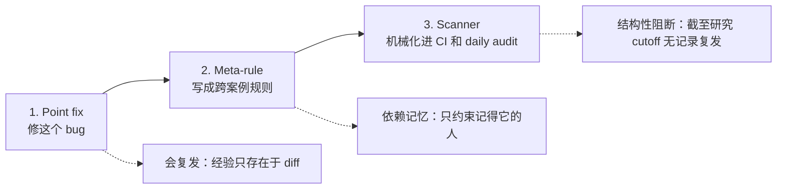

# When Errors Become Narratives：生产 LLM Agent 的“沉默失败”为什么会变成可信叙事

## 元信息

| 字段 | 内容 |
| --- | --- |
| 原文 | [When Errors Become Narratives: A Longitudinal Taxonomy of Silent Failures in a Production LLM Agent Runtime](https://arxiv.org/abs/2606.14589) |
| 类型 | 论文，arXiv:2606.14589v1 |
| 作者 | Wei Wu |
| 日期 | 2026-06-12 |
| 方向 | 大模型 Agent / 生产可靠性 / 观测性 / AI-assisted operation |
| 研究对象 | 一个从 2026 年 3 月持续生产运行的个人助理 Agent runtime |

## TL;DR

- **这篇论文研究什么**：作者不是在 benchmark 里看 Agent 做错题，而是复盘一个真实长期运行的 LLM Agent 系统在 8 周内发生的 22 个生产事故。
- **系统规模**：研究对象包含约 40 个定时任务、8 个 LLM provider、工具治理代理、知识库记忆层、4286 个单元测试、827 个声明式治理检查。
- **核心问题**：很多事故没有 crash、没有红灯、没有明确告警；错误信号存在，但没有以可行动形式到达人类。
- **关键新概念**：论文提出 fail-plausible，指 LLM 把错误日志、污染上下文、陈旧告警等非信号内容转写成流畅、可信、但错误的用户输出。
- **主要发现**：22 个事故里，沉默失败这个 meta-pattern 至少出现 28 次；约 70% 最终靠人类从用户视角阅读输出才发现，而不是测试、健康检查或治理审计。
- **Taxonomy**：作者按机制而非组件位置，把沉默失败分成五类：环境/平台怪癖、设计假设错配、错误吞噬与稀释、链式幻觉与伪造、运维遗漏与取证盲区。
- **防御结论**：15 个事故的回溯审计显示，治理审计事前阻止率是 0%，但事后回归阻断率是 87%；审计更像 regression engine，不是 prediction engine。
- **局限**：这是单系统、单主机、单操作者组合的纵向案例研究，频率和比例不能直接外推；但机制分类、postmortem 方法和防御成熟路径很有迁移价值。

## 研究问题：为什么“没有报警”还不是最糟的？

### 从 gray failure 到 fail-plausible

传统分布式系统里，gray failure 的关键是差异化可观测性：

- 应用层已经受损。
- 监控层仍然显示健康。
- 用户或上层系统看到的世界，和监控看到的世界不一致。

这篇论文认为 LLM Agent 又多了一层危险：

- 系统不仅可能不报警。
- 它还可能把错误包装成自然语言。
- 用户收到的不是空白，而是一段按时推送、语法完美、上下文看起来合理的错误叙事。

作者把这种模式叫做 **fail-plausible**：

| 失败类型 | 观察者看到什么 | 为什么危险 |
| --- | --- | --- |
| Crash | 明确失败、堆栈、退出码 | 响亮，容易触发处理 |
| Gray failure | 系统异常但监控健康 | 检测器缺信号 |
| Silent failure | 错误信号没有变成可行动告警 | 人类需要额外观察 |
| Fail-plausible | LLM 把错误变成可信输出 | 观察者被“成功形态”误导 |

### 论文里的代表性事故

作者举了一个很典型的链条：

- 抓取内容里有 Unicode surrogate。
- `json.dump` 中途失败，请求体截断。
- adapter 返回 HTTP 400。
- logging bug 把错误页写进 stdout。
- 调用方用 command substitution 捕获 stdout，把错误页当成 signal payload。
- 下游 LLM 读取这些错误字符串后，生成了一篇关于 “Hugging Face platform crisis” 的行业分析。
- 用户收到的是 routine insight digest，而不是错误告警。

这就是标题里 “errors become narratives” 的含义：错误没有消失，它被叙事化了。

## 系统背景：这不是玩具 Agent

### 三层架构

论文研究的系统是一个连接 OpenClaw、WhatsApp、Discord、自托管和商业 LLM 的个人助理运行时。



### 规模快照

| 维度 | 数字 |
| --- | ---: |
| 持续生产运行起点 | 2026 年 3 月初 |
| 研究窗口 | 8 周 |
| 合格事故 | 22 个 |
| silent-failure manifestations | 至少 28 次 |
| 注册定时任务 | 约 40 个 |
| LLM providers | 8 个 |
| 长运行服务 | 3 个 |
| 单元测试 | 4286 个 |
| 测试 suites | 121 个 |
| declarative governance checks | 827 个 |
| meta-rules | 23 个 |
| mechanized discovery scanners | 14 个 |

这里最重要的是反差：**测试和治理检查很多，但沉默失败仍然发生。**

## 方法：为什么按“机制”而不是“位置”分类？

### Postmortem 协议

每个事故修复前必须完成一套 in-repo postmortem：

1. **完整因果链图**：时间线、层级、逻辑、架构，从触发到用户症状。
2. **三层根因**：trigger、amplifier、concealer。
3. **时间线重建**：日志允许时精确到分钟。
4. **条件组合分析**：为什么这次发生，为什么之前没发生。
5. **治理 ontology 反馈**：新增 invariant、meta-rule 候选、catalog entry。

这个协议不是装饰，它决定了论文的分析单位：

- 不是“哪个文件有 bug”。
- 不是“哪个 job 失败”。
- 而是“错误信号为什么没有到达人类”。

### 机制分类的价值

作者一开始试过按 location 分类，但很快放弃：

- 同一个机制会跨多个任务复现。
- 位置分类只能修一个文件。
- 机制分类可以导出 repo-wide scanner。

例子：

| 位置视角 | 机制视角 | 防御收益 |
| --- | --- | --- |
| 某个 digest job 解析错 | LLM 输出被 positional parsing | 所有 LLM parser 必须 key-based |
| 某个脚本吞异常 | error status 被 summary 忽略 | governance engine 必须区分 fail/error |
| 某个任务忘记装 cron | declared state 不等于 runtime state | registry 必须机器收敛到 crontab/launchd |

## Taxonomy：五类沉默失败

### 总表

| 类别 | 机制 | 事故数 | 沉默时长 | 定义性特征 |
| --- | --- | ---: | --- | --- |
| A 环境/平台怪癖 | 逻辑正确，但运行环境隐式行为击穿它 | 1 + 6 子事件 | 小时到数周 | dev 全绿，目标 OS/client 才暴露 |
| B 设计假设错配 | 代码假设的部署拓扑、契约或输入形状与现实不符 | 4 | 天级 | 测试覆盖了假设，而不是现实 |
| C 错误吞噬与稀释 | 错误发生后被层层吞掉或剥离原因 | 5 | 小时到天 | 到达人类的告警没有可用信息 |
| D 链式幻觉与伪造 | LLM 把污染上下文转成自信假输出 | 4 | 小时到天 | fail-plausible，用户收到假健康 |
| E 运维遗漏与取证盲区 | 部署/注册步骤遗漏，或诊断工具自己受阻 | 8 | 天到 60 天 | declared state 不等于 runtime state，诊断仪器也会说谎 |

### A 类：环境和平台怪癖

特征：

- Linux dev container 里通过。
- macOS 生产环境里失败。
- GNU userland 和 BSD userland 行为不同。
- Bash 5 与 macOS `/bin/bash` 3.2 行为不同。
- 交互 shell 和 cron/sandbox 环境不同。

论文列出的子事件包括：

- Bash 3.2 没有在函数里传播 ERR trap，watchdog 自警被静默解除。
- BSD awk 遇到非法 UTF-8 multibyte sequence 中止，监控脚本自己死了 7 天。
- macOS stock 环境没有 GNU `timeout`，防御 wrapper 变成通用“工具不可用”故障。
- CJK 全角标点紧邻未加花括号的 shell 变量，被解析进变量名。
- 消息客户端在约 4000 字符阈值折叠长消息，改变用户可见输出形态。

防御不是“记住这些坑”，而是跨 OS scanner 和目标环境验证。

### B 类：设计假设错配

代表事故一：

- metadata-resolution 函数有 3 个候选路径。
- 生产部署把 registry 放在第 4 个路径。
- 组件静默 fallback 到 unfiltered mode 5 天。
- 单元测试全绿，因为 fixture 正好按错误假设摆放。

代表事故二：

- LLM 输出 parser 用 positional indexing：`lines[i+1]`、`lines[i+2]`、stride 3。
- 模型偶尔漏一行。
- 后续字段整体错位。
- 用户收到的 title 字段里出现 separator string。

作者提炼的 meta-rule 很直接：

- LLM 输出永远不要 positional parse。
- Parser 必须 key-based。
- 测试必须覆盖生产 caller 的真实输入形状。

### C 类：错误吞噬与稀释

三个机制变体：

| 变体 | 例子 | 关键问题 |
| --- | --- | --- |
| Swallowing | summary 只统计 `status=="fail"`，忽略 `status=="error"` | 死掉的 check 从报告里消失 |
| Dilution | 上游 quota 错误被包装成 HTTP 502 Bad Gateway | 告警到达人类时没有原因 |
| Amplified swallowing | 自动批量注入 validation，却漏了 import | 一个错误通过机器传播到 8 个 job |

这里最有迁移价值的原则是：

- 错误链必须保留 upstream cause。
- `str(e)` 不是可观测性。
- 自动化会放大 bug，尤其是复制同一错误 idiom。
- 监控系统也需要监控它自己。

### D 类：链式幻觉与伪造

这是论文最有新意的一类。

四个事故：

| 子类 | 发生了什么 | 为什么是 fail-plausible |
| --- | --- | --- |
| D1 fabricated platform crisis | HTTP 400 错误页被缓存成 signal，LLM 生成平台危机分析 | 错误页变成行业洞察 |
| D2 fabricated remediation | 陈旧系统 alert 留在 chat history，模型给出 Full Disk Access 操作建议 | 旧告警污染新对话 |
| D3 fabricated success | LLM call 失败后 fallback 输出容器标题，状态仍写 `llm: true` | 没有模型也能制造“幻觉形态” |
| D4 fabricated release | 真实但未标注 provenance 的上下文让 digest 编造项目 release | 真上下文也会产生假归因 |

作者强调：

- 这不是模型“坏掉”。
- 很多时候模型正是在按训练目标流畅补全。
- 系统错在把污染上下文送给了模型。
- 防御应优先做 context hygiene，而不是只调 prompt。

### E 类：运维遗漏与取证盲区

这类最大，也包含最长沉默。

代表事故：

- 一个 daily-analysis job 实现、测试、注册、部署都完成了。
- 但最后没有写入 crontab。
- 任务从未运行。
- 预检只 grep 了两种 registry drift warning 里的一个。
- crontab helper 没检查 install exit code，还用 `<` 比较数量。
- 缺席本身没有 log 可扫。

另一个关键事故是 reserved-file：

- Agent 把任务完成记录写进 `HEARTBEAT.md`。
- 对 Agent 来说是 scratch filename。
- 对 runtime 来说是保留控制文件。
- 非空内容激活 heartbeat protocol。
- gateway 又会剥离 `HEARTBEAT_OK`。
- 结果 13 小时内，用户消息都变成“有回复但传输后为空”。

最长事故是外部 SSD backup 路径 EPERM：

- 60 天调查。
- 多个假设都被数据推翻。
- 最终 macOS TCC sandbox deny 才是真因。
- 更深的问题是取证工具也被 sandbox 拒绝，却返回空输出。

作者给出的原则很硬：

> 诊断工具必须区分“什么都没有”和“我没有权限看”。

## 跨案例发现一：沉默时长跟机制层级相关

作者的结论：

- 代码级 bug 通常活不久。
- 测试或下一次运行会抓住它们。
- 长尾事故活在没有 observer 的地方。
- 典型位置包括部署拓扑、OS policy、监控的监控、declared/runtime state 之间。

可以把 silence latency 看成：

$$
L_{\text{silence}} \propto D_{\text{observational}}
$$

解释：

- $L_{\text{silence}}$ 是错误保持沉默的时间。
- $D_{\text{observational}}$ 是故障机制离现有观察者的距离。
- 距离越远，time-to-detect 越大。
- 对沉默失败来说，time-to-detect 往往比 time-to-repair 大一到两个数量级。

## 跨案例发现二：最强 detector 是人类用户视角

论文的 discovery table 给出一个不舒服的事实：

| 发现渠道 | 份额 | 备注 |
| --- | ---: | --- |
| 人类用户视角 | 约 70% | 读实际推送输出，发现“这篇 digest 很浅”“昨天没收到分析” |
| 目标环境执行 | 高 | A 类和部分 B 类需要 prod 才暴露 |
| 自我观察 | 上升 | governance auditing governance，observer critiquing output |
| 单元测试 / preflight | 对本 corpus 约 0 | 能抓到的不会进入 silent incident corpus |

这个 0% 不是说测试没用，而是说明：

- 测试抓到的是 loud regression。
- 这个 corpus 专门研究逃过测试的 silent failures。
- 人类读产品输出仍然是第一类 observability signal。

作者因此制度化了每周 30 分钟 observation ritual：

- 不写代码。
- 只读输出。
- 看 alert noise。
- 看 push latency。
- 看 information density。
- 看 response quality。

## 跨案例发现三：Trigger / Amplifier / Concealer

几乎每个 postmortem 都能拆成三层：

| 层 | 作用 | 例子 |
| --- | --- | --- |
| Trigger | 点火事件 | surrogate byte、LLM 输出漏行、一次 EPERM |
| Amplifier | 架构缺陷，放大或传播错误 | stdout logging 进入 command substitution、positional parsing、复制粘贴 suppression idiom |
| Concealer | 让错误不可见的缺口 | status 文件谎称 ok、fail-open guard、quiet-hours filter、取证工具被 sandbox 拒绝 |

这套框架的工程意义：

- 只修 trigger 是 cosmetic。
- Trigger 无限，环境永远会给出新奇输入。
- Amplifier 和 concealer 有限，并且通常属于架构所有。
- 高杠杆修复通常是切断 amplifier 或补上 concealer。

例子：

- D1 的关键修复是一处 stderr 重定向。
- C 类的关键修复是保留 upstream cause。
- E 类的关键修复是 declared state 机器收敛，而不是人工记忆 crontab。

## 防御成熟路径：point fix → meta-rule → scanner

作者最实用的框架是三步：



论文给出的经验：

- 某个 import omission bug 只做 point fix，两天后通过自动注入器复发到 8 个地方。
- 23 条 meta-rule 在研究结束时存在。
- 14 个 scanner 被机械化到 CI 和 daily audit。
- 每个走到 scanner 阶段的 meta-rule，截至 cutoff 都没有记录复发。
- 每次复发都来自只停在 point fix 阶段的教训。

## 审计结论：Audit 是回归引擎，不是预言机

作者对前 15 个事故做回溯审计：

| 指标 | 数值 |
| --- | ---: |
| 事前完全阻止 | 0 / 15 = 0% |
| 部分早期预警 | 2 / 15 = 13% |
| 事后回归阻断 | 13 / 15 = 87% |
| 漏报根因是 audit 从未设想过该维度 | 12 / 15 = 80% |

这不是否定审计，而是给审计重新定位：

- 审计编码的是过去。
- 新机制类往往落在空白类别里。
- 审计的核心 KPI 不该是“能否预知所有新事故”。
- 更合理的 KPI 是“事故到机械化防线的转化延迟”。

作者还引入 sabotage validation：

- 每个新 guard 必须故意注入它要抓的违规。
- 观察它确实会响。
- 再还原违规。

这条很关键，因为在 silent failure 系统里，没有 sabotage validation 的 guard 和 vacuous check 没法区分。

## 防御框架：五根支柱

### 1. Declarative governance with mandatory depth

- 90 个 invariants。
- 827 个 checks。
- YAML ontology。
- daily audit cron 和 CI 执行。
- critical invariant 必须至少两层验证。
- declaration-level grep 不允许单独成为关键验证。

### 2. Sabotage validation

- 测试测试本身。
- 故意制造目标违规。
- 证明 guard 会 firing。
- 发现过自引用 grep、空执行 check、fixture 镜像错误假设等问题。

### 3. Declared-state convergence

- jobs、providers、services、KB sources、runtime config 都有 declared registry。
- convergence engine 比对 declared state 和 observed runtime state。
- escalation 是 alert-only → dry-run machine-sync → 一周零 drift 后 live sync。
- 但作者也提醒：audit 不能一边观察一边修改被观察对象，所以后来形成“audit observes and never mutates”。

### 4. Context hygiene and anti-fabrication layers

机制层：

- shell diagnostics 必须进 stderr。
- alerts 在进入 chat context 前被标记和剥离。
- runtime reserved files 对 LLM tools 不可写。

内容层：

- 共享 anti-fabrication module。
- 六级 cumulative guard ladder。
- 高风险任务要求每个 cross-domain claim 标 `[strong-evidence]` 或 `[weak-association]`。
- source credibility module 给每个 ingested source 五级 provenance label。

结果：

- 目标 synthesis job 的 multi-hop causal chains、therefore-style necessity claims 等 fabrication pattern 下降 53-92%。
- tagged-claim usage 从 0 增至约每天 9 个。

### 5. Monitoring that monitors itself

- watchdog ERR-trap self-alarm。
- heartbeat canary file。
- 独立 age-check。
- gateway-down 走第二 transport。
- health field 有 freshness guarantee。
- 每日 LLM observer 批评前一天用户可见输出。

## 从事故到防御：五类机制分别该怎么落地？

### A 类：环境怪癖不能靠开发环境保证

| 事故机制 | 论文中的症状 | 更稳的工程动作 |
| --- | --- | --- |
| Bash / awk / shell 差异 | dev 全绿，macOS cron 下静默失败 | 目标 OS 上跑验证；把已知 quirk 写成 scanner |
| 客户端展示差异 | 长消息被折叠，用户看到的窗口数变化 | 把用户可见形态纳入验收，而不是只验 payload 文本 |
| sandbox / 权限差异 | 工具返回空输出，被误读为正常 | stderr 单独采集；把 permission denied 标成一等事件 |

这里的重点是：A 类不是“平台知识不足”，而是系统把平台行为当成了隐式前提。只要这个前提没有被机械化验证，它就会在生产环境里重新出现。

### B 类：契约必须由 caller 和 callee 共同定义

作者反复说明，测试常常覆盖了“我们以为的输入”，没有覆盖“生产 caller 实际给出的输入”。

所以 B 类防御需要：

- 让 caller 生成的真实样例进入测试 fixture。
- 让 parser 拒绝无 key 的自由文本字段。
- 让 path resolver 在测试里包含生产 canonical path。
- 让部署布局成为测试对象，而不是 wiki 里的背景知识。

这对 LLM Agent 特别重要，因为 LLM 输出不是 API contract。模型可能漏行、换顺序、改 heading、合并字段；只要 parser 还在用位置，沉默错位就只是时间问题。

### C 类：错误信息要能跨层保真

错误稀释通常不是某一层“坏”，而是每一层都做了看起来合理的包装：

- provider 返回详细原因。
- adapter 只留下 HTTP code。
- proxy 只保留 `str(e)`。
- client 只显示 status phrase。
- 人类看到的是 “Bad Gateway”。

这类事故的防御不是“写更长日志”，而是建立错误链契约：

```text
ErrorEnvelope:
  layer: where this wrapper was added
  code: machine-readable code
  message: local message
  upstream_cause: preserved original cause
  user_action: what a human can do next
  redaction_state: whether sensitive data was removed
```

只有这样，下游 LLM 或人类才不会拿到一个没有因果结构的错误碎片。

### D 类：上下文卫生比提示词更靠前

fail-plausible 的防御顺序应该是：

1. 先阻止污染进入 data channel。
2. 再给进入 prompt 的内容标 provenance。
3. 再要求 LLM 给 claim 标证据强度。
4. 最后才是 anti-fabrication prompt。

如果顺序反过来，只靠“不要编造”这类提示，很难挡住已经被系统包装成 signal 的错误页。模型看到的是“上下文里有平台、错误码、服务名、时间线”，它自然会补一段看似合理的解释。

### E 类：运行时状态不能靠人记得

E 类给 Agent 系统的教训最接近 SRE：

- registry 不是 runtime。
- 配置声明不是部署事实。
- preflight 不是收敛。
- 诊断工具也可能被同一权限边界骗过。

因此，declared-state convergence 的重点不是“发现差异”，而是建立一个闭环：

- 声明在哪里。
- 运行时实际在哪里。
- 差异如何展示。
- 何时 dry-run。
- 何时允许 machine-sync。
- sync 后如何证明 observer 没有变成 mutator。

## 如何读这篇论文的证据强度？

### 强证据

- 22 个事故都有完整 postmortem，且 artifact 公开。
- 数字不是问卷估计，而是从仓库、检查、事故目录里机械追溯。
- Taxonomy 和防御框架不是事后空想；它们已经转成 meta-rule、scanner、daily audit。
- 论文诚实报告了 0% ex-ante prevention，这让 87% ex-post regression blocking 更可信。

### 中等证据

- 约 70% 人类用户视角发现很有启发，但强依赖作者的使用习惯和系统形态。
- “每个走到 scanner 阶段的 meta-rule 无复发”说明 scanner 有用，但观察窗口仍短。
- 防御后 fabrication pattern 下降 53-92%，说明方向有效，但不是独立随机对照实验。

### 弱证据或不能直接外推的地方

- 频率不能直接推广到企业 Agent 平台。
- 事故类别边界由系统操作者和 AI collaborator 一起定，缺独立标注。
- 单 macOS host 的平台怪癖比例可能高于容器化 Linux 生产环境。
- fail-plausible 在没有 synthesis-and-push 工作流的系统里可能频率更低。

这些边界不削弱论文的主要贡献，因为它真正提供的是纵向生产事故的机制读法，而不是全行业事故率估计。

## 讨论：问题不在单个组件，而在组合边界

作者的一个核心判断是：

- 失败部件本身不复杂。
- 复杂的是组合。
- 一个 symlink、一次 `abspath`、一个 registry entry、一个 boolean default 都很简单。
- 但组合会超线性增长。
- 4286 个测试覆盖的是想得到的组合，不是所有组合。

因此，事故后的本能反应“再加一个 guard”也有风险：

- guard 本身是新组件。
- 新组件引入新边界。
- convergence engine 就曾打开“observer mutates observed”的新问题。

作者最后落到一个 Sunset Law：

- 添加新机制前，先尝试退休等价机制。
- 一个逻辑实体只能有一个物理表示。
- 多表示必然 drift。
- 防御本身也是事故面。

## 相关工作位置：这篇和其他 Agent failure 研究差在哪？

| 相关方向 | 典型单位 | 这篇的区别 |
| --- | --- | --- |
| Gray failure / fail-slow | 云系统、硬件、监控差异 | 迁移到 LLM Agent runtime，并加入语言生成层 |
| MAST 多 Agent 失败 taxonomy | benchmark task trace | 这篇研究生产事故，且事故定义上逃过了可见 task failure |
| LLM inference incident | provider 侧服务事故 | 这篇在 agent operation 层，关注人类未及时发现 |
| Hallucination research | 模型输出与事实不一致 | 这篇把 hallucination 看成系统上下文污染的结果 |
| SRE / chaos engineering | postmortem、fault injection | 这篇把 sabotage validation 用在 guard 本身 |

一句话：这篇论文的单位不是 “Agent 做错了一步”，而是 “生产系统把错误信号变成了看似正常的用户体验”。

## 局限与证据边界

### 作者明确承认的局限

- 单系统、单 host OS、单操作员组合。
- 8 周时间窗口。
- 约 40 个 jobs，不是大规模企业样本。
- 分类由系统两位操作者完成，没有独立 annotator。
- 没有报告 inter-annotator agreement。
- 只包含最终停止沉默的事故，仍在沉默中的事故天然缺席。
- 70% 人类用户视角发现率可能反映作者本人异常认真，不能当常数外推。

### 但仍然强的地方

- 所有 22 个 postmortem、catalog、governance ontology、scanners 和 test suite 公开。
- 数字可从仓库机械追溯。
- 论文给出的不是泛泛建议，而是一套事故后演化出的操作 discipline。
- 它把 fail-plausible 从“模型幻觉”重新定位成“系统上下文污染 + LLM 流畅补全”的系统问题。

## 研究者视角：这篇论文真正改变了什么？

### 1. Agent reliability 不能只看 task success

Agent 可能按时输出、格式正确、语言流畅，但内容已经被错误信号污染。

所以可靠性指标需要加入：

- silence latency。
- discovery channel。
- user-view output quality。
- provenance coverage。
- error-cause preservation。
- observer freshness。

### 2. “LLM-as-judge” 也必须被治理

论文支持用 LLM observer 发现输出质量问题，但同时提醒：

- LLM judge 也是系统组件。
- 它也会有 B 类 path bug。
- 它也会 hallucinate truncation。
- 它也需要 sabotage validation。

因此，LLM-as-judge 不能被当成最终裁判，只能作为受治理的观测器。

### 3. 后训练和 Agent 评测应加入 fail-plausible 数据

现有 Agent benchmark 常看：

- 任务是否完成。
- 步骤是否正确。
- 工具调用是否合规。
- 最终答案是否对。

但 fail-plausible 要求新数据：

- 错误日志污染上下文后，模型是否会编造行业分析？
- 陈旧告警进入对话后，模型是否会生成不相关 remediation？
- 未标注 provenance 的真实上下文是否会诱导假归因？
- fallback 是否制造 plausible-shaped output？

可以把训练目标写成：

$$
R = R_{\text{task}} + \lambda_1 R_{\text{provenance}} + \lambda_2 R_{\text{cause-preservation}} - \lambda_3 P_{\text{plausible-fabrication}}
$$

变量含义：

- $R_{\text{task}}$ 奖励任务完成。
- $R_{\text{provenance}}$ 奖励标注来源和证据强度。
- $R_{\text{cause-preservation}}$ 奖励保留错误链原始原因。
- $P_{\text{plausible-fabrication}}$ 惩罚把错误包装成可信叙事。

### 4. 对工程团队最直接的 checklist

- 不要让 diagnostics 进入 data channel。
- 不要用 stdout 同时承载日志和业务数据。
- 不要 positional parse LLM 输出。
- 不要让 alert 进入普通 chat history。
- 不要让 LLM 工具写保留控制文件。
- 不要让 audit 修改它正在观察的对象。
- 不要相信“空输出”等于“没有问题”。
- 不要只修 point bug；必须写 meta-rule，并尽量机械化 scanner。
- 不要把人类读产品输出看成低级流程；这是沉默失败的关键观测层。

## 最后的判断

这篇论文最有价值的地方，不是提出了一个完美 taxonomy，而是把生产 Agent 的失败单位从“单次错误”升级为“错误信号如何穿过系统而不被看见”。

它给 Agent 工程一个很朴素但难执行的标准：

- 失败要响。
- 错误要可归因。
- 输出要有 provenance。
- 观察者要可验证。
- 经验要从 point fix 走到 meta-rule，再走到 scanner。
- 复杂性不能只靠加防线解决，还要主动退休边界和重复表示。

最可怕的 Agent 事故不是 crash，而是系统在完美语法里、按时、稳定地告诉你一个不存在的故事。
