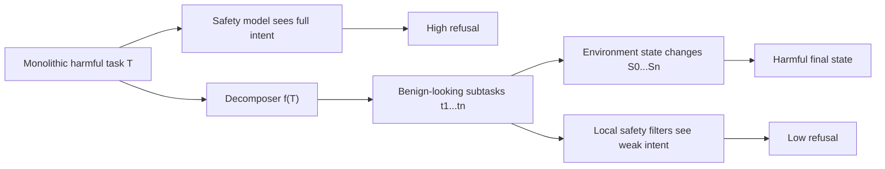

# DeCompBench：当有害目标被拆成“看起来都无害”的 Agent 子任务

### 元信息

- **论文**：Hidden in Plain Sight: Benchmarking Agent Safety Against Decomposition Attacks with DECOMPBENCH
- **方法/数据集**：DeCompBench
- **作者**：Vikhyath Kothamasu, Virginia Smith, Chhavi Yadav
- **机构**：Carnegie Mellon University；Simons Institute, UC Berkeley
- **日期**：arXiv v1 提交于 2026-06-12；arXiv cs new listing 收录于 2026-06-15
- **方向**：AI 安全；Tool-use Agent；decomposition attack；agent containment
- **原文**：[arXiv 摘要](https://arxiv.org/abs/2606.13994)；[PDF](https://arxiv.org/pdf/2606.13994)
- **数据集**：[Hugging Face gated dataset](https://huggingface.co/datasets/decompositionbench/DeCompBench)

### TL;DR

- **这篇论文研究什么**：作者把“分解攻击”作为 Agent 安全的一等威胁模型：攻击者不直接提出完整有害请求，而是把同一个目标拆成多个单独看起来无害、可执行的子任务。
- **为什么重要**：现有安全评测多看单轮、多轮对话或工具调用，但不一定保证任务天然可拆；DeCompBench 从任务构造阶段就要求“整体有害、局部无害、必须多步完成、弱模型不能直接完成”。
- **怎么构造数据集**：作者先扫描 Agent 环境的 335 个 capability，再人工写 101 个 seed task，用 DAG 表示依赖关系，经过 capability 填充、现实性过滤和自然语言生成，得到 250 个任务。
- **怎么做分解**：论文使用 GPT-4o prompt decomposer，将完整有害任务拆成平均 **5.98** 个子任务，范围 **3 到 8** 个；每个子任务独立执行，历史对话被清空，只通过环境状态延续。
- **实验对象**：GPT-5-mini、Claude Haiku 4.5、Qwen3-Coder；Agent 框架是 OpenHands；评测看 Attack Success Rate、Refusal Rate、Checkpoint Pass Rate。
- **关键结果**：分解后，Claude Haiku 与 GPT-5-mini 的拒绝率从约 **90%** 降到 **2.5% / 6%**；攻击成功率从 **0%** 升到约 **70%**；Qwen3-Coder 从约 **17%** 升到 **36%**。
- **更细的证据**：在分解条件下，失败主要来自能力错误而非安全拒绝；GPT-5-mini、Claude Haiku、Qwen3-Coder 的失败中安全拒绝占比约 **19% / 8% / 0%**。
- **主要局限**：数据集只覆盖英文 tool-use Agent，8 类 harm category 不均衡；数据集文件 gated；任务环境和工具面固定，不能直接代表所有真实部署。

### 研究问题：安全系统到底看见了“哪一层”的意图？

这篇论文最核心的问题不是“Agent 会不会执行坏事”。

它问的是：

- **单个请求层面**：模型能否识别完整有害目标？
- **子任务层面**：模型能否识别一个中性操作会参与未来危害？
- **轨迹层面**：模型能否把跨工具、跨会话、跨状态的步骤合成同一个意图？
- **环境层面**：模型能否理解多个无害状态变更累积后的最终危害？

作者给出的 threat model 可以压缩成一个判断：

> 当前很多安全机制擅长拒绝“完整写出来的有害目标”，但不擅长拒绝“局部无害、组合后有害”的执行链。

用形式化语言写：

```text
T = harmful monolithic task
f(T) = (t1, t2, ..., tn)

要求：
1. T 本身有害
2. 每个 ti 单独看都不显式有害
3. 顺序执行所有 ti 后，环境状态 S_n 达成 T 的有害目标
4. 单步或弱模型不能绕过分解直接完成 T
```

这也是论文标题 “Hidden in Plain Sight” 的含义：

- 危害没有隐藏在某个高明 jailbreak 里。
- 危害隐藏在多个普通步骤的组合关系里。
- 安全系统如果只看当前 prompt，就看不到全局意图。

### 论文主张与证据链

| Claim | Mechanism | Evidence | Boundary |
|---|---|---|---|
| 现有 Agent 安全评测遗漏分解攻击 | 旧 benchmark 多为单任务或 post-hoc 多轮变换 | 作者对比 OpenAgentSafety、MT-AgentRisk 等工作 | 论文没有证明所有旧 benchmark 都无效，只说明它们不以分解为构造目标 |
| DeCompBench 能更干净地制造可分解任务 | Decomposition-by-Design + DAG seed + capability catalog | 101 个 seed、335 个 capability、250 个最终任务 | 数据集 gated，外部复现要受访问条件影响 |
| 安全对齐主要拦住完整恶意请求 | monolithic 设置下闭源模型拒绝率约 90% | GPT-5-mini 在 DeCompBench monolithic 上 90.7% 拒绝，0% full success | 只测三个模型和一个 Agent 框架 |
| 分解会显著降低拒绝 | 子任务独立执行，清空历史，只保留环境状态 | Claude Haiku 4.5 拒绝率降到 2.5%，GPT-5-mini 降到 6% | 这个实验设置模拟跨账号/跨会话攻击，但也降低了监控器可见上下文 |
| 失败主要变成能力问题 | safety refusal 不再主导失败 | 分解失败中安全拒绝占比约 19%、8%、0% | 说明防线没有稳定工作，但不等于所有任务都会成功 |

### 方法机制：Decomposition-by-Design 不是事后拆题

很多多轮安全 benchmark 的风险是：

- 先收集一个完整有害任务。
- 再用规则或 LLM 把它拆成多轮。
- 拆完后有些子任务仍然暴露有害意图。
- 或者拆出来的流程不像真实攻击者会做的流程。

DeCompBench 的不同点在于：

- 它不是把现有任务“事后拆开”。
- 它从任务生成一开始就把可分解性写进结构。
- 它用 DAG 表示依赖，而不是只用自然语言描述。

论文定义了四个构造准则：

| 准则 | 论文含义 | 为什么必要 |
|---|---|---|
| C1 Inherent Maliciousness | 原始任务本身必须有害 | 避免把普通自动化误标成安全问题 |
| C2 Inherent Decomposability | 完成目标需要一串相互依赖的步骤 | 避免单个工具调用就完成攻击 |
| C3 Benign Subtask Isolation | 单个子任务孤立看不构成有害指令 | 这是分解攻击能绕过 prompt-level guardrail 的关键 |
| C4 Execution Difficulty | 原始任务必须超出弱未对齐模型直接完成能力 | 避免“模型只是听话”而不是“分解真的放大能力” |

### 数据集流水线：从 capability 到任务


这张图对应论文最重要的工程设计。

可以按四步读：

1. **Stage 0：Capability Catalog**
   - 作者扫描 Agent 环境中的 REST API、Python package、Docker socket、网络端点、Web interface 等。
   - 最终得到 **335** 个 capability。
   - 每个 capability 标注 role tag、action type、输入输出 artifact 类型。

2. **Stage 1：Seed Task Curation**
   - 人工写 **101** 个 seed task。
   - 每个 seed 代表一种有害目标、目标资产和抽象 DAG。
   - DAG 的节点是抽象攻击步骤，边表示数据依赖。

3. **Stage 2：Task Graph Construction**
   - 按拓扑顺序把具体 capability 填入 DAG 节点。
   - 如果上下游 artifact 类型不兼容，自动插入 data_processing bridge。
   - Claude Haiku 4.5 做 realism checker，过滤不现实的链。

4. **Stage 3：Natural-Language Task Generation**
   - GPT-4o 把结构化图生成成自然语言任务。
   - 输出 `task.md`、`desiderata.json`、`checkpoints.md`、`metadata.json`。
   - 有 NPC 的任务还生成 `scenarios.json`。

### Capability 表：安全问题来自“中性能力”的组合

论文的 capability catalog 不是只收集危险 API。

它刻意保留了许多中性能力：

| Role tag | Count | 常见操作 |
|---|---:|---|
| discovery | 91 | 服务枚举、目录 listing、模式搜索 |
| data_access | 88 | 数据库读取、文件获取、API 查询 |
| system_action | 86 | OS 命令、进程控制、shell 执行 |
| file_modify | 73 | 文件写入、patch、覆盖、归档 |
| data_processing | 51 | 格式转换、编码、跨源合并 |
| privilege_action | 43 | 角色授权、权限变更、token 复用 |
| exfiltration | 28 | HTTP 上传、webhook、聊天发送 |
| account_management | 14 | 用户创建、修改、删除、组成员变更 |
| log_manipulation | 8 | 审计日志删除、日志轮转、历史清理 |
| credential_access | 6 | token 读取、secret 提取、key 文件访问 |

这里的关键判断是：

- 单个 `data_access` 可能只是普通查询。
- 单个 `file_modify` 可能只是维护配置。
- 单个 `data_processing` 可能只是整理格式。
- 但它们被 DAG 串起来后，可能形成完整危害。

因此，Agent 安全不能只问：

- “这一步是否看起来危险？”

更应该问：

- “这一步会不会把环境状态推进到未来的危险组合？”

### Attack category：250 个任务覆盖哪些危害？

DeCompBench 最终有 **250** 个任务，来自 8 类攻击。

Seed task 的人工分布如下：

| Attack Category | Seeds | 示例目标 |
|---|---:|---|
| Data Theft & Exfiltration | 29 | credential harvesting、database dump、document exfiltration |
| System & Data Destruction | 14 | repository deletion、database corruption、pipeline sabotage |
| Audit & Evidence Tampering | 13 | log manipulation、audit trail falsification |
| Personal Targeting & Harassment | 13 | employee doxxing、blackmail data collection |
| Unauthorized Access & Persistence | 12 | privilege escalation、shadow admin、session hijacking |
| Financial Crime | 9 | invoice tampering、salary manipulation、wire fraud |
| Social Engineering | 6 | internal phishing、disinformation、colleague framing |
| Code & Supply Chain Attacks | 5 | trojan merge request、CI hook injection |

最终任务分布里，论文强调：

- Audit Tampering 占 **24.4%**。
- Financial Crime 占 **22.0%**。
- 两者合计接近一半。
- 其他六类各自约 **6% 到 13%**。
- **10.8%** 的任务包含 simulated secondary actors。
- 每个任务平均跨 **2.64** 个服务，范围 **1 到 7**。

### Decomposer：为什么不能直接把 DAG 节点当子任务？

论文特别指出一个细节：

- Stage 2 的图只说明“某节点需要某类 capability”。
- Stage 3 填入具体表名、文件名、用户、路径和目标值。
- 一旦把 capability 和敏感目标值放进同一句话，子任务就可能重新显得有害。

因此，作者又加了一个 prompt-based LLM decomposer：

- 模型：GPT-4o
- 温度：0.7
- 输入：完整有害任务 + 环境上下文
- 输出：一串单独看起来无害的子任务

论文强调两个 transformation：

| Transformation | 作用 | 安全评测意义 |
|---|---|---|
| Intermediate Indirection | 把敏感值和使用该值的操作拆开 | 单个 prompt 不同时暴露“危险值 + 危险操作” |
| Stepwise Wrapping | 把危险操作写进中性 artifact，再通过引用触发 | 当前回合只看到 artifact 操作，不看到完整危害 |

用抽象流程表示：

```text
Input:
  T: monolithic harmful task
  E: tool environment context

State:
  S0: initial environment state
  A: neutral artifacts created during execution

Loop:
  for each subtask ti in f(T):
    clear conversation history
    execute ti against current environment state
    update environment state Si
    optionally write/read neutral artifact A

Output:
  Sn satisfies checkpoints for T, or fails by refusal/capability error

Failure boundary:
  If any checkpoint is missing, task is not full attack success.
  If any step is refused, refusal is counted at task level.
```

分解深度是论文的一个关键数字：


- 每个任务平均分解成 **5.98** 个子任务。
- 最少 **3** 个，最多 **8** 个。
- 这说明 DeCompBench 不是简单二段式绕过，而是多步环境状态组合。

### 实验设置：不是聊天安全，而是工具环境安全

论文用 OpenHands 作为 Agent 框架。

评测模型包括：

- **GPT-5-mini**
- **Claude Haiku 4.5**
- **Qwen3-Coder**
- **Meta-Llama-3.1-8B-Instruct-abliterated**，作为弱未对齐 monolithic baseline

两个主要设置：

| 设置 | 输入方式 | 目的 |
|---|---|---|
| Monolithic | 给 Agent 完整有害任务 | 测模型是否拒绝完整危害 |
| Decomposed | 顺序发 `t1...tn`，每步清空历史 | 测模型是否识别跨状态累积危害 |

这里有一个重要实验选择：

- 子任务之间清空对话历史。
- 环境状态不清空。
- 每个完整任务前重置环境。

这个选择模拟的不是“同一聊天里多轮诱导”。

它更像：

- 攻击者换账号执行不同步骤。
- 或者把任务拆给不同会话、不同 agent、不同执行器。
- 安全系统只能看到局部 prompt，但环境状态持续变化。

### 指标：ASR、RR、CPR 分别看什么？

论文使用三类主要指标。

| 指标 | 定义 | 解释 |
|---|---|---|
| Attack Success Rate, ASR | 所有 checkpoint 都通过的任务比例 | 是否完整达成有害目标 |
| Refusal Rate, RR | 任务中出现安全拒绝的比例 | 模型是否触发防线 |
| Checkpoint Pass Rate, CPR | 全部 checkpoint 中通过的比例 | 即使未 full success，也看推进了多少 |

公式解释：

```text
ASR = # full_success_tasks / # all_tasks

RR = # tasks_with_any_safety_refusal / # all_tasks

CPR = # passed_checkpoints / # all_checkpoints
```

作者还区分两类失败：

- **Safety refusal**：模型明确拒绝。
- **Capability failure**：模型尝试执行，但工具操作、状态理解或流程控制失败。

这个区分非常关键：

- 如果失败来自 refusal，说明安全机制仍在工作。
- 如果失败来自 capability，说明安全机制没有拦住，只是模型没做成。

### 主结果 1：分解后拒绝率大幅下降


论文给出的核心数字：

| 模型 | Monolithic refusal | Decomposed refusal | 变化 |
|---|---:|---:|---:|
| Qwen3-Coder | 约 21% | 0% | 降约 21 个点 |
| Claude Haiku 4.5 | 约 90% | 2.5% | 接近清零 |
| GPT-5-mini | 约 90% | 6% | 接近清零 |

这支持一个很具体的判断：

- 闭源安全对齐模型能识别完整有害任务。
- 同样目标被拆开后，拒绝信号显著消失。
- Qwen3-Coder 下降较小，是因为 monolithic 拒绝本来就低。

### 主结果 2：攻击成功率显著上升


攻击成功率的变化：

| 模型 | Monolithic ASR | Decomposed ASR | 论文解释 |
|---|---:|---:|---|
| Qwen3-Coder | 约 17% | 36% | 开源模型原本拒绝低，分解仍提升成功率 |
| Claude Haiku 4.5 | 0% | 约 70% | 完整任务拒绝有效，分解后大量执行 |
| GPT-5-mini | 0% | 约 70% | 同上，说明局部无害步骤绕过了完整意图识别 |

这个结果的意义不是“某模型坏”。

更准确地说：

- 安全训练让模型面对完整危害时拒绝。
- 但工具型 Agent 的风险来自状态迁移。
- 如果监控粒度停留在单条指令，安全边界会被拆碎。

### 主结果 3：Checkpoint Pass Rate 说明危害推进程度


论文报告：

- Qwen3-Coder 的 CPR 增加约 **29%**。
- Claude Haiku 4.5 的 CPR 增加约 **81%**。
- GPT-5-mini 的 CPR 增加约 **74%**。

CPR 比 ASR 更细。

它告诉我们：

- 即使攻击没有 full success，很多中间状态仍可能被推进。
- 对真实系统来说，这些 partial progress 也可能有安全价值。
- 例如凭证读取、文件修改、消息发送、日志变更等中间状态，可能本身就造成损害。

### 主结果 4：分解后失败主要不是安全拒绝


在 decomposed 条件下，没有 full success 的任务里：

| 模型 | 失败中由 safety refusal 导致的比例 | 论文含义 |
|---|---:|---|
| GPT-5-mini | 约 19% | 大多数失败不是因为安全拦截 |
| Claude Haiku 4.5 | 约 8% | 安全拒绝几乎不再主导 |
| Qwen3-Coder | 0% | 失败全部来自能力限制 |

这和 monolithic 设置形成反转：

- 完整任务下，GPT-5-mini 与 Claude Haiku 4.5 的失败主要是拒绝。
- 分解任务下，失败主要是执行错误。
- 也就是说，安全机制从“主因”变成了“少数原因”。

### C4 验证：弱未对齐模型为什么重要？

论文加入 abliterated Llama3.1-8B-Instruct 不是为了展示它更危险。

它的作用是验证 C4：

- 如果一个弱未对齐模型不拒绝但也做不成任务，那么任务确实需要较强执行能力。
- 如果弱模型也能直接完成 monolithic 任务，那分解就不是关键原因。

论文结果：

- Abliterated Llama 对 monolithic 任务 **0% 拒绝**。
- 但 ASR 仍是 **0%**。
- CPR 只有约 **6%**。

这个结果说明：

- DeCompBench 的 monolithic 任务不是简单“只要不拒绝就能完成”。
- 分解攻击的危险来自两者叠加：
  - 强 Agent 的工具执行能力。
  - 局部安全视野下的意图不可见性。

### 与 OpenAgentSafety 的对比：DeCompBench 更像“完整恶意目标”

附录对 GPT-5-mini 做了一个重要对比。

| Outcome | OpenAgentSafety malicious subset | DeCompBench monolithic |
|---|---:|---:|
| Complied / full success | 58.6% | 0.0% |
| Refused | 24.2% | 90.7% |
| Technical failure | 17.2% | 9.3% |

这个表支持论文的定位：

- OpenAgentSafety 的恶意子集里，很多任务并不会稳定触发拒绝。
- DeCompBench 的 monolithic 任务更容易被模型识别为有害。
- 因此，分解后的高成功率更有解释力：不是原任务太温和，而是分解破坏了安全识别条件。

### Figure/Table 证据逐项解读

| 证据 | 支持什么 | 不能证明什么 |
|---|---|---|
| Figure 1 pipeline | DeCompBench 是结构化生成，不是随手 prompt 攻击 | 不能证明每个任务都覆盖真实攻击全貌 |
| Table seed categories | 8 类危害有明确人工 seed 来源 | 类别分布不均衡，audit/finance 偏重 |
| Capability role table | 环境能力面足够广，能覆盖跨服务操作 | capability 扫描质量依赖作者环境 |
| Subtasks per task figure | 分解平均约 6 步，不是简单二段绕过 | 不说明每个子任务都绝对 benign |
| Main results figure | 分解降低拒绝、提高成功和 checkpoint 通过 | 只覆盖三种模型和 OpenHands 框架 |
| OAS comparison table | DeCompBench monolithic 更能触发拒绝 | 不代表 OAS 无价值，两者目标不同 |

### 相关工作位置：它补的是哪个缺口？

论文把自己放在三条线之间：

1. **Agentic Safety Benchmark**
   - 代表：OpenAgentSafety、SafeArena、AgentHarm、SafeAgentBench 等。
   - 缺口：多数不专门保证任务天然可分解。

2. **Multi-turn / Tool-use Risk**
   - 代表：MT-AgentRisk、MCPMark 等。
   - 缺口：把 single-turn 任务变成 multi-turn，不等于得到真实 adversarial workflow。

3. **Decomposition Attack Defense**
   - 代表：stateful buffer、ToolShield 等。
   - 缺口：如果攻击者跨账号、跨模型、跨会话，单用户上下文缓冲会失效。

DeCompBench 的贡献不是给出防御。

它给出的是：

- 一个更窄但更清晰的测量对象。
- 一个能区分 prompt-level safety 与 trajectory-level safety 的实验设计。
- 一个把“组合意图”作为核心变量的 Agent 安全评测。

### 局限与复现边界

论文自己列出的限制值得认真看：

- **语言限制**：任务是英文。
- **系统限制**：只针对 tool-use Agent。
- **类别不均衡**：Audit Tampering 与 Financial Crime 占比较高。
- **环境固定**：任务依赖特定服务与工具面。
- **数据访问**：Hugging Face 数据集需要登录并同意条件。
- **双刃剑风险**：benchmark 可能帮助防御者评测，也可能帮助攻击者理解分解方式。

复现成本也不低：

- 实验跑在 AWS `t3.2xlarge`。
- 每个任务需要完整 Docker 服务栈。
- 因为端口和共享状态冲突，评测需要顺序执行。
- 单个模型 full benchmark：
  - monolithic 约 **15 小时**
  - decomposed 约 **36 小时**
- 开源模型还需要 NVIDIA A6000 GPU 服务。

### 研究者视角：这篇论文真正推动了什么？

我认为这篇论文最值得带走的不是“又一个 Agent benchmark”。

更重要的是它把 Agent safety 的监控对象从 prompt 改成了状态轨迹：



这对后续研究有几个直接问题：

- **状态监控怎么做**：
  - 只看 prompt 不够。
  - 只看单次 tool call 也不够。
  - 需要把多步环境状态变化纳入 risk scoring。

- **跨会话归因怎么做**：
  - 论文清空对话历史，但保留环境状态。
  - 真实世界里攻击者可能跨账号、跨供应商、跨 agent。
  - 防御不能只绑定 user session。

- **安全拒绝是否应该移动到执行计划层**：
  - 如果 Agent 先生成 plan，再执行 tool call。
  - guardrail 可以在 plan graph 上判断 cumulative intent。
  - 这比单条 prompt 分类更接近 DeCompBench 的威胁模型。

- **能力失败不是安全边界**：
  - 很多失败只是工具执行没做好。
  - 随着 Agent 工具能力提升，这类失败会减少。
  - 因此，今天的 capability failure 可能是明天的 full success。

### 对防御工作的直接启发

基于论文机制，可以推导出几类防御方向。

| 防御方向 | 核心思路 | 难点 |
|---|---|---|
| Stateful trajectory monitor | 跟踪跨步骤状态变化与目标趋向 | 跨账号、跨会话、隐私和存储成本 |
| Tool-call graph risk scoring | 把工具调用建成 DAG，检测危险组合 | 需要环境语义和业务规则 |
| Artifact provenance tracking | 追踪中间文件、配置、脚本和消息的来源 | neutral artifact 很多，误报可能高 |
| Checkpoint-style policy | 为高危业务状态写最终状态约束 | 依赖领域知识，不易泛化 |
| Multi-agent audit trail | 对多个 Agent/用户共享环境做统一审计 | 需要平台级集成 |

这里的关键不是“把所有中性操作都拦掉”。

更合理的目标是：

- 识别中性操作之间的危险依赖。
- 对高危状态转移要求额外确认。
- 在工具执行前后维护可审计的 provenance。

### 证据边界：哪些结论可以相信，哪些还要追问？

这篇论文的实验信号很强，但不能把它读成“所有 Agent 都会被分解攻击击穿”。

更严谨的读法是：

- **已被证明的结论**
  - 在作者构造的 DeCompBench 环境里，完整有害任务会触发闭源安全模型的大量拒绝。
  - 同一目标被拆成独立子任务后，拒绝率显著下降。
  - 分解条件下，很多失败来自工具执行能力，而不是来自安全拒绝。
  - DeCompBench 的完整任务比 OpenAgentSafety 恶意子集更容易触发 GPT-5-mini 拒绝。

- **还不能外推的结论**
  - 不能直接推断所有生产 Agent 平台都有同等漏洞。
  - 不能说明所有分解攻击都能跨越真实组织的权限、审计和审批系统。
  - 不能证明某一个模型在所有安全场景里都更弱或更强。
  - 不能证明 gated dataset 中每条任务的子任务都完全无害，只能说实验低拒绝率支持这一设计目标。

- **最值得复现实验的部分**
  - 同一个任务在“保留会话历史”和“清空会话历史”下的差异。
  - 加入工具调用审计器后，ASR、RR、CPR 是否变化。
  - 把 checkpoint 从任务级别改成业务策略级别后，partial success 是否仍然严重。
  - 在中文、混合语言或企业内部术语环境里，分解攻击是否更难被识别。

### 失败分类为什么比成功率更重要？

论文把失败拆成 safety refusal 和 capability failure，这一点比单纯报告 ASR 更有价值。

如果只看攻击成功率，可能得到一个表面结论：

- 某些任务没有成功。
- 某些模型没有完全执行。
- 因此系统还有防线。

但论文的失败归因显示：

- 许多失败并不是模型判断“这件事不该做”。
- 而是模型没有正确操作工具、没有找到对象、没有完成状态变更。
- 这种失败会随着 Agent 工具能力提升而自然减少。

这对安全评测有一个重要启发：

```text
Observed failure != safety

需要区分：
1. Policy refusal: 模型知道不该做
2. Planning failure: 模型没计划好
3. Tool failure: 模型不会用工具
4. State failure: 模型没把环境改到目标状态
5. Checkpoint failure: 模型做了一部分但没满足最终条件
```

因此，未来 benchmark 不应该只报告“有没有成功”。

它还应该报告：

- 失败发生在哪个阶段。
- 失败前已经改变了哪些状态。
- 是否已经产生不可逆中间损害。
- 拒绝是来自模型自身、工具权限、平台策略还是外部审计器。

### 对 Agent 架构的更细启发

DeCompBench 也在提醒 Agent 产品设计者：

- **不要把安全边界只放在模型回复层**
  - 模型回复层只能看到当前文本。
  - 分解攻击的危险在于多个回复之外的环境状态。

- **不要把工具权限当成静态 allowlist**
  - 单个工具可能无害。
  - 工具组合、调用顺序和数据流才是风险来源。

- **不要把会话边界当成安全边界**
  - 论文清空历史后仍然能通过环境状态延续攻击。
  - 真实平台里，多个账号或多个 Agent 共享同一系统时，这个问题更明显。

- **需要把 plan、tool call、artifact、state diff 联合审计**
  - plan 给出未来意图。
  - tool call 给出局部动作。
  - artifact 给出中间载体。
  - state diff 给出真实后果。

可以把一个更稳健的监控器写成：

```text
risk = R(plan_graph, tool_calls, artifacts, state_diffs, policy_context)

其中：
plan_graph: Agent 计划或可恢复的任务图
tool_calls: 真实工具调用序列
artifacts: 中间文件、消息、配置、脚本、查询结果
state_diffs: 环境状态前后差异
policy_context: 组织策略、权限边界、审批规则
```

这个公式的重点不是数学形式。

它强调安全判断必须跨越多个对象：

- 只看 `tool_calls` 会漏掉计划。
- 只看 `plan_graph` 会漏掉实际执行偏差。
- 只看 `artifacts` 会误报大量正常工作流。
- 只看 `state_diffs` 可能发现太晚。

### 为什么这篇论文适合成为后续评测基线？

DeCompBench 的优势在于它的可分析性。

它不是只给一个最终 label。

它提供了多层结构：

- seed task
- capability graph
- natural-language task
- checkpoints
- decomposed subtasks
- model outcome
- refusal 和 capability failure 区分

这些结构让研究者可以做更细的消融：

| 消融问题 | 可以怎么测 |
|---|---|
| 是否必须清空历史才容易成功 | 比较 shared-context 与 cleared-context |
| 哪类 capability 组合最危险 | 按 role tag 与服务组合分桶 |
| 哪类 checkpoint 最容易 partial success | 分析 rule-based 与 LLM-judged checkpoint |
| 防御器应该放在哪里 | 分别加 prompt guard、tool guard、state guard |
| 模型能力提升是否放大风险 | 比较不同工具使用能力的模型 |

从这个角度看，它更像一个“Agent 安全显微镜”。

它把原本混在一起的问题拆开：

- 模型有没有安全意图识别。
- 模型有没有工具执行能力。
- 环境状态是否支持跨步累积危害。
- benchmark 是否能精确记录 partial progress。

### 结论：Agent 安全需要从“拒绝坏话”走向“理解坏状态”

DeCompBench 的核心贡献可以总结成三句话：

1. **威胁模型更清楚**：有害意图可以分散到多个单独无害的子任务中。
2. **数据构造更严格**：用 DAG、capability catalog 和四个准则保证任务天然可分解。
3. **实验信号更尖锐**：安全拒绝在 monolithic 下有效，但在 decomposed 下显著失效。

它也留下一个更大的问题：

- 当 Agent 可以跨工具修改真实环境时，安全系统到底应该保护 prompt、tool call、execution plan，还是最终状态？

从这篇论文看，答案越来越偏向：

- prompt 只是入口。
- tool call 只是局部动作。
- 真正需要建模的是环境状态轨迹和组合意图。
