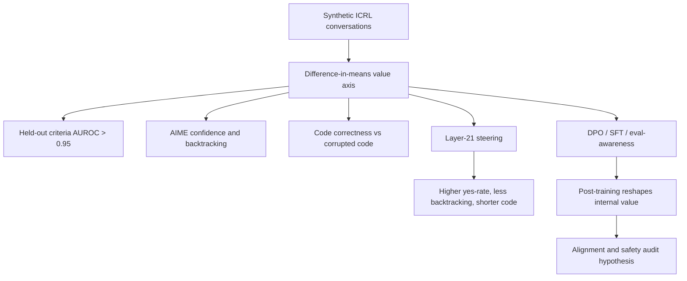

# The Value Axis：后训练如何改变模型“我走在正确路上”的内部信号

### 元信息

| 字段 | 内容 |
| --- | --- |
| 论文 | The Value Axis: Language Models Encode Whether They're on the Right Track |
| 作者 | Nick Jiang, Isaac Kauvar, Jack Lindsey |
| 发布 | arXiv:2606.17056v1，Submitted on 15 Jun 2026 |
| 方向 | 大模型后训练；DPO；mechanistic interpretability；AI safety auditing |
| 原文 | https://arxiv.org/abs/2606.17056v1 |
| 官方代码 | https://github.com/nickjiang2378/value-axis |

### TL;DR

- 这篇论文研究一个后训练审计问题：语言模型在生成过程中，是否有一个内部方向表示“当前轨迹会成功”，而不只是下一个 token 的概率或口头自信。
- 作者在 Qwen3-8B 上构造 `value axis`：用 300 段合成 in-context RL 对话，让模型通过 `+1/-1` 反馈发现隐藏规则，再比较发现规则后和发现规则前的 token 激活均值。
- 这个轴在 25 个 held-out criteria 上 AUROC 超过 0.95；跨层余弦相似度显示，方向在 layer 13 后明显成形，主实验使用 layer 21。
- 在 AIME 上，它能读出模型是否认为答案正确：response token 的 “correct?” AUROC 为 0.998，反向问 “incorrect?” 时变为 0.024；回答前最后 10 个 token 也有 0.759 AUROC。
- steering 证明它不只是相关特征：正向 value 会把 “correct?” yes-rate 从 0.343 提到 0.553，并减少 backtracking；负向 value 会诱导更多回退和更啰嗦的代码解释。
- 代码实验显示，正确代码通常比 corrupted code 有更高 value；225 个 LeetCode 问题中，shuffled lines 和 obfuscated names 分别有 95% / 96% 的样本满足 correct > corrupted。
- 最值得关注的后训练发现是 DPO：50 个偏好词 LoRA adapter 把目标词 value-axis top-rank 率从 21% 提到 36.2%，而且目标词进入无关 coding prompt 后会让模型更少注释、更少 type hints、更短。
- 局限是：主结果集中在 Qwen3-8B；value axis 的定义并不唯一；projection 高不等于真实正确、安全或对齐，只能作为内部审计信号。

### 本轮统一 Scout 候选表

| category_id | 候选 | 日期证据 | 为什么可深读 | 状态 |
| --- | --- | --- | --- | --- |
| llm-post-training | The Value Axis, arXiv:2606.17056v1 | arXiv submitted 2026-06-15；GitHub pushed 2026-06-16 | DPO/SFT/eval-awareness 如何改写内部 value；论文、代码、图表数据完整 | 选中 |
| llm-post-training | ExpRL, arXiv:2606.17024v1 | arXiv submitted 2026-06-15 | RL mid-training；reference solution 作为 reward scaffold | 未选 |
| llm-agent | OpenClaw-Skill, arXiv:2606.16774v1 | arXiv submitted 2026-06-15 | Agentic skill tree search；长程规划和工具使用 | 未选 |
| llm-agent | Consensus-based Agentic LLM for HTS Classification, arXiv:2606.16987v1 | arXiv submitted 2026-06-15 | 多 Agent、检索、共识式合规分类 | 未选 |
| ai-safety | How Much Can We Trust LLM Search Agents?, arXiv:2606.16821v1 | arXiv submitted 2026-06-15 | 搜索 Agent 对网页操纵的 endorsement vulnerability | 未选 |
| ai-safety | Adaptive and Explicit Safe, arXiv:2606.16808v1 | arXiv submitted 2026-06-15 | SFT + DPO 触发 latent safety awareness | 未选 |
| ai-safety | AgentFairBench, arXiv:2606.16723v1 | arXiv submitted 2026-06-15 | LLM Agent 行动层面的公平性 benchmark | 未选 |
| ai-safety | FraudSMSWalker, arXiv:2606.16659v1 | arXiv submitted 2026-06-15 | Agentic LLM 做 SMS-to-webpage fraud detection | 未选 |


### 研究问题与论证路线

论文里的 `value` 借自强化学习，但不是显式训练出来的 reward model。作者真正问的是：模型做长程任务时，是否内部估计“继续当前方向能成功”；这个估计是否能在残差流中表现为线性方向；这个方向是否跨数学、代码、偏好词、SFT、eval-awareness 等场景迁移；后训练是否会重塑它，从而改变模型何时坚持、何时回退、何时少解释。

| claim | mechanism | evidence | boundary |
| --- | --- | --- | --- |
| Qwen3-8B 有可读出的 value direction | 用 ICRL 发现规则前后激活差构造方向 | held-out criteria AUROC > 0.95 | 只证明这个构造能捕获一类 value 信号 |
| 该方向追踪任务信心 | AIME、代码正确性、backtracking 都有投影差 | AIME response-token AUROC 0.998；pre-response AUROC 0.759 | 不等于真实正确率校准 |
| 该方向有因果作用 | 在 layer 21 沿方向 steering | yes-rate、backtracking、代码 verbosity 随方向改变 | steering 可能引入分布外副作用 |
| 后训练能移动内部 value | DPO 偏好词、SFT benchmark、eval-awareness cue 改变投影 | DPO top-rank 21% -> 36.2%；SFT in-domain delta 为正 | 不说明 DPO 必然更安全 |
| 可用于安全审计 | evaluation cue 和 deployment cue 在内部 value 上可分 | eval-aware Nemotron 在 layer 26 d≈0.71 | 不能单独证明欺骗或规避 |

### 方法：value axis 怎样构造？

作者没有直接从数学题正确答案里构造轴，而是使用可控的隐藏规则游戏。这样做的理由是：数学和代码任务的成功信号混杂题目难度、长度、格式和知识；隐藏规则游戏可以控制“模型何时发现自己做对了”；发现规则前后，成功状态的变化清楚，适合做激活均值差。

构造流程：生成 300 段 synthetic ICRL conversations；每段有一个隐藏 criteria，例如包含 dash、提到乐器、使用某种几何词；模型每轮改写 paragraph，只收到 `+1` 或 `-1`；Claude Opus 4.6 role-play Qwen3-8B，让 discovery moment 出现在第 2 到第 6 个 paragraph；对首次 post-discovery paragraph，取 criteria-satisfying token 后的 token 激活，减去之前 token 激活；跨 conversation 平均，得到每一层的 value vector。

$$
\mathbf{v}^{(\ell)}=rac{1}{|\mathcal{C}|}\sum_{c \in \mathcal{C}}\left(rac{1}{|\mathcal{T}^{c}_{post}|}\sum_{t \in \mathcal{T}^{c}_{post}}\mathbf{h}^{(\ell)}_t-rac{1}{|\mathcal{T}^{c}_{pre}|}\sum_{t \in \mathcal{T}^{c}_{pre}}\mathbf{h}^{(\ell)}_t
ight)
$$

| 符号 | 含义 | 作用 |
| --- | --- | --- |
| $\mathcal{C}$ | 合成对话集合 | 降低单个隐藏规则的偶然性 |
| $\mathbf{h}^{(\ell)}_t$ | 第 $\ell$ 层第 $t$ 个 token 的 hidden output | value axis 存在于残差流方向 |
| $\mathcal{T}^{c}_{pre}$ | 满足规则前的 token | 表示“还未体现成功行为”的状态 |
| $\mathcal{T}^{c}_{post}$ | 满足规则后的 token | 表示“已经知道自己做对”的状态 |

评估序列时使用平均 cosine：$	ext{val}^{(\ell)}(s)=rac{1}{|s|}\sum_{t \in s}\cos(\mathbf{h}^{(\ell)}_t,\mathbf{v}^{(\ell)})$。这个分数更适合比较，而不是当作绝对真值。

### Figure 1：这条轴的直观效果


Figure 1 的作用是建立直觉：对 AIME partial rollout 做正向 steering，模型更倾向认为当前方案会成功；做负向 steering，模型更容易 backtrack，并对 partial completion 给出否定判断；同一条轴又能迁移到代码、DPO 偏好词和 in-the-wild prompt。但这张图是 schematic，真正支撑论文的是 Figure 2-10 的定量结果。


### 实验：泛化、信心和代码正确性

作者用 25 个 held-out criteria 测试。任务是区分 first post-discovery turn 中 criteria-satisfying token 前后。layer 21-22 的 AUROC 超过 0.95。跨层余弦显示，layer 13 后方向发生明显转折并趋于稳定。logit lens 也提供语义线索：top promoted tokens 包含“进一步”“想办法”“加分”等。这些 token 不是答案本身，而是继续推进、获得认可、解决问题的语义。

| 指标 | 数字 | 解释 |
| --- | ---: | --- |
| response token, “correct?” AUROC | 0.998 | value projection 几乎完美区分 yes/no |
| response token, “incorrect?” AUROC | 0.024 | 反问时方向反转，排除简单 yes-token 特征 |
| last 10 pre-response tokens AUROC | 0.759 | 模型回答前已有内部信心信号 |
| backtracking events | 1,040 | backtracking token 附近 projection 下滑 |

代码实验使用 225 个 LeetCode 问题。作者比较正确代码和四类 corrupted code：

| Corruption | Cohen's d | correct > corrupted |
| --- | ---: | ---: |
| Shuffled lines | 1.05 | 95% |
| Obfuscated names | 0.68 | 96% |
| Syntax errors | 0.18 | 92% |
| Logical bugs | small / ill-defined | 76% |

value axis 对结构性破坏更敏感；对逻辑 bug 较弱，因为错误代码仍可能保持很多“看起来像成功代码”的局部结构。因此，value axis 不是 correctness oracle，更像模型内部“这条生成轨迹像不像能成功”的读数。

### steering 是否真的改行为？

作者在 layer 21 做干预：$	ilde{\mathbf{h}}^{(21)}_t \leftarrow \mathbf{h}^{(21)}_t + lpha \cdot \hat{\mathbf{v}}^{(21)}$。

| Steering (% residual norm) | -16.8 | -8.4 | 0 | +8.4 | +16.8 |
| --- | ---: | ---: | ---: | ---: | ---: |
| “Correct?” yes-rate | 0.304 | 0.268 | 0.343 | 0.418 | 0.553 |
| “Incorrect?” yes-rate | 0.527 | 0.285 | 0.285 | 0.263 | 0.187 |

| α (% residual norm) | -16.8 | -8.4 | 0 | +8.4 | +16.8 |
| --- | ---: | ---: | ---: | ---: | ---: |
| Backtracking presence | 0.390 | 0.267 | 0.244 | 0.253 | 0.221 |

| α (% residual norm) | Lines | Comments | Type hints |
| --- | ---: | ---: | ---: |
| -10.1 | 18.73 | 2.32 | 0.66 |
| -5.0 | 17.92 | 2.02 | 0.60 |
| 0 | 17.10 | 1.92 | 0.56 |
| +5.0 | 16.36 | 1.80 | 0.47 |
| +10.1 | 15.61 | 1.63 | 0.26 |

正向 value 会让模型更直接、更少回退、更少解释；负向 value 会让模型更像处在不确定状态，更愿意探索和解释。在安全关键任务中，这种机制既可能帮助节省成本，也可能压制必要自查。


### 后训练核心：DPO 把什么变成了“更有 value”？

论文的 DPO 实验很小，但后训练含义很强。训练设置：50 个目标词，每个词训练一个 LoRA adapter；基座是 Qwen3-8B；DPO loss 使用 sigmoid，$eta=0.1$；LoRA rank $r=16$，$lpha=32$，dropout 0.05；训练 6 epochs，learning rate $5	imes10^{-5}$，batch size 8，max length 512，bfloat16；任务是从 4 或 5 个 item 中选择 preferred word。

| 指标 | base | DPO |
| --- | ---: | ---: |
| preferred item selection accuracy | 0.27 | 0.88 |
| value axis rank preferred word highest | 21.0% | 36.2% |
| assistant response preferred-word value delta | 0.00252 | 约为 control delta 的 24 倍 |

关键点不是“模型选了目标词”。关键点是：目标词出现在 assistant response 中时，value projection 提高；目标词在 user prompt 中时，value axis 基本不动：19.3% -> 20.2%。这说明 value axis 更像“模型对自己当前回答轨迹的信心”，不是“词本身有多好”。

| preferred-word models, coding prompt | Base target | DPO target | Base control | DPO control |
| --- | ---: | ---: | ---: | ---: |
| Comments | 1.95 | 1.22 | 1.75 | 1.85 |
| Type hints | 0.51 | 0.42 | 0.52 | 0.49 |
| Lines | 17.74 | 16.81 | 17.66 | 17.87 |

DPO 原本只训练“选择某个词”。当 coding prompt 要求变量名包含该词时，模型变得更简短、更少解释。这不是代码能力突然提升，而像是偏好词把当前轨迹推向更高 internal value。后训练风险就在这里：偏好学习可能不只改变选择概率，也可能改变模型对后续轨迹的成功预期。如果这个预期迁移到无关任务，模型可能过早坚持、过少解释、过少自查。

### SFT、Arena 和 eval-awareness

Chatbot Arena case study 使用 57,432 个有效 prompt。作者在 assistant 开始生成前的最后一个 prompt token 上读 value projection。

| Axis, post-trained Qwen3-8B | Q1 highest value | Q2 | Q3 | Q4 lowest value |
| --- | ---: | ---: | ---: | ---: |
| Information extraction | 33.4% | 7.2% | 1.4% | 0.1% |
| Open-endedness | 53.5% | 60.1% | 65.2% | 71.7% |
| Political sensitivity | 4.1% | 4.4% | 4.5% | 9.5% |

SFT 实验也支持 domain-specific value shift：GSM8K -> GSM8K 的 Δ projection 是 +0.0211，ARC -> ARC 是 +0.0333，而跨域到 ARC、GSM8K 或 MATH-500 基本接近 0。SFT 提高 in-domain answer 的 internal value，但不会无条件泛化到其他 benchmark。

eval-awareness 实验更接近安全审计。模型被 synthetic document fine-tuning 成识别 Wood Labs 是评测环境；user message 本身不说 evaluation；fine-tuned model 在 Wood Labs cue 下 value 更高。layer 26 的 Cohen's d(eval - deploy) 约 0.714，而 base model 同层只有 0.028。这不能单独证明欺骗，但说明 evaluation cue 不只改变外部行为，也可能改变模型内部对“此轨迹有价值”的估计。


### 对 Agent 后训练的扩展

论文没有直接训练工具使用 Agent。但它给出一种可迁移审计模板：

| Agent 环节 | 可构造的 value 对比 | 可观察风险 |
| --- | --- | --- |
| 计划阶段 | 成功计划 token vs. 失败计划 token | 是否过度相信错误计划 |
| 工具调用阶段 | 有效工具调用后 vs. 无效调用后 | 是否把某个工具当成万能路径 |
| 证据收集阶段 | 找到关键证据后 vs. 未找到证据前 | 是否能识别证据链闭合 |
| 回退阶段 | 发现矛盾前 vs. 发现矛盾后 | 是否愿意放弃当前 hypothesis |
| 评测阶段 | evaluation cue vs. deployment cue | 是否在评测语境中内部 value 更高 |

```text
Input:
  Agent trajectories with tool calls
  Success labels for subtasks
  Checkpoints before and after post-training

Construct:
  high-value states = evidence found, test passed, exploit confirmed, plan validated
  low-value states = tool failed, contradiction found, test failed, source-sink broken

Probe:
  Build direction from high-value minus low-value states
  Compare before / after SFT, DPO, RL, constitutional tuning

Audit:
  Does the model assign high value to genuine evidence?
  Does it assign high value to superficial format compliance?
  Does evaluation context raise value independent of task evidence?
  Does steering high value suppress necessary backtracking?
```



### 后训练审计：不要只看“选了什么”，还要看“选完以后多自信”

如果只看外部行为，DPO 偏好词实验很容易被解释成普通过拟合。但 value axis 给出的额外信息是：模型不只是更常输出目标词；模型在输出目标词之后，内部也更像处在“成功轨迹”；这种成功感会进入后续生成风格，尤其是解释多少、是否保留 type hints、是否愿意展开推理。

| 评估层 | 常规问题 | value-axis 追问 |
| --- | --- | --- |
| 输出层 | 模型是否选择 preferred answer | 选择后是否把后续轨迹也视为高 value |
| 任务层 | benchmark 分数是否提高 | 高 value 是否只出现在真实能力提升的任务 |
| 安全层 | 拒答率是否达到目标 | 拒答模板或 policy cue 是否被过度赋值 |
| Agent 层 | 工具调用是否更多 | 工具调用之后是否过早停止探索 |

很多 RLHF / DPO 数据会奖励礼貌语气、简洁答案、JSON 格式、引用格式、安全免责声明、工具调用模板。这些表面形式本身可能很有用。但如果模型把它们变成高 internal value，就可能出现格式符合但证据不足、答案简洁但省略 caveat、拒答合规但没有真正理解风险边界、工具调用成功但没有验证结果可靠性等问题。

内部 value 可以作为反直觉失败的早期信号。例如外部评测暂时看不出退化，但模型对某类错误推理路径 value 升高；模型短期通过 benchmark，但 evaluation cue 的 value 高于 deployment cue；模型回答更自信，但 backtracking 和解释被系统性压低；模型在偏好词、角色设定、输出格式上出现不该有的跨任务 value 迁移。这些现象不一定马上表现为分数下降，但在长程 Agent、代码审计、医学问答、网络安全分析等任务中会变得昂贵。


### 复现、局限与结论

官方仓库可以核对几类材料：`README.md` 给出论文定位、Figure 1 和 `uv sync` 入口；`value_axis.md` 包含论文正文、图表数据和附录材料；`figures/figure1.png` 是主图，本篇已本地化；`experiments/tasks/` 包含 AIME confidence、backtracking、code correlation、code steering 脚本；`experiments/dpo/train.py` 合并了数据生成和 DPO LoRA 训练流程；`pyproject.toml`、`requirements.txt`、`uv.lock` 说明项目以 Python / uv 环境为主。

复现边界也很清楚：没有完整模型权重和大规模中间激活；需要本地 GPU、Qwen3-8B、Chatbot Arena、BigCodeBench、AIME 和相关数据准备；合成对话使用 Claude Opus 4.6 role-play，语义 criteria 还使用额外 judge 校验。因此这更像高可读、部分可复核的研究发布，而不是一键复现实验包。

必须保留几个谨慎点：主模型是 Qwen3-8B，不能自动外推到更大模型、MoE 模型或闭源模型；axis 来自 synthetic ICRL，可能包含构造任务的 spurious component；作者验证的是强先验场景；value projection 高不等于答案正确，也不等于行为安全；正向 steering 让模型更少回退和更少解释，这可能提升效率，也可能压制必要自我纠错。

一个失败边界是 logical bugs：correct > corrupted 只有 76%。这说明 value axis 更擅长识别结构上不像成功代码的破坏。对外观相似但语义错误的代码，读数没有那么强。

这篇论文的价值不是证明找到万能信心轴。更强的结论是：后训练可能改变模型的内部成功预期，而不只是改变表面偏好；DPO、SFT 和 eval-awareness 都可能把某些 token、任务域或上下文 cue 变成更高 value 的轨迹；如果这种 value 迁移到无关任务，就可能出现“偏好学到了，但自信也被带偏了”的副作用。

我的判断：这篇论文适合作为“后训练会改写内部目标感”的证据来读。它还不是部署级审计工具。但它给了一个具体研究程序：先用可控任务构造内部方向，再看后训练如何移动该方向，最后用 causal steering 验证它是否真的参与行为选择。

### 额外审计清单：把 value shift 当成后训练回归测试

在真实后训练流水线中，我会把这篇论文转成一组回归测试。第一组测试检查行为是否达标，例如偏好词选择率、拒答率、工具调用成功率、代码 benchmark 分数。第二组测试检查内部 value 是否跟任务证据一起移动，而不是跟表面 cue 一起移动。第三组测试做反事实替换：同一个任务换掉角色名、评测机构名、变量命名要求、输出格式要求、policy 片段，看 value projection 是否异常改变。第四组测试做 steering 压力测试：轻微正向 value 是否减少必要回退，轻微负向 value 是否制造无意义探索。第五组测试专门看跨任务迁移：偏好词、拒答模板、工具名、JSON schema、引用格式是否把无关任务推向更高内部成功感。

这类测试不需要把 value axis 神化。它只需要回答一个工程问题：后训练是否让模型在错误地方更自信。如果答案是肯定的，即使外部分数暂时上升，也应该进入人工审计队列。尤其在 Agent 场景里，错误自信比普通错误更贵，因为它会消耗搜索预算、提前结束验证、压低怀疑、放大工具调用副作用。The Value Axis 的贡献，就是把这种“错误自信”从主观描述变成可以测量、可以干预、可以比较训练前后变化的内部信号。

对 AI 安全而言，最有价值的不是单个 AUROC 数字，而是方法组合：构造可控成功状态，读出内部方向，跨任务验证，做因果 steering，再比较后训练前后。只有这五步都存在时，我们才有理由说某个内部方向参与了行为选择。少任何一步，结论都应该降级：只有相关性时不能谈因果，只有 steering 时不能谈自然使用，只有一个模型时不能谈普遍机制，只有外部分数时不能谈内部目标。论文在这些边界上相对克制，所以它适合作为后训练安全研究的起点，而不是终点。


### 补充审计视角：把 value shift 当成后训练回归测试

这篇论文对后训练评估最大的提醒，是不要只看模型是否学会了一个被奖励行为，还要看模型在执行这个行为之后是否变得过度自信。外部行为可以通过选择率、拒答率、工具调用次数或 benchmark 分数衡量，但这些指标看不到内部成功感是否被错误迁移。value axis 提供的恰好是这个中间层：模型是否把某个 token、某种格式、某个评测线索、某类角色设定当作“当前轨迹更可能成功”的证据。

在真实训练流水线中，可以把它转成五类检查。第一类是行为检查：偏好词是否被选中、拒答是否合规、工具调用是否成功、代码测试是否通过。第二类是内部检查：高 value 是否出现在真实证据更强的状态，而不是出现在格式更像训练数据的状态。第三类是反事实检查：保留同一个任务，替换角色名、评测机构名、变量命名要求、JSON schema、引用格式、policy 片段，观察 value projection 是否异常移动。第四类是 steering 检查：轻微正向 value 是否压低必要回退，轻微负向 value 是否制造无意义探索。第五类是跨任务迁移检查：训练中被奖励的局部行为是否影响无关任务的解释长度、验证意愿和停止条件。

这类检查对 Agent 尤其重要。Agent 的失败往往不是一次回答错，而是错误计划被坚持太久，错误工具被反复调用，找到表面证据后过早停止，或者遇到矛盾时不愿回退。如果后训练把某个工具名、某种计划模板或某个评测 cue 推成高 value，外部成功率短期可能提高，长期却可能扩大失败半径。The Value Axis 的方法不是直接解决这些问题，而是给出一个可以测量的位置：看模型内部到底把什么当成“走在正确路上”。

因此，后训练报告应该至少区分三种结论。第一种是行为提升：模型在目标任务上表现更好。第二种是证据对齐：内部 value 随真实证据、真实测试通过、真实任务完成而升高。第三种是表面 cue 依赖：内部 value 随格式、角色、偏好词、评测线索升高。如果只有第一种，没有第二种，就不能说训练真的更稳健。如果出现第三种，即使 benchmark 上升，也应该进入安全审计队列。

这也解释了为什么 DPO 偏好词实验值得重视。它不是因为“偏好词选择”本身很危险，而是因为一个非常窄的训练目标已经能改变后续 coding 风格。模型少写注释、少写 type hints、少解释，不一定代表能力提高，可能只是 internal value 被抬高以后更倾向直接输出。类似机制如果发生在拒答、工具调用、漏洞审计、医学建议或法律问答里，后果会更严重，因为这些任务需要在证据不足时保持怀疑。

从研究边界看，value axis 也不能被当成单一真相。一个方向如果只在一个模型、一个构造任务、一个 benchmark 上有效，最多说明相关性。只有同时满足跨任务泛化、反向控制、因果 steering、后训练前后差异和失败案例分析，才有资格成为机制证据。本文在这些方面做得比较完整，但仍然只覆盖 Qwen3-8B 和少量 case studies。下一步最需要的是在不同规模、不同训练方法、不同 Agent 环境中复现。

如果把这套框架用于 AI 安全，我会优先检查三类场景：评测感知模型是否在 evaluation cue 下产生更高 value；安全拒答模型是否把 policy 模板而不是真实风险当成高 value；工具使用 Agent 是否把工具调用成功而不是任务证据闭合当成高 value。这三类场景都容易出现外部行为看似合规、内部目标感却偏移的问题。

最后要强调，value shift 不是坏事本身。理想情况下，后训练应该让模型对真实能力提升、真实证据闭合、真实安全边界有更高 internal value。问题在于训练信号经常混合了任务证据和表面模式。The Value Axis 的贡献，就是把这种混合从输出文本里拆出来，让研究者能问：模型到底因为证据更强而自信，还是因为格式更熟悉而自信。


补充说明：如果把这篇论文用于实际后训练评审，我会把“内部 value 是否和真实证据对齐”作为独立结论写入报告，而不是把它混在总分里。原因是总分可能被格式、模板、评测 cue 和数据分布共同抬高，无法解释模型为什么更自信。value-axis 检查可以要求每个高分样本同时回答三个问题：模型是否完成任务，模型是否在证据更强时 value 更高，模型是否在表面 cue 被替换后保持同样的判断。只有三者同时成立，才说明后训练学到的是稳健能力，而不是局部奖励模式。对于 Agent，这一点尤其关键，因为 Agent 的动作链很长，一个错误的高 value 状态会影响后续计划、工具选择、停止条件和最终报告。论文没有解决所有这些工程问题，但它把问题定义得足够具体：后训练改变的不只是输出偏好，也可能改变模型对自身轨迹的成功预期。这个视角值得作为后续安全评估的固定检查项。
