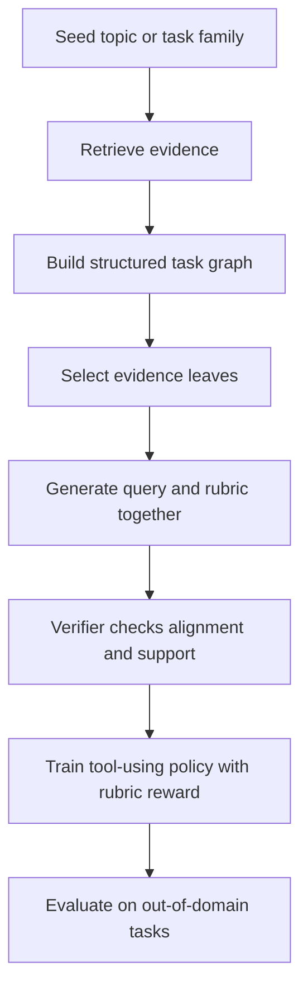

# DEEPRUBRIC：用证据树生成 rubric，让深度研究 Agent 的 RL 更省样本

### 元信息

| 字段 | 内容 |
| --- | --- |
| 论文 | DEEPRUBRIC: Evidence-Tree Rubric Supervision for Efficient Reinforcement Learning of Deep Research Agents |
| 作者 | Minghang Zhu, Chuyang Wei, Junhao Xu, Yilin Cheng, Zhumin Chen, Jiyan He |
| 发布 | arXiv:2606.17029，Submitted on 15 Jun 2026 |
| 方向 | 大模型 Agent；大模型后训练；open-retrieval deep research |
| 原文 | https://arxiv.org/abs/2606.17029 |
| 官方代码 | https://github.com/ZMingHang/DeepRubric-Code |

### TL;DR

- 这篇论文研究的是一个很具体的后训练问题：深度研究 Agent 需要写长报告、调工具、引用证据，RL 奖励如果只来自最终答案或 query-first rubric，容易漏掉真实信息需求，导致 rollout 很贵但学习信号很稀。
- 作者提出 DeepRubric：先从 Wikipedia 与 OpenScholar 本地语料构造 evidence tree，再从树的叶子自底向上合成研究问题和 rubric，让 query 与评分标准共享同一批证据来源。
- 数据流程是：9,838 棵证据树，平均 54.5 个节点、38.7 个叶子；经过 GPT-5.1 verifier 后保留 9,064 个 query-rubric pair，保留率 92.1%，其中 91.5% 是结构性 revise，不是开放式重写事实。
- 训练流程是：Qwen3-8B 冷启动 SFT 200 条轨迹，约 3 GPU-hours；随后用 8,886 条 query-rubric pair 做 140 step GRPO，约 750 GPU-hours，reward 由 rubric、格式、引用、搜索四部分组成。
- 主结果是：DeepRubric-8B 在 SQAv2、ResearchQA、DRB 三项平均 68.3；Qwen3-8B + Search 是 40.6；DR Tulu-8B 1900-step 是 68.2，但需要约 9,700 RL GPU-hours。
- 关键数字：DeepRubric 用 140 RL steps 接近或超过 DR Tulu 1900-step 终点，RL step 少 13.6 倍，端到端估算成本约 1.7K 美元，对比 DR Tulu 至少 30K 美元。
- 消融显示：完整 tree-based rubric 75-step 平均 67.1；去掉 revision 是 65.6；search-based query-first rubric 是 63.3；closed-book query-first rubric 是 64.8。说明树结构带来的监督信号不能简单用检索上下文补回来。
- 局限也明显：训练数据来自固定本地语料，评测仍依赖 LLM judge，verifier 使用 GPT-5.1，开源仓库不包含大语料、FAISS index、生成数据、checkpoint 或私有服务配置，复现成本仍高。

### 手动统一 Scout 候选表

> 唯一 Scout Agent 超时后已关闭；下面是主 Agent 按同一“合并三方向”契约完成的统一候选表，未重新启动第二个 Scout。

| category_id | 候选 | 日期证据 | 为什么可深读 | 去重状态 |
| --- | --- | --- | --- | --- |
| llm-agent / llm-post-training | DeepRubric, arXiv:2606.17029 | arXiv submitted 2026-06-15 | 证据树、rubric reward、GRPO、三 benchmark、成本消融都完整 | 本地未命中 |
| llm-post-training | Context-Aware RL for Agentic and Multimodal LLMs, arXiv:2606.17053 | arXiv published 2026-06-15 | context-selection objective，coding trajectory 与 VQA 双域 | 本地未命中 |
| ai-safety / llm-agent | SearchGEO, arXiv:2606.16821 | arXiv published 2026-06-15 | 搜索 Agent 对网页操纵的 endorsement vulnerability | 本地未命中 |
| llm-agent | TokenPilot, arXiv:2606.17016 | arXiv published 2026-06-15 | 长程 Agent context 管理，缓存连续性与成本 | 本地未命中 |
| llm-post-training / llm-agent | PathRouter, arXiv:2606.16409 | arXiv published 2026-06-15 | Agentic GraphRAG 的 evidence-path reward 与 GRPO scaling | 本地未命中 |
| llm-post-training | The Value Axis, arXiv:2606.17056 | arXiv published 2026-06-15 | post-training 如何改变内部 value 表征 | 本地未命中 |
| llm-agent | MyPCBench, arXiv:2606.16748 | arXiv published 2026-06-15 | 个人化 computer-use Agent benchmark | 本地未命中 |
| ai-safety / llm-agent | Misinformation Propagation in Benign Multi-Agent Systems, arXiv:2606.16710 | arXiv published 2026-06-15 | 多 Agent 中错误上下文传播与聚合协议 | 本地未命中 |

选择 DeepRubric 的原因：

- 它同时覆盖 Agent 和后训练，和本轮允许的三类范围高度贴合。
- 论文不是只给一个 benchmark，而是完整呈现：数据构造、reward 公式、训练配置、主结果、消融、数据统计、case study。
- 官方代码仓库在 2026-06-15 有 “Improve reproducibility paths” 提交，README 也给出可复现闭环。

### 研究问题：为什么深度研究 Agent 的 rubric 不能只从 query 里猜？

论文的核心问题不是“再训练一个能搜索的模型”，而是：

- 深度研究任务的 query 往往很短。
- query 背后的真实信息需求可能横跨多个证据面。
- 如果让模型直接从 query 推测 rubric，它只能猜“应该评价什么”。
- 如果这个 rubric 漏掉关键事实面，RL 就会奖励错误方向。

作者把这个问题放在 deep research Agent 的成本结构下看：

- 每个 rollout 不是普通问答，而是多轮搜索、浏览、学术检索、引用和长文生成。
- reward 一旦噪声大，就会浪费很多 GPU-hours。
- 先前系统可以需要数千到上万 GPU-hours。
- 因此，“rubric 的证据对齐”本身就是一个后训练效率问题。

可以把作者的论证写成一张表：

| claim | mechanism | evidence | boundary |
| --- | --- | --- | --- |
| query-first rubric 信息不足 | query 很少显式列出所有可验证信息需求 | Figure 1 对比 query-first 与 evidence-first | 没证明所有 query-first 方法都失败 |
| evidence tree 能生成更对齐的监督 | 先检索和分解，再从叶子合成 query 与 rubric | 9,064 retained pairs；平均 7.0 个 rubric criteria | 依赖本地语料质量和 LLM verifier |
| 更好的 rubric 提高 RL 效率 | reward 更密、更结构化，减少无效 rollout | 140 steps / 750 RL GPU-hours 达到 68.3 average | 仍是 8B 模型和三套 benchmark 的证据 |
| 树结构不是普通检索上下文可替代 | query 固定时，去掉树只用 query 或 search context 生成 rubric 会下降 | Table 2：完整 67.1，对比 search-based 63.3 | 只消融了 75-step 训练设置 |

### 方法机制：先构树，再合成问题和评分标准

论文把训练任务表示成证据树：

```text
T = (V, E, v0)

v in V 包含：
1. q_v：当前节点要查的信息子问题
2. P_v：检索到的文档集合
3. Ch(v)：从该节点分解出的子问题

Leaf(T) = { v in V : Ch(v) = empty }
```

这个定义的意义：

- `q_v` 让任务从“一个大 query”变成多层信息需求。
- `P_v` 让每个子问题都要被文档支撑。
- `Leaf(T)` 不是装饰，它决定后续哪些事实可以进入 rubric。
- 根节点 `v0` 代表 broad topic，叶子代表可验证的细颗粒证据面。

Top-down expansion 的流程：

```text
Input: corpus C, retriever rho, LLM M, max depth D_max
Output: dataset D = {(x_i, T_i, R(T_i))}

for topic t sampled from C:
  v0.q = t
  v0.P = rho(t)
  Queue = {v0}

  while Queue not empty:
    v = Queue.pop()
    if depth(v) == D_max or M judges q_v atomic:
      continue

    child_queries = M(q_v, P_v, Anc(v))
    for child query q_tilde:
      P_tilde = rho(q_tilde)
      if P_tilde sufficient and q_tilde non-redundant:
        add child node u(q_tilde, P_tilde)
        Queue.push(u)

  x, R(T) = synthesize bottom-up from T
  x, R(T) = verify or revise
  add (x, T, R(T)) to D
```

几个设计点值得单独拆开：

- 最大深度固定为 3。
- root 最多 6 个子问题。
- 中间层最多 4 个子问题。
- 更深层最多 3 个子问题。
- 平均树规模是 54.5 个节点、38.7 个叶子。
- 91.40% 的终端叶子到达深度 3。

这不是“越深越好”的树搜索。作者的取舍是：

- 够深，才能覆盖机制、风险、比较、量化证据。
- 不无限展开，避免检索调用、上下文长度、重复叶子和 topic drift 爆炸。
- 让树成为生成 query-rubric 的信息骨架，而不是原始资料堆。

### Query-rubric co-generation：rubric 的证据约束在哪里？

树构好后，DeepRubric 不直接把所有叶子丢给模型生成答案，而是让模型自底向上合成：

- 一个自然语言研究问题 `x`。
- 一组 rubric criteria `R(T)`。
- 一个可视化 merge trace。
- 被选择的 leaf IDs。

Rubric criterion 形式是：

```text
r = (c_r, P_r, tau_r, w_r), r in R(T)

c_r   = 可验证的自然语言标准
P_r   = 支撑该标准的证据文档或空集
tau_r = factual 或 logical
w_r   = 重要性权重，范围 [0, 1]
```

这组变量的研究意义：

- `factual` rubric 必须绑定 evidence leaf。
- `logical` rubric 可以不绑定文档，因为它评价综合、比较、结构与推理。
- `w_r` 让 reward 不只是平均打分，而是强调核心信息需求。
- `source_leaf_ids subset selected_leaf_ids` 是关键约束，防止 verifier 或 synth model 引入外部事实。

作者在 Appendix C.2 给出的 bottom-up prompt 也很有信息量：

- 先选择一小批覆盖不同 facet 的叶子。
- 从叶子合并成 intermediate query。
- 再合并成 final research question。
- factual rubric 只能用 selected leaves 的 evidence。
- 如果树里有误导或有害节点，要避开；必要时用负向 rubric 要求排除。

这说明 DeepRubric 的“rubric supervision”不是写一份评分表那么简单。它把评分表变成了检索树的派生产物。

### Verification：91.5% revise 是增强还是泄漏？

论文里最容易被质疑的一点是：

- GPT-5.1 verifier 修改了 91.5% 的样本。
- 那么最后的监督信号到底来自 evidence tree，还是来自强模型？

作者的回答分两层：

1. Verifier 不是开放事实生成器。
2. Revision 主要修结构，不允许注入新证据。

Table 7 的 revision reason：

| 修订原因 | 比例 |
| --- | ---: |
| Question-rubric mismatch | 56.4% |
| Evidence sufficiency / grounding | 18.2% |
| Question scope / merge overreach | 8.3% |
| Negative-weight rubric removal | 8.2% |
| Rubric design / granularity | 5.3% |
| Entity / domain / time mismatch | 2.5% |
| Other | 1.0% |

这张表支撑的判断：

- 主要问题是 query 与 rubric 的结构对齐。
- 第二类是 evidence sufficiency，而不是新增事实。
- verifier prompt 明确要求 revised factual rubric 的 `source_leaf_ids` 必须来自 selected leaves。
- 因此 verifier 更像 reward-spec auditor，不像知识扩写器。

但边界也要承认：

- 这仍然依赖 GPT-5.1 的判断质量。
- 如果 verifier 对“deep research suitability”的偏好有偏差，会影响训练分布。
- 论文用 no-revision 消融缓解这个质疑，但没有完全消除强模型偏好迁移问题。

### RL reward：DeepRubric 到底优化了什么？

论文使用 GRPO，报告 `y` 由 policy 采样：

```text
y ~ pi_theta(. | x)
```

单个 rubric reward 是加权平均：

```text
R_rubric(y) = sum_{r in R(T)} w_r * s_r(y) / sum_{r in R(T)} w_r

s_r(y) in [0, 1]
```

其中：

- `s_r(y)` 来自 LLM-as-a-judge。
- 原始评分是 0 到 4 的整数，再归一化。
- `w_r` 是该 criterion 的重要性。
- factual criterion 由证据叶子支撑。

最终 composite reward：

```text
R(y) =
  0.5 * R_rubric(y)
  + 0.2 * R_format(y)
  + 0.2 * R_cite(y)
  + 0.1 * R_search(y)
```

这个权重设计表达了一个现实判断：

- rubric 是主奖励，占 0.5。
- 但 deep research Agent 不能只满足内容 rubric。
- 格式、引用、搜索行为都会影响长报告质量。
- 因此 reward 同时约束“写什么”和“怎么查、怎么引、怎么呈现”。

### 训练环境：为什么本地 retriever 很关键？

DeepRubric 训练时用三个本地工具：

| 工具 | 训练后端 | 评测后端 |
| --- | --- | --- |
| search | 本地 Wikipedia dense retrieval | Serper API 的 Google Search |
| browse | 本地 Wikipedia full text | Jina Reader |
| scholar | 本地 OpenScholar retrieval | Serper API 的 Google Scholar |

这样做的直接收益：

- RL rollout 不需要每一步打外部搜索 API。
- latency 和成本更可控。
- 训练数据的 evidence tree 与训练工具环境一致。
- 能复现实验，不被实时网页漂移影响。

但这也带来泛化问题：

- 训练是 local corpus。
- 评测是 live search tools。
- 如果模型只学会固定语料的检索模式，迁移会失败。

论文用三个 out-of-domain open-retrieval benchmark 测试这个风险：

- AstaBench-ScholarQA-CS2，简称 SQAv2。
- ResearchQA。
- DeepResearch Bench，简称 DRB。

主结果显示迁移有效，但这不等于真实网页全域泛化已经解决。它说明的是：树生成的 query-rubric supervision 学到了一些通用的分解、检索、组织和引用行为。

### 主结果：一个 8B 模型如何接近昂贵的 open rubric-RL baseline？

Table 1 的核心对比可以压缩成下面这张表：

| 方法 | SQAv2 overall | ResearchQA | DRB overall | 三项平均 | RL 训练成本 |
| --- | ---: | ---: | ---: | ---: | ---: |
| Qwen3-8B + Search | 57.2 | 46.3 | 18.2 | 40.6 | 无 DeepRubric RL |
| DR Tulu-8B SFT | 72.3 | 68.5 | 39.0 | 59.9 | SFT |
| DR Tulu-8B 1900-step | 86.8 | 74.3 | 43.4 | 68.2 | 约 9,700 RL GPU-hours |
| DeepRubric SFT | 79.5 | 64.8 | 38.0 | 60.8 | 约 3 GPU-hours SFT |
| DeepRubric 75-step | 85.1 | 74.2 | 41.9 | 67.1 | 约 402 GPU-hours |
| DeepRubric 140-step | 86.0 | 75.2 | 43.6 | 68.3 | 约 750 GPU-hours |

最重要的不是 68.3 比 68.2 高 0.1。更重要的是：

- DR Tulu 用 1,900 step。
- DeepRubric 用 140 step。
- DR Tulu RL 约 9,700 GPU-hours。
- DeepRubric RL 约 750 GPU-hours。
- 两者 backbone 规模相近，都是 Qwen3-8B 系列语境下的深度研究 Agent。

按作者的说法，DeepRubric 的优势来自 reward signal quality：

- rubric 在 RL 前已经由 evidence tree 生成并验证。
- rollout 不需要边训练边把 query-conditioned rubric 演化出来。
- reward 对长报告的信息需求更具体。

### 训练效率：140 step 后继续训练为什么收益变小？

Figure 3 和正文给出一个值得注意的现象：

- DeepRubric 140 step：SQAv2 86.0，DRB 43.6。
- 继续到 190/235/285 step：DRB 大体稳定在 43.1/43.6/43.8。
- SQAv2 反而从 86.3 到 86.0 再到 84.6。

作者解释为 corpus saturation：

- 固定本地检索环境里，policy 很快学到如何利用有限 evidence space。
- 后续训练可能让答案更长、claim 更多。
- claim 更多时，如果引用 recall 跟不上，SQAv2 可能下降。

这对 Agent 后训练有一个现实提醒：

- 长程 tool-use RL 不是步数越多越好。
- 当 reward 包含 citation 与 format 时，长答案扩张会制造新的失败面。
- 训练曲线需要同时看任务分数、引用质量和报告长度，而不是只看最终 reward。

### 成本表：这篇论文最强的工程论点

Table 3 的成本对比：

| 方法 | 数据标注 | SFT | RL training | GPU | 估算成本 |
| --- | --- | ---: | ---: | --- | ---: |
| DR Tulu-8B | GPT-5 16K trajectories | 136 GPU-hours | 9,700 GPU-hours | 8-16 x H100 | >= 30K 美元 |
| DeepRubric 8B | 180 美元 API | 3 GPU-hours | 750 GPU-hours | 8 x A100 | 约 1.7K 美元 |

作者强调两个 reduction：

- 训练 step：140 对 1,900，约 13.6 倍更少。
- 成本：约 1.7K 对至少 30K，约 17 倍更低。

要谨慎读这个数字：

- GPU 租用价格会随市场变化。
- DR Tulu 与 DeepRubric 的数据路径不同，不能完全视为“同一个方法换一个模块”。
- DeepRubric 没把所有外部大语料准备成本都算成用户零成本。

但工程结论仍然成立：

- 如果 reward 设计更准确，长程 Agent RL 的样本效率会显著改变成本曲线。
- 对 deep research 这类昂贵任务，数据构造质量可能比简单增加 rollout 更重要。

### 消融：树结构到底贡献了什么？

Table 2 固定训练 query，只替换 rubric 来源：

| Variant | SQAv2 | ResearchQA | DRB | Avg. |
| --- | ---: | ---: | ---: | ---: |
| Ours full | 85.1 | 74.2 | 41.9 | 67.1 |
| w/o revision | 83.8 | 73.2 | 39.9 | 65.6 |
| Search-based rubrics | 80.6 | 72.1 | 37.3 | 63.3 |
| Closed-book rubrics | 83.2 | 70.4 | 40.7 | 64.8 |

可以读出三层结论：

1. 完整方法最好，说明 tree + revision 的组合有效。
2. 去掉 revision 下降 1.5 平均分，说明 verifier 有用。
3. Search-based query-first 比 closed-book 还低，说明“给 query-first rubric 多一点检索上下文”不一定恢复树结构。

为什么 search-based 可能更差？

- 检索结果由最终 query 驱动。
- 最终 query 已经压缩了多叶子结构。
- 检索上下文可能覆盖局部相关资料，但缺少树的 decomposition trace。
- Rubric 仍然不知道哪些 facet 是从同一棵树合并而来。

这也是这篇论文最值得带走的研究观点：监督信号不是只由“材料数量”决定，也由“材料的组织方式”决定。

### 数据统计：9,064 个 pair 背后是什么分布？

Appendix C.3 给出的训练数据统计：

| Statistic | Value |
| --- | ---: |
| Generated examples | 9,838 |
| Final retained | 9,064 (92.1%) |
| Tree depth | 3 |
| Nodes per tree | 54.5 |
| Leaves per tree | 38.7 |
| Selected leaves per example | 5.0 |
| Evidence passages per selected leaf | 2.9 |
| Rubric criteria per example | 7.0 |
| Factual / Logical | 58.4% / 41.6% |
| Revision rate | 91.5% |
| Drop rate | 7.9% |
| Tree generation model | DeepSeek-V3.2 |
| Quality audit model | GPT-5.1 |
| SFT subset size | 200 |
| SFT annotation model | GPT-5.1 |

这些数字解释了 DeepRubric 为什么能训练“研究型”行为：

- 每个样本不只是一个问答 pair。
- 平均 5.0 个 selected leaves 支撑一个研究问题。
- 平均 7.0 个 rubric criteria 覆盖 factual 与 logical 两类标准。
- logical criteria 占 41.6%，说明它不仅检查事实命中，也检查综合、比较和推理。

这也解释了为什么它可能比单文档训练更贴近 DRB：

- DRB 不是只问“某个事实是什么”。
- 它要求报告组织、证据选择、跨来源综合。
- evidence-tree synthesis 训练分布更接近这种多面问题。

### 代码仓库：复现路径给了什么，没给什么？

官方 GitHub 仓库 `ZMingHang/DeepRubric-Code` 在 2026-06-15 有公开更新。README 把工程分成四块：

| 目录 | 作用 |
| --- | --- |
| `retrievers/` | 启动本地 Wikipedia 与 OpenScholar retriever |
| `data_construction/` | evidence-tree expansion、query/rubric synthesis、KEEP/REVISE/DROP verification |
| `data_conversion/` | 把 verified evidence-tree records 转成 verl-tool JSONL 和 parquet |
| `training/verl-tool/` | sanitized verl-tool training code 与 DeepRubric GRPO entrypoints |

README 里的 reproduction workflow 是：

```text
download retriever assets
  -> deploy local retrievers
  -> construct evidence trees
  -> verify KEEP/REVISE/DROP samples
  -> convert verified samples to parquet
  -> launch verl-tool GRPO training
```

外部资源包括：

- DeepRubric model checkpoint：Hugging Face `orange101/DeepRubric`。
- DeepRubric dataset：Hugging Face `orange101/DeepRubric-dataset`。
- Wikipedia retriever assets：`inclusionAI/ASearcher-Local-Knowledge`。
- OpenScholar datastore：`OpenSciLM/OpenScholar-DataStore-V3`。

仓库明确没有包含：

- large corpora。
- FAISS indexes。
- generated datasets。
- model checkpoints。
- logs。
- private service configs。

因此复现边界很清楚：

- 代码路径是公开的。
- 大数据资产要另行下载。
- LLM endpoint、GPU、retriever 端口要自己配置。
- 这不是“一条命令低成本复现所有结果”的仓库。

### Figure/Table 证据怎么读？

| 证据 | 支撑什么 | 不能证明什么 |
| --- | --- | --- |
| Figure 1 | query-first 与 evidence-first rubric 构造差别 | 不能证明所有 query-first 方法都弱 |
| Figure 2 | DeepRubric 两阶段流程：构树、合成、验证、训练 | 不能说明每个模块独立贡献 |
| Table 1 | 三 benchmark 主结果，DeepRubric 68.3 平均 | 不能排除 judge 偏好与评测环境影响 |
| Table 2 | tree-based rubric 对 query-first 消融有优势 | 只在 75-step 配方下验证 |
| Table 3 | 训练成本和 GPU-hours 大幅下降 | 成本估算依赖硬件租价和对比口径 |
| Table 6 | 数据集规模、树规模、rubric 结构 | 不能证明数据没有主题偏差 |
| Table 7 | revise 主要是结构修复 | 不能完全排除 GPT-5.1 verifier 偏好 |
| Table 8 | DRB case 中 DeepRubric 比 DR Tulu 更会比较角色 | 单个 case 不能代表全分布 |

Table 8 的 case 特别有意思：

- Prompt 要求比较 major consulting firms 的 AI investments、products、client cases、strategy、talent programs、future trends。
- DR Tulu 更像按公司枚举证据。
- DeepRubric 先抽象出 firm type，再总结 platform builders、large-scale adopters、strategy/governance specialists。
- DRB score 从 DR Tulu 的 32.6 提到 DeepRubric 的 47.6。

这个 case 支持作者的机制解释：树结构训练出来的不只是更多事实，而是把事实组织成研究问题的能力。

### 和相关工作的位置关系

DeepRubric 与几类路线不同：

| 路线 | 代表 | DeepRubric 的区别 |
| --- | --- | --- |
| Search-R1 / ASearcher | 训练搜索和回答行为 | DeepRubric 把 reward rubric 作为重点 |
| WebExplorer / WebThinker | web/deep research Agent | DeepRubric 关注低成本 rubric-RL |
| DR Tulu | rubric-based deep research RL | DeepRubric 不从 rollout 里演化 rubric，而是先构 evidence tree |
| 普通 RAG | 检索后生成答案 | DeepRubric 训练的是多步工具 Agent 与长报告评分 |
| LLM-as-judge 评测 | 直接用模型评分 | DeepRubric 让 judge 依据 tree-derived criteria 打分 |

最接近的是 DR Tulu：

- 同为 8B 规模。
- 同用 GRPO-style training。
- 同关注 deep research。
- 都有 rubric reward。

差别在于 reward specification 的生成时机：

- DR Tulu 更依赖训练过程和 query-conditioned rubric。
- DeepRubric 在训练前从 evidence tree 固定生成并验证 rubric。

这带来的 trade-off：

- DeepRubric 更省 rollout。
- DR Tulu 可能在某些本域如 SQAv2 上 citation recall 和 rubric coverage 更强。
- DeepRubric 的固定 rubric 可能更稳定，但也可能限制探索动态任务需求。

### 失败边界与 skeptical review

这篇论文强在实验完整，但仍有几类风险：

1. **LLM judge 依赖**
   - SQAv2、DRB 等评测也使用强模型 judge。
   - 训练 reward 同样依赖 Qwen3.5-35B-A3B 与 GPT-5.1 verifier。
   - 如果 judge 偏好长格式、特定措辞或某类组织结构，模型会学到这些偏好。

2. **本地语料与真实网页之间的 gap**
   - 训练使用 Wikipedia 与 OpenScholar。
   - 评测切到 live search。
   - 迁移有效，但没有覆盖任意网页质量、广告、SEO、对抗内容、登录态和动态页面。

3. **成本比较口径**
   - 论文给出约 1.7K 对至少 30K 美元。
   - 这个结论依赖 GPU 租价、API 价格、数据准备是否计入等假设。
   - 方向可信，但具体倍数不应当机械外推。

4. **Revision rate 过高**
   - 91.5% revise 说明初始 synthesis 并不稳定。
   - 作者用结构约束说明 verifier 不注入新事实。
   - 但 verifier 的审美和任务定义仍会进入数据。

5. **开源复现仍重**
   - 仓库给出代码和脚本。
   - 大语料、FAISS index、checkpoint、日志不随仓库包含。
   - 对普通研究者来说，完整复现实验仍需要较多工程资源。

### 细读：为什么 evidence tree 比普通检索结果更像“训练数据结构”？

普通 RAG 训练里，检索结果常常只是模型回答前看到的上下文。DeepRubric 里的 evidence tree 不一样，它同时承担三种角色：

- **任务分解记录**：每个节点保存一个子查询，说明 broad topic 如何被拆成机制、风险、比较、量化证据等 facet。
- **证据 provenance**：每个节点保存检索文档，后续 factual rubric 必须能追溯到 selected leaf。
- **监督生成约束**：最终 query 和 rubric 都从同一棵树合成，避免 query 与评分标准来自两个互不相干的生成过程。

这就是它和“先检索几段材料再让 LLM 写 rubric”的本质差别：

| 普通 search-based rubric | DeepRubric evidence-tree rubric |
| --- | --- |
| 检索由最终 query 触发 | query 是从树结构里反向合成的 |
| 上下文是一组扁平 passage | 上下文有父子关系、路径和叶子选择 |
| rubric 可能只覆盖最显眼材料 | rubric 要从 selected leaves 中覆盖不同 facet |
| 很难知道遗漏的是哪一层信息需求 | 可以追踪到 leaf、merge trace 和 source_leaf_ids |

从训练角度看，这种结构会改变 policy 学到的东西：

- 它不只是学习“看到资料后回答”。
- 它会学习“长报告应该覆盖哪些互补维度”。
- 它会学习“什么样的回答会被 rubric 判为信息需求已满足”。
- 它还会学习“引用和搜索行为必须服务于 rubric，而不是服务于表面长度”。

这对 Agent 后训练尤其重要。Agent 的错误常常不是不知道某个事实，而是：

- 查了很多材料但没有形成问题结构。
- 回答很长但核心维度缺失。
- 引用了内容但没有支撑关键 claim。
- 把某个局部发现扩张成过强结论。

DeepRubric 的 evidence tree 正是针对这些结构性失败，而不是只针对 factual accuracy。

### 细读：为什么 no-revision 仍然比 query-first 更强？

Table 2 里有一个容易被忽略的细节：

- `w/o revision` 平均 65.6。
- `closed-book rubrics` 平均 64.8。
- `search-based rubrics` 平均 63.3。

这意味着即使不让 GPT-5.1 verifier 修正，tree-based rubric 仍然强于两种 query-first baseline。这个结果对论文主张很关键，因为它把“强 verifier 带来的收益”和“树结构本身带来的收益”分开了。

可以这样理解：

```text
完整收益 = 树结构收益 + verifier 结构修复收益 + 训练配方收益

如果去掉 verifier 仍高于 query-first：
  说明树结构已经提供了额外信息。

如果完整方法继续高于 w/o revision：
  说明结构修复可以让这些信息更适合当 RL reward。
```

这也解释了为什么作者强调 revision categories：

- 如果 revision 主要是新增事实，论文就会变成“强模型替弱模型写训练数据”。
- 如果 revision 主要是 alignment、grounding、scope、granularity，论文就仍然是“树结构生成监督，强模型审校结构”。

从 Table 7 看，第一种风险没有完全消失，但作者提供了相当明确的约束：

- factual rubric 的 evidence 不得来自 selected leaves 之外。
- revised factual rubric 必须使用叶子 statement 的原文或紧密改写。
- verifier 的输出是 KEEP / REVISE / DROP，而不是任意扩写答案。

### 细读：DeepRubric 对“深度研究”任务的定义是什么？

论文并没有把 deep research 简化成“联网搜索更久”。它隐含了一个更严格的任务定义：

- 要能跨多个证据来源综合。
- 要能区分 factual criteria 和 logical criteria。
- 要能写结构化长报告。
- 要能引用支持关键 claim。
- 要能处理不确定性、限制和反面证据。

从 verifier prompt 可以看到，作者把 deep research suitability 写成具体审计维度：

- synthesis across multiple evidence sources。
- multi-step reasoning。
- connects mechanisms, evidence, limitations, uncertainty, conclusions。
- rewards structured, evidence-grounded comparative reasoning。

这一定义和普通 QA 的区别很大：

| 普通 QA | Deep research |
| --- | --- |
| 目标是回答一个事实或短推理问题 | 目标是组织一个可审计的长报告 |
| 评价常看 exact match、F1 或偏好 | 评价看覆盖度、深度、指令遵循、可读性、引用 |
| 检索主要服务答案定位 | 检索服务论证结构 |
| 失败常是答案错 | 失败可能是漏维度、证据弱、结构乱、结论过强 |

因此，DeepRubric 不是为了所有 LLM 任务设计的通用 RL 数据构造器。它最适合的问题是：

- 任务本身有多面信息需求。
- 可以从语料中抽出 evidence leaves。
- 评分标准可以被拆成 factual 与 logical criteria。
- 回答质量不仅取决于最终结论，还取决于证据组织。

### 对 AI 安全和 Agent 可靠性的延伸

这篇论文虽然不是 AI safety paper，但它对 Agent 安全有直接关联。原因在于：许多 Agent 风险来自“优化了错误的中间目标”。

在 deep research 场景里，错误中间目标可能是：

- 搜索次数越多越好。
- 答案越长越好。
- 引用越密越好。
- judge 分数越高越好。

如果 rubric 没有证据 provenance，这些目标很容易被模型 exploit：

- 模型可能堆砌引用但不支撑 claim。
- 模型可能覆盖很多边缘信息却漏掉核心问题。
- 模型可能迎合 judge 偏好的格式而非事实结构。
- 模型可能在长报告里放大无根据结论。

DeepRubric 给出的安全启发是：

- 奖励函数不应该只是一个黑盒 judge。
- reward criteria 应该能追溯到任务分解和证据来源。
- verifier 应该限制自己只能修结构，不能注入新事实。
- 训练和评测要同时监控引用、搜索、格式和 rubric 满足度。

把这个思想放到更高风险的 Agent 里，可以提出一个原则：

> 对能自主搜索、调用工具和生成长计划的 Agent，reward specification 也应该像代码一样可审计、可追溯、可消融。

这不是论文直接证明的结论，而是从它的机制中可以合理延伸的研究方向。

### 对 Agent 后训练的启发

这篇论文给 Agent 后训练提供了一个可迁移的思路：

- 不要只问“怎么设计最终 reward”。
- 先问“reward 的检查项从哪里来”。
- 对长程任务，reward specification 本身应该有 provenance。
- provenance 最好能追溯到检索证据、分解路径和合成过程。

可抽象成一个通用模板：



这个模板可能适用于：

- coding agent 的 bug 修复任务。
- 安全评估 Agent 的 attack/defense report。
- 多文档法律或医学 evidence synthesis。
- 企业研究 Agent 的市场和竞品分析。

但前提是每个领域都要重新定义：

- 什么是 evidence leaf。
- 哪些 rubric 是 factual。
- 哪些 rubric 是 logical。
- verifier 能否可靠判断 scope alignment。
- 任务图是否会引入隐私、版权或安全风险。

### 继续追问

我会把后续问题分成研究问题和工程问题。

研究问题：

- 如果把 evidence tree 换成知识图、程序依赖图或网页交互轨迹，rubric 是否仍能提升样本效率？
- 91.5% revision 中哪些错误最影响下游 RL？是否可以用更小 verifier 或规则检查替代部分 GPT-5.1？
- DeepRubric 在对抗网页、网页操纵、SEO 污染环境中是否会产生过度相信检索结果的问题？
- Rubric reward 的 0.5 权重是否稳定？不同任务是否需要动态 reward mixing？
- 继续训练导致 SQAv2 下降的机制能否用 claim count、citation recall、answer length 联合建模？

工程问题：

- 能否把 evidence-tree construction 做成增量缓存，避免每次从语料重建？
- 能否让 verifier 输出更细的 error tag，使训练数据可按错误类型重采样？
- 能否在开源仓库里提供小型 toy corpus 和 end-to-end smoke test，让读者低成本跑完整 pipeline？
- 能否把 rubric criteria 导出为人类可审计的 dataset card，而不仅是训练数据？
- 能否把 local retriever 和 live retriever 的差异作为单独评测维度？

### 结论

DeepRubric 的贡献不是“又一个深度研究 Agent 榜单模型”。更准确地说，它把深度研究 Agent 的后训练问题前移到了 reward specification 生成阶段：

- 先用 evidence tree 表示信息需求。
- 再从同一棵树生成 query 与 rubric。
- 用 verifier 修结构和证据对齐。
- 最后让 GRPO 优化这个更密集、更可追溯的 reward。

从结果看，DeepRubric-8B 用 140 step 和约 750 RL GPU-hours 达到三 benchmark 平均 68.3，基本追平 DR Tulu-8B 1900-step 的 68.2。消融进一步说明，树结构提供的监督信号不是简单 query-first rubric 或 search-based rubric 能替代的。

最值得保留的研究判断是：

- 对长程 Agent，reward 的质量不只来自 judge 模型强弱。
- 它还来自评价标准是否有证据 provenance。
- 如果 reward criteria 能追溯到结构化证据，RL 可能少走很多昂贵弯路。
