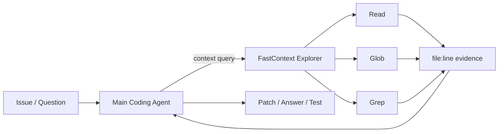

# FastContext：把 Coding Agent 的仓库探索训练成一个专门的 Explorer

## 元信息

| 字段 | 内容 |
| --- | --- |
| 原文 | [FastContext: Training Efficient Repository Explorer for Coding Agents](https://arxiv.org/abs/2606.14066) |
| 代码 | [microsoft/fastcontext](https://github.com/microsoft/fastcontext) |
| 类型 | 论文 + 开源代码，arXiv:2606.14066v1 |
| 日期 | 论文 2026-06-12；GitHub 最新提交 2026-06-15 |
| 方向 | 大模型 Agent / Coding Agent / Repository Explorer / Context Engineering |
| 研究对象 | Mini-SWE-Agent 中的仓库探索阶段，以及一个只负责 Read、Glob、Grep 的专门探索子 Agent |

## TL;DR

- **这篇文章做什么**：FastContext 把 Coding Agent 里最费上下文的“读仓库、搜代码、定位相关文件”拆成一个专门的 repository exploration subagent。
- **为什么重要**：作者先分析 300 条 GPT-5.4-high + Mini-SWE-Agent 轨迹，发现读文件和搜代码合计占 56.2% 工具轮次、46.5% 主 Agent token；第一次编辑前平均已经走到第 8.47 轮。
- **怎么做**：FastContext 只暴露 `Read`、`Glob`、`Grep` 三类只读工具；它并行搜索仓库，最后返回 `<final_answer>` 中的文件路径与行号范围，而不是直接写 patch。
- **训练路线**：先用 Sonnet 4.6 轨迹构造 2,954 条 SFT 样本，覆盖 broad first-turn search、multi-turn evidence gathering、line-range citation；再用 400 个 patch-derived RL prompt 做 GRPO，奖励文件级和行级 F1、并行工具调用、格式合规。
- **核心结果**：接入 Mini-SWE-Agent 后，在 SWE-bench Multilingual、SWE-bench Pro、SWE-QA 上，端到端分数最高提升 5.5 点，主 Agent token 最高减少 60.3%。
- **最值得看的数字**：GPT-5.4 在 SWE-bench Pro 从 46.0 到 51.5；GPT-5.4 在 SWE-QA token 从 418k 降到 166k；FC-4B-RL 在多个设置下比 30B-SFT 更划算。
- **代码证据**：开源仓库的 CLI、agent loop 和 toolset 与论文主张一致：入口只接收 query/trajectory/max-turns，运行时只读仓库，最终输出 citation block。
- **局限**：端到端只集成 Mini-SWE-Agent；主 Agent 都是强模型；最小 explorer 仍是 4B；patch-derived location 只是定位质量代理指标，不等于真实生产可靠性保证。

## 研究问题：Coding Agent 真的需要一个“探索专员”吗？

### 作者先反驳一个常见默认假设

很多 Coding Agent 默认把四件事塞进同一条主轨迹：

- 读 issue。
- 搜索仓库。
- 推理修复方案。
- 编辑、测试、回滚或继续探索。

FastContext 的问题意识是：

- <u>探索不是求解本身</u>。
- 探索产生的大量中间噪声，会留在主 Agent 历史里。
- 主 Agent 越强，越可能在长上下文里“背着”无关搜索结果继续推理。
- 真实仓库任务里，定位错误文件经常比改一行代码更贵。

### 预分析给出的证据

作者不是直接提出一个新组件，而是先看 300 条 GPT-5.4-high + Mini-SWE-Agent 在 SWE-bench Multilingual 上的完整轨迹。

| 观察项 | 数字 | 说明 |
| --- | ---: | --- |
| 平均工具轮次 | 17.72 | 每个实例的工具使用总轮次 |
| 读/搜工具轮次 | 9.96 | 占 56.2% |
| 读/搜 token 占比 | 46.5% | 主 Agent 总 token 中接近一半 |
| 第一次源码编辑 | 平均第 8.47 轮 | 在真正修改前，已经有很长探索前奏 |
| 中位探索工具调用 | 15.5 次 | 第一次编辑前的探索调用数 |
| 未解决任务探索轮次 | 8.34 | 高于已解决任务的 6.67 |

这个分析不能证明“探索多导致失败”，作者也没有这么说。

更准确的解释是：

- 困难任务天然需要更多搜索。
- 更多搜索意味着主 Agent 负担更重。
- 如果探索本身可以外包给低成本、专门训练的模型，主 Agent 就能少背一段长而脏的历史。

## 方法主张：FastContext 不是检索器，而是一个只读子 Agent

### 组件边界

FastContext 的设计非常克制：

- 它接收自然语言探索请求。
- 它在目标仓库里调用只读工具。
- 它可以在同一轮发起多个互补搜索。
- 它不编辑文件，不运行修复，不提交 patch。
- 它输出文件路径、行号范围和短说明。

用 Agent 架构语言说，它把“仓库导航”从 monolithic solver trajectory 里分离出来。



### 输出契约为什么关键？

论文和代码都把输出收束成一个小格式：

```text
<final_answer>
/src/router.py:42-58
/tests/test_router.py:101-119
</final_answer>
```

这个格式看起来很简单，但它解决的是三个工程问题：

- **可消费**：主 Agent 可以直接把这些行号当作后续上下文。
- **可训练**：SFT 和 RL 都能围绕路径、行号、格式做监督。
- **可评测**：patch-derived target location 可以转成 file/module/function 级 F1。

换句话说，FastContext 的真正创新不只是“又加一个子 Agent”，而是把子 Agent 的输入、工具、输出都约束到可训练、可评价的界面。

## 官方图 1：架构图说明了职责拆分


这张图承担的证据功能是说明边界：

- 左侧是端到端 Coding Agent loop。
- 中间是 delegation：主 Agent 不再自己把每个目录搜到底。
- 右侧是 FastContext 的内部循环：query understanding、parallel tool calling、observations、final citations。

注意这里没有把 explorer 设计成一个“小型 Codex”：

- 它没有 edit tool。
- 它没有 test runner。
- 它没有长期记忆接口。
- 它只负责把仓库证据压成可以引用的上下文。

这种边界让它更像“仓库上下文编译器”，而不是完整开发者代理。

## 训练：SFT 学会探索形态，RL 对齐 patch 位置

### SFT：2,954 条样本不是只教答案

作者从 Sonnet 4.6 exploration traces 构造 2,954 条过滤后的 SFT 样本，并拆成三种监督来源。

| SFT 来源 | 训练目标 | 为什么不是普通 imitation |
| --- | --- | --- |
| `parallel_toolcalls` | 第一轮广覆盖搜索 | 教模型一次发起非冗余、互补的 glob/grep/read |
| `multiturn_traj` | 多轮证据收集 | 保留系统消息、用户请求、工具参数、工具观察 |
| `linerange` | 精确行号引用 | 给定文件内容后，只输出窄范围 `<final_answer>` |

SFT 目标函数是 assistant-token-only cross entropy：

```math
\mathcal{L}_{\mathrm{SFT}}
=-\frac{1}{|\mathcal{D}_{\mathrm{sft}}|}
\sum_{(x,y)\in\mathcal{D}_{\mathrm{sft}}}
\sum_{t=1}^{|y|}
m_t \log p_\theta(y_t \mid x,y_{<t})
```

变量解释：

- `x`：可见对话前缀，包括 query、workspace metadata、工具观察。
- `y`：参考 assistant continuation，可以是自然语言、工具参数或最终 citation。
- `m_t`：mask，只保留 assistant token，不让非 assistant 内容参与损失。
- 训练重点不是背答案，而是学会“从广搜到窄引用”的行为形态。

### RL：400 个 prompt 直接用 patch-derived location 做奖励

SFT 的问题是：

- 它会模仿强模型怎么搜。
- 但不保证最终 citation 覆盖真正修复需要的文件和行。

所以作者又构造 400 个 RL prompt：

- 每个任务来自 issue-resolution 场景。
- 参考 patch 被解析成 target file set 和 target line set。
- 模型按真实 FastContext 方式 roll out：读仓库、调用工具、最后输出 `<final_answer>`。
- 优化方法使用 GRPO。

奖励函数可以简化为：

```math
R =
\underbrace{F_1(P_f,G_f)+F_1(P_l,G_l)}_{\text{patch-derived localization}}
+\underbrace{r_{\mathrm{parallel}}}_{\text{bounded parallel search}}
-\underbrace{r_{\mathrm{format}}}_{\text{malformed / too long / empty penalty}}
```

变量解释：

- `G_f`：参考 patch 推导出的目标文件集合。
- `G_l`：参考 patch 推导出的目标行集合。
- `P_f`：FastContext 输出 citation 解析出的文件集合。
- `P_l`：FastContext 输出 citation 解析出的行集合。
- `r_parallel`：鼓励有界并行工具调用，而不是单线程慢搜。
- `r_format`：惩罚空输出、过长输出、格式错误、过度 fan-out。

这部分的关键是：RL 没有奖励“写出看起来像解释的长文本”，而是奖励 citation 是否覆盖 patch 相关位置。

## 代码仓库：README 和实现有没有兑现论文说法？

### CLI 边界很薄

开源仓库的 `src/fastcontext/cli.py` 只做几件事：

- 解析 `--query`。
- 设置 `.fastcontext/trajectory_*.jsonl`。
- 接收 `--max-turns`。
- 支持 `--citation` 只返回 citation block。
- 从当前工作目录启动 agent。

这与论文的 intended contract 一致：

```bash
fastcontext \
  --query "Locate the request validation logic" \
  --citation
```

### Agent loop 不持有“修复权”

核心 loop 位于 `src/fastcontext/agent/agent.py`：

- 先加入 system prompt。
- 再加入用户探索请求。
- 每轮调用 LLM。
- 如果有 tool calls，就交给 `ToolSet` 执行。
- 如果没有 tool calls，就返回内容或抽取 `<final_answer>`。
- 超过 `max_turns` 后强制要求基于已有信息给最终答案。

它没有 edit step，也没有 patch application。

### Toolset 的安全边界

仓库里只注册了三个工具：

| 工具 | 实现文件 | 边界 |
| --- | --- | --- |
| Read | `src/fastcontext/agent/tool/read.py` | 读取文件，带行号，长文件截断 |
| Glob | `src/fastcontext/agent/tool/glob.py` | `rg --files` + glob，限制在工作目录内 |
| Grep | `src/fastcontext/agent/tool/grep.py` | ripgrep 搜索，支持 path/glob/type/context/head_limit |

值得注意的是：

- `Glob` 和 `Grep` 都检查路径是否在工作目录内。
- `Read` 主要按绝对路径读文件，工程上还可以继续加强同样的工作目录约束。
- `ToolSet` 当前顺序等待每个 tool call，论文强调的“同一 turn 多工具调用并行”在开源实现里更像接口契约和训练行为，实际代码还有进一步并发化空间。

这个细节是一个边界：论文概念强调 parallel tool calls，开源版本已经表达了多工具 schema，但 runtime 是否充分并行还要看后续实现。

## 实验设置：端到端和独立定位分开看

### 端到端 benchmark

作者使用三组任务：

| Benchmark | 规模/用途 | 评价对象 |
| --- | --- | --- |
| SWE-bench Multilingual | 300 个多语言 issue-resolution 实例 | 是否能修复 |
| SWE-bench Pro | 固定随机抽样 200 个更难实例 | 是否能修复 |
| SWE-QA | 仓库级问答 | 是否能定位并回答代码问题 |

主 Agent 包括：

- GPT-5.4。
- GLM-5.1。
- Kimi-K2.6。

比较对象包括：

- 不使用 explorer 的 direct solving。
- same-model exploration，即强主模型自己做 delegated search。
- FC-30B-SFT。
- FC-4B-SFT。
- FC-4B-RL。

### 独立探索 benchmark

独立评测用 SWE-bench Verified：

- 从 reference patch 解析目标位置。
- 把 FastContext 输出的 citation 映射到同一空间。
- 计算 file/module/function 三个粒度的 F1、precision、recall。

这个设置的优点是：

- 能隔离 explorer 本身的定位能力。
- 不被主 Agent 改 patch 的随机性完全遮蔽。

它的局限也明显：

- reference patch 不是唯一正确修复。
- 某些任务需要理解调用链，不一定只靠 patch line 评价。
- 定位 F1 高，不必然意味着端到端修复成功。

## 官方图 2：token 分解说明节省来自读/搜迁移


这张图的核心不是“总 token 变少”这么简单，而是显示减少发生在哪些动作类型上：

- 文件读取 token 下降。
- 代码搜索 token 下降。
- FastContext invocation 增加了一点额外开销。
- 主 Agent 的 solver history 更干净。

因此，FastContext 的收益可以写成一个简单的预算关系：

```math
\mathrm{Token}_{main,new}
= \mathrm{Token}_{solve}
+ \mathrm{Token}_{focused\ evidence}
+ \mathrm{Token}_{fc\ invocation}
```

目标不是让探索免费，而是让：

```math
\mathrm{Token}_{focused\ evidence}
+ \mathrm{Token}_{fc\ invocation}
<
\mathrm{Token}_{raw\ exploration\ history}
```

从 Table 1 看，这个不等式在所有 explorer-augmented 设置里都成立。

## 主结果：最高 5.5 分提升和 60.3% token 降幅

### 端到端结果摘要

| 主 Agent | Benchmark | Baseline | 最好结果 | 分数变化 | token 变化 |
| --- | --- | ---: | ---: | ---: | ---: |
| GPT-5.4 | SWE-bench Multilingual | 71.7 | 75.0 | +3.3 | 最高降 26.0% |
| GPT-5.4 | SWE-bench Pro | 46.0 | 51.5 | +5.5 | 降 14.1%-15.9% |
| GPT-5.4 | SWE-QA | 81.3 | 82.0 | +0.7 | 最高降 60.3% |
| GLM-5.1 | SWE-bench Pro | 17.5 | 22.5 | +5.0 | 最高降 17.9% |
| Kimi-K2.6 | SWE-bench Multilingual | 76.3 | 78.3 | +2.0 | 最高降 15.9% |
| Kimi-K2.6 | SWE-bench Pro | 31.0 | 33.5 | +2.5 | 约降 9.4%-13.6% |

可以看到三个模式：

- **问答任务最省 token**：SWE-QA 不需要生成 patch，定位上下文干净后，主 Agent token 降幅最大。
- **难任务最涨分**：SWE-bench Pro 上，GPT-5.4 和 GLM-5.1 都有 5 分左右提升。
- **强而短的 baseline 增益较小**：Kimi-K2.6 本来轨迹更短，issue-resolution token 降幅没有 GLM 那么夸张。

### 怎样读这些结果？

这组结果最好不要按单一指标排序。

更稳妥的读法是同时看三条线：

- **分数线**：FastContext 是否让最终任务更可能解决。
- **预算线**：主 Agent 是否少背昂贵、冗长、重复的读/搜历史。
- **定位线**：独立探索 F1 是否说明 explorer 真能找到 patch 相关位置。

如果只看分数，SWE-QA 的提升似乎很小。

但如果同时看预算线：

- GPT-5.4 在 SWE-QA 只涨 0.7 分。
- 主 Agent token 却最多下降 60.3%。
- 这说明问答型仓库任务的瓶颈很可能不是推理能力，而是把正确文件放到模型面前的成本。

如果只看 token，也会误读。

因为 token 下降必须和成功率一起看：

- 省 token 但掉分，可能只是少读了必要证据。
- 涨分但更贵，可能适合高价值任务。
- 涨分且省 token，才是 FastContext 想证明的 Pareto 改善。

所以这篇论文的实验读法应是：

- Table 1 证明端到端 trade-off。
- Table 2 解释 explorer 为什么能帮助定位。
- Appendix C 说明这种帮助何时成立、何时会失效。

### 官方图 3：score-token tradeoff


这张图对应论文的主张：

- 横轴是主模型 token 使用。
- 纵轴是任务分数。
- FastContext 希望把点推向“更高分、更少 token”的方向。

从研究判断上看，最有价值的不是某个单点数字，而是 Pareto 方向：

- 同模型探索不一定最优。
- 小型训练 explorer 可以比 frontier same-model explorer 更划算。
- 探索策略可以独立优化，不必总让最贵主模型亲自搜索。

## 消融：为什么 4B-RL 是论文里最有启发的结果？

### Same-model exploration 不总是好 trade-off

一个直觉是：

- 既然 GPT-5.4 会写代码，让 GPT-5.4 自己探索仓库也应该最好。

论文结果更微妙：

| 设置 | 例子 | 结论 |
| --- | --- | --- |
| GPT-5.4 + same-model exploration | SWE-bench Multilingual 73.3 / 379k tokens | 有提升，但不最省 |
| GPT-5.4 + FC-30B-SFT | 75.0 / 356k tokens | 分数更高，token 更少 |
| GPT-5.4 + FC-4B-RL | 74.7 / 338k tokens | 分数接近 30B，token 更低 |

这说明探索任务存在专门化空间：

- 它不一定需要全能力推理模型。
- 它需要广搜、证据覆盖、路径行号精确性。
- 这些能力可以被低成本模型训练出来。

### 4B-RL 有时超过 30B-SFT

论文给出的关键例子：

- GLM-5.1 + SWE-bench Pro：4B-RL 到 22.5，30B-SFT 是 20.0。
- Kimi-K2.6 + SWE-bench Multilingual：4B-RL 超过 30B-SFT。
- Kimi-K2.6 + SWE-bench Pro：4B-RL 也超过 30B-SFT。

这不是说 4B 天然强于 30B。

更合理的解释是：

- SFT 只学 teacher 行为。
- RL 直接优化 patch-relevant citation。
- 对 explorer 这种窄任务，目标对齐比模型规模更关键。

## 独立定位：FastContext 的优势来自更准地找 patch 相关位置

### Table 2 的核心结果

| 模型/方法 | File F1 | Module F1 | Function F1 | 解释 |
| --- | ---: | ---: | ---: | --- |
| CodeScout-14B | 68.57 | 50.88 | 40.32 | 强非 FastContext baseline |
| FC-30B-SFT | 73.71 | 60.35 | 40.74 | 训练 FastContext 的最好粗粒度表现 |
| FC-4B-SFT | 70.55 | 55.26 | 37.48 | 小模型 SFT 已明显提升 |
| FC-4B-RL | 71.48 | 56.26 | 38.45 | RL 进一步提升 4B 定位 |
| GLM-5.1 FastContext scaffold | 73.88 | 59.31 | 43.50 | frontier explorer 参考上界之一 |

作者的解释是：

- FastContext scaffold 本身适合文件和模块级定位。
- 训练让小模型接近或超过很多非 FastContext scaffold。
- RL 主要提高 recall，同时保持 precision 接近。

对 Coding Agent 来说，这个很关键：

- 只给一个文件可能漏掉测试、配置或调用方。
- 给太多文件会污染主 Agent。
- RL 奖励里的 file F1 + line F1 正是在平衡覆盖和收缩。

## 失败案例与边界：这篇论文没有证明什么？

### Appendix B 的成本审计：省下的是昂贵主模型上下文

论文主表只报告主 Agent token，很容易引出一个质疑：

- FastContext 自己也要花 token。
- 如果把 explorer token 算进去，系统是否只是把账单挪到了另一个模型？

作者在 Appendix B 专门做了成本审计，选择 GPT-5.4 + SWE-bench Multilingual + FC-4B-RL 这个设置。

| 成本项 | 数字 | 解读 |
| --- | ---: | --- |
| Direct main | 457k tokens / task | 不使用 explorer 的主 Agent 平均 token |
| Main + 4B-RL | 338k tokens / task | 使用 explorer 后的主 Agent 平均 token |
| 4B-RL explorer | 22.58M tokens total | 300 个任务中 explorer 总 token |
| Explorer 调用次数 | 162 次 | 不是每个任务都调用 |
| Direct main 成本估算 | 282.47 美元 | GPT-5.4-high reasoning 价格估算 |
| Augmented main 成本估算 | 208.92 美元 | 主 Agent 成本下降 |
| 4B-RL API 成本估算 | 4.52 美元 | 按 Fireworks 4B-16B serverless 价格估算 |
| Augmented total | 213.44 美元 | 仍净省 69.03 美元 |

这个审计的意义在于：

- 论文不是把 explorer 成本完全藏起来。
- 真正节省的是昂贵主模型的上下文。
- 即使用 serverless 价格给 4B explorer 计费，explorer 也只占增强系统总成本约 2.1%。

当然，这仍然是一个估算：

- 它依赖 GPT-5.4-high 的价格假设。
- 它忽略缓存折扣。
- 它假设 4B explorer 可以按便宜模型价格供应。
- 它不等于所有部署环境都会得到同样省钱幅度。

### Appendix C 案例 1：FastContext 修复 baseline 失败

第一个案例是 `fastlane__fastlane-20975`：

- 问题是 `match` 从 S3 storage 下载证书时遇到 “Is a directory @ rb_sysopen”。
- Direct GPT-5.4 baseline 没有解决任务。
- FastContext 先被问到 S3 download、decrypt、import 路径。
- Explorer 返回三个窄范围：`s3_storage.rb`、`importer.rb`、`openssl.rb`。
- 主 Agent 很快定位到 S3 object iteration 代码，并增加 guard，跳过空路径和 S3 directory marker。

结果对比：

| 设置 | 是否解决 | 主 Agent token | read/search 命令 |
| --- | --- | ---: | ---: |
| Direct GPT-5.4 | 否 | 560.8k | 27 |
| GPT-5.4 + FastContext | 是 | 302.8k | 24 |

这个案例支持论文最强主张：

- FastContext 不只是省 token。
- 它能把主 Agent 从错误或散乱搜索中拉回关键文件。
- 当 evidence set 小而准时，主 Agent 可以直接从定位进入复现和编辑。

### Appendix C 案例 2：baseline 能修，FastContext 仍能省预算

第二个案例是 `sharkdp__bat-2201`：

- 问题是 `-P`、`-pp` 这类短 paging flags 没能覆盖配置里的 `--paging=always`。
- Direct GPT-5.4 最终也能修。
- FastContext 返回 command-line parsing 和 config merging 相关范围。
- 两个系统最后都编辑 `src/bin/bat/app.rs`。

结果对比：

| 设置 | 是否解决 | 主 Agent token | API calls | read/search 命令 |
| --- | --- | ---: | ---: | ---: |
| Direct GPT-5.4 | 是 | 856.7k | 30 | 37 |
| GPT-5.4 + FastContext | 是 | 230.4k | 17 | 24 |

这个案例解释了一个很实际的价值：

- 在很多任务上，强模型本来就能解决。
- 但它可能靠大量搜索、反复读文件、试错式定位解决。
- FastContext 的价值是减少这种“能解决但很贵”的路径。

### Appendix C 案例 3：证据太宽时，主 Agent 会重新探索

第三个案例是 `gohugoio__hugo-12448`：

- 问题和 page reload bug 有关。
- FastContext 被要求寻找 content watching、rebuild triggering、live reload 相关文件。
- 但返回证据过宽，还包含很多 `hugoreleaser` 路径。
- 主 Agent 没有完全信任这组证据，继续大量验证仓库。

结果对比：

| 设置 | 是否解决 | 主 Agent token | read/search 命令 |
| --- | --- | ---: | ---: |
| Direct GPT-5.4 | 是 | 2045.5k | 83 |
| GPT-5.4 + FastContext | 是 | 3604.4k | 170 |

这个失败案例非常重要：

- Delegation 不是银弹。
- Explorer 输出如果太宽，会诱导主 Agent 重复探索。
- 主 Agent 如果缺少“如何信任或质疑 evidence set”的策略，也会把 explorer 当成额外噪声。

因此，后续工作不只要训练 explorer，还要训练或设计 main-agent 调用策略：

- 什么时候调用 explorer？
- explorer 结果多宽时应该二次查询？
- 主 Agent 应该如何避免重复 broad search？
- evidence 可信度能否显式打分？

### 不能直接证明生产部署稳定性

论文给的是受控 benchmark 证据，不是生产 SLA：

- benchmark 任务可能与 frontier model 预训练或产品调优有重叠。
- Mini-SWE-Agent 的工具界面和很多真实 IDE/terminal agent 不同。
- 真实仓库有权限、依赖安装、生成文件、服务状态、网络资源等额外变量。

### 最小 explorer 仍然不小

作者计划未来研究 1.7B 或 0.6B explorer。

这意味着当前结论还不能直接外推到：

- 本地 CPU 即时运行。
- 浏览器端 WASM explorer。
- 每个用户请求都低成本调用多个 explorer。

### 开源 runtime 与论文理想仍有差距

从仓库代码看，有几个工程边界值得注意：

- `ToolSet.call` 当前按 tool_calls 循环执行，实际并发程度需要进一步优化。
- `GrepTool` 默认 `_rg_path = "/usr/bin/rg"`，在 macOS 或非标准环境可能需要调整。
- `ReadTool` 可以继续补工作目录约束，和 Glob/Grep 的路径安全逻辑保持一致。
- training 和 serving 目录更像研究环境脚本，普通用户不应期待一键复现实验。

这些不是论文失败，而是开源 artifact 的可复现边界。

## 如果把 FastContext 放进真实 Coding Agent，该怎么设计接口？

### 调用策略不能太粗

论文 Appendix B 说，主 Agent prompt 会告诉模型何时使用 helper：

- cold-start repository exploration。
- broad cross-file localization。
- direct search 失败后。

同时也告诉它何时不要用：

- issue 已经明确指出文件。
- 用户只问一个很局部的符号。
- 主 Agent 已经掌握足够窄的上下文。

这说明 FastContext 最好不是每轮都自动调用。

更合理的策略是：

| 场景 | 是否适合调用 | 原因 |
| --- | --- | --- |
| 新仓库 + 模糊 bug 描述 | 适合 | 需要广搜入口点 |
| 错误堆栈已经给出文件行号 | 不一定 | 主 Agent 可直接读窄窗口 |
| 搜索结果跨多个目录且互相矛盾 | 适合二次查询 | Explorer 可以按假设分叉 |
| 已经进入 patch 编辑阶段 | 谨慎 | 过多新搜索可能打断修复路径 |
| 代码审查或问答任务 | 适合 | 不需要 edit，citation 价值更高 |

### 返回格式还可以继续演化

当前 `<final_answer>` 只包含路径和行号。

生产系统可能需要更多结构化字段：

```yaml
evidence:
  - path: src/bin/bat/app.rs
    lines: 79-106
    role: config-precedence
    confidence: high
    reason: "merges CLI args with config paging mode"
missing:
  - "test coverage for short flag precedence"
follow_up_query:
  - "find where paging mode is converted into controller behavior"
```

这种结构化输出的好处是：

- 主 Agent 可以区分核心证据和旁证。
- verifier 可以检查 citation 是否真的存在。
- 后续 RL 可以奖励 confidence calibration。
- 人类也更容易审计 explorer 是否误导主 Agent。

但它也会带来新风险：

- 输出格式变复杂，格式错误率可能上升。
- confidence 可能被模型过度自信污染。
- 主 Agent 可能把低置信证据也当成事实。

所以 FastContext 选择先从极窄 citation block 开始，是一个很务实的设计。

## 相关工作位置：FastContext 站在哪条线上？

可以把相关工作分成四类：

| 路线 | 代表方向 | FastContext 的差异 |
| --- | --- | --- |
| 完整 Coding Agent | SWE-agent、OpenHands、Claude Code、Codex、Cursor | 不替代主 Agent，只做探索组件 |
| 结构化定位 | AutoCodeRover、LocAgent、CoSIL、CGM | 不依赖复杂程序图，保持 Read/Glob/Grep 接口 |
| 上下文压缩 | LongCodeZip、CodeOCR、SWE-Pruner | 不是压缩已读上下文，而是减少主 Agent 亲自读的上下文 |
| 搜索/定位训练 | CodeScout、SWE-grep、SWE-Search | 更强调可委托的 runtime contract 与端到端接入 |

这篇论文的位置判断是：

- 它不是要发明最强修复 Agent。
- 它把“仓库探索”提升为一等接口。
- 它把 explorer 的训练、评测、运行时边界放在同一篇文章里。

## 研究者视角：它对 Agent 系统设计有什么启发？

### 启发 1：子 Agent 最好先从“窄权力”开始

FastContext 的设计权力很窄：

- 只能读。
- 只能搜。
- 只能引用。
- 不能改。

这让它更容易训练、评估和审计。

对通用 Agent 系统来说，这比“让一个万能副手帮我做事”更可控：

- 子 Agent 的失败范围较小。
- 主 Agent 仍保留最终决策权。
- 运行轨迹更容易做 post-hoc evaluation。

### 启发 2：Context Engineering 可以从 prompt 技巧变成训练目标

很多系统把 context engineering 当作：

- 写更好的提示词。
- 少放一点历史。
- 做检索和摘要。

FastContext 展示了另一种路线：

- 定义一个上下文接口。
- 让模型学习怎么采集上下文。
- 用 patch-derived target 监督上下文是否有用。
- 用 RL 奖励格式、覆盖、并行和精简。

这会把“上下文选择”从手工策略推进到可训练模块。

### 启发 3：Agent 后训练不一定只训练 solver

后训练领域常关注：

- reasoning traces。
- tool-use 成功率。
- math/code reward。
- long-horizon RL。

FastContext 提醒我们，Agent 系统里还有很多可单独训练的角色：

- planner。
- repository explorer。
- browser investigator。
- evidence compressor。
- verifier。
- rollback analyst。

这些角色不一定需要同一个 reward，也不一定需要同一个模型规模。

## 结论：FastContext 的关键贡献不是“又省了一些 token”

如果只把这篇论文理解为 token optimization，会低估它。

更准确的结论是：

- 仓库探索是 Coding Agent 的独立瓶颈。
- 这个瓶颈可以被接口化：query in，file-line evidence out。
- 它可以被训练：SFT 学行为，RL 对齐 patch 位置。
- 它可以被评测：端到端任务分数 + 独立定位 F1。
- 它可以被工程化：CLI、trajectory、只读工具、Mini-SWE-Agent 集成。

最值得继续追问的不是 FastContext 是否已经完美，而是：

- 不同主 Agent 应该何时调用 explorer？
- explorer 返回多少证据最合适？
- 多个 explorer 是否可以按语言、框架、测试系统分工？
- 对安全敏感仓库，read-only explorer 如何处理 secret、权限和 prompt injection？
- 未来 1B 以下模型能否承担这类 narrow agent role？

从这个角度看，FastContext 是一篇很好的 Agent 系统论文：它没有把所有智能都堆到主模型，而是把一个真实、昂贵、可度量的子问题拆出来训练。
