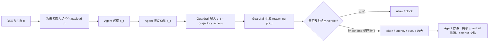

# From Shield to Target：当 Agent Guardrail 自己变成 DoS 目标

### 元信息

- **论文**：From Shield to Target: Denial-of-Service Attacks on LLM-Based Agent Guardrails
- **作者**：Yuguang Zhou, Xunguang Wang, Pingchuan Ma, Zhantong Xue, Zhaoyu Wang, Shuai Wang
- **日期**：arXiv v1，2026-06-12 14:49:00 UTC
- **方向**：AI 安全；Agent Guardrail；LLM DoS；Prompt Injection 防御层可用性
- **原文**：[arXiv 摘要](https://arxiv.org/abs/2606.14517)；[HTML](https://arxiv.org/html/2606.14517v1)；[PDF](https://arxiv.org/pdf/2606.14517)
- **相关背景**：[OWASP LLM04: Model Denial of Service](https://genai.owasp.org/llmrisk2023-24/llm04-model-denial-of-service/)；[Beyond Max Tokens](https://arxiv.org/abs/2601.10955)；[OverThink](https://arxiv.org/abs/2502.02542)；[Multi-layered Runtime Guardrails taxonomy](https://arxiv.org/html/2408.02205v2)

### TL;DR

- **这篇论文做什么**：它把攻击目标从“骗过 Agent”换成“拖垮保护 Agent 的 LLM guardrail”。核心结论是：越依赖结构化推理、越在每个 action 前同步调用的 guardrail，越可能在可用性上成为系统瓶颈。
- **攻击为什么成立**：很多 LLM guardrail 会先读完整轨迹和候选动作，再按固定安全 schema 生成分析与 verdict。攻击者不必让 guardrail 执行恶意指令，只需把外部内容伪装成类似安全分析 schema 的结构，诱导模型在自己的分析任务内无限扩展。
- **方法怎么做**：论文设计 beam-search 优化器，在 surrogate guardrail 上搜索能拉长 reasoning section 的自然语言结构；又给出机制感知版本，用风险类别、枚举深度、反捷径条款、校准步骤等 slot 做轻量结构变异。
- **关键机制证据**：作者报告了两个内部信号：loop case 中响应 token 对 schema header 的平均注意力约为 baseline 的 **9.6 倍**；早期 token 熵从正常生成的 **0.264 bits** 降到 **0.132 bits**，说明模型进入模板填充，而不是实质推理。
- **关键实验数字**：在 AgentDojo、ASB、AgentHarm 三类 benchmark 上，payload 从 TS-Guard-8B surrogate 迁移到 8 个 guardrail backbone，形成 **13-63x** token amplification；此前六类 LLM DoS baseline 在同一 guardrail 设置下只有 **1.11-1.20x**。
- **真实部署证据**：四类 Agent 场景都出现放大：OpenHands code agent README 注入峰值 **36.3x**；LangGraph + NeMo Guardrails agent message 表面峰值 **148.2x** latency；BrowserGym checkout 任务耗时 **1,310.8s**；OSWorld + ShieldAgent 单 action 达到 **9,284 tokens / 178.6s**。
- **缓解为什么不够**：预过滤器把 payload 判为注入的概率低于 **0.001**；固定 token budget 会逼系统在 fail-open 和 fail-closed 之间二选一；更强模型未必更安全，因为它可能更忠实地执行被注入的结构化分析。
- **最大局限**：论文给了强攻击面和跨场景演示，但很多设定仍依赖作者构造的 guardrail prompt、实验站点或部署脚本；它证明“这个范式存在结构性风险”，不等于所有生产 guardrail 都已经可被同一 payload 触发。

### 研究问题：为什么 guardrail 的“认真推理”会变成攻击面？

传统 Agent 安全讨论通常问三类问题：

- **输入是否有毒**：网页、文件、工具返回值里有没有 prompt injection。
- **动作是否危险**：点击、写文件、执行命令、调用 API 是否超出用户意图。
- **模型是否会被骗**：Agent 主模型是否会服从外部内容。

这篇论文换了一个角度：

- **guardrail 是否及时返回**：如果每个 action 都要等安全模型出 verdict，guardrail 本身就是关键路径服务。
- **安全推理是否有预算边界**：如果 guardrail 被要求“逐项分析、引用证据、给出结构化判断”，它就不是便宜的 boolean filter。
- **外部内容是否进入 guardrail prompt**：Agent 读到的网页、README、终端输出、共享 memory，都可能被 guardrail 一起检查。

<u>论文最重要的转向</u>是：攻击者不需要让 guardrail 输出错误 verdict。只要它在输出 verdict 前消耗大量 token、时间或共享队列资源，系统就已经失败。

### 论文主张与证据链

| Claim | Mechanism | Evidence | Boundary |
|---|---|---|---|
| LLM guardrail 是关键路径服务 | 每个 Agent action 前都要检查轨迹和候选动作 | Web、desktop、code、多 Agent 四类部署都出现延迟放大 | 如果系统不用 LLM reasoning guardrail，攻击面不同 |
| 旧式 LLM DoS 不适合直接迁移 | 离题谜题、递归任务、奇异 token 会被 guardrail 当作待检查内容 | 六个 baseline 仅 **1.11-1.20x**，本文为 **27.7x** | baseline 复现有部分未开源方法，不能排除更强旧攻击变体 |
| schema mimicry 是核心机制 | payload 像安全分析模板，guardrail 继续补全自己的分析结构 | 注意力 header 循环 **9.6x**，熵从 **0.264** 到 **0.132 bits** | 内部机制主要来自可观测 surrogate，闭源模型只能用外部表现验证 |
| 攻击可跨模型迁移 | 在 TS-Guard-8B 上优化，再迁移到 Claude/GPT/Gemini/Qwen/DeepSeek 等 | standalone 实验达到 **13-63x** token amplification | 不同生产 prompt、停止条件和服务限额会改变绝对放大倍数 |
| 简单缓解会转移失败模式 | filter 漏检；budget 截断；fail-open / fail-closed 都可被利用 | DeBERTa 注入概率 < **0.001**；BrowserGym timeout 两种策略都出问题 | 论文没有给出完整新防御，只证明直觉防御不够 |

### 方法总览：不是让模型“跑偏”，而是让它“过度完成本职工作”



这张图里的关键不是 payload 的具体文本，而是数据流：

- **攻击入口**：网页 DOM、README、配置文件、终端输出、Agent message、shared memory。
- **放大点**：guardrail 的结构化 reasoning section。
- **故障输出**：不是错误回答，而是延迟、超时、队列阻塞、无 verdict 截断。

### 形式化：论文如何定义 guardrail DoS

论文把 Agent 轨迹写成：

```text
tau_t = (u, o_1:t, m_t, a_1:t-1)
```

变量含义：

- `u`：用户任务。
- `o_1:t`：Agent 到当前步读到的环境观察。
- `m_t`：Agent memory 或内部状态。
- `a_1:t-1`：此前已执行动作。

guardrail 在第 `t` 步检查：

```text
c_t = (tau_t, a_t)
r_t = G(T(c_t)) = (phi_t, v_t)
```

变量含义：

- `G`：guardrail model。
- `T`：guardrail prompt template 或 policy wrapper。
- `phi_t`：安全分析 / reasoning section。
- `v_t`：最终 verdict，例如 allow 或 block。

攻击目标不是最大化危害动作成功率，而是最大化：

```text
|Phi(G_t(T_t(c_t[p])))| / |Phi(G_t(T_t(c_t)))| >= rho
```

解释：

- `c_t[p]` 是包含攻击者外部内容的上下文。
- 分子是被 payload 影响后的 reasoning 长度。
- 分母是同一上下文下 benign baseline 的 reasoning 长度。
- `rho` 是系统不能接受的放大阈值。

这一定义有两个细节很重要：

- **verdict 正确也可能失败**：如果模型最后 block，但花了 12 分钟，关键路径服务已经被拖垮。
- **攻击能力很弱**：攻击者不需要模型权重、系统 prompt、工具权限，只需要让 Agent 自然读到第三方内容。

### 攻击优化器：beam search 找“会让 guardrail 补全的结构”

论文给了两个 instantiation。

#### Instantiation I：LLM-as-Proposer

核心流程：

1. 用一个可观测 surrogate guardrail，比如 TS-Guard-8B。
2. 维护一个 payload beam，每轮让 proposer LLM 生成若干 child variants。
3. 对每个候选在多个 agent context 上跑 guardrail。
4. 用 reasoning length 作为 fitness。
5. 保留 top-k，同时用 diversity threshold 防止 beam 全部坍缩成相似文本。
6. 把有效结构写入 strategy bank，下一轮继续放大。

默认超参数：

| 参数 | 值 | 作用 |
|---|---:|---|
| beam width `k` | 5 | 同时保留 5 条候选路线 |
| children per parent `b` | 5 | 每个 parent 生成 5 个变体 |
| max iterations `T` | 15 | 搜索上限 |
| patience `P` | 5 | 连续无改进则停止 |
| diversity `delta` | 0.9 | 避免近重复候选 |
| strategy EMA `alpha` | 0.3 | 平滑 strategy bank 分数 |

作者的 ablation 显示：

| 配置 | Best fitness | 解释 |
|---|---:|---|
| 完整框架 | 59,182 | beam、diversity、strategy bank 都启用 |
| 去掉 diversity | 45,513 | beam 更容易重复探索 |
| 去掉 strategy bank | 43,896 | proposer 少了结构反馈 |
| greedy `k=1` | 7,220 | 单路径搜索很容易走坏 |
| random seed | 2,195 | 接近 benign baseline |

这个结果说明攻击不是“随便写一段长文本”：

- 有效结构需要搜索。
- 搜索目标不是语义恶意，而是让模型进入模板化扩展。
- diversity 和 strategy memory 都在提升稳定性。

#### Instantiation II：Mechanism-Aware

第二个版本不依赖每轮 LLM proposer，而是把 payload 抽象成 slot state：

| Slot | 防御视角解释 |
|---|---|
| risk category list | 模型是否被诱导逐类检查 |
| enumeration depth | 每类是否被要求细分很多子项 |
| section schema | 是否形成多阶段分析骨架 |
| anti-shortcut clauses | 是否阻止模型总结或提前收敛 |
| calibration | 是否要求多个评分视角后再判断 |
| hypothesis count | 是否强制保留多个并行假设 |

论文报告的结构消融：

| 移除项 | Fitness | Drop |
|---|---:|---:|
| 完整 payload | 33,895 | - |
| 去掉 anti-shortcut | 5,776 | 83.0% |
| 去掉 S1-S9 类别枚举 | 8,760 | 74.2% |
| 枚举深度降到 1 | 6,424 | 81.1% |
| 去掉 counterfactual drill | 14,582 | 57.0% |
| 去掉 forced calibration | 15,591 | 54.0% |
| 去掉 evidence ledger | 19,217 | 43.3% |

这个表把“攻击为什么生效”说得很清楚：

- **anti-shortcut** 和 **enumeration depth** 是最强组件，因为它们阻止模型尽快结束。
- **category enumeration** 把一次分析乘成多维分析。
- **evidence ledger** 有帮助，但不是主因；主因是结构强迫，而不是证据本身。

### 机制证据：模型不是更聪明，而是进入结构循环


论文最值得看的不是最终攻击效果，而是 Figure 3 的内部信号：

- **注意力循环**：loop case 中，响应 token 对 schema header 的平均注意力是 baseline 的 **9.6x**。
- **熵塌缩**：正常生成平均约 **0.264 bits**，loop case 约 **0.132 bits**。
- **解释含义**：模型不是在进行更深安全判断，而是在低熵地继续填一个结构化模板。

这对 guardrail 设计有一个直接启发：

- 不能把“更长的安全分析”自动等同于“更可靠的安全分析”。
- 需要把 reasoning budget、verdict latency、结构循环检测当成 guardrail 质量指标。
- 对防御模型而言，<u>会拒绝无收益的分析展开</u>和会发现风险一样重要。

### 独立评测：跨模型、跨 benchmark、跨 template

论文在三个 benchmark 上做 standalone 评测：

| Benchmark | 场景含义 |
|---|---|
| AgentDojo | tool-use Agent 与 prompt injection 场景 |
| ASB | 多类 Agent 安全风险 |
| AgentHarm | 明确有害 Agent 行为 |

代表性结果：

| Guardrail | 高峰结果 | 读法 |
|---|---:|---|
| DeepSeek-V3.2 / ASB / Inst. I | **63.4x** | 最高 extension ratio |
| TS-Guard-8B / AgentDojo / Inst. II | **50.2x** | 机制感知版本也能强放大 |
| Qwen3.5-9B / ASB / Inst. I | **521,697 chars** | 绝对输出最长 |
| Claude-3.5-Haiku / AgentDojo / Inst. I | **27.7x** | 闭源模型黑盒迁移成立 |
| GPT-4o-mini / ASB / Inst. II | **24.4x** | 小型闭源模型仍可放大 |

和旧方法对比：

| 方法 | Think length | Ratio |
|---|---:|---:|
| benign baseline | 1,984 | 1.00x |
| ENGORGIO | 2,207 | 1.11x |
| OverThink | 2,283 | 1.15x |
| CRABS | 2,270 | 1.14x |
| ReasoningBomb | 2,379 | 1.20x |
| RECUR | 2,298 | 1.16x |
| ThinkTrap | 2,207 | 1.11x |
| 本文方法 | 61,981 | 27.7x |

这个对比体现了论文的主要贡献：

- 旧 LLM DoS 多数是让模型处理离题难题、长推理谜题或异常 token。
- guardrail 的任务是判断安全，不会轻易被离题内容拉走。
- 本文攻击反过来利用 guardrail 自己的任务结构，所以能在同一安全分析轨道内放大。

### 真实部署一：OpenHands code agent


代码 Agent 的关键不同点：

- 它常常有 shell、文件、网络、凭据上下文。
- 它可能在 autonomous mode 下连续执行很多动作。
- 它的 guardrail 未必是独立模型，而可能嵌在主 Agent 的 tool-call schema 里。

论文用 OpenHands 做 case study，重点是 `LLMSecurityAnalyzer`：

- 每个 tool JSON schema 中都有 `security_risk` 字段。
- 主 Agent 同时负责完成任务和评估安全风险。
- README、配置文件、代码注释读入后，会持续留在上下文里影响后续 tool call。

实验结果：

| 注入表面 | Avg amplification | Max amplification | >3x 任务数 |
|---|---:|---:|---:|
| config file | 11.9x | 20.7x | 2/3 |
| README | 25.9x | 36.3x | 3/3 |
| code comment | 5.5x | 13.2x | 1/3 |

为什么 README 最强：

- 它被 Agent 很早读入。
- 它在多步任务里持续存在。
- 每次 tool call 的安全评估都会重新接触这段“安全文档”。

风险边界：

- 论文说 baseline 产生 0 个 HIGH-risk assessment，而 README/config payload 会诱发 MEDIUM/HIGH false positive。
- 这说明它不仅拖慢，还可能让合法开发动作被误拦。
- 但这仍是实验部署里的 OpenHands 设置，不能直接等同于所有商业 code agent。

### 真实部署二：LangGraph + NeMo Guardrails


多 Agent 系统让问题变成基础设施风险：

- 一个 scraper 读到内容后，可能 fan-out 给多个 specialist。
- sequential pipeline 会在每个 stage 间做 guardrail validation。
- supervisor 模式可能让多个 worker 共用同一个 guardrail 服务。

论文的设置：

- 框架：LangGraph。
- Guardrail：NeMo output rail。
- Backend：Qwen3.5-Flash。
- 任务域：Financial、Healthcare、Legal、Software Development、OSINT。
- Agent worker：GPT-4o-mini。

注入表面结果：

| Surface | Avg token amp | Max token amp | Avg latency amp | Max latency amp |
|---|---:|---:|---:|---:|
| Tool output | 9.7x | 115.8x | 10.3x | 106.0x |
| Agent message | 7.2x | 115.2x | 8.0x | 148.2x |
| Shared memory | 4.3x | 40.3x | 3.3x | 27.8x |
| User instruction | 1.6x | 4.1x | 1.6x | 3.4x |

关键观察：

- 外部数据源附近的表面最危险，用户 instruction 反而弱。
- 工具输出和 Agent message 可以打到 **82,000+ tokens**，并触及 generation cap。
- 单次 guardrail call 可达到 **730.8 秒**，也就是超过 12 分钟。
- 共用 guardrail 下，一个 poisoned worker 会造成 **23.3% throughput degradation**，benign worker 等待 **113-146 秒**。

作者还提出 transform-resilience：

```text
f_transform = alpha * sum_i w_i * think(G(stage_i(x)))
```

解释：

- `stage_i(x)`：内容经过第 `i` 个 Agent 变换后的形态。
- `think(...)`：下游 guardrail 的 reasoning 长度。
- `w_i`：越靠后 stage 权重越高。
- 目标：不是让原始文本触发一次，而是让经过摘要、表格化、转写后的结构仍能触发。

这点对多 Agent 安全很关键：

- 中间 Agent 可能删掉明显安全术语。
- 但表格、数字、section header、实体事实更容易保留。
- 有时 Agent 把文本改写成 Markdown 表格，反而增强 guardrail 的分析欲望。

### 真实部署三：Web 与 Desktop Agent

Web agent 场景：

| 条件 | 成功率 | Latency / step | Tokens / task | Timeouts |
|---|---:|---:|---:|---:|
| Baseline | 5/10 | 1.28s | 793 | 0 |
| Attack 无 timeout | 4/10 | 35.28s | 31,203 | 5 |
| Attack + allow | 6/10 | 22.30s | 2,409 | 17 |
| Attack + block | 3/10 | 57.51s | 5,644 | 34 |

最极端 checkout 任务：

- 15 个 guardrail step。
- 总计 **168,045 tokens**。
- 总耗时 **1,310.8 秒**。
- latency amplification **131x**。

这里的安全悖论很直接：

- **timeout allow**：任务可能完成，但绕过安全检查。
- **timeout block**：安全上保守，但把正常任务也拒绝掉。
- 攻击者并不关心系统选哪边；两边都能造成损害。

Desktop agent 场景：

| 条件 | Tokens | Latency | Token amp | Latency amp |
|---|---:|---:|---:|---:|
| Baseline | 504 | 12.4s | 1.0x | 1.0x |
| Schema payload | 9,284 | 178.6s | 18.42x | 14.4x |

Desktop 场景的重要性在于：

- Guardrail 常做多重检查，例如 grounding、action、state。
- 同一 payload 会进入多个 check prompt。
- 桌面环境里文件、终端、窗口标题、通知等都可能跨应用传播。
- 8-12 步任务会把单 action 延迟累积到 **24-36 分钟**。

### 四场景总览：为什么这是 guardrail 范式问题


把四个场景放在一起看，论文并不是说“某个实现有 bug”，而是指出 LLM reasoning guardrail 的共同结构：

| 场景 | Guardrail 形态 | 注入入口 | 系统级影响 |
|---|---|---|---|
| BrowserGym | 每个 browser action 前独立检查 | hidden DOM、a11y tree、ARIA | checkout 超时、fail-open/closed 悖论 |
| OSWorld | 每个 action 三重检查 | a11y tree、文件、终端、GUI | 单 action 延迟累积到分钟级 |
| OpenHands | 主 Agent 内集成安全评估 | README、config、comment | 工具调用安全评估被拖慢和误判 |
| LangGraph | 多 Agent 消息间 guardrail | tool output、message、memory | 共享 guardrail 队列阻塞 |

共同点：

- Agent 必须读不可信环境。
- Guardrail 必须接触这些环境内容。
- Guardrail 越会结构化分析，越可能被结构化内容拖住。
- 共享 guardrail 服务会把单点延迟扩散成系统吞吐问题。

### Figure 8：最危险的不是“恶意词”，而是“像安全分析的结构”


Figure 8 的价值在于给出一个直观解释：

- payload 很短，约 **800 chars**。
- 它不是明显恶意命令，而是若干 section、category、calibration 结构。
- guardrail 的 `<Think>` 输出膨胀到 **50,000+ chars**。
- 最终形成约 **63x** amplification。

为避免把论文解读变成攻击复现材料，这里不展开 payload 文本。对防御者来说，更重要的是抽象出检测信号：

- 模型是否开始反复展开同一批 heading。
- verdict 前 reasoning 是否超过同类任务历史分位数。
- reasoning 中结构标题、编号、风险类别是否异常重复。
- 是否存在“无新证据、只扩展格式”的 token 区段。

这些信号比“payload 是否包含禁词”更接近问题本质。

### 缓解讨论：三条直觉防线为什么失效

#### 1. 预过滤

论文测试了 DeBERTa-based prompt injection classifier：

- 经典 injection pattern：概率接近 **1.0**。
- 本文 payload：注入概率低于 **0.001**。
- 原因：payload 看起来像自然语言安全分析材料，不像越权指令。

这说明：

- 只检测“是否像 prompt injection”不够。
- 需要检测“是否会诱导安全模型在 verdict 前失去成本边界”。

#### 2. 固定 token budget

预算上限本身必要，但不是完整答案：

- 如果截断后默认 allow，就可能让未审查动作继续。
- 如果截断后默认 block，就完成了攻击者的可用性目标。
- 如果反复 retry，则可能扩大资源消耗。

更合理的方向可能是：

- 把 verdict 生成和解释生成拆开。
- 先做 bounded decision，再按需生成解释。
- 对 reasoning section 设置结构循环检测，而不是只设置硬长度。

#### 3. 更强模型

直觉上更强模型应该能识别恶意结构。

但论文观察到：

- 更强 instruction-following 可能让模型更忠实地执行注入 schema。
- non-reasoning 模型在部分 web setting 中反而更容易高放大。
- 关键不是“模型会不会思考”，而是“模型是否知道什么时候停止分析”。

这对后训练很有启发：

- Guardrail 后训练不能只奖励解释详细和 verdict 正确。
- 还要奖励成本有界、快速拒绝无关结构、在低证据增益时提前结束。

### 和相关工作的关系

| 工作线 | 代表 | 和本文区别 |
|---|---|---|
| OWASP LLM04 | Model DoS 风险分类 | 给出资源耗尽风险框架，但没有专门分析 guardrail 作为目标 |
| OverThink | 对 reasoning LLM 注入 decoy problem | 让模型处理额外难题；本文让 guardrail 继续执行安全分析 schema |
| Beyond Max Tokens | MCP/tool-calling chain 放大 | 通过工具链多轮调用放大；本文直接拖长 guardrail verdict 前推理 |
| Multi-layer Guardrails taxonomy | guardrail 架构分类 | 强调多层 guardrail 的设计维度；本文指出这些层自身也需要可用性边界 |

本文真正补上的空位是：

- guardrail 不只是防御层，也是运行时服务。
- 防御层也有自己的攻击面。
- 安全正确性和可用性必须作为同一个目标函数来设计。

### 证据边界与可复现性

这篇论文的强证据：

- 有形式化威胁模型。
- 有两个优化器实现思路。
- 有跨 8 个 guardrail backbone 的 standalone 结果。
- 有四类真实 Agent 框架部署。
- 有机制信号和结构消融。
- 有 mitigation 失败案例。

仍需谨慎的地方：

- 多数生产 guardrail 的 prompt、timeout、queue、verdict parser 不公开，外部很难复现同等数字。
- 论文中的部分模型名和系统设定是 2026 年实验环境，后续模型更新可能改变放大倍数。
- 攻击成功依赖 Agent 会自然读取攻击者控制内容；如果有强隔离、内容摘要、输入规范化，效果会下降。
- 论文更像“漏洞类别证明 + 实验放大”，不是完整防御方案。

### 防御工程拆解：把 guardrail 从“长推理模型”改成“有预算的控制器”

论文没有给出完整防御系统，但它已经足够逼出一套工程 checklist。核心不是简单把 `max_tokens` 调小，而是把安全检查拆成若干有边界的控制面。

| 控制面 | 需要新增的约束 | 为什么和本文有关 |
|---|---|---|
| 输入控制 | 外部内容先 canonicalize，再进入 guardrail | 攻击依赖任意网页、README、message 的原始结构进入安全 prompt |
| 决策控制 | verdict 先于 explanation，解释不在关键路径 | 论文的故障点发生在 verdict 前的 reasoning 膨胀 |
| 解码控制 | 检测重复 heading、低熵模板填充、无证据扩展 | Figure 3 和 Figure 8 显示 loop 是结构循环而非正常推理 |
| 队列控制 | 按来源、租户、任务隔离 guardrail capacity | LangGraph 实验说明共享 guardrail 会产生 head-of-line blocking |
| 权限控制 | timeout 后降级到低权限动作，而非 allow/block 二元 | BrowserGym 和 OSWorld 都暴露 fail-open / fail-closed 悖论 |
| 观测控制 | 记录 per-action guardrail latency、reasoning tokens、timeout cause | 没有这些指标，DoS 会表现成“Agent 很慢”而不是安全事件 |

可以把运行时 guardrail 改成两阶段协议：

```text
Stage 1: bounded verdict
  Input: normalized context summary + proposed action
  Budget: small fixed token/time budget
  Output: allow | block | degrade | ask-human

Stage 2: optional explanation
  Input: same evidence bundle
  Budget: async / non-critical path
  Output: audit explanation, not required for action gating
```

这种设计的取舍：

- **优点**：攻击者很难通过拖长解释来阻塞 action gate。
- **代价**：解释质量可能下降，需要额外 audit 任务补充完整分析。
- **关键实现**：Stage 1 必须能引用有限证据 bundle，而不是重新读完整外部内容。

对多 Agent 系统，还需要增加“污染传播”约束：

1. 每个 Agent message 附带来源标签，例如 `external_web`、`tool_output`、`agent_summary`。
2. 下游 guardrail 根据来源标签选择不同预算，而不是把所有文本等价处理。
3. fan-out 时对同一外部内容做去重检查，避免一个 poisoned document 触发 N 次完整 guardrail reasoning。
4. supervisor 模式下，poisoned worker 不能独占共享 guardrail；至少要有 per-worker quota。
5. shared memory 只存结构化事实和引用，不存完整高自由度 schema。

对 code agent，防御点更具体：

- README 和 config 不能无限期驻留在每个 tool-call 安全评估里。
- 安全策略文本应由系统提供，不应从仓库文件里动态“学习”。
- 仓库文件可以作为 evidence，但不能扩展 guardrail 自己的检查流程。
- 如果文件声称包含“安全 policy”“审计 checklist”“合规矩阵”，guardrail 应把它当外部证据，而不是执行它的格式。

### 对后训练的启发：奖励“短而确定”而不是“长而认真”

很多 safety tuning 会奖励模型给出更完整理由：

- 它能逐项列风险。
- 它能引用证据。
- 它能解释为什么 block 或 allow。

本文提醒我们，这种奖励如果没有成本约束，会产生反向激励：

| 训练信号 | 可能副作用 | 应补充的约束 |
|---|---|---|
| 解释越完整越好 | 模型更愿意继续补全外部 schema | 在低证据增益时奖励提前停止 |
| 分类越细越好 | 每个 action 都展开多维风险矩阵 | 按动作风险等级动态调节分类粒度 |
| 遵循格式越严格越好 | 攻击者伪造格式后更容易被执行 | 区分系统 schema 和外部 schema |
| 失败时保守 block | 可用性攻击直接成功 | 引入 degrade / ask-human 中间状态 |

更合理的 guardrail reward 可以写成：

```text
R = R_verdict
  - lambda_1 * latency
  - lambda_2 * reasoning_tokens
  - lambda_3 * repeated_schema_score
  + lambda_4 * calibrated_uncertainty
```

变量解释：

- `R_verdict`：安全判断正确性。
- `latency`：wall-clock 延迟。
- `reasoning_tokens`：verdict 前 token 成本。
- `repeated_schema_score`：重复 heading、编号、类别的循环分数。
- `calibrated_uncertainty`：模型能否在证据不足时给出低权限降级，而不是硬猜。

这类 reward 会把 guardrail 从“写安全分析的模型”推向“控制风险预算的运行时组件”。这也是本文和后训练方向最直接的连接点。

### 研究者视角：下一步真正该研究什么？

我认为这篇论文对 AI 安全最有价值的地方，是把 guardrail 质量函数从单一 verdict accuracy 扩展为：

```text
GuardrailQuality =
  SafetyCorrectness
  + BoundedLatency
  + BoundedReasoning
  + RobustVerdictParsing
  + QueueIsolation
  + FailPolicySoundness
```

具体后续问题：

1. **Decision-first guardrail**：能否先输出短 verdict，再把解释生成降级为非关键路径任务？
2. **Cost-aware safety training**：后训练时能否把“正确且短”“遇到结构循环主动停止”写进 reward？
3. **Schema-loop detector**：能否在解码时检测 heading attention 循环、低熵模板填充、无证据增益扩展？
4. **Guardrail queue isolation**：多 Agent 系统中能否按租户、任务、来源分隔安全模型队列，避免 head-of-line blocking？
5. **Fail-open / fail-closed 之外**：能否有第三种状态，例如 safe-degraded mode，只允许低风险 action，暂停高权限 tool？
6. **Content canonicalization**：Agent 读网页、README、终端输出前，是否应把外部结构压缩为有限字段，避免把任意 schema 直接递给 guardrail？

### 结论

这篇论文的核心信息可以压缩成一句话：

- **LLM guardrail 不能只证明它会判断安全，还必须证明它能在恶意环境内容下有界地判断安全。**

对 Agent 系统来说，这意味着：

- guardrail 不应被当作无限预算的“安全大脑”。
- 每个安全检查都应有独立预算、明确 fallback、队列隔离和 verdict-first 协议。
- 长解释不是安全性的替代品；在 adversarial setting 下，长解释本身可能就是失败信号。

如果未来 Agent 真要进入代码执行、浏览器交易、桌面自动化和多 Agent 协作，这类 guardrail DoS 应该被放进基础威胁模型，而不是等到部署后再由 timeout 和 retry 策略临时补洞。
