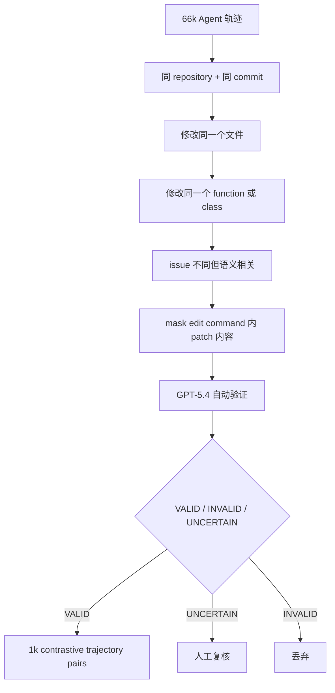

# ContextRL：把“看对上下文”变成 Agent 和多模态后训练的辅助奖励

### 元信息

| 字段 | 内容 |
| --- | --- |
| 论文 | Context-Aware RL for Agentic and Multimodal LLMs |
| 链接 | [https://arxiv.org/abs/2606.17053](https://arxiv.org/abs/2606.17053) |
| arXiv | 2606.17053v1，2026-06-15 |
| 类型 | 大模型后训练 / Agent / 多模态 grounding |
| 作者 | Peiyang Xu, Bangzheng Li, Sijia Liu, Karthik R. Narasimhan, Pramod Viswanath, Prateek Mittal, Xingyu Fu |

### TL;DR

- **这篇论文做什么**：提出 ContextRL，把 Agent 和多模态模型常见的“答案看起来对，但没有真正用到关键上下文”拆成一个可训练目标。它不只奖励最终答案，而是额外让模型在两个高度相似的上下文中选出哪个上下文支持给定答案。
- **怎么做**：作者在标准 GRPO 后训练旁边加一个 context-awareness loss。输入是 `(Q, A, C+, C-)`，其中 `C+` 支持答案，`C-` 是表面相似但支持另一个答案的干扰上下文。模型被训练在选项 token 上提高 `C+` 的 logit margin。
- **Agent 证据**：从 66k SWE-smith / AgentForge 轨迹中，用同仓库、同 commit、同文件、同函数/类、相关 issue、patch mask 和 GPT-5.4 验证筛出 1k 高精度对比轨迹；再与 7k 标准 SWE-Gym/SWE-Smith 任务一起训练。
- **多模态证据**：从图表、几何、非几何数学、科学图、自然图像构造 7k 对比图像；自然图像用生成式局部编辑，结构化图像用 Qwen3-VL-Embedding 8B 检索，阈值 `cos >= 0.85`，最终训练集是 38k 标准 QA + 7k 对比样本。
- **关键数字**：Agent 侧，Klear-AgentForge-8B 上 ContextRL 相比 GRPO 在 SWE-Bench Verified / Lite 从 28.0 / 21.7 提到 30.2 / 24.0，NIAH 从 65.5 到 71.3；Qwen3-8B 上五项长程任务全部提升。多模态侧，Qwen2.5-VL-7B 平均从 51.4 到 53.4，Qwen3-VL-8B 从 64.1 到 65.7，12 个 benchmark 全部优于 GRPO baseline。
- **最强对照**：同一批对比数据如果直接做 DA-SFT 或 DA-RL，效果不是小幅变差，而是在 Agent 场景可能崩溃。Klear-AgentForge-8B 的 DA-SFT 从 28.0 / 21.7 掉到 6.4 / 1.3，Qwen3-8B 掉到 0.00 / 0.00。
- **局限**：实验只覆盖 10B 以下模型，主要是 Qwen 系列；对比数据构造依赖 GPT-5.4、Nano Banana 2 和大量筛选；论文说明数据与代码将公开，但当前阅读时原文只给出 arXiv HTML/PDF 的完整细节，没有可直接复现实验的公开仓库。

### 研究问题：为什么“上下文无感”不是普通错误？

- 论文要处理的失败不是“模型没有能力推理”，而是：
  - 关键证据已经在上下文里。
  - 模型输出仍然没有被这个证据约束。
  - 最终答案可能局部合理，但和轨迹、代码、图像里的细节不一致。

- 作者用两个典型场景说明这个问题：
  - **Agentic coding**：模型能看到相关源文件，却在后续 edit 中删除或破坏变量定义，导致运行时错误。
  - **多模态推理**：模型能看到图像里的函数值，却把 `x -> -1` 时的 `g(x)` 读成错误数值。

- 这个定义把问题从“答案是否正确”推进到“答案是否由证据支持”：

| 层次 | 标准 RL 看到什么 | ContextRL 想补什么 |
| --- | --- | --- |
| 结果层 | patch 是否通过测试，答案是否 exact match | 只知道结果，不知道模型靠什么得到结果 |
| 证据层 | 轨迹、图像、工具输出、文件上下文 | 哪一段上下文真正支持当前答案 |
| 训练信号 | 最终奖励 `R(y)` | 辅助奖励“选中支持答案的上下文” |
| 风险 | 侥幸答对、利用 shortcut、忽略早期证据 | 让模型对关键证据产生可训练的偏好 |

### 论证路线：claim -> mechanism -> evidence -> boundary

| Claim | Mechanism | Evidence | Boundary |
| --- | --- | --- | --- |
| 开源模型在上下文 grounding 上有系统缺口 | 构造二选一 contrastive context probe | 200 个 Agent 轨迹对 + 200 个 VQA 图像对；GPT-5.4 / Claude Opus 4.7 稳定，Qwen3(VL) / Qwen3.5 接近随机 | probe 规模较小，是诊断工具，不是完整 benchmark |
| 标准 outcome RL 不区分“答对”和“看对证据” | 在 GRPO 上加 context-awareness loss | Agent 和多模态两条线全部优于 GRPO baseline | 仍需选择合适 `lambda`，过强会伤害主任务 |
| 对比数据本身不是主要原因 | 同数据走 DA-SFT / DA-RL 作为控制 | DA-SFT Agent 崩溃，DA-RL 基本无增益；ContextRL 有稳定增益 | 不能完全排除数据质量贡献，只能说明“目标函数怎么消费数据”更关键 |
| 信号能跨任务迁移 | 对比样本只用于训练，测试是标准任务格式 | LiveCodeBench、LongBench v2、NIAH、12 个多模态 benchmark 都提升 | 模型规模集中在 7B/8B，不能外推到 70B |

### 方法核心：让模型回答“哪个上下文支持这个答案？”

论文把一个训练样本写成：

```text
z = (Q, A, C+, C-)
```

- `Q`：问题或任务。
- `A`：目标答案、reference patch 或候选输出。
- `C+`：支持 `A` 的上下文。
- `C-`：表面很像，但支持另一个答案的干扰上下文。
- Agent 场景里，`C` 是完整轨迹 `tau`：reasoning trace、工具调用、sandbox observation、提交 patch。
- 多模态场景里，`C` 是图像 `I`：自然图、图表、几何图、科学图或数学图。

作者没有要求模型重新生成答案，而是给它一个二选一任务：

```text
Given Q and A, which context supports A?
Option A: C1
Option B: C2
```

这个设计的意义是：

- 它把“答案生成”和“证据选择”解耦。
- 它能接在任何 GRPO 类后训练流程旁边。
- 它不需要修改模型架构。
- 它让训练信号指向“支持关系”，而不是又一次监督最终输出。

### 公式：ContextRL 到底优化了什么？

论文的 context-awareness loss 使用两个选项 token 的 logit margin。

```text
Delta_theta(z) = ell_theta^+(z) - ell_theta^-(z)
L_CA(z; theta) = -log sigma(clip(Delta_theta(z), -c, c))
```

变量解释：

| 符号 | 含义 | 作用 |
| --- | --- | --- |
| `ell_theta^+(z)` | 正确上下文选项 token 的 next-token logit | 越高表示模型更相信 `C+` 支持答案 |
| `ell_theta^-(z)` | 干扰上下文选项 token 的 next-token logit | 越高表示模型被 `C-` 吸引 |
| `Delta_theta` | 正负上下文的 logit 差 | 直接度量 context preference |
| `clip(..., -c, c)` | margin 裁剪 | 防止已经很大的 margin 主导训练 |
| `sigma` | sigmoid | 把 margin 转成二分类概率式损失 |

联合训练目标是：

```text
L(theta) =
  E_{x ~ D_RL}[L_GRPO(x; theta)]
  + lambda * E_{z ~ D_CA}[L_CA(z; theta)]
```

这个式子的关键不是数学复杂度，而是职责分离：

- `L_GRPO` 继续负责“最终任务要做对”。
- `L_CA` 只负责“做对时要知道证据在哪里”。
- `lambda` 控制辅助信号强度。
- 论文后面的消融显示，`lambda` 不是越大越好；它必须是辅助项，而不是取代主任务的训练目标。

### Agent 对比轨迹如何构造？

作者从 66k 条 SWE-smith / AgentForge 轨迹出发，最终只保留 1k 条对比轨迹对，保留率约 1.5%。这个比例说明数据构造不是宽松采样，而是高精度筛选。

构造流水线可以理解为：



这里最重要的不是用了 GPT-5.4，而是筛选条件服务于同一个目的：

- 两条轨迹必须足够相似，不能靠仓库名、文件名、长度或格式猜。
- 它们又必须有一个小但决定性的差别，能支持不同 patch。
- patch 内容在 edit command 中被替换成 `<PATCH_MASKED>`，避免模型直接读答案。
- file view、测试输出、错误信息和 reasoning trace 保留，因为这些才是 Agent 真实可见证据。

### 多模态对比图像如何构造？

多模态侧最终训练集是 45k：

| 组成 | 数量 | 用途 |
| --- | ---: | --- |
| 标准单图 QA | 38,000 | `L_GRPO` |
| 对比图像 pairs | 7,000 | `L_CA` |
| 比例 | 85% / 15% | 平衡主任务和 grounding 辅助项 |

对比图像来自五类源：

| 子领域 | 数据来源示例 | 训练集占比 |
| --- | --- | ---: |
| Geometry | MAVIS-Geometry, Geo170K, R-CoT, Geometry3K | 46.06% |
| Non-geometric Math | MAVIS-Function, ICON-QA, MMK12 | 17.18% |
| Chart | DVQA, ChartQA | 12.28% |
| Science | M3CoT, ScienceQA | 11.30% |
| Natural Image | Visual-CoT, ViRL39K | 13.18% |

作者用两种构造方式：

1. **自然图像：局部生成式编辑**
   - GPT-5.4 生成改变答案的编辑指令。
   - Nano Banana 2 执行图像编辑。
   - GPT-5.4 检查是否有 blur、warping、边界破碎、光照不一致、全局 restyle 等 shortcut。
   - 2k 候选中保留约 700，约 35%。

2. **结构化图像：相似检索**
   - 图表、几何、科学图不适合随意编辑，因为很容易破坏语义约束。
   - 用 Qwen3-VL-Embedding 8B 做图像 embedding。
   - 检索满足 `cos(f_I(I), f_I(I')) >= 0.85` 且答案不同的图像。
   - 超过 200k 候选中保留 6,300，约 3.1%。

这个设计说明论文并不是在训练模型识别“生成图像痕迹”。作者还专门强调：标准 benchmark 测试时使用自然、未编辑、单图格式；如果模型只是学会识别构造 artifact，增益不应迁移到这些任务。

### Agent 实验：ContextRL 在长程任务上补什么？

Agent 训练设置：

| 项 | 设置 |
| --- | --- |
| Base models | Qwen3-8B, Klear-AgentForge-8B |
| RL 框架 | SkyRL + mini-SWE-agent scaffold |
| 训练数据 | 7k 标准 SWE-Gym/SWE-Smith coding tasks + 1k contrastive trajectories |
| 对照 | Base, standard GRPO, ContextRL |
| ID benchmark | SWE-Bench Verified, SWE-Bench Lite |
| OOD benchmark | LiveCodeBench v6, LongBench v2, Needle-in-a-Haystack |

主结果可以压缩成下面的表：

| Base | 方法 | Verified | Lite | LiveCodeBench | LongBench overall | LongBench long | NIAH |
| --- | --- | ---: | ---: | ---: | ---: | ---: | ---: |
| Qwen3-8B | Base | 5.0 | 2.7 | 44.6 | 31.6 | 27.8 | 98.8 |
| Qwen3-8B | GRPO | 6.2 | 2.7 | 46.3 | 31.8 | 26.9 | 98.5 |
| Qwen3-8B | ContextRL | 7.0 | 4.0 | 47.4 | 33.2 | 29.6 | 99.0 |
| Klear-AgentForge-8B | Base | 26.6 | 21.0 | 21.7 | 27.4 | 21.3 | 68.3 |
| Klear-AgentForge-8B | GRPO | 28.0 | 21.7 | 22.3 | 27.0 | 24.1 | 65.5 |
| Klear-AgentForge-8B | ContextRL | 30.2 | 24.0 | 24.0 | 29.6 | 28.7 | 71.3 |

几个值得单独解释的点：

- **不是只在 SWE-Bench 上涨**：
  - LiveCodeBench、LongBench、NIAH 都是 OOD。
  - 对比轨迹来自 Agent coding，但增益迁移到长上下文 QA 和 needle retrieval。

- **GRPO 可能伤害 long-context grounding**：
  - Klear-AgentForge-8B 在 NIAH 上从 base 68.3 掉到 GRPO 65.5。
  - ContextRL 拉到 71.3。
  - 这支持作者的核心判断：结果奖励会强化“会做任务”的行为，但不保证模型更重视关键上下文。

- **和大模型对比要谨慎读**：
  - Klear-AgentForge-8B + ContextRL 在 SWE-Bench Verified 30.2，超过 Qwen3-Coder-30B 的 28.8。
  - 但 Qwen3-Coder-30B 在 LongBench long 是 41.7，明显高于 Klear 的 28.7。
  - 所以这不是“小模型全面超过大模型”，而是“领域适配模型 + 上下文辅助目标在 Agent coding 上很有效”。

### 多模态实验：为什么 12 个 benchmark 全部提升很关键？

多模态设置：

| 项 | 设置 |
| --- | --- |
| Base models | Qwen2.5-VL-7B-Instruct, Qwen3-VL-8B-Instruct |
| RL 框架 | Easy-R1 |
| 训练数据 | 38k 单图 QA + 7k 对比图像 pairs |
| 对照 | Base, GRPO, PAPO(Qwen2.5-VL), ContextRL |
| Benchmark | MathVista, MathVerse, MathVision, MMMU-Pro, MMMU, V*, MMStar, BLINK, ScienceQA, PhyX, OlympiadBench Physics, MME-RealWorld Lite |

总体结果：

| 模型 | Base | GRPO | ContextRL | 相比 GRPO |
| --- | ---: | ---: | ---: | ---: |
| Qwen2.5-VL-7B | 47.0 | 51.4 | 53.4 | +2.0 |
| Qwen3-VL-8B | 58.3 | 64.1 | 65.7 | +1.6 |

挑几个有代表性的 benchmark：

| Benchmark | Qwen2.5-VL GRPO -> ContextRL | Qwen3-VL GRPO -> ContextRL | 解读 |
| --- | ---: | ---: | --- |
| ScienceQA | 91.0 -> 95.4 | 95.6 -> 96.6 | 对科学图文细节有明显帮助 |
| MathVision | 25.5 -> 26.8 | 49.2 -> 52.0 | 复杂视觉数学推理受益 |
| MME-RealWorld Lite | 45.1 -> 46.7 | 51.9 -> 54.8 | 真实场景细节 grounding 提升 |
| V* | 70.7 -> 73.3 | 84.8 -> 85.9 | 细粒度视觉感知提升 |
| OlympiadBench Physics | 3.1 -> 4.6 | 8.1 -> 9.9 | 低基线任务也有提升，但绝对能力仍弱 |

12 个 benchmark 全部超过 GRPO baseline 的意义在于：

- 它不像某个单项 benchmark 的 tuning。
- 它覆盖感知、数学、科学和真实场景。
- 它说明 context-selection loss 可能学到的是“答案和证据对齐”的一般行为。
- 但增益幅度仍是 1 到 4 点量级，不是解决多模态推理的根本瓶颈。

### 最强反证：为什么普通数据增强不够？

作者最有价值的实验不是主表，而是第 5 节的 data augmentation 对照。它回答一个直接质疑：

> ContextRL 的提升是不是只是因为多喂了 1k / 7k 高质量对比数据？

他们做了两种控制：

| 方法 | 如何使用同一批对比数据 | 预期如果“数据本身足够”会怎样 |
| --- | --- | --- |
| DA-SFT | 先用交叉熵学会选正确上下文，再 GRPO | 应该至少不明显伤害主任务 |
| DA-RL | 把对比任务混入 RL，用选对给 1、选错给 0 | 应该带来类似 ContextRL 的 grounding 增益 |
| ContextRL | 不让对比任务替代主任务，而是 logit margin 辅助损失 | 如果目标函数重要，它会优于两者 |

Agent 结果非常尖锐：

| Base | 方法 | Verified | Lite |
| --- | --- | ---: | ---: |
| Klear-AgentForge-8B | GRPO | 28.0 | 21.7 |
| Klear-AgentForge-8B | DA-SFT | 6.4 | 1.3 |
| Klear-AgentForge-8B | DA-RL | 27.6 | 21.7 |
| Klear-AgentForge-8B | ContextRL | 30.2 | 24.0 |
| Qwen3-8B | GRPO | 6.2 | 2.7 |
| Qwen3-8B | DA-SFT | 0.0 | 0.0 |
| Qwen3-8B | DA-RL | 5.6 | 3.0 |
| Qwen3-8B | ContextRL | 7.0 | 4.0 |

这个结果的解释是：

- DA-SFT 让模型学会短格式二选一，却破坏了长程工具使用策略。
- DA-RL 把对比选择当成另一个 outcome reward，信号太稀疏，不能稳定改变 grounding 行为。
- ContextRL 不改变主任务格式，只在 logit 级别提供辅助偏好，所以对长程 policy 的破坏小得多。

这也是论文对后训练领域的真正贡献：

- 高质量数据不是自动产生高质量行为。
- 后训练目标要保护原任务能力，同时给模型一个“为什么这个输出被支持”的局部梯度。
- 对 Agent 来说，不能把所有行为都压成 pass/fail；需要针对轨迹证据设计中间目标。

### 训练和消融：辅助项太强会反噬

Agent 训练超参里，几个数字值得记：

| 超参 | 值 |
| --- | --- |
| KL coefficient | `beta = 1e-3` |
| learning rate | `2e-6` |
| rollouts per prompt | 8 |
| max agent turns | 35 |
| CA margin clip | 5.0 |
| CA coefficient | Klear 0.005，Qwen3-8B 0.001 |
| epochs | 3 |

多模态训练：

| 超参 | 值 |
| --- | --- |
| KL coefficient | `1e-2` |
| learning rate | `1e-6` |
| rollout batch size | 256 |
| rollouts per prompt | 8 |
| max prompt length | 16,384 |
| max response length | 4,096 |
| CA batch size | 32 |
| CA coefficient | Qwen2.5-VL 0.005，Qwen3-VL 0.001 |

消融结论很清楚：

- Agent 侧 `lambda = 0.005` 最好：
  - `0.001`：Verified 28.2，Lite 21.3，基本接近 GRPO。
  - `0.005`：Verified 30.2，Lite 24.0。
  - `0.01`：Verified 28.2，Lite 20.0，反而变差。
- 多模态侧 15% 对比数据最好：
  - 5% 到 15% 通常提升。
  - 20% 和 50% 会挤占标准 reasoning supervision。
  - 50% 时多数 benchmark 退到 5% 水平或更差。
- max response length 不是越长越好：
  - 2048 到 4096 多数任务提升。
  - 8192 对 MathVision / MMMU 有帮助，但会伤害 ScienceQA、OlympiadBench Physics、MME-RealWorld。

这组消融支持一个实际后训练原则：

```text
辅助 grounding 目标应该像校准器，而不是新的主任务。
lambda 太小 -> 模型学不到 context preference。
lambda 太大 -> CA 梯度覆盖 GRPO，主任务能力下降。
对比数据太多 -> 模型练成选择器，而不是更好的 Agent / VLM。
```

### 成本与复现边界

论文给出的训练资源并不轻：

| Setting | Base model | Wall-clock | GPU-hours |
| --- | --- | ---: | ---: |
| Multimodal | Qwen2.5-VL-7B | 约 60h | 约 240 |
| Multimodal | Qwen3-VL-8B | 约 72h | 约 288 |
| Agentic | Klear-AgentForge-8B-SFT | 约 72h | 约 288 |
| Agentic | Qwen3-8B | 约 72h | 约 288 |

硬件是单节点 `4 x NVIDIA H200 140GB`，并有 NVLink 和至少 500GB host RAM。数据构造还额外调用：

- Nano Banana 2 约 10k 次，用于自然图像编辑。
- GPT-5.4 约 10k 次，用于自动验证编辑图像。
- Agent 轨迹对也用 GPT-5.4 做高精度过滤，并对 uncertain case 人工复核。

所以复现边界包括：

- 成本不是普通实验室随手可跑。
- 数据构造依赖未必公开可替代的强模型和图像编辑器。
- 论文当前说 data/code/model/dataset will be publicly released；阅读时完整论文可读，但外部项目页没有稳定落地，复现实验仍要等作者发布。

### Figure / Table 证据该怎么读？

| 证据 | 支持什么 | 不能证明什么 |
| --- | --- | --- |
| Figure 1 | context unawareness 同时出现在 code edit 和视觉读数中 | 只是案例，不证明普遍性 |
| Figure 2 | closed models 与部分开源模型在 contrast probe 上有约 40 点差距 | probe 只有 200+200，对真实任务覆盖有限 |
| Figure 3 | ContextRL 可以作为 GRPO 辅助项接入 | 不说明所有 RL 算法都适配 |
| Figure 4 | 对比轨迹/图像的构造流程 | 构造质量依赖 verifier 和人工复核 |
| Table 1 | Agent / 长上下文任务全项优于 GRPO | 主要模型小于 10B，不能外推大模型 |
| Table 2 | 12 个多模态 benchmark 全项提升 | 增益多为小幅，不是能力跃迁 |
| Table 3/4 | 同数据 DA-SFT/DA-RL 不足 | 只能反驳常见增强方式，不能穷尽所有数据利用方式 |
| Table 5 | 对比数据保留率低，shortcut 过滤严格 | 仍不能形式化证明无 artifact |
| Table 10 | `lambda=0.005` 在 Agent 侧最好 | 只扫了三个值，最优区间仍粗 |

### 和已有后训练工作的关系

ContextRL 可以放在三条线之间看：

| 方向 | 代表思路 | ContextRL 的位置 |
| --- | --- | --- |
| RLVR / GRPO | 用 outcome reward 强化最终答案 | 保留 GRPO，但补一个证据选择辅助项 |
| Agent training | 用 SWE-Gym/SWE-Bench 类任务训练工具调用和代码修复 | 关注轨迹里哪个上下文支持 patch，而不只看 test pass |
| Multimodal grounding | 用 perception-aware reward 或专门数据改善视觉细节 | 把视觉 grounding 也写成支持上下文选择问题 |

它最像一种“post-training 中的证据对齐层”：

- 对 Agent：看的是轨迹、工具输出、文件状态和最终 patch 的一致性。
- 对多模态：看的是图像细节和答案之间的支持关系。
- 对长上下文：看的是决定性 needle 是否真正进入生成决策。

### 失败案例与未解决问题

论文没有把失败案例展开得特别细，但从实验和消融可以推出几个边界：

- **DA-SFT 崩溃是重要警告**：
  - 如果把 Agent 模型先训成“短选择题模型”，长程工具使用 policy 会被破坏。
  - 这说明后训练不能只追求 auxiliary task accuracy。

- **CA 目标过强会和 GRPO 竞争**：
  - `lambda=0.01` 在 Agent 和多模态都开始伤害性能。
  - 这说明 grounding 信号不是越多越好，它要服从主任务。

- **大模型外推未证明**：
  - 小模型可能更缺 grounding，所以受益更明显。
  - 30B/70B 模型可能已经有部分能力，也可能需要不同 `lambda`。

- **安全含义需要谨慎**：
  - 更会看上下文的 Agent 可能更可靠。
  - 但同样也可能让高能力 Agent 更有效地完成有害任务。
  - 论文的 broader impact 只说不需要敏感数据，并不等于没有滥用风险。

### 机制细读：ContextRL 为什么不是“再加一个分类任务”？

把这篇论文读成“给模型做二分类辅助训练”会错过它真正有用的地方。普通二分类任务的问题是：模型可能把短 prompt、选项 token 和固定格式学得很好，却把长程 Agent policy 学坏。DA-SFT 崩溃正好说明这一点。

ContextRL 的细微差别在于：

- 它没有让 contrastive task 取代主任务 rollout。
- 它没有把 `C+ / C-` 的选择当成和 patch pass/fail 同等地位的新任务。
- 它只在选项 token 的 logit margin 上施加一个低权重偏置。
- 它还用 `clip` 限制 margin，避免已经容易区分的对比样本继续压过主任务梯度。

可以把训练信号拆成三种梯度：

| 梯度来源 | 学到什么 | 风险 |
| --- | --- | --- |
| GRPO outcome reward | 哪些输出最终通过测试或 exact match | 可能强化 shortcut，不知道证据来源 |
| DA-SFT selection CE | 如何在短格式里选正确上下文 | 可能破坏长程交互格式和工具使用 policy |
| ContextRL margin loss | 在保持主任务训练时，提高支持上下文相对 logit | 如果 `lambda` 太大，会压过主任务 |

这也解释了为什么论文反复强调 `lambda` 和比例：

- `lambda = 0.001` 时，Agent 侧信号太弱，结果接近 GRPO。
- `lambda = 0.005` 时，Klear-AgentForge-8B 的 Verified / Lite 到 30.2 / 24.0。
- `lambda = 0.01` 时，Lite 掉到 20.0，低于 GRPO 的 21.7。
- 多模态 15% 对比数据最好，50% 对比数据反而普遍变差。

所以 ContextRL 的贡献不是“发现二选一数据有用”，而是“把二选一数据变成不会摧毁原 policy 的辅助约束”。

### 细节库存：这篇论文给后续复现留下了哪些可检查项？

| 类别 | 论文给出的具体项 | 复现时应检查什么 |
| --- | --- | --- |
| Agent 数据 | 66k 轨迹筛到 1k；同 repo / commit / file / function；patch mask | 是否真的没有 patch token 泄漏；两条轨迹长度和观察内容是否接近 |
| Agent 框架 | SkyRL + mini-SWE-agent；max turns 35；prompt/response per turn 4096 | evaluation scaffold 是否和训练 scaffold 一致 |
| Agent benchmark | SWE-Bench Verified/Lite, LiveCodeBench v6, LongBench v2, NIAH | SWE-Gym 训练实例是否和 SWE-Bench evaluation 去重 |
| 多模态数据 | 38k 标准 QA + 7k 对比图像；五类视觉源 | 训练 split 和 evaluation split 是否隔离 |
| 图像构造 | 700 生成编辑 pairs；6300 相似检索 pairs；`cos >= 0.85` | 编辑 artifact、全局风格变化、答案标注错误是否被过滤 |
| 训练资源 | 4 x H200；单 run 240 到 288 GPU-hours | ablation 和 DA 对照是否也计入同级别成本 |
| 公开状态 | 论文写 data/code/model/dataset will be publicly released | 仓库发布前，外部无法完整复现实验 |

### 如果把 ContextRL 用到安全 Agent，会遇到什么新问题？

这篇论文虽然不以 AI safety 为主，但它给安全 Agent 后训练提供了一个可迁移模板。把 `C+` 和 `C-` 改成安全上下文后，可以构造几类任务：

| 安全场景 | `C+` | `C-` | 训练目标 |
| --- | --- | --- | --- |
| 工具权限 | 包含明确权限限制的轨迹 | 忽略权限或隐藏越权诱因的轨迹 | 选择支持拒绝或降权执行的上下文 |
| Web agent 防注入 | 页面中可信系统指令和用户目标一致 | 页面含间接 prompt injection | 识别哪段上下文真正有权限约束力 |
| Coding agent 安全修补 | 测试通过且安全检查通过的 patch 轨迹 | 只通过功能测试但引入 unsafe pattern | 让模型区分功能成功和安全成功 |
| 数据外泄 | 上下文要求最小化输出 | 上下文诱导复制敏感字段 | 让模型把隐私约束视为支持证据 |

但安全迁移也有两个额外难点：

- **标签更难**：功能任务有测试，图像任务有答案；安全约束往往要靠 policy、静态分析、人工判断或沙箱事件组合标签。
- **攻击者会适应**：一旦模型被训练成寻找支持证据，攻击者可能构造“伪支持上下文”，让恶意指令看起来更像合法 evidence。

因此，安全版 ContextRL 不能只学习“哪个上下文更像支持答案”，还要学习“哪个上下文有权限成为证据”。这要求把权限层级、来源可信度和用户意图一起放进训练目标。

### 研究者视角的结论

ContextRL 的重要性不在于“又提升了几个 benchmark 点”，而在于它给后训练提出了一个更细的目标分解：

1. **Outcome reward 只告诉模型答案有没有过关。**
2. **Context-selection loss 告诉模型哪个证据让答案过关。**
3. **两者相加，才更接近真实 Agent 和多模态推理需要的能力。**

对大模型 Agent 方向，最直接的问题是：

- coding agent 是否可以为每次 edit 训练一个“哪个 observation 支持这次修改”的辅助目标？
- browser / computer-use agent 是否可以用 DOM state、screenshot、tool result 构造类似的 `C+ / C-`？
- 安全 sandbox 里，能否把“安全约束上下文”也作为必须选择的支持证据，而不是只奖励任务完成？

对后训练方向，ContextRL 给了一个可迁移原则：

- 不要把所有高质量数据都塞进 SFT。
- 不要把所有中间任务都混进 outcome RL。
- 更好的方式可能是保留主任务 rollouts，同时在关键内部决策点加局部、低权重、可解释的辅助 loss。

对 AI 安全方向，论文也提示了一个更难的问题：

- 如果模型可以被训练成“更相信支持当前答案的上下文”，那么它也可能被训练成“更相信支持当前目标的上下文”。
- 所以后续安全研究不能只看 grounding 是否提升，还要看它是否提升了对安全约束、权限边界和用户真实意图的 grounding。
- 换句话说，ContextRL 是 reliability 工具，不自动是 safety 工具；它需要和权限、拒绝策略、监督信号一起设计。

### 继续追问

- **更大模型是否仍然需要 ContextRL**：论文未测试 30B+ / 70B+。如果大模型已经在 probe 上接近 closed model，增益可能变小；如果大模型在长程 Agent 轨迹中仍会忽略早期 evidence，增益仍可能存在。
- **能否去掉强 verifier 依赖**：当前数据质量依赖 GPT-5.4 和人工复核。未来更可复现的方向是用 programmatic verifier、test traces、static analysis 或视觉一致性检查替代一部分强模型判断。
- **能否服务安全约束**：把 `C+` 定义为支持安全行为的上下文，把 `C-` 定义为诱导越权或忽略 policy 的上下文，可能形成一种 safety-aware ContextRL。
- **能否在线更新**：Agent 在真实任务中不断产生新轨迹。如何从失败轨迹自动挖掘 contrastive contexts，是把这篇方法从论文训练推向持续后训练的关键。

### 参考链接

- [arXiv abstract](https://arxiv.org/abs/2606.17053)
- [arXiv HTML full text](https://arxiv.org/html/2606.17053v1)
- [arXiv cs.CL recent list, Tue 16 Jun 2026](https://arxiv.org/list/cs.CL/recent)
