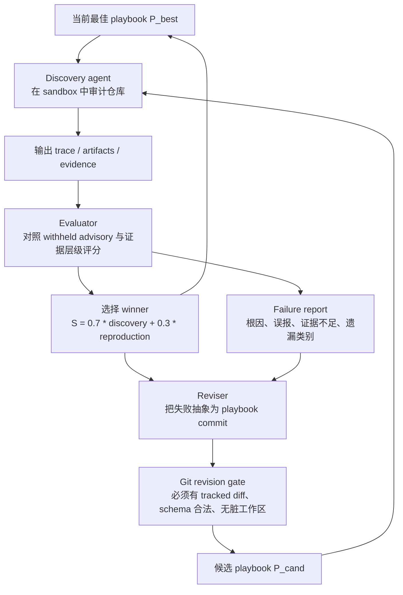

# Transferable Self-Evolving Playbooks for Agentic Security Auditing：把安全审计能力从模型权重里“外置”为可演化流程

### 元信息与 TL;DR

- **论文**：[Transferable Self-Evolving Playbooks for Agentic Security Auditing](https://arxiv.org/abs/2606.16420)
- **版本**：arXiv:2606.16420v1，2026-06-15 提交。
- **方向**：AI 安全 / AI for Security / Agentic security auditing。
- **核心对象**：EvoHunt，一个让代码审计 Agent 通过反复尝试、评估和修订，自动沉淀安全审计 playbook 的框架。
- **关键问题**：Agent 找漏洞的能力到底来自更强模型，还是来自可学习、可复用、可迁移的审计流程？
- **关键做法**：固定模型和 harness，只让外部 playbook 变；用发现 Agent、评估器、修订器组成循环，把失败分析写回 Git 版本化文档。
- **实验规模**：训练 split 来自 2023-01 到 2025-12 的 813 个 GitHub-reviewed 高危/严重 advisory；测试 split 来自 2026-01 到 2026-04 的 371 个 held-out advisory。
- **主要结果**：
  - Codex/GPT5.4-xhigh 从空 playbook 到演化 playbook，target-match 从 6/371 提升到 23/371，约 1.6% 到 6.2%。
  - OpenCode/GLM5.1 从 36/371 提升到 42/371，约 9.7% 到 11.3%。
  - GLM 演化出的 playbook 迁移给 Qwen3.6-27B，使 target-match 从 9/371 到 24/371；迁移给 Qwen3.6-35B-A3B，使 4/371 到 17/371。
  - Codex/GPT 演化 playbook 的特点是高精度：23 个 target-match 全是 T1 端到端 exploit 证据；GLM playbook 的特点是广覆盖：绝对命中更多，但 no-match 和混合证据层级也更多。
- **局限**：
  - Codex/GPT 和 GLM/OpenCode 同时改变了模型与 harness，不能把差异完全归因于模型。
  - 评估依赖 LLM judge 加人工抽样复核，边界案例仍可能误判。
  - 每个 playbook 只演化一次，结果更像“存在性证明”，不是稳定均值。
  - 公开 artifacts 仓库显示分阶段发布，Phase 1 仍标记为 In Progress；复现实验还依赖后续材料完整度。

### 研究问题：漏洞审计是不是只是在拼更强模型？

这篇论文把“AI 安全审计 Agent”拆成三个层：

| 层次 | 论文里的定义 | 为什么重要 |
|---|---|---|
| Model | 负责代码理解、安全推理、长程规划的 LLM | 决定语义理解、上下文保持和工具恢复能力 |
| Harness | Codex、OpenCode 这类执行环境 | 负责文件系统、shell、浏览器、上下文压缩、子任务和沙箱 |
| Playbook | 外部审计流程和知识库 | 决定看什么、何时验证、何时停止、怎样拒绝伪阳性 |

作者的主张不是“模型不重要”，而是：

- 很多审计失败不是模型完全不会，而是**方法失败**。
- Agent 可能：
  - 在错误攻击面上消耗预算。
  - 找到邻近 bug，却没有命中 benchmark 的真实 root cause。
  - 有静态怀疑，但没有 PoC。
  - 已经看到 sink，却没有把 source-to-sink 证据链闭合。
  - 过早停止，没清掉 sibling attack surfaces。
- 如果这些失败能转成版本化流程，下一轮 Agent 就可能少犯同类错。

这就是论文的两个 RQ：

| RQ | 问题 | 控制变量 |
|---|---|---|
| RQ1 Acquisition | 不改模型和 harness，只演化 playbook，能不能提升审计？ | 同一模型、同一 harness、同一测试集，只比较空 playbook 和演化 playbook |
| RQ2 Transfer | 强模型演化出的 playbook，能不能迁移给弱模型？ | 源 playbook 冻结，只允许目标模型加小 adapter |

### EvoHunt 的核心机制：把“学习”放进文本仓库，而不是权重

EvoHunt 的学习对象不是 checkpoint，而是一个 Git 仓库：

- workflow rules：审计阶段、停止条件、验证门槛。
- vulnerability-class guides：不同 CWE/漏洞族的定位与验证策略。
- validation gates：报告前必须满足的运行证据。
- false-positive controls：如何排除邻近 bug、预期行为和不可利用路径。
- subagent instructions：需要时给子任务的审计边界。

作者把 continual learning 类比到 playbook 空间：

```text
训练批次：C_b = N_b ∪ R_b

其中：
- N_b：本轮新 advisory cases
- R_b：从历史中召回的 replay cases
- C_b：本轮用于比较 playbook 的审计批次
```

对每个 playbook `P`，固定 Agent 环境 `G` 后运行：

```text
X_{P,C_b} = { run(G, P, case) : case ∈ C_b }
```

评估器把运行记录、证据和 withheld label 映射为：

```text
Eval(P, C_b, X_{P,C_b}, L_{C_b}) -> (S(P, C_b), F(P, C_b))

S：用于选择当前最佳 playbook 的分数
F：用于修订 playbook 的失败报告
```

修订器再做文本空间里的“梯度步”：

```text
Revise(P, F) -> P'
```

这里最关键的约束是：

- `P'` 不能记住具体仓库名、advisory id 或 exploit 字符串。
- 修订必须把失败抽象成可复用审计规则。
- 候选 playbook 必须先进入下一轮 tournament，不能未经测试就覆盖 incumbent。

### 演化循环：三个 Agent 分工



这个循环的工程细节很重要：

- 每个 rollout 最多 20 turns。
- 单次 wall-clock 上限 2 小时。
- 每个 batch 最多 10 个新 cases，加 0.25 replay ratio。
- 每个 playbook branch 最多同时跑 2 个 cases。
- revision gate 允许最多 3 次修复。
- 选择分数把 discovery correctness 权重设为 0.7，把 reproduction effectiveness 设为 0.3。

这些设置说明作者不是只写了一个“让模型总结经验”的 prompt，而是把 playbook 作为可测试、可回滚、可比较的实验对象。

### Benchmark：为什么这个测试集比普通漏洞分类更难？

论文从 GitHub Advisory Database 构造 benchmark，筛选条件偏严格：

| 维度 | 训练 split | 测试 split |
|---|---:|---:|
| 时间 | 2023-01 到 2025-12 | 2026-01 到 2026-04 |
| Advisories | 813 | 371 |
| High severity | 632，77.7% | 287，77.4% |
| Critical severity | 181，22.3% | 84，22.6% |
| Unique packages / repos | 707 / 541 | 236 / 201 |
| Overlap packages / repos | - | 50 / 51 |

作者还要求漏洞可在本地复现：

- 排除需要真实云服务、生产基础设施或物理访问的案例。
- 优先保留 CVSS v4.0 下可触达、低复杂度、可由外部或低权限攻击者触发的漏洞。
- 测试集中 95.7% 是 network attack vector。
- 69.8% 不需要权限。
- 89.8% 不需要用户交互。

这让任务接近真实 Agent 审计：

- 不是“给一段函数，让模型二分类”。
- Agent 要 checkout 仓库、读代码、跑测试、构造 PoC。
- 成功不看是否发现“某个安全味道”，而是看是否命中 held-out advisory 的同一组件与同一 root cause。

### 评分协议：T1/T2/T3 比单一 accuracy 更有信息量

论文把 findings 分成四步处理：

1. **Qualification**
   - 重新按系统和威胁模型判断 CVSS。
   - 只有 High/Critical 级别才保留。

2. **Target matching**
   - 必须匹配 held-out advisory 的同一 vulnerable component 和 root-cause mechanism。
   - 同仓库、同 endpoint、同 CWE、同漏洞大类都不够。
   - 真实但不同的漏洞记作 off-target，不算 target credit。

3. **Evidence tiering**
   - T1：端到端 exploit，能观察到完整安全影响。
   - T2：PoC 能触发 vulnerable path，但还没证明完整影响。
   - T3：静态或不完整证据，能匹配 root cause，但缺 runtime 证据。

4. **Outcome classification**
   - target-match 和 no-match 分开计。
   - off-target findings 不抹掉，而是作为审计价值与 benchmark 目标不一致的证据。

这个设计的好处是：

| 单一指标会掩盖的问题 | T1/T2/T3 能看见什么 |
|---|---|
| 静态猜测和可运行 exploit 被混为一谈 | 能区分可执行证据强度 |
| 广撒网模型可能看起来命中多 | no-match 与 false positive 会暴露审计成本 |
| 高精度模型可能命中少 | T1-only profile 显示发现质量 |
| off-target 真漏洞被算错 | 能单独讨论“benchmark 失败但审计有价值” |

### Detail inventory：这篇论文真正可核验的细节

为了避免把它读成“Agent 会自我改进”的概念文，最好先列清楚作者实际给了哪些可核验对象。

| 维度 | 具体细节 | 解读价值 |
|---|---|---|
| 数据来源 | GitHub Advisory Database 中 GitHub-reviewed advisories | 避免用随机 issue 或弱标注漏洞当 ground truth |
| 时间切分 | 训练到 2025-12，测试为 2026-01 到 2026-04 | 减少直接看过同一 advisory 的泄漏风险 |
| 测试规模 | 371 个 held-out advisories | 足够暴露不同生态和 CWE 的分布差异 |
| 生态 | PyPI、npm、Maven、Go、Packagist 等占主导 | 任务是多语言应用安全，不是单一语言 benchmark |
| 漏洞族 | 前五类只覆盖测试集约三分之一 | Playbook 不能只记几个热门 CWE |
| 执行环境 | 固定 Apple M4 机器，Codex/OpenCode 默认配置 | 结果仍受本地执行、上下文压缩和 harness 限制影响 |
| 证据对象 | trace、artifacts、execution logs、reproduction scripts | 支持 T1/T2 验证，不只靠模型解释 |
| 成本信息 | 演化预算约 1,400 美元，单 case 推理约 0.5 到 2 美元量级 | 说明 playbook evolution 是可以工程化摊销的，而不是无限烧钱 |

这些细节共同支撑一个判断：

- EvoHunt 的重点不是“论文里有一个更聪明的提示词”。
- 它是在建立一个可审计训练循环。
- 每一轮的 playbook diff、评估记录、winner selection 都应该被当成实验数据。
- 如果后续 artifacts 完整释放，读者可以检查某条规则到底来自哪一类失败，而不是只相信最终分数。

### 失败模式：playbook 在修什么？

从论文的 scoring protocol、rusqlite case 和 playbook 摘要看，EvoHunt 主要在修六类安全 Agent 常见失败。

| 失败模式 | 空 Agent 的典型表现 | Playbook 对应约束 |
|---|---|---|
| 攻击面漂移 | 看到一个 sink 就追下去，忽略入口是否可信 | 先建立 release-surface map 和 trust-boundary checklist |
| 邻近 bug 误报 | 报告同文件、同 CWE、同 endpoint 的另一个问题 | target matching 要求同组件和同 root cause |
| 证据不足 | 静态解释很像漏洞，但 PoC 不能触发影响 | T1/T2/T3 分层，报告前要求 reproduction artifact |
| 过早停止 | 找到第一个 plausible finding 就结束 | GLM-style playbook 强制继续扫其他漏洞族 |
| 预算失控 | 在太多假设上反复验证，耗尽 turns | GPT-style playbook 把活跃组件族限制在 3 到 6 个 |
| 训练集记忆 | 把 advisory 特征写进流程，无法泛化 | revision 要抽象失败模式，不能记仓库名和 exploit 字符串 |

这里有一个值得强调的研究含义：

- 如果一个安全 Agent 只能靠更大模型解决这些问题，成本会持续上升。
- 如果一部分失败能被外部流程约束，组织就可以把经验变成版本化资产。
- 这个资产的审计难度远低于模型权重：reviewer 可以看 diff、看被加入的 rule、看它修复了哪个 failure report。

### 公式化看待“流程迁移”

论文把 transfer 拆成两个层次，这比普通 prompt transfer 更严谨。

第一层是 source playbook 直接迁移：

```text
Direct transfer:
G_t + P_s^* -> run on C_test
```

如果 direct transfer 已经提升，说明源流程里有一部分规则对目标模型可执行。

第二层是 adapter 迁移：

```text
Adapted transfer:
G_t + (P_s^* ⊕ A_t^*) -> run on C_test
```

如果 adapted transfer 继续提升，说明目标模型不是完全不能执行源流程，而是需要补充“如何在自己这个 harness/模型能力下执行”的说明。

可以把残差写成：

```text
Residual = S(G_s, P_s^*, C_test) - S(G_t, P_{s -> t}, C_test)
```

这个残差很重要：

- 它不是“流程还能不能写得更细”的全部。
- 它也包含目标模型本身的限制。
- 例如上下文管理更弱、工具调用恢复更差、代码执行错误处理更不稳，都可能留在 residual 里。
- 因此论文没有把弱模型 + playbook 包装成强模型替代品，而是给出一个能力分解方式。

### 为什么 GLM playbook 更适合弱 student？

从实验结果看，GLM teacher 的 playbook 给 Qwen students 带来的 target-match 更多。原因不是“GLM 一定更聪明”，而是它的流程更显式。

GPT-style playbook 更像给强审计员看的方法论：

- 维护少量高优先级组件族。
- 在 competing root causes 之间主动剪枝。
- 用 repository-local signal 判断哪个攻击面更中心。
- 只接受能做到端到端影响的报告。

这种流程对强模型友好，因为它默认模型能做隐式判断：

- 哪个 endpoint 才是核心路径？
- 哪个 sibling family 已经被合理排除？
- 哪个 PoC 失败是环境问题，哪个是漏洞假设错误？
- 什么时候继续追，什么时候停止？

GLM-style playbook 更像给弱审计员的操作清单：

- 明确要求枚举所有 endpoint。
- 明确要求 per-parameter audit。
- 明确要求发现一个 bug 后还要 anti-anchoring。
- 明确要求 DoS、SSRF、RCE、SQLi、authorization 等多类继续扫。
- 明确要求提交前做 root-cause alignment。

所以对 Qwen A3B 这种更弱 student：

- GPT playbook 的“留白”可能太多。
- GLM playbook 把许多判断转成显式步骤。
- 弱模型执行步骤的能力，可能强于自行设计审计日程的能力。

这也解释了代价：

- 显式枚举会扩大搜索面。
- 搜索面扩大后 no-match 会增加。
- 弱模型在大量候选中保持证据纪律更难。
- 因此 GLM transfer 对 A3B 的 target-match 提升明显，但 false positive 仍高。

### 和已有安全 benchmark 的位置关系

论文把 EvoHunt 放在几个相邻方向之间：

| 方向 | 典型关注点 | EvoHunt 的差异 |
|---|---|---|
| CyberGym / ExploitGym 类 benchmark | Agent 能否完成真实网络安全任务或 exploit reproduction | EvoHunt 更关注审计 procedure 是否能被学习和迁移 |
| RepoAudit / repository-level vulnerability detection | 给仓库级上下文，评测模型找漏洞能力 | EvoHunt 把 workflow 本身作为 learned artifact |
| LLMxCPG / static-analysis assisted systems | 用图、数据流、静态分析降低幻觉 | EvoHunt 不绑定单一分析器，而学习完整审计流程 |
| Vul-RAG / 外部知识检索 | 用历史 CVE 或知识库增强检测 | EvoHunt 不只是检索知识，而是演化验证与停止规则 |
| ExpeL / Memento / Agent learning | Agent 从经验中改善行为 | EvoHunt 要求版本化 playbook、branch tournament 和 cross-model transfer |

这说明本文的研究贡献不在“又一个漏洞检测器”，而在把安全审计经验转成可选择、可迁移、可追责的程序化文本。

### 对 Daily Report 读者最有用的判断

如果把这篇论文用于真实安全团队，不应该直接照搬“让 Agent 自己找 813 个 advisory 训练一个月”的设置，而应抽象出三件事：

1. **把审计流程当资产管理**
   - 不要只保存最终 findings。
   - 保存失败分析、误报原因、PoC 失败原因、漏扫原因。
   - 每次修流程都走 review 和 diff。

2. **把 playbook 目标写清楚**
   - 低噪声产品扫描和研究型漏洞挖掘不是同一个目标。
   - 前者需要 T1 gate、强剪枝、少报。
   - 后者需要广覆盖、anti-anchoring、更多 T2/T3 候选。

3. **把迁移能力单独评测**
   - 一个 frontier 模型写出的流程，不一定适合小模型。
   - 小模型可能需要更显式、更机械、更少隐式判断的 adapter。
   - 评估时要同时看 target-match、no-match、false positive 和每 case 成本。

这三个判断比“EvoHunt 提升了多少点”更耐用。

### 复核这类论文时应优先追问什么？

如果后续要复现或跟进 EvoHunt，我会优先检查四类材料：

| 复核问题 | 为什么关键 |
|---|---|
| 每个 accepted playbook commit 对应哪些 failure reports？ | 判断规则是否来自泛化失败，而不是记住训练样本 |
| T1/T2 的 reproduction scripts 是否可在干净环境重放？ | 这是区分真实 exploit 证据和报告叙事的核心 |
| Off-target findings 中有多少后来被确认？ | 这会影响 benchmark miss 和真实审计价值之间的差距 |
| 同一训练流重跑一次会不会得到相似 playbook？ | 单次演化结果可能受随机任务顺序、模型状态和 harness 细节影响 |

这也给读者一个边界：

- 当前论文已经足以说明“流程演化”值得研究。
- 但要把它变成稳定生产系统，还需要更多重复运行、跨数据源评测、公开重放脚本和对 playbook 安全性的审查。

### RQ1：只演化流程，能不能提高固定 Agent 的审计表现？

RQ1 的结果是本文最核心的证据。

| 条件 | Retained high/critical / judged | Target-match / 371 | T1 | T2 | T3 | No-match |
|---|---:|---:|---:|---:|---:|---:|
| OpenAI Codex Security | 194/1601，12.1% | 34，9.2% | 13 | 4 | 17 | 160 |
| Codex/GPT Empty | 34/317，10.7% | 6，1.6% | 6 | 0 | 0 | 28 |
| Codex/GPT Evolve | 120/442，27.1% | 23，6.2% | 23 | 0 | 0 | 97 |
| GLM Empty | 247/447，55.3% | 36，9.7% | 18 | 18 | 0 | 211 |
| GLM Evolve | 412/645，63.9% | 42，11.3% | 31 | 8 | 3 | 370 |

可以拆成三层理解：

- **Codex/GPT 的主要变化是质量门槛变强**
  - target-match 从 6 到 23。
  - qualification rate 从 10.7% 到 27.1%。
  - 23 个 target-match 全部是 T1。
  - 这说明 playbook 没有只是让 Agent “多报”，而是让它更会拒绝证据不足的候选。

- **GLM/OpenCode 的空 baseline 已经很强**
  - 空 playbook 就有 36/371 target-match。
  - 演化后到 42/371，绝对提升小于 Codex/GPT，但覆盖仍更广。
  - 代价是 no-match 多：370 个 qualified no-match。

- **OpenAI Codex Security 是产品基线，不是受控实验基线**
  - 它有 34/371 target-match。
  - 但它不是 EvoHunt 条件；模型、流程、产品策略都不同。
  - 所以只能当参考线，不能直接说某个模型“赢了”。

### Playbook 到底学到了什么？

作者强调：最终 playbook 不是一份越堆越长的漏洞字典，而是 workflow 和 knowledge 一起变。

| 属性 | GPT-evolved playbook | GLM-evolved playbook |
|---|---:|---:|
| Retained candidate revisions | 82 | 82 |
| Pointer rows | 40 | 40 |
| Accepted best-pointer moves | 38 | 38 |
| 最终大小 | 1,616 lines | 2,177 lines |
| Workflow text | 234 lines | 284 lines |
| Knowledge text | 1,340 lines | 1,892 lines |
| Knowledge organization | 19 guides | 74 sections |
| Workflow 与 knowledge 同时变更 | 38/38 | 36/38 |

更有解释力的是两种风格：

| 风格 | GPT-evolved | GLM-evolved |
|---|---|---|
| 搜索策略 | 维护 3 到 6 个一等组件族，主动剪枝 | 反复要求 enumerate all，避免早停 |
| 证据策略 | 不到 T1 不收 | 接受 T1/T2/T3 混合覆盖 |
| 适合场景 | reviewer 时间有限，需要低噪声、可行动 findings | 需要广覆盖，能承受后续人工 triage |
| 风险 | 可能错过低复杂度偶遇 bug | no-match 和 false positive 成本高 |

这对 AI 安全审计有一个很实用的启发：

- “审计能力”不只是模型分数。
- 它还包括组织注意力的策略。
- 高精度和高召回不是同一个 playbook 目标。
- 一个团队应该根据 triage 预算选择流程，而不是只问“哪个模型最强”。

### RQ2：强 Agent 的流程能迁移给弱模型吗？

迁移实验把源 playbook 冻结，只允许目标模型加 adapter：

```text
P_{s -> t} = P_s^* ⊕ A_t

其中：
- P_s^*：源环境演化出的冻结 playbook
- A_t：目标环境 adapter，只写执行差异
- ⊕：提示层拼接，不更新模型权重
```

迁移效果分成 direct 和 adapted：

```text
Δ_direct = S(G_t, P_s^*, C_test) - S(G_t, P_empty, C_test)

Δ_adapted = S(G_t, P_{s -> t}, C_test) - S(G_t, P_empty, C_test)
```

实验结果：

| 条件 | Retained high/critical / judged | Target-match / 371 | T1 | T2 | T3 | No-match |
|---|---:|---:|---:|---:|---:|---:|
| Qwen A3B Empty | 36/538，6.7% | 4，1.1% | 4 | 0 | 0 | 32 |
| Qwen A3B + GPT playbook | 42/415，10.1% | 7，1.9% | 7 | 0 | 0 | 35 |
| Qwen A3B + GLM playbook | 179/577，31.0% | 17，4.6% | 7 | 4 | 6 | 162 |
| Qwen 27B Empty | 25/256，9.8% | 9，2.4% | 9 | 0 | 0 | 16 |
| Qwen 27B + GPT playbook | 67/235，28.5% | 19，5.1% | 17 | 2 | 0 | 48 |
| Qwen 27B + GLM playbook | 218/406，53.7% | 24，6.5% | 15 | 2 | 7 | 194 |

这组结果的重点不是“GLM teacher 一定更好”，而是 teacher 的搜索风格会迁移：

- GPT playbook 会让学生**少报但更精**：
  - Qwen 27B under GPT transfer 的 T1/T2/T3 是 17/2/0。
  - 这接近 GPT teacher 的精度风格。

- GLM playbook 会让学生**多扫但更吵**：
  - Qwen 27B under GLM transfer 的 T1/T2/T3 是 15/2/7。
  - Qwen A3B under GLM transfer 是 7/4/6。
  - target-match 更多，但 no-match 也明显更多。

- 对 A3B 这种更弱的 MoE student，teacher choice 比 teacher “绝对质量”更关键：
  - GPT teacher：7 target matches。
  - GLM teacher：17 target matches。
  - 原因是 GLM playbook 把“继续扫、扫所有类、清每个 endpoint/parameter、反锚定、最后 root-cause 对齐”写得更显式。

### False positive：演化流程也可能是在教 Agent 少报错

作者抽样 222 个 judged no-match qualified findings 做人工复核，估计 false positive rate：

| 条件 | False positive rate |
|---|---:|
| GPT Empty | 29.4% |
| GPT Evolve | 0.0% |
| GLM Empty | 44.4% |
| GLM Evolve | 44.8% |
| A3B Empty | 70.6% |
| A3B + GPT | 44.4% |
| A3B + GLM | 65.4% |
| 27B Empty | 20.0% |
| 27B + GPT | 28.6% |
| 27B + GLM | 25.9% |

最重要的是 GPT Evolve：

- 样本里 25 个 no-match qualified findings，false positive 为 0。
- 这和 T1-only target-match 一起说明：GPT playbook 很可能学到了“报告前必须完整证明”的门槛。
- 但它不是免费午餐：target-match 数低于 GLM Evolve。

这也是安全审计系统设计里的常见 trade-off：

| 目标 | 倾向的 playbook | 代价 |
|---|---|---|
| 立即可修复、低噪声报告 | GPT-style T1 gate | 召回可能下降 |
| 尽量覆盖更多漏洞族 | GLM-style exhaustive sweep | triage 成本上升 |
| 迁移到弱模型 | GLM-style explicit enumeration | precision 变差 |
| 给强模型减少误报 | GPT-style pruning and proof | 容易错过边缘路线 |

### 案例：rusqlite 说明 playbook 改变的是审计动作

附录 D 的 rusqlite 案例很能说明“流程”为什么有用。

EvoHunt 找到的问题是：

- rusqlite 的 savepoint-name 路径接收 caller-controlled identifier text。
- 这些文本被拼入 `SAVEPOINT`、`RELEASE`、`ROLLBACK TO`。
- 执行入口是 `execute_batch`。
- 没有 quoting、escaping 或 allowlisting。
- 这个缺陷从 2016 年引入 savepoint-name 参数时就存在。
- Rust 类型系统只保证 `T: Into<String>` 的语言边界安全，不能保证 SQL 语义安全。
- 该 run 用 5 turns、52 次 tool calls、约 3.2M tokens，产出了 passing PoC。

这个案例中 playbook 影响了三类动作：

1. **Release-surface scoping**
   - Agent 不是从内部实现随意搜索，而是从下游调用者可控 API 建立攻击面。
   - 它先列出 savepoints、PRAGMA builders、raw SQL APIs、Name helpers、extension/vtab/blob paths。

2. **Sibling clearing**
   - Agent 没有看到 savepoint 就立刻提交。
   - 它还比较了 PRAGMA builders、Name helpers、raw SQL APIs 等 sibling families。
   - 只有当更中心或更强的候选被清掉后，才接受 savepoint path。

3. **Pinned executable PoC**
   - 最终证据不是静态解释，而是可 replay 的 proof。
   - 关键验证信号是：恶意 savepoint name 能引发数据库状态变更。

这说明 playbook 不是“多写几条安全知识”，而是在改变 Agent 的审计节奏：

- 先画攻击面。
- 再比较 sibling candidates。
- 再闭合 root cause。
- 最后用可运行 PoC 锁定证据层级。

### 这篇论文和后训练、Agent 学习的关系

EvoHunt 很像一种“不更新权重的后训练”：

| 维度 | 传统 fine-tuning / RL | EvoHunt playbook evolution |
|---|---|---|
| 学习对象 | 模型权重 | 文本 playbook |
| 部署单位 | checkpoint | Git commit |
| 回滚方式 | 换模型版本 | revert commit |
| 迁移方式 | 蒸馏或再训练 | 拼接 playbook + adapter |
| 可解释性 | 需要 probing 或 eval | 直接读 workflow 和 guides |
| 成本结构 | 训练成本 + 推理成本都绑定模型 | frontier teacher 可一次演化，student 低成本执行 |

但它也不是万能替代：

- 复杂语义理解仍靠模型。
- 长上下文、工具恢复、代码执行能力仍靠 harness。
- Playbook 无法补足模型不会读代码、不会构造 PoC、不会修复 shell 错误的硬能力。
- 它更像把“审计纪律”外置出来，让不同模型少走弯路。

### 证据边界与可复现性

这篇论文的强证据：

- 有明确 temporal split。
- 有 371 个 held-out 2026 advisories。
- 有 T1/T2/T3 证据分层。
- 有产品基线和多个模型/环境条件。
- 有 false positive 抽样复核。
- 有 artifacts 仓库，且 GitHub 页面显示 dataset、testing_results 等目录。

但需要保留的边界也不少：

- **模型与 harness 混杂**
  - Codex/GPT5.4-xhigh 在 Codex 下跑。
  - GLM 与 Qwen 在 OpenCode 下跑。
  - 所以“GPT vs GLM”不能完全独立于执行环境解释。

- **评估器仍是风险点**
  - GPT5.4-xhigh 被指定为统一 judge。
  - 人工复核主要覆盖 consistency 和抽样 false positive。
  - target-match 边界、CVSS 重评、证据层级仍有判断误差。

- **训练只跑一次**
  - 两个 playbook 都是单次演化结果。
  - 作者承认成本限制下不能估计随机性。
  - 因此结果更像“这个机制可行”，不是“平均提升必然如此”。

- **benchmark 可能低估真实审计价值**
  - 如果 Agent 找到另一个真实漏洞，但不是 designated target，就算 benchmark miss。
  - 论文给出一个例子：某次 run 未命中目标 advisory，却找到后来确认的 GraphQL asset-upload SSRF。

- **公开 artifacts 仍在分阶段释放**
  - GitHub 仓库页面写明会分三阶段释放。
  - Phase 1 Evaluation artifacts 标记为 In Progress。
  - 因此读者现在能验证“仓库存在与释放计划”，但完整复现实验还取决于后续材料。

### 研究者视角的结论

这篇论文最值得带走的不是某个百分比提升，而是一个研究假设：

- Agent 安全审计能力可以拆成：
  - 模型内能力。
  - harness 执行能力。
  - 外部流程能力。
- 第三项可以被自动化演化、版本化、审计和迁移。

对 AI 安全研究来说，它把“让模型更安全地找漏洞”转成了更细的问题：

1. **Procedure learning 能不能成为安全 Agent 的标准评测维度？**
   - 不只评测模型裸跑能力。
   - 还评测模型在固定 playbook、演化 playbook、迁移 playbook 下的差异。

2. **Playbook 本身如何做安全审查？**
   - 它可能提升漏洞发现，也可能固化危险 exploit procedure。
   - 未来发布 artifacts 时，需要区分 benchmark 可复现证据和可滥用操作细节。

3. **不同组织该选择哪种审计风格？**
   - 低噪声工程团队可能选 GPT-style proof gates。
   - Red-team 或 security research 团队可能选 GLM-style broad sweep。
   - 大规模 triage 平台可能需要先广扫，再用高精度 verifier 过滤。

4. **这能否扩展到其他 AI safety 工作？**
   - Prompt injection 审计、agent permission review、supply-chain analysis、model behavior incident triage 都有类似结构。
   - 如果任务有可验证失败、可复现证据和可版本化流程，就可能用同样范式。

最终判断：

- EvoHunt 没有证明 playbook 可以替代强模型。
- 它证明了一个更实用的点：**强模型的一部分优势可以沉淀为文本流程，并被弱模型部分继承**。
- 对安全 Agent 来说，这可能比单纯追逐更大上下文和更强模型更可工程化，因为流程可以 review、diff、rollback、transfer。
