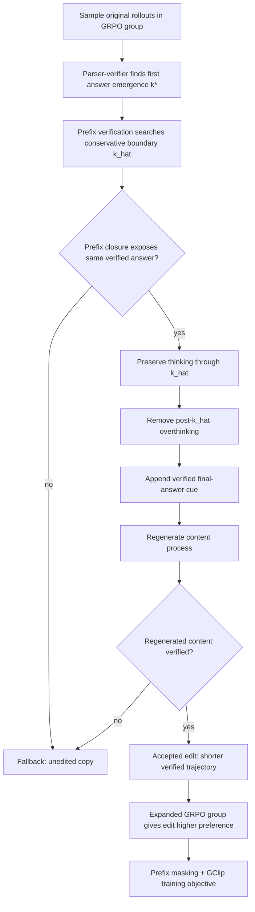

# Dynamic Rollout Editing：把“少想一点”改成后训练里的 credit assignment 问题

### 元信息

- **标题**：Dynamic Rollout Editing for Reducing Overthinking in RL-Trained Reasoning Models
- **作者**：Zihao Wei、Wenjie Shi、Liang Pang、Jingcheng Deng、Shicheng Xu、Shasha Guo、Zenghao Duan、Jiahao Liu、Jingang Wang、Huawei Shen、Xueqi Cheng
- **日期**：arXiv 页面显示提交于 2026-06-16，出现在 2026-06-17 的 cs.CL recent 列表
- **原文**：[arXiv:2606.17890](https://arxiv.org/abs/2606.17890)
- **类型**：大模型后训练；GRPO；长思维推理；token efficiency；overthinking
- **本地附件**：无。本文不引用外部图片，关键 Figure/Table 用 Markdown 表格、公式块和 Mermaid 复述。

### TL;DR

- 这篇论文研究 RL 后训练推理模型为什么会在正确答案已经出现后继续反复验证、重复答案、重新解释题意。
- 作者把 overthinking 重新定义为 **GRPO 式序列级 credit assignment 问题**，而不是简单的“解码时何时停止”问题。
- 他们用 parser-verifier 找到最早可验证答案边界 $k^\star$，观察到成功轨迹在同一 prompt 内往往比失败轨迹有更多答案 revisit。
- DRE 的核心做法是：保留可验证前缀，删除答案出现后的冗余 continuation，生成一个更短的 verified edit，并在同一个 GRPO group 内偏好这个 edit。
- 方法包含三道保护：prefix verification 选择保守边界 $\hat{k}$；prefix masking 避免惩罚共享正确前缀；GClip 给 synthetic edited suffix 保留 straight-through 学习信号。
- 实验覆盖 Qwen3-4B、Qwen3-8B、Qwen3-30B-A3B，以及 AIME24/25/26、GPQA-D、LiveCodeBench V6。
- 主表中 DRE 的平均 thinking token 只占 Raw Model 的 72.1%、77.7%、75.3%，同时 token efficiency 分别达到 5.76、6.04、7.27，均为各模型块最高。
- 局限也清楚：训练只在 DAPO-Math-17k 上做，依赖可验证答案边界；代码任务 LCB-V6 上 token 节省较小，说明跨领域数据仍是开放问题。

### 研究问题：为什么“答案出来后还想”不是解码小毛病？

作者要拆的误区是：

- **常见看法**：模型太啰嗦，所以推理时加 early exit、长度惩罚、停止控制器即可。
- **本文看法**：模型在 RL 后训练里学到“成功轨迹可以很长”，所以问题已经进入训练信号。
- **关键差别**：解码控制只处理已经学好的策略，DRE 试图改变策略学习时的偏好结构。

这件事在 GRPO 中尤其自然：

- 一个 prompt 会采样多个 trajectory。
- 每条完整输出拿到 rule-based reward。
- reward 在 group 内标准化成 advantage。
- 同一个 advantage 会广播到整条 thinking trajectory。

如果成功 trajectory 包含两部分：

1. 到达正确答案所需的推理前缀。
2. 正确答案出现后的重复检查、反复 boxed answer、题意重读。

那么序列级 reward 不会自动知道：

- 哪些 token 是“解决问题”的因果前缀；
- 哪些 token 只是“成功样本里的冗余尾巴”。

### 论文主张与论证路线

作者的论证可以压成四步：

| 步骤 | 论文 claim | 机制解释 | 证据位置 | 边界 |
|---|---|---|---|---|
| 1 | overthinking 可被定位到答案出现之后 | parser-verifier 找到最早正确前缀 $k^\star$ | Figure 2、Appendix G | 只适合答案可验证任务 |
| 2 | GRPO 会把成功信号广播到整条轨迹 | 同一个 group-relative advantage 乘到 $k^\star$ 前后 token | Section 2.3 公式 | 作者强调这是 first-order 分析，不等于完整 estimator |
| 3 | 不能简单惩罚长度 | 长度惩罚可能压掉答案前的必要推理 | GRPO + LP baseline | 对短推理偏好不是万能解 |
| 4 | DRE 在训练期编辑成功轨迹 | 更短 verified edit 在 group 内获得更高偏好 | Table 1、Figure 4、消融 | 依赖 verifier 和可安全编辑边界 |

这条路线的价值在于：

- 它不是说“长思维都坏”。
- 它区分 **答案前的有用 thinking** 和 **答案后的冗余 continuation**。
- 它给后训练提供一个更细粒度目标：不要奖励“正确答案后还继续想”。

### 形式化：答案出现边界 $k^\star$

论文把输出写成：

```text
prompt x
-> thinking process t
-> content process y
```

对应概率分解为：

```math
\pi_\theta(t,y \mid x)
= \pi_\theta(t \mid x)\pi_\theta(y \mid x,t)
```

作者随后把 thinking process 切成句子前缀：

- 从左到右扫描每个 thinking prefix。
- parser 从 prefix 中抽取 candidate answer。
- verifier 检查 candidate 是否对当前 prompt 正确。
- 第一个通过 verifier 的句子索引定义为 $k^\star(\tau)$。
- 如果整条 thinking 中没有可验证答案，则约定 $k^\star(\tau)=K_t(\tau)$，但这只用于让 post-boundary sum 为空，不表示最后一句真的出现了答案。

这个定义非常关键：

- $s \le k^\star$ 的 thinking 可能是必要推理。
- $s > k^\star$ 的 thinking 才是 overthinking 分析区。
- 论文不把所有 post-$k^\star$ token 都断言为无用，只说它们可以承载冗余检查或重复答案。

### GRPO 的 credit broadcast：问题出在哪里？

论文用一个简化的一阶近似说明 GRPO 的广播路径。

令：

- $A(\tau)$：trajectory 在 group 内标准化后的 advantage。
- $\psi_s(\tau)=\nabla_\theta \log \pi_\theta(t_s \mid x,t_{<s})$：第 $s$ 个 thinking 句子的 score term。
- $Z_t(\tau)$：简化句子级视角里的 unmasked thinking units 数量。
- $K_t(\tau)$：thinking 句子总数。

近似 thinking component 可以写成：

```math
g_{\mathrm{approx}}(\theta)
=
\mathbb{E}_{\mathrm{old}}
\left[
  \frac{A(\tau)}{Z_t(\tau)} C(\tau)
\right]
```

其中：

```math
C(\tau)
=
\sum_{s\le k^\star}\psi_s(\tau)
+
\sum_{k^\star<s\le K_t}\psi_s(\tau)
```

这组公式说明：

- 同一个 $A(\tau)$ 同时乘到答案出现前和答案出现后的 score term。
- 如果成功样本中 post-$k^\star$ continuation 和正 advantage 相关，冗余 continuation 就会继承正更新方向。
- token normalization 会影响梯度规模，但不消除“同一 credit 广播到不同语义区域”的结构问题。

因此，作者不是在证明 GRPO 必然奖励每个 post-answer token，而是在指出：

- 当成功轨迹里系统性混入 overthinking；
- 且 reward 只看整条输出是否成功；
- 则训练信号无法把“解题前缀”和“答案后尾巴”拆开。

### 初步观察：成功轨迹为什么更容易带冗余？

作者用 Qwen3-4B-Base 做 R1-Zero-like GRPO 训练：

- reward 只包含 rule-based correctness 和 format。
- 观察 AIME24 训练过程。
- 统计答案出现前后的 verification/checking keywords。
- 对同一 prompt 的成功与失败 rollout 比较 answer revisit 次数。

Figure 2 支持三件事：

1. RL 训练提高 AIME24 accuracy。
2. verification/checking 关键词在 $k^\star$ 前后都增加。
3. 同一 prompt 中，成功 rollout 的答案 revisit 多于失败 rollout。

研究意义在这里：

- $k^\star$ 前的 checking 可能是能力增强。
- $k^\star$ 后的 checking 更可能是成本膨胀。
- 成功 rollout 更常携带 answer revisit，为“正 advantage 会强化冗余 continuation”提供了经验前提。

### DRE 方法：把成功 rollout 改成更短的 verified preference

DRE 的流程可以用一个图表示：



DRE 的设计目标不是直接说“越短越好”：

- 它先确认一个可编辑边界 $\hat{k}$。
- 它保留到 $\hat{k}$ 的 thinking。
- 它只针对 $\hat{k}$ 后的 continuation 改偏好。
- 它要求 edit 后的 content 仍能通过 verifier。

这比长度惩罚细得多：

| 方法 | 会不会区分答案前后？ | 主要风险 | DRE 的处理 |
|---|---:|---|---|
| 通用长度惩罚 | 否 | 压掉必要推理 | 只在 verified boundary 后编辑 |
| 解码 early exit | 部分 | 训练策略已学会冗余 | 训练期改 preference |
| 惩罚原成功轨迹 | 否 | 负 credit 泄漏到正确前缀 | prefix masking |
| 直接用 synthetic edit | 部分 | edited suffix 非 on-policy | GClip 作为 bounded surrogate |

### 组件一：Editable Boundary Identification

$k^\star$ 只是“最早能抽取正确答案”的位置，不一定是安全编辑点。

原因包括：

- 答案可能出现在中间计算里。
- 句子可能还没完成 final-answer pattern。
- prefix 可能需要后续上下文才能稳定生成 content。

所以 DRE 不直接在 $k^\star$ 截断，而是：

1. 从 $k^\star$ 开始枚举候选 prefix。
2. 给 prefix 追加 `Final Answer` 线索。
3. 让 policy 生成 verified-answer closure。
4. 找到第一个能暴露同一正确答案并到达 `</think>` 的 prefix。
5. 把这个 prefix 定义为 $\hat{k}$。

这个步骤的保守性很重要：

- 没有它，edit 可能太早，导致 content 过程补做原本应在 thinking 里完成的推理。
- 消融显示，去掉 prefix verification 会使 accuracy 下降、content length 上升。

### 算法伪代码：DRE 在一个 GRPO group 里做什么？

下面是把论文机制改写成训练循环视角的伪代码：

```text
Input:
  prompt batch B
  old policy pi_old
  current policy pi_theta
  parser P
  verifier V

State:
  expanded_group = []

For each prompt x in B:
  sample 4 original rollouts tau_i from pi_old

  For each original rollout tau_i:
    k_star = first prefix index where P extracts answer and V accepts

    If no verified answer:
      add tau_i and an unedited copy to expanded_group
      continue

    Search candidate prefixes from k_star onward:
      append a final-answer cue
      ask policy to close thinking
      verify that the same answer appears

    If a conservative boundary k_hat is accepted:
      preserve thinking through k_hat
      remove the original post-k_hat thinking
      append verified final-answer closure
      regenerate content process

      If regenerated content is verified:
        add original tau_i with lower shaped score
        add edited tau_tilde_i with higher shaped score
      Else:
        add tau_i and unedited copy
    Else:
      add tau_i and unedited copy

Output:
  expanded GRPO group with original/edit pairs,
  prefix masks for accepted original branches,
  token loss using GClip on edited suffixes.
```

这段伪代码突出了一个细节：

- DRE 不是先训练一个 stopping model。
- 它也不是在 inference 时强制截断。
- 它是在 **rollout sampling 和 GRPO update 之间** 插入一个 verifier-guarded editing layer。

这会改变同一个 group 内的相对排序：

- 原来：成功长轨迹拿正 advantage。
- DRE 后：成功短 edit 拿更高 shaped score。
- 原成功长轨迹不再把答案后 continuation 当成最优行为。

### 为什么不能直接用“短答案奖励”替代？

论文中的 GRPO + LP baseline 很有用，因为它回答了一个自然反驳：

> 既然问题是太长，为什么不直接给短输出更高 reward？

作者给出的答案可以拆成三层：

| 层次 | 长度惩罚的问题 | DRE 的修正 |
|---|---|---|
| 信号粒度 | 整条 trajectory 都被短长评价 | 只在可验证答案边界后动刀 |
| 因果归因 | 正确前缀和冗余尾巴一起被压短 | prefix masking 保护 shared verified prefix |
| 任务迁移 | 对需要长推理的题可能过早停止 | edit 失败就 fallback，不强行短化 |

更尖锐地说：

- 长度本身不是坏事。
- 在答案出现前，额外 thinking 可能让模型从错答案修正到对答案。
- 在答案出现后，额外 thinking 才更接近可压缩成本。

这也是 Figure 7 的作用：

- early training step 的后续思考仍在修正错误。
- late training step 已经 boxed 正确答案，再继续 verification 才变成冗余。

因此，DRE 的研究贡献不是“用 RL 学会少写 token”，而是提出一个可验证边界，把“该保留的 thinking”和“可降低偏好的 thinking”分开。

### 组件二：Edited Rollout Scoring

每条原始 trajectory $\tau_i$ 都配一个 auxiliary trajectory：

- 如果 edit 成功，则 auxiliary 是 $\tilde{\tau}_i$。
- 如果 edit 失败，则 auxiliary 是 unedited copy。

作者定义：

- $V(\rho)=1$：content process 被 verifier 判为正确。
- $E(\rho)=1$：$\rho$ 是 accepted edit。

scoring rule 不是校准后的真实 reward，而是 shaped preference：

```math
S(\rho) =
\begin{cases}
2, & V(\rho)=1 \land E(\rho)=1 \\
1, & V(\rho)=1 \land E(\rho)=0 \\
0, & V(\rho)=0
\end{cases}
```

含义是：

- verified edit 高于 verified original。
- verified original 仍高于错误输出。
- edit 失败时不强行制造 preference。

这种设计保留了 correctness 优先级：

- DRE 不奖励错误的短答案。
- DRE 只奖励“同样正确但少掉 post-answer overthinking”的替代 trajectory。

### 组件三：Prefix Masking

accepted pair $(\tau,\tilde{\tau})$ 共享同一个 thinking prefix 到 $\hat{k}$。

如果直接把 original continuation 设为低分：

- 低分 original 的 loss 会覆盖共享前缀。
- 正确前缀可能被负 credit 拉低。
- 模型可能学到“不要走到这个解题路径”，而不是“不要继续重复检查”。

prefix masking 的规则是：

- 对 lower-scored original branch，共享 prefix 到 $\hat{k}$ 的 generated tokens 权重设为 0。
- 对 original 的 post-$\hat{k}$ continuation，权重仍为 1。
- 对 edited trajectory 和其他 trajectory，权重仍为 1。

对应 rollout loss：

```math
\mathcal{L}(\theta;\rho)
=
\frac{\sum_s w_s(\rho)\ell_s(\theta;\rho)}
{\sum_s w_s(\rho)}
```

这个设计的研究含义是：

- 负信号只打到原轨迹的答案后 continuation。
- 共享的 verified prefix 不被 original branch 直接惩罚。
- 方法更接近“重分配 credit”，而不是“奖励短链条”。

### 组件四：GClip 处理 edited suffix 的 on-policy mismatch

accepted edit 是在采样后合成出来的 trajectory。

这带来一个优化问题：

- edited suffix 不来自 $\pi_{\theta_{\mathrm{old}}}$ 原始 rollout path。
- 在 edit boundary 附近，旧策略概率可能很低。
- preferred edited token 的 ratio 很快进入 upper clip saturation。
- 普通 PPO/GRPO clipping 会让这部分 clipped branch 梯度变成 0。

作者定义 token ratio：

```math
r_s(\theta)
=
\frac{\pi_\theta(z_s \mid x,z_{<s})}
{\pi_{\theta_{\mathrm{old}}}(z_s \mid x,z_{<s})}
```

GClip 的 forward 值等于普通 clip：

```math
\operatorname{GClip}(r;\ell,u)
=
\operatorname{sg}(\mathrm{clip}(r,\ell,u))
\cdot
\frac{r}{\operatorname{sg}(r)}
```

但 backward 不同：

```math
D^{\mathrm{sg}}\operatorname{GClip}(r;\ell,u)
=
\frac{\mathrm{clip}(r,\ell,u)}{r}
```

直观解释：

- forward 仍是 bounded surrogate，避免数值上无限放大。
- backward 在 selected saturation case 保留 straight-through signal。
- 对 $A>0$ 且 $r_s>1+\epsilon$ 的 preferred edited token，普通 clip 梯度会断，GClip 继续给非零学习信号。

边界也要讲清：

- 作者没有把它声称为 PPO trust-region 保证。
- 它是针对 verifier-accepted synthetic preference 的优化 surrogate。
- Appendix F 的 mismatch 分析正是为了说明为什么需要这个非标准 operator。

### 训练信号如何从“成功且长”变成“成功且停得准”？

可以把 DRE 的效果理解为一个 preference graph 的变化。

原始 GRPO group 里：

```text
correct long trajectory
  > incorrect trajectory
```

DRE 接受 edit 后：

```text
correct edited trajectory
  > correct original trajectory
  > incorrect trajectory
```

这个排序变化有两点值得强调：

1. **正确性仍是第一门槛**  
   edit 必须保留 verified answer，regenerated content 也必须通过 verifier。DRE 没有奖励“短但错”的输出。

2. **短只在 paired comparison 里生效**  
   edited trajectory 和 original trajectory 共享前缀、共享 prompt、共享答案。比较对象高度匹配，减少了把难题长推理误判为坏行为的风险。

如果把这个思想迁移到其他后训练任务，关键不是复制公式，而是找到三样东西：

- 一个可观察的 task-success boundary。
- 一个能验证 edit 后仍满足任务的 checker。
- 一个避免负 credit 污染成功前缀的 mask。

这也是它对 agent 后训练特别有启发的地方：

- 工具调用任务可能有“目标状态已达成”的边界。
- 代码任务可能有“测试首次通过”的边界。
- 安全审计任务可能有“漏洞证据链已闭合”的边界。

但第三类也最危险：

- 安全审计中的答案后检查可能不是冗余，而是必要的 double-check。
- 因此 verifier 不能只看最终答案，还要判断审计义务是否完成。

### 实验设置：训练、模型、benchmark

训练设置：

- 所有 trainable variants 都在 DAPO-Math-17k 上训练。
- maximum generation length 为 28,000 tokens。
- 每步 batch size 为 64 prompts。
- 每个 prompt 有 effective group size 8。
- GRPO 和 GRPO + LP：8 个 sampled rollouts。
- DRE：4 个 original rollouts + 4 个 auxiliary counterparts。
- S-GRPO：1 个 rollout 构造 8 个 stopping-policy candidates。

评测设置：

| 维度 | 设置 |
|---|---|
| 模型 | Qwen3-4B-Thinking-2507、Qwen3-8B、Qwen3-30B-A3B-Thinking-2507 |
| 数学 | AIME24、AIME25、AIME26 |
| 科学问答 | GPQA Diamond |
| 代码 | LiveCodeBench V6 |
| temperature | 0.6 |
| AIME samples | 每题 16 responses，max 81,920 tokens |
| GPQA-D samples | 每题 8 responses，max 32,768 tokens |
| LCB-V6 samples | 每题 8 responses，max 81,920 tokens |
| 指标 | Acc、Think Tok.、TE |

Token efficiency 定义为：

```math
\mathrm{TE}
=
1000 \cdot
\frac{\overline{\mathrm{Acc}}}{\overline{L_t}}
```

变量解释：

- $\overline{\mathrm{Acc}}$：表内 benchmark 的平均 accuracy percentage points。
- $\overline{L_t}$：平均 thinking-token count。
- TE 可以读作每 1000 thinking tokens 带来的 accuracy points。

### 主结果：DRE 的核心收益是 token efficiency

Table 1 的五 benchmark 平均结果如下：

| Backbone | Method | Avg Think Tok. | Avg Acc | TE |
|---|---|---:|---:|---:|
| Qwen3-4B-Thinking-2507 | Raw Model | 17,407 | 71.82 | 4.13 |
| Qwen3-4B-Thinking-2507 | GRPO | 16,739 | 71.51 | 4.27 |
| Qwen3-4B-Thinking-2507 | GRPO + LP | 17,051 | 70.47 | 4.13 |
| Qwen3-4B-Thinking-2507 | S-GRPO | 18,059 | 71.45 | 3.96 |
| Qwen3-4B-Thinking-2507 | **DRE** | **12,545** | **72.25** | **5.76** |
| Qwen3-8B | Raw Model | 13,609 | 63.62 | 4.67 |
| Qwen3-8B | GRPO | 13,365 | 63.15 | 4.73 |
| Qwen3-8B | GRPO + LP | 13,030 | 62.58 | 4.80 |
| Qwen3-8B | S-GRPO | 14,777 | 62.23 | 4.21 |
| Qwen3-8B | **DRE** | **10,572** | **63.86** | **6.04** |
| Qwen3-30B-A3B | Raw Model | 14,572 | 80.76 | 5.54 |
| Qwen3-30B-A3B | GRPO | 13,238 | 78.66 | 5.94 |
| Qwen3-30B-A3B | GRPO + LP | 13,710 | 79.12 | 5.77 |
| Qwen3-30B-A3B | S-GRPO | 15,897 | 78.89 | 4.96 |
| Qwen3-30B-A3B | **DRE** | **10,979** | 79.78 | **7.27** |

可以读出四个结论：

1. **长度控制显著**：DRE 平均 thinking token 分别只占 Raw Model 的 72.1%、77.7%、75.3%。
2. **4B/8B 上 accuracy 不降反升**：DRE 的平均 accuracy 分别为 72.25 和 63.86，超过 Raw Model 与 GRPO。
3. **30B-A3B 上不是全赢**：DRE accuracy 低于 Raw Model 的 80.76，但高于 GRPO、GRPO + LP、S-GRPO，并且 token 最少。
4. **TE 是最稳指标**：DRE 在三个 backbone 上 TE 都最高，说明它优化的是 accuracy-token tradeoff。

### 结果读法：30B-A3B 为什么需要单独解释？

Qwen3-30B-A3B 这一块很容易被误读。

表面看：

- Raw Model 平均 accuracy 是 80.76。
- DRE 平均 accuracy 是 79.78。
- 所以 DRE 没有超过原模型。

但论文真正要比较的是：

- 后训练方法是否在减少 thinking tokens 时保持竞争力。
- DRE 是否比 GRPO、GRPO + LP、S-GRPO 更好地处理长度和正确性的交换。

在 30B-A3B 上：

| Method | Avg Think Tok. | Avg Acc | 相对 Raw token |
|---|---:|---:|---:|
| Raw Model | 14,572 | 80.76 | 100.0% |
| GRPO | 13,238 | 78.66 | 90.8% |
| GRPO + LP | 13,710 | 79.12 | 94.1% |
| S-GRPO | 15,897 | 78.89 | 109.1% |
| DRE | 10,979 | 79.78 | 75.3% |

这个结果支持一个更稳的结论：

- DRE 不是所有场景都提高 accuracy。
- DRE 的强项是用更少 thinking tokens 接近或超过其他训练后模型。
- 大模型原始策略本身可能已经很强，额外 RL 训练会引入能力扰动。

因此，用论文自己的措辞，30B-A3B 更应该读成：

- stronger length control；
- competitive accuracy；
- not a uniform accuracy gain。

### 从 Figure/Table 逐项看证据链

| 证据 | 支持什么 | 不能证明什么 |
|---|---|---|
| Figure 1 | vanilla GRPO 与 DRE 的 credit 结构差异 | 不提供定量收益 |
| Figure 2 | RL 训练中 checking/revisit 随训练增加 | 不能证明每个 post-answer token 都无用 |
| Equation 1 | advantage 会广播到 $k^\star$ 前后 | 只是 first-order analysis，不是完整 GRPO estimator |
| Figure 3 | DRE 的 edit、mask、GClip 组合流程 | 不说明组件分别必要 |
| Table 1 | 三个 Qwen3 backbone 上 token efficiency 提升 | 不保证所有领域 accuracy 都提高 |
| Figure 4 | 减少主要发生在 $k^\star$ 后 | 只在 selected AIME24 samples 上展示动态 |
| Figure 5 | 消融暴露 prefix verification、mask、GClip 的失败模式 | 不是所有 benchmark 的 exhaustive ablation |
| Table 2 | 相比 DEER/RCPD 的补充 early-exit 对比 | 平均口径不含 LCB-V6，不能直接替代 Table 1 |

这条证据链比较完整：

- 先观察现象。
- 再给 credit assignment 分析。
- 再提出 intervention。
- 再用主结果、机制分析、消融和案例闭环。

它的弱点也清楚：

- 机制分析高度依赖可验证答案任务。
- selected sample 的动态曲线不等于全分布证明。
- 代码任务迁移仍较弱。

### 跨 benchmark 细节：不是只在数学上变短

论文强调：

- 所有 trainable methods 都只用 DAPO-Math-17k 训练。
- 但 DRE 在 GPQA-D 和 LCB-V6 也减少 thinking tokens。
- 相比 GRPO，DRE 在 9 个 AIME model-benchmark row、3 个 GPQA-D row、3 个 LCB-V6 row 都更短。

局部看一些数值：

| Backbone | Benchmark | GRPO Think Tok. | DRE Think Tok. | GRPO Acc | DRE Acc |
|---|---|---:|---:|---:|---:|
| Qwen3-4B | AIME24 | 18,322 | 13,092 | 81.17 | 81.87 |
| Qwen3-4B | GPQA-D | 7,826 | 5,689 | 65.26 | 65.67 |
| Qwen3-4B | LCB-V6 | 16,333 | 14,630 | 53.64 | 53.79 |
| Qwen3-8B | AIME26 | 15,581 | 11,381 | 65.21 | 66.87 |
| Qwen3-8B | GPQA-D | 8,474 | 6,658 | 60.61 | 60.98 |
| Qwen3-30B-A3B | AIME25 | 15,600 | 13,040 | 81.87 | 83.54 |
| Qwen3-30B-A3B | GPQA-D | 6,236 | 5,318 | 74.68 | 75.51 |
| Qwen3-30B-A3B | LCB-V6 | 15,413 | 13,977 | 63.43 | 64.86 |

这张表说明：

- 数学任务上的 token 缩减最大。
- GPQA-D 上也有稳定缩短，且 accuracy 不弱。
- LCB-V6 的缩短幅度较小，但没有出现明显 accuracy 崩溃。

因此更保守的结论是：

- DRE 学到的是“答案出现后少继续”的倾向。
- 这能迁移到部分非数学任务。
- 但代码任务上的收益仍受训练数据和 verifier 类型限制。

### 编辑成功率：DRE 不是少量特例

作者报告了两个关键质量数字：

| 指标 | 数值 | 含义 |
|---|---:|---|
| edit acceptance | 87.20% | 采样 trajectory 中，大多数能通过 edit-and-verify 流程 |
| conservative fallback | 12.80% | edit 不可靠时退回 unedited copy |
| correctness preservation | 99.40% | accepted edits 在 content regeneration 后仍保持 verifier correctness |

这组数字很重要：

- 如果 accepted edits 很少，DRE 的 preference signal 就只是边缘修补。
- 如果 correctness preservation 低，方法就是用短错答案换成本。
- 87.20% 和 99.40% 支持作者说它是主训练信号，而不是偶发样本。

### Overthinking 分析：减少主要发生在答案出现后

Figure 4 的作用是回答一个更细的问题：

> DRE 只是让模型整体少想，还是主要减少 $k^\star$ 之后的冗余？

论文给出的结论是：

- edited positive trajectories 比 original positive trajectories 有更少 answer revisits。
- DRE 对 total thinking length 的降低明显大于对 $k^\star$ 前 thinking 的降低。
- GRPO + LP 没有同等幅度降低 answer revisits。

这支持一个关键判断：

- DRE 不是把所有 thinking 同比例压短。
- 它更像是把训练信号从“成功且长”改成“成功但停止在 verified boundary 附近”。

### 消融：每个保护组件为什么必要？

Appendix C 做了 leave-one-out：

| Ablation | 去掉什么 | 观察到的问题 | 机制解释 |
|---|---|---|---|
| No Prefix Verification | 不做 prefix closure check | accuracy 下降，content length 上升 | edit 太早，content 需要补完 reasoning |
| No Prefix Masking | 不屏蔽共享前缀 | $k^\star$ 前 thinking 降最多，后期 accuracy 退化 | 负 credit 泄漏到正确前缀 |
| Standard Clip | GClip 换普通 clipping | total thinking 降得更慢 | edited suffix ratio saturation 后梯度断掉 |
| Full Method | 三者都保留 | accuracy 稳，total thinking 降，content 稳 | 三个保护共同约束 edit preference |

这组消融让论文不是只停在“方法有效”：

- prefix verification 保护 edit boundary。
- prefix masking 保护 solution-reaching prefix。
- GClip 保护 synthetic suffix 的学习信号。

换句话说，DRE 的效果来自对训练信号的分区处理，而不是单个 trick。

### 与 early-exit 的补充比较

Appendix D 比较了 training-free early-exit baseline：

- DEER。
- RCPD。
- DRE。

它只覆盖 AIME24、AIME25、AIME26、GPQA-D，不含 LCB-V6。

平均结果中：

| Backbone | Method | Avg Think Tok. | Avg Acc |
|---|---|---:|---:|
| Qwen3-4B | Raw | 17,328 | 76.21 |
| Qwen3-4B | DEER | 16,601 | 75.85 |
| Qwen3-4B | RCPD | 13,653 | 74.95 |
| Qwen3-4B | DRE | 12,024 | 76.86 |
| Qwen3-8B | Raw | 13,967 | 67.55 |
| Qwen3-8B | DRE | 10,413 | 67.59 |
| Qwen3-30B-A3B | Raw | 14,325 | 84.79 |
| Qwen3-30B-A3B | DRE | 10,230 | 83.51 |

这里的读法要谨慎：

- 这不是完整 Table 1 的同一平均口径。
- LCB-V6 被省略。
- 但它说明 DRE 相比纯 inference-time stopping，能在多个 backbone 上给出更强的 token 节省。

### Figure 7/8/9：具体样本怎样说明“答案后继续想”

附录里的案例帮助理解机制。

Figure 7 的 Aya walk 例子：

- early step 还没完成必要格式转换，把 204 相关计算搞错并 boxed 344。
- middle step 完成转换并 boxed 204。
- late step 已经 boxed 204，却继续进入额外 verification block，再 boxed 一次 204。

这说明：

- 答案出现前的 thinking 可以修复错误。
- 答案出现后的重复 verification 才是本文要减的对象。

Figure 8 的 accepted edit：

- original branch 在 $\hat{k}$ 后继续说“let’s compute again in a different order”。
- accepted edit 直接给 `Final Answer \boxed{450}` 并再生 content process。
- prefix masking 避免把 original 的低分传回 shared prefix。

Figure 9 的 AIME24 例子更直观：

| Model | verified answer | thinking length | thinking after answer emergence |
|---|---:|---:|---:|
| Raw Model | 116 | 22,808 chars | 约 12,200 chars |
| DRE-trained | 116 | 7,238 chars | 32 chars |

这个例子不是主结果本身，但它说明了 Table 1 背后的行为模式：

- 两个模型都能算出 116。
- Raw Model 在答案出现后重新解释“at least two”、重算组合数、检查 lottery variants。
- DRE-trained model 在给出同一答案后几乎立即关闭 thinking。

### 相关工作位置：DRE 和“少想”路线有什么不同？

论文把 prior work 分成三类：

| 路线 | 代表思路 | DRE 的区别 |
|---|---|---|
| post-training length control | 短 CoT SFT、长度 reward、latent reasoning | DRE 不全局偏好短，而是 edit verified boundary 后的 continuation |
| prompt/decoding control | 提示模型简洁、decoding early stop | DRE 改训练信号，不只控制已学策略 |
| early-exit mechanism | stopping classifier、bandit、RL stopping policy、reasoning dynamics | DRE 不是加 controller，而是在 RL group 内构造 edited preference |

最重要的定位是：

- DRE 属于后训练方法。
- 它和 early-exit 可互补。
- 它关心“为什么训练会强化冗余”，而不只是“推理时怎么截断”。

### 证据边界与局限

这篇论文的局限很具体：

- 训练数据只用 DAPO-Math-17k。
- answer emergence 依赖 parser-verifier，所以更适合数学、可验证 QA、代码测试这类任务。
- LCB-V6 上 token 缩短较小，说明数学 verifier 学到的停止倾向不能完全覆盖代码推理。
- GClip 是 optimization surrogate，不是标准 PPO trust-region 保证。
- edited suffix 是 synthetic trajectory，严格 on-policy 假设不成立。
- 论文没有证明所有 post-$k^\star$ continuation 都无用，只证明 DRE 能减少一类答案后冗余且总体保持性能。

这些边界反而让结论更清楚：

- DRE 不是通用“少想药方”。
- 它需要可验证答案、可保守定位 edit boundary、可判断 regenerated content 是否仍正确。
- 如果任务本身需要答案后审计、证明、合规解释，直接套 DRE 可能会剪掉有用的验证过程。

### 研究者视角：这篇论文对后训练有什么启发？

我认为本文最值得带走的不是“把 token 降了 25% 左右”，而是它把后训练里的 reward granularity 问题说清了。

更具体地说：

1. **序列级 reward 会混合多个因果片段**  
   同一条成功轨迹里可能同时包含必要推理、格式整理、答案后重复、甚至自我怀疑。只给整条轨迹一个 advantage，会把这些片段绑定到一起。

2. **可验证边界可以成为训练信号的切分点**  
   $k^\star$ 和 $\hat{k}$ 提供了“哪里开始不该继续奖励”的操作化定义。这个思想可能迁移到代码测试、工具调用任务、agent 子目标完成判定。

3. **短不是目标，正确前缀的保护才是目标**  
   prefix masking 的价值在于，它承认 successful original 的前半段仍然值得学。后训练方法如果只会惩罚整条长 trajectory，很容易把能力一起剪掉。

4. **synthetic preference 需要承认分布错配**  
   GClip 的设计说明，编辑出来的 trajectory 不是普通 on-policy sample。与其假装它满足 PPO 假设，不如明确把它当成 bounded surrogate。

5. **overthinking 可能是 RL 成功的副产物**  
   如果成功样本天然更长、更多检查、更多 answer revisit，RL 可能会把这些风格也当成成功的表征。这个问题不只属于数学推理，也可能出现在 agent 规划和安全审计轨迹里。

### 放到 AI 安全和 agent 训练里看

这篇论文虽然属于后训练效率工作，但它也触及一个安全问题：

- RL 不只学习答案。
- RL 也学习“成功轨迹的行为风格”。
- 如果某种风格在成功样本里更常见，它可能被当成能力的一部分强化。

在 reasoning model 中，这个风格是 overthinking。

在 agent 中，类似问题可能表现为：

- 目标完成后继续调用工具。
- 已经拿到证据后继续搜索，扩大攻击面。
- 已经生成补丁后继续重写无关文件。
- 已经满足安全约束后继续尝试规避或自我解释。

这不是说 DRE 可以直接解决 agent safety。

更准确的启发是：

- 训练时要识别“任务完成边界”。
- reward 不应把边界后的多余动作一并奖励。
- 如果边界后的动作有安全价值，必须单独建模，而不是被粗糙地归为冗余。

对 AI for security 尤其如此：

- 漏洞复现后的验证步骤可能必要。
- patch 生成后的 regression test 可能必要。
- 证据链完成后的重复扫描可能浪费甚至带来风险。

未来如果把 DRE 思想用于安全 agent，最难的不是 GClip，而是定义：

- 何时“答案已出现”；
- 何时“审计义务已完成”；
- 何时“继续探索”从谨慎变成多余或危险。

### 继续追问

- **Agent 任务**：如果工具调用 agent 在完成目标后继续调用工具，能否定义类似 $k^\star$ 的“任务已满足边界”？
- **代码生成**：单元测试首次通过的位置是否能替代 answer emergence，用于编辑后续冗余 debug trace？
- **安全任务**：在红队或漏洞分析中，答案后 verification 可能是必要安全审计；DRE 如何区分“冗余检查”和“必要安全确认”？
- **偏好学习**：DRE 的 shaped score 是 2/1/0，是否可以学习一个更连续的 post-boundary utility，而不只按 accepted edit 排序？
- **多答案任务**：开放问答或长报告没有唯一 verifier，如何避免把“尚未充分论证”误判为“答案已出现”？

### 小结

- DRE 把 overthinking 从推理时停止策略推进到训练期 credit assignment。
- 它用 parser-verifier 找答案出现边界，用 verified edit 构造更短成功轨迹。
- 它通过 prefix masking 保护必要前缀，通过 GClip 处理 synthetic suffix 的梯度饱和。
- 实验显示它在三个 Qwen3 backbone 上把平均 thinking token 降到 Raw Model 的 72.1%、77.7%、75.3%，并取得最高 TE。
- 最应保留的边界是：DRE 依赖可验证任务和保守编辑边界，不应被理解为“所有长推理都应该剪短”。
