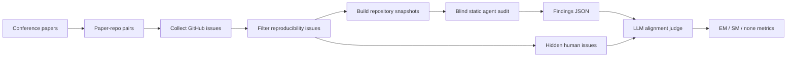

# ReproRepo：用 GitHub issue 把 LLM Agent 复现审计做成可扩展 benchmark

### 元信息

- **标题**：ReproRepo: Scaling Reproducibility Audits with GitHub Repository Issues
- **作者**：Shanda Li、Qiuhong Anna Wei、Jingwu Tang、Valerie Chen、Nihar B Shah、Tim Dettmers、Yiming Yang、Ameet Talwalkar
- **日期**：arXiv 页面显示提交于 2026-06-16；cs.CL recent 页面在 2026-06-17 列出该条目
- **原文**：[arXiv:2606.18237](https://arxiv.org/abs/2606.18237)
- **代码**：[LithiumDA/ReproRepo](https://github.com/LithiumDA/ReproRepo)
- **类型**：大模型 Agent；AI for science；复现性审计；paper-repository benchmark
- **本地附件**：无。论文 Figure/Table 信息用 Markdown 表格、公式块和 Mermaid 复述；没有引用外部图片 URL。

### 本轮统一 Scout 候选表

| 排名 | category_id | 候选 | 新鲜度证据 | 去重状态 | 取舍 |
|---:|---|---|---|---|---|
| 1 | llm-agent | **ReproRepo**, arXiv:2606.18237v1 | arXiv submitted 2026-06-16；GitHub repo created 2026-06-11 / pushed 2026-06-17 | 本地仅出现在上一轮 Scout 表，未发布 | **本轮选中** |
| 2 | llm-post-training | Zone of Proximal Policy Optimization, arXiv:2606.18216v1 | arXiv published 2026-06-16 | 未命中已发布 item | 备选 |
| 3 | ai-safety | Learning Red Agent Policy, arXiv:2606.18223v1 | arXiv published 2026-06-16 | 未命中已发布 item | 备选 |
| 4 | llm-agent | All Smoke, No Alarm, arXiv:2606.18168v1 | arXiv published 2026-06-16 | 仅在旧候选表出现 | 备选 |
| 5 | llm-post-training | Learning from the Self-future, arXiv:2606.18195v1 | arXiv published 2026-06-16 | 未命中已发布 item | 备选 |
| 6 | llm-agent | Compositional Skill Routing, arXiv:2606.18051v1 | arXiv published 2026-06-16 | 仅在旧候选表出现 | 备选 |
| 7 | ai-safety | PseudoBench, arXiv:2606.18060v1 | arXiv published 2026-06-16 | 未命中已发布 item | 备选 |
| 8 | llm-post-training | From Reasoning Traces to Reusable Modules, arXiv:2606.18089v1 | arXiv published 2026-06-16 | 仅在旧候选表出现 | 备选 |

### TL;DR

- ReproRepo 研究的问题是：**不真正执行代码的 LLM coding agent，能不能从论文 PDF 和仓库快照中发现真实用户后来在 GitHub issue 里报告的复现 blocker**。
- 作者的核心设计是把 GitHub issue 当成自然发生的监督信号：先收集 conference paper、GitHub repository、open/closed issue，再筛出复现相关 issue，最后让 agent 在看不到 issue 的情况下做静态审计。
- 数据规模明显大于以往人工构造复现 benchmark：论文覆盖 5 个 conference/track split，共 12,686 篇 accepted papers，其中 1,149 篇带入 benchmark；隐藏复现 blocker 共 7,553 个。
- 审计协议是 blind static audit：agent 只能看 paper PDF 和固定 repository snapshot；不能看 GitHub issue、PR、commit history、互联网；也不能运行安装、测试、训练、推理或评测命令。
- 评测采用 issue-level 与 paper-level 两套指标，并在 Top-$k$ 报告预算下计算 EM@10 和 SM@10，防止 agent 用很长的 checklist 堆命中率。
- 主结果显示静态 agent 已有很强 triage 能力：Codex + GPT-5.5 在 ICLR 2026 上达到 issue-level SM@10 58.1%、paper-any SM@10 89.7%、paper-all SM@10 65.6%，平均每次约 943k tokens、$1.26。
- 最强结论不是“agent 已经会复现论文”，而是“许多真实复现失败会在 paper-repo 静态表面留下痕迹”；精确定位仍弱，issue-level EM@10 最高只有 25.4%。
- 论文的边界也很清楚：GitHub issue 标签不完整且有噪声；no-execution 设置看不到 late crash、硬件路径、长训练数值偏差；LLM judge 也需要人工校验，作者用 150 个样本报告了 85.3% matched/unmatched 一致率。

### 研究问题：为什么不用人工复现报告，而改用 GitHub issue？

这篇论文回应的是复现 benchmark 的可扩展性瓶颈：

- 人工复现报告质量高，但成本高。
- 专家任务、参考实现验证、手工注入错误、人工 rubric 都很难持续更新。
- 许多 benchmark 只覆盖几十篇论文，且倾向收录 artifact 质量较高的论文。
- 现代 ML artifact 则不断变化：代码、checkpoint、数据链接、API、依赖版本都可能在几个月内漂移。

作者换了一个监督来源：

- 不请专家预先设计任务。
- 不要求研究者真正跑通所有仓库。
- 不手工构造“标准 bug”。
- 直接利用真实用户在 GitHub issue 中报告的复现障碍。

这个选择的研究意义在于：

- GitHub issue 是自然发生的用户反馈。
- 它带有 timestamp、open/closed 状态、讨论线程、linked PR、closing commit。
- closed issue 可以回溯到 issue-time snapshot 或 pre-fix snapshot，避免 agent 从修复后的仓库里推断历史错误。
- open issue 则代表当前默认分支仍可能存在的用户报告风险。

因此，ReproRepo 不是一个“复现成功率 benchmark”，而是一个 **issue-grounded reproducibility auditing benchmark**：

- 输入：论文 + 仓库快照。
- 目标：预测真实用户可能报告的复现 blocker。
- 标签：隐藏的 GitHub issue。
- 评测：agent findings 与 hidden issue 的 exact / semantic alignment。

### 论文主张与论证路线

| Claim | Mechanism | Evidence | Boundary |
|---|---|---|---|
| GitHub issue 可以扩展复现 benchmark | issue 提供真实用户遇到的 blocker，并带有时间与修复结构 | Table 2：1,149 selected papers、7,553 issues | issue 不穷尽全部复现失败，也可能含用户环境噪声 |
| 静态 agent 可以做早期 triage | agent 读取 PDF + snapshot，寻找缺失 artifact、依赖、脚本、paper-code mismatch | Table 3/4：paper-any SM@10 接近 90% | 不能替代执行，尤其看不到 late crash 和 wrong number |
| Semantic match 与 exact match 必须分开 | agent 常找到同一语义区域，但未定位到同一触发点 | Issue-level EM@10 13.4%-25.4%，SM@10 43.4%-58.1% | SM 是 triage 信号，不是可直接关闭 issue 的精确诊断 |
| 报告预算要固定 | 只允许 top-$k$ findings 参与匹配，避免“写越长越高分” | Figure 3：$k=4$ 已接近 80%，$k=6$ 到 $10$ 约 90% | top-k 不能评估完整审计报告的组织质量 |
| post-fix snapshot 可估 false positive | 对 closed issue 的修复后快照再跑 agent，历史 blocker 应消失 | Table 3：FPR 最高 3.50% | 只有 150 个 clear patch cases，覆盖面有限 |

### 方法机制：ReproRepo 怎么构造任务？

作者把 pipeline 拆成两个大阶段：

1. **Data collection and issue review**
   - 从 Paper Copilot、OpenReview 或 conference metadata 收集论文。
   - 解析论文对应的 GitHub repository URL。
   - 丢弃非 GitHub 或无可用仓库的论文。
   - 收集 open issues、closed issues、closed issue comments、linked PR / closing commit evidence。
   - 用 LLM judge 筛出复现相关 issue。

2. **Blind agent evaluation**
   - 按 paper、repository、snapshot 把 issue 归组。
   - 为 agent 准备固定 workspace：paper PDF + repository snapshot。
   - 移除 git commit history，拒绝互联网访问。
   - 明确禁止安装、测试、下载、训练、推理和评测。
   - 要求 agent 输出 GitHub-issue-style findings。
   - 用隐藏 issue 与 findings 做 alignment。

可以把 Figure 1 的流程写成：



这里最重要的细节不是“用了 LLM judge”，而是 snapshot 的时间控制：

- **open issue**：使用 collection time 的 default-branch snapshot。
- **closed issue**：使用 issue 创建前或修复前的 snapshot，避免把修复后的证据泄漏给 agent。
- **closed issue with patch evidence**：额外恢复 post-fix snapshot，用于检查 agent 是否继续报告已经被修复的问题。

### Agent 审计任务：它到底能看什么、不能看什么？

论文附录 E.1 给出的 agent prompt 很严格，核心约束包括：

- 只能使用提供的 paper PDF 和本地 repository files。
- 不得看 GitHub issues、pull requests、discussions、comments、commit history。
- 不得搜索互联网、外部网站、remote branches/tags。
- 不得运行 setup、tests、scripts、notebooks、downloads、training、inference、evaluation。
- 必须输出 `findings.json`。

每条 finding 要包含：

- `severity`
- `stage`
- `category`
- `issue_title`
- `user_symptom`
- `trigger_context`
- `root_cause`
- `evidence`
- `impact`
- `affected_claims_or_metrics`
- `confidence`

这使任务更接近“审稿人或 artifact reviewer 的静态风险排查”：

- 找缺失 checkpoint。
- 找 README 和 paper 的命令不一致。
- 找 requirements 漏依赖。
- 找数据路径、配置、evaluation script 不完整。
- 找论文声称的 metric 在仓库里没有可追溯脚本。

它不是传统 SWE-bench 式 repair：

- 不要求修 bug。
- 不运行 test。
- 不看 issue 文本。
- 不输出 patch。

### 指标：为什么同时要 issue-level 和 paper-level？

论文定义了 Top-$k$ budget：

```math
F_p^{(k)} = \text{agent 对 paper/snapshot } p \text{ 输出的前 } k \text{ 条 findings}
```

隐藏 issue $i$ 的最佳 alignment 写作 $y_i^{(k)}$：

```math
\text{IssueEM@}k =
\frac{|\{i \in I : y_i^{(k)}=\mathrm{EM}\}|}{|I|}
```

```math
\text{IssueSM@}k =
\frac{|\{i \in I : y_i^{(k)} \in \{\mathrm{EM},\mathrm{SM}\}\}|}{|I|}
```

这两个指标回答的是：

- **IssueEM@k**：agent 精确发现了多少真实 issue。
- **IssueSM@k**：agent 至少找到了多少相关语义区域。

论文还定义 paper-level 指标：

```math
\text{PaperAnyEM@}k =
\frac{|\{p \in P : \exists i \in I_p,\ i \text{ is EM@}k\}|}{|P|}
```

```math
\text{PaperAllEM@}k =
\frac{|\{p \in P : \forall i \in I_p,\ i \text{ is EM@}k\}|}{|P|}
```

这个区分很关键：

- 有些仓库会有很多 issue，issue-level 会被热门仓库主导。
- paper-any 更像 triage：只要发现一个真实 blocker，就足以提示 reviewer 或作者重点检查。
- paper-all 更严格：要求发现该论文所有隐藏 issue，更接近完整审计。

### 数据规模：Table 2 到底说明了什么？

| Split | Accepted papers | Selected papers | Open issues | Closed issues | Closed issues w/ patch |
|---|---:|---:|---:|---:|---:|
| NeurIPS 2022 main | 2,905 | 264 | 579 | 974 | 22 |
| NeurIPS 2022 DB | 163 | 88 | 342 | 524 | 32 |
| NeurIPS 2024 main | 4,037 | 410 | 1,642 | 1,518 | 40 |
| NeurIPS 2024 DB | 460 | 107 | 299 | 678 | 44 |
| ICLR 2026 | 5,355 | 280 | 405 | 592 | 12 |
| **All** | **12,686** | **1,149** | **3,267** | **4,286** | **150** |

三个观察值得保留：

- selected papers 不是全部 accepted papers，而是至少有一个 accepted benchmark issue 的论文。
- open + closed accepted issues 合计 7,553，远大于许多人工复现 benchmark。
- closed issues w/ patch 只有 150 个，因此 false-positive 评估很有价值，但不能覆盖所有 failure 类型。

论文还把 issue 分成四类：

| 类别 | 含义 | 静态审计可见性 |
|---|---|---|
| crash immediate | 安装、导入、启动阶段立刻崩 | 高，常见于依赖和路径 |
| crash late | 训练、推理、评测中途崩 | 中低，需要执行或长任务 |
| silent wrong setup | 设置、artifact、checkpoint、数据或评测路径错，但不一定崩 | 高，README/config/paper mismatch 常可见 |
| silent wrong number | 运行完成但指标不对 | 低，通常要复现实验或比较输出 |

Figure 2 的结论是：

- silent wrong setup 在所有 split 中都是最大类，占 52%-59%。
- failure composition 跨会议相当稳定。
- 这说明 ReproRepo 抓到的不是某个 venue 的特殊 artifact 习惯，而是 ML 仓库复现失败的普遍结构。

### 主结果：静态 agent 到底强在哪里？

Table 3 在 ICLR 2026 上比较四种 agent/model 配置：

| Model | Agent | Issue EM@10 | Issue SM@10 | Paper-any EM@10 | Paper-any SM@10 | Paper-all SM@10 | FPR | Cost |
|---|---|---:|---:|---:|---:|---:|---:|---:|
| DeepSeek-V4-Pro | Claude Code | 19.3% | 53.1% | 47.6% | 89.0% | 55.3% | 2.80% | $0.29 |
| Claude Opus 4.7 | Claude Code | 21.7% | 54.1% | 52.0% | 86.5% | 57.1% | 2.10% | $4.07 |
| GPT-5.4-Mini | Codex | 13.4% | 43.4% | 33.0% | 82.1% | 52.0% | 1.40% | $0.22 |
| GPT-5.5 | Codex | **25.4%** | **58.1%** | **59.7%** | **89.7%** | **65.6%** | 3.50% | $1.26 |

这张表支持三个层次的判断：

- **可用性**：paper-any SM@10 最高接近 90%，说明静态审计可以覆盖大多数 issue-bearing papers 的至少一个真实问题区域。
- **不充分性**：Issue EM@10 最高只有 25.4%，说明 agent 远未达到精确复现诊断。
- **成本权衡**：DeepSeek-V4-Pro 的 paper-any SM@10 达到 89.0%，但每次成本只有 $0.29，适合大规模粗筛。

Table 4 进一步看 Codex + GPT-5.5 跨 conference：

| Split | Issue EM@10 | Issue SM@10 | Paper-any SM@10 | Paper-all SM@10 | Avg tokens | Cost |
|---|---:|---:|---:|---:|---:|---:|
| NeurIPS 2022 main | 23.8% | 57.4% | 89.7% | 41.4% | 966,794 | $1.28 |
| NeurIPS 2022 DB | 18.2% | 51.0% | 96.6% | 31.8% | 1,225,375 | $1.50 |
| NeurIPS 2024 main | 23.9% | 56.3% | 93.3% | 51.1% | 925,068 | $1.30 |
| NeurIPS 2024 DB | 12.2% | 47.3% | 87.6% | 33.3% | 1,159,698 | $1.53 |
| ICLR 2026 | 25.4% | 58.1% | 89.7% | 65.6% | 943,011 | $1.26 |

最重要的模式是：

- main track 与 ICLR 的 issue-level SM 很接近。
- DB track token 更多、成本更高、issue-level/all-issue 更低。
- paper-any 指标稳定偏高，说明一个真实 blocker 往往能被静态表面暴露。

### Figure 3 和输出排序：高分是不是靠“列很多条”堆出来的？

作者用 Top-$k$ 曲线回答这个担心：

- $k=2$ 时，paper-any SM 已超过 60%。
- $k=4$ 时，接近或超过 80%。
- $k=6$ 到 $10$ 后逐渐平台化到约 90%。

这说明：

- 命中不是靠输出几十条宽泛风险堆出来。
- agent 通常把更像真实 issue 的 blocker 排在前几条。
- prompt 中“按 human-report likelihood 排序”的要求有实际作用。

附录 C.3 的排序 ablation 进一步说明：

- 去掉排序指令后，总能发现的风险集合变化不大。
- 但在小 $k$ 预算下，命中率下降。
- 对人工 reviewer 来说，这意味着“排序质量”本身是 benchmark 应该评估的能力。

### 失败 taxonomy：agent 最擅长什么，最不擅长什么？

Figure 4 的结论可以整理为：

| Failure type | Exact recall | Semantic recall | 解读 |
|---|---:|---:|---|
| crash immediate | 12.9% | 41.8% | import、dependency、startup error 常留下静态证据 |
| crash late | 3.4% | 26.1% | 往往需要运行到训练/评测中段 |
| silent wrong number | 7.6% | 32.4% | 需要执行、下载 artifact 或比较数值 |
| silent wrong setup | 30.0% | 65.4% | README、config、checkpoint、paper-code mismatch 最容易被静态发现 |

这组结果是全文最有解释力的部分：

- agent 不是随机猜 issue。
- 它确实偏向发现“静态可见”的 setup 和 immediate blocker。
- 它对 late crash 和 wrong number 明显弱，因为这些失败的证据通常不在文件结构表面。

所以，ReproRepo 给出的能力边界很清楚：

- 静态 agent 适合做 **early triage**。
- 它不能替代真正跑实验。
- 它尤其不能替代长训练、硬件相关路径、数值一致性检查。

### Paper input ablation：只看代码够不够？

Table 6 对比 code-only 与 paper-and-code：

| Agent input | Issue EM@10 | Issue SM@10 | Paper-any EM@10 | Paper-any SM@10 |
|---|---:|---:|---:|---:|
| Code only | 20.9% | 57.0% | 50.7% | 87.6% |
| Paper & Code | **25.4%** | **58.1%** | **59.7%** | **89.7%** |

这张表的含义不是“论文 PDF 让 semantic match 暴涨”。

更准确地说：

- 只看代码已经能发现很多 broad repository risks。
- 加上 paper 后，agent 更容易判断这些风险是否真的阻断论文声称的复现目标。
- 最大提升在 exact / paper-any EM 上，说明 paper 对 **精确定位 paper-code consistency** 更重要。

这对 Agent benchmark 很关键：

- 如果只让 agent 看仓库，它会变成 generic code audit。
- 如果加入 paper，它才需要对齐论文 claim、数据、checkpoint、metric、evaluation protocol。

### LLM judge 是否可信？

作者没有把 LLM judge 当成完全可靠的黑箱，而是做了人工验证：

- 从 Codex + GPT-5.5 的 finding-issue pairs 中抽 150 个。
- EM、SM、None 各 50 个。
- 人类标注者看 agent finding、candidate issue、judge rationale，但隐藏自动标签。
- 对 matched-vs-unmatched 判断，人类与 judge 一致 128/150，即 85.3%。
- 在人类认为 matched 的 90 个样本里，judge 找回 84 个，即验证样本中的 recall 93.3%。
- matched decision 的 precision 为 84.0%。

这说明：

- judge 足够支撑 aggregate benchmark 分析。
- 但 single case 的 label 仍可能错。
- 因此 ReproRepo 更适合比较模型和分析趋势，不适合给某篇论文下最终复现结论。

### Detail inventory：论文里真正可复用的技术清单

如果把 ReproRepo 当成一个后续研究可以复用的 benchmark blueprint，最值得记住的不是单个数字，而是下面这些可操作对象：

| 对象 | 论文中的定义 | 为什么重要 |
|---|---|---|
| paper-repository pair | conference paper metadata + normalized GitHub URL | 把复现问题限定到“论文主张如何被仓库支持” |
| issue case | 一个 GitHub issue 与 paper/repo/snapshot 的绑定 | 让自然语言用户报告变成 evaluation label |
| target type | `open`、`closed_gold`、`closed_silver` | 区分当前风险、带 patch 的历史风险、讨论确认但无 patch 的风险 |
| snapshot group | 同一 paper/repo/snapshot 下的一组 hidden issues | 避免同一仓库状态重复跑 agent |
| static finding | agent 输出的 user-facing reproduction blocker | 与 hidden issue 做 EM/SM/None alignment |
| post-fix snapshot | closed_gold 的修复后仓库状态 | 用来检查 agent 是否报告已不存在的历史问题 |
| failure category | crash immediate / crash late / silent wrong setup / silent wrong number | 解释哪些风险静态可见，哪些需要执行 |
| top-$k$ budget | 只评估前 $k$ 条 findings | 把“发现能力”和“报告长度”拆开 |

这些对象让 ReproRepo 有两个明显优点：

- **可更新**：新的 conference paper 和 GitHub issue 可以继续进入 pipeline。
- **可诊断**：结果不仅是一个总分，还能按 failure type、conference split、agent/model、Top-$k$ 曲线拆开。

但它也带来一个重要代价：

- 标签不是专家穷尽标注。
- 标签是社区使用行为的投影。
- 因此 benchmark 更像 positive-only retrieval，而不是完整 truth set。

### 伪代码：从 issue 到 agent score

论文没有把 pipeline 写成一段统一伪代码，但可以按正文和仓库文档重构为：

```text
Input:
  conference_papers
  repository_links
  github_issue_api
  agent_runner
  alignment_judge

State:
  paper_repo_pairs = []
  issue_cases = []
  snapshot_groups = []
  agent_findings = []
  alignments = []

For each paper in conference_papers:
  repo = normalize_github_url(paper.repository_link)
  If repo is missing or not GitHub:
    continue
  paper_repo_pairs.append((paper, repo))

For each (paper, repo) in paper_repo_pairs:
  raw_open, raw_closed = collect_issues(repo)
  comments, fix_evidence = collect_closed_issue_context(repo)
  For each raw_issue:
    review = llm_filter_issue(raw_issue, paper, repo)
    If review.accepted is false:
      continue
    case = build_issue_case(raw_issue, review, paper, repo)
    issue_cases.append(case)

For each accepted issue_case:
  If target == open:
    snapshot = default_branch_at_collection_time(repo)
  Else if target == closed_gold:
    snapshot = pre_fix_snapshot(repo, fix_evidence)
    post_fix = post_fix_snapshot(repo, fix_evidence)
  Else if target == closed_silver:
    snapshot = default_branch_at_issue_time(repo, issue.created_at)
  snapshot_groups.add(case, snapshot)

For each snapshot_group:
  workspace = prepare_blind_workspace(paper_pdf, repository_snapshot)
  remove_git_history(workspace)
  deny_internet_and_execution(agent_runner)
  findings = agent_runner.static_audit(workspace)
  agent_findings.append(findings)

For each snapshot_group:
  result = alignment_judge.compare(hidden_issues, findings)
  alignments.append(result)

Output:
  issue_level_EM_SM_at_k
  paper_any_EM_SM_at_k
  paper_all_EM_SM_at_k
  post_fix_false_positive_rate
  taxonomy_breakdowns
```

这段流程说明了一个容易忽略的设计：

- data construction 与 evaluation 是分离的。
- agent 看到的是 snapshot workspace。
- judge 看到的是 hidden issue 与 agent finding。
- fix evidence 只在构造 snapshot 和 closed_gold 辅助判断中使用，不应泄漏给 discovery agent。

### Exact、Semantic、None 三类标签怎么理解？

附录 F 的三个例子非常有助于避免误读。

| 标签 | 人类 issue 与 agent finding 的关系 | 适合怎么使用 |
|---|---|---|
| exact | 同一用户症状、同一触发命令或工作流、同一根因、同一 artifact | 可作为强证据，说明 agent 找到了真实 blocker |
| semantic | 同一模型、数据、流程或 artifact 区域，但触发点或根因不完全一致 | 可作为 triage 信号，提示人类检查相关区域 |
| none | finding 可能仍是合理风险，但没有对应 hidden issue | 不能算命中，但不代表 finding 必然是幻觉 |

第一个 exact 示例中：

- human issue 讨论 real test command 无法处理真实数据。
- agent finding 也指出 README 的 real testing command 与 `real/test_code/test.py` 不匹配。
- 它还定位到 argparse、`./Data`、硬编码 checkpoint 等细节。
- 这就是同一触发流程上的同一复现障碍。

第二个 semantic 示例中：

- human issue 是 MAE-H DAT model 在 inference 时 model name / import 不匹配。
- agent finding 是 MAE-H headline result 缺少 fine-tuning recipe。
- 二者都围绕同一个 MAE-H artifact，但一个是 inference-time blocker，一个是 training recipe gap。
- 因此它有 triage 价值，但不能叫 exact。

第三个 none 示例中：

- agent 发现 `wandb` 被脚本 import 但 requirements 未列出。
- 这很可能是合理复现风险。
- 但没有 GitHub issue 与它对应。
- 论文强调，这种 unmatched finding 常常不是 hallucination，而是 human issue supervision 稀疏。

这个三分法也解释了为什么 ReproRepo 同时报告 EM 和 SM：

- EM 更接近“定位真实问题”。
- SM 更接近“找到值得人查的风险区域”。
- None 中还混有一部分未被用户报告的真实风险。

### 为什么 false positive rate 低仍不能高估 agent？

Table 3 的 FPR 最高只有 3.50%，看起来很漂亮。

但这个数字有几个限定条件：

- 它只在 closed issues with clear code patches 上算。
- 论文把 post-fix snapshot 当成“该历史 issue 应该已经消失”的状态。
- 如果 agent 在 post-fix snapshot 仍报告与历史 issue 匹配的 finding，就算 false positive。
- 这是一种保守 paper-level criterion：只要某篇 paper 有任一 matched fixed issue，就算 false positive。

它能说明：

- agent findings 不是完全由泛化模板或幻觉组成。
- 很多 finding 确实依赖当前 snapshot 的静态证据。
- 修复后的仓库状态会降低历史 issue 的可见性。

它不能说明：

- agent 很少误报所有类型的问题。
- post-fix snapshot 没有新的复现风险。
- hidden issue 覆盖了所有应该判 false positive 的对象。

所以，FPR 的正确读法是：

- ReproRepo 给了一个很聪明的 sanity check。
- 它支持“static findings 多数不是胡说”。
- 但不支持“agent 输出可以不用人工复核”。

### 与已有 benchmark 的位置关系

Table 1 把 ReproRepo 放在 paper-only、code-only、paper-plus-code 三类工作里。

| Benchmark 类型 | 典型输入 | 代表问题 | ReproRepo 的区别 |
|---|---|---|---|
| paper-only | 只给论文 | 让 agent 从论文复现代码或结果 | ReproRepo 同时给论文和仓库 |
| code-only | 只给仓库 | 找代码 bug 或回答 curated questions | ReproRepo 要对齐论文 claim |
| paper-plus-code expert benchmark | 论文 + 代码 + expert report | 标签质量高但人工成本高 | ReproRepo 用 GitHub issue 扩展规模 |
| issue repair benchmark | GitHub issue + repo | 修复已知 issue | ReproRepo 隐藏 issue，让 agent 预测 blocker |

这个位置很特别：

- 它不要求 agent 修复问题。
- 它不要求 agent 从零实现论文。
- 它不把 GitHub issue 作为输入。
- 它把 issue 当成事后验证信号。

因此，ReproRepo 更接近 “blind reproducibility risk retrieval”：

- 给定 paper + repo；
- 输出可能真实阻断复现的 issue-style findings；
- 用后验 GitHub issue 评估这些 findings 是否撞中真实用户痛点。

### 对后续 Agent 评测设计的启发

ReproRepo 的 benchmark 设计可以迁移到其他 Agent 场景：

| 场景 | 自然监督信号 | Agent 输入 | 评测对象 |
|---|---|---|---|
| 代码安全审计 | CVE、security issue、advisory | repo snapshot + docs | 是否发现真实漏洞区域 |
| 数据 pipeline 审计 | 用户 bug report、failed jobs | pipeline repo + configs | 是否发现真实数据失败点 |
| API migration 审计 | release issue、migration discussion | old repo + new docs | 是否指出破坏性变更 |
| ML artifact 审计 | reproduction issue | paper + repo | 是否发现复现 blocker |

共同原则是：

- 不把真实用户报告直接给 agent。
- 固定时间切片，避免看见修复后信息。
- 用自然发生的用户报告做 weak label。
- 用 exact/semantic 分层，而不是二元对错。

这对 AI 安全也有直接意义：

- 许多安全风险本来就是 issue、advisory、incident 的自然语言记录。
- 如果 Agent benchmark 能把这些记录转为 blind audit 任务，就能更真实地评估模型的风险发现能力。
- 但同样需要防 leakage、防 prompt injection、防 repository instruction 污染。

### 作为使用者，应该怎样读 ReproRepo 的分数？

如果把 ReproRepo 用在模型选择或审计系统设计里，最稳妥的读法是分层决策：

| 读数 | 可以支持的决策 | 不应该支持的决策 |
|---|---|---|
| Paper-any SM@10 高 | 适合大规模预筛，能把可疑 paper-repo pair 排到人工队列前面 | 不能说 agent 已经找到了精确 bug |
| Issue EM@10 高 | 精确定位能力更强，finding 更可能直接对应用户报告 | 不能说没有漏报 |
| FPR 低 | 对 post-fix 历史问题不太会持续误报 | 不能说所有 unmatched finding 都正确 |
| Code-only 与 paper-code 差距大 | paper claim 对定位很重要 | 不能说明代码仓库本身质量低 |
| DB track token/cost 更高 | 数据集与 benchmark artifact 结构更复杂 | 不能直接比较不同 track 的科研质量 |

这也给实际工作流一个合理组合：

1. 先让便宜模型做 broad static triage。
2. 对 top-risk paper-repo pair 用强模型重跑。
3. 对 high-confidence finding 做人工确认。
4. 对需要执行验证的 late crash / wrong number 才分配 GPU、数据下载和长任务预算。

这样的组合比“让最强 agent 完整复现所有论文”更现实：

- 成本更可控。
- 人工注意力更集中。
- 容易记录每个 risk 的证据链。
- 也更符合论文中 Top-$k$ 预算的设计精神。

### 论文没有证明什么？

为了避免把论文读成过强结论，需要明确列出几个负面边界：

- 它没有证明 LLM agent 能独立复现实验结果。
- 它没有证明静态审计能发现 silent wrong number 的主要来源。
- 它没有证明 GitHub issue 是无偏标签。
- 它没有证明 LLM judge 在每个 case 上都可靠。
- 它没有证明一个仓库没有 issue 就可复现。
- 它没有证明 unmatched finding 是错的。
- 它没有比较真正 execution-based audit 与 static audit 的完整成本收益。

这些“没有证明”反而是后续研究的任务列表：

- 把 positive-only issue labels 与 expert audit 结合。
- 把 static finding 接到可执行验证计划。
- 把 post-fix FPR 扩展为更全面的 over-reporting benchmark。
- 把 prompt injection、仓库内指令、恶意 README 纳入主实验。
- 把输出从 finding list 扩展到 repair plan，并评估修复是否真的让复现路径可运行。

### 代码仓库与 pipeline 文档补充

官方仓库把 pipeline 拆得很工程化：

| 目录 | 作用 |
|---|---|
| `paper_lists/` | conference paper metadata 输入，例如 ICLR 2026、NeurIPS 2024 |
| `scripts/collect_issues.py` | 收集 open/closed issues、comments、fix evidence |
| `scripts/codex_issue_review.py` | 准备、运行、合并 issue review 任务 |
| `scripts/group_cases_by_snapshot.py` | 按 paper/repo/snapshot 归组 hidden issues |
| `baselines/` | Codex/Claude runner wrapper 与 Dockerfile |
| `results_csv/` | 轻量聚合结果表，用于复现论文图表 |
| `issue.template` | issue case JSONC schema 与 taxonomy |
| `ablations/` | prompt ordering、repository injection 等 ablation 变体 |

README 给出的复现实验边界也很明确：

- local smoke test 不需要外部 API。
- 完整 collection 需要 GitHub token。
- Codex/Claude evaluation 需要对应 CLI 或 API credentials。
- 大规模数据通常存放在代码包外部的 `../data/<conference>-<year>/`。

这降低了误读风险：

- 仓库不是开箱即跑的完整 benchmark artifact。
- 它释放的是 pipeline、paper lists、聚合结果与重建说明。
- 论文规模结果依赖外部 GitHub 内容、LLM 调用、snapshot artifacts 和凭证。

### 与 AI 安全和 Agent 评测的关系

这篇论文表面上是复现性研究，实际也给 Agent 评测提出了几个更一般的问题：

1. **自然监督比手工任务更可扩展**
   - GitHub issue 是 noisy label。
   - 但它来自真实用户。
   - 它能随社区使用持续增长。

2. **Agent 能力应按证据可见性分层**
   - 静态可见的 setup failure 可以早筛。
   - 执行才可见的 late failure 需要另一类评测。
   - 论文指标偏差需要数值复现实验。

3. **Semantic match 是有用但危险的中间层**
   - 它对 triage 很有价值。
   - 但不能被当成“修复了真实 issue”。
   - 评测报告必须把 EM 和 SM 分开。

4. **Benchmark 需要防 leakage**
   - 不能让 agent 看 issue、PR、commit history。
   - closed issue 必须恢复到 pre-fix 或 issue-time snapshot。
   - post-fix snapshot 可以用来估计 false positives。

5. **Prompt injection 会进入复现审计场景**
   - 仓库 ablations 里已经准备了 README 顶部注入和多文件 guidance bundle。
   - 这说明作者意识到 agent 审计代码仓库时会遇到 repository-native instruction risk。
   - 未来 benchmark 可以把安全鲁棒性与复现审计结合起来。

### 局限与证据边界

本文最容易被过度解读的说法是“agent 能发现约 90% 的论文问题”。

更准确的边界是：

- 90% 附近是 **paper-level any-issue semantic match**。
- 它只要求同一篇论文至少有一个 hidden issue 被语义相关地覆盖。
- 它不等于发现所有 issue。
- 它不等于 exact localization。
- 它不等于实际复现成功。

其他局限包括：

- GitHub issue 覆盖的是有人使用并愿意报告的仓库。
- 用户可能只报告第一个 blocker，后续 blocker 不进入标签。
- 有些 issue 是用户误用、环境特殊或外部服务瞬态问题。
- LLM issue filter 与 LLM alignment judge 都引入模型偏差。
- no-execution 设置无法验证下载链接、GPU 内存、长训练、随机种子和最终 metric。
- repositories with more than 100 issues 在预处理阶段被过滤，长尾热门项目的代表性会受影响。

这些局限并不削弱论文价值，反而说明 ReproRepo 的定位应该是：

- scalable triage benchmark；
- paper-repo consistency audit benchmark；
- static reproducibility risk discovery benchmark；
- 而不是 full reproduction benchmark。

### 研究者视角的继续追问

如果把 ReproRepo 继续往前推进，我认为有四个问题最值得做：

- **从静态审计到分层执行**
  - 第一层：static audit 找 visible blockers。
  - 第二层：lightweight setup/test 验证 immediate crash。
  - 第三层：bounded evaluation 验证 metric provenance。
  - 第四层：full reproduction 只给高风险或高价值论文。

- **把 issue 稀疏性建模进指标**
  - 一个 paper 只有一个 filed issue，不代表只有一个 reproduction risk。
  - unmatched top finding 可能是有效风险，只是没有用户报告。
  - 未来可以把 “human issue as positive-only labels” 当成 weak supervision 问题。

- **区分 reviewer-facing 与 maintainer-facing 输出**
  - reviewer 需要 top-3 high-confidence blocker。
  - maintainer 需要 path、line、command、patch hint。
  - benchmark 目前评的是发现能力，不评估修复建议质量。

- **把 repository prompt injection 纳入主实验**
  - 代码仓库里可能出现 README、AGENTS.md、CONTRIBUTING.md 指令。
  - 复现审计 agent 必须区分 project instruction 与 benchmark instruction。
  - 这会把 AI safety 与 AI for science 的评测真正连接起来。

### 逐段解读：这篇论文真正改变了什么？

#### 1. 它把“复现失败”从终局数字改写成过程证据

- 很多复现研究把最终指标当作中心问题：
  - 能不能跑出表格里的准确率；
  - 能不能重建曲线；
  - 能不能完成训练；
  - 能不能通过专家写好的检查项。

- ReproRepo 把问题提前到用户复现过程中的阻塞点：
  - 用户找不到数据；
  - 用户不知道该运行哪个脚本；
  - 用户发现 README 命令和代码参数不一致；
  - 用户下载不到 checkpoint；
  - 用户在评估阶段发现 paper claim 没有对应实现。

- 这个转向很重要。
- 真实研究复现往往不是最后一步才失败。
- 很多项目在第一小时就已经暴露结构性问题：
  - 文档没有维护；
  - artifact 与论文版本不同步；
  - 代码目录保留了实验室内部路径；
  - 默认参数不是论文主结果；
  - 数据预处理步骤只存在于作者机器上。

- 因此 ReproRepo 不是在问“模型能否成为全自动复现实验员”。
- 它问的是更早、更便宜、更像审稿现场的问题：
  - **模型能不能像有经验的复现者一样，先看出哪些地方最可能让人卡住？**

#### 2. 它把 Agent 能力拆成发现、表达、排序三层

- 第一层是发现静态证据：
  - 缺失文件；
  - 路径不一致；
  - 配置名对不上；
  - requirements 不完整；
  - 论文指标没有评估入口。

- 第二层是把证据组织成用户会报告的问题：
  - 不是泛泛说“文档不完善”；
  - 而是说明用户按照哪条命令、在哪个阶段、会遇到什么症状；
  - 还要指出根因，以及它影响到哪些论文 claim。

- 第三层是把最可能真实发生的问题排在前面：
  - 这比简单列清单更难；
  - 模型要区分真正会阻塞复现的问题和普通工程洁癖；
  - 也要区分入口错误和很晚才可能出现的边缘问题。

- ReproRepo 的 top-k 设计正好对应这三层：
  - 静态证据决定 finding 是否可信；
  - issue-style schema 决定 finding 是否可比较；
  - 排序预算决定 finding 是否有人工 triage 价值。

#### 3. 它让“语义命中”和“精确定位”分开统计

- 论文最值得保留的指标设计是 EM 与 SM 的分离。
- 如果只看 exact match，结论会显得保守：
  - GPT-5.5 + Codex 的 issue EM@10 是 25.4%；
  - 说明四分之三 issue 没有被精确命中。

- 如果只看 semantic match，结论又容易过度乐观：
  - paper-any SM@10 接近 90%；
  - 很容易被误读成“多数论文的复现问题已经被解决”。

- 两者一起看才有研究意义：
  - 高 SM 说明模型经常能找到正确区域；
  - 低 EM 说明模型还不能稳定定位根因；
  - 二者差距正是当前 Agent 能力的轮廓。

- 这对后续评测很有启发：
  - 只报告单一成功率会掩盖能力结构；
  - 安全审计、代码审计、科学审计都应拆开“区域命中”和“根因命中”；
  - 否则模型可能在大方向上有用，但在执行层面仍不可靠。

#### 4. 它把“看论文”和“看代码”的互补性量化了

- 复现审计不能只看仓库。
- 仓库中某个脚本是否缺失，只有和论文主张放在一起才知道严重性。

- 例如：
  - 如果论文主结果依赖多 GPU 训练，但仓库只给 demo inference，问题严重；
  - 如果论文表格使用某个 benchmark split，但仓库只有 toy data，问题严重；
  - 如果论文强调新评价指标，但仓库没有 metric aggregation，问题严重；
  - 如果只是缺一个可选 notebook，可能只是低优先级文档问题。

- Table 6 说明 paper input 让 EM 提升明显。
- 这不是因为论文给了更多文本让模型“猜”。
- 更准确地说，论文定义了复现目标：
  - 哪个结果必须被复现；
  - 哪个 artifact 是主路径；
  - 哪个脚本只是辅助；
  - 哪个配置才对应报告数字。

- 对 Agent 研究来说，这意味着科学代码审计不是普通 repo lint。
- 它必须是 claim-grounded audit：
  - 先理解论文声称；
  - 再检查仓库是否支持该声称；
  - 最后说明缺口如何影响复现。

#### 5. 它把可扩展评测的代价暴露出来

- 使用 GitHub issue 的好处是规模。
- 但规模不是免费来的。

- 论文实际在处理四种噪声：
  - 用户报告噪声；
  - issue 过滤噪声；
  - agent finding 噪声；
  - judge alignment 噪声。

- 每种噪声都有对应缓解办法：
  - 用 open、closed_gold、closed_silver 区分监督强度；
  - 用 patch-backed post-fix snapshot 估计 false positive；
  - 用 top-k 和 schema 限制 agent 输出；
  - 用人工抽样验证 LLM judge。

- 这形成一个现实主义评测方法：
  - 不声称 gold set 完美；
  - 不声称 judge 完美；
  - 不声称 agent finding 都是真 bug；
  - 但通过多层约束让大规模趋势可信。

#### 6. 它说明复现问题首先是 artifact governance 问题

- ReproRepo 的 failure taxonomy 显示，最大的类别是 silent wrong setup。
- 这反映了机器学习 artifact 管理的长期问题：
  - 论文写的是一个实验协议；
  - 仓库留下的是一次研究过程的残余；
  - release 页面、README、config、checkpoint 和数据脚本常常不是同一时间冻结的。

- 当这些材料不同步时，用户未必马上 crash。
- 更常见的是：
  - 跑了一个并非论文主结果的配置；
  - 用了错误版本的数据；
  - 加载了不对应表格的 checkpoint；
  - 评估了不同 split；
  - 得到一个看似合理但不可比较的数字。

- 这就是 silent wrong setup 的危险：
  - 它不像缺包那样立刻报错；
  - 它会让复现者花更多时间才发现目标错了；
  - 它也让审稿人误以为 artifact 足够完整。

- 静态 Agent 在这一类上表现最好，说明它更适合做 artifact governance 的早期检查。
- 例如在论文提交或 artifact review 前，可以要求 agent 检查：
  - 主结果表格是否有对应命令；
  - checkpoint 是否有版本说明；
  - dataset split 是否可追踪；
  - evaluation script 是否输出论文指标；
  - README 默认路径是否真实存在。

#### 7. 它也指出 Agent 不能凭静态阅读跨过执行鸿沟

- late crash 和 silent wrong number 的低 recall 不是偶然。
- 这些问题通常需要：
  - 真正安装环境；
  - 下载大数据；
  - 分配 GPU；
  - 跑完整训练或评估；
  - 比较中间日志和最终指标。

- 静态阅读只能看到一部分线索。
- 如果错误来自：
  - 隐藏依赖；
  - 特定 CUDA 版本；
  - 长训练后的数值不稳定；
  - 多机通信；
  - 外部 API 行为；
  - 数据服务器状态；
  - 随机种子漂移；
  - 指标聚合脚本的边界条件；
  静态审计就很可能无法定位。

- 因而 ReproRepo 的未来方向不应是替代执行式 benchmark。
- 更合理的组合是：
  - 静态 Agent 先给出高风险区域；
  - 执行 Agent 根据优先级跑最关键路径；
  - judge 同时比较用户 issue、静态 finding、执行日志和修复 patch。

#### 8. 它对“自动审稿”的真正含义提出限制

- 如果会议想使用这类工具，最谨慎的用法不是自动判定论文通过或失败。
- 更合理的用法是生成 artifact review checklist：
  - 哪个数据文件缺说明；
  - 哪个脚本没有对应论文结果；
  - 哪个 checkpoint 无法追溯；
  - 哪个评估命令不完整；
  - 哪个 README 步骤会导致明显歧义。

- 这些 findings 应该交给作者回应，而不是直接作为惩罚。
- 因为 ReproRepo 自己也承认：
  - issue 可能来自用户误解；
  - agent 可能只是语义相关；
  - 静态证据可能不足以证明问题存在；
  - 未匹配 findings 可能是真风险，也可能只是低优先级洁癖。

- 换句话说，ReproRepo 支持的是“可解释的辅助审稿”，不是“自动裁决”。

### 结论

ReproRepo 的贡献不是证明 LLM agent 已经能自动复现论文。

它更像是在证明：

- 真实复现失败里有相当一部分是静态可见的。
- GitHub issue 可以把这些失败转成可扩展监督。
- paper + repo snapshot 是比单看 paper 或单看 code 更贴近研究实践的输入形式。
- agent 的现阶段能力适合做 triage，而不是做最终裁判。

这篇论文值得进入 Daily Report 的原因也在这里：

- 它把 LLM Agent 从“写代码/修 issue”推进到“审计科学 artifact”。
- 它给出了明确的数据构造、leakage 控制、Top-k 指标和 false-positive 检查。
- 它也提醒我们：未来的研究 Agent 评测不能只看成功率，还要看它能否在有限预算下指出真实、可验证、对科学结论有影响的复现风险。
