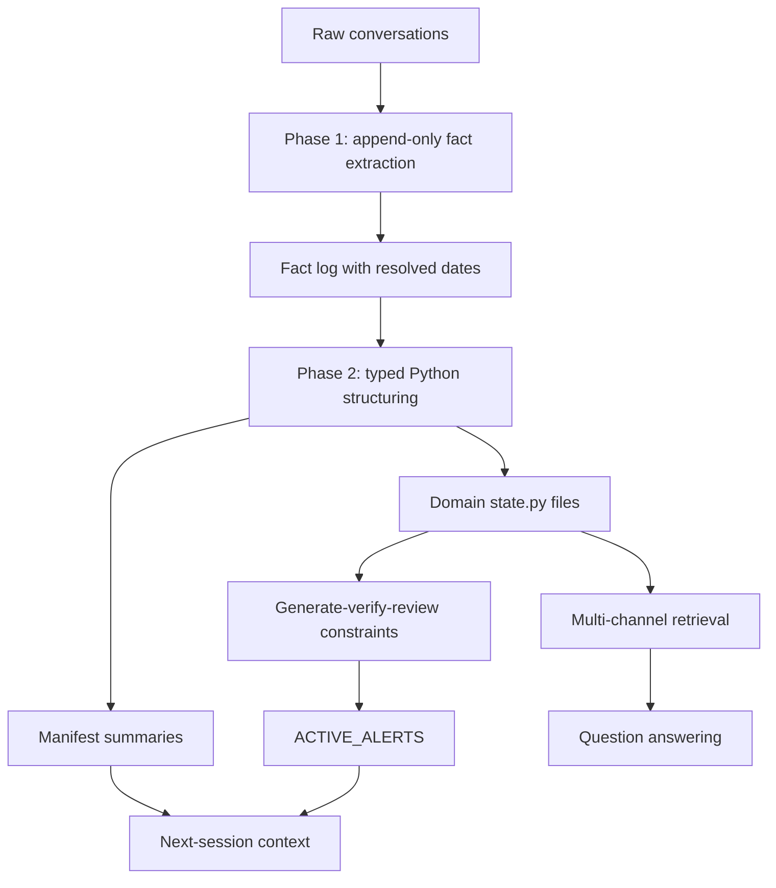

# User as Code：把个性化 Agent 记忆改写成可执行的用户代码

### 元信息

- **原文**：[User as Code: Executable Memory for Personalized Agents](https://arxiv.org/abs/2606.16707)
- **作者**：Bojie Li，Pine AI
- **发布日期**：2026-06-15
- **类别**：大模型 Agent / 个性化记忆 / 可执行约束
- **代码与实验**：[19PINE-AI/user-as-code](https://github.com/19PINE-AI/user-as-code)
- **本文问题**：Agent 的长期记忆是否应该继续做成“可检索事实库”，还是应当升级成“可运行的软件项目”？

### TL;DR

- **这篇论文做什么**：提出 User as Code（UaC），把个性化 Agent 的用户记忆表示为 typed Python state、domain package、constraint function 和 manifest，而不是只存自然语言事实、知识图谱或扁平 memory item。
- **核心方法怎么做**：Phase 1 从每次会话抽取 append-only fact log，保留事实并把相对日期解析成绝对日期；Phase 2 周期性把完整 fact corpus 重新结构化成 Python dataclass、state.py、constraints 和 manifest。
- **为什么不是“把记忆写成代码”这么简单**：论文自己承认 full context + Python REPL 也能做聚合；UaC 的真正贡献是把嘈杂会话持续转成可执行状态，并让约束在状态更新时自动运行。
- **实验给出什么证据**：LOCOMO 全量 600 QA 上 UaC 得到 78.8%，接近 Full Context 79.8%；LongMemEval 500 题上 UaC 83.0%，与 Full Context 85.4% 和 MemMachine 84.8% 形成统计上的顶部簇。
- **最有区分度的数字**：Analytical inference 100 个聚合问题上，UaC 99.0%，Full Context + REPL 100.0%，MemMachine 43.0%，Mem0 6.0%；Active Service 标准 40 场景 100%，hard 20 场景 85%。
- **消融说明什么**：append-only fact extraction 是 recall 的关键，较 code-only 增加 19 个百分点；两阶段分离相对 incremental code 继续增加 12.3 个百分点；modular loading 在 500 records 下把 dollar cost 降低 14.9 倍且准确率基本不损失。
- **局限在哪里**：Phase 2 是单次 LLM structuring，100 sessions 以后触发 500K 字符输入上限；typed state 对纯 recall 近似中性；constraint 一旦写错也会稳定地错；Active Service hard set 只有 20 个场景，统计力不足。

### 研究问题：为什么检索式记忆不够？

论文把个性化 Agent 记忆拆成三层能力：

| 层级 | 用户问题形态 | 检索式记忆的优势 | 检索式记忆的结构性缺口 |
|---|---|---|---|
| Basic Recall | “我的护照号是什么？” | top-k 检索能命中单条事实 | 如果事实被摘要压缩，细节可能丢失 |
| Multi-session Retrieval | “我上次看过哪个过敏医生？” | episode retrieval 能找相邻上下文 | 时间、矛盾、跨会话事实需要额外解析 |
| Analytical Inference | “去年国际旅行一共几次？” | 很弱，top-k 不保证全集覆盖 | 聚合必须枚举所有相关记录 |
| Active Service | “不用我问，提前提醒我风险” | 基本不成立，因为没有 query | 约束必须由状态变化触发 |

关键判断：

- 检索系统擅长 **rank**，不擅长 **enumerate**。
- 聚合问题需要完整 population，不是最相似的几条记录。
- 主动提醒要求系统在用户没有提问时启动检查。
- 自然语言规则每次都要重新解释；Python constraint 可以在状态更新后稳定执行。

### 论文主张与论证路线

| Claim | Mechanism | Evidence | Boundary |
|---|---|---|---|
| 用户记忆应是可执行表示 | typed dataclass + Python state + constraint function | Analytical inference：UaC 99.0%，retrieval baseline 大幅落后 | code-as-representation 本身不是新贡献；贡献在会话到代码的 pipeline |
| Memorize 与 Structure 必须分离 | Phase 1 append-only fact log；Phase 2 periodic checkpoint | append-only extraction 相对 code-only +19pp；两阶段相对 incremental code +12.3pp | Phase 2 仍是 LLM 调用，会受上下文长度和事实压缩影响 |
| Active Service 需要状态触发 | constraint runner 在状态变化后执行，alerts 写入 manifest | 标准 Active Service 40 场景 100%，hard 20 场景 85% | hard set 小；constraint 逻辑错误会稳定传播 |
| typed state 对聚合最关键 | 把 count、sum、average、date arithmetic 变成 Python 表达式 | N=500 时 UaC 95%，MemMachine 25%，Mem0 15% | 对普通 recall 不是主要增益来源 |
| 模块化是扩展路径 | life-domain package + compact manifest + on-demand domain loading | 500-record state 下 modular cost 低 14.9x；prompt token 低 24x | manifest routing 会偶发误路由，routing-only 版本掉 10pp |

### 方法机制：记忆被组织成什么？

UaC 把每个用户变成一个可演化的软件项目：

```text
user_project/
  manifest.py
  domains/
    travel/
      schema.py
      state.py
    health/
      schema.py
      state.py
    finance/
      schema.py
      state.py
  constraints/
    travel_readiness.py
    drug_allergy.py
    financial_authorization.py
  tests/
```

每个组成部分的功能：

| 组件 | 存什么 | 谁使用它 | 失败时影响 |
|---|---|---|---|
| append-only fact log | 每次会话抽取出的事实字符串 | Phase 2 structuring、fact-vector retrieval | 事实抽取漏掉后，后续结构化无法恢复 |
| typed state | dataclass instance、date、list、numeric fields | Answer LLM、REPL、constraint runner | schema 压缩或字段选择错误会影响聚合 |
| constraints | Python `check()` 函数 | sandbox / interpreter | 逻辑错会确定性地产生错 alert |
| manifest | domain summary、active alerts | 每轮对话启动上下文 | summary 太粗会造成 domain routing 错误 |
| archive index | 原始会话片段 | direct quote fallback | 召回依赖向量相似度 |

### 两阶段 pipeline：为什么不是直接重写 state.py？

论文的设计可以写成一个状态递推：

```text
给定第 t 次会话 x_t：

L_t = L_{t-1} ∪ ExtractFacts(x_t, timestamp_t)
S_t = StructureAsCode(L_1 ... L_t)
C_t = GenerateOrUpdateConstraints(S_t)
A_t = { alert | constraint(S_t) -> alert }
M_t = Manifest(summary(S_t), A_t)
```

变量解释：

- `L_t`：append-only fact log；原则是不覆盖、不删除。
- `S_t`：typed Python state；由完整 fact corpus 周期性再生成。
- `C_t`：约束集合；可以由 coding agent 生成、验证、保留。
- `A_t`：主动提醒；不是 query-time retrieval 结果，而是 state-change-time execution 结果。
- `M_t`：manifest；每次会话开始加载，提供 compact index 和 outstanding alerts。

流程图如下：



这条路线的意义：

- Phase 1 只负责“记住”，减少过早归纳造成的信息丢失。
- Phase 2 只负责“组织”，可以重新从全量 facts 生成结构。
- retrieval 与 constraint 共用同一份 typed state。
- manifest 让主动提醒不依赖用户提问。

### 算法流程：从事实到约束

伪代码：

```text
Input:
  sessions: 带时间戳的用户会话序列
  previous_fact_log: 历史事实列表
  domain_manifest: 当前 domain 摘要

State:
  fact_log: append-only list
  typed_state: Python dataclass instances
  constraints: Python check functions
  active_alerts: structured alert list

Loop for each new session:
  1. facts = LLM.extract_atomic_facts(session)
  2. facts = resolve_relative_dates(facts, session.timestamp)
  3. fact_log.append(facts)
  4. if checkpoint_due:
       typed_state = LLM.generate_python_state(fact_log)
       validate_parse(typed_state)
       constraints = coding_agent.generate_or_update(typed_state)
  5. active_alerts = []
  6. for check in constraints:
       result = sandbox.execute(check, typed_state)
       if result.has_alert:
          active_alerts.append(result.alert)
  7. manifest = summarize_domains(typed_state, active_alerts)

Output:
  manifest + searchable state/facts/archive

Failure boundary:
  - fact extraction 漏事实，后续代码无法补回。
  - typed_state parse 失败，结构通道会损坏。
  - constraint 逻辑错误，alert 会稳定错误。
  - checkpoint 输入过长，Phase 2 可能截断 tail facts。
```

### 检索与使用：三通道不是装饰

UaC 在回答问题时并非只把 state.py 塞进 prompt，而是拼接三类 evidence channel：

| Channel | 输入 | top-k / 截断 | 主要解决什么 |
|---|---|---|---|
| `[STATE]` | manifest-routed domain 的 `state.py` | 约 6000 chars | typed fields、dates、numeric records、active alerts |
| `[FACTS]` | append-only fact list 的向量索引 | top 20 facts | 结构化时被压缩或没有合适 schema 的长尾事实 |
| `[ARCHIVE]` | 原始会话按 session chunk 的向量索引 | top 10 chunks | direct quote、措辞依赖、上下文还原 |

这一点很重要：

- 论文没有声称 typed state 能替代所有检索。
- channel ablation 显示 fact-vector 和 archive 对 LOCOMO recall 有显著贡献。
- typed state 在 LOCOMO recall 上大致中性，但在 analytical inference 和 constraints 上不可替代。
- 因此，UaC 更像是给 memory system 加了一个 **可计算层**，而不是把 RAG 整体替换掉。

### 实验设置：对比对象与评测协议

| 维度 | 设置 |
|---|---|
| 主模型 | Gemini 3 Flash，thinking enabled |
| Judge | Gemini 3 Flash LLM-as-Judge，binary correct/wrong |
| Cross-LLM | UaC 替换为 GPT-5.4 跑 2 个 LOCOMO conversation、120 QA |
| Cross-judge | Claude Opus 4.7 重新评 7700 predictions |
| 标准 QA | LOCOMO full 10 conversations，600 QA |
| 长记忆 QA | LongMemEval full 500 questions |
| 主动服务 | 40 standard + 20 hard Active Service scenarios |
| 聚合推理 | 100 cases，10 record types，N ∈ {20, 50, 100, 200, 500} |
| Baselines | Full Context、Mem0、A-MEM、MemMachine、Hindsight、EverMemOS |

控制点：

- 回答模型和 judge 对所有系统保持一致。
- Mem0 和 A-MEM 的 write-time memory construction 使用其库默认写入模型。
- SOTA 系统被作者实现成 same-backbone minimal-faithful 版本。
- published SOTA number 只作为 ceiling，不直接与本文数字做绝对比较。

### 主结果 1：标准长期会话 QA

LOCOMO full 600 QA：

| System | Accuracy | 95% CI | N | 与 UaC 比较 |
|---|---:|---:|---:|---:|
| Full Context | 79.8% | [76.4, 82.8] | 600 | p=0.65 |
| UaC | 78.8% | [75.4, 81.9] | 600 | - |
| MemMachine | 72.7% | [69.0, 76.1] | 600 | p=0.003 |
| Hindsight lite | 69.7% | [65.9, 73.2] | 600 | p=1.5e-5 |
| EverMemOS lite | 55.5% | [51.5, 59.4] | 600 | p<1e-20 |
| A-MEM | 51.8% | [47.8, 55.8] | 600 | p<1e-30 |
| Mem0 | 29.3% | [25.8, 33.1] | 600 | p<1e-60 |

LongMemEval full 500 questions：

| System | Overall | 备注 |
|---|---:|---|
| Full Context | 85.4% | 顶部簇 |
| MemMachine | 84.8% | 顶部簇 |
| UaC | 83.0% | 顶部簇 |
| EverMemOS lite | 76.4% | 显著低于 UaC |
| Hindsight lite | 73.0% | 显著低于 UaC |
| A-MEM | 49.6% | 大幅落后 |
| Mem0 | 23.8% | 大幅落后 |

解读：

- LOCOMO 更能体现 representation 价值，因为问题更常需要跨会话整合、日期解析、细节保留。
- LongMemEval 中 MemMachine 很强，因为很多答案仍可被 contiguous span 或 episode context 捕获。
- UaC 对知识更新和 single-session preference 类题较强；在 temporal reasoning 上仍低于 Full Context。
- 论文没有把 83.0% 说成全面胜利，而是强调与 Full Context、MemMachine 的顶部簇关系。

### 主结果 2：聚合推理暴露检索天花板

Analytical inference 100 cases：

| System | Overall | N=20 | N=50 | N=100 | N=200 | N=500 |
|---|---:|---:|---:|---:|---:|---:|
| Full Context + Python REPL | 100.0% | 100% | 100% | 100% | 100% | 100% |
| UaC structured + REPL | 99.0% | 100% | 100% | 100% | 100% | 95% |
| Full Context no tool | 94.0% | 100% | 90% | 100% | 90% | 90% |
| MemMachine | 43.0% | 100% | 55% | 20% | 15% | 25% |
| Mem0 | 6.0% | 5% | 10% | 0% | 0% | 15% |

公式化解释：

```text
聚合问题的真实答案：
  y = f({r_i | P(r_i)=true, i=1...N})

top-k retrieval 实际看到：
  R_k = TopK(q, {r_i})

当 R_k 不覆盖全集时：
  f(R_k) ≠ f({r_i | P(r_i)=true})
```

这就是论文最有力的结构性论证：

- `count`、`sum`、`average`、`group by`、`date window` 需要全集。
- dense retrieval 返回的是相似记录，不是满足 predicate 的完整集合。
- MemMachine 即使取回 46/50 条餐饮记录，也会把均值算错。
- UaC 把 records 放在 typed list 里，问题变成 Python loop。

### 主结果 3：Active Service 是 query-free memory test

Active Service 的评测设计：

| 类别 | 测什么 |
|---|---|
| Travel Document Validity | 护照过期、签证窗口、中转签证、Schengen 停留限制 |
| Drug Interactions & Health Safety | 药物相互作用、过敏交叉反应、剂量、禁忌 |
| Financial Authorization Conflicts | 冲突授权、限额、取消服务扣费、账户关闭 |
| Scheduling Conflicts | 会议重叠、家庭承诺冲突、资源不可用 |
| Warranty/Deadline/Expiration | 保修、税务期限、租约续期、退货窗口 |

评分维度：

- 是否生成 alert。
- severity 是否正确。
- 触发时机是否正确。
- reasoning 是否正确。
- message 是否具体可执行。

结果抓手：

- UaC 标准 40 场景 100%。
- hard 20 场景 85%。
- 如果没有 pre-computed alerts，UaC 会跌到 52.5%。
- 这说明主动服务依赖 pipeline，而不是单纯依赖 typed state 格式。

为什么这个 benchmark 重要：

- 用户不会问“我是不是快出错了？”。
- 风险往往由多次会话、不同说话人、不同时间的事实共同构成。
- query-driven memory 必须先有 query，才会启动 retrieval。
- constraint-driven memory 可以在事实进入 state 后立即运行。

### 消融：哪些设计真的负责？

论文把贡献拆成几类：

| 消融项 | 观察结果 | 说明 |
|---|---|---|
| code-only baseline | UaC append-only extraction 高 19pp | 先记住事实，比直接写代码更重要 |
| incremental code rewrite | 两阶段分离再高 12.3pp | 结构化不应和记忆写入混在一次编辑里 |
| leave-one-out channel | typed state 对 LOCOMO recall -1.3pp，p=0.67 | state 不是 recall 的主要来源 |
| modular/progressive disclosure | 500 records 下 98.0% vs 97.0%，cost 低 14.9x | 大状态下只加载相关 domain 更优 |
| UaC + MemMachine | 300 QA 子集 81.7% vs 78.0%，p=0.14 | episode context 与 typed state 部分互补 |

关键判断：

- `append-only log` 负责 coverage。
- `typed state` 负责 computation。
- `archive/fact retrieval` 负责 tail detail。
- `constraints` 负责 proactive alerts。
- `manifest routing` 负责 context budget。

### Figure / Table 证据逐项解读

| 原文证据 | 支撑的主张 | 不能证明什么 |
|---|---|---|
| Figure 1 architecture | 两阶段 memory pipeline 与 constraint loop 的系统形态 | 不能证明每个 constraint 都会被正确生成 |
| Table 1 LOCOMO | UaC 在标准 long-conversation recall 上接近 Full Context | 不能说明 typed state 单独优于所有 retrieval |
| Table 2 LongMemEval | UaC 与 Full Context、MemMachine 形成顶部簇 | 不能说明 UaC 在 temporal reasoning 全面领先 |
| Table 3 analytical | 聚合任务上 code-readable state 接近满分 | 不能说明所有用户问题都需要 typed state |
| Analytical cost table | read-time 和 write-time 成本可量化 | 成本假设依赖 Gemini 3 Flash 价格和 workload |
| Active Service benchmark | query-free alerts 是单独能力轴 | hard set 只有 20，统计不充分 |
| Phase-2 failure audit | 5/5 parse，44/0 date typing，0.18% dropped facts | 不能外推到数百 sessions 后仍稳定 |
| Phase-2 scalability | 30-40s、约 0.07 美元、100 sessions 后截断 | 暴露了 naive all-at-once structuring 的上限 |

### 失败案例与边界

论文没有把 UaC 写成万能记忆系统，反而给出若干清晰边界：

- **Phase 2 内容丢失**：
  - 5 个 LOCOMO conversation 审计中，10273 个 distinctive-token facts 里丢 18 个。
  - 总体 drop rate 0.18%。
  - 丢失集中在 conv-43，说明长输入下 LLM 会通过抽象压缩细节。
- **日期与 parse 审计较干净**：
  - 5/5 generated files 可 parse。
  - 44 个 date 表达为 `date(...)`，0 个被存成字符串日期。
  - 这支持 temporal reasoning，但样本仍小。
- **扩展性上限明确**：
  - 19 sessions：约 62627 input tokens，cost 0.033 美元。
  - 50 sessions：约 177940 input tokens，cost 0.065 美元。
  - 100 sessions 后触发 500K 字符 cap。
  - 200 sessions 的 cost 看似仍 0.071 美元，是因为输入被截断，不是因为无限可扩展。
- **纯 recall 不一定需要 UaC**：
  - 如果任务只问单跳事实，fact-vector 或 episode retrieval 更便宜。
  - typed state 的收益集中在 aggregation、constraint、deterministic check。
- **constraint correctness 不是自动保证**：
  - interpreter 只能保证执行一致。
  - 如果 LLM 写错判断条件，错误会稳定出现。
  - 生产系统需要 tests、sandbox、review 和 rollback。

### 与相关工作的位置

论文把 UaC 放在三条线交叉处：

| 相关方向 | 代表思想 | UaC 的不同点 |
|---|---|---|
| Code as reasoning | 用 Python 计算数学和逻辑 | UaC 把用户 state 本身也做成 Python |
| Code as action | agent 用代码调用工具 | UaC 把 memory、rules、alerts 都放进同一执行介质 |
| Memory systems | Mem0、A-MEM、MemMachine、Hindsight、EverMemOS | 多数仍是 text/fact/graph store + retrieval |
| OS-style memory | MemGPT / Letta / MemOS 类 paging | OS 在 memory 外围，memory 内容仍多为文本 |
| Agent-editable instruction | LangMem 等可重写 instruction | 自然语言 instruction 每次仍需 LLM 解释，不是 interpreter-run constraint |
| Policy / constraint as code | OPA/Rego、neurosymbolic policy | UaC 的 schema、instance、constraint 都由 LLM 随用户状态生成 |

这篇文章最值得带走的不是“Python 比文本强”：

- 真正的主张是 **representation 与 verification 合一**。
- 存储格式一旦可执行，memory 不只回答问题，也能持续检查状态。
- 个性化 Agent 的 memory 不再只是“召回模块”，而是 agent 的长期可变程序。

### 可复现性与工程材料

仓库提供的材料比较完整：

| 路径 | 内容 |
|---|---|
| `paper.tex` / `body*.tex` | 论文 LaTeX 源 |
| `figures/` | 论文图 PDF 与生成脚本 |
| `prototype/` | Jessica Thompson 示例用户、domains、constraints、tests |
| `experiments/` | UaC pipeline、baseline reimplementation、results |
| `evaluation/` | Active Service benchmark scenario definitions |
| `benchmarks/` | LOCOMO、LongMemEval 获取脚本 |
| `web/` | companion site，可浏览 graded test cases |

复现注意：

- LOCOMO 可直接通过脚本获取。
- LongMemEval 是 author-distributed，不随仓库再分发。
- Gemini API key 用于主 pipeline 和 judge。
- OpenRouter key 用于 cross-family judge，以及 Mem0/A-MEM 写入路径默认模型。
- ChromaDB index 是可再生缓存，不提交。
- per-run outputs 已提交在 `experiments/results/`，可以不重跑先检查数字。

### 研究者视角：这对 Agent 记忆意味着什么？

可以把 UaC 看成一个范式转移：

```text
旧范式：
  Memory = searchable text/facts
  Use = retrieve then answer
  Failure = miss relevant item or over-compress detail

UaC 范式：
  Memory = evolving user software project
  Use = retrieve + compute + verify + alert
  Failure = extraction miss + structuring loss + wrong executable rule
```

对 Agent 系统的启发：

- **memory eval 应增加 query-free 场景**：
  - 只测“问答正确率”会漏掉主动提醒。
  - 风险系统尤其需要 state-change-triggered benchmark。
- **个性化不只是 profile field**：
  - 用户状态包含关系、时间、约束、授权、禁忌和过期窗口。
  - 这些结构更接近可执行规则，而不是几个偏好标签。
- **后训练可以瞄准 memory operation**：
  - 论文提到 future work：RL-trained constraint generation。
  - 更直接的问题是训练 agent 何时新增 constraint、何时更新 schema、何时保留 raw fact。
- **安全边界必须跟着表示升级**：
  - 可执行 memory 带来 deterministic alert，也带来 deterministic mistake。
  - sandbox、permission、test generation、human review 不能省。
- **多机制叠加仍有价值**：
  - UaC + MemMachine 子集提升 3.7pp。
  - 这说明 typed state 与 episode retrieval 是互补关系，不是取代关系。

### 结论与局限

本文可以总结成三句话：

- **第一**：用户记忆如果只做成检索库，就很难可靠处理聚合、约束和主动提醒。
- **第二**：UaC 用 append-only facts + periodic typed-code checkpoint，把用户状态转成可计算、可验证、可测试的软件项目。
- **第三**：证据最强的地方是 analytical inference 和 Active Service；证据较弱或仍开放的是超长生命周期 structuring、constraint correctness、hard-set 统计力和生产安全治理。

仍值得继续追问：

- Phase 2 是否应从 all-at-once regeneration 改成 hierarchical compiler？
- 约束生成能否通过 RL 或 verifier feedback 后训练，让 promotion policy 可学习？
- typed state 与 knowledge graph、episode memory、tool traces 如何共存？
- 可执行用户记忆的权限模型如何设计，才能避免 agent 修改、泄露或误用敏感状态？
- 如果用户希望“被遗忘”，append-only log 与可审计删除之间如何兼容？

### 关键段落细读：作者到底在反对什么？

论文不是简单反对 RAG，而是在反对一种更隐蔽的默认假设：

- 默认假设一：用户记忆只是“历史事实的外部存储”。
- 默认假设二：每次用户提问时，把相关事实检索出来就足够。
- 默认假设三：规则、偏好、禁忌、授权、期限都可以在回答时临时解释。
- 作者的反驳是：这些假设在问答任务里看似可行，但在个性化 Agent 代理用户行动时会失效。

这个反驳有三层：

| 层级 | 作者真正关心的问题 | 为什么重要 |
|---|---|---|
| 表示层 | 事实是否能被机器直接操作 | 如果日期只是字符串，就不能稳定做窗口计算 |
| 触发层 | 检查是否必须由用户问题启动 | 安全提醒往往发生在用户没有意识到风险时 |
| 演化层 | 记忆能否随用户生活变化重构 | 固定 schema 会错过新领域，纯文本又缺少可验证性 |

这也是论文开头反复强调 “storing a fact” 与 “acting on it” 分离的原因：

- 扁平 fact store 能保存“用户对青霉素过敏”。
- 检索系统可能也能在相关问题中找到这条事实。
- 但当十个月后出现“医生开了 amoxicillin”时，系统需要主动把两件事连起来。
- 如果没有状态触发的 constraint，系统不会自然产生“该阻止服药提醒”的动作。

### 关键设计 1：append-only log 的价值不是复古数据库，而是抗遗忘

Phase 1 的 append-only fact log 看起来朴素，但它承担了论文中最关键的 recall 责任。

作者选择 append-only 的原因：

- **避免覆盖**：新事实与旧事实矛盾时，旧事实仍可能是历史问题的答案。
- **避免过早结构化**：刚抽取时不知道哪些事实以后会组成约束。
- **保留审计轨迹**：如果 Phase 2 生成的 state 出错，可以回到 fact log 检查来源。
- **支撑多通道检索**：fact-vector channel 直接来自这份 log。

可以把它理解成：

```text
append-only fact log = memory 的 write-ahead log
typed Python state = memory 的 checkpoint / materialized view
constraints = checkpoint 上运行的 invariant checks
```

这个类比的边界：

- 数据库 WAL 通常由确定性程序写入。
- UaC 的 fact log 由 LLM 抽取，仍然会漏事实或误解析。
- 因此 append-only 只能避免“后续覆盖造成遗忘”，不能保证“初次抽取无错”。

### 关键设计 2：Phase 2 重新生成，而不是增量补丁

论文反复强调 periodic structuring 是从完整 fact corpus 重新生成 typed code。

这种选择看似浪费，但有一个清晰收益：

- 增量编辑 state.py 时，模型必须同时做三件事：
  - 理解旧代码。
  - 找到需要改的位置。
  - 保证新旧事实一致。
- 全量重新生成时，模型只需做两件事：
  - 读完整 fact log。
  - 重新归纳最适合当前用户的 schema 和 state。

这解释了消融中的 +12.3pp：

| 方案 | 容易失败的地方 | 作者观察 |
|---|---|---|
| code-only | 原始会话直接压成 code，容易漏掉没有 schema 的事实 | recall 明显差 |
| incremental code | 每次改代码，容易局部覆盖或结构漂移 | 低于两阶段 |
| append-only + checkpoint | 先保留事实，再周期性结构化 | 兼顾 coverage 与 typed representation |

但这个选择也带来扩展瓶颈：

- 用户会话很多时，Phase 2 输入会越来越长。
- 论文实现中 100 sessions 后触发 500K 字符 cap。
- 因此真正生产系统需要分层 checkpoint，而不是永久全量重生。

### 关键设计 3：manifest 是主动服务的入口，不只是索引

manifest 在 UaC 中有两个角色：

- 第一，它是 domain router，告诉 Agent 有哪些生活领域。
- 第二，它是 alert carrier，把 constraint runner 的结果放到下一轮会话上下文。

这改变了主动提醒的启动方式：

| 传统 retrieval memory | UaC manifest |
|---|---|
| 用户提问后才检索 | 会话开始前已加载 alerts |
| query 决定哪些事实可见 | state update 决定哪些 constraint 运行 |
| 风险提醒依赖用户意识到风险 | 风险提醒可以先于用户提问出现 |
| 主要输出 answer | 可以输出 answer，也可以输出 intervention |

这对 Agent 安全特别重要：

- 个性化 Agent 最危险的失败常常不是“答错一道题”。
- 更危险的是“代表用户执行了不该执行的动作”。
- 例如错误转账、药物冲突、护照期限不足、签证窗口不满足。
- 这些失败需要的是前置阻断，而不是事后问答。

### 实验细节：为什么 LOCOMO 与 LongMemEval 给出的结论不同？

两组 benchmark 的差异决定了读数方式：

| Benchmark | 更像什么任务 | UaC 的优势点 | UaC 的弱点 |
|---|---|---|---|
| LOCOMO | 多轮生活会话中的细节、时间、人物关系 | date resolution、fact log、typed state 共同作用 | 小细节被 Phase 2 压缩时仍会掉 |
| LongMemEval | 长文本记忆中的事实问答和 temporal reasoning | typed date、knowledge update 类问题较强 | contiguous span 类型问题上 MemMachine 也很强 |

因此不应读成：

- “UaC 在所有长期记忆 benchmark 上都赢了。”

更准确的读法是：

- “在需要把事实变成可计算状态的题型上，UaC 的表示优势显著。”
- “在答案本来就是相邻文本片段的题型上，强 episode retrieval 仍然有效。”
- “最合理的生产方向可能是 UaC typed state + SOTA episode retrieval，而不是二选一。”

### 实验细节：Mem0 为什么低得异常？

论文主动解释了一个容易引起误读的点：

- Mem0 在 LOCOMO 中只有 29.3%。
- 这个数字低于 Mem0 自己论文或其他环境里的表现。
- 作者把它当成 same-backbone、minimal stack 下的诊断结果，而不是对 Mem0 原系统能力的完整评价。

这个说明很重要：

| 因素 | 可能影响 |
|---|---|
| backbone 改成 Gemini 3 Flash | 写入和回答能力可能低于原设定 |
| background pass / retrieval stack 简化 | 记忆构建质量可能下降 |
| 默认库模型用于 write-time | 与 answer-time 控制变量不完全一致 |
| LOCOMO temporal questions | unresolved relative dates 会放大失败 |

研究者阅读时应注意：

- 论文的主比较是 representation under controlled backbone。
- published SOTA 数字与本文 reimplementation 数字不是同一实验条件。
- 因此最可信的结论不是“某个库绝对差”，而是“在同一轻量底座上，executable representation 对若干任务有结构优势”。

### 成本分析：UaC 不是总便宜，而是读写成本位置不同

UaC 的成本结构比较反直觉：

- 写入时更贵，因为多了 Phase 1 和 Phase 2。
- 聚合读取时可能更便宜，因为不必每次加载原始记录并重解析。
- 模块化后，大状态读取成本可以从“全用户状态大小”变成“最大相关 domain 大小”。

可以用一个简化公式看：

```text
TotalCost(K queries) =
  WriteCost(Phase1 + Phase2)
  + K * ReadCost(domain_state + facts + archive)

当 K 增加时：
  UaC 的 structuring cost 被摊薄
  Full Context 的 repeated parsing cost 持续线性增加
```

论文中 analytical benchmark 的具体成本提醒：

| 方案 | 准确率 | 每 case 成本 |
|---|---:|---:|
| Full Context + REPL | 100.0% | 13.6 m$ |
| UaC structured + REPL | 99.0% | 38.1 m$ |
| Full Context no tool | 94.0% | 23.6 m$ |
| MemMachine | 43.0% | 5.8 m$ |
| Mem0 | 6.0% | 2.6 m$ |

这个表不能孤立解读：

- 单次查询看，UaC 不一定便宜。
- 多次查询同一用户状态时，structuring 才开始摊销。
- 论文声称在重复查询后可约 15 倍 cheaper，是针对 amortized read-time 的说法。
- 如果用户状态很少被复用，UaC 的写入开销不一定划算。

### 安全视角：可执行记忆既是能力，也是攻击面

UaC 对 AI 安全的意义不只在 Active Service：

- 它把“用户记忆”从被动数据变成了可运行代码。
- 这让检测更强，也让误执行、越权修改、隐私泄露更值得担心。

需要区分三种安全问题：

| 风险 | 例子 | 需要的防护 |
|---|---|---|
| 逻辑错误 | constraint 把低风险误判成 critical | tests、review、counterexample generation |
| 权限错误 | Agent 修改不该修改的 domain state | file permissions、capability boundary、audit log |
| 注入错误 | 用户话术诱导写入恶意 rule | sandbox、policy check、constraint provenance |

论文中的 sandbox 和 generate-verify-review 是必要起点，但不够完整：

- verify 只能验证代码能运行，不能证明业务逻辑正确。
- review 由 Agent 做时，仍可能共享同一错误前提。
- 若 constraint 能影响真实 action，就需要更强的人类确认或 policy gate。
- 如果记忆包含健康、金融、身份文件信息，权限边界应高于普通 RAG index。

### 领域延伸：与后训练的连接

这篇论文也给后训练提出了可操作问题：

- 不只是训练模型“更会检索记忆”。
- 还可以训练模型“更会维护记忆项目”。

可能的训练目标：

| 后训练目标 | 可观测信号 | 难点 |
|---|---|---|
| fact extraction policy | 下游 QA / alert 是否命中 | 漏事实的负样本难构造 |
| schema induction policy | parse、coverage、聚合正确率 | schema 好坏依赖未来任务 |
| constraint promotion policy | alert precision / recall | false positive 与 false negative 成本不对称 |
| domain routing policy | manifest route 是否正确 | summary 过短时信息不足 |
| repair policy | test failure 后如何改 constraint | 需要可执行环境和反例生成 |

如果把 UaC 看作 environment，后训练可以围绕以下 reward 设计：

```text
Reward =
  w1 * QA_correct
  + w2 * Alert_recall
  + w3 * Alert_precision
  + w4 * Parse_valid
  - w5 * Token_cost
  - w6 * Unauthorized_state_change
```

这里最难的是：

- alert recall 的漏报通常不可见。
- 用户隐私限制训练数据规模。
- 权限违规必须给极高惩罚。
- schema 的长期收益可能延迟很多轮才出现。

### 读完后最应该保留的判断

如果只把这篇论文当作“一个新的 memory benchmark 结果”，会低估它。

更值得保留的是三个判断：

- **记忆系统应该区分 recall、aggregation、proactive constraint**：
  - 三者需要的表示和触发机制不同。
  - 一个 top-k 检索指标无法覆盖全部。
- **可执行表示把 memory 从内容层推进到行为层**：
  - 一旦 state 可运行，memory 就能参与判断、计算和阻断。
  - 这更接近 Agent 的真实工作形态。
- **工程边界决定它能否生产化**：
  - append-only log、typed checkpoint、sandbox、tests、manifest、audit 缺一不可。
  - 没有这些边界，可执行记忆会把错误从“回答错误”放大成“行动错误”。

### 参考链接

- [arXiv:2606.16707](https://arxiv.org/abs/2606.16707)
- [arXiv HTML](https://arxiv.org/html/2606.16707)
- [GitHub: 19PINE-AI/user-as-code](https://github.com/19PINE-AI/user-as-code)
- [Experiments reproduction guide](https://github.com/19PINE-AI/user-as-code/blob/main/experiments/README.md)
- [Active Service evaluation protocol](https://github.com/19PINE-AI/user-as-code/blob/main/evaluation/README.md)
- [Prototype README](https://github.com/19PINE-AI/user-as-code/blob/main/prototype/README.md)
