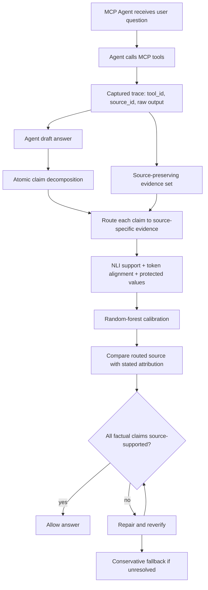

# ProvenanceGuard：MCP Agent 的事实性问题不止是“有没有证据”，还要看证据来自哪里

| 项目 | 内容 |
| --- | --- |
| 论文 | ProvenanceGuard: Source-Aware Factuality Verification for MCP-Based LLM Agents |
| arXiv | [2606.18037](https://arxiv.org/abs/2606.18037)，v1 提交于 2026-06-16 |
| 方向 | AI 安全 / 大模型 Agent / MCP 工具调用事实性验证 |
| 类型 | paper |
| 核心对象 | 多工具 MCP Agent 的回答、完整工具 trace、source-aware verifier |
| 本文重点 | cross-source conflation、claim-to-source routing、Router+NLI、calibration、repair and reverification |

### TL;DR

- **这篇论文做什么**：ProvenanceGuard 研究 MCP 工具型 Agent 的一个细粒度事实性失败：回答里的 claim 可能被某个证据支持，但被错误归因到另一个工具输出、病历来源、文献来源或 metadata source。
- **为什么重要**：传统 RAG faithfulness 或 factuality verifier 常把 evidence pool 成一个上下文，只问“这句话是否被任何证据支持”。MCP Agent 场景里，正确答案还必须回答“这句话应该归属于哪个 source”。
- **方法主线**：系统保留 MCP trace 中的 `tool_id`、`source_id` 和原始 tool output；把回答拆成 atomic claims；对每个 claim 路由到 source-specific evidence；用 NLI、token alignment、protected-value checks 和随机森林 calibration 判断 support；再单独比较 stated attribution 与 routed source。
- **关键实验**：论文在 281 条医疗领域 MCP-agent trace 上评估；其中 266 条 claim-adjudicated trace 产生 2,325 个 LLM-assisted claim labels，40 条 held-out trace 包含 361 个 claims，并经 human expert review。
- **关键数字**：held-out 上 block F1 为 **0.802**，source accuracy 为 **0.858**；MiniCheck、RAGAS、AlignScore、SummaC-ZS 的 block F1 分别是 0.783、0.758、0.662、0.436，但它们不输出 claim-to-source ID。
- **最重要边界**：在更难的 multi-source benchmark 上，block F1 仍有 **0.846**，但 source-plus-relation accuracy 降到 **0.229**，说明“能判断该不该 block”不等于“能精确找出 source ownership”。
- **安全意义**：这篇论文把 Agent factuality 从 pooled-evidence 支持，推进到 provenance-aware 支持；对医疗、企业数据、MCP server、浏览器/代码 Agent 都是更接近实际风险的验证维度。
- **局限**：数据来自一个医疗 MCP-agent stack；训练/验证标签主要是 LLM-assisted，只有 361 个 held-out labels 经专家复核；50 个 source-conflation probes 是受控注入，不代表所有隐蔽归因错误都已解决。

### 研究问题：为什么 pooled evidence 不够？

论文从一个非常具体的失败模式切入：

- Agent 调用了多个 MCP 工具。
- 每个工具返回不同来源的 evidence。
- 最终回答把多个来源的内容混在一起。
- 传统 verifier 只看“claim 是否被整个上下文支持”。
- 但用户真正需要的是“claim 是否被它声称来自的那个来源支持”。

论文称这个失败为 **cross-source conflation**。

一个简化例子：

| 回答中的说法 | pooled evidence 视角 | source-aware 视角 |
| --- | --- | --- |
| “根据患者病历，某药降低了死亡终点” | 如果 PubMed 摘要里确实有这个临床试验结论，就可能判为 supported | 如果患者病历没有这个结论，且回答把文献事实说成病历事实，就应判为 attribution error |
| “根据 CRM 记录，客户已经付款” | 如果 billing record 里有付款信息，pooled verifier 可能通过 | 如果 CRM 记录没有付款字段，回答仍然错归因 |
| “根据代码扫描工具，依赖项安全” | 如果另一个 SBOM 工具返回了安全状态，pooled verifier 可能通过 | 如果扫描工具没有覆盖该依赖，claim-to-source 仍然错误 |

这不是普通 hallucination：

- claim 不是完全凭空生成。
- claim 甚至可能在某个 evidence 里是真的。
- 错误发生在 **source ownership** 上。

因此，ProvenanceGuard 的研究问题可以写成：

> 在 MCP Agent 已经留下完整工具 trace 的情况下，能否对每个回答 claim 同时判断 support 与 source attribution？

### 论文主张与证据路线

| Claim | Mechanism | Evidence | Boundary |
| --- | --- | --- | --- |
| MCP Agent 事实性验证必须保留 source identity | trace interface 不把工具输出合并成匿名上下文，而是保留 `(tool, source, text)` | Figure 1 展示 pooled support 与 source attribution 的差异 | 只证明 source-aware verification 的必要性，不证明来源本身可信 |
| Claim-level source routing 可以给事实性判断增加 provenance 维度 | 每个 atomic claim 先路由到 source-specific evidence，再做 NLI 和 alignment | held-out source accuracy 0.858，source-plus-relation accuracy 0.681 | held-out source 候选少，Top-3/Top-5 没有充分区分度 |
| Calibration 对 fail-closed 部署有用 | 随机森林整合 route score、NLI、lexical overlap、protected values 等内部特征 | block F1 0.802，block recall 0.993，verdict accuracy 0.812 | raw verdict head 的 accuracy 更高，calibration 主要改变 operating point |
| Source-blind baseline 不能替代 attribution verifier | MiniCheck/RAGAS/AlignScore/SummaC-ZS 只能输出 support 类指标 | MiniCheck block F1 0.783 接近 ProvenanceGuard，但没有 claim-to-source ID | binary support 增益不大，核心贡献是 provenance metric |
| Repair 可以 fail closed | blocked answer 进入 revise-and-reverify loop，不通过则保守 fallback | 173 个 full-trace blocked answers 都被 resolve，但 144 个靠 fallback | 这证明能移除不可信 claim，不证明能恢复完整临床答案 |
| 显式 attribution swap 可检测 | 控制构造 50 个 source-conflation probes | 50/50 被 block，修复后无错误归因保留 | probe 简单、显式、非对抗；不能推出所有归因攻击已解决 |

### 方法机制：ProvenanceGuard 如何工作？

论文的方法不是让 Agent 重新生成答案，而是做一个 **post-hoc source-aware verifier**。

整体流程：



#### 1. Trace interface：不要把 evidence 池化

论文把每个证据对象写成：

```text
e_i = (tool_i, source_i, text_i)
```

变量解释：

- `tool_i`：工具家族，例如 PubMed、FHIR、formulary、metadata tool。
- `source_i`：trace 内稳定的 provenance-bearing source。
- `text_i`：工具输出或结构化子输出。
- `E = {e_1, ..., e_n}`：保留 source 身份的 evidence set。

关键设计：

- 同一工具的两次调用如果查询不同，也可以产生不同 source objects。
- verifier 不把所有文本拼成一个匿名上下文。
- 如果工具缺少稳定 source ID，则退回到 tool name 作为 provenance identifier。

这个接口看起来简单，但它决定了后面所有 attribution metric 是否可能成立。

#### 2. Atomic claims：只检查可验证的事实命题

回答会被拆成：

```text
y -> C = {c_1, c_2, ..., c_m}
```

每个 `c_j` 应该满足：

- 表达一个 factual proposition。
- 保留数字、单位、日期、ID、药物剂量等 protected values。
- 如果回答显式说“根据患者病历”“根据文献”，要保留 stated attribution span。
- 普通安全套话如果没有具体事实，不作为 evidence-bearing claim。

这个步骤的意义：

- 避免把一个长回答整体判定为“真/假”。
- 把错误定位到 claim 级别。
- 为后续 repair 提供具体改写目标。

#### 3. Source routing：先找 claim 应该看哪个来源

ProvenanceGuard 对每个 claim 做 source-specific routing。

公式化写法：

```text
q_j = embed(c_j)
r(c_j, s) = cosine(q_j, centroid(e_{s,1}, ..., e_{s,n_s}))
hat{s}_j = argmax_s r(c_j, s)
margin_j = r(c_j, top1) - r(c_j, top2)
```

变量解释：

- `q_j`：claim embedding。
- `s`：source ID。
- `e_{s,k}`：属于 source `s` 的 evidence chunk。
- `hat{s}_j`：路由器选出的最可能支持 source。
- `margin_j`：top1 与 top2 source 的分数差。

重要边界：

- top-ranked source 用于单源 attribution 判断。
- top-k routing 只作为分析，不是主要决策。
- premise 会按长度预算裁剪，默认 NLI premise-claim pair 为 512 tokens。

### Support 与 alignment：NLI 之外还要看 token 和 protected values

论文没有只依赖 embedding route。

它还做三类检查：

| 检查 | 输入 | 输出 | 作用 |
| --- | --- | --- | --- |
| NLI | routed premise + claim | entailment / neutral / contradiction | 判断 routed source 是否支持 claim |
| token alignment | NLI attention 中 premise-token 与 claim-token 关系 | supported-token ratio | 防止 NLI 粗标签漏掉局部未支撑 token |
| protected values | 数字、日期、单位、ID、药物量 | missing / present | 防止关键字相似但数值错配 |

一个简化支持率：

```text
lexical_overlap = |T_claim ∩ T_premise| / |T_claim|
```

变量解释：

- `T_claim`：claim 中非停用内容词集合。
- `T_premise`：routed premise 中内容词集合。
- 当 NLI 是 neutral 时，只有 structured evidence 严格满足 protected values 和 overlap threshold，才允许 lexical rescue。

这说明作者很清楚 NLI 的风险：

- entailment 可能被语义近似 source 误导。
- neutral 可能低估结构化记录里的支持。
- protected values 不能由模糊相似度代替。

### Calibration：随机森林不是核心语义，只是部署阈值层

论文保留的系统是 calibrated Router+NLI。

它把内部 verifier features 输入随机森林：

| 特征类型 | 例子 |
| --- | --- |
| routing | route score、routing margin、predicted tool family |
| NLI | label、NLI score |
| lexical | routed source overlap、all-evidence overlap |
| claim shape | claim length、evidence chunk count |
| protected values | protected count、missing protected count |
| attribution | stated-attribution indicator |
| interaction | NLI-score × route-score、route-score × lexical-overlap |

训练配置：

| 项 | 数值 |
| --- | --- |
| train claims | 1,597 |
| validation claims | 367 |
| held-out claims | 361 |
| random forest | 400 trees |
| max depth | 5 |
| min leaf size | 8 |
| class weights | balanced |
| selected threshold | 0.65 |
| validation block F1 | 0.841 |
| held-out block F1 | 0.802 |
| held-out block recall | 0.993 |
| held-out block accuracy | 0.812 |

目标函数可以抽象为：

```text
z_j = 1, if c_j is supported by routed source hat{s}_j
z_j = 0, if unsupported / contradicted / not-enough-evidence / failed-source

p_sup(c_j, hat{s}_j) = RF(phi_j)
pass if p_sup(c_j, hat{s}_j) >= 0.65
```

其中：

- `phi_j` 是 routing、NLI、alignment、lexical、protected-value 特征向量。
- `0.65` 是 validation 上按 block F1 选择的阈值。
- 这个阈值体现的是 fail-closed 部署偏好。

论文在讨论中也承认：

- 初始 raw Router+NLI label mapping 的 held-out verdict accuracy 只有 0.363。
- retained calibrated verifier 到 0.812。
- 但 direct raw verdict head 可到 0.839 verdict accuracy 和 0.816 block F1。
- calibration 更像 operating point 选择，而不是从根本上替代 source-aware modeling。

### Attribution 与 conflation：支持与归因是两件事

ProvenanceGuard 的第二个决策发生在 support 之后。

它比较：

```text
a_j = answer stated/implied source family
hat{s}_j = routed supporting source
```

如果：

```text
support(c_j, hat{s}_j) = true
but a_j incompatible with hat{s}_j
```

则标记为 source conflation。

常见来源族包括：

- patient-history。
- chart。
- FHIR。
- PubMed。
- literature。
- metadata。
- tool-name variants。

这一步的意义很大：

- 一个 claim 可以是真，但 attribution 仍然错。
- 对医疗、法律、企业数据，归因错误本身就是风险。
- 对安全 Agent，错误归因会导致错误权限判断，例如把网页内容误当系统策略。

### 实验设置：数据到底是什么？

论文的主实验来自一个医疗 MCP-agent evaluation stack。

| 数据单元 | 规模 | 用途 |
| --- | ---: | --- |
| captured MCP-agent traces | 281 | full-trace repair evaluation |
| claim-adjudicated subset | 266 traces | claim-level train/val/test |
| LLM-assisted claim labels | 2,325 | 训练和评测 claim labels |
| held-out traces | 40 | 主报告 held-out split |
| held-out claims | 361 | human expert reviewed |
| source-eligible held-out claims | 260 | source accuracy / source-plus-relation |
| targeted conflation probes | 50 | 显式 attribution swap 检测 |

基线系统：

| baseline | 类型 | 能否输出 claim-to-source ID |
| --- | --- | --- |
| MiniCheck | source-blind support verifier | 否 |
| RAGAS Faithfulness | RAG faithfulness metric | 否 |
| AlignScore | factual consistency score | 否 |
| SummaC-ZS | summarization consistency | 否 |
| ProvenanceGuard | source-aware Router+NLI verifier | 是 |

这张表很关键：

- ProvenanceGuard 的 binary block F1 只略高于 MiniCheck。
- 但 MiniCheck 不能告诉你 claim 来自哪一个 MCP source。
- 因此论文贡献不是“support F1 大幅领先”，而是“在保持 support 能力的同时保留 source ownership”。

### 主结果：block F1 不应被过度解读，source metric 才是差异

主 held-out 结果：

| 指标 | ProvenanceGuard |
| --- | ---: |
| block F1 | 0.802 |
| block precision | 0.673 |
| block recall | 0.993 |
| block accuracy | 0.812 |
| source accuracy | 0.858 |
| source-plus-relation accuracy | 0.681 |
| block F1 95% trace-bootstrap CI | [0.664, 0.900] |

与 source-blind baselines 对比：

| 系统 | block F1 | 解释 |
| --- | ---: | --- |
| ProvenanceGuard | 0.802 | 支持 source-aware 输出 |
| MiniCheck | 0.783 | 接近，但不能输出 source ID |
| RAGAS Faithfulness | 0.758 | pooled faithfulness |
| AlignScore | 0.662 | support 判断较弱 |
| SummaC-ZS | 0.436 | 不适合该 MCP trace 场景 |

需要谨慎的地方：

- MiniCheck 与 ProvenanceGuard 的 F1 差距只有 0.019。
- 论文报告 paired trace-level bootstrap 下并不显著。
- held-out 只有 40 traces，confidence interval 很宽。
- 这说明不能把文章读成“ProvenanceGuard 大幅击败所有 factuality verifier”。

更准确的读法：

> ProvenanceGuard 在不牺牲太多 binary blocking 能力的情况下，增加了 source attribution 这一维。

### 多源 benchmark：真正难的是“近似来源里的 ownership”

论文另做了 locked multi-source adjudicated benchmark。

| 项 | 数值 |
| --- | ---: |
| test questions | 59 |
| pairwise claim cases | 254 |
| source-candidate rows | 2,587 |
| frozen extracted claims | 263 |
| block F1 | 0.846 |
| source accuracy | 0.503 |
| source-plus-relation accuracy | 0.229 |

这个结果比主结果更有信息量：

- binary block 仍然强，说明系统知道很多 claim 是否应该被阻止。
- source accuracy 掉到 0.503，说明候选 source 多起来后路由更难。
- source-plus-relation 只有 0.229，说明“来源 + 关系”联合判断还远未解决。

对 Agent 安全来说，这个下降非常重要：

- 真实企业 MCP 环境不会只有一两个 source。
- 同一个客户、患者、代码库、issue、billing record 之间可能高度相似。
- source-aware verifier 如果只在少源环境表现好，不能直接用于高风险场景。

### Repair：resolve 不等于恢复高质量答案

ProvenanceGuard 使用 bounded repair-and-reverify loop。

流程：

```text
Input:
  original answer y
  claim-level verifier outputs
  routed evidence

Loop:
  revise unsupported spans
  correct wrong attribution
  remove ungrounded claims
  re-run the same verifier

Stop:
  if all claims pass -> allow revised answer
  else -> conservative non-claim fallback
```

full-trace repair 结果：

| 项 | 数值 |
| --- | ---: |
| full captured traces | 281 |
| pre-repair allowed | 108 |
| pre-repair blocked | 173 |
| blocked resolved after repair | 173 |
| terminal conservative fallback | 144 |

作者没有把这包装成“完美修复”。

更严谨的解释是：

- repair loop 能让不可信内容不再通过。
- 但很多 case 是保守 fallback，而不是生成了完整、丰富、临床上有用的答案。
- repair success 是 against the same verifier，不是独立临床验证。

这对 Agent 系统工程很现实：

- fail-closed 很有价值。
- 但如果大多数修复都退回保守回答，用户体验和任务完成率会下降。
- 安全系统必须报告“被修复”与“被保守降级”的比例，不能只报 resolved。

### Targeted source-conflation probes：50/50 成功说明什么？

论文构造 50 个 clinically framed source-conflation probes。

结果：

| 指标 | 数值 |
| --- | ---: |
| injected attribution swaps | 50 |
| blocked as conflation | 50 |
| repaired and passed | 50 |
| retained wrong attribution | 0 |
| exact binomial 95% interval | [0.93, 1.00] |

这个结果支持一个窄 claim：

- 当错误是显式 source-attribution swap；
- 且 evidence 来自 frozen captured MCP trace；
- 且每个 probe 主要包含一个 attribution error；
- ProvenanceGuard 可以稳定发现并修正。

它不支持更强 claim：

- 不能证明对抗性 prompt injection 下也能发现。
- 不能证明多错误、多跳、隐式归因、模糊语义来源都能解决。
- 不能证明 source 本身是真实、最新、临床有效的。

### Figure/Table 证据解读

| Figure/Table | 支撑什么 | 不能证明什么 |
| --- | --- | --- |
| Figure 1 | pooled support 与 source-aware support 的区别 | 不证明 source-aware verifier 已可大规模泛化 |
| Figure 2 | pipeline：trace、claim、routing、NLI、calibration、attribution、repair | 不说明每个组件独立必要 |
| Figure 3 / Table 1 | random forest calibration、阈值 0.65、held-out block F1 0.802 | 不证明 calibration 是最优路线 |
| Figure 4 | 三类评测单元：captured trace、多源 benchmark、50-case probe | 不解决三类评测之间的分布差异 |
| Table 3 | 主 held-out 结果，source accuracy 0.858 | held-out trace 少，CI 宽 |
| Table 4 | multi-source 上 source-plus-relation 掉到 0.229 | 不能说明具体是哪类 source 最难 |
| Table 17/18 | source-blind baseline 接近，但无 source ID | 不否认 MiniCheck 等工具可用于 support screening |
| Table 19 | repair 全部 resolve，但多数 fallback | 不证明修复后的答案完整 |
| Table 20 | 50 个显式 attribution swap 全检出 | 不代表隐蔽或对抗归因错误已解决 |

### 相关工作位置：它不是又一个 RAG scorer

ProvenanceGuard 和已有方向的关系：

| 方向 | 代表问题 | ProvenanceGuard 的差别 |
| --- | --- | --- |
| summarization factuality | 摘要是否忠实原文 | MCP trace 有多个工具 source，不能只看一个文档 |
| RAG faithfulness | 回答是否被检索上下文支持 | pooled context 支持不等于 source ownership 正确 |
| citation evaluation | 引用是否指向支持段落 | MCP source 是工具级 provenance，不只是 passage-level citation |
| tool-use evaluation | Agent 是否选对工具、完成任务 | ProvenanceGuard 在回答之后检查每个 claim 的来源归属 |
| RARR repair | 改写 unsupported claims | 这里的 repair 必须通过 source-aware re-verification |

这篇论文最接近的不是传统“事实性打分器”，而是：

- MCP trace auditor。
- source-aware claim router。
- fail-closed answer gate。
- attribution-sensitive repair loop。

### 对 AI 安全与 Agent 工程的含义

这篇论文可以迁移到三类高风险 Agent。

| 场景 | source conflation 的风险 | 需要保留的 source ID |
| --- | --- | --- |
| 医疗 Agent | 把文献结论说成患者病历事实 | FHIR record、PubMed、guideline、formulary |
| 企业 Agent | 把 support ticket 和 billing record 混用 | CRM、billing、ticket、contract |
| 代码 Agent | 把测试通过误认为安全扫描通过 | unit test、SAST、dependency scan、review comment |
| Web Agent | 把网页内容误认为系统策略 | user instruction、DOM text、tool output、policy |
| 安全 Agent | 把扫描器输出和攻击者页面混淆 | scanner result、sandbox log、external content |

一个直接延伸是：

```text
Agent factuality = content support + source ownership + permission validity
```

ProvenanceGuard 主要处理前两项。

它还没有处理第三项：

- 某个 source 是否有权限支配 Agent 行为。
- 某个网页或工具输出能否覆盖用户目标。
- 某个 evidence 是否来自可信 boundary 内。

这正是 Agent safety 后续应该补上的层。

### 细读一：为什么 source routing 不是普通检索？

如果只把 ProvenanceGuard 理解成“claim 去检索最相关证据”，会漏掉论文最关键的限制。

普通检索关心：

- 哪段文本和 claim 最相关。
- 哪段文本能让 NLI 判断 entailment。
- 哪段文本放进上下文最能支持最终答案。

source routing 还要额外关心：

- 支持 claim 的文本属于哪个 tool call。
- 这个 tool call 的 provenance family 是 patient record、literature、metadata 还是别的系统。
- 回答里的 stated attribution 是否和这个 provenance family 一致。
- 如果两个 source 都语义相近，top1 source 是否仍然有足够 margin。

因此，source routing 的失败更像 **ownership error**，不是 retrieval miss。

| 失败类型 | 普通检索会怎么表现 | ProvenanceGuard 需要额外判断什么 |
| --- | --- | --- |
| semantic near miss | 找到相似文本，NLI 可能给 entailment | 相似文本是否来自正确 source |
| source family swap | pooled evidence 仍有支持 | attribution span 是否把 source family 说错 |
| duplicate tool output | 多个 source 都有类似内容 | 哪个 source 是 answer claim 实际声称的来源 |
| protected value mismatch | 文本大体相似 | 日期、剂量、ID、数量是否由 routed source 支持 |
| missing provenance | support 可能可判 | source ownership 只能降级或 unavailable |

这也是为什么 multi-source benchmark 上 source-plus-relation accuracy 下降到 0.229 不应该被当作边缘结果。

它暴露的是：

- 当 source 候选从一两个变成很多个时，embedding centroid 和 NLI support 不足以稳定区分 source ownership。
- 相近医学文献、相似患者记录、相邻 metadata source 会让“谁支持了这句话”变成真正的难题。
- Agent 系统只记录 raw text 不够，还需要记录 source schema、工具调用目的、权限边界和输出字段路径。

### 细读二：calibration 为什么既必要又危险？

论文中 calibration 的作用很微妙。

它必要，是因为原始 Router+NLI 信号不稳定：

- NLI-only support decision 的 block F1 是 0.750。
- naive raw verdict accuracy 只有 0.363。
- retained calibrated verifier 把 block F1 提到 0.802，verdict accuracy 到 0.812。

但它也危险，因为 calibration 容易被误读成“学会了 provenance 语义”。

作者的讨论实际更谨慎：

| 系统 | 结果信号 | 含义 |
| --- | --- | --- |
| naive raw Router+NLI | verdict accuracy 0.363 | 简单标签映射不够 |
| retained calibrated verifier | verdict accuracy 0.812，block recall 0.993 | fail-closed 阈值有效 |
| direct raw verdict head | verdict accuracy 0.839，block F1 0.816 | 更强 raw head 可以减少 calibration 依赖 |
| high-recall calibrated raw head | block recall 0.993，但 accuracy 0.795 | 阈值选择会牺牲 accuracy |

研究者应该这样读：

- calibration 是部署策略。
- source-aware raw model 才是语义能力。
- 如果分布发生变化，validation 上选出的 0.65 阈值未必仍然可靠。
- 如果攻击者知道阈值特征，可能构造高 route score、高 lexical overlap、但 source ownership 错误的文本。

后续更稳的路线可能是：

1. 构造 harder negative source candidates。
2. 训练 end-to-end source-aware NLI 或 verifier。
3. 对 source family、field path、permission scope 做结构化建模。
4. 在 calibration 之外做 conformal 或 risk-based abstention。

### 细读三：claim decomposition 是隐藏瓶颈

论文把 claim decomposition 当作前处理步骤，但它其实决定了 verifier 的上限。

一个回答可能包含：

- 复合句。
- 条件句。
- 数值比较。
- 引用来源短语。
- 安全 disclaimers。
- 模糊主语。
- 跨句省略。

如果拆分过粗：

- 一个 claim 里混入多个事实。
- 部分支持、部分错误时很难判断。
- repair 不知道该删除哪一段。

如果拆分过细：

- claim 数暴增。
- verifier 更容易产生 false block。
- protected values 可能脱离上下文。

论文报告 runtime answer-level verification 使用 deterministic rule-based decomposer，而 offline benchmark claim-packet extraction 和 adjudication 用 local Gemma 4 E4B。

这意味着：

| 阶段 | decomposer | 风险 |
| --- | --- | --- |
| offline benchmark construction | LLM-assisted | 可能把标签分布和模型偏好带进 benchmark |
| runtime verification | deterministic rule-based | 稳定但可能 over-split 或漏掉隐式 attribution |
| repair after block | 同一 verifier re-check | 一致性强，但不构成独立质量证明 |

对实际系统，claim decomposition 应该和 provenance schema 一起设计。

例如：

```text
Claim:
  text: "The patient's chart shows no documented beta-blocker allergy."
  source_claimed: "patient_chart"
  protected_values:
    - beta-blocker
    - allergy
  relation:
    - absence_of_documented_condition
  required_source_fields:
    - allergies
    - medication_intolerance
```

这种结构比纯文本 claim 更利于 source-aware verification。

### 细读四：MCP server 应该给 verifier 留什么接口？

论文默认 trace 里有 stable source identifiers。

现实里，很多 MCP server 可能只返回一段文本或 JSON，而没有足够 provenance。

如果希望 ProvenanceGuard 这类系统真正落地，MCP 工具输出至少应该携带：

| 字段 | 作用 |
| --- | --- |
| `tool_id` | 区分工具家族，如 search、database、FHIR、scanner |
| `source_id` | 区分一次工具调用中的来源对象 |
| `source_family` | 区分 patient_record、literature、policy、web_page |
| `field_path` | 精确到 JSON path、DOM path、record field |
| `timestamp` | 判断 evidence 时效 |
| `trust_boundary` | 判断工具输出是否来自可信边界 |
| `permission_scope` | 判断 source 能否约束 Agent 行为 |
| `raw_output_hash` | 便于审计和复现 |

ProvenanceGuard 本文主要利用前几项。

Agent 安全需要继续加后几项。

一个更完整的 source-aware gate 可以写成：

```text
pass(c_j) =
  supported_by_source(c_j, hat{s}_j)
  AND attribution_matches(c_j, hat{s}_j)
  AND source_is_authorized(hat{s}_j, claim_purpose)
  AND protected_values_match(c_j, hat{s}_j)
```

这里新增的 `source_is_authorized` 是论文没有解决但非常重要的扩展。

因为很多 Agent 攻击不是让模型“事实错误”，而是让模型把低权限 source 当成高权限 source：

- 网页正文冒充系统指令。
- issue comment 冒充 maintainer policy。
- README 注入冒充项目安全规则。
- 工具错误输出冒充安全扫描通过。
- 用户上传文档冒充企业知识库。

这些都可以被看成 provenance 与 permission 的联合错误。

### 细读五：为什么这篇论文适合放进 AI 安全，而不只是医疗 RAG？

表面上看，实验是 medical MCP-agent traces。

但论文真正的问题是多工具 Agent 的证据治理：

- 工具越多，source ownership 越重要。
- 自动化越强，错误归因的后果越大。
- 用户越依赖 Agent 汇总，越难发现“事实是真的但来源错了”。

在 AI safety 里，它对应三种风险。

| 风险 | ProvenanceGuard 能提供什么 | 仍缺什么 |
| --- | --- | --- |
| 事实性风险 | claim-level support 和 source ID | source 本身的真实性和时效性 |
| 权限风险 | 区分回答声称来源和实际来源 | policy hierarchy、instruction authority |
| 供应链风险 | 记录 tool/source/raw output | 工具可信度、恶意 MCP server 检测 |

它也补充了近期 Agent 安全论文里的一个空白。

很多工作关注：

- prompt injection。
- decomposition attack。
- guardrail denial-of-service。
- reward hacking。
- tool misuse。

ProvenanceGuard 关注的是更基础的审计问题：

> 当 Agent 已经产生一个看似合理的回答后，我们能不能追溯每个 claim 的证据归属？

没有这一层，很多更高级的安全判断都缺少可审计对象。

### 细读六：它对 Agent 后训练有什么启发？

虽然论文没有训练一个新 Agent policy，但它对后训练很有启发。

许多 Agent 后训练只奖励：

- 最终答案是否正确。
- 工具调用是否完成任务。
- 格式是否符合要求。
- 用户是否满意。

这些 reward 容易漏掉 source attribution。

例如，一个 Agent 在最终答案上看起来正确，但训练信号没有惩罚它把“文献证据”写成“患者记录”。长期训练后，模型可能学到一种危险捷径：

- 只要 pooled evidence 里有支持，就大胆生成。
- 不必精确说明来源。
- 如果多个来源相似，就选择最容易让用户信服的归因方式。
- 最终答案 reward 仍然可能给高分。

ProvenanceGuard 提供了一种可转成训练信号的细粒度 reward：

```text
R_total =
  R_answer
  + lambda_1 * R_source_support
  + lambda_2 * R_attribution_match
  - lambda_3 * R_conflation
  - lambda_4 * R_unverifiable_claim
```

变量解释：

- `R_answer`：最终任务正确性。
- `R_source_support`：claim 是否被 routed source 支持。
- `R_attribution_match`：回答声称来源是否匹配 routed source。
- `R_conflation`：支持存在但归因错误的惩罚。
- `R_unverifiable_claim`：无法路由或无法验证 claim 的惩罚。

这比简单 factuality reward 更适合 MCP Agent。

原因有三点：

1. **它奖励证据使用方式，而不只是答案文本**：模型必须学会把 claim 和 tool trace 对齐。
2. **它区分可修复错误类型**：unsupported、contradiction、not-enough-evidence、conflation 可以给不同惩罚。
3. **它可用于 policy 与 verifier 分离训练**：先训练 verifier，再把 verifier 输出作为 Agent 后训练的辅助信号。

这也提示一个风险：

- 如果 verifier 自身 source routing 不稳，Agent 可能学会迎合 verifier，而不是真正学会 provenance。
- 如果 reward 只惩罚显式归因错误，模型可能减少引用来源，改用模糊措辞绕过检查。
- 如果 fallback 被奖励过高，Agent 可能变得过度保守，牺牲任务完成率。

所以 source-aware reward 需要配套：

- 引用/归因覆盖率指标。
- claim completeness 指标。
- conservative fallback 计数。
- tool-source audit trail。
- 对抗性 source-confusion negative examples。

从这个角度看，ProvenanceGuard 不只是一个 verifier，也是一种后训练数据标注器：它把 Agent answer 拆成可奖励、可惩罚、可修复的 claim-source 单元。

### 失败案例：怎样的回答会骗过 source-blind verifier？

可以构造一个贴近论文动机的例子。

输入 trace：

| source | 内容 |
| --- | --- |
| `patient_chart` | 患者 A1c 为 8.1%，正在使用 metformin，无 empagliflozin 处方记录 |
| `pubmed_trial` | EMPA-REG OUTCOME 报告 empagliflozin 降低心血管死亡风险 |
| `formulary_tool` | empagliflozin 在某保险计划下需 prior authorization |

错误回答：

```text
According to the patient's chart, empagliflozin reduced cardiovascular mortality
and is already part of the patient's current regimen.
```

source-blind verifier 可能看到：

- `empagliflozin reduced cardiovascular mortality` 被 PubMed 支持。
- `patient current regimen` 里有 medication 字段。
- 整体上下文包含所有关键词。

但 source-aware verifier 应该拆成：

| claim | routed source | stated attribution | verdict |
| --- | --- | --- | --- |
| empagliflozin reduced cardiovascular mortality | `pubmed_trial` | patient chart | conflation |
| empagliflozin is current regimen | `patient_chart` | patient chart | unsupported / contradicted |

这个例子说明：

- 一个回答里可能同时有 attribution error 和 unsupported claim。
- 只做 answer-level factuality 会掩盖错误类型。
- repair 应该分别处理：改归因、删除、或 fallback。

### 证据边界与可复现性

论文列出的边界比较清楚：

- **单一领域栈**：benchmark 来自一个 medical MCP-agent stack。
- **未来行为不可复现**：可复现对象是 frozen trace，不是未来 PubMed、FHIR、search tools 或 live agent 行为。
- **标签不是全人工**：2,325 labels 主要由 LLM-assisted adjudication 构造；human expert verification 只覆盖 361 held-out labels。
- **held-out 小**：40 traces，claim cluster 让 bootstrap interval 很宽。
- **随机 held-out 缺少真实 conflation gold relation**：最直接的 conflation 证据来自 50-case controlled probes。
- **decomposition 仍可能出错**：claim extraction 不是独立 human gold。
- **long-context 假设未证实**：2048-token ModernBERT 只是 bounded diagnostic，不证明长上下文提升。
- **source-blind baseline 不是 attribution baseline**：它们适合 support 比较，不适合 source ownership。

可复现设置包括：

| 组件 | 论文报告配置 |
| --- | --- |
| source routing embedding | all-MiniLM-L6-v2 SentenceTransformer |
| support NLI | DeBERTa-v3-base，fine-tuned on MNLI / FEVER / ANLI |
| offline claim packet / adjudication | local Gemma 4 E4B instruction-tuned model |
| runtime answer-level decomposition | deterministic rule-based decomposer |
| multi-source adjudication path | gpt-5.4 API model identifier |
| calibration | random forest over development split |
| default NLI token budget | 512 tokens |

### 研究者视角的结论

ProvenanceGuard 的贡献不是“又把 factuality F1 提高了一点”。

更准确地说，它提出了一个对 MCP Agent 更合理的事实性定义：

- 事实内容要被证据支持。
- 证据来源要和回答声称的来源一致。
- source-aware block 必须能定位到 claim。
- repair 后还要重新通过同一个 source-aware verifier。

它最值得带走的判断是：

> 多工具 Agent 的事实性错误，很多时候不是“没有证据”，而是“证据归错了来源”。

下一步值得追问：

- MCP server 是否应该标准化 `source_id`、`source_family`、`trust_boundary` 和 `permission_scope`？
- 浏览器 Agent 能否把 DOM 节点、用户指令、工具结果和 policy source 做同样的 claim-to-source routing？
- 代码 Agent 的 patch explanation 能否强制绑定 test evidence、安全扫描 evidence 和 review evidence？
- post-training 能否直接奖励“source attribution correctness”，而不只奖励 final answer correctness？
- 对抗性网页或恶意工具输出能否诱导 source router 把攻击者内容路由成 trusted source？

如果把这篇论文放到 Agent 安全路线图里，它补的是一个很基础但常被忽略的层：

```text
从“回答有没有依据”
到“回答的每个依据来自哪里”
再到“这个来源有没有权限支配回答”
```

ProvenanceGuard 已经较好地覆盖了第二步；第三步仍是后续 MCP Agent 安全系统必须面对的问题。

### 部署检查清单：什么时候可以相信 source-aware verifier？

如果把 ProvenanceGuard 当成一个真实 Agent 网关，而不是论文里的离线评测器，至少要检查六个前置条件。

| 检查项 | 为什么必要 | 如果缺失会怎样 |
| --- | --- | --- |
| source ID 稳定 | 同一条证据在 trace、claim routing、repair 中必须可复现 | verifier 只能退回 tool name，source ownership 会变粗 |
| source family 明确 | attribution 是否匹配依赖 source family | patient/chart/literature 这类错误会变成普通 support 判断 |
| raw output 可审计 | 需要复查 claim 对应的原始工具输出 | repair 可能只是在二次生成中“看起来通过” |
| protected value 抽取 | 数字、日期、药名、ID 往往是高风险事实 | NLI 可能被语义相似文本误导 |
| abstention 策略 | source routing margin 低时不应强行选择 | 多源 benchmark 中 0.229 的 source-plus-relation 会直接暴露 |
| fallback 语义透明 | conservative fallback 不是完成任务，只是阻止错误继续传播 | resolved 数字会被误读成 answer quality 提升 |

这也解释了论文里几个看似矛盾的结果：

- 主 held-out 的 source accuracy 有 0.858，但多源 benchmark 的 source-plus-relation 只有 0.229。
- full-trace repair 173/173 全部 resolve，但 144 个是 terminal conservative fallback。
- MiniCheck 的 block F1 接近 ProvenanceGuard，但它没有 claim-to-source ID，所以无法回答 attribution 是否正确。

更实用的部署指标应该分层报告：

```text
safe_answer_rate
  = allowed_original
  + repaired_with_substantive_evidence
  - repaired_by_terminal_fallback

provenance_risk
  = source_error_rate
  + source_relation_error_rate
  + low_margin_route_rate
```

变量解释：

- `allowed_original`：原答案直接通过 verifier 的比例。
- `repaired_with_substantive_evidence`：修复后仍保留具体证据性回答的比例。
- `repaired_by_terminal_fallback`：只能退回保守非事实回答的比例。
- `source_error_rate`：claim 支持来源选错的比例。
- `source_relation_error_rate`：来源选对但关系、字段或 attribution family 错的比例。
- `low_margin_route_rate`：top1 与 top2 source 太接近、需要 abstain 的比例。

从这个角度看，ProvenanceGuard 的价值不是把所有回答变得“更聪明”，而是让系统知道哪些回答不该被当作有来源依据的事实输出。

### 对后训练和 Agent 奖励设计的启发

这篇论文还给后训练一个很具体的奖励信号。

传统 Agent RL 或 SFT 常奖励：

- 最终答案是否正确。
- 工具是否选对。
- 用户任务是否完成。
- 是否遵守安全策略。

ProvenanceGuard 暗示还应该奖励：

- claim 是否能回指到正确 source。
- attribution span 是否和 source family 一致。
- protected values 是否由 routed source 支持。
- 当 source ownership 不确定时，模型是否主动降级或请求确认。

可以把一个 Agent 回答的奖励拆成：

```text
R = R_task
  + alpha * R_support
  + beta  * R_source
  + gamma * R_abstain
  - lambda * R_wrong_attribution
```

含义是：

- `R_task` 仍然奖励任务完成。
- `R_support` 奖励 claim 被证据支持。
- `R_source` 奖励支持证据和回答归因一致。
- `R_abstain` 奖励低置信 source routing 时的保守行为。
- `R_wrong_attribution` 惩罚把低权限或错误来源说成高权限来源。

这个奖励比普通 factuality reward 更贴近工具型 Agent，因为它不只问“答案对不对”，还问“答案为什么有权这么说”。

### 参考链接

- [arXiv abstract](https://arxiv.org/abs/2606.18037)
- [arXiv HTML full text](https://arxiv.org/html/2606.18037v1)
- [arXiv cs.AI recent list](https://arxiv.org/list/cs.AI/recent)
