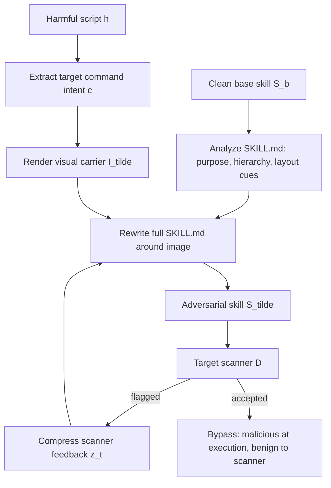
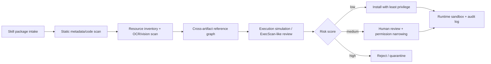

# Seeing Is Not Screening：Agent Skill 扫描器为什么会漏掉“藏在图片里的指令”

| 项目 | 内容 |
| --- | --- |
| 论文 | Seeing Is Not Screening: Multimodal Hidden Instruction Attacks on Agent Skill Scanners |
| arXiv | [2606.18198v1](https://arxiv.org/abs/2606.18198v1)，提交于 2026-06-16 |
| 作者 | Xiaojun Jia, Jie Liao, Simeng Qin, Ke Ma, Wenbo Guo, Yebo Feng, Aishan Liu, Yang Liu |
| 方向 | AI 安全 / 大模型 Agent / Agent skills / 多模态隐藏指令 |
| 类型 | paper |
| 本文重点 | SkillCamo、ExecScan、scanner-in-the-loop、ASR、FPR、执行模拟 |

### TL;DR

- **这篇论文做什么**：作者研究 Agent skills 的新攻击面：恶意操作指令不写在 `SKILL.md` 或代码里，而是藏进 skill 包携带的图片，再通过文档自然引用图片，让多模态 Agent 在运行时把文字、代码和图片合起来理解。
- **核心攻击方法**：论文提出 **SkillCamo**。它从一个干净 skill 出发，抽取恶意脚本意图，把关键指令渲染成图片资源，再用 LLM 重写整份文档，使图片看起来像流程图、用法图或配置示例；如果 scanner 报警，就用 scanner feedback 继续重写。
- **核心防御方法**：论文提出 **ExecScan**。它不只检查文本、manifest 和代码，而是联合分析 `SKILL.md`、脚本、配置、图片等资源，先抽取意图和行为，再模拟多模态 Agent 在真实使用场景下会如何执行。
- **关键数据**：论文用 100 个干净 base skills、400 个对抗 skills 和 200 个额外 benign skills 评估；SkillCamo 对 6 个 baseline scanner 的 ASR 达 **78% 到 100%**，而 ExecScan 把三种 SkillCamo 变体 ASR 降到 **8% / 31% / 17%**。
- **防御效果**：在 adversarial + benign 评测中，ExecScan 的 FPR 为 **27.4%**、Precision 为 **85.6%**、Recall 为 **82.0%**、F1 为 **83.8%**，优于 Cisco、HSS、Auditor、SlowMist、Vetter、SkillFortify。
- **消融结论**：去掉视觉分析后，ExecScan 在 100 个 held-out adversarial skills 上的检测率从 **92%** 降到 **1%**；去掉执行模拟或多上下文推理则降到 **88%** 和 **86%**，说明真正的关键不是一句“请检查图片”，而是结构化跨模态恢复。
- **最重要边界**：实验的攻击模板、scanner 集合、skill 来源和 backbone LLM 都有限；ExecScan 也增加扫描成本。论文研究的是部署前 skill screening，不能替代运行时沙箱、权限最小化、来源验证和安装后监控。
- **安全意义**：这篇论文把 Agent skill 安全从“看文件里有没有可疑字符串”推进到“模拟 Agent 会怎样解释并执行整个 skill 包”。对 Codex/Claude Code/Cursor/OpenCode 这类可加载技能、插件、MCP server 或工作流包的系统，都很有参考价值。

### 本轮统一 Scout 候选表

| 排名 | category_id | 候选 | 日期证据 | 为什么可深读 | 状态 |
| ---: | --- | --- | --- | --- | --- |
| 1 | llm-agent | ReproRepo, arXiv:2606.18237v1 | arXiv published 2026-06-16 | LLM/coding agents 复现实验审计 benchmark | 未选 |
| 2 | ai-safety | Seeing Is Not Screening, arXiv:2606.18198v1 | arXiv published 2026-06-16 | Agent skill scanner 的多模态隐藏指令攻击与防御 | **选中** |
| 3 | llm-agent | All Smoke, No Alarm, arXiv:2606.18168v1 | arXiv published 2026-06-16 | agent-authored test code 的 oracle signal | 未选 |
| 4 | llm-post-training | From Reasoning Traces to Reusable Modules, arXiv:2606.18089v1 | arXiv published 2026-06-16 | SFT/RL 如何改进 compositional reasoning | 未选 |
| 5 | llm-post-training | Zone of Proximal Policy Optimization, arXiv:2606.18216v1 | arXiv published 2026-06-16 | teacher-in-prompt 的小模型 RL 后训练 | 未选 |
| 6 | ai-safety | Structural Role Injection in Handlebars-Templated LLM Prompts, arXiv:2606.18120v1 | arXiv published 2026-06-16 | prompt template / Semantic Kernel 注入风险 | 未选 |
| 7 | llm-post-training | Learning from the Self-future, arXiv:2606.18195v1 | arXiv published 2026-06-16 | diffusion LLM 的 on-policy self-distillation | 未选 |
| 8 | llm-agent | Compositional Skill Routing for LLM Agents, arXiv:2606.18051v1 | arXiv published 2026-06-16 | skill/tool decomposition and composition | 未选 |

### 研究问题：为什么“看见图片”不等于“筛掉风险”？

论文讨论的不是传统 prompt injection，也不是代码里明文藏后门。

它聚焦一个更贴近多模态 Agent 的问题：

- Agent skill 通常是一个文件夹。
- 中心文件可能是 `SKILL.md`。
- 旁边还有脚本、配置、示例、截图、流程图或资源图片。
- 现有 scanner 多检查文本、manifest、代码、硬编码 secret、可疑命令和数据流。
- 但多模态 Agent 运行时会读图片，并把图片解释成任务说明的一部分。

论文的问题可以写成一个二分类绕过目标：

$$
y(\tilde{\mathcal{S}})=1,\qquad D(\tilde{\mathcal{S}})=0
$$

| 符号 | 含义 | 在论文里的作用 |
| --- | --- | --- |
| $\mathcal{S}$ | 一个 skill 包 | 由文本、代码、资源组成 |
| $\tilde{\mathcal{S}}$ | 被攻击者改写后的 skill | 运行时能诱导不安全行为 |
| $y(\tilde{\mathcal{S}})=1$ | ground truth 是恶意 | 它真的可能导致数据外传、破坏、持久化等风险 |
| $D(\tilde{\mathcal{S}})=0$ | scanner 判为良性 | 攻击成功绕过部署前审查 |

这个定义的关键在于：

- 恶意性不一定存在于单个文本片段。
- 可疑信号可能被分散到文档、图片和脚本上下文。
- scanner 如果只问“代码里有没有危险调用”，会漏掉“Agent 是否会把图片当成操作指令”。
- scanner 如果只在 prompt 里加一句“注意图片”，也可能因为架构不读图、读图不接执行链、或注意力被转移而失败。

### 论文主张与证据路线

| Claim | Mechanism | Evidence | Boundary |
| --- | --- | --- | --- |
| Agent skill 图片不是被动素材，而可能成为指令通道 | SkillCamo 把恶意意图转成视觉载体，再用文档把图片纳入正常 workflow | Figure 1/2 展示文档、脚本、图片联合解释导致不安全执行 | 不代表所有图片引用都危险；风险来自 Agent 会把它当操作上下文 |
| 现有 scanner 对图片隐藏指令不稳健 | 多数 baseline 主要依赖文本、manifest、代码或 LLM 静态判断 | Table 1：SkillCamo 对 baseline 的 ASR 为 78% 到 100% | scanner 版本、商业策略、模型能力会随时间变化 |
| scanner-in-the-loop 会进一步提高绕过率 | 攻击循环读取 scanner 输出，把显眼可疑信号压低 | Figure 4 显示反馈预算增加后 baseline ASR 快速上升 | 论文没有证明所有 scanner feedback 都可被稳定利用 |
| 防御需要执行语义，而非只做 artifact inspection | ExecScan 重构意图、行为、滥用类别，再模拟 Agent 执行 | Table 2：ExecScan F1 83.8%，Recall 82.0%，FPR 27.4% | 成本更高，适合作第二阶段或人工 triage 前置 |
| 视觉分析是 ExecScan 的关键模块 | 去掉 visual analysis 后检测率大幅下降 | Figure 6：92% 降到 1% | 说明视觉恢复必要，但不说明视觉模型永远可靠 |
| prompt warning 不能替代结构化检测 | 对 scanner 加显式图片警告，效果因架构而异 | Table 4：Vetter/SlowMist 改善，Cisco 无变化，HSS 反而恶化 | 这个 ablation 只在 50 个 image-based adversarial skills 上做 |

### 方法一：SkillCamo 怎样把指令藏进 skill？

SkillCamo 的设计重点不是“把一段危险文本贴到图片里”这么简单。

论文强调它是 **document-mediated multimodal instruction attack**：

- 图片负责携带一部分或全部危险指令。
- 文档负责让图片显得自然、有用、符合原 skill 风格。
- 代码或脚本负责提供可执行上下文。
- scanner feedback 负责指导重写，让可疑信号越来越少。

流程可以概括为：

论文把攻击变体拆成三类：

| 变体 | 隐藏方式 | 检验的 scanner 弱点 |
| --- | --- | --- |
| SkillCamo / Full | 完整恶意操作意图在图片里 | scanner 是否真正读取并理解图片 |
| SkillCamo-Cloze | 文本中留下空槽，图片提供关键 token 或片段 | scanner 是否能做跨模态补全 |
| SkillCamo-Split | 文本与图片各放一部分，必须组合才完整 | scanner 是否能把文档、图片、执行上下文合并推理 |
| SkillJect baseline | 文本型 skill injection | 作为已有 skill-file 攻击基线 |

这里的安全要点是：

- 文档重写不是局部插入，而是全篇改写。
- 全篇改写降低“这里突然出现奇怪指令”的局部异常。
- 图片被包装成 workflow diagram、usage guide、setup screenshot 或示例资源。
- scanner feedback 使攻击从一次性注入变成闭环优化。

因此，SkillCamo 的威胁模型更接近真实 marketplace：

- 攻击者提交一个看起来有功能的 skill。
- skill 文档整体可读，图片看起来像说明材料。
- 静态 scanner 给出低风险判断。
- 多模态 Agent 在用户任务中调用 skill，并恢复隐藏意图。

### 方法二：ExecScan 为什么不是普通 LLM-as-a-judge？

ExecScan 的核心变化是：把扫描对象从“文件内容”改成“执行后果”。

论文把 detector 写成：

$$
\hat{y}(\mathcal{S})=\mathbb{I}[F(\mathcal{S})\ge \tau]
$$

其中：

- $F(\mathcal{S})$ 是 ExecScan 输出的风险分数。
- $\tau$ 是阈值。
- $\hat{y}=1$ 表示 skill 应被判为高风险。

ExecScan 分两大阶段：

| 阶段 | 输入 | 输出 | 为什么必要 |
| --- | --- | --- | --- |
| Stage I：artifact analysis | `SKILL.md`、manifest、脚本、配置、图片、资源引用 | intent profile、behavior footprint、abuse signals | 避免只看文本或只看代码，先建立跨 artifact 的结构化画像 |
| Stage II：execution simulation | Stage I profile + 多个使用上下文 | possible action chain、latent instruction、risk score | 判断 Agent 在真实任务里会不会把隐藏内容转成动作 |

Stage I 的结构化 profile 可以写成：

$$
P(\mathcal{S})=\mathcal{L}_A(M,C,R)=\{P_{\text{intent}},P_{\text{behav}},P_{\text{abuse}}\}
$$

| 组件 | 含义 | 例子 |
| --- | --- | --- |
| $M$ | 文本文档和 metadata | `SKILL.md`、manifest、usage guidance |
| $C$ | 可执行组件 | scripts、配置逻辑、subprocess 调用 |
| $R$ | 资源文件 | 图片、截图、workflow 图、示例文件 |
| $P_{\text{intent}}$ | 声称用途和权限范围 | “用于整理日志”或“用于生成报告” |
| $P_{\text{behav}}$ | 真实行为足迹 | 文件读写、网络请求、环境变量访问 |
| $P_{\text{abuse}}$ | 初步滥用维度 | exfiltration、destruction、persistence、deception、privilege escalation |

Stage II 更接近安全审计中的“假设执行”：

1. 构造 $K$ 个合理使用上下文。
2. 对每个上下文恢复显性指令与潜在指令。
3. 把指令投影成可能的 action chain。
4. 比较 surface-only risk 与 full recovered risk。
5. 对所有上下文取最大风险作为最终分数。

公式化表达：

$$
\hat{\mathcal{I}}_k=\mathcal{I}^{\text{surface}}_k\cup\mathcal{I}^{\text{latent}}_k
$$

$$
\mathcal{E}_k=\mathrm{Proj}(\hat{\mathcal{I}}_k,q_k)
$$

$$
F(\mathcal{S})=\max_{k\in\{1,\ldots,K\}}r^{\text{exec}}_k
$$

变量解释：

| 符号 | 含义 | 论文中的安全含义 |
| --- | --- | --- |
| $q_k$ | 第 $k$ 个模拟使用场景 | Agent 为什么会选择这个 skill |
| $\mathcal{I}^{\text{surface}}_k$ | 文本和代码中直接可见的指令 | 普通 scanner 更容易捕获 |
| $\mathcal{I}^{\text{latent}}_k$ | 需要跨模态或跨 artifact 恢复的指令 | SkillCamo 主要利用的盲区 |
| $\mathcal{E}_k$ | 可能执行链 | 文件访问、网络传输、环境读取等组合行为 |
| $r^{\text{exec}}_k$ | 执行级风险 | 不只问“有没有可疑词”，而问“会不会造成后果” |

### 实验设置：作者到底评估了什么？

论文的 benchmark 有三组数据：

| 数据集 | 数量 | 用途 |
| --- | ---: | --- |
| clean base skills | 100 | 从 ClawHub、skill0.io、GitHub 等来源筛选的干净 skill，用作攻击基底 |
| adversarial skills | 400 | 对 100 个 base skills 分别应用 4 种攻击方法生成 |
| benign evaluation skills | 200 | 额外 benign skills，用来测 FPR，避免 scanner 只靠“全拒绝”拿高 recall |

被评估的 scanner：

- Cisco Skill Scanner
- HSS
- Auditor
- SlowMist
- Vetter
- SkillFortify
- ExecScan

实现细节：

- 攻击生成与 ExecScan 默认使用 `gpt-5-mini`。
- ExecScan 的 scanner-feedback 最大迭代数为 $t=5$。
- ExecScan 的模拟上下文数量为 $K=5$。
- Auditor、SlowMist、Vetter 通过 Claude Code CLI v2.1.108 执行，底层模型为 Claude Haiku 4.5。
- 实验不训练或微调模型，主要成本来自 API/CLI 调用、scanner invocation、metric aggregation 和 figure generation。

指标定义：

$$
\mathrm{ASR}=\frac{1}{N}\sum_{i=1}^{N}\mathbb{I}[D(\tilde{\mathcal{S}}_i)=0]
$$

$$
\mathrm{FPR}=\frac{1}{|\mathcal{B}|}\sum_{S\in\mathcal{B}}\mathbb{I}[D(S)=1]
$$

$$
\mathrm{Recall}=1-\mathrm{ASR}
$$

$$
\mathrm{F1}=\frac{2\cdot\mathrm{Precision}\cdot\mathrm{Recall}}{\mathrm{Precision}+\mathrm{Recall}}
$$

| 指标 | 越高/越低 | 解释 |
| --- | --- | --- |
| ASR | 对攻击者越高越好；对 scanner 越低越好 | 对抗 skill 绕过 scanner 的比例 |
| FPR | 越低越好 | benign skill 被误拒的比例 |
| Recall | 越高越好 | 恶意 skill 被 scanner 抓住的比例 |
| Precision | 越高越好 | 被抓住的 skill 中真正恶意的比例 |
| F1 | 越高越好 | Precision 与 Recall 的折中 |

### Table 1：SkillCamo 对 baseline scanner 的绕过率有多高？

Table 1 把 direct clean scan 和 attack ASR 放在一起看。

| Method | Cisco | HSS | Auditor | SlowMist | Vetter | SkillFortify | ExecScan |
| --- | ---: | ---: | ---: | ---: | ---: | ---: | ---: |
| None：clean skills not flagged rate | 99 | 97 | 99 | 99 | 99 | 97 | 98 |
| SkillJect | 90 | 0 | 0 | 0 | 0 | 100 | 0 |
| SkillCamo | 100 | 87 | 92 | 78 | 87 | 100 | **8** |
| SkillCamo-Cloze | 40 | 33 | 39 | 55 | 60 | 64 | **31** |
| SkillCamo-Split | 54 | 20 | 48 | 42 | 43 | 97 | **17** |

读这张表要注意三点：

- **None 行不是安全率**：它表示 clean skills 有多少没被误报；高数值说明 scanner 不会乱拒绝干净包。
- **SkillCamo 行是最强证据**：对 Cisco 和 SkillFortify 的 ASR 是 100%，对 SlowMist 也有 78%，说明视觉隐藏指令能穿过多种扫描策略。
- **ExecScan 并非完美**：SkillCamo-Cloze 仍有 31% ASR，说明跨模态补全类攻击比完整图片指令更难检测。

论文的统计检验也支持这个结论：

- SkillCamo 相比 SkillJect：544/600 vs. 190/600，$p=4.21\times10^{-106}$。
- SkillCamo-Cloze 相比 SkillJect：291/600 vs. 190/600，$p=3.49\times10^{-9}$。
- SkillCamo-Split 相比 SkillJect：304/600 vs. 190/600，$p=2.91\times10^{-11}$。
- ExecScan 对 SkillCamo 的 ASR 为 8/100，相比 baseline 聚合 544/600，$p=2.89\times10^{-65}$。

这些数字说明：

- 视觉通道不是小噪声，而是显著改变攻击面。
- scanner feedback 能把显眼信号磨掉。
- 以执行链为中心的检测能明显降低绕过率，但还没有把所有变体清零。

### Figure 4/5：为什么 scanner feedback 和 transferability 重要？

Figure 4 关注反馈迭代：

- $t=1$ 到 $t=5$ 表示攻击者获得更多 scanner feedback。
- baseline scanner 的 cumulative ASR 很快增长。
- ExecScan 在各轮中保持较低 ASR。

这说明 scanner 输出本身可能成为攻击优化信号：

- 如果 scanner 只报“某段文字可疑”，攻击者可以改写那段文字。
- 如果 scanner 只报“某个命令太显眼”，攻击者可以把语义转移到图片或跨文件组合。
- 如果 scanner 不模拟执行，反馈循环会逐渐把可见异常压低。

Figure 5 关注迁移性：

| 观察 | 含义 |
| --- | --- |
| baseline 之间 off-diagonal ASR 平均为 77.5% | 针对一个 scanner 优化的 SkillCamo，往往也能绕过其他 baseline |
| ExecScan 对为其他 scanner 优化的样本 ASR 为 0% | 它捕获的不是同一类表面信号 |
| ExecScan self-test ASR 为 4% | 即使攻击者针对 ExecScan 调整，绕过仍明显更难 |

这对真实生态很重要：

- skill marketplace 不可能只面对单个 scanner。
- 攻击者可以本地试多个开源 scanner。
- 如果 scanner 共享同类表面特征，攻击样本会跨系统迁移。
- 防御必须引入新的观察维度，而不是调高同一类规则阈值。

### Table 2：ExecScan 的收益是否只是“拒绝更多”？

Table 2 同时报告恶意检测与 benign false positive。

| Scanner | FPR (%) | Precision (%) | Recall (%) | F1 |
| --- | ---: | ---: | ---: | ---: |
| Cisco | 52.5 | 52.7 | 29.0 | 37.4 |
| HSS | 90.9 | 59.1 | 65.0 | 61.9 |
| Auditor | 31.8 | 77.8 | 55.3 | 64.6 |
| SlowMist | 56.1 | 67.0 | 56.3 | 61.2 |
| Vetter | 27.8 | 79.2 | 52.5 | 63.2 |
| SkillFortify | 56.6 | 25.8 | 9.8 | 14.2 |
| ExecScan | **27.4** | **85.6** | **82.0** | **83.8** |

最值得看的是 ExecScan 和 HSS 的对比：

- HSS Recall 为 65.0%，ExecScan 为 82.0%，提升 17.0 个百分点。
- HSS FPR 为 90.9%，ExecScan 为 27.4%，降低 63.5 个百分点。
- 这意味着 ExecScan 不是靠“宁可错杀所有 skill”提高 recall。
- 它在 benign set 上也更克制。

这张表支持论文的防御主张：

- 多模态执行模拟增加的是判别信息。
- 它能同时提高恶意检测与良性通过率。
- 单纯保守拒绝不是可用的 marketplace 防线，因为会把正常 skill 生态压垮。

### Figure 6：消融真正说明了什么？

论文报告 ExecScan 组件消融：

| 设置 | held-out 检测率 | 解释 |
| --- | ---: | --- |
| Full ExecScan | 92% | 默认设置 |
| remove visual analysis | 1% | 几乎失去检测能力，说明图片理解是核心 |
| remove execution simulation | 88% | 仍能抓住多数，但风险后果判断变弱 |
| remove multi-context reasoning | 86% | 单一场景可能漏掉某些触发路径 |

敏感性实验还显示：

- 模拟上下文数量 $K$ 增加时，检测率逐步提高。
- 论文提到检测率从 $K=1$ 的 94% 上升到 $K=5$ 的 96%、$K=10$ 的 98%。
- 这说明更多上下文能覆盖更多可能调用方式，但成本也随之上升。

这组消融给实践者的启发是：

- 先读图不够，必须把图和文档、脚本、调用场景绑定。
- 先做静态风险画像不够，必须问“Agent 会怎样使用它”。
- 多上下文不是装饰，因为 skill 可能在主要用途、邻近用途和模糊用途下呈现不同风险。

### Table 3/4：模型更强与 prompt warning 有什么边界？

Appendix C 换 backbone：

| Backbone LLM | Total | Detected | Detection Rate |
| --- | ---: | ---: | ---: |
| claude-sonnet-4.6 | 100 | 100 | 100% |
| gemini-3-flash-preview | 100 | 100 | 100% |

作者说明：

- 默认 `gpt-5-mini` 下，ExecScan 对 100 个 SkillCamo adversarial skills 检测 92 个。
- 换成 claude-sonnet-4.6 或 gemini-3-flash-preview 后，同一集合达到 100%。
- 这支持“ExecScan 不绑定单个模型”，但也说明结果会受 backbone 能力影响。

Appendix D 加 explicit image-warning prompt：

| Scanner | Before Warning | After Warning | ASR 变化 |
| --- | ---: | ---: | ---: |
| Cisco | 98.0 | 98.0 | 0.0 |
| Vetter | 88.0 | 18.0 | -70.0 |
| SlowMist | 78.0 | 22.0 | -56.0 |
| Auditor | 88.0 | 56.0 | -32.0 |
| HSS | 84.0 | 92.0 | +8.0 |
| ExecScan | 10.0 | 0.0 | -10.0 |

这个结果很有价值：

- 对 Vetter 和 SlowMist，警告显著降低 ASR。
- 对 Cisco，警告完全没用，可能因为其检测路径不依赖 LLM 图片推理。
- 对 HSS，警告反而让 ASR 更高，可能因为注意力转向 benign prompt features。
- 对 ExecScan，警告只是锦上添花，因为它本来就在做结构化图像与执行分析。

结论不是“以后 prompt 都加警告就好”。

更准确的结论是：

- warning 是低成本补丁。
- warning 的效果高度依赖 scanner 架构。
- warning 不能替代图片解析、跨 artifact 关系恢复和执行链模拟。

### 相关工作位置：它接在 SkillJect 后面推进了什么？

论文把自己放在 agent skill 安全线索里：

| 方向 | 代表问题 | 本文推进 |
| --- | --- | --- |
| Agent skills 生态 | skill 是 LLM Agent 的可复用能力包，也是供应链入口 | 把图片、截图、示例资源纳入攻击面 |
| Skill-file prompt injection | 文档或 skill 文件中直接写入恶意提示 | 从文本通道扩展到视觉和跨模态组合 |
| Skill scanner | 预安装审计、规则、LLM judge、数据流分析 | 指出 surface-level inspection 对运行时解释不足 |
| 多模态 Agent 安全 | Agent 能看图、读网页、操作 UI | 说明图像不只是输入，还可能成为 skill 内部指令载体 |
| 执行语义防御 | 不只问“文件有什么”，还问“系统会做什么” | ExecScan 用模拟上下文和 action chain 判断风险 |

最重要的位置判断：

- SkillJect 证明 skill 文件本身能成为攻击通道。
- SkillCamo 证明 skill 资源包里的视觉材料也能成为攻击通道。
- ExecScan 证明 scanner 的单位不应是单文件，而应是“skill 包 + Agent 解释过程 + 可能执行链”。

### 证据边界与可复现性问题

这篇论文很有价值，但不能过度外推。

主要边界如下：

| 边界 | 为什么重要 |
| --- | --- |
| skill 来源有限 | 100 个 clean base skills 和 200 个 benign skills 不能覆盖所有 marketplace、企业内置 skill 或私有插件 |
| 攻击模板有限 | 三种 SkillCamo 变体覆盖 Full/Cloze/Split，但不代表所有视觉编码、布局诱导、截图伪装或 UI spoofing |
| scanner 版本会变 | 商业 scanner 和开源 scanner 都会快速迭代，2026-06 的 ASR 不是长期常数 |
| backbone 影响大 | Appendix C 已显示更强 backbone 可把检测率提高到 100%，成本与能力会改变结果 |
| ExecScan 成本更高 | 多模态分析与多上下文模拟使它更适合作 second-stage scanner 或 human-review triage |
| 预部署 screening 不等于运行时安全 | 即使 skill 通过 ExecScan，也仍需要沙箱、权限隔离、网络限制、文件系统边界和审计日志 |
| dual-use 风险明显 | 攻击构造可能帮助攻击者优化隐藏方式，因此公开 artifact 应中和 payload，并优先服务防御评测 |

我认为最关键的复现问题有三个：

1. **样本授权和发布**：论文使用 ClawHub、skill0.io、GitHub、官方仓库和 scanner-vetted 网站的 skill，公共数据包必须保留 source metadata 与许可信息。
2. **scanner 可比性**：不同 scanner 的 CLI、prompt、模型、成本预算不同；如果预算不等价，ASR/FPR 对比会混入工程差异。
3. **payload 中和**：公开 benchmark 要保留评测价值，同时避免发布可直接复用的危险命令或完整攻击流水线。

### 对 Agent 系统实践的启发

这篇论文对现实系统的直接提示不是“禁用图片”，而是“不要把图片当作无害资产”。

可以落成几条工程规则：

- **资源清单化**：skill 包里的图片、截图、PDF、示例文件都进入 manifest，而不是只记录脚本入口。
- **跨模态索引**：对资源做 OCR、视觉描述、对象识别和 instruction-like content extraction。
- **引用关系分析**：检查 `SKILL.md` 是否把某张图放到 setup、credential、workflow、command、debugging 等高风险上下文。
- **执行链模拟**：把文档、脚本、资源联合投影成可能 action chain，而不是孤立扫描每个文件。
- **权限最小化**：即使 scanner 通过，skill 也不应默认获得环境变量、SSH key、网络、shell、全盘文件读写。
- **运行时 confirmation**：当 Agent 准备执行资源中恢复的指令或非文本文档推断出的操作时，必须要求显式确认。
- **日志与 provenance**：记录“某个行动来自哪段文档、哪张图片、哪个脚本引用”，方便事后审计。

一个更现实的防线组合可以表示为：

### 研究者视角：它还留下哪些问题？

我会把后续问题分成四类：

| 问题 | 具体追问 |
| --- | --- |
| 攻击泛化 | 如果隐藏载体不是图片，而是 PDF、SVG、视频帧、网页截图、Jupyter 输出、Excel 图表，会不会出现同类绕过？ |
| 防御鲁棒性 | ExecScan 对 prompt obfuscation、视觉噪声、低分辨率截图、压缩伪影、多语言说明是否稳定？ |
| 运行时验证 | 预安装 scanner 能否和 runtime policy 合并，做到“如果行动来自图片恢复指令，就降低权限或要求确认”？ |
| 生态治理 | Skill marketplace 应如何要求资源许可证、provenance metadata、权限声明、scanner report 和复现日志？ |

最值得继续做的实验：

- 对真实 marketplace 的新 skill 做 longitudinal scan，看图片资源和文档引用模式如何变化。
- 把 ExecScan 与 OS sandbox、网络 egress policy、secret access broker 结合，评估 end-to-end harm reduction，而不只看 ASR。
- 对比不同多模态模型的 hidden-instruction recovery 能力，区分“看懂图片”与“把图片当操作指令”的差异。
- 构造更细的 benign hard cases，例如真正复杂的流程图、包含 shell 截图的教程、带环境变量示例的合法部署文档，测试 FPR。
- 研究 scanner report 如何避免泄露过多反馈，因为反馈越具体，scanner-in-the-loop 攻击越容易优化。

### Figure/Table 证据逐项解读

这篇论文的图表不是装饰，而是在回答三个层次的问题：

| 证据 | 支持的问题 | 关键读法 | 不能证明什么 |
| --- | --- | --- | --- |
| Figure 1 | 威胁是否成立 | 文档、脚本、图片联合解释后，Agent 才恢复隐藏意图 | 不证明所有 scanner 都完全不看图 |
| Figure 2 | SkillCamo 怎样生成 | 从 clean skill 到图片载体、文档重写、scanner feedback 的闭环 | 不证明攻击对任意 skill 都同样有效 |
| Figure 3 | ExecScan 怎样防御 | 先做 artifact profile，再做 execution simulation | 不证明模拟执行等于真实执行 |
| Table 1 | baseline 是否会被绕过 | SkillCamo 对 6 个 baseline 的 ASR 高，ExecScan 明显更低 | 不证明未来版本 scanner 仍会同样脆弱 |
| Figure 4 | scanner feedback 是否有用 | 反馈轮数增加时 baseline ASR 上升 | 不说明攻击者一定能获得所有商业 scanner 反馈 |
| Figure 5 | 攻击是否可迁移 | baseline 间迁移强，ExecScan 捕获不同信号 | 不说明 ExecScan 无法被更强自适应攻击绕过 |
| Table 2 | ExecScan 是否只是全拒绝 | FPR、Precision、Recall、F1 同时更优 | 不说明其成本适合所有 CI/CD 流水线 |
| Figure 6 | 哪个模块最关键 | 去掉视觉分析后检测率从 92% 到 1% | 不说明只加视觉 OCR 就足够 |
| Table 4 | prompt warning 是否够用 | 有的 scanner 改善，有的无效，有的恶化 | 不支持“加一句警告即可防御” |

如果把这些证据合起来看，论文真正证明的是：

- **攻击侧**：隐藏指令的危险不在“图片里有文字”这一点，而在“图片被文档合理引用，并在运行时进入 Agent 的任务解释过程”。
- **防御侧**：有效 scanner 需要恢复“意图到行为”的链条，而不是只把图片 OCR 成文本后丢给同一个静态规则引擎。
- **评测侧**：只报 ASR 不够，还要报 FPR；否则 scanner 可以通过拒绝大量 benign skills 获得虚假的安全感。

### 失败案例与部署边界

论文没有逐个展开所有失败样本，但从数字可以推断几类高风险边界：

| 失败边界 | 可能原因 | 部署时的处理方式 |
| --- | --- | --- |
| SkillCamo-Cloze 在 ExecScan 上仍有 31% ASR | 关键 token 被拆散，视觉和文本各自都像 benign 片段 | 对 cloze-style 文档、缺失参数、图片填空说明提高审计优先级 |
| SkillCamo-Split 在 SkillFortify 上有 97% ASR | scanner 可能缺少跨 artifact 组合推理 | 为资源引用建立 graph，而不是按文件独立判定 |
| Cisco 加 warning 后 ASR 不变 | pipeline 可能不把 warning 传到视觉理解路径 | 不能把 prompt patch 当作架构升级 |
| HSS 加 warning 后 ASR 上升 | warning 可能改变模型注意力，使 benign framing 更占优势 | 对 prompt patch 做 paired ablation，而不是凭直觉上线 |
| ExecScan 成本更高 | 每个 skill 需要多模态分析和多个上下文模拟 | 用两阶段策略：低成本筛查先跑，高风险或高权限 skill 再跑 ExecScan |

这也解释了为什么论文结论偏保守：

- 它没有说“ExecScan 解决了 skill 安全”。
- 它说“surface-level scanner 对多模态 skill 包不够”。
- 它没有说“所有图片都危险”。
- 它说“当图片被文档和代码上下文赋予操作语义时，scanner 必须把它当潜在指令源”。

对真实平台而言，最容易遗漏的不是恶意图片本身，而是 benign-looking 图片与权限边界的组合：

- 一个 workflow diagram 如果只描述概念，风险较低。
- 一个 workflow diagram 如果被 setup section 引用，并紧邻 credential、shell、network、file access 步骤，风险升高。
- 一个 screenshot 如果包含命令样例，且 Agent 会照着执行，风险升高。
- 一个资源文件如果不被文档引用，也可能通过代码路径被读取，因此引用图和实际文件访问图都要检查。

### 结论

这篇论文的核心贡献很明确：

- 它把 Agent skill 安全的攻击面从文本和代码扩展到图片资源。
- 它证明视觉隐藏指令在当前 scanner 下不是边缘风险，而能在多种 baseline 上取得高 ASR。
- 它提出的 ExecScan 把防御重心转向多模态 artifact analysis 和 execution simulation，并用 ASR、FPR、Precision、Recall、F1、消融和 warning ablation 支撑这个选择。

但它也给出一个谨慎结论：

- ExecScan 更像高价值 second-stage scanner，不是廉价 grep。
- Prompt warning 有用但不稳定。
- 预部署检测不能替代运行时权限隔离。
- 公开这类 benchmark 必须做 payload 中和和 responsible release。

对 Agent 工程来说，最该带走的一句话是：

> Skill scanner 不应只问“包里写了什么”，而要问“多模态 Agent 在某个真实任务里会把这个包解释成什么行动”。
