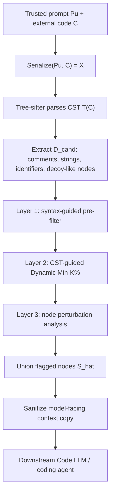
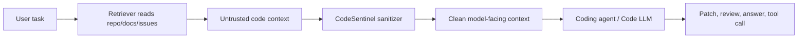

# CodeSentinel：把代码上下文里的间接 Prompt Injection 拆到 CST 节点级别处理

- **论文**：[CodeSentinel: A Three-Layer Defense Against Indirect Prompt Injection in Code Contexts](https://arxiv.org/abs/2606.19235v1)
- **版本**：arXiv:2606.19235v1，2026-06-17 提交。
- **方向**：AI 安全 / Coding Agent 安全 / 代码上下文间接 Prompt Injection 防御。
- **本轮选择原因**：统一 Scout 表把它列为 `ai-safety` 第一推荐；本地 `public/` 对 `2606.19235`、标题和 `CodeSentinel` 没有已发布重复项。
- **阅读材料**：arXiv API 元数据、arXiv HTML 全文、论文附录中的表格与自适应攻击分析。

### TL;DR

- **这篇论文做什么**：CodeSentinel 研究 coding agent 和 Code LLM 在读取仓库、文档、issue、注释、字符串、标识符和诱饵代码时遇到的间接 prompt injection 风险。
- **核心方法**：它不把代码当成平面文本，而是用 Tree-sitter 解析 Concrete Syntax Tree，把可被模型看到且高风险的节点拆出来，再做三层推理前清洗。
- **三层检测**：Layer 1 用语法和结构规则抓显式异常；Layer 2 在 CST 节点粒度做 Dynamic Min-K% 负对数似然异常检测；Layer 3 对自然但有影响力的节点做 syntax-preserving neutralization，再看模型 logits 分布变化。
- **关键证据**：在 XOXO、ITGen、Flashboom、ShadowCode、INSEC、CoTDeceptor 六类攻击族上，CodeSentinel 平均 node-level F1 为 **0.80**，高于 CodeGarrison **0.70**、DePA **0.51**、KillBadCode **0.30**。
- **黑盒价值**：即使下游 victim 是商业 coding agent，CodeSentinel 也只需要本地 surrogate logits；清洗后的上下文再交给 Claude-3.5-Haiku、GPT-5.1-Codex-mini、Gemini-3.1-Flash-lite 等 victim。
- **ASR 数字**：商业 coding agent 的样本级 ASR 从 27.11 降到 7.72、18.32 降到 5.81、24.14 降到 8.28；说明它不只是离线检测器，也会改变攻击是否成功。
- **代价与局限**：HumanEval compile 和 Pass@1 没掉，MBPP Pass@1 掉 6.23 点，RepoBench exact match 掉 32.67 点；自适应攻击下 F1 会从 0.82 降到 0.74、0.62、0.66。
- **最重要的边界**：它是推理前 sanitizer，不是证明代码真实安全的 verifier；prompt-only 模式清洗的是模型可见副本，不等价于修复仓库源码。

### 统一 Scout 候选表里它为什么排第一？

| 排名 | category_id | 候选 | 时间证据 | 选择状态 |
|---:|---|---|---|---|
| 1 | ai-safety | **CodeSentinel**, arXiv:2606.19235v1 | arXiv published 2026-06-17T16:12:50Z | **选中** |
| 2 | llm-post-training | STARE, arXiv:2606.19236v1 | arXiv published 2026-06-17T16:13:42Z | 未选 |
| 3 | llm-agent | Data Intelligence Agents, arXiv:2606.19319v1 | arXiv published 2026-06-17T17:45:32Z | 未选 |
| 4 | ai-safety | PhantomSkill, arXiv:2606.19191v1 | arXiv published 2026-06-17T15:33:41Z | 未选 |
| 5 | llm-agent | Learning User Simulators with Turing Rewards, arXiv:2606.19336v1 | arXiv published 2026-06-17T17:58:48Z | 未选 |

这次选 CodeSentinel 的理由不是“安全论文看起来更吓人”，而是它对 Daily Report 当前关注的 coding agent 风险最直接：

- 它把攻击面放在 **代码上下文**：
  - repository；
  - documentation；
  - issue thread；
  - coding-agent environment；
  - comment、string、identifier、decoy snippet。
- 它不是只做 benchmark：
  - 它给出可部署的推理前清洗流程；
  - 可以接黑盒 commercial Code LLM；
  - 不要求重新训练下游模型；
  - 也不要求 victim 暴露 logits。
- 它有足够细的证据：
  - 主表有六类攻击族 F1；
  - 附录有 targeted defense、leave-one-attack-out、自适应攻击；
  - 还有 ASR 和 clean-code utility。

### 研究问题：代码为什么是间接 Prompt Injection 的高危载体？

论文的出发点很具体：

- coding agent 不只读用户 prompt；
- 它还会读很多外部材料；
- 这些材料经常不是“可信指令”，却会被拼进模型上下文。

可以把上下文来源拆成四层：

| 来源 | 对人类开发者的含义 | 对 Code LLM 的风险 |
|---|---|---|
| 注释 | 解释代码意图、TODO、迁移说明 | 可以伪装成任务说明或规则覆盖 |
| 字符串 | 错误信息、模板、测试样例、配置 | 可以携带自然语言触发词 |
| 标识符 | 变量名、函数名、类名 | 可以通过命名暗示误导模型判断 |
| 诱饵代码 | 语法合法但弱连接的片段 | 可以吸引模型注意力但不影响运行 |

这和普通网页 prompt injection 的差别在于：

- **代码有结构**：不能只靠关键词过滤。
- **代码有可执行语义**：清洗不能随便破坏语法。
- **代码有模型可见但运行弱相关的区域**：注释、字符串、dead block、identifier 对模型很重要，对程序运行却可能很弱。
- **coding agent 会把这些内容当成证据**：尤其是在 code review、bug fixing、自动补全、漏洞审计任务中。

论文把这个问题定义为：

> 在下游 Code LLM 看到外部代码上下文之前，先识别并清洗可能操纵模型行为的 CST 节点。

### 威胁模型：不是“攻击代码运行时”，而是攻击模型读代码的方式

CodeSentinel 关注的不是传统漏洞利用链。它的目标更窄：

- 攻击者把隐藏触发内容插入外部代码上下文；
- benign developer 或 coding agent 后续检索、复制、打开或引用这些代码；
- Code LLM 把这些节点当成上下文；
- 模型输出被诱导到攻击者希望的方向。

论文用下面的符号整理这个过程：

```text
Pu: trusted developer prompt
C: external code context
X = Serialize(Pu, C): 模型实际看到的序列化输入
T(C): 代码的 Concrete Syntax Tree
q_phi: 本地 surrogate model
f_theta: 下游 victim Code LLM
```

最关键的高风险节点集合是：

```text
D_risk = D_com ∪ D_str ∪ D_id ∪ D_decoy
```

变量解释：

- `D_com`：comment 节点。
- `D_str`：string literal 节点。
- `D_id`：identifier 节点。
- `D_decoy`：语法合法、模型显眼、但和主逻辑弱连接的 statement 或 block。

`D_decoy` 的定义有两个条件：

```text
Reach(n) < gamma_r
Sal(n; X) > gamma_s
```

这表示：

- `Reach(n)` 低：从入口点看，call graph、control-flow、data-flow 上不太能到达它。
- `Sal(n; X)` 高：从模型上下文看，它又很显眼、很容易被注意。

这个定义很重要，因为很多攻击不是“显眼的恶意命令”，而是：

- 看起来像普通辅助函数；
- 看起来像调试片段；
- 看起来像测试样例；
- 看起来像无害的标识符；
- 但会改变模型对任务的判断。

### 论文主张与证据路线

| Claim | Mechanism | Evidence | Boundary |
|---|---|---|---|
| 代码上下文攻击应该在节点级别处理 | Tree-sitter CST 对齐 source span、token position 和 node type | 六类攻击族上平均 F1 0.80 | 依赖 parser 和语言覆盖 |
| 单一困惑度或关键词规则不够 | 三层：规则、Dynamic Min-K%、node perturbation | DePA 平均 F1 0.51，KBC 0.30 | Layer 3 成本最高 |
| 黑盒 victim 也能防 | 本地 surrogate 计算 logits，victim 只接收 sanitized context | 商业 agent ASR 明显下降 | surrogate 与 victim 分布不完全一致 |
| 清洗能保留大部分 benign utility | prompt-only copy 或 compile-preserving rewrite | HumanEval compile/Pass@1 不掉，MBPP compile 不掉 | RepoBench exact match 掉 32.67 |
| 自适应攻击不会让方法完全崩溃 | CST 定位、异常检测、行为影响三种信号互补 | Adaptive F1 至少 0.62 | Copy Trigger 降幅最大 |

### 方法全景：三层 early-exit sanitizer

CodeSentinel 的管线可以写成下面的 Mermaid 图：



检测集合按层累积：

```text
S_hat = S_hat_1 ∪ S_hat_2 ∪ S_hat_3
```

设计上有两个细节：

- **early exit**：
  - Layer 1 发现的节点不再进 Layer 2；
  - Layer 2 发现的节点不再进 Layer 3；
  - 这样把最贵的 perturbation 留给前两层没抓住的可疑节点。
- **一次性清洗**：
  - 三层先共同决定 `S_hat`；
  - 再对所有 flagged span 做一次 sanitization；
  - 避免边检测边改上下文导致 score 不稳定。

### Layer 1：语法引导的显式异常过滤

Layer 1 的作用是抓低成本、高置信的异常：

```text
s1(n) = max(R_regex(n), R_lex(n), R_graph(n; X))
```

三类信号分别是：

| 信号 | 抓什么 | 为什么放第一层 |
|---|---|---|
| `R_regex` | 显式规则覆盖、角色控制、可疑命令模板、prompt-template 注入模式 | 便宜、确定性强 |
| `R_lex` | invisible Unicode、异常标点密度、重复控制 token、过长连续字符串 | 对注释/字符串很有用 |
| `R_graph` | 显眼但主逻辑弱连接的诱饵节点 | 对 Flashboom 式 decoy 更有针对性 |

图结构风险项写成：

```text
R_graph(n; X) = Sal(n; X) * (1 - Reach(n))
```

这条公式的直觉是：

- 如果一个节点很显眼；
- 但从程序主逻辑看又很不重要；
- 那它更可能是在“给模型看”，而不是“给程序跑”。

Layer 1 不试图理解所有语义。它只负责把显式高危节点先拦下，减少后面 surrogate scoring 的负担。

### Layer 2：为什么要做 CST-Guided Dynamic Min-K%？

Layer 2 针对的是统计上异常的 payload。

传统文件级 perplexity 有一个问题：

- payload 很短；
- 文件很长；
- file-level 平均值会把短异常稀释掉。

CodeSentinel 因此把损失计算放到 CST 节点里：

```text
r_i(n) = -log q_phi(z_i | X_<pos(z_i)>)
```

其中：

- `z_i` 是节点 `n` 对齐到 surrogate tokenizer 后的 token。
- `r_i(n)` 是该 token 的 NLL。
- `T(n)` 是节点对应的 token 位置集合。

然后它不固定 Min-K%，而是根据节点长度、类型和熵动态调整：

```text
k_dyn(n) = clip(
  k_base(t_n) * H(n) / log(max(N_tok(n), 2)),
  k_min,
  k_max
)
```

变量解释：

- `t_n`：CST 节点类型。
- `N_tok(n)`：节点 token 数。
- `H(n)`：节点内部 NLL 分布的熵。
- `k_base(t_n)`：按节点类型设定的基础比例。
- `clip`：避免过小或过大。

Layer 2 还计算三个异常信号：

| 分数 | 含义 | 解决的问题 |
|---|---|---|
| `MeanTopK(n)` | 最高 NLL token 的均值 | 抓局部异常 token |
| `MaxWinLoss(n)` | 滑动窗口最高平均损失 | 抓长节点里一小段异常 |
| `MaxSpike(n)` | 相邻 NLL 跳变最大值 | 抓突然插入的扰动 |

最后按同类型干净验证节点做 z-score 校准：

```text
Z_h(n) = (h(n) - mu_{h,t_n}) / (sigma_{h,t_n} + epsilon)
```

这一步避免了一个常见误判：

- 有些节点类型天然 NLL 高；
- 有些 tokenizer 对某类标识符切分更碎；
- 如果不按类型校准，会把正常代码风格当攻击。

### Layer 3：自然语言触发为什么要靠行为影响？

Layer 3 针对的是最难的一类：

- 看起来语法正常；
- 统计上也不太异常；
- 但它会影响模型输出方向。

论文举的类别包括 XOXO、ITGen 这类 natural-looking semantic trigger。这里不能只看 NLL，于是 CodeSentinel 做 node perturbation。

为了降低成本，它先做 surprise-gated selection：

```text
Surp(n) = TopMean_rho({ |r_ctx_i(n) - r_prior_i(n)| : i in T(n) })
```

直觉是：

- 如果一个节点在完整代码上下文里和单独看时损失差很大；
- 它可能不是“罕见文本”，而是“被上下文强烈激活的文本”；
- 这种节点值得进入 perturbation budget。

进入 Layer 3 后，CodeSentinel 构造 neutralized input：

```text
X^(n) = Neutralize(X, n)
```

不同节点有不同的 neutralize 策略：

| 节点类型 | 处理方式 | 边界 |
|---|---|---|
| comment | 删除或替换成中性注释 | 通常不影响编译 |
| string literal | 替换成类型兼容安全字符串 | 不保证业务语义完全保持 |
| identifier | 作用域一致的新名字 | 需要 scope-aware rename |
| unreachable decoy block | 替换成 no-op 或移除 | 需要 reachability 证据 |

然后比较 surrogate logits 分布：

```text
pi_T(X) = softmax(g_phi(X) / T)
s3(n) = JSD(pi_T(X), pi_T(X^(n)))
```

如果 `s3(n) > tau_3`，节点被判为 semantic trigger。

这个设计的核心不是“这个节点看起来怪不怪”，而是：

> 如果把它语法保持地中和后，模型在关键决策位置的输出分布变化很大，它就可能是在操纵模型。

### Sanitization：为什么论文强调 model-facing copy？

CodeSentinel 默认是 **prompt-only sanitization**：

- 仓库源码不被修改；
- 只清理送给模型的上下文副本；
- 这样适合接在 coding agent 的检索、读取、总结、审计、补全流程前。

更严格的 compile-preserving 模式需要语言特定 rewrite：

- comment 可以删除；
- string 只能换成类型兼容字面量；
- identifier 要做作用域一致重命名；
- decoy block 只能在可证明不可达时移除；
- rewrite 后必须重新 parse，语法破坏就拒绝编辑。

这也解释了论文的谨慎边界：

- 它可以减少模型被上下文诱导；
- 它不承诺自动修复真实安全漏洞；
- 它不把所有清洗都当成语义等价。

### 伪代码：从候选节点到清洗上下文

```text
Input:
  Pu: trusted developer prompt
  C: external code context
  q_phi: local surrogate model
  tau_1, tau_2, tau_3, tau_surp: validation-set thresholds
  B: perturbation budget

State:
  X = Serialize(Pu, C)
  T = TreeSitterParse(C)
  D_cand = comments ∪ strings ∪ identifiers ∪ decoy_like_nodes

Loop:
  S1 = { n in D_cand | s1(n) > tau_1 }
  D2 = D_cand - S1

  S2 = { n in D2 | s2(n; X) > tau_2 }
  D3 = D2 - S2

  D3_selected = top-B nodes from D3 where Surp(n) > tau_surp
  S3 = {}
  for n in D3_selected:
      Xn = Neutralize(X, n)
      if JSD(pi_T(X), pi_T(Xn)) > tau_3:
          S3.add(n)

Output:
  S_hat = S1 ∪ S2 ∪ S3
  C_tilde = Sanitize(C, S_hat)
  Send Serialize(Pu, C_tilde) to downstream Code LLM
```

失败边界也能从伪代码里看出来：

- 如果 parser 不支持语言，节点粒度会退化。
- 如果 malicious effect 分散到多个节点，单节点 `JSD` 会变弱。
- 如果高 surprise benign 节点太多，Layer 3 budget 会被消耗。
- 如果 surrogate 和 victim 对触发节点的敏感性差异过大，迁移会变差。

### 实验设置：六类攻击族覆盖了哪些风险？

论文评测了六类攻击族：

| 攻击族 | 大致风险类型 | CodeSentinel 主要依赖的防御信号 |
|---|---|---|
| INSEC | adversarial / non-functional payload | Layer 2 NLL 异常 + Layer 1 |
| Flashboom | decoy snippet / auditor deception | Layer 1 graph salience + low reachability |
| XOXO | natural-looking semantic trigger | Layer 3 behavior perturbation |
| ShadowCode | adversarial fragment | Layer 2 Dynamic Min-K% |
| CoTDeceptor | reasoning-trajectory manipulation | Layer 3 influence + node localization |
| ITGen | identifier / semantic-preserving transformation | Layer 3 perturbation，最难之一 |

注意，本文没有把攻击步骤写成可复制配方；它只在评测层面把攻击族作为输入分布。对防御论文来说，这种写法比较克制：

- 说明 payload 可能出现在哪些节点；
- 说明哪类检测信号对哪类变体有效；
- 不把具体攻击模板扩写成操作手册。

### 主结果：平均 F1 0.80，但不要只看平均值

| Attack family | CodeSentinel | CodeGarrison | DePA | KillBadCode |
|---|---:|---:|---:|---:|
| INSEC | 0.90 | 0.73 | 0.61 | 0.32 |
| Flashboom | 0.79 | 0.85 | 0.55 | 0.28 |
| XOXO | 0.80 | 0.72 | 0.56 | 0.22 |
| ShadowCode | 0.85 | 0.62 | 0.54 | 0.32 |
| CoTDeceptor | 0.66 | 0.63 | 0.43 | 0.35 |
| ITGen | 0.77 | 0.65 | 0.34 | 0.30 |
| **Average** | **0.80** | **0.70** | **0.51** | **0.30** |

这个表支持三点判断：

- CodeSentinel 的优势不是来自某一个攻击族；
- CoTDeceptor 仍是相对困难项，只有 0.66；
- Flashboom 上 CodeGarrison 0.85 高于 CodeSentinel 0.79，说明 CodeSentinel 不是所有子分布都最强。

因此更稳妥的结论是：

> CodeSentinel 的贡献是把多种检测信号统一到 CST 节点粒度，提升平均鲁棒性，而不是在每个攻击族上单点压倒所有 baseline。

### ASR：清洗后攻击成功率是否真的下降？

论文还报告了商业 coding agent 的样本级 ASR：

| Victim Model | Before | After | Impact |
|---|---:|---:|---:|
| Claude-3.5-Haiku | 27.11 | 7.72 | -19.39 |
| GPT-5.1-Codex-mini | 18.32 | 5.81 | -12.51 |
| Gemini-3.1-Flash-lite | 24.14 | 8.28 | -15.86 |

这个表比离线 F1 更贴近实际部署问题：

- F1 说明 detector 找没找到节点；
- ASR 说明 sanitizer 是否改变了攻击结果；
- 两者不完全等价。

如果一个节点被标中但清洗方式没有去掉触发作用，ASR 仍可能高。反过来，某些节点没完全标准，但清洗了关键 span，也可能降低 ASR。CodeSentinel 同时报告两类指标，是论文比较有价值的地方。

### Benign utility：清洗会不会伤正常代码任务？

| Benchmark | Metric | Before | After | Impact |
|---|---|---:|---:|---:|
| HumanEval | Pass@1 | 100.00 | 100.00 | 0.00 |
| HumanEval | Compile | 100.00 | 100.00 | 0.00 |
| MBPP | Pass@1 | 96.11 | 89.88 | -6.23 |
| MBPP | Compile | 100.00 | 100.00 | 0.00 |
| RepoBench | Exact Match | 100.00 | 67.33 | -32.67 |
| RepoBench | BLEU-4 | 100.00 | 94.05 | -5.95 |

这个表是论文最需要谨慎阅读的部分：

- compile rate 保持很好，说明 syntax-preserving 思路有效；
- MBPP Pass@1 掉 6.23，说明 sanitizer 会影响生成质量；
- RepoBench exact match 大幅下降，可能因为标识符、字符串、注释表面 token 被改；
- BLEU-4 仍高，说明语义相近但表面形式变化。

对真实 coding agent 来说，这意味着：

- 如果任务是漏洞审计或安全 review，牺牲表面 exact match 可能可以接受；
- 如果任务是精确补全、代码搜索、仓库级问答，清洗会引入可见噪声；
- sanitizer 应该作为风险开关，而不是无条件套在所有代码上下文上。

### 消融：为什么三层都需要？

论文主文总结了 Figure 3：

- 层数增加时 F1 提升；
- precision 保持相对稳定；
- recall 增加；
- Layer 3 单独最强，但延迟也最高；
- early-exit 让前两层先处理便宜异常，减少最贵层的调用。

可以把三层理解成一个成本阶梯：

| 层 | 成本 | 抓到的东西 | 漏掉的东西 |
|---|---:|---|---|
| Layer 1 | 低 | 显式规则覆盖、Unicode/标点异常、弱可达诱饵 | 自然语言语义触发 |
| Layer 2 | 中 | 短 payload、局部 NLL 异常、扰动片段 | 统计自然但影响输出的节点 |
| Layer 3 | 高 | logits 行为变化大的自然触发 | 分散触发、budget 被占用、surrogate mismatch |

这解释了为什么论文不只做“更好的 perplexity filter”。代码上下文里的攻击并不都统计异常；有些攻击正是为了变得自然、可读、像正常代码。

### Targeted defense：针对 DePA 优化时发生了什么？

附录表 7 把攻击优化到 DePA baseline 上：

| Defense | Original F1 | Targeted F1 | Impact |
|---|---:|---:|---:|
| CodeSentinel | 0.8061 | 0.7202 | -0.0859 |
| DePA | 0.5041 | 0.2300 | -0.2741 |

这个结果说明：

- 只靠 line-level perplexity 的防御更容易被 targeted payload 绕过；
- CodeSentinel 仍会掉点，但掉幅小很多；
- CST-node localization 和 behavior perturbation 给了额外信号。

不过，这不是“无法绕过”的证明。它只是说明在针对 DePA 优化的设置下，CodeSentinel 的信号更多元。

### Leave-one-attack-out：方法是否依赖特定攻击族？

| Held-out attack | Original | Leave-one-out | Impact |
|---|---:|---:|---:|
| XOXO | 0.80 | 0.673 | -0.127 |
| ITGen | 0.77 | 0.630 | -0.140 |
| Flashboom | 0.79 | 0.865 | +0.075 |
| CoTDeceptor | 0.66 | 0.660 | 0.000 |
| ShadowCode | 0.85 | 0.850 | 0.000 |
| INSEC | 0.90 | 0.900 | 0.000 |
| **Average** | **0.80** | **0.763** | **-0.037** |

这里的重点是 XOXO 和 ITGen：

- 它们是 natural-looking semantic transformation；
- 对训练/阈值选择中的攻击族覆盖更敏感；
- 也正是 Layer 3 存在的主要理由。

从安全工程角度，这意味着部署时不能只维护“已知 payload 规则库”。如果攻击从显式异常转向自然语义诱导，规则层和 NLL 层都会变弱。

### Adaptive attack：最强的反例在哪里？

论文考虑了知道防御结构的自适应攻击：

| Adaptive strategy | Original | Adaptive | Impact |
|---|---:|---:|---:|
| Decoy Injection | 0.82 | 0.74 | -0.08 |
| Copy Trigger | 0.82 | 0.62 | -0.20 |
| Contextual Attack | 0.82 | 0.66 | -0.16 |

三类策略对应三个弱点：

- **Decoy Injection**：
  - 注入高 surprise 但非恶意节点；
  - 占用 Layer 3 的 candidate budget；
  - 真正触发节点被评估的概率下降。
- **Copy Trigger**：
  - 把触发内容分散到多个位置；
  - neutralize 单个节点时 logits 变化变小；
  - 单节点 influence 假设被削弱。
- **Contextual Attack**：
  - 优化周围上下文；
  - 降低触发节点 surprise score；
  - 让 Layer 3 selector 更难选中它。

最值得记住的是 Copy Trigger：

- F1 从 0.82 掉到 0.62；
- 说明单节点扰动不是完整答案；
- 如果攻击者把语义影响分布到多个节点，检测器需要组合节点级影响，而不是只看单点 JSD。

### Figure/Table 证据怎么读？

| 证据 | 支持什么 | 不能证明什么 |
|---|---|---|
| Table 1 六类攻击 F1 | 节点级检测强于三个 baseline | 不能证明所有语言和仓库场景都稳 |
| Table 2 商业 agent ASR | sanitizer 会降低攻击成功率 | 不代表所有 closed model 都同等下降 |
| Table 3 utility | compile 保持较好，表面 token 会变 | 不能保证业务语义完全不变 |
| Figure 3 cumulative ablation | 三层累积提升 recall | 没给出每个部署预算下的最优阈值 |
| Table 7 targeted DePA | 多信号比 line-level perplexity 更稳 | 不是 adaptive upper bound |
| Table 8 leave-one-out | 平均泛化尚可，XOXO/ITGen 更难 | 攻击族仍来自有限集合 |
| Table 9 adaptive attacks | 方法在自适应压力下不崩溃 | Copy Trigger 已显示明显薄弱点 |

这篇论文的证据强项是“同一个框架下看了多种失败模式”。弱项是它仍然是离线构造的 attack-family evaluation，真实 coding agent 的上下文分布会更乱。

### 和已有防御的关系

| 防御方向 | 典型思路 | CodeSentinel 的差异 |
|---|---|---|
| Keyword / regex filter | 找显式恶意短语 | CodeSentinel 只把它当 Layer 1 的一部分 |
| File-level perplexity | 看整段代码是否不自然 | CodeSentinel 下沉到 CST node |
| Line-level perplexity | 看可疑行 | CodeSentinel 对齐 comment/string/id/decoy node |
| Learned representation | 训练检测器 | CodeSentinel 可用本地 surrogate，接黑盒 victim |
| Runtime sandbox | 限制代码执行副作用 | CodeSentinel 处理的是模型读上下文前的诱导 |
| Human review | 人工检查上下文 | CodeSentinel 给 reviewer 更细粒度 flagged span |

这也说明它不应该替代 sandbox：

- sanitizer 处理的是 **模型输入安全**；
- sandbox 处理的是 **执行副作用**；
- provenance / permission system 处理的是 **上下文来源与授权**；
- 审计日志处理的是 **事后追责与回放**。

### 对 coding agent 系统的启发：防线应放在哪里？

如果把 CodeSentinel 放进真实 coding agent，最自然的位置不是模型之后，而是检索之后、拼 prompt 之前：



部署时可以按风险等级打开：

- **低风险补全**：
  - 只启用 Layer 1；
  - 避免明显 payload；
  - 控制延迟和误伤。
- **代码审计 / 安全 review**：
  - 启用 Layer 1 + Layer 2；
  - 对注释、字符串、identifier 做节点级异常检测。
- **读取不可信第三方仓库 / issue / 文档**：
  - 启用三层；
  - 对 high-surprise 节点做 perturbation；
  - 记录 flagged spans。
- **高权限 agent 自动改仓库**：
  - CodeSentinel 只能是前置过滤；
  - 仍需要权限最小化、工具确认、diff review 和执行 sandbox。

### 这篇论文最值得继续追问的四个问题

1. **组合节点影响怎么做？**
   - Copy Trigger 已经说明单节点 neutralization 会低估分散触发。
   - 后续可以做 group perturbation、subgraph perturbation 或 beam search over node sets。

2. **能否把 sanitizer 的风险输出变成 agent policy 的约束？**
   - 现在 CodeSentinel 主要输出 cleaned context。
   - 更进一步可以让 agent 知道哪些 span 被标记、哪些来源不可信、哪些节点被 neutralized。

3. **如何处理多语言、多文件、生成式上下文？**
   - Tree-sitter 能覆盖多语言，但真实 agent 上下文常常跨文件、跨 README、跨 issue、跨 generated patch。
   - 节点级检测需要扩展到 repository graph。

4. **误伤该怎么治理？**
   - RepoBench exact match 下滑说明清洗会改变模型任务输入。
   - 部署系统需要保留 raw context、clean context、flag reason、user override 和审计日志。

### 失败案例：把 CodeSentinel 用错会发生什么？

如果把论文读成“有了一个检测器，coding agent 就安全了”，会错过它真正的边界。更合理的读法是把 CodeSentinel 当成一层输入编译器，而不是最终裁判。

下面这些失败模式尤其需要单独处理：

| 失败模式 | 为什么 CodeSentinel 不一定解决 | 需要的额外防线 |
|---|---|---|
| 真实恶意代码路径 | 节点可能不是 prompt trigger，而是实际可执行漏洞 | sandbox、静态分析、动态测试 |
| 多文件分散诱导 | 单个文件或单个节点影响不明显 | repository-level graph、跨文件 provenance |
| 正常业务字符串被误清洗 | string literal 可能承载真实 API 名、错误码、schema | typed allowlist、人工确认、回退机制 |
| 依赖日志/issue 的诱导 | 载体不一定是源码 CST | Markdown/HTML/JSON/YAML 对应结构解析器 |
| Agent 已经执行过上下文 | 推理前 sanitizer 无法回滚已发生 tool call | 权限最小化、工具前确认、可撤销执行 |

这说明 CodeSentinel 更像一个 **context firewall**：

- 它在模型读取上下文前做风险缩减；
- 它不保证上下文真实、完整或可执行安全；
- 它应该和 provenance、sandbox、diff review、least privilege 一起部署；
- 它的输出应该被记录，而不是静默丢弃。

尤其在 coding agent 场景里，静默清洗有一个额外风险：

- agent 可能不知道某段上下文被改过；
- 后续解释会把 clean context 当作原始事实；
- 用户审阅 diff 时也看不到为什么某个字符串或标识符被替换。

因此，一个更可审计的部署接口应该至少返回：

```text
{
  raw_span,
  sanitized_span,
  cst_node_type,
  layer_triggered,
  score,
  confidence,
  reason,
  downstream_policy
}
```

这样，CodeSentinel 不只是“挡掉坏东西”，也能把上下文风险变成 agent 可推理、用户可复核的结构化证据。

### 和 PhantomSkill、SkillCamo 这类 Agent 生态攻击怎么连接？

近期 Agent 安全论文有一个共同趋势：

- 攻击不直接写在用户 prompt 里；
- 攻击藏在 agent 会加载的外部材料里；
- 材料本身看起来像正常工程资产；
- 真正的问题发生在模型解释这些资产时。

CodeSentinel 和这类工作可以放在同一个坐标系里：

| 方向 | 载体 | 模型接触方式 | 防御焦点 |
|---|---|---|---|
| CodeSentinel | code context | coding agent 读取源码、注释、字符串、identifier | CST 节点级清洗 |
| PhantomSkill | agent skill resources | agent 安装或调用 skill | resource-level vetting 和运行时 containment |
| SkillCamo / 多模态 skill 攻击 | skill 包图片或文档 | 多模态 agent 综合文档和图像 | 多模态 intent analysis |
| ProvenanceGuard | MCP tool output | agent 回答后引用来源 | claim-source attribution |

这张表的重点不是谁覆盖谁，而是边界互补：

- CodeSentinel 适合源码和代码片段；
- PhantomSkill 更关注 skill 生态供应链；
- 多模态 skill 攻击关注非文本资源；
- ProvenanceGuard 处理回答后的来源归因。

如果把这些方向合起来看，Agent 安全系统需要从“检测 prompt”升级到“检测上下文生命周期”：

1. **安装前**：skill、仓库、依赖、配置和资源包是否可信。
2. **检索后**：即将进入模型上下文的节点或资源是否带诱导。
3. **执行前**：工具调用是否越权、是否需要用户确认。
4. **回答后**：claim 是否来自正确 source，是否混淆 provenance。
5. **审计时**：raw context、clean context、tool trace 和 final answer 是否能重放。

CodeSentinel 精确落在第二步。它的价值在于把“检索后”这一步做得足够细，不再把整个文件或整段 prompt 当成最小单位。

### 结论与局限

CodeSentinel 的贡献可以概括成一句话：

> 它把“代码上下文间接 prompt injection”从平面文本过滤问题，改写成 CST 节点级 localization、likelihood anomaly、behavior influence 和 model-facing sanitization 的组合问题。

这比简单关键词过滤更贴近 coding agent 的真实输入结构，也比单一 perplexity 防御更能覆盖自然语义触发。它的平均 F1、ASR 降幅、targeted/leave-one/adaptive 实验共同说明，三种信号互补确实有收益。

但边界也很清楚：

- 它不是源码漏洞修复器；
- 它不保证所有 neutralization 都业务语义等价；
- 它依赖 parser、surrogate 和阈值校准；
- 自适应攻击能把 F1 拉到 0.62；
- 对精确补全和仓库级 exact match 会有明显表面损伤。

研究者视角下，CodeSentinel 最有价值的不是“又一个 prompt injection detector”，而是一个可迁移的抽象：

- 先找模型可见且高风险的结构单元；
- 再把异常性和行为影响分开测；
- 最后只清洗模型可见副本，并保留 provenance 和审计边界。

这套抽象也可以迁移到 agent skill、notebook、CI log、配置文件、issue comment、browser DOM 和 MCP tool output。只要外部内容会被模型当成上下文，就需要问同一个问题：

> 哪些结构单元对程序或事实本身不重要，却对模型行为异常重要？

CodeSentinel 给出的答案是：从 CST 节点开始量化这个问题。
