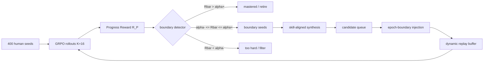

# RODS：把多轮工具 Agent 的数据合成放回 RL 训练闭环

### 元信息

| 字段 | 内容 |
| --- | --- |
| 论文 | RODS: Reward-Driven Online Data Synthesis for Multi-Turn Tool-Use Agents |
| arXiv | [2606.19047v1](https://arxiv.org/abs/2606.19047v1)，提交于 2026-06-17 |
| 方向 | 大模型 Agent / 多轮工具使用 / 后训练 RL / 在线数据合成 |
| 作者 | Ruishan Fang, Siyuan Lu, Chenyi Zhuang, Tao Lin |
| 本文读法 | 按 claim -> mechanism -> evidence -> boundary 复原论文主线，重点看 RODS 如何用训练中已有 reward 统计定位能力边界，并把新数据注入 replay buffer。 |

### TL;DR

- **这篇论文要解决的问题**：多轮工具使用 Agent 做 RL 后训练时，真正稀缺的不是任意数据，而是“当前模型刚好会一半、不会一半”的边界任务；静态 400 条训练 seed 很快会被模型掌握或持续失败，导致有效梯度枯竭。
- **核心方法 RODS**：在 GRPO 已经计算的 `K=16` rollouts 上复用 Progress Reward，按平均奖励把任务分成 mastered、boundary、hard 三类；只从 boundary 区挑 seed，再用多 Agent 合成管线生成结构同构的多轮工具任务，最后通过动态 replay buffer 注入和淘汰样本。
- **最重要的公式直觉**：有界奖励的方差上界由 `mu(1-mu)` 控制，在 `mu≈0.5` 附近最大；论文把它当作 capability boundary 的零额外推理成本探针，而不是另起一个评测器。
- **实验设置**：主实验在 BFCL V3 multi-turn 上做，800 条样本分成 400 train / 400 held-in test；训练 Qwen3-4B-Instruct、Qwen2.5-7B-Instruct、Llama-3.1-8B-Instruct，主线使用 GRPO、三阶段 curriculum、`8xA100` 训练，合成侧使用 Qwen3-32B via vLLM 异步生成。
- **关键数字**：Qwen3-4B 上 RODS 达到 **56.00%** overall，高于 Static dataset 的 **50.00%** 和 EnvTuning 的 **50.50%**；从 400 human seeds 出发，活跃池约 **800** 条，达到接近 FunReason-MT-4B **17K** offline pipeline 的效果，论文称约 **20x** 数据效率。
- **机制证据**：Figure 3 显示边界区 `R_P in [0.25, 0.75]` 的 rollout reward variance 比低奖励或高奖励区高 **2.0-2.2x**；Table 2 消融显示去掉 coherence rewrite 掉 **5.13** 点，random seed selection 掉 **4.75** 点，说明不是“多合成一些”就够。
- **局限**：RODS 依赖可执行模拟环境、结构化工具 API、可计算 progress reward 和可验证轨迹；面对远程 MCP、真实网页、不可重放服务、隐状态环境时，论文只给出未来方向，没有证明同样稳定。

### 研究问题：为什么“数据不够”不是最精确的诊断？

论文开头把多轮工具使用 RL 的困难拆成三个更细的矛盾：

| 记号 | 矛盾 | 在多轮工具 Agent 里的具体表现 | RODS 的回应 |
| --- | --- | --- | --- |
| C1 | 数据稀缺 | BFCL V3 multi-turn 只有 800 条，人工标注和验证多轮 API 依赖链成本高。 | 从 400 条 human seeds 出发，在线生成结构同构变体。 |
| C2 | 静态数据与能力边界错位 | 训练几轮后，部分样本已 mastered，部分样本仍 too hard，二者都不给稳定梯度。 | 用 progress reward 均值和方差定位 boundary seeds。 |
| C3 | 多轮语义不连贯 | 简单拼接单轮 query 会产生没有共同目标、没有指代关系、没有状态传递的轨迹。 | 用 planner narrative、execution feedback、holistic rewrite 和 quality judge 保持多轮 coherence。 |

这个拆分很重要，因为它把“扩大数据规模”的问题改写成“让数据分布跟着策略能力移动”的问题：

- 传统 offline synthesis 解决 C1，但通常在训练前一次性生成大数据；
- EnvTuning 这类方法增强反馈信号，但仍受固定 seed pool 限制；
- zero-data self-play 可以闭环，但多轮工具任务需要 API 拓扑、参数依赖、环境状态和自然语言叙事同时成立，盲生成很容易失真；
- RODS 的位置是：保留少量人类 seed 作为结构锚点，同时让数据生成由 RL 训练中的 reward 统计驱动。

### 论文主张与论证路线

| Claim | Mechanism | Evidence | Boundary |
| --- | --- | --- | --- |
| 多轮工具 RL 的有效梯度集中在能力边界。 | 用 `K=16` rollouts 的 Progress Reward 均值和方差判断任务是否处在 boundary zone。 | Appendix 的 GRPO 方差分析；Figure 3 右图报告边界区方差高 **2.0-2.2x**。 | Popoviciu 给的是上界启发，不是连续 reward 方差的精确定理。 |
| 在线边界合成比固定数据 RL 更有效。 | 从 boundary seeds 生成结构同构变体，并在下一 epoch 注入 active pool。 | Table 1：Qwen3-4B RODS **56.00%**，Static **50.00%**，EnvTuning **50.50%**。 | 控制实验主要在 BFCL V3 multi-turn，环境是可执行模拟器。 |
| 结构同构比简单 paraphrase 更关键。 | 保留 API dependency DAG、参数流、dependency depth，同时替换叙事、实体和环境状态。 | Table 2：去掉 coherence rewrite 掉 **5.13** 点，去掉 narrative planning 掉 **3.63** 点。 | 论文没有证明该流程能覆盖开放网页、真实 SaaS 或远程 MCP 的非确定性状态。 |
| 目标边界数据比盲目扩数据更省样本。 | `Pmax` 从 0 到 400 逐步扩张；池满后按方差优先保留边界样本。 | active pool 约 **800** 条即可接近 **17K** offline pipeline；`Pmax=50` 也有增益。 | 额外使用合成侧 `8xA100`，不是免费扩展。 |

### 方法机制：RODS 的三个循环

RODS 可以看成一个双闭环系统：



#### 1. Reward-Based Seed Data Detection

论文对每个任务 `x_i` 计算多次 rollout 的平均 progress reward：

```text
给定 K 个 rollout：
  R_P(y_1), R_P(y_2), ..., R_P(y_K)

平均奖励：
  rbar_i = mean_k R_P(y_k)

数据分区：
  D_mastered = {x_i : rbar_i > alpha+}
  D_boundary = {x_i : alpha- <= rbar_i <= alpha+}
  D_hard     = {x_i : rbar_i < alpha-}
```

默认阈值来自正文和 appendix：

| 参数 | 值 | 作用 |
| --- | ---: | --- |
| `alpha-` | 0.20 | boundary 下界，低于它被视为太难或短期无效。 |
| `alpha+` | 0.85 | boundary 上界，高于它接近 mastered。 |
| `alpha+_retire` | 0.95 | replay buffer 淘汰 mastered data 的阈值。 |
| `Pmax` | 400 | generated items 的最大活跃容量。 |
| `beta` | 20% | 每个 epoch 最多注入 active pool 的比例，防止分布冲击。 |

论文还用了一个更直接的排序函数：

```text
phi(rbar_i) = 4 * rbar_i * (1 - rbar_i)
```

变量解释：

- `phi` 在 `rbar_i=0.5` 达到最大；
- 当任务总是成功或总是失败时，`phi` 变小；
- 这不是额外模型打分，而是复用 GRPO 已经需要的 rollout reward；
- 论文称它是 zero-cost boundary detector，因为不增加额外 inference。

#### 2. Skill-Aligned Data Synthesis

合成管线不是把 query 改写成另一句话，而是先抽出 seed 的复杂度剖面：

```text
Phi(x_seed) = {
  API topology,
  dependency depth,
  parameter flow,
  number of turns,
  missing-function / missing-parameter / long-context type,
  cross-turn coreference pattern
}

目标：
  x' ~ p(. | Phi(x_seed))
  使 Phi(x') 近似 Phi(x_seed)，但 narrative、实体和环境状态不同。
```

五个阶段可以这样读：

| 阶段 | 模块 | 做什么 | 为什么必要 |
| --- | --- | --- | --- |
| I | Schema-guided planning | Planner Agent 根据 seed 和 API graph 选择新函数序列，并生成统一 narrative。 | 保留结构难度，避免随机选 API。 |
| II | Feedback-driven execution | Execution Orchestrator 在模拟环境里执行计划；Error Critic 最多 `Kmax=3` 次修补环境配置。 | 确保轨迹可执行，而不是只像工具调用。 |
| III | Holistic semantic grounding | Rewrite Agent 一次性重写全轨迹 query。 | 解决多轮对话的指代、目标和上下文连贯性。 |
| IV | Critique and refinement | Rule checks + LLM quality judge；不合格样本进入 rewrite feedback loop。 | 提高可用率，降低语义错配。 |
| V | Optional adversarial augmentation | 注入 missing tools、blurred parameters 等结构异常。 | 迫使 Agent 学会澄清和处理 OOD 情况。 |

这套设计里最值得注意的是“叙事先于 query”：

- Planner 先给出全局 narrative；
- 每一轮 query 都围绕同一个用户目标展开；
- 工具调用链先在环境中被验证；
- 自然语言只是轨迹的表面形式，不承担执行正确性的最终判断。

#### 3. Dynamic Replay Buffer Management

RODS 不把所有合成数据永久加入训练集，而是把 active pool 当成随策略移动的窗口：

```text
for each epoch n:
  1. 用当前策略 rollout active pool
  2. 选 boundary seeds
  3. 后台生成 variants，放入 candidate queue
  4. 到 epoch n+1 开始时按 beta 上限注入
  5. 对新样本 burn-in filtering
  6. 对 mastered / too-hard / stale samples retire
  7. 若超过 Pmax，按 phi(rbar) 保留高方差样本
```

这个机制对应两类风险：

- **注入过快**：新分布突然改变，GRPO 梯度不稳定；
- **保留过久**：旧样本变成 mastered 或 hard，稀释边界样本比例。

Appendix 的工程实现还补了两个生产细节：

- 生成 daemon 与训练 loop 通过文件系统 IPC 和文件锁隔离；
- `tracker.json` 和 `expanded_epoch_*.jsonl` 允许 crash recovery，重启后可重建 PromptTracker、合成数据和淘汰逻辑。

### 实验设置：证据到底来自哪里？

| 维度 | 设置 |
| --- | --- |
| 主 benchmark | BFCL V3 multi-turn |
| 数据划分 | 800 samples，400 train / 400 held-in eval，每类 100 train |
| 任务类型 | Base、Missing Function、Missing Parameter、Long-Context |
| OOD benchmark | BFCL V4、tau2-bench、ACEBench Agent |
| 训练模型 | Qwen3-4B-Instruct、Qwen2.5-7B-Instruct、Llama-3.1-8B-Instruct |
| 训练算法 | GRPO，`K=16` rollouts |
| 训练硬件 | `8xA100` |
| 合成模型 | Qwen3-32B via vLLM，单独 `8xA100` 异步运行 |
| Curriculum | Stage 1 format reward；Stage 2 base reasoning；Stage 3 full data + expansion |
| 主 baseline | Static dataset、EnvTuning |
| 数据规模参考 | FunReason-MT-4B，17K offline trajectories |

Progress Reward 的定义是：

```text
R_P = (1 / N) * sum_{t=1..N} (r_t^state * r_t^exec)
```

变量解释：

- `N`：多轮任务的 turn 数；
- `r_t^state`：第 `t` 轮所需状态是否正确；
- `r_t^exec`：工具执行是否正确；
- `R_P`：把“整题是否成功”的稀疏二值奖励，改成“完成了多少轮”的连续 credit；
- ground truth 只用于模拟环境 reward，不暴露给 policy。

### 主结果：RODS 比固定数据和环境增强强在哪里？

Table 1 的核心结果可以压缩成下面这张表：

| 模型 | Base model | Static dataset | EnvTuning | RODS | RODS 相对 Static | RODS 相对 EnvTuning |
| --- | ---: | ---: | ---: | ---: | ---: | ---: |
| Qwen2.5-7B-Instruct | 7.00 | 36.92 | 37.75 | 40.25 | +3.33 | +2.50 |
| Llama-3.1-8B-Instruct | 5.48 | 28.25 | 28.38 | 30.88 | +2.63 | +2.50 |
| Qwen3-4B-Instruct | 22.13 | 50.00 | 50.50 | **56.00** | **+6.00** | **+5.50** |

Qwen3-4B 的分项结果也能说明增益不是只来自某一类任务：

| Split | Base model | Static | EnvTuning | RODS |
| --- | ---: | ---: | ---: | ---: |
| Base | 26.50 | 62.00 | 64.00 | **68.00** |
| Missing Function | 21.00 | 51.00 | 52.00 | **59.00** |
| Missing Parameter | 15.50 | 35.00 | 35.00 | **44.00** |
| Long Context | 25.50 | 52.00 | 51.00 | **53.00** |

这组数字支持两个较强但不同层次的结论：

- 在同样 400 seed、同样 GRPO 配置下，边界数据扩张比只用静态 seed 更有效；
- RODS 和 EnvTuning 不是同一种策略：EnvTuning 强化反馈，RODS 扩张数据分布；RODS 的领先说明“边界附近的新任务”提供了固定 seed 无法提供的梯度。

但也要注意：

- GPT-4o 和 DeepSeek-V3.2-Exp 是 reference，不是同规模训练 baseline；
- FunReason-MT-4B 用 17K offline trajectories，不能和 RODS 做完全公平的训练成本对比；
- 论文主张的强证据应主要来自 Tier 1 controlled RL comparisons，而不是跨模型榜单排名。

### Figure/Table 证据怎么读？

#### Figure 1：问题定义图

Figure 1 的作用不是展示实验结果，而是把论文的研究问题固定下来：

| 子图 | 论文想让读者看到什么 | 对方法设计的约束 |
| --- | --- | --- |
| a | 高质量多轮数据稀缺。 | 不能假设先有百万级人类轨迹。 |
| b | 静态数据会被能力提升耗尽。 | 数据选择必须随训练动态变化。 |
| c | 单轮 query 拼接会语义断裂。 | 合成必须保持全局 narrative 和 API dependency。 |
| d | RODS 是闭环数据 engine。 | reward、synthesis、buffer 必须互相反馈。 |

#### Figure 2：方法架构图

Figure 2 的关键不是“用了多个 Agent”，而是三条控制链：

- **训练链**：agent -> rollout -> progress reward -> GRPO update；
- **合成链**：boundary seed -> planner -> execution orchestrator -> rewrite -> judge；
- **生命周期链**：candidate queue -> epoch injection -> burn-in -> retire/prune。

如果缺少任意一条，RODS 会退化：

- 没有训练链，只是 offline data generator；
- 没有合成链，只是 hard-example replay；
- 没有生命周期链，会把 mastered/hard/stale data 堆满 buffer。

#### Figure 3：机制验证图

论文最关键的机制证据来自 Figure 3：

| Panel | 证据点 | 支持的 claim | 不能证明什么 |
| --- | --- | --- | --- |
| Left | 系统持续生成 active boundary data，同时淘汰 mastered data，突破 400 static capacity。 | active pool 是移动窗口，不是一次性扩容。 | 不能单独说明新数据质量高。 |
| Middle | 新注入 variant 的 mean progress reward 落在 `[0.25, 0.75]`。 | 合成数据确实贴近 boundary，而不是太简单或太难。 | 不能保证 OOD 真实环境也同样可控。 |
| Right | 4,800 个 per-task measurement 中，boundary zone variance 高 **2.0-2.2x**。 | reward variance 是有经验支持的 boundary proxy。 | 仍不是严格证明所有连续 reward 都满足最大方差在 0.5。 |

#### Table 2：消融表

| 消融 | Avg. | 相对 full system 变化 | 说明 |
| --- | ---: | ---: | --- |
| RODS full system | **56.00** | - | 完整边界检测 + 合成 + buffer 生命周期。 |
| random seed selection | 51.25 | -4.75 | 不是“随便扩数据”就能得到主结果。 |
| binary acc instead of progress reward | 52.75 | -3.25 | 连续 partial credit 比二值成败更适合找边界。 |
| w/o coherence rewrite | 50.87 | -5.13 | 多轮语义连贯性是最大单点贡献之一。 |
| w/o narrative planning | 52.37 | -3.63 | 全局目标和跨轮依赖不能靠局部 query 拼接。 |
| w/o feedback loop | 53.87 | -2.13 | 执行/语义错误反馈能提升可用样本。 |
| w/o retirement mechanism | 52.62 | -3.38 | mastered data 堆积会稀释梯度。 |
| static pool no dynamic refresh | 53.12 | -2.88 | 只生成一批不随训练移动，效果会下降。 |

Table 2 的最大价值是把 RODS 的“在线闭环”拆成可检验部件：

- boundary selection 有贡献；
- progress reward 的细粒度有贡献；
- semantic rewrite 有贡献；
- retirement 有贡献；
- 合成模型本身不是唯一解释，因为 Appendix M 把 Qwen3-32B 换成 GLM-4.5-Air，只下降 **0.75** 点。

### 数据效率：20x 这个数应该怎么理解？

论文的说法是：

```text
RODS:
  400 human seeds + up to Pmax=400 generated active variants
  active training pool ~= 800

FunReason-MT-4B:
  17K offline trajectories

Data ratio:
  17,000 / 800 ~= 21.25
```

这就是“约 20x fewer trajectories”的来源。

但研究者读这个数时应该拆成两层：

| 层次 | 可以说 | 不宜过度推出 |
| --- | --- | --- |
| 样本效率 | 目标边界合成的每条样本训练价值高于均匀扩数据。 | RODS 总计算成本一定低于 offline synthesis。 |
| 训练效率 | active pool 小，RL loop 不需要吞 17K 轨迹。 | 合成 sidecar 的 `8xA100` 成本可以忽略。 |
| 机制效率 | `Pmax=50` 已有增益，`Pmax=200` 后边际收益递减。 | 任何任务上都能用 800 条替代 17K。 |

Appendix N 给出的边界更诚实：

- 合成管线会把 GPU footprint 约翻倍；
- seed-to-variant synthesis latency 约 1 training step；
- 等待 epoch boundary 的 staging delay 约 13 steps；
- 在该异步窗口内，pass@16 平均变化小于 0.10，所以新样本仍大致留在原边界区。

### 与相关工作的关系：RODS 到底新在哪里？

| 相关路线 | 典型思想 | 与 RODS 的关系 |
| --- | --- | --- |
| APIGen-MT / FunReason-MT 等 offline synthesis | 先生成大量多轮工具轨迹，再训练。 | RODS 反对一次性大规模静态分布，强调训练中动态合成。 |
| EnvTuning | 给失败样本提供可操作环境反馈。 | RODS 不改反馈机制，而是换数据分布；两者在 Appendix I 被视为可互补。 |
| self-play / self-evolution | 从零生成任务并自我提升。 | RODS 不完全从零开始，而是用 human seed 保持结构锚点。 |
| prioritized replay / hard example mining | 选择更有训练价值的已有样本。 | RODS 不只选择，还在 boundary 上生成新样本。 |
| curriculum learning | 按模型能力安排难度。 | RODS 的 curriculum 不是预设难度表，而是由 reward variance 实时估计。 |

第三方精确解读方面，本轮搜索了：

- `"RODS: Reward-Driven Online Data Synthesis"`
- `"Reward-Driven Online Data Synthesis" "RODS" -arxiv`
- `"RODS" "Qwen3-4B" "BFCL V3"`

搜索结果没有找到独立博客或作者补充解读；因此本文主要依赖 arXiv 摘要、HTML 全文、TeX source 和论文引用的相关路线做分析。

### 失败案例与边界：RODS 可能在哪些地方失效？

#### 1. 需要可执行模拟器

RODS 的 correctness guarantee 来自一个强假设：

- 生成侧 simulation environment 是训练 environment 的 faithful replica；
- 轨迹在 simulation environment 成功执行，就能在训练时无环境级错误；
- ground truth 和状态转移可以被确定性重放。

这在 BFCL 类函数调用任务中合理，但在真实 Agent 场景中会变难：

- 远程 MCP server 可能有隐状态、速率限制、权限变化；
- SaaS API 可能有非确定性返回和不可逆副作用；
- 网页环境可能因为布局、登录、弹窗、A/B test 改变；
- 安全场景里，攻击面本身可能不允许任意重放。

#### 2. 依赖 reward 可分解

RODS 的 boundary detector 需要 `R_P` 这样的 progress reward。

如果任务只有终局成功/失败，并且无法验证中间 turn：

- `rbar` 会更噪；
- boundary 区会更难稳定识别；
- binary acc 消融的下降说明，细粒度 partial credit 对结果有实质贡献。

#### 3. 多 Agent 合成可能引入分布偏见

论文用 Quality Judge 和 feedback loop 控制样本质量，但合成管线仍可能偏向：

- planner 熟悉的 API 结构；
- rewrite agent 偏好的叙事模板；
- simulation environment 覆盖到的状态空间；
- quality judge 容易接受的表面连贯性。

Table 2 证明这些模块有效，但没有证明它们覆盖真实用户多样性。

#### 4. 成本并不只看样本数

RODS 的样本数少，但系统更复杂：

- 训练端 `8xA100`；
- 合成端另有 `8xA100`；
- 需要异步队列、文件锁、crash recovery；
- 需要 executor、critic、judge、rewrite 的工程化配合。

因此 RODS 更像“用工程闭环换数据效率”，不是简单的轻量训练 recipe。

### 研究者视角：这篇论文真正值得带走什么？

RODS 最有启发的地方，是把多轮工具 Agent 的后训练问题从“缺数据”推进到了“缺跟随能力边界移动的数据”。

这对 Agent 训练有三个后续问题：

1. **从 reward-driven data selection 到 reward-driven environment design**
   - RODS 当前主要生成任务变体；
   - 下一步可以问：环境本身能否被动态改写，使 Agent 遇到更接近真实失败边界的状态？

2. **从 BFCL-style deterministic tools 到 MCP/remote tools**
   - 论文在 conclusion 里点出 MCP server 仍是未来工作；
   - 真正难点不是把 prompt 接到 MCP，而是怎样安全捕获 input-observation dynamics，同时不读写不可控真实状态。

3. **从单一 progress reward 到多目标安全 reward**
   - 对 AI safety/AI for security，Agent 不只是要完成任务；
   - 它还要满足权限边界、数据最小化、不可破坏性、日志可审计等约束；
   - RODS 的 boundary detector 可以扩展成多维 frontier，例如：

```text
boundary_score(x) =
  w_task   * phi(R_task)
+ w_safe   * phi(R_safety)
+ w_perm   * phi(R_permission)
+ w_trace  * phi(R_auditability)
```

变量解释：

- `R_task`：任务完成进度；
- `R_safety`：是否触发危险动作、越权访问、隐私泄露；
- `R_permission`：是否遵守工具授权边界；
- `R_auditability`：轨迹是否可解释、可追溯；
- `phi(.)`：类似 RODS 的边界方差代理。

这会把“能力边界”升级为“能力-安全联合边界”：

- 太简单的安全样本没有训练价值；
- 太难或不可判定的攻击样本会变成噪声；
- 最值得合成的是模型有时安全、有时越界的区域。

### 结论

RODS 的核心贡献不是提出又一个多 Agent 数据生成器，而是把数据生成的触发条件绑定到 RL 训练过程中的 reward variance。

它的强证据来自：

- 同 400 seed、同 GRPO 配置下超过 Static dataset 和 EnvTuning；
- Qwen3-4B 上达到 **56.00%** BFCL V3 multi-turn overall；
- active pool 约 **800** 条时接近 **17K** offline pipeline；
- Figure 3 证明边界区 variance 更高；
- Table 2 证明 boundary detection、coherence rewrite 和 retirement 都是必要部件。

它的边界也同样清楚：

- 需要可执行、可验证、可重放的工具环境；
- 需要 progress reward 或类似 partial credit；
- 需要额外合成算力和系统工程；
- 还没有证明能直接迁移到开放网页、远程 MCP 或真实安全操作场景。

因此，RODS 更适合作为一种研究范式来读：

- **不要只问数据够不够；要问数据是否还处在当前策略的学习边界上。**
- **不要只问合成质量高不高；要问合成数据是否仍保留原任务的结构难度。**
- **不要只问样本数少不少；要把 replay lifecycle、验证 oracle 和合成成本一起算进去。**
