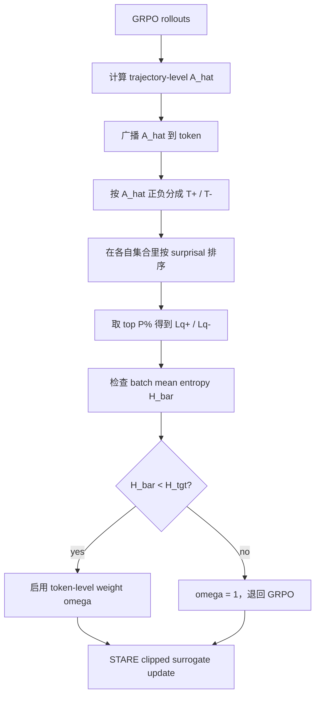
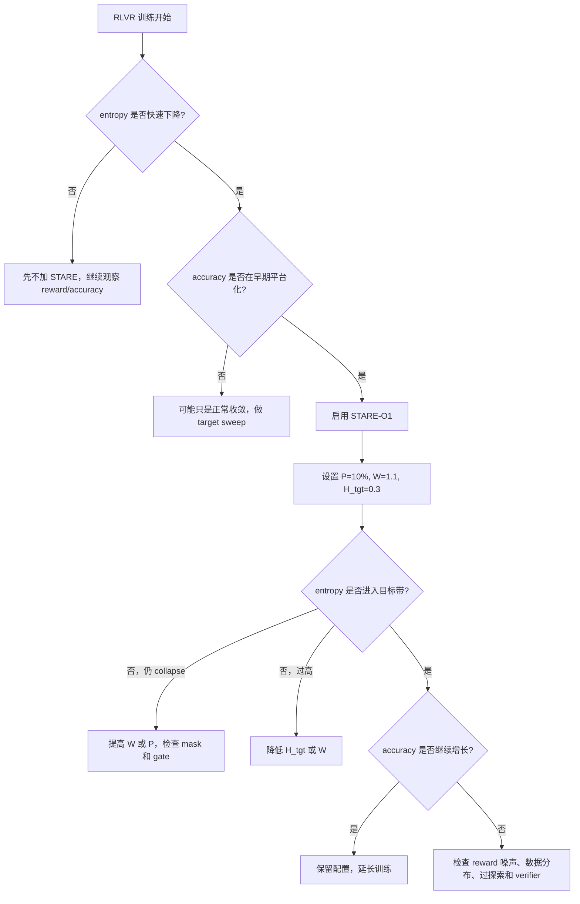

# STARE：用 token-level surprisal 重配 GRPO 的熵信用

## 元信息

| 字段 | 内容 |
| --- | --- |
| 论文 | STARE: Surprisal-Guided Token-Level Advantage Reweighting for Policy Entropy Stability |
| 方向 | 大模型后训练 / RLVR / GRPO / reasoning model |
| 原文 | https://arxiv.org/abs/2606.19236 |
| 代码 | https://github.com/hp-luo/STARE |
| arXiv 版本 | 2606.19236v1，2026-06-17 发布 |
| 机构 | Tsinghua SIGS / Tencent Hunyuan |
| 读法 | 先看 entropy collapse 的机制，再看 STARE 如何最小侵入地改 GRPO |

### TL;DR

- STARE 解决的是 GRPO/RLVR 长步训练里的 __policy entropy collapse__：训练早期 entropy 快速接近 0，rollout 变同质，group-relative advantage 失效，模型过早收敛。
- 作者从一阶梯度推导出 token-level entropy variation：每个 token 对 entropy 的影响不是只由轨迹级 advantage 决定，而是 `-A_hat * Phi(p)`，其中 `Phi(p)` 是由 next-token distribution 决定的 entropy sensitivity。
- 这个分解给出 advantage-surprisal 四象限：正 advantage 的低 surprisal token 会降低 entropy，正 advantage 的高 surprisal token 会提高 entropy；负 advantage 侧有镜像关系。
- GRPO 的问题是把同一个 trajectory-level advantage 广播给整条 response，无法区分这些 token-level entropy 效应；低 surprisal token 更常被采样，于是 entropy-decreasing majority 主导更新。
- STARE 的修复方式很小：在 GRPO clipped surrogate 里给 entropy-critical token 乘权重 `omega`。默认 O1 只放大正 advantage 且高 surprisal 的 token，C2 还会削弱负 advantage 且高 surprisal 的 token。
- 实现上不用精确求每个位置的理论临界 `s*`，而是在正/负 advantage token 集合里按 batch-internal surprisal 排序，取 top `P%`；默认 `P=10%`、`W=1.1`、`M=0.9`、`H_tgt=0.3`。
- 闭环 gate 是关键：当 batch mean entropy 低于 `H_tgt` 才开启 reweighting；恢复到目标带后权重回到 1，避免 open-loop reweighting 造成过探索。
- 证据覆盖 1.5B 到 32B、Short CoT / Long CoT / Multi-Turn Tool Use 三类任务；在 AIME24/AIME25 上比 DAPO 和强 baseline 平均高 4%-8%，7B Short CoT 的平均分从 GRPO-ds 49.1 到 STARE-O1 54.4。
- 局限也明确：主要验证数学推理和工具使用训练，默认超参仍依赖目标 entropy，reflection token 分析是启发式统计，超长任务、多领域奖励和非数学 verifier 还需要继续验证。

## 统一候选表与本轮 pivot

| 排名 | category_id | 候选 | 时间证据 | 状态 |
| ---: | --- | --- | --- | --- |
| 1 | ai-safety | CodeSentinel, arXiv:2606.19235v1 | 2026-06-17T16:12:50Z | 发布阶段发现并发重复，丢弃 |
| 2 | llm-post-training | **STARE**, arXiv:2606.19236v1 | 2026-06-17T16:13:42Z | **选中** |
| 3 | llm-agent | Data Intelligence Agents, arXiv:2606.19319v1 | 2026-06-17T17:45:32Z | 未选 |
| 4 | ai-safety | PhantomSkill, arXiv:2606.19191v1 | 2026-06-17T15:33:41Z | 未选 |
| 5 | ai-safety | TRAP, arXiv:2606.18996v1 | 2026-06-17T12:17:02Z | 未选 |

本轮先选 CodeSentinel，但发布脚本以 `external_id` 检测到它已由并发 run 写入 `itm_06c34706898687e3`。

- 没有手工改 `known-links`；
- 没有复用重复 payload；
- 直接在同一 Scout 表里 pivot 到后训练候选 STARE；
- STARE 没有在当前 public 中独立发布，只在 CodeSentinel 的候选表中被提及。

## 研究问题：GRPO 为什么会 entropy collapse？

### 论文关注的不是“加熵奖励”这么简单

RLVR 已经成为 reasoning model 后训练的主路线。

- verifier 给出可验证 reward；
- GRPO 用 group-normalized rewards 估 advantage；
- 不需要 value network；
- 在数学、代码、工具使用中都常见。

但长步训练会出现一个瓶颈：

| 现象 | 训练后果 |
| --- | --- |
| policy entropy 快速下降 | rollout 多样性消失 |
| within-group responses 趋同 | group relative advantage 变弱 |
| 正确但稀有的探索 token 被稀释 | 后续训练无法打开新推理路径 |
| 训练准确率早早平台化 | 长程 RL 潜力被截断 |

现有方法有三类：

1. 调 clip threshold，例如 DAPO 的 clip-higher；
2. 对正负 trajectory 做非对称加权；
3. 加 entropy-aware advantage 或 entropy regularization。

作者认为这些方法都偏粗：

- clip 在 on-policy ratio 接近 1 时经常不活跃；
- trajectory-level weighting 看不到同一 response 内 token 的相反熵效应；
- entropy regularization 容易震荡或对超参敏感。

### 核心问题被改写为 token-level credit assignment

GRPO 给一条 response 的所有 token 广播同一个 `A_hat_i`。

问题是：

- 有些 token 在被强化时会让分布更尖；
- 有些 token 在被强化时会让分布更散；
- 同一个 trajectory advantage 无法区分这两类 token。

所以 STARE 的核心问法是：

```text
哪些 token 真正推动 entropy collapse？
需要多小的 token-level 权重扰动，才能把 entropy 变化方向翻转？
```

## 理论路线：从 entropy 梯度到四象限

### GRPO objective 与 token surprisal

论文从 GRPO clipped surrogate 出发：

```text
J_GRPO(theta) = (1/N) sum_i sum_t min(
  rho_i,t(theta) * A_hat_i,
  clip(rho_i,t(theta), 1-eps, 1+eps) * A_hat_i
)
```

关键变量：

| 符号 | 含义 |
| --- | --- |
| `rho_i,t` | 当前策略和 old policy 在 token 位置的 importance ratio |
| `A_hat_i` | 第 i 条 rollout 的 group-normalized trajectory advantage |
| `N` | batch 中所有 response token 总数 |
| `s_v = -ln pi_v` | token surprisal |
| `H = E_pi[s]` | next-token distribution entropy |

在 unclipped regime 中，采样 token `a` 的 logit 更新可写成：

```text
Delta z_v = eta * A_hat * (1[v=a] - pi_v)
```

### Lemma：熵对 logit 的梯度

论文先证明：

```text
dH / dz_v = pi_v * (s_v - H)
```

解释：

- 如果某 token 的 surprisal 高于平均 entropy，提高它的 logit 会增加 entropy；
- 如果某 token 的 surprisal 低于平均 entropy，提高它的 logit 会降低 entropy；
- 这把“稀有 token 是否该被强化”变成可计算的局部问题。

### Theorem：token-level entropy variation

作者定义：

```text
S2 = sum_v pi_v^2 * (ln pi_v + H)
Phi(p) = p * (ln p + H) - S2
```

得到核心公式：

```text
dH/deta | eta=0 = - A_hat * Phi(p)
```

变量解释：

| 变量 | 含义 | 作用 |
| --- | --- | --- |
| `p = pi(a | c)` | 当前采样 token 的概率 | 决定 token 是否高 surprisal |
| `Phi(p)` | entropy sensitivity | 决定强化该 token 对 entropy 的方向 |
| `A_hat` | 轨迹级 advantage | 决定 GRPO 是强化还是压低该 token |

这个公式是全文的理论支点。

### 为什么 `Phi(p)` 比直接看 token probability 更有信息？

如果只看 `p`，我们只能说 token 罕见或常见。

但 entropy 变化还取决于整个 next-token distribution。

`Phi(p)` 把两件事合在一起：

| 组成 | 解释 |
| --- | --- |
| `p * (ln p + H)` | 采样 token 本身相对当前 entropy 的偏离 |
| `S2` | 分布整体的二阶基线项 |
| `Phi(p)` | 当前 token 强化后对分布集中或分散的边际影响 |

这让论文避免一个常见误区：

- 高 surprisal token 不一定总该强化；
- 低 surprisal token 不一定总该压低；
- 它们要和 advantage sign 一起看。

从研究角度看，这一步把“熵下降”从训练曲线现象还原成 token-level gradient accounting。

### near-criticality 为什么重要？

论文证明 batch-level reweighting 存在临界权重：

```text
W* = 1 + Lambda / Gamma
```

其中：

- `Lambda` 是未加权时 batch entropy gradient 的残差；
- `Gamma` 是正 advantage 高 surprisal token 集合的 entropy-increasing 强度；
- 当 `W > W*`，batch mean entropy 的变化方向可以被翻转。

near-criticality 的含义是：

```text
W* - 1 = O(T^-1)
```

也就是说，在序列足够长、batch 足够大时，不需要大幅改 loss 权重。

这解释了为什么 `W=1.1` 能工作：

- 它不是强行把训练改成 entropy maximization；
- 它只是把被 trajectory-level advantage 稀释的少数探索 token 往回拉；
- 超过临界点后，`W` 更多控制步长大小，而不是方向。

这也解释了为什么 `W>=2.0` 会出问题：

- 方向虽对；
- 幅度过强；
- open-loop 下容易从 collapse 走向 divergence 或 over-exploration。

### 四象限：为什么正样本也会降低 entropy？

根据 `sign(A_hat)` 与 token surprisal，可得到四种情况：

| Advantage | Surprisal | entropy 变化 | 直觉 |
| --- | --- | --- | --- |
| `A_hat > 0` | low surprisal | 降低 | 正样本里常见 token 被继续强化，分布更尖 |
| `A_hat > 0` | high surprisal | 增加 | 正样本里的少数探索 token 被强化，分布更宽 |
| `A_hat < 0` | low surprisal | 增加 | 压低常见错误 token，释放概率质量 |
| `A_hat < 0` | high surprisal | 降低 | 压低稀有错误 token，尾部更弱 |

GRPO collapse 的关键不在于“正 advantage 不好”，而在于：

- 正 advantage trajectory 中，低 surprisal token 被采样得更多；
- 这些 token 恰好是 entropy-decreasing majority；
- 高 surprisal token 虽然能维持探索，但数量少，贡献被平均掉。

## 方法：STARE 如何改 GRPO？

### 总体机制



### entropy-critical token partition

精确求每个位置的 critical threshold `s*` 很贵，因为要看完整 vocabulary distribution。

STARE 用一个可实现 proxy：

```text
L^± = {
  (i,t) in T^±:
  s_i,t >= Q_P({s_j,s in T^±})
}
```

含义：

- `T+` 是正 advantage token 集合；
- `T-` 是负 advantage token 集合；
- 在每个集合内部按 surprisal 排序；
- 取 top `P%` 作为 entropy-critical tokens。

默认 `P=10%`。

### O1：默认的一侧放大

默认 STARE-O1 只干预 `Lq+`：

```text
omega_i,t = W, if (i,t) in Lq+
omega_i,t = 1, otherwise
```

其中 `W > 1`，默认 `W=1.1`。

为什么只放大 `Lq+`？

- 它对应“正 advantage + 高 surprisal”；
- 这类 token 是正确 rollout 里的探索分叉；
- 放大它们能抵消低 surprisal majority 对 entropy 的压缩。

### C2：两侧调节

STARE-C2 还会处理 `Lq-`：

```text
omega_i,t = W, if (i,t) in Lq+
omega_i,t = M, if (i,t) in Lq-
omega_i,t = 1, otherwise
```

默认 `M=0.9`。

含义：

- 放大正 advantage 的高 surprisal token；
- 同时削弱负 advantage 的高 surprisal token 被压低的力度；
- 两者都在减少 entropy-decreasing pressure。

### target-entropy closed-loop gate

open-loop reweighting 可能从 collapse 直接推到 over-exploration。

STARE 加一个二值 gate：

```text
g_k = 1[H_bar_k < H_tgt]
```

权重统一写成：

```text
omega_i,t =
  1 + g_k * (W - 1), if (i,t) in Lq+
  1 - g_k * (1 - M), if (i,t) in Lq- and using C2
  1, otherwise
```

这使 STARE 有两个状态：

| batch entropy | 动作 |
| --- | --- |
| `H_bar < H_tgt` | 启动 reweighting，恢复探索 |
| `H_bar >= H_tgt` | 权重回 1，恢复标准 GRPO |

默认 `H_tgt=0.3`。

### 伪代码

```text
Input:
  policy pi_theta
  prompts D
  group size G
  GRPO clip epsilon
  top ratio P
  reweight W
  target entropy H_tgt

For each RL step k:
  Roll out G responses per prompt
  Compute rewards and group-normalized trajectory advantage A_hat
  Broadcast A_hat to every response token

  Compute batch token entropy H_i,t and batch mean H_bar
  gate = 1 if H_bar < H_tgt else 0

  If gate == 1:
    Split tokens into T+ where A_hat > 0 and T- where A_hat < 0
    Compute token surprisal s_i,t = -ln pi(o_i,t | context)
    Select top P% high-surprisal tokens in T+ as Lq+
    Optionally select top P% high-surprisal tokens in T- as Lq-
  Else:
    Lq+ = empty
    Lq- = empty

  Set omega:
    omega = W on Lq+
    omega = M on Lq- if using C2
    omega = 1 elsewhere

  Optimize:
    J_STARE = (1/N) sum omega_i,t * clipped_GRPO_term_i,t

Output:
  trained policy
```

## 实验设置

### 模型、任务和训练配置

| 维度 | 设置 |
| --- | --- |
| Short CoT | Qwen2.5-Math-7B-Base, Qwen2.5-14B-Instruct, Qwen2.5-32B-Base |
| Long CoT | DeepSeek-R1-Distill-Qwen-1.5B, Qwen3-8B-Base |
| Tool-use Agent | Qwen2.5-7B-Base + Retool 2K cold-start SFT |
| 最大长度 | Short CoT 4k/8k，Long CoT 16k，tool-use 8k |
| 学习率 | `1e-6` |
| batch | 64 samples，每个 sample 8 rollouts |
| 更新 | on-policy，single gradient step per batch |
| 解码 | top-p 1.0，temperature 1.0 |
| 训练数据 | DeepScaler, Skywork-o1, Polaris, DAPO 等混合去重 100k |
| 默认 STARE | O1, `W=1.1`, `M=0.9`, `H_tgt=0.3`, `P=10%` |

### 评测集

| Benchmark | 采样 |
| --- | --- |
| AIME24 | avg@32 |
| AIME25 | avg@32 |
| AMC23 | avg@32 |
| MATH-500 | avg@4 |
| Minerva Math | avg@4 |
| OlympiadBench | avg@4 |

## 主结果：STARE 是否真的提升？

### Short CoT：7B、14B、32B 都有收益

| Base | Method | AIME24 | AIME25 | Avg |
| --- | --- | ---: | ---: | ---: |
| Qwen2.5-Math-7B | GRPO-ds | 37.1 | 17.7 | 49.1 |
| Qwen2.5-Math-7B | STARE-O1 | 44.2 | 23.8 | 54.4 |
| Qwen2.5-Math-7B | STARE-C2 | 42.9 | 24.2 | 54.5 |
| Qwen2.5-14B | GRPO-ds | 24.2 | 21.9 | 46.1 |
| Qwen2.5-14B | STARE-O1 | 30.8 | 27.1 | 52.0 |
| Qwen2.5-14B | STARE-C2 | 31.5 | 28.3 | 52.3 |
| Qwen2.5-32B | GRPO-ds | 38.5 | 28.8 | 56.1 |
| Qwen2.5-32B | STARE-O1 | 43.3 | 34.1 | 60.7 |
| Qwen2.5-32B | STARE-C2 | 42.9 | 35.7 | 61.4 |

解读：

- 7B 上平均分从 49.1 到 54.4/54.5；
- 14B 上从 46.1 到 52.0/52.3；
- 32B 上从 56.1 到 60.7/61.4；
- AIME25 这种更难集合上收益尤其明显。

### Long CoT：1.5B 和 8B 也有效

| Base | Method | AIME24 | AIME25 | Avg |
| --- | --- | ---: | ---: | ---: |
| DeepSeek-R1-Distill-Qwen-1.5B | GRPO-ds | 50.4 | 37.4 | 62.5 |
| DeepSeek-R1-Distill-Qwen-1.5B | STARE-O1 | 53.8 | 41.5 | 65.9 |
| DeepSeek-R1-Distill-Qwen-1.5B | STARE-C2 | 53.1 | 40.5 | 66.3 |
| Qwen3-8B-Base | GRPO-ds | 39.5 | 30.8 | 58.5 |
| Qwen3-8B-Base | STARE-O1 | 43.9 | 34.7 | 62.0 |
| Qwen3-8B-Base | STARE-C2 | 44.3 | 32.6 | 62.2 |

论文报告一个重要训练动态：

- GRPO-ds 在 0-1000 步 entropy collapse；
- AIME24/25 accuracy 在 1000 步附近平台化；
- STARE 把 entropy 稳在 `H_tgt=0.3` 附近；
- accuracy 能继续增长到 5000 步。

### Tool-use Agent：不只数学 CoT 有收益

| Base | Method | AIME24 | AIME25 | Avg |
| --- | --- | ---: | ---: | ---: |
| Qwen2.5-7B-Base + Retool SFT | GRPO-ds | 46.8 | 32.4 | 53.9 |
| Qwen2.5-7B-Base + Retool SFT | STARE-O1 | 53.2 | 37.5 | 59.4 |
| Qwen2.5-7B-Base + Retool SFT | STARE-C2 | 52.8 | 38.1 | 60.4 |

这点让 STARE 和 Agent 方向也相关：

- tool-use 场景里，模型需要维持探索和长程分支；
- entropy collapse 会让工具调用策略变窄；
- STARE 的 token-level reweighting 在这种多轮工具任务上仍有收益。

## 消融：哪些设计真的必要？

### O1 和 C2 为什么成为主版本？

| Variant | AIME24 | AIME25 | 解释 |
| --- | ---: | ---: | --- |
| GRPO-ds | 37.1 | 17.7 | baseline |
| STARE-O1 | 44.2 | 23.8 | 放大正 advantage 高 surprisal token |
| STARE-O2 | 40.5 | 20.3 | 削弱正 advantage 低 surprisal token |
| STARE-O3 | 39.6 | 21.6 | 放大负 advantage 低 surprisal token |
| STARE-O4 | 42.1 | 19.9 | 削弱负 advantage 高 surprisal token |
| STARE-C1 | 43.1 | 23.5 | 两个 entropy-increasing quadrant |
| STARE-C2 | 42.5 | 24.2 | O1 + 弱化负侧高 surprisal |
| STARE-C3 | 39.9 | 20.8 | 低 surprisal 双侧调节 |
| STARE-C4 | 41.7 | 22.6 | 双侧削弱 entropy-decreasing |

所有 STARE 变体都高于 GRPO-ds，说明四象限分析不是单点巧合。

### 四象限操作的更细解释

论文附录把四个单象限操作写成 O1-O4。

可以按“强化谁、削弱谁”来理解：

| 操作 | 目标 token | 权重方向 | 熵含义 |
| --- | --- | --- | --- |
| O1 | 正 advantage + 高 surprisal | 放大 | 强化正确轨迹里的探索分叉 |
| O2 | 正 advantage + 低 surprisal | 削弱 | 降低正确轨迹里常见模板 token 的集中化压力 |
| O3 | 负 advantage + 低 surprisal | 放大 | 更强地压低错误轨迹里的常见 token，释放分布 |
| O4 | 负 advantage + 高 surprisal | 削弱 | 减少对稀有尾部 token 的压制 |

这些操作都能缓解 collapse，但 O1 最干净。

原因是：

- 它不削弱任何正样本 token；
- 它只给正样本里的探索 token 更高学习权重；
- 它保持“正确 rollout 应该被强化”的直觉；
- 它不会引入太多负样本侧的不稳定解释。

C2 则更激进：

- 一边放大 `Lq+`；
- 一边削弱 `Lq-`；
- 适合希望更强维持尾部分布的设置；
- 但它是否优于 O1 要看任务，主表里 C2 平均略高，部分 AIME24 数字低于 O1。

### 为什么 fixed-threshold 不如 batch quantile？

附录 B.11 对比了固定阈值 `p < 0.1`。

| Method | AIME24 | AIME25 |
| --- | ---: | ---: |
| GRPO-ds | 37.1 | 17.7 |
| Fixed-threshold reweighting | 38.9 | 19.7 |
| STARE | 44.2 | 23.8 |

固定阈值的问题是：

- 不同训练阶段的 probability scale 会变；
- 不同模型的 token distribution 尖锐程度不同；
- 同一个 `p<0.1` 在早期和后期含义不一致；
- 它无法保证每个 batch 都选择相对最关键的尾部 token。

batch-internal quantile 的好处是：

- 每个 batch 自适应；
- 只关心相对 surprisal；
- 不需要解理论 `Phi(p*)=0`；
- 论文报告它和理论 entropy-increasing region 的重合率从约 60% 提升到约 95%。

这让 STARE 的 proxy 既便宜，又能随 policy 演化。

### target-entropy gate 是必要的

| Method | AIME24 | AIME25 |
| --- | ---: | ---: |
| GRPO-ds | 35.2 | 17.3 |
| STARE without target-entropy gate | 36.7 | 18.9 |
| STARE with target-entropy gate | 38.0 | 20.0 |

解释：

- open-loop reweighting 能缓解 collapse；
- 但 entropy 可能被推得过高；
- closed-loop gate 把 entropy 限制在目标带附近，减少过探索。

### `H_tgt=0.3` 是默认甜点区

| Target entropy | AIME24 | AIME25 |
| --- | ---: | ---: |
| GRPO-ds | 37.1 | 17.7 |
| `H_tgt=0.1` | 40.4 | 20.5 |
| `H_tgt=0.2` | 43.2 | 23.1 |
| `H_tgt=0.3` | 44.2 | 23.8 |
| `H_tgt=0.4` | 42.8 | 21.6 |

这说明：

- entropy 太低，探索空间受限；
- entropy 太高，模型容易过探索；
- 默认 0.3 在 Qwen2.5-Math-7B 上最好，但不应直接当作所有模型的普适常数。

### batch-level gate 优于 token/sample-level gate

| Gate granularity | AIME24 | AIME25 |
| --- | ---: | ---: |
| GRPO-ds | 35.2 | 17.3 |
| token-level gate | 36.9 | 19.1 |
| sample-level gate | 37.6 | 19.3 |
| batch-level gate | 38.0 | 20.0 |

原因很直接：

- token-level entropy 噪声大；
- sample-level gate 切换更频繁；
- batch-level mean 更稳定，适合控制闭环。

### 固定权重比复杂 adaptive schedule 更强

| Method | AIME24 | AIME25 |
| --- | ---: | ---: |
| GRPO-ds | 35.2 | 17.3 |
| Fixed `W=1.1` | 38.0 | 20.0 |
| Adaptive `W_max=1.5, alpha=0.01` | 37.7 | 19.5 |
| Adaptive `W_max=2.0, alpha=0.02` | 37.1 | 18.1 |

论文的 near-criticality 给出解释：

- 只要超过临界点，`W` 主要控制幅度；
- mild fixed perturbation 已足够；
- adaptive schedule 如果过强，反而让系统更不稳。

## 代码与复现线索

GitHub README 给出的工程线索比较清楚。

| 项 | 内容 |
| --- | --- |
| 基座 | `verl v0.7.0` |
| Docker | `verlai/verl:vllm011.latest` |
| 数据脚本 | `recipe/STARE/datasets/dapo_17k_text_train.py` |
| 训练脚本 | `recipe/STARE/scripts/run_short_cot_qwen2.5_math_7b_STARE.sh` |
| baseline 脚本 | `recipe/STARE/scripts/run_short_cot_qwen2.5_math_7b_GRPO_ds.sh` |
| 核心算法 | `verl/trainer/ppo/core_algos.py` L1070-1293 |
| 闭环 trainer | `recipe/STARE/stare_ray_trainer.py` |
| 分布式 | Ray，默认 2 nodes x 8 GPUs |

README 中的 algorithm pipeline 与论文一致：

1. 按 advantage sign 划分 `T+` 和 `T-`；
2. 各自按 `s=-ln pi(o)` 排序；
3. 取 top `P%` 得到 `L+` / `L-`；
4. 用 `gate = 1[H_bar_batch < H_tgt]` 控制是否干预；
5. 在 STARE objective 中乘 token-level `omega`。

复现时最应先确认三件事：

- 使用的 `verl` 版本是否和 README 一致；
- 训练数据是否做了同样的混合、去重和采样；
- evaluation 的 avg@32 / avg@4 是否和论文一致。

### 如果要自己复现，最小检查清单是什么？

| 检查项 | 为什么关键 |
| --- | --- |
| `stare_enabled=True` | 确认不是只跑 GRPO-ds baseline |
| `stare_variant=O1` | 对齐论文默认主实验 |
| `stare_top_p_ratio=0.1` | 对齐 top 10% surprisal proxy |
| `stare_reweight_w=1.1` | 对齐固定 mild perturbation |
| `stare_target_entropy=0.3` | 对齐 batch-level closed-loop 目标 |
| `max_response_length` | 影响 entropy、reflection token、长 CoT 展开 |
| `rollouts per sample=8` | 影响 group-normalized advantage 的稳定性 |
| eval avg@32/avg@4 | 否则 AIME/AMC 与 MATH 类结果不可比 |

工程上还有一个容易忽略的点：

- STARE 的权重是 token-level；
- 但 reward 和 advantage 仍来自 response-level verifier；
- 因此实现需要正确把 `A_hat_i` broadcast 到 token mask 覆盖的 response tokens；
- prompt tokens、padding tokens、masked tokens 都不应进入同一 reweight 逻辑。

如果 mask 处理错，STARE 可能表面上跑通，但实际改的是 prompt 或 padding 的 loss 权重，实验曲线会变得难以解释。

### 为什么 STARE 对 verl 风格实现很自然？

verl 的 PPO/GRPO 训练通常已经有：

- token log-probs；
- old log-probs；
- response mask；
- per-sample advantage；
- token-level loss aggregation；
- Ray 分布式 rollout 和更新流程。

STARE 只需要在 loss aggregation 前插入：

```text
surprisal = -logprob
entropy_gate = batch_entropy < target_entropy
omega = build_token_weights(advantage, surprisal, response_mask, entropy_gate)
loss = omega * clipped_surrogate
```

所以它的工程改动较小。

真正复杂的是监控：

| 监控项 | 作用 |
| --- | --- |
| batch mean entropy | 判断 gate 是否频繁开启 |
| selected token ratio | 确认 top `P%` 是否按 mask 生效 |
| `Lq+` / `Lq-` 平均 surprisal | 检查选择集合是否真在尾部 |
| response length | 判断是否在诱导长推理 |
| reflection token count | 粗略观察自我修正行为 |
| AIME24/25 rolling eval | 防止 entropy 稳定但准确率不涨 |

## 证据边界与局限

### 论文已经说明或实验暴露的边界

- 主要任务是数学推理和 tool-use math agent，不等于所有 RLVR 任务都会同幅收益。
- reward 是 verifiable reward；如果 reward model 本身有噪声，token-level entropy 调节可能放大错误探索。
- 默认 `H_tgt=0.3` 来自当前设置，迁移到不同 tokenizer、temperature、长度和任务时需要重调。
- reflection token 分析使用启发式 regex 和手动类别，适合作为行为线索，不适合作为严格 reasoning depth 指标。
- GitHub README 提供代码入口，但完整复现实验需要多节点 GPU、长步 RL 和数据处理细节，成本不低。

### 失败案例应该怎么想？

STARE 不是万能探索增强器。

它最适合的场景有三个前提：

1. verifier reward 基本可靠；
2. 高 surprisal token 中确实包含有价值的推理分叉；
3. entropy collapse 是训练瓶颈之一。

如果这些前提不成立，STARE 可能带来反效果。

| 场景 | 风险 |
| --- | --- |
| verifier 太弱 | 高 surprisal 正样本可能只是偶然拿分，放大会学到噪声 |
| 任务不需要长推理 | response length 增长可能只是冗余 |
| 数据 prompt 分布窄 | entropy 稳住了，但泛化仍有限 |
| target entropy 过高 | 过探索，准确率下降 |
| reward hacking 存在 | 稀有 token 可能强化投机策略 |

这也是为什么论文里 `H_tgt=0.4` 反而低于 `0.3`。

### 和 DAPO 的关系：替代还是互补？

论文把 DAPO 当强 baseline，但 STARE 不是简单否定 DAPO。

两者关注点不同：

| 方法 | 主要控制对象 | 粒度 | 局限 |
| --- | --- | --- | --- |
| DAPO clip-higher | importance ratio clipping | token ratio，但通过 clipping 间接起效 | on-policy ratio 接近 1 时不活跃 |
| STARE | token-level effective advantage | token weight，直接起效 | 需要 entropy 目标和 surprisal selection |

从机制看，它们可能互补：

- DAPO 保护某些低概率 exploratory tokens 不被 clipping 抹掉；
- STARE 直接放大 entropy-increasing minority；
- 一个偏约束更新形状，一个偏重配 credit。

后续值得做组合实验：

```text
GRPO-ds + DAPO-style clipping + STARE token weights
```

关键问题不是能否叠加，而是叠加后 entropy gate 是否还稳定。

### STARE 训练决策树

如果把论文结论转成训练时的排查流程，可以这样做：



这张决策树不是论文原图，而是根据论文机制整理出的实践流程。

它强调：

- 不要在没有 entropy collapse 的训练上盲目加 STARE；
- 不要只看 entropy 曲线，要同时看 accuracy 是否平台化；
- 如果 entropy 稳了但准确率不涨，问题可能在 reward 或任务数据，而不是 reweighting。

### 目标 entropy 应该如何迁移？

`H_tgt=0.3` 是论文默认，但迁移时要小心。

可能影响目标值的因素：

| 因素 | 影响 |
| --- | --- |
| tokenizer | 不同分词粒度改变 token probability 和 entropy scale |
| max response length | 长 response 更容易积累探索分叉 |
| task verifier | reward 稳定性影响 advantage 噪声 |
| model scale | 大模型分布可能更尖或更平 |
| decoding temperature | rollout 多样性直接改变 entropy 观测 |
| prompt 难度 | 简单题不需要很高探索 |

更稳的迁移方式是：

1. 先跑 GRPO-ds baseline；
2. 找到 entropy collapse 前后的实际区间；
3. 在该区间附近 sweep `H_tgt`；
4. 同时看 AIME/任务准确率、response length、gate activation rate；
5. 选择能延长训练收益而不明显过探索的最低目标值。

这比直接复用 0.3 更可靠。

## 图表证据如何串起来？

| 图表/表格 | 支持的主张 | 仍然缺少什么 |
| --- | --- | --- |
| Figure 2 | STARE 从四象限到 gated reweighting 的流程 | 不是实际代码结构图 |
| Table 1 | 1.5B-32B、多场景主结果 | 部分 baseline 来自先前工作，复现条件不完全一致 |
| Figure 3 | 7B Short CoT 5000 步中 entropy 和 accuracy 继续改善 | 需要更多非数学任务验证 |
| Figure 4 | `W`、`P`、target gate 的敏感性 | 只在 Qwen2.5-Math-7B 上消融 |
| Table 2 | O1-C4 多象限操作均有效 | 没证明每个任务都该用 C2 |
| Table 3 | closed-loop gate 优于 open-loop | 目标 entropy 仍需调参 |
| Table 5 | `H_tgt=0.3` 最好 | 不能迁移为固定常数 |
| Table 8 | batch quantile 优于 fixed threshold | 还需更大任务族验证 |

整体证据链比较完整：

1. 理论解释 collapse 的 token-level 来源；
2. 方法最小修改 GRPO；
3. 主表证明多模型多场景收益；
4. 消融证明 gate、quantile、O1/C2 的必要性；
5. 附录承认证据边界和超参依赖。

但它仍不是“所有 RLVR 的通用最优算法”。

更准确的定位是：

```text
STARE 是一个对 GRPO-style RLVR 中 entropy collapse 特别有针对性的 token-level credit rebalance 机制。
```

### 论文的 reflection 分析该怎么读？

作者统计了六类 reflection-related tokens：

- contrast；
- reflection；
- self-correction；
- hesitation；
- backtracking；
- summary revision。

STARE 在这些词面类别上高于 GRPO-ds。

这支持一个温和结论：

```text
STARE 训练出的 policy 更常生成不确定、回看、修正类表达。
```

但不能推出强结论：

```text
STARE 证明模型真的拥有更强反思能力。
```

原因：

- regex 类别是启发式；
- reflection token 可能只是表面风格；
- 需要结合解题轨迹、错误修正率、工具调用改正率才能证明深层能力。

### 还不能从结果推出什么？

| 不能推出的结论 | 原因 |
| --- | --- |
| STARE 解决了所有 entropy collapse | 实验任务仍有限 |
| 高 entropy 一定带来更好 reasoning | 过高 `H_tgt=0.4` 已下降 |
| C2 永远优于 O1 | 不同表里 O1/C2 互有胜负 |
| reflection token 增加等于真实反思能力 | regex 统计只能说明词面趋势 |
| 4%-8% AIME 增益可直接迁移到代码/对话 | reward、任务结构和长度不同 |

## 研究者视角的延伸

### 1. 后训练需要从 trajectory credit 走向 token credit

STARE 的核心洞察是：

```text
同一条高 reward response 内部，token 对 entropy 的作用可能相反。
```

这对后训练范式有启发：

- outcome reward 仍然重要；
- 但 credit assignment 不应停在 response 级；
- token-level、span-level、step-level 的可解释 credit 会越来越关键。

更进一步，STARE 提供了一种拆分思路：

| 信号 | 粒度 | 可能扩展 |
| --- | --- | --- |
| verifier reward | response-level | 仍负责最终正确性 |
| advantage sign | trajectory-level | 判断强化或压低方向 |
| surprisal | token-level | 判断是否是探索分叉 |
| entropy gate | batch-level | 控制全局探索状态 |

这比单一 reward shaping 更清晰。

### 2. 为什么“少数高 surprisal token”值得保留？

推理模型的长 CoT 里，真正改变路径的 token 往往不是高频模板词。

例如：

- “wait”；
- “but”；
- “instead”；
- “verify”；
- “recalculate”。

这些 token 可能代表：

- 换一种解法；
- 回头检查；
- 否定当前路径；
- 引入新变量；
- 触发工具调用。

如果 RL 只强化已经高概率的正确路径，模型会更快、更稳定，但探索会变窄。

STARE 的研究意义在于：它不是盲目增加随机性，而是用 advantage sign 约束“哪些高 surprisal token 值得放大”。

### 3. entropy 是控制变量，不只是正则项

STARE 不是简单加 entropy bonus。

它把 entropy 放进闭环控制：

- 低于目标就开启干预；
- 高于目标就退回 GRPO；
- 权重保持正数，不改变原始 gradient direction；
- 只调整不同 token 的贡献幅度。

这比“固定 entropy coefficient”更像控制系统。

### 4. 与 Agent 后训练的关系

tool-use agent 的结果值得单独看。

- 工具使用需要探索不同调用序列；
- entropy collapse 会让模型过早固定某种调用模式；
- STARE 通过维持高 surprisal 正样本 token 的学习强度，让模型保留更多分支。

后续可以把 token-level surprisal 扩展到 action-level：

```text
omega_action = f(advantage, action_surprisal, tool_success, state_entropy)
```

这样可以研究：

- 哪些工具调用是 entropy-critical action；
- 是否应该放大罕见但成功的工具序列；
- 如何避免过度探索导致无效调用。

### 5. 与安全训练的关系

安全后训练常见问题是：

- 模型过早学会拒答模板；
- 安全策略单一；
- 对灰区问题缺少探索。

STARE 的思想可以类比到安全 RL：

- 不只看拒答是否正确；
- 也看回答策略里的高 surprisal 安全 token；
- 对正确但稀有的安全推理分支加权；
- 用目标 entropy 防止拒答模式坍缩。

这只是机制类比，不是论文直接验证结论。

### 6. 对训练监控的启发

许多 RLVR 训练只盯：

- reward；
- accuracy；
- response length；
- KL；
- entropy。

STARE 暗示应该增加 token-credit 监控：

| 监控 | 问题 |
| --- | --- |
| positive-advantage high-surprisal token share | 正样本里还有多少探索分叉 |
| entropy-increasing token contribution | 探索信号是否被低频稀释 |
| gate activation rate | 训练是否长期低于目标 entropy |
| selected token semantic categories | 被放大的 token 是反思、计算、工具，还是噪声 |
| per-task entropy target sweep | 不同任务是否需要不同 `H_tgt` |

这类监控能让后训练从“看最终分数”走向“看学习动力学”。

## 结论

- STARE 的价值在于把 GRPO entropy collapse 解释成 token-level credit mismatch，而不是只把它当作训练曲线现象。
- 理论上，它用 `dH/deta = -A_hat * Phi(p)` 给出 advantage-surprisal 四象限和 near-criticality。
- 方法上，它只在 clipped surrogate 中乘 token-level `omega`，默认 O1 + batch-level target-entropy gate，侵入性很低。
- 实验上，它在 1.5B-32B、Short CoT / Long CoT / Tool Use 三类任务上稳定优于 GRPO-ds、DAPO 和多种 baseline。
- 边界上，它仍需要针对任务重调 entropy 目标，且 reflection 行为和跨领域迁移还需要更严格证据。

### 最后可以带走的判断

如果只记一个结论，应记住：

```text
STARE 不是让模型“更随机”，而是让正确轨迹里的稀有探索 token 不再被常见 token 淹没。
```

这句话区分了三件事：

- 随机性不是目标，目标是恢复可学习的探索分支；
- 高 reward response 里的 token 并不等价，它们对 entropy 的作用可能相反；
- 后训练算法要同时看 reward、advantage、surprisal、entropy gate，不能只看最终准确率。

对后训练研究者来说，STARE 的真正价值是提供了一种“可解释的最小改动”：

- 不重写 verifier；
- 不引入 value network；
- 不要求复杂 reward model；
- 不把 entropy bonus 固定塞进 loss；
- 只在 token-level credit 上做受控重配。

这使它很适合作为未来 RLVR 方法的组成模块，而不是只能单独作为一个完整算法存在。

| 判断 | 说明 |
| --- | --- |
| 值得深读 | 它把训练崩塌现象拆成可推导、可实现、可消融的 token-level 机制 |
| 值得谨慎 | 它的最强证据仍集中在数学推理和工具数学任务，跨领域 reward 还没有充分验证 |
| 值得跟进 | 如果后续社区把 STARE 接入更多 verl 配方，并公开完整训练日志，它会成为观察 RLVR 长程训练动力学的好基线 |

## 参考链接

- arXiv abstract: https://arxiv.org/abs/2606.19236
- arXiv HTML: https://arxiv.org/html/2606.19236v1
- GitHub repository: https://github.com/hp-luo/STARE
