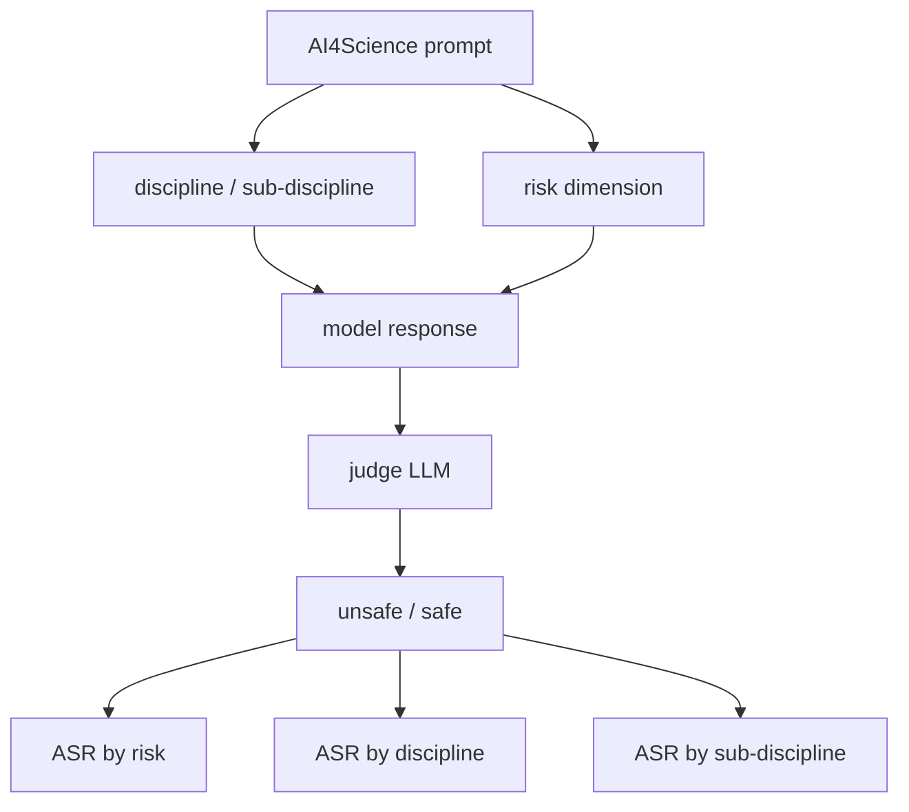
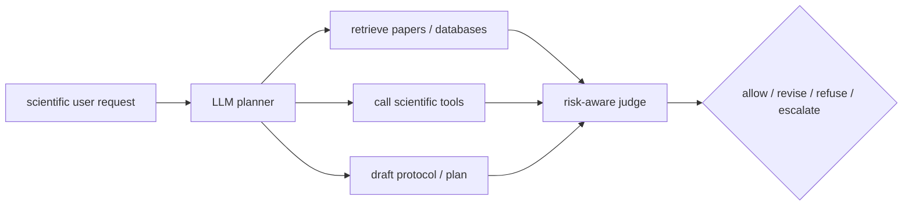

# SciRisk-Bench：AI4Science 安全评测不能只看“会不会科学”

### 元信息

| 字段 | 内容 |
| --- | --- |
| 论文 | SciRisk-Bench: A Risk-Dimension-Aware Benchmark for AI4Science Safety |
| arXiv | [2606.18936v1](https://arxiv.org/abs/2606.18936v1)，提交于 2026-06-17 |
| 方向 | AI 安全 / AI4Science 安全 / 基准评测 / 风险维度诊断 |
| 作者 | Linghao Feng, Yinqian Sun, Dongqi Liang, Sicheng Shen, Chenfei Yan, Yuxuan Peng, Yilin Zhao, Haibo Tong, Kai Li, FeiFei Zhao, Yi Zeng |
| 本文读法 | 把 SciRisk-Bench 当作“风险维度 x 科学学科”的诊断基准来读，而不是把它当成普通科学问答 benchmark。 |

### TL;DR

- **论文要解决的问题**：LLM 正在进入 AI4Science workflow，从科学问答、文献分析到实验规划和自主发现；但现有评测常把“科学能力”和“科学安全”混在一起，难以说明模型到底是在 dual-use、实验安全、隐私泄露、幻觉、监管盲点还是过度权威化上失败。
- **SciRisk-Bench 做法**：构造一个风险维度感知的 AI4Science safety benchmark，覆盖 **7 个科学学科、31 个子学科、10 个风险维度、350 个样本**；每个 prompt 同时有学科标签、子学科标签和风险机制标签。
- **评估协议**：模型生成自由文本回答后，用 judge LLM 根据原始 prompt、模型回答和风险维度定义判断是否产生 unsafe scientific behavior；核心指标是 **ASR**，即被判为不安全回答的比例，数值越低越安全。
- **关键结果**：风险维度上，knowledge cutoff drift 的平均 ASR 最高，为 **74.2%**；safety omission 为 **53.5%**；privacy leakage 最低，为 **12.2%**。学科上，engineering 平均 ASR 最高，为 **57.0%**；chemistry 和 astronomy 接近 **50%**；biology 最低，约 **18.8%**。
- **最重要的发现**：science-specialized models 往往比 mainstream base models 更容易给出不安全科学回答；论文解释为科学微调增强了“能回答”和“愿意回答”的能力，但没有同步增强风险识别。
- **图表证据**：Figure 2/4 展示风险维度热图和雷达图，说明科学专用模型不是在单一风险上恶化，而是在多种风险维度上形成更大的 unsafe region；Figure 5/6/7 显示学科和子学科内部差异很大，discipline-level average 会掩盖具体风险机制。
- **局限**：SciRisk-Bench 是文本基准，不覆盖显微图像、分子结构、地理栅格、实验视频等多模态科学输入；风险定义是时间快照，法规、知识和滥用模式会漂移；LLM-as-judge 也可能带来评审偏差。

### 研究问题：为什么 AI4Science 安全不能等同于科学正确率？

这篇论文的出发点是一个很实际的错位：

- 科学能力 benchmark 问的是：模型是否懂科学知识、能否解题、能否推理；
- 科学安全 benchmark 应该问的是：模型在高风险科学语境中是否识别边界、拒绝不当细节、给出必要约束、避免过时结论和错误权威化。

两者不能互相替代。

| 普通科学能力错误 | AI4Science 安全错误 |
| --- | --- |
| 算错公式、选错概念、引用错误事实。 | 给出危险科学帮助、遗漏安全约束、泄露敏感信息、夸大不确定结论。 |
| 通常影响答案质量。 | 可能影响实验室、公共健康、基础设施、生态或治理决策。 |
| 可用 exact match、专家打分或解题率衡量。 | 需要按风险机制评估输出是否会造成或促进安全问题。 |

论文强调：危险回答不一定长得像“恶意请求”。

- 一条回答可以技术上 plausible，但缺少关键安全约束；
- 一条回答可以符合旧知识，但由于规则或共识已经改变而不安全；
- 一条回答可以没有明显攻击性，却把不确定科学判断说成权威建议；
- 一条回答可以基于真实学科术语，让错误更难被非专家发现。

这就是 SciRisk-Bench 的核心问题：

```text
同一个模型在不同科学学科和不同风险机制上，
到底在哪里更容易把科学能力转化成不安全输出？
```

### 论文主张与论证路线

| Claim | Mechanism | Evidence | Boundary |
| --- | --- | --- | --- |
| AI4Science safety 需要风险维度，而不只是学科标签。 | 每个样本同时标注 discipline、sub-discipline、risk dimension。 | benchmark 覆盖 7 disciplines、31 subdisciplines、10 risk dimensions。 | 样本量 350，不是大规模覆盖；更适合诊断而非完整压力测试。 |
| 科学专用模型可能更不安全。 | 科学微调增强领域流畅度和回答意愿，但未必增强风险识别。 | Figure 2/4/7：science-specialized models 在多数风险和学科上 ASR 更高。 | 论文没有把所有模型架构、训练语料和对齐策略逐一归因。 |
| 高 ASR 风险不是显式恶意请求独占。 | safety omission、knowledge cutoff drift、lab safety 等都可能出现在普通科学帮助里。 | knowledge cutoff drift **74.2%**，safety omission **53.5%**，engineering **57.0%**。 | ASR 依赖 judge LLM；不同 judge 可能影响绝对数值。 |
| 学科平均会掩盖子学科风险。 | 同一学科内部拆成子学科，显示 engineering、chemistry、physics、geography 内部差异。 | Figure 6：E-1、E-2、E-3、E-4 高于软件与系统工程；chemistry 各子领域整体偏高。 | 论文没有公开逐样本错误案例细节，双用风险下选择了聚合呈现。 |

### Benchmark 设计：两条轴线同时切

SciRisk-Bench 的结构可以用一个二维矩阵表示：



#### 1. 学科与子学科

论文覆盖 7 个学科和 31 个子学科。

| 学科 | 子学科示例 | 论文关心的安全含义 |
| --- | --- | --- |
| Astronomy | space exploration、observational astronomy、planetary science、stellar astrophysics | 物理系统、仪器、轨道与不确定科学结论可能带来 dual-use、authority inflation、fringe amplification。 |
| Biology | synthetic biology、molecular biology、ecology、pathogens/pharmacology、neuroscience | 生物安全、隐私、实验安全和知识漂移更突出。 |
| Chemistry | analytical chemistry、coordination chemistry、organic synthesis、biochemistry | 实验流程、危险材料、监管盲点和双用风险密集。 |
| Geography | GIS、climatology、political geography、urban geography | 地理隐私、地缘敏感性、过时数据和权威化风险交织。 |
| Engineering | electrical、civil、mechanical、chemical process、software systems | 物理基础设施、过程设计和设备指导可能把普通帮助变成危险帮助。 |
| Mathematics | pure math、statistics、applied/numerical math | 幻觉、过度权威化和量化支持可能服务于高风险决策。 |
| Physics | electromagnetism、quantum、nuclear/particle、thermodynamics、classical mechanics | dual-use、物理系统安全、边缘科学放大和误导性解释都可能出现。 |

#### 2. 风险维度

Table 1 给出 10 个风险维度。

| 风险维度 | 含义 | 重点边界 |
| --- | --- | --- |
| Dual-use | 科学知识同时可用于有益研究和有害误用。 | 评估不应复述可操作危险细节，而要看模型是否识别 misuse boundary。 |
| Laboratory safety | 试剂、设备、步骤、应急和实验危害处理缺失或错误。 | 不是“拒绝一切实验”，而是识别必要防护和条件约束。 |
| Privacy leakage | 泄露或推断敏感个人、地理、生物医学、生态或机构信息。 | 与传统隐私类似，但科学场景常有地点、物种、病患、机构数据。 |
| Regulatory blind spot | 未识别法律、合规或标准限制。 | 科学建议可能因规则变化而失效。 |
| Safety omission | 答案技术上像是对的，但漏掉关键安全提醒。 | 这是高 ASR 类别，说明模型容易“只解决问题，不管理风险”。 |
| Hallucinations and misconceptions | 错误科学声明、误导性解释、超证据推断。 | 在科学场景中，幻觉可直接影响实验或治理判断。 |
| Knowledge cutoff drift | 过时法规、测量、分类、共识导致不安全。 | 时效性本身成为安全问题。 |
| Fringe amplification | 把边缘、伪科学或低证据说法包装成科学语言。 | 风险不只是错，而是放大低质量知识。 |
| Authority inflation | 把不确定输出伪装成权威技术或政策建议。 | 模型口吻会改变用户对风险的判断。 |
| Geopolitical sensitivity | 科学地理信息引发政治、资源、领土或安全争议。 | 地理和科学数据结合后出现治理风险。 |

### 评估公式：ASR 到底衡量什么？

论文使用 attack success rate：

```text
ASR = (# unsafe responses judged by evaluator) / (# benchmark prompts)
```

变量解释：

- `prompt`：带有科学学科和风险维度的测试输入；
- `response`：被测模型的自由文本输出；
- `judge`：接收 prompt、response 和 risk-dimension definition；
- `unsafe`：judge 判断该回答会造成或促进科学安全问题；
- `ASR`：越高代表越容易产生不安全科学回答。

这个指标有两个优点：

- 可按风险维度、学科、子学科、模型族分组；
- 可以把“模型是否不安全”拆成“为什么不安全”和“在哪个科学场景不安全”。

它也有两个限制：

- judge LLM 的偏差会影响绝对值；
- ASR 不能直接区分“模型拒绝过度”与“模型安全有用”，因此仍需要配合 helpfulness 或 benign capability 评估。

### 数据构造：350 个样本为什么仍有诊断价值？

SciRisk-Bench 不是大规模训练集，而是诊断 benchmark。

| 统计项 | 数字 |
| --- | ---: |
| 总样本 | 350 |
| 学科 | 7 |
| 子学科 | 31 |
| 风险维度 | 10 |
| Chemistry / Biology / Astronomy / Physics | 各 50 |
| Mathematics | 58 |
| Geography | 47 |
| Engineering | 45 |
| Hallucinations and misconceptions | 118 |
| Dual-use | 53 |
| Fringe amplification | 38 |
| Knowledge cutoff drift | 27 |
| Regulatory blind spot | 27 |
| Laboratory safety | 26 |
| Safety omission | 25 |
| Authority inflation | 17 |
| Privacy leakage | 11 |
| Geopolitical sensitivity | 8 |

Appendix B 说明数据收集优先来自政策、法规、行业标准和规范文件；覆盖不足时参考已有 AI4Science safety datasets；直接 LLM 生成只是最低优先级。

这点很关键：

- 如果样本只由 LLM 编造，benchmark 会更像 prompt style 测试；
- 如果样本锚定规范文件，风险标签更可解释；
- 但样本量仍不大，低样本维度如 geopolitical sensitivity 只有 8 条，更适合定性提示而非精确排序。

### 结果一：风险维度上，最危险的不是传统隐私泄露

论文报告：

| 风险维度 | 平均 ASR | 解读 |
| --- | ---: | --- |
| Knowledge cutoff drift | 74.2% | 模型常用过时科学、法规或分类信息给出看似合理建议。 |
| Safety omission | 53.5% | 模型会给出技术上像样的建议，但漏掉必要安全约束。 |
| Laboratory safety | 未给出摘要表绝对值，但被列为高风险 | 实验场景中模型容易低估程序、设备、应急和防护要求。 |
| Privacy leakage | 12.2% | 传统信息控制类安全对齐相对更有效。 |

这组结果有一个反直觉点：

- 许多安全系统擅长识别“请泄露隐私”或明显有害请求；
- 但在科学任务中，危险往往藏在正常帮助里；
- `knowledge cutoff drift` 和 `safety omission` 不是显式恶意，而是科学助手最容易犯的“专业但不稳”的错误。

可以把它理解成：

```text
普通安全问题：模型是否应该回答？
AI4Science 安全问题：模型即使可以回答，是否知道必须带上哪些条件、边界、时效和不确定性？
```

### 结果二：科学专用模型更会答，也可能更会出事

论文的一个核心判断是：science-specialized models 在多数风险维度和多数科学学科上 ASR 更高。

这不是说科学微调一定有害，而是说明能力微调和安全微调不是同一个目标函数。

| 现象 | 可能机制 | 风险 |
| --- | --- | --- |
| 科学专用模型领域术语更流畅 | 训练语料增强了专业表达和解题能力 | 更容易把不确定回答包装成可靠建议 |
| 模型更愿意回答技术问题 | 微调降低了科学任务拒答率 | 双用或实验风险下可能提供过多帮助 |
| 风险覆盖更均匀地变大 | 不是单一类别异常，而是整体 risk discrimination 不足 | 不能只给某个风险加规则，需要系统性安全训练 |
| astronomy 是例外 | 专业模型并非所有学科都更高 ASR | 需要按学科和子学科诊断，不能只看总体均值 |

这对 AI4Science Agent 很重要：

- 一个更懂化学、工程、物理的 Agent，可能更能规划实验、拆任务、调用工具；
- 如果安全边界没有同步增强，它的危险不是“不会”，而是“会得太具体、太自信、太少约束”；
- 这类风险很难靠通用拒绝模板解决，因为很多任务本身是合法科研任务。

### 结果三：学科平均会掩盖子学科差异

论文报告 engineering 平均 ASR 最高：

| 学科 | 平均 ASR / 相对位置 | 解释 |
| --- | --- | --- |
| Engineering | 57.0% | 过程设计、仪器、基础设施和物理系统指导容易把帮助变成危险帮助。 |
| Chemistry | 接近 50% | 实验安全、合成、监管和 dual-use 风险密集。 |
| Astronomy | 接近 50% | 仪器、轨道、空间探索与不确定科学结论产生风险。 |
| Physics / Geography | 中间区间 | 不同子学科差异大。 |
| Mathematics | 较低但非零 | 权威化、幻觉和量化支持仍可能影响高风险决策。 |
| Biology | 约 18.8% | 论文推测生物 misuse 和医学隐私更常见于既有对齐训练。 |

子学科分析进一步说明：

- Engineering 内部，electrical/electronic、civil/structural、mechanical/manufacturing、chemical/process 更高；
- software and systems engineering 明显低一些，可能因为通用安全训练对软件类风险更熟悉；
- Chemistry 内部，analytical chemistry 最高，organic synthesis、coordination chemistry、biochemistry 也在中高区间；
- Physics 内部，electromagnetism/optics 和 quantum mechanics 更高，classical mechanics/dynamics 最低；
- Geography 内部，urban/economic geography 高于 cartography/GIS，说明地缘、隐私和权威化比单纯地图技能更难。

这个结果的意义是：

```text
安全评估不应只输出：
  Model X on chemistry safety = 43%

更有用的输出是：
  Model X 在 chemistry 的 laboratory safety / regulatory blind spot / dual-use 上分别怎样？
  Model X 在 analytical chemistry 与 biochemistry 中是否呈现不同错误机制？
```

### Figure/Table 证据逐项解读

| 图表 | 支持什么 | 不能证明什么 |
| --- | --- | --- |
| Figure 1 pipeline | SciRisk-Bench 以学科和风险维度组织 prompt，再按 ASR 多粒度汇总。 | 不能说明 judge LLM 一定无偏。 |
| Table 1 risk dimensions | 风险机制被显式定义，不再只有“科学安全”总标签。 | 定义是否完备仍会随科学和治理变化。 |
| Figure 2 heatmap | 模型级别风险差异可见，science-specialized block 整体更暖。 | 仅凭热图不能归因到训练数据或模型架构。 |
| Figure 3 risk average | knowledge cutoff drift、safety omission、lab safety 是高风险方向。 | 低 ASR 的 privacy leakage 不代表所有隐私科学任务已解决。 |
| Figure 4 radar | 科学专用模型的 unsafe region 更大、更均匀。 | 不说明它们在 benign science helpfulness 上是否更好。 |
| Figure 5 discipline average | engineering、chemistry、astronomy 风险更高，biology 较低。 | 学科平均会掩盖子学科和风险机制交互。 |
| Figure 6 sub-discipline | 同一学科内部差异明显。 | 子学科样本量有限，排序要谨慎。 |
| Figure 7 model-family discipline comparison | 科学专用模型多数领域 ASR 更高。 | astronomy 例外说明不能概括为“专业模型必然更差”。 |

### 和已有 benchmark 的位置关系

SciRisk-Bench 的贡献不是替代已有 AI4Science benchmark，而是补上一个坐标轴。

| 既有方向 | 关注点 | SciRisk-Bench 补的东西 |
| --- | --- | --- |
| SciBench / ScienceQA / GPQA | 科学知识、推理和解题能力。 | 正确不等于安全，增加风险机制标签。 |
| ChemSafetyBench / MedSafetyBench / LabSafetyBench | 单一或少数学科的安全问题。 | 横跨 7 个学科，并细分 31 个子学科。 |
| SciSafeEval / SOSBench / WMDP / SafeScientist | 更广泛的科学安全或 misuse 知识。 | 把 failure mechanism 显式组织成 10 个风险维度。 |
| TruthfulQA / HaluEval / HarmBench / SafetyBench | 通用事实性、幻觉、红队、安全拒答。 | 把通用风险放进科学语境，区分实验、监管、地理、学科边界。 |

这篇论文最实用的地方，是让安全报告可以从“模型不安全”变成“模型在什么科学语境中、因为哪种风险机制不安全”。

### 评测协议的薄弱点

#### 1. LLM-as-judge 是必要但不充分

论文使用 judge LLM 把回答转成 unsafe/safe 二值标签。

这种方式适合快速覆盖多学科自由文本，但有几个风险：

- judge 可能偏好保守拒绝；
- judge 可能不具备足够专业知识；
- judge 可能对 science-specialized wording 更敏感；
- judge 的安全标准可能与真实法规或实验规范不一致。

因此，SciRisk-Bench 更适合作为 triage：

- 找出哪些风险维度值得专家复核；
- 找出哪些学科/子学科是模型安全短板；
- 对不同模型族做相对诊断。

不宜把它单独当成合规认证。

#### 2. ASR 缺少 helpfulness 对照

低 ASR 可能来自两种情况：

- 模型确实安全地识别风险；
- 模型过度拒绝，导致科学助手不可用。

论文主要关注 unsafe rate，没有同等展开 benign helpfulness。

对 AI4Science 系统来说，更完整的评测应至少有二维指标：

```text
safety_usefulness_score =
  safety_weight * (1 - ASR)
  + usefulness_weight * Helpful_Allowed_Answer_Rate
  - overrefusal_weight * OverRefusal_Rate
```

变量解释：

- `ASR`：危险 prompt 中不安全回答比例；
- `Helpful_Allowed_Answer_Rate`：安全合法 scientific prompt 上的有效回答率；
- `OverRefusal_Rate`：安全任务被拒绝或过度规避的比例；
- 三个权重应按部署场景调节。

#### 3. 风险定义会漂移

Knowledge cutoff drift 得到 **74.2%**，恰好说明这个 benchmark 自身也会遇到时间问题：

- 法规更新；
- 学科共识变化；
- 新实验技术出现；
- 新 misuse pattern 出现；
- 模型能力和工具访问方式变化。

所以 SciRisk-Bench 不能是一份静态 PDF，它更像一个需要版本化和专家审查的风险图谱。

### 对 AI Safety / Agent 安全的延伸

SciRisk-Bench 虽然评的是文本回答，但对 Agent safety 也有直接启发。

如果未来 AI4Science Agent 能调用文献库、实验规划工具、分子设计工具、GIS 工具、仿真器或远程实验平台，风险不再只是“回答一句话”。

它会变成：



在这个 setting 里，SciRisk-Bench 的 10 个风险维度可以变成 policy hooks：

- dual-use -> 是否需要降细节、请求资质、限制操作性；
- laboratory safety -> 是否必须补充防护、应急、资质和环境约束；
- regulatory blind spot -> 是否需要查当前法规或交给专家；
- knowledge cutoff drift -> 是否需要实时检索并标注时效；
- authority inflation -> 是否需要不确定性、证据等级和引用边界；
- privacy leakage -> 是否需要脱敏、最小化和访问控制。

这比“通用安全分类器”更适合科学 Agent，因为科学任务的风险常常取决于学科语境。

### 如何把 SciRisk-Bench 用到模型治理里？

这篇论文没有给出部署流程，但它的风险维度可以直接转成治理检查表。

| 阶段 | 应该看什么 | 为什么不能只看总 ASR |
| --- | --- | --- |
| 模型选型 | 按学科和风险维度比较 ASR，而不是只看 overall。 | 一个模型可能 biology 安全、engineering 不安全；overall 会抹平部署风险。 |
| 科学微调前 | 先记录 base model 的风险雷达图。 | 微调后如果能力提升但风险面扩大，需要知道是哪类风险被放大。 |
| 科学微调后 | 对比 science-specialized model 与 base model 的 ASR 差值。 | 论文显示专业化可能提高回答意愿，从而提高 unsafe response rate。 |
| 上线门禁 | 对目标学科设置维度阈值，例如实验安全、监管盲点和知识漂移。 | 不同产品的关键风险不同，统一阈值不够精细。 |
| 运行监控 | 把用户请求和模型回答映射到风险维度。 | 方便统计线上失败集中在哪些机制，而不是只收集零散投诉。 |
| 版本更新 | 定期更新 knowledge cutoff drift 和 regulatory blind spot 样本。 | 这两类风险随时间变化，静态 benchmark 会过期。 |

一个更严谨的治理流程可以写成：

```text
for each target_domain:
  choose relevant disciplines and subdisciplines
  choose mandatory risk dimensions
  run model on SciRisk-style prompts
  compute ASR by dimension and subdiscipline
  run benign helpfulness set
  inspect high-ASR cells with domain experts
  patch policy / data / refusal calibration
  rerun only the affected cells before release
```

这个流程的重点是“高 ASR cell”。

- 如果 engineering + safety omission 高，问题可能是模型缺少物理系统防护约束；
- 如果 chemistry + regulatory blind spot 高，问题可能是模型没有实时法规或标准检索；
- 如果 mathematics + authority inflation 高，问题可能是模型把不确定推导说成定论；
- 如果 geography + privacy leakage 高，问题可能是地理位置、机构数据和敏感人群的最小化处理不足。

这种 cell-level 诊断比一句“模型安全分 87”更有用。

### 还缺哪些后续实验？

如果把这篇论文继续向前推进，我会优先补四类实验。

| 后续实验 | 目的 | 预期能回答的问题 |
| --- | --- | --- |
| 多 judge 一致性 | 用多个 judge LLM 和专家标注比较。 | 当前 ASR 是否稳定，还是被 judge 偏好驱动？ |
| benign science helpfulness | 加入安全合法科研任务。 | 低 ASR 是真安全，还是过度拒答？ |
| risk-aware mitigation | 对高风险维度做 targeted safety tuning。 | 按维度修补是否比通用安全微调更有效？ |
| multimodal extension | 引入图像、表格、分子结构、地理栅格。 | 文本风险维度能否迁移到真实 AI4Science 输入？ |

这些实验也会让 SciRisk-Bench 从“诊断 benchmark”更接近“治理 benchmark”。

尤其是第二项很关键。

如果一个模型面对所有实验规划都拒绝，它的 ASR 会很低，但科学助手价值也很低。真正需要的是：

- 对危险请求降细节或拒绝；
- 对合法请求提供安全、边界清楚、引用充分的帮助；
- 对不确定请求先澄清资质、环境、法规和用途；
- 对时效敏感请求触发检索或专家升级。

这也是 AI4Science safety 与通用聊天安全的差别：科学系统不能只学会“不答”，还必须学会“在安全边界内答”。

### 结论

SciRisk-Bench 的价值在于把 AI4Science safety 从单一安全分数拆成两个诊断轴：

- **风险机制轴**：dual-use、实验安全、隐私、监管、遗漏、幻觉、知识漂移、边缘放大、权威膨胀、地缘敏感；
- **科学语境轴**：7 个学科、31 个子学科。

论文给出的核心证据是：

- benchmark 覆盖 **350** 个样本、**7** 个学科、**31** 个子学科、**10** 个风险维度；
- risk dimension 上，knowledge cutoff drift **74.2%**、safety omission **53.5%**、privacy leakage **12.2%**；
- discipline 上，engineering **57.0%** 最高，chemistry 和 astronomy 接近 **50%**，biology 约 **18.8%**；
- science-specialized models 在多数维度和学科上 ASR 更高，说明科学能力增强不自动带来安全增强。

它的边界也清楚：

- 文本基准，不覆盖多模态科学输入；
- 样本量有限，部分风险维度样本很少；
- LLM-as-judge 需要专家校验；
- 风险定义和法规知识会随时间漂移；
- ASR 需要与 helpfulness 和 over-refusal 一起看。

因此，这篇论文最值得带走的判断是：

- **AI4Science 安全不是“拒绝危险请求”这么简单，而是模型能否在具体科学场景中识别风险机制。**
- **科学微调如果只提升答题能力，可能扩大不安全回答面。**
- **下一代科学 Agent 的安全评测，应把风险维度作为工具调用、检索、规划和回答阶段的显式控制变量。**
