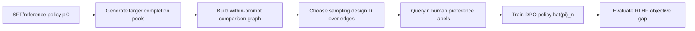
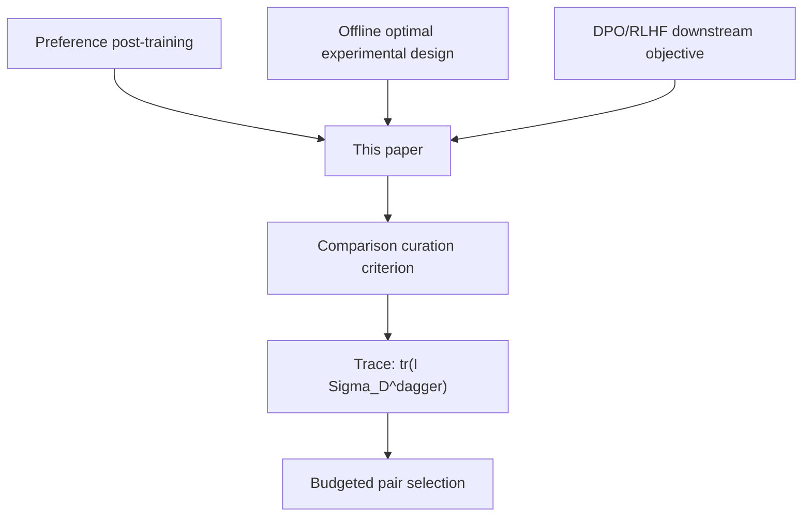

# Which Pairs to Compare：后训练里最贵的不是生成回答，而是该让人比较哪一对

### 元信息与 TL;DR

- **论文**：[Which Pairs to Compare for LLM Post-Training?](https://arxiv.org/abs/2606.19607)
- **版本**：arXiv:2606.19607v1，2026-06-17 提交。
- **作者**：Jiangze Han、Vineet Goyal、Will Ma，Columbia University。
- **方向**：大模型后训练、DPO、偏好数据采样、offline experimental design。
- **本轮选择原因**：统一候选表里多个 Agent 安全候选已经在 `origin/data` 发布；这篇后训练论文仍未命中 `arxiv:2606.19607v1`、canonical URL 或标题，且给出理论上下界、可执行采样准则、IMDb 与 Anthropic-HH 实验，适合深读。

**TL;DR：**

- 这篇论文问的是一个很具体但常被忽略的问题：DPO/RLHF 后训练不只是“收集多少偏好标签”，还要决定从一大池候选回答里**哪两条回答值得让人比较**。
- 作者把比较选择形式化为 sampling design：先为每个 prompt 生成较大的候选 completion pool，再在同一 prompt 内的所有候选边上分配标注预算。
- 核心理论结论是：DPO 训练后的 RLHF 最优性差距由同一个 trace 项控制，即 `tr(I(theta*) Sigma_D(theta*)^\dagger)`；它同时出现在 DPO 可达到的上界和任意估计器不可突破的下界里。
- `I(theta*)` 表示策略局部 Fisher/曲率：哪些参数方向影响最终策略价值；`Sigma_D(theta*)` 表示采样设计提供的信息：你标的 pair 是否覆盖这些方向。
- 因为真正的 `theta*` 未知，论文提出用参考/SFT 策略参数 `theta0` 做 plug-in 设计，求解 `tr(I(theta0) Sigma_D(theta0)^\dagger)` 的近似最小化。
- 实验包括 tabular 与 linear contextual 合成设置、IMDb + GPT-2-large DPO、Anthropic-HH + Pythia-2.8B DPO；IMDb 中 prompt 选择用 1,000 个 prompt 候选池选 `N=175`，response 选择每个 prompt 生成 `d=8` 个候选回答；Anthropic-HH 用 `160,800` 个候选偏好对，报告 `N=80,400` 和 `N=96,480` 两档。
- 结果不是“多标一定好”，而是 `D*` 设计在相同标注预算下持续改善 reward-KL frontier 或 GPT-4.1 judge win rate，尤其在低预算和参考策略分布高度不均匀时优于 uniform 与 `pi0` 加权启发式。
- 局限也很明确：理论依赖 realizability、coverage、smoothness 等假设；设计是 offline randomized，候选先生成、标注后不自适应；真实人工偏好噪声、长上下文任务、多轮交互、生产标注流程仍没有被完整覆盖。

### 统一 Scout 候选表与去重

| 优先级 | category_id | 候选 | 日期 | 初步判断 |
|---:|---|---|---|---|
| 1 | llm-post-training | **Which Pairs to Compare for LLM Post-Training?**, arXiv:2606.19607v1 | 2026-06-17 | **选中**：后训练核心问题，理论与实验完整 |
| 2 | llm-agent | Runtime Compliance Verification for AI Agents, arXiv:2606.19242v1 | 2026-06-17 | 本地文章中曾作为候选出现，未选 |
| 3 | llm-agent | SAGE-OPD: Selective Agent-Guided Intervention for Multi-Turn On-Policy Distillation | 2026-06-17 | 主题相近，但证据密度弱于本篇 |
| 4 | ai-safety | ShellGames: Speculative LLM-Driven SSH Deception | 2026-06-16 | 安全方向可读，但实验边界更窄 |
| 5 | llm-agent | AutoPass: Evidence-Guided LLM Agents for Compiler Performance Tuning | 2026-06-18 | 代码/Agent 工程候选，后续可读 |
| 6 | llm-agent | PACMS: Submodular Context Selection as a Pluggable Engine for LLM Agents | 2026-06-18 | 上下文选择方向，未优先 |
| 7 | llm-post-training | Process-Verified Reinforcement Learning for Theorem Proving via Lean | 2026-06-18 | 后训练候选，主题更偏 theorem proving |
| 8 | llm-post-training | Uncertainty-Aware Reward Modeling for Stable RLHF | 2026-06-18 | reward modeling 候选，未选 |
| 9 | ai-safety | A Layered Security Framework Against Prompt Injection in RAG-Based Chatbots | 2026-06-17 | 安全框架候选，方法细节少于本篇 |
| 10 | ai-safety | PARSE: Provenance-Aware Retrieval Sanitization for Professional Domain LLM Agents | 2026-06-16 | RAG/Agent 安全候选，未选 |

去重结论：

- `When Lower Privileges Suffice / ToolPrivBench` 已在 `origin/data` 命中 `arxiv:2606.20023v1`。
- `Defensive Misdirection` 已在 `origin/data` 命中 `arxiv:2606.20470v1`。
- 本篇 `https://arxiv.org/abs/2606.19607` 与 `arxiv:2606.19607v1` 未命中已发布 item。

### 研究问题：为什么“选 pair”比“多生成几个回答”更像瓶颈？

论文的出发点很务实：

- 在偏好后训练里，**生成 completion 相对便宜**。
- 真正贵的是让人类标注者判断两个 completion 谁更好。
- 传统流程经常是：
  - 每个 prompt 生成很少几个回答。
  - 标一个固定 pair，或者标所有 pair。
  - 把这些 pair 直接送入 DPO/RLHF。
- 但如果已经能离线批量生成更多候选，就自然会出现另一个问题：
  - 不是“要不要生成更多回答”。
  - 而是“在有限标注预算下，哪些 pair 最能改善最终策略”。

这和很多后训练讨论的关注点不同：

| 常见问题 | 本文问题 |
|---|---|
| 哪个偏好优化 loss 更稳？ | 固定 DPO 后，该标哪一对回答？ |
| preferred response 质量是否足够高？ | pair 是否提供了最终策略需要的信息方向？ |
| 在线 RLHF 怎么主动采样？ | 第一次偏好反馈前，离线候选池怎么分配标注预算？ |
| reward model 是否抗噪？ | 标注设计如何通过 DPO 传播到 RLHF objective gap？ |

这也是本文最值得带走的观点：

> 偏好数据不是一堆可交换的二元标签。比较边本身有信息几何；不同 pair 对最终策略价值的贡献不同。

### 论文主张与论证路线

作者的论证可以压成一张 claim → mechanism → evidence → boundary 表：

| Claim | Mechanism | Evidence | Boundary |
|---|---|---|---|
| 比较选择会影响最终 DPO policy，不只是影响 reward estimation | 把 curation 写成 sampling design `D`，并通过 DPO estimator `hat(theta)_n` 进入 RLHF objective | Theorem 的 upper/lower bounds 都含同一 trace 项 | 理论在参数化 softmax policy 与正则假设下成立 |
| downstream gap 由一个设计相关信息矩阵控制 | `Sigma_D(theta)` 汇总被标 pair 的 sensitivity outer product | `J(pi*) - J(hat(pi)_n) <= C/n * tr(I Sigma_D^\dagger)` | 需要 coverage：`Sigma_D` 在可识别子空间上不能退化 |
| 这个 trace criterion 不只是分析工具，而是可用的采样准则 | 最小化 `tr(I(theta0) Sigma_D(theta0)^\dagger)`，用参考策略参数近似未知 `theta*` | plug-in theorem 给出相对 oracle 的常数因子控制 | `theta0` 离 `theta*` 太远时常数会变差 |
| 信息设计能改善样本效率 | 合成、IMDb、Anthropic-HH 中 `D*` 持续优于 uniform / arbitrary / `pi0` heuristic | reward-KL frontier 与 GPT-4.1 win-rate 图 | 没有报告真实人工标注成本与跨任务泛化 |

### 方法机制：从 DPO 到 sampling design

论文先把标准 RLHF/DPO 写成一个可分析对象。

KL-regularized RLHF 的目标可以理解为：

```text
目标 = 让策略更偏向高 reward completion
      - beta * 偏离 reference policy 的 KL 成本
```

更形式化地写：

```math
J(pi)
= E_x E_{y ~ pi(.|x)}[r*(x,y)]
  - beta E_x KL(pi(.|x) || pi0(.|x))
```

变量解释：

| 符号 | 含义 | 在本文中的作用 |
|---|---|---|
| `x` | prompt | 每个 prompt 有自己的 completion 候选池 |
| `y` | completion | 同一 prompt 内的 completion 才能比较 |
| `pi0` | SFT/reference policy | 生成候选，也作为 DPO reference |
| `r*` | 未知人类偏好 reward | 通过 pairwise preference 间接观察 |
| `beta` | KL regularization strength | 决定 policy 可偏离 reference 的幅度 |
| `pi*` | RLHF optimal policy | 理论上想逼近的目标 |

DPO 的关键转写是：

```math
r(x,y) = beta * log(pi_theta(y|x) / pi0(y|x)) + c(x)
```

同一 prompt 内比较两个回答时，prompt-only 常数 `c(x)` 会抵消：

```math
r(x,y+) - r(x,y-)
= beta * log [pi_theta(y+|x)/pi0(y+|x)]
       - beta * log [pi_theta(y-|x)/pi0(y-|x)]
```

于是一个 pair `e=(x,y+,y-)` 对 DPO loss 的作用，最终由一个 logit 差控制：

```math
u_theta(e)
= beta * log [pi_theta(y+|x)/pi0(y+|x)]
 - beta * log [pi_theta(y-|x)/pi0(y-|x)]
```

作者接着把“标哪一对”写成图上的采样问题：

- 对每个 prompt `x`，先生成候选集合 `Y_x`。
- 同一 prompt 内所有 unordered pair 构成边集合 `E`。
- 一个 sampling design `D` 是 `E` 上的概率分布。
- 标注预算为 `n` 时，从 `D` 里抽 `n` 条边并获得偏好标签。
- 用这些标签训练 DPO，得到 `hat(pi)_n(D)`。

这一步的含义是：



这不是把 active learning 的不确定性打分直接搬过来。

本文的设计目标更后端：

- pair 是否最能估计 reward，本身不是最终目标。
- pair 是否让 DPO 后的策略接近 `pi*`，才是最终目标。
- 所以设计准则必须穿过 DPO loss 和 RLHF objective，而不是只看 pairwise classifier 的置信度。

### 信息矩阵：一篇论文最核心的技术对象

论文给出两个矩阵：

| 对象 | 直觉 | 作用 |
|---|---|---|
| `I(theta)` | 策略局部 Fisher / RLHF gap 曲率 | 哪些参数方向会影响最终 policy value |
| `Sigma_D(theta)` | 设计 `D` 提供的 pairwise 信息 | 标注 pair 是否覆盖这些方向 |

如果用一句话解释：

> `I` 告诉你“哪些方向重要”；`Sigma_D` 告诉你“你标的 pair 是否能看见这些方向”。

论文的 trace 项是：

```math
tr(I(theta*) Sigma_D(theta*)^\dagger)
```

这个式子的含义可以按矩阵几何读：

- 如果某个方向在 `I(theta*)` 中权重大，说明这个方向影响最终策略价值。
- 如果同一方向在 `Sigma_D(theta*)` 中信息少，伪逆 `Sigma_D^\dagger` 会放大它。
- 因此 trace 变大，意味着标注预算浪费在不关键或重复的 pair 上。
- 最优设计要把标注预算投到能覆盖高价值方向的比较边上。

这也解释了为什么简单 `pi0` heuristic 可能失败：

- 高 `pi0` completion 常被 reference policy 频繁生成。
- 但它们之间的差异可能小，或者只覆盖很窄的参数方向。
- 反而某些低概率 completion pair 更能暴露策略应修正的方向。

### 理论结果：同一个 trace 项同时控制上界与下界

论文主定理给出两个互相咬合的结果。

**第一，上界：DPO 在好设计下能做到什么。**

在 identifiable space、boundedness、feature separation、coverage、unique minimizer 等假设下：

```math
J(pi*) - J(hat(pi)_n)
<= C_ub(delta)/n * tr(I(theta*) Sigma_D(theta*)^\dagger)
```

读法：

- gap 随标注数 `n` 呈 `1/n` 缩小。
- 但前面的常数不是任意的，而由设计 `D` 的信息质量决定。
- 同样 `n` 下，差设计与好设计的差别可能体现在 trace 项。

**第二，下界：任何估计器都绕不开什么。**

Van Trees lower bound 表明，对任何 induced policy estimator：

```math
E[J(pi_theta*) - J(tilde(pi)_n)]
>= C_lb/n * E[tr(I(theta*) Sigma_D(theta*)^\dagger)]
```

读法：

- 这不是 DPO 分析技巧造成的松上界。
- 在给定 sampling design `D` 下，信息论下界也出现同一个 trace 项。
- 因此这个 criterion 确实抓住了“比较选择”里的统计难点。

作者证明路线可以简化成三步：

| 步骤 | 证明动作 | 直觉 |
|---|---|---|
| 1 | 把 RLHF gap 写成到 `pi*` 的 reverse KL，并夹在 weighted quadratic form 之间 | downstream value gap 约等于参数误差的 `I` 加权范数 |
| 2 | 用 DPO empirical risk 的 Hessian 与 score noise 控制 `hat(theta)-theta*` | `Sigma_D` 决定 DPO 从标签中获得多少曲率 |
| 3 | 用 Van Trees inequality 给任意 estimator 下界 | `n` 个 pair 最多只能提供 `n Sigma_D` 级别的信息 |

### 可执行设计：`theta*` 不知道时怎么办？

oracle 设计当然是：

```math
D*(theta*) in argmin_D tr(I(theta*) Sigma_D(theta*)^\dagger)
```

问题是 `theta*` 就是后训练要学到的目标，标注前并不知道。

论文的工程化选择是 plug-in：

```math
D_{theta0} in argmin_D tr(I(theta0) Sigma_D(theta0)^\dagger)
```

这里 `theta0` 来自 reference/SFT policy。

为什么这个近似合理？

- RLHF/DPO 的 KL 正则本来就要求 post-trained policy 不要离 `pi0` 太远。
- 如果 `theta0` 与 `theta*` 距离 `r0` 可控，作者证明 plug-in trace 与 oracle trace 只差一个依赖 `r0` 的常数因子。
- 论文不是声称 `theta0` 永远准确，而是把“reference 离目标有多远”显式放进边界。

这点很重要：

| 情况 | plug-in 设计含义 |
|---|---|
| SFT policy 已经接近理想策略 | `theta0` 能较好指示重要方向 |
| SFT policy 分布很偏，但 reward 差异弱 | `D*` 会避免只采高 `pi0` pair |
| SFT 与目标偏离很大 | 理论常数变差，可能需要迭代/自适应设计 |
| 真实 label 噪声强、偏好漂移 | offline first-round design 只能解决第一批标注问题 |

### 伪代码：把论文方法翻成标注队列

```text
Input:
  Prompt set X
  Reference policy pi0
  Label budget n
  Candidate count per prompt K
  Feature extractor phi(x, y)

State:
  Candidate completions Y_x
  Within-prompt edge set E
  Feature difference g_e for each edge
  Fisher-like weight matrix I(theta0)
  Design weights q over E

Procedure:
  1. For each prompt x in X:
       generate K completions from pi0
       build all within-prompt pairs e=(x, ya, yb)

  2. Estimate theta0 geometry:
       compute hidden features phi(x, y)
       fit local linear approximation to reference log-probabilities
       estimate I(theta0)

  3. Solve trace-design objective:
       minimize tr((lambda I + sum_e q_e g_e g_e^T)^(-1) I(theta0))
       subject to q_e >= 0 and sum_e q_e = 1

  4. Sample n comparison pairs without replacement:
       probability proportional to optimized q

  5. Send selected pairs to annotators:
       collect preference labels

  6. Train DPO:
       use the curated labeled pairs

Output:
  DPO policy with lower expected RLHF optimality gap under the same label budget

Failure boundary:
  If candidate pool lacks coverage, if theta0 is far from theta*, or if labels are systematically biased,
  trace design cannot recover missing information by reweighting alone.
```

### 合成实验：先在理论模型里验证机制

论文先用两个合成实验隔离理论机制。

| 实验 | 设置 | 比较对象 | 评测 |
|---|---|---|---|
| Tabular | 每个 item 是 completion，policy 是 `d` 维分布 | oracle `D*(theta*)`、plug-in `D*(theta0)`、uniform、`pi0` 加权启发式 | RLHF optimality gap |
| Linear contextual | prompt 与 action embedding 组成 `phi(x,y)=[x;a;x*a]` | 同上 | held-out RLHF optimality gap |

关键设计：

- reference policy `pi0` 被设为高度非均匀，模拟 SFT/预训练模型的集中输出分布。
- true reward 方差较小，制造低信号场景。
- pairwise labels 来自 Bradley-Terry 模型。
- 目标是看同样 label budget 下，哪个 design 更快逼近 `pi*`。


这两张 Figure 1 的作用不是展示真实 LLM 效果，而是验证机制：

- oracle 与 plug-in 曲线接近，说明 `theta0` proxy 在该设置下有效。
- uniform 随预算增加会改善，但小预算时样本效率差。
- `pi0` weighted heuristic 表现差，说明“高概率回答之间的比较”并不自动等于“信息量大的比较”。

这个结果支撑了论文的第一个经验判断：

> 偏好标注预算应覆盖最终策略价值敏感方向，而不是 reference policy 最常生成的局部区域。

### IMDb 实验：真实 DPO 训练里的 reward-KL frontier

IMDb 设置更接近语言模型后训练，但仍保留可计算 proxy reward。

实验流程：

- 按 DPO 论文 pipeline，在 IMDb training split 上训练 GPT-2-large SFT。
- 用该 SFT model 作为 DPO 初始化与 reference policy。
- 用 sentiment classifier 作为 proxy reward。
- 用 reward-KL frontier 比较不同偏好数据构造方式。

论文做了两个 curation 任务：

| 任务 | 候选池 | 标注预算 | baseline | `D*` 做法 |
|---|---:|---:|---|---|
| Prompt selection | 1,000 个 prompt，每个 prompt 2 个回答 | `N=175` | 取前 175 个 comparison | 在 1,000 个候选 comparison 上算权重并无放回抽样 |
| Response selection | 175 个 prompt，每个 prompt `d=8` 个回答 | 每个 prompt 选 1 个 pair | 比较前两个生成回答 | 在同 prompt 的 `C(8,2)` pair 内归一化权重后抽样 |

实现细节值得注意：

- 每个 prompt-response 用 SFT model 的 last-token hidden representation 表示。
- 对 comparison `e=(x, ya, yb)`，用差分特征：

```math
g_e = beta_D * (phi(x, ya) - phi(x, yb))
```

- 用 ridge regression 拟合 reference log-probability 的局部线性近似。
- 估计 `I(theta0)` 后，求解正则化 trace design：

```math
min_w tr( I_hat(theta0) * A(w)^(-1) )

A(w) = lambda I + sum_e w_e g_e g_e^T
```

- 连续设计问题用 Frank-Wolfe 近似求解。
- prompt selection 的误差条来自 30 次独立运行；response selection 的误差条来自 80 次独立运行。


Figure 2 的证据边界：

- 它支持 `D*` 在相同预算下改善 reward-KL tradeoff。
- 它没有证明所有 sentiment/post-training 任务都会有同样增益。
- 它仍依赖 proxy reward，而不是直接人类偏好。
- 它显示的是 frontier 形状与标准误，而不是给出一个单一 “accuracy +x%” 的结论。

### Anthropic-HH 实验：去掉显式 reward，用 GPT-4.1 做 judge

Anthropic-HH 进一步接近偏好后训练场景：

- 数据集：Anthropic Helpful-Harmless 默认 train/test split。
- 模型：Pythia-2.8B。
- 先用 chosen responses 做 SFT。
- SFT model 同时作为 DPO 初始化与 reference policy。
- 候选池：HH training split 中 `160,800` 个 preference comparisons。
- budget：
  - `N=80,400`，约为候选池 50%。
  - `N=96,480`，约为候选池 60%。
- baseline：取候选池前 `N` 个 comparison。
- `D*`：按 optimized design weights 无放回采样 `N` 个 comparison。

特征与训练细节：

| 项目 | 设置 |
|---|---|
| hidden feature | SFT model 对 `x + y+` 与 `x + y-` 的 last-token hidden state |
| comparison vector | `g_i = beta(phi_i+ - phi_i-)` |
| beta | `0.1`，与 DPO regularization 对齐 |
| dimensionality reduction | 标准化后 PCA 到 128 维 |
| trace objective ridge | `lambda = 1e-3` |
| optimizer | Frank-Wolfe 求 design weights |
| DPO optimizer | RMSprop |
| learning rate | `1e-6` |
| batch size | 64 |
| warmup | 前 150 steps 线性 warmup |
| epochs | 1 |
| compute | design/response generation 用 1 张 H100-class GPU；每个 Pythia-2.8B DPO run 用 4 张 GPU，约 1 小时 |

评测协议：

- 在 HH test prompts 上生成回答。
- temperature 取 `0.25`、`0.7`、`1.0`。
- 每个 method-temperature pair 评测 500 个 test prompts。
- GPT-4.1 比较模型回答与 HH chosen response。
- tie 按 0.5 计入 win rate。


Figure 3 的意义：

- 在两个大预算设置下，`D*` curated dataset 都优于 benchmark。
- 三个 sampling temperature 下都看到改善，而不是只在某个 decoding setting 下成立。
- 评价不依赖显式 reward model，而是用 GPT-4.1 做 pairwise judge。
- 但 GPT-4.1 judge 本身仍是自动评价，不等于真实人类偏好最终验证。

### 失败案例与消融：论文没有充分展开什么？

这篇论文的实验很完整，但失败/消融信息相对有限。

可以明确看到的对照包括：

- oracle `D*(theta*)` vs plug-in `D*(theta0)`。
- uniform sampling vs `pi0` weighted heuristic。
- prompt selection vs response selection。
- synthetic realizable setting vs real LLM fine-tuning setting。
- explicit proxy reward vs GPT-4.1 judge。

但仍缺少这些更硬的失败分析：

| 缺口 | 为什么重要 |
|---|---|
| `theta0` 与 `theta*` 距离变大时的系统性 stress test | plug-in theorem 的常数依赖 `r0`，但实验没有把该常数失败边界展开 |
| label noise / annotator disagreement ablation | 偏好数据真实瓶颈往往是噪声与偏置，而不只是 pair selection |
| candidate generation policy ablation | 如果候选池本身质量差，设计再好也只能在坏池子里选 pair |
| 与 active/online DPO 的直接对照 | 本文强调 offline first-round，但工程系统常会迭代采样 |
| 人工标注成本模型 | 生成便宜、标注贵是合理前提，但不同 pair 可能标注难度不同 |
| 长上下文、多轮 Agent、tool-use 偏好数据 | 论文主要处理 within-prompt completion pair，没有覆盖 action trajectory 比较 |

这些缺口不削弱论文主张本身，但会影响落地判断：

- 如果你只做一次大规模批量标注，本文方法很有用。
- 如果你能在线迭代并根据 label 反馈更新候选池，本文只是第一轮设计基线。
- 如果任务涉及多轮工具调用或安全约束，completion pair 的信息矩阵还需要扩展到 trajectory/action graph。

### Figure/Table 证据地图

| 证据 | 原文位置 | 支持什么 | 不能证明什么 |
|---|---|---|---|
| Figure 1 | synthetic tabular/contextual | trace design 在 realizable 模型中更样本高效，plug-in 接近 oracle | 不能代表真实 LLM 标注噪声 |
| Figure 2 | IMDb + GPT-2-large | `D*` 改善 reward-KL frontier，覆盖 prompt 与 response 两种 curation | proxy reward 不等于人类偏好 |
| Figure 3 | Anthropic-HH + Pythia-2.8B | `D*` 在 50%/60% 候选池预算和三档 temperature 下提升 GPT-4.1 win rate | GPT-4.1 judge 不是最终人类评审 |
| Theorem 1 | Main results | upper/lower bounds 同含 trace criterion | 假设较强，不能直接推出任意神经网络全局性质 |
| Theorem 2 | Sampling policy design | 用 `theta0` 做 plug-in 有常数因子保证 | `theta0` 偏离大时保证变弱 |
| Appendix F | Implementation details | 公开了 IMDb/HH 特征、优化器、budget、评测协议 | 没有开源完整训练代码链接或人工标注协议 |

### 与相关工作的关系：它到底补了哪块？

论文在相关工作中把自己放在三个交叉点上。

**第一，DPO/RLHF 方法本身。**

- DPO 简化了 reward modeling + PPO 的两阶段流程。
- 许多后续方法改 loss、改正则、改迭代方式。
- 本文不改 DPO objective，而是问 DPO 之前的数据选择问题。

**第二，active preference learning。**

- 许多工作在线选择 query，以减少 RLHF/DPO 标注成本。
- 本文关注 offline first-round curation。
- 动机是实际标注流程常常先批量组装比较数据，再送给标注团队。

**第三，optimal experimental design。**

- 经典 paired-comparison design 会关注 utility estimation 或 ranking accuracy。
- 本文把目标换成 downstream RLHF policy gap。
- 因此它不是只让 reward model 更准，而是让最终后训练策略更接近 KL-regularized optimum。

这个定位很清楚：



### 对后训练实践的启发：别把偏好数据当随机样本

这篇论文给后训练实践的启发不是“立刻换掉 DPO”，而是：

- 保持 DPO pipeline 不变。
- 在标注前多生成候选。
- 用模型 hidden representation 与 reference log-probability 构造近似几何。
- 把有限人工标签投到最能减少 downstream gap 的 pair 上。

可以落到一个简单 checklist：

| 后训练团队问题 | 本文给的技术回答 |
|---|---|
| 每个 prompt 生成几条回答？ | 可以生成更大 pool，把标注预算留给 pair selection |
| 标哪一对？ | 不要默认前两个或随机 pair，先估计 design weights |
| 只比较高概率回答可以吗？ | 不一定，`pi0` heuristic 在合成实验中表现差 |
| 设计目标是什么？ | 最小化 `tr(I(theta0) Sigma_D(theta0)^\dagger)` |
| 如何近似实现？ | last-token hidden state、差分特征、ridge/PCA、Frank-Wolfe |
| 怎么评估？ | reward-KL frontier、pairwise judge win rate、预算曲线 |

这对当前“数据工程驱动后训练”的讨论很有价值：

- 很多团队会先争论偏好数据量。
- 本文提醒：数据量相同，也可能因为 pair 信息几何不同而得到不同策略。
- 如果标注预算昂贵，pair curation 是可直接优化的杠杆。

### 落地风险：设计权重不应该替代数据审计

把 trace design 用到真实后训练队列时，还需要额外加一层数据审计。

| 风险 | 可能后果 | 需要的保护 |
|---|---|---|
| 高权重 pair 集中在少数 prompt 模板 | DPO 学到窄域偏好，泛化到新任务时失效 | 对 prompt domain、长度、语言、难度做配额 |
| hidden representation 近似不稳定 | design weights 反映 feature artifact，而非真实偏好方向 | 多 checkpoint / 多 embedding layer 做敏感性检查 |
| 标注者对高信息 pair 分歧更大 | 标签噪声抵消理论上的信息增益 | 对高分歧 pair 重复标注并估计 annotator uncertainty |
| 安全任务的 preferred answer 不唯一 | “更好”可能包含拒答、澄清、最小权限和证据保留等多目标 | 把 preference rubric 拆成多维标签，而不是单一胜负 |

因此，一个可靠的工程版本不应只输出 `q_e` 采样权重。

它还应该同时输出：

- 每个 pair 被选中的原因：覆盖哪个高价值方向。
- 标注难度估计：是否需要专家或多标注者。
- domain coverage 报告：是否过度集中在某类 prompt。
- 噪声监控：高权重 pair 的 disagreement 是否异常。
- 安全过滤：是否包含敏感数据、越权工具调用或不可公开内容。

这与论文主张并不冲突。

论文解决的是“在理想化或可控近似下，pair selection 应该优化什么”；工程系统还要回答“这些 pair 是否能被稳定、合规、一致地标出来”。两者合在一起，才接近可部署的偏好数据流水线。

### 证据边界与局限

论文结尾承认了几类局限，我会把它们拆得更具体一些。

**理论假设边界：**

- realizability：假设存在 `theta*` 让参数化 policy 达到 RLHF optimum。
- regularity：需要 smoothness、boundedness、feature separation。
- coverage：`Sigma_D` 在 identifiable subspace 上要有 spectral gap。
- unique minimizer：DPO population risk 的 minimizer 需要不含歧义。

**实验边界：**

- IMDb 依赖 sentiment classifier proxy reward。
- HH 用 GPT-4.1 judge，不是人工终审。
- Pythia-2.8B 与 GPT-2-large 不代表最前沿闭源模型。
- 图中报告相对 frontier/win-rate 优势，但没有给出人工标注端到端成本节省。

**方法边界：**

- offline design 不根据已观察 label 自适应更新。
- candidate pool 先验固定；如果生成池缺少好回答或关键失败模式，设计无法凭空创造信息。
- pair 的标注难度被默认为同等成本；真实标注可能存在难 pair 更贵、分歧更大的情况。

**领域迁移边界：**

- 对安全 RLHF，pair 可能不仅是“更有帮助”，还包含拒答、最小权限、泄漏风险、多轮策略。
- 对 Agent 后训练，比较对象可能是 trajectory、tool call sequence、state recovery，而非单 completion。
- 对 code/reasoning 后训练，verifier 与 preference label 的关系可能比 Bradley-Terry 更复杂。

### 继续追问

我认为这篇论文最值得后续追问的是三个方向。

**1. 能不能把 trace design 扩展到 trajectory-level preference？**

Agent 后训练常见比较对象不是两个回答，而是两条执行轨迹：

- 哪条轨迹更省 token？
- 哪条工具调用更少权限？
- 哪条中间状态更可恢复？
- 哪条计划更不容易泄漏敏感数据？

如果把 `e=(x, y+, y-)` 扩展成 `e=(task, tau+, tau-)`，`Sigma_D` 就需要覆盖轨迹状态、工具权限、错误恢复等方向。

**2. 能不能把标注难度也放进 objective？**

当前设计把每个 comparison 的成本视为 1。

真实标注中：

- 两个差异明显的回答标注快。
- 两个都很差或都很好的回答更难。
- 安全边界模糊时需要专家标注。
- 长回答/代码/多轮轨迹的标注成本明显更高。

更真实的设计目标可能是：

```math
min_D tr(I Sigma_D^\dagger)
subject to sum_e cost(e) * q_e <= budget
```

**3. 能不能与 online DPO 结合？**

本文强调第一轮离线 curation。

但实践中可以做两阶段：

- 第一轮：用 `theta0` 做 offline trace design，拿到高信息初始偏好集。
- 第二轮：训练初版 DPO 后，用新 policy 的错误模式更新 `theta` 与 candidate pool。
- 第三轮：把 label disagreement、reward uncertainty、safety risk 一起放入 design。

这会把本文从“批量标注前的数据选择”推进到“持续后训练的数据闭环”。

### 结论

这篇论文的价值在于把一个常被工程化忽略的问题严肃数学化：

- 偏好后训练的标注预算不是只决定“有多少 pair”。
- 它还决定“这些 pair 在策略空间里照亮了哪些方向”。
- DPO 的最终策略差距可以被 `I(theta*)` 与 `Sigma_D(theta*)` 的 trace 准则解释。
- 用 reference policy `theta0` 做 plug-in 后，这个准则可以变成实际采样权重。

如果只记一句话：

> 后训练数据的关键单位不是 completion，也不是 prompt，而是带有信息几何的 comparison edge。

本文还没有解决真实标注噪声、多轮 Agent、安全偏好和在线迭代问题，但它给出了一个很清楚的起点：

- 先别默认随机标。
- 先问每条 pair 对最终 policy gap 的信息贡献。
- 再把昂贵的人类偏好标签投到真正有用的比较上。

### 参考链接

- [arXiv abstract: 2606.19607v1](https://arxiv.org/abs/2606.19607)
- [arXiv HTML full text](https://arxiv.org/html/2606.19607)
- [arXiv PDF](https://arxiv.org/pdf/2606.19607)
- [arXiv source package](https://arxiv.org/e-print/2606.19607)
