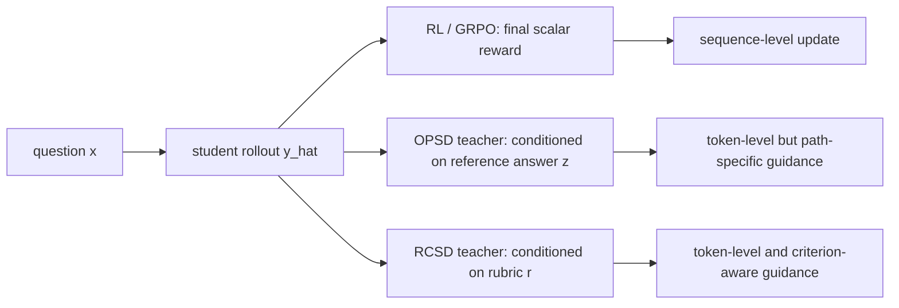

# Rethinking Reward Supervision: Rubric-Conditioned Self-Distillation

## 元信息

- 论文：Rethinking Reward Supervision: Rubric-Conditioned Self-Distillation
- 作者：Siyi Gu, Jialin Chen, Sophia Zhou, Arman Cohan, Rex Ying
- 机构：Yale University
- 日期：2026-06-17 17:54:04 UTC 提交到 arXiv
- 链接：https://arxiv.org/abs/2606.19327
- 代码：论文写有 `https://github.com/carriegu0818/RCSD`，但本轮检查时仓库仍为空，不能作为可复现实现证据
- 方向：大模型后训练、on-policy self-distillation、rubric-based supervision、reasoning model

## TL;DR

- 这篇论文要解决的问题很具体：后训练里常见的两类监督都丢信息。
- `GRPO/RLVR` 把一次推理压成最终分数，知道“对或错”，但不知道哪一步该改。
- `OPSD` 给 token-level teacher signal，但 teacher 常常绑定单条参考解，容易把“满足什么标准”误写成“必须沿着这条路径推理”。
- 作者提出 `RCSD`，全称 Rubric-Conditioned Self-Distillation，把 rubric 从“打分表”改成“训练时 teacher 的特权上下文”。
- 方法分两阶段：
  - Stage I 学一个 rubric generator，从题目生成任务专属 rubric。
  - Stage II 让 teacher 读取 rubric，并在 student 自己采样的轨迹上给 token-level guidance。
- 实验基于 `Qwen3-8B`，训练集约 `10k` rubric generation 样本和 `30k` reasoning generation 样本。
- 主表结果：RCSD 平均分 `70.6`，高于 base `65.9`、GRPO `69.2`、GRPO-Rubrics `69.6`、OPSD `69.7`。
- 关键增益集中在科学推理和 rubric-based reasoning：ResearchQA 从 `64.9` 到 `73.1`，RubricHub 从 `50.8` 到 `55.7`。
- 局限也清楚：收益平均只有 `0.9` 分高于 OPSD；医学 OOD 上并非所有指标最好；生成 rubric 有冗余、泛化条目和任务关键性不足的问题；代码仓库尚未公开实现。

## 研究问题：为什么“奖励监督”需要重想？

### 论文真正反对的不是 RL，而是信息压缩

- 论文把后训练监督分成三种信号：
  - `scalar reward`：一次回答结束后给一个分数。
  - `reference-conditioned distillation`：teacher 看参考解，在 student 轨迹上给 token 分布。
  - `rubric-conditioned distillation`：teacher 看评价准则，在 student 轨迹上给 token 分布。
- 作者的核心判断是：
  - 标量奖励太稀疏，无法做细粒度 credit assignment。
  - 参考解太路径化，容易让模型模仿某条解法，而不是学习任务质量维度。
  - rubric 有结构，但如果最后仍聚合成一个 reward，结构信息又被浪费。

### 这篇论文的 claim → mechanism → evidence → boundary

| Claim | Mechanism | Evidence | Boundary |
|---|---|---|---|
| Rubric 不应只用于打分 | 把 rubric 放进 teacher prompt，指导 token-level distillation | Table 1 平均 `70.6`，优于 GRPO、Rubric-GRPO、OPSD | 平均提升不大，需看任务类型 |
| 学到的 rubric 足够接近参考 rubric | Stage I 从问题生成 rubric，Stage II 使用生成 rubric | Table 4：Generated Rubrics 在 GPQA-D/SciBench/PIQA 仅略低于 GT Rubrics | 生成 rubric 更冗余，任务关键性不稳定 |
| forward KL 更适合保留 criterion-aware 分布 | teacher distribution 覆盖多个合格推理路径，forward KL 更 mode-covering | Table 3：Forward KL 平均 `70.6`，高于 JSD `69.6`、Reverse KL `69.9` | 解释依赖训练动态，未证明所有模型/任务适用 |
| RCSD 可跨模型规模起效 | 1.7B、4B、8B 都使用相同 rubric-conditioned teacher signal | Figure 4：RaR、ResearchQA、RubricHub 三个 scale 均提升 | 图中只覆盖 rubric-based benchmarks |
| 方法对 rubric 质量有韧性 | teacher 能部分修正 generic/noisy/random/reduced rubric | Table 6：降质 rubric 仍高于 base | Learned 仍最好，说明 rubric 质量不能忽略 |

## 方法机制：rubric 从“评分表”变成“teacher 侧接口”

### 三条训练路线的差别



- `RL/GRPO` 的问题：
  - 优点是外部验证简单，尤其适合数学、代码、可执行测试。
  - 缺点是回答中间的错误位置被压扁到一个 reward。
- `OPSD` 的问题：
  - 优点是 teacher 可以在 student prefixes 上给 dense supervision。
  - 缺点是 teacher 条件里有参考答案，容易把单一路径当成最优路径。
- `RCSD` 的替换：
  - teacher 读取 rubric，而不是读取唯一 reference trajectory。
  - student 推理时不读取 rubric；rubric 是训练期 privileged supervision。

### Rubric 的结构

论文设定一个题目 `x` 对应 rubric：

```text
r = {c1, c2, ..., cK}
```

每个 criterion `ck` 包含：

- title：评价维度名称。
- description：自然语言说明。
- weight：`Essential`、`Important`、`Optional` 或 `Pitfall`。

这一步的意义不只是格式化提示词，而是把“什么算好答案”显式拆成多个维度。

## 公式：从 off-policy imitation 到 rubric-conditioned OPD

### Off-policy distillation

```text
L_off = E_{x~D, y~p_T(.|x)} [
  sum_t D( p_T(.|x, y_<t) || p_S(.|x, y_<t) )
]
```

- `y` 来自 teacher。
- student 训练时看到 teacher 前缀。
- 推理时 student 看到自己的前缀，因此有 distribution mismatch。

### On-policy distillation

```text
y_hat ~ p_S(.|x)

L_OPD = E_{x~D, y_hat~p_S(.|x)} [
  1/|y_hat| * sum_t D(
    p_T(.|x, y_hat_<t) || p_S(.|x, y_hat_<t)
  )
]
```

- `y_hat` 来自 student。
- teacher 在 student 自己走到的 prefix 上给分布。
- 这缓解了 off-policy mismatch。

### OPSD：reference-conditioned teacher

```text
L_OPSD = E_{(x,z)~S, y_hat~p_S(.|x)} [
  1/|y_hat| * sum_t D(
    p_T(.|x, z, y_hat_<t) || p_S(.|x, y_hat_<t)
  )
]
```

- `z` 是特权信息，通常是 gold solution 或 reference answer。
- 问题是 `z` 常常描述一条具体路径。
- 当 student 走到另一条仍然可能正确的路径时，teacher signal 可能变成“拉回参考路径”，而不是“修正局部错误”。

### RCSD：rubric-conditioned teacher

```text
L_reason = E_{y_hat~p_S^Y(.|x)} [
  sum_t KL(
    p_T^Y(.|x, r, y_hat_<t) || p_S^Y(.|x, y_hat_<t)
  )
]
```

- `r` 是 rubric。
- teacher 不再被单条答案路径绑定，而是读取质量标准。
- 训练信号仍然是 token-level。
- student inference 时只看 `x`，不需要 rubric。

## 两阶段训练：先学“标准”，再学“按标准推理”

### Stage I：学习 rubric generator

- 输入：训练集中的题目 `x`、参考答案 `y*`。
- student rubric generator 只看 `x`。
- teacher rubric generator 看 `x` 和 `y*`。
- student 先采样自己的 rubric rollout：

```text
r_hat ~ p_S^R(.|x)
```

- 再沿着 `r_hat` 的 prefix 对齐 teacher/student 分布：

```text
L_rubric = E_{r_hat~p_S^R(.|x)} [
  sum_t KL(
    p_T^R(.|x, y*, r_hat_<t) || p_S^R(.|x, r_hat_<t)
  )
]
```

这一阶段的关键不是让模型背参考答案，而是把参考答案中隐含的评价维度蒸馏成可复用 rubric。

### Stage II：训练 rubric-conditioned reasoner

- 先用 Stage I 生成 `r_hat`。
- reasoner student 只看问题 `x` 并采样答案 `y_hat`。
- reasoner teacher 看 `x`、`r_hat` 和 `y_hat_<t`。
- 训练目标是让 student 在自己的轨迹上匹配 rubric-conditioned teacher。

### 伪代码复原

```text
Input:
  D = {(x, r*, y*)}
  rubric generator p_S^R
  reasoner p_S^Y

Stage I:
  for each example (x, y*) in D:
    r_hat <- sample p_S^R(. | x)
    teacher <- p_T^R(. | x, y*, r_hat_<t)
    student <- p_S^R(. | x, r_hat_<t)
    update p_S^R by minimizing L_rubric

Stage II:
  for each example x in D:
    r_hat <- sample p_S^R(. | x)
    y_hat <- sample p_S^Y(. | x)
    teacher <- p_T^Y(. | x, r_hat, y_hat_<t)
    student <- p_S^Y(. | x, y_hat_<t)
    update p_S^Y by minimizing L_reason

Output:
  a reasoner that does not need rubrics at inference time
```

## 实验设置：训练量、基线和评测面

### 数据构造

| 用途 | 数据来源 | 规模 | 作用 |
|---|---:|---:|---|
| rubric generation | RaR-Science、RubricHub | 约 `10k` | 学任务专属评价准则 |
| reasoning generation | natural_reasoning，过滤空参考答案 | 约 `30k` | 训练 rubric-guided reasoner |
| open-ended 评测 | RaR-Science、RubricHub 子集 | 每个 test 取 `500` | 用 judge 评估开放回答 |
| OOD 评测 | MedMCQA、PubMedQA | 未在主训练域中 | 看科学推理训练是否迁移到医学 |

### 基线

- `Qwen3-8B`：基础模型。
- `SFT`：用 distilled CoT trajectories 训练。
- `GRPO`：使用 LLM judge 给 scalar reward。
- `GRPO-Rubrics`：judge 根据 rubric 产生聚合 reward。
- `OPSD`：teacher 条件在 reference answer 上，在 student trajectory 上给 token-level guidance。

### 训练细节

| 参数 | GRPO | RCSD / OPSD | SFT |
|---|---:|---:|---:|
| Learning rate | `5e-6` | `5e-6` | `5e-6` |
| Max completion length | `4096` | `4096` | `4096` |
| Batch size | `32` | `32` | `32` |
| Sampling temperature | `1.2` | `1.2` | `1.2` |
| Training steps | `500` | `100` | `500` |
| Generations per prompt | `4` | `1` | `1` |

这里有一个重要比较点：RCSD/OPSD 只训练 `100` steps，而 GRPO 训练 `500` steps。论文把它解释为延续 prior self-distillation implementation，但读者也应注意这不是完全同训练预算的对照。

## 主结果：提升在哪里？

| Method | GPQA-D | SciBench | PIQA | RaR | ResearchQA | RubricHub | Avg |
|---|---:|---:|---:|---:|---:|---:|---:|
| Qwen3-8B | 60.6 | 69.1 | 90.2 | 59.7 | 64.9 | 50.8 | 65.9 |
| +SFT | 62.0 | 65.4 | 89.2 | 61.5 | 63.2 | 51.2 | 65.4 |
| +GRPO | 63.5 | 69.7 | 90.3 | 68.2 | 71.5 | 51.9 | 69.2 |
| +GRPO-Rubrics | 62.1 | 70.2 | 90.3 | 69.9 | 72.1 | 52.9 | 69.6 |
| +OPSD | 63.6 | 68.7 | 90.1 | 68.5 | 72.8 | 54.5 | 69.7 |
| +RCSD | 64.5 | 70.8 | 90.8 | 68.6 | 73.1 | 55.7 | 70.6 |

### 结果怎么读？

- 相比 base：
  - 平均分从 `65.9` 到 `70.6`，提升 `4.7`。
  - ResearchQA 从 `64.9` 到 `73.1`，提升 `8.2`。
  - RubricHub 从 `50.8` 到 `55.7`，提升 `4.9`。
- 相比 GRPO：
  - 平均高 `1.4`。
  - 说明 dense token guidance 的确可能比 scalar reward 更充分使用 rubric 信息。
- 相比 OPSD：
  - 平均高 `0.9`。
  - 这支撑作者的主张，但增益不算压倒性。
- 相比 GRPO-Rubrics：
  - 平均高 `1.0`。
  - 关键不是“有没有 rubric”，而是 rubric 是否参与 token-level learning。

## OOD：医学 benchmark 上的信号更克制

| Method | MedMCQA | PubMedQA |
|---|---:|---:|
| Qwen3-8B | 64.5 | 74.2 |
| +GRPO | 65.1 | 76.2 |
| +GRPO-Rubrics | 65.6 | 74.2 |
| +OPSD | 66.0 | 74.4 |
| +RCSD | 65.8 | 75.1 |

### 这里不能过度解读

- RCSD 相比 base 有提升：
  - MedMCQA：`64.5 → 65.8`。
  - PubMedQA：`74.2 → 75.1`。
- 但它不是两项都最好：
  - MedMCQA 上 OPSD `66.0` 略高。
  - PubMedQA 上 GRPO `76.2` 更高。
- 更合理的结论是：
  - RCSD 没有造成明显 catastrophic forgetting。
  - 科学推理 rubric supervision 可以迁移一些能力。
  - 但医学 OOD 不足以证明 RCSD 普遍优于 RL 或 OPSD。

## 消融：forward KL、rubric source、rubric quality

### Loss type

| Loss Type | GPQA-D | SciBench | PIQA | RaR | ResearchQA | RubricHub | Avg |
|---|---:|---:|---:|---:|---:|---:|---:|
| Forward KL | 64.5 | 70.6 | 90.8 | 68.6 | 73.1 | 55.7 | 70.6 |
| JSD | 62.1 | 69.2 | 89.9 | 67.1 | 73.1 | 56.2 | 69.6 |
| Reverse KL | 63.4 | 69.1 | 90.5 | 69.1 | 72.6 | 54.8 | 69.9 |

- Forward KL 平均最好。
- 论文解释是：rubric-conditioned teacher 可能给出多种合格推理路径，forward KL 更鼓励 student 覆盖 teacher 分布。
- Reverse KL 更 mode-seeking，可能压缩有效但低概率的解法。
- JSD 更保守，RubricHub 单项最好，但平均更低。

### Rubric source

| Rubric Source | GPQA-D | SciBench | PIQA | Criteria Avg | Criteria Min | Criteria Max | Token Len Avg |
|---|---:|---:|---:|---:|---:|---:|---:|
| GT Rubrics | 65.2 | 71.0 | 91.0 | 7.5 | 7 | 12 | 248.7 |
| Generated Rubrics | 64.5 | 70.6 | 90.8 | 8.4 | 6 | 20 | 236.6 |

- 生成 rubric 接近 GT rubric，但 criterion 数量更分散。
- 这说明 Stage I 可用，但也暴露一个倾向：生成 rubric 更容易过度拆分。
- 论文后面的失败分析正好解释了这一点。

### Stage-I generator 是否必要？

| Method | GPQA-D | SciBench | PIQA | RaR | ResearchQA | RubricHub | Avg |
|---|---:|---:|---:|---:|---:|---:|---:|
| Qwen3-8B | 60.6 | 69.1 | 90.2 | 59.7 | 64.9 | 50.8 | 65.9 |
| +8b Direct | 62.0 | 70.2 | 90.4 | 68.5 | 72.9 | 55.4 | 69.9 |
| +14b Direct | 64.9 | 70.6 | 90.1 | 69.2 | 72.8 | 56.5 | 70.7 |
| +RCSD | 64.5 | 70.8 | 90.8 | 68.6 | 73.1 | 55.7 | 70.6 |

- `+14b Direct` 平均 `70.7`，略高于 RCSD `70.6`。
- 但它需要更大的 teacher 直接生成 rubric。
- RCSD 的意义是把 rubric construction amortize 成 Stage-I generator。
- 所以这里的结论不是“generator 绝对更强”，而是“接近大模型 direct rubric，同时更可扩展”。

### Rubric quality degradation

| Rubric Variant | GPQA-D | SciBench | PIQA | RaR | ResearchQA | RubricHub | Avg |
|---|---:|---:|---:|---:|---:|---:|---:|
| Qwen3-8B | 60.6 | 69.1 | 90.2 | 59.7 | 64.9 | 50.8 | 65.9 |
| Generic | 62.1 | 70.2 | 90.2 | 68.7 | 72.6 | 55.6 | 69.9 |
| Noisy | 61.6 | 70.9 | 90.4 | 68.8 | 72.4 | 55.3 | 69.9 |
| Random | 63.3 | 70.3 | 90.5 | 68.2 | 72.6 | 54.8 | 70.0 |
| Reduced | 63.0 | 70.6 | 90.6 | 68.8 | 72.3 | 55.7 | 70.2 |
| Learned | 64.5 | 70.8 | 90.8 | 68.6 | 73.1 | 55.7 | 70.6 |

- 令人意外的是，generic/noisy/random/reduced 都明显高于 base。
- 这暗示 teacher 本身也有纠错能力，不是完全受 rubric 支配。
- Learned 仍然平均最好，说明 instance-specific rubric 的相关性有价值。
- Reduced 的表现很强，说明简短但相关的 rubric 可能比冗长 rubric 更接近实践最优。

## Figure/Table 逐项证据解读

### Figure 1：同一错误轨迹上的三种信号

- RL 给整个序列一个 reward。
- OPSD 给 dense guidance，但参考路径可能导致全局改写。
- RCSD 试图保留正确步骤，只惩罚局部不满足 rubric 的位置。
- 这张图支撑“criterion-aware credit assignment”的直觉，但不是实验结果。

### Figure 2：方法位置图

- RL：反馈变成 scalar。
- OPSD：teacher conditioned on reference answer。
- RCSD：Stage I 学 rubric，Stage II 用 rubric 诱导 teacher signal。
- 这张图说明论文真正创新点在 supervision interface，而不是新的基础模型架构。

### Table 1：主结果

- 最强证据来自平均分 `70.6`。
- 但需要按任务拆开看：
  - PIQA 已接近天花板，差距很小。
  - ResearchQA/RubricHub 更能体现 rubric 的作用。

### Figure 3：训练动态

- Forward KL 的 student entropy 稳定上升。
- Reverse KL 降低 entropy，更符合 mode-seeking 预期。
- JSD 较保守。
- 这给 Table 3 的 loss 选择提供机制解释。

### Figure 4：scale ablation

- 1.7B、4B、8B 都在 RaR、ResearchQA、RubricHub 上改善。
- 论文报告 8B 上 RaR 提升 `8.9`，ResearchQA 提升 `8.2`，RubricHub 提升 `4.8`。
- 这说明 RCSD 不是只在某个单点模型上有效。

### Figure 5：training checkpoints

- GPQA-D 在 `120` steps 达峰。
- SciBench 早期改善后保持相对稳定。
- 这提示 RCSD 不一定要长时间训练；适中训练可能更稳。

## 失败分析：学到的 rubric 有哪些问题？

### 论文给出的两个案例

| 案例 | Learned Rubric 问题 | Reference Rubric 特点 |
|---|---|---|
| phonon / Bose-Einstein | 10 条 criterion，多个条目重复谈温度/频率关系 | 7 条，更集中于公式、色散关系、温度分析、频率趋势 |
| soda-lime titration | 加入 Step-by-Step、Application Context 等泛化条目 | 更集中于分开反应、化学计量、最终体积、单位一致性 |

### 这说明了什么？

- Stage I 学到的 rubric 通常能抓住主题。
- 但它倾向于：
  - bloated：条目过多。
  - redundant：多个 criterion 重复同一评价轴。
  - weakly task-critical：加入“解释清晰”“应用背景”等不一定决定答案的泛化标准。
- 这正是 RCSD 后续最值得改进的部分：
  - rubric generator 不只要生成“看起来合理”的标准。
  - 它要生成能最大化 teacher-side token guidance 差异的标准。

## 理论附录：为什么生成 rubric 不必逐字等于参考 rubric？

论文给出一个 total variation bound。

设：

```text
p*_t = p_T^Y(. | x, r*, y_hat_<t)
p^_t = p_T^Y(. | x, r_hat, y_hat_<t)
q_t  = p_S^Y(. | x, y_hat_<t)
```

若 `-log q_t(y) <= B_t`，则：

```text
| E_{y~p*_t}[-log q_t(y)] - E_{y~p^_t}[-log q_t(y)] |
<= 2 * B_t * TV(p*_t, p^_t)
```

扩展到整条 student rollout：

```text
| L_CE(r_hat) - L_CE(r*) |
<= E_{y_hat~p_S^Y(.|x)} [
  sum_t 2 * B_t * TV(p*_t, p^_t)
]
```

直观含义：

- 生成 rubric 不需要和 reference rubric 表面一致。
- 真正重要的是二者诱导的 teacher next-token distribution 是否接近。
- 这也解释了为什么 `Generated Rubrics` 可以接近 `GT Rubrics`。
- 但这个 proposition 是稳定性界，不是性能保证；如果生成 rubric 诱导的 teacher distribution 偏离很大，界也会变松。

## 相关工作位置：RCSD 和 RGSD、ROPD、SD-Zero、Skill-SD 的关系

### 与 rubric-based RL 的关系

- Rubric-based RL 把 rubric 变成更细的评分准则。
- 但训练时常常仍聚合为 scalar reward。
- RCSD 的变化是：rubric 不只影响分数，而是影响 teacher token distribution。

### 与 OPSD 的关系

- OPSD 解决 off-policy mismatch，提供 dense token signal。
- 但 privileged context 常是 reference answer。
- RCSD 把 privileged context 换成 rubric，减少 path-specific imitation。

### 与 SD-Zero / Skill-SD 的关系

- SD-Zero 把 binary reward 转成 reviser teacher 的 dense signal。
- Skill-SD 把成功轨迹总结为 skill，再作为 teacher-side privileged information。
- RCSD 的 parallel 是：
  - 它把 rubric 当作 privileged information。
  - 它强调 criterion-level supervision，而不是 response revision 或 skill bank。

### 与 2606.12507 RGSD 的关系

- 搜索中出现的 RGSD 也把 rubric-conditioned teacher distribution 蒸馏到 student。
- RCSD 与它处在同一新脉络：把 rubric 从 verifier/reward 改成 distillation interface。
- 本文的独特点在于两阶段设计：
  - 先学 task-specific rubric generator。
  - 再用生成 rubric 做 reasoning distillation。

## 研究者视角的核心判断

### 最值得带走的机制

- 如果 rubric 最终只变成 reward，很多结构会丢失。
- 如果 reference answer 直接作为 teacher context，模型可能学到路径依赖。
- 把 rubric 放在 teacher 侧，能同时保留：
  - token-level density。
  - student on-policy prefix。
  - criterion-level structure。

### 最值得警惕的证据边界

- 论文没有公开可运行代码；GitHub 仓库目前为空。
- 主结果平均提升明显，但相对 OPSD 的优势是 `0.9` 分，不是数量级跃迁。
- OOD 医学结果混合，不能证明普遍迁移。
- 生成 rubric 的质量问题仍真实存在。
- 评测中 open-ended tasks 依赖 `gpt-4.1-mini` judge，仍有 judge calibration 和 prompt sensitivity 风险。

### 对后训练方向的启发

- 后训练可能正在从“奖励函数设计”转向“监督接口设计”。
- 关键问题不只是 reward 是否准确，而是监督信息以什么粒度进入优化。
- 未来值得追问：
  - rubric 是否能自动压缩为更少、更判别的 criteria？
  - teacher conditioned on rubric 时，哪些 token 真的发生分布变化？
  - 能否用 attribution 找出 rubric criterion 与 token update 的对应关系？
  - 对代码、Agent、长期任务，这种 criterion-aware distillation 是否比 outcome verifier 更稳？
  - 若 rubric 由同一个 base model 生成，会不会形成自我确认偏差？

## 结论

- RCSD 不是简单的“再加一个 rubric prompt”。
- 它把 rubric 的角色从评价阶段前移到训练信号生成阶段。
- 论文最强的贡献是把三个要素组合在一起：
  - on-policy student rollout。
  - teacher-side privileged rubric。
  - token-level KL distillation。
- 实验显示这套组合在科学推理和 rubric-guided reasoning 上优于 GRPO、GRPO-Rubrics 和 OPSD。
- 但可复现性、生成 rubric 的冗余性、judge-based 评测依赖和 OOD 泛化仍是主要边界。
