# Connect the Dots：把长生命周期 Agent 的“学会用经验”作为 RL 后训练目标

### 元信息

| 项目 | 内容 |
|---|---|
| 论文 | Connect the Dots: Training LLMs for Long-Lifecycle Agents with Cross-Domain Generalization Via Reinforcement Learning |
| 作者 | Yanxi Chen, Weijie Shi, Yuexiang Xie, Boyi Hu, Yaliang Li, Bolin Ding, Jingren Zhou |
| 机构 | Alibaba Group；HKUST / HKU 实习合作 |
| 日期 | 2026-06-18 提交，arXiv:2606.20002v1 |
| 方向 | 大模型 Agent；强化学习后训练；长生命周期上下文管理 |
| 原文 | https://arxiv.org/abs/2606.20002 |
| HTML | https://arxiv.org/html/2606.20002v1 |
| 代码 | https://github.com/agentscope-ai/Trinity-RFT/tree/research/cod/examples/research_cod |

### TL;DR

- 论文提出 `Connect the Dots`（CoD），目标不是让 LLM 在单个任务上更会推理，而是训练一种长生命周期 Agent 元能力：部署到环境后连续做一串相关任务，主动探索、从反馈中写入上下文，再用更新后的上下文提升后续任务表现。
- CoD 把任务打成 pack，并交替执行 `solve-task` 和 `update-context` episode；当前实现里的跨 episode 上下文是一个短 `Hints:` block，会被追加到后续任务系统提示里。
- 训练上，作者用 GRPO 风格的端到端 RL，但把一次 rollout 从“单题答案”提升为“任务序列 + 上下文更新序列”；奖励归因按动态规划思想，把当前 episode 和未来 solve-task 奖励一起计入 return。
- 实验用 Qwen3-8B-Instruct（thinking disabled），训练环境包括 FrozenLake-Obscure 和 FrozenLake+Alchemy 混合；评估包括更难的同域 FrozenLake、跨域 Alchemy、TerminalSimulator，以及 Ralph-loop 重复尝试设置。
- 关键数字：在 FrozenLake-Obscure 训练时，位置 0 的平均奖励约从 `0.18` 到 `0.45`，而第 4 个任务位置（position 3）约从 `0.28` 到 `0.76`；这说明模型不只是单题变强，而是在任务序列后部更能利用自己写下的环境经验。
- 代码 README 确认实现基于 Trinity-RFT，核心目录包括 `trinity/common/workflows/connect_the_dots/`、`cod_workflow.py`、各环境 workflow、以及 `trinity/algorithm/advantage_fn/cod_advantage.py`。
- 局限也明确：目前是 proof-of-concept；环境只有 FrozenLake-Obscure、Alchemy-Random、Terminal、Learn2Ask 等简化场景；上下文机制只是 hint；RL 算法仍含启发式重加权，长序列和非平稳环境还没有充分验证。

### 研究问题：长生命周期 Agent 缺的不是一次答题能力

- 论文关心的 Agent 场景不是一次性 benchmark。
- 它设想的部署过程更像：
  - Agent 进入一个具体环境；
  - 连续收到不同但相关的任务；
  - 每次任务后观察反馈；
  - 把有用经验压缩进自己的上下文；
  - 后续任务不再从零开始。

作者把这种能力称为 CoD meta-capability：

> 在同一环境中，Agent 连续解决一串相关任务，并主动探索、学习、自更新环境上下文，让未来任务表现逐步变好。

为了避免泛泛而谈，可以把它和常见能力拆开看：

| 能力 | 典型训练单位 | 目标 | CoD 认为的问题 |
|---|---|---|---|
| 单轮推理 | 一个 prompt / 一个答案 | 当前题答对 | 不训练跨任务经验沉淀 |
| 多轮工具 Agent | 一个长 horizon task | 当前任务完成 | 仍可能每个任务从零开始 |
| 标准 task-by-task RL | 单个任务 rollout | 每题 reward 最大 | 不鼓励把经验写给未来任务 |
| CoD | 一个任务序列 pack | 当前与未来任务 reward 一起最大 | 显式训练“学会更新上下文” |

### 论文主张：把 RL rollout 再往上提升一级

作者的关键主张是：

- RLHF / RLVR 时代，一个 rollout 可以是一段 token。
- Agent RL 时代，一个 rollout 可以是一串 turn。
- CoD 时代，一个 rollout 应该是一串任务和上下文更新。

```text
single-turn RL:
  prompt -> answer -> reward

long-horizon agent RL:
  obs_0 -> action_0 -> obs_1 -> action_1 -> ... -> reward

CoD-Train:
  solve task_0 -> update context_1
  solve task_1 with context_1 -> update context_2
  solve task_2 with context_2 -> update context_3
  solve task_3 with context_3 -> rewards over the sequence
```

这个层级提升很重要：

- `solve-task` episode 负责在当前上下文下完成任务。
- `update-context` episode 负责把轨迹、reward、feedback 压缩成下一步可用的 hint。
- 后续任务成功与否，会反向决定前面 context update 是否值得奖励。

### CoD-Deploy 与 CoD-Train

| 阶段 | 输入 | 输出 | 训练/部署含义 |
|---|---|---|---|
| CoD-Deploy | 新环境 `M`、任务序列 `x_i^M`、上下文 `z_i^M` | 更新后的上下文 `z_{i+1}^M` 与任务答案 | 梯度-free 的在线试错学习 |
| CoD-Train | 训练环境 `A, B, ...` 中的任务 pack | RL 梯度更新模型权重 | 让 rollout 形态匹配未来部署形态 |

论文 Figure 1 的含义可以用 Mermaid 表达：

```mermaid
flowchart LR
  A["Environment A / B during CoD-Train"] --> B["Task pack"]
  B --> C["solve x0 without hint"]
  C --> D["update z1 from trajectory + feedback"]
  D --> E["solve x1 with z1"]
  E --> F["update z2"]
  F --> G["solve x2 with z2"]
  G --> H["RL credit assignment over current + future rewards"]
  H --> I["Model weights learn CoD meta-capability"]
  I --> J["New environment M during CoD-Deploy"]
```



### 任务设计：为什么普通 benchmark 不够？

论文强调，CoD 训练环境必须让“积累环境知识”有价值。

- 如果每个任务都能从零满分解决：
  - CoD-Train 可能退化为标准 task-by-task RL；
  - 模型没有动力写上下文；
  - 后续位置 reward 不一定更高。

- 理想环境应该满足：
  - 存在部署前无法知道的隐藏信息；
  - 多个任务共享某种规则、地图、配方、工具行为或坑点；
  - 前面任务反馈能帮助后面任务；
  - 评估能看出 position 越靠后是否越好。

### 实现环境：FrozenLake、Alchemy、Terminal、Learn2Ask

代码 README 给出的环境表很清楚：

| Environment | workflow type | pack 内可迁移知识 |
|---|---|---|
| FrozenLake-Obscure | `cod_frozenlake_obscure_workflow` | 隐藏 action mapping：代码 1-4 分别代表上下左右哪个移动 |
| Alchemy-Random | `cod_random_alchemy_workflow` | 隐藏合成配方：哪些元素组合能生成新元素 |
| Terminal | `cod_terminal_workflow` | 命令、路径、常见坑点、文件大致位置 |
| Learn2Ask | `cod_learn2ask_workflow` | 什么时候继续提问，什么时候停止并给诊断 |

这几个环境共同特点是：

- 单个任务本身可以很短；
- 任务之间共享隐藏规律；
- 环境反馈能转换成 hint；
- 后续任务如果能利用 hint，就会更容易。

### 训练算法：GRPO 风格，但 return 不是单个最终 reward

论文采用 GRPO-style 算法，不引入 critic。

但是标准 GRPO 通常假设一次 rollout 只有一个 outcome reward；CoD 里一次 rollout 包含多个 solve-task 和 update-context episode。

作者因此定义 episode-level return：

```text
R^x_{i,j} = (1 / (S - j)) * sum_{j <= l <= S-1} r^x_{i,l}

R^z_{i,j} = (1 / (S - j + 1)) * (r^z_{i,j} + sum_{j <= l <= S-1} r^x_{i,l})
```

变量解释：

| 符号 | 含义 |
|---|---|
| `S` | 一个 task sequence / pack 的长度 |
| `G` | 同一 task sequence 的 rollout group size |
| `r^x_{i,j}` | 第 `i` 条轨迹中第 `j` 个 solve-task episode 的 reward |
| `r^z_{i,j}` | 第 `i` 条轨迹中第 `j` 个 update-context episode 的 reward |
| `R^x_{i,j}` | 当前 solve episode 加未来 solve rewards 的平均 return |
| `R^z_{i,j}` | 当前 context update 加未来 solve rewards 的平均 return |

然后对同一位置做 group baseline：

```text
bar{R}^x_j = (1 / G) * sum_i R^x_{i,j}
bar{R}^z_j = (1 / G) * sum_i R^z_{i,j}

A^x_{i,j} = R^x_{i,j} - bar{R}^x_j
A^z_{i,j} = R^z_{i,j} - bar{R}^z_j
```

直观含义：

- 一个更新 hint 的 episode 没有直接任务成功 reward。
- 但如果它写出的 hint 让后面任务变好，它就应该拿到未来 reward 的 credit。
- 这就是论文把 Bellman / dynamic programming 原则引入 CoD 的地方。

### 训练伪代码：从 pack 到梯度

```text
Input:
  model pi_theta
  environments A, B, ...
  task pack length S
  rollout group size G
  update-context prompt
  solve-task workflows

For each training batch:
  1. Sample an environment and a sequence of related tasks.
  2. For each rollout group member i in 1..G:
     2.1 Start with empty hint z_0.
     2.2 For j in 0..S-1:
         solve x_j conditioned on z_j.
         collect reward r^x_{i,j}, trajectory, feedback.
         update hint z_{j+1}.
         collect small format reward r^z_{i,j}.
  3. Compute rewards-to-go returns for solve and update episodes.
  4. Compute position-wise baselines across G rollouts.
  5. Convert returns into advantages.
  6. Apply GRPO-style policy gradient with one-sided clipping / adaptive reweighting.

Output:
  model that can improve across task positions by maintaining context
```

### 工程结构：README 透露了什么？

代码发布在 Trinity-RFT 的 `research/cod` 分支。

| 路径 | 作用 |
|---|---|
| `examples/research_cod/get_frozen_lake_data.py` | 生成 FrozenLake-Obscure 数据 |
| `examples/research_cod/get_alchemy_data.py` | 生成 Alchemy-Random 数据 |
| `examples/research_cod/get_terminal_data.py` | 生成 Terminal 数据 |
| `examples/research_cod/exp_plan_final/train/` | 训练配置 |
| `examples/research_cod/exp_plan_final/bench/` | 评估配置 |
| `trinity/common/workflows/connect_the_dots/cod_workflow.py` | pack、iterative hint、task reward 主流程 |
| `trinity/common/workflows/connect_the_dots/base_workflow.py` | `AsyncCoDMultiStepWorkflow` 基类 |
| `trinity/common/workflows/connect_the_dots/<env>/workflow.py` | 每个环境的渲染、打分和反馈逻辑 |
| `trinity/algorithm/advantage_fn/cod_advantage.py` | CoD reward-to-go credit assignment |

README 的 quickstart 还说明：

- 训练模型是通过 `trinity run --config ...` 启动；
- FrozenLake 和 Alchemy 默认各生成 `train_size=50000`、`test_size=4000`；
- 训练主实验包括 FrozenLake-Obscure 和 mixed FrozenLake+Alchemy；
- 评估脚本会测同域 harder environment 和跨域 Alchemy / Terminal；
- 关键监控指标是 `reward_iterative_hint_e2e_taskset_{ts}_pos_{pos}`。

### 实验设置：不是普通“每题独立”的 RL

| 设置项 | 数值 / 描述 |
|---|---|
| 初始模型 | Qwen3-8B-Instruct，thinking disabled |
| 训练 / 评估 pack 长度 | `4 / 8` |
| Optimizer | AdamW，`beta1=0.9`，`beta2=0.999` |
| Learning rate | `1e-6` |
| Rollout batch size | `32` |
| Rollout group size | `8` |
| Sampling temperature | `1.0` |
| Max prompt tokens | train `10,000`；eval `30,000` |
| Max response tokens | hard cap `2,000` |
| Policy loss | `REC-OneSide-NoIS`，`epsilon_low = epsilon_high = 0.2` |
| Return estimator | mean of rewards-to-go |
| Context mechanism | keep-all within episode；cross-episode hint |

这里最重要的设计是：

- train pack 长度 4；
- eval pack 长度 8；
- 因此评估不是记住固定长度模式，而是看模型能否把“越做越会”的趋势延展到更长任务序列。

### 主实验 A：FrozenLake-Obscure 训练

FrozenLake-Obscure 的隐藏信息是 action mapping。

- 在标准 FrozenLake 里，动作是上下左右。
- 在 Obscure 版本里，动作代码 1-4 的含义被隐藏。
- Agent 必须通过试错和反馈推断映射，再写入 hint。
- 后续任务如果共享映射，就应该做得更好。

论文报告的核心观察：

| 位置 | 训练前后变化 | 解释 |
|---|---|---|
| position 0 | 平均 reward 约 `0.18 -> 0.45` | 无上下文的从零解题能力有所提高，但受隐藏信息限制 |
| position 3 | 平均 reward 约 `0.28 -> 0.76` | 第 4 个任务显著受益于前面任务积累的 hint |

这组数字是全文最关键证据之一。

- 如果模型只是学会 FrozenLake 单题技巧，position 0 和 position 3 应该同步提高。
- 如果 CoD 生效，后面 position 应该提高更多。
- 实验正是后者：靠后的任务位置提升更大，说明模型学会利用自己沉淀的环境上下文。

### 主实验 B：FrozenLake + Alchemy 混合训练

混合训练把两个不同机制的环境放在一起：

- FrozenLake-Obscure：学习隐藏动作映射。
- Alchemy-Random：学习隐藏合成配方。

论文 Figure 4 的作用是验证：

- CoD 不是只针对单一 toy environment；
- 训练可以覆盖多个环境；
- 模型能在不同类型的“可迁移环境知识”之间形成通用更新策略。

论文没有把所有曲线数字写成表格，但文字结论强调：

- 训练 reward 随 RL steps 上升；
- 后续 position reward 高于早期 position；
- 混合训练后仍能看到同域和跨域 generalization。

### 跨域泛化：为什么 TerminalSimulator 要谨慎解读？

论文评估了跨域环境，包括 Alchemy-Random 和 TerminalSimulator。

作者对 TerminalSimulator 给了谨慎说明：

- 在 CoD-Deploy 设置中，一串不同 Terminal tasks 之间可能没有足够紧密关系。
- 因此后续任务相对早期任务不一定持续提高。
- 但在 Ralph-loop 设置中，Agent 重复尝试同一个任务，后续 episode reward 会更高。

这很重要：

- CoD 需要任务之间存在可复用信息。
- 如果任务序列本身没有共享结构，写 hint 也未必能帮后续任务。
- 这说明 CoD 的成功既依赖模型能力，也依赖任务 pack 的结构。

### Ralph-loop：同一个任务反复尝试也是 CoD 特例

Ralph-loop 可以理解为：

```text
task x
attempt 1 -> feedback -> update context
attempt 2 -> feedback -> update context
attempt 3 -> ...
```

它和 CoD 的关系：

- CoD 通常是一串不同但相关任务。
- Ralph-loop 是同一个任务重复尝试。
- 二者都要求 Agent 把反馈转化为下一次尝试的有效上下文。

论文把 CoD 训练迁移到 Ralph-loop，是为了测试：

- 模型学到的是否只是 FrozenLake / Alchemy 的 domain trick；
- 还是更一般的“从前次失败中写下可用经验”的策略。

### Figure 逐项证据解读

| 图 | 支撑的主张 | 不能证明的事 |
|---|---|---|
| Figure 1 | CoD-Deploy 和 CoD-Train 的 rollout 形态一致，都交替 solve-task 和 update-context | 不能证明这种形态一定优于所有 memory scaffold |
| Figure 2 | episode-level advantage 用未来 solve rewards 给 context update 归因 | 不能证明该 baseline 在长序列下最优 |
| Figure 3 | FrozenLake-Obscure 训练 reward 上升，position 3 提升大于 position 0 | 不能证明复杂真实软件仓库也有相同规律 |
| Figure 4 | 混合 FrozenLake+Alchemy 训练仍能看到 CoD 效果和泛化迹象 | 不能证明跨所有环境都稳健 |

### 与标准后训练的关系

论文在讨论部分明确说，CoD 不是替代 task-by-task RL。

更合理的定位是：

- task-by-task RL 提升“晶体化”的领域能力；
- CoD 提升“流体化”的环境适应能力；
- 两者可以串联或蒸馏融合。

作者给出两个集成方向：

1. 把 CoD-Train 当作现有 post-training pipeline 的额外 sequential stage。
2. 先训练 CoD teacher model，再和领域 teacher 一起通过 on-policy distillation 或 model merging 合并。

这对大模型后训练很有启发：

- 当前很多 RLVR 工作把 task prompt 当作独立样本。
- CoD 则把样本组织成“环境内任务序列”。
- 数据组织方式本身变成训练目标的一部分。

### 与 Agent memory / Skills 的关系

README 和论文都说明，当前实现只用一个短 `Hints:` block。

但作者明确把未来方向指向：

- persistent memory banks；
- Markdown files for Agent Skills；
- 更复杂的上下文管理机制；
- 更灵活的 rollout pattern。

这意味着 CoD 可被视为 Agent memory 训练的一个最小可复现版本：

- 不是外接一个固定 memory module；
- 而是让模型在 RL 中学习“什么时候写、写什么、怎么用”。

### 局限与失败边界

| 边界 | 论文/README 证据 | 影响 |
|---|---|---|
| proof-of-concept | arXiv comments 写明 work in progress，代码和 arXiv 会持续更新 | 结论应视为早期框架验证 |
| 环境简化 | FrozenLake、Alchemy、Terminal、Learn2Ask | 不能直接外推到真实企业 Agent |
| context 简化 | 当前只是 `Hints:` block | 没验证大型 memory / file-based skills |
| RL 算法启发式 | 作者承认有 heuristic augmentations 和 caveats | 长序列下 return / baseline 可能不稳 |
| Terminal 任务关系弱 | 作者提醒 CoD-Deploy 中 Terminal 后续任务没有明显收益 | CoD 依赖 pack 内共享结构 |
| 非平稳环境未充分覆盖 | future work 提到更长任务序列和 non-stationary environments | 长生命周期真实部署仍需验证 |

### 研究者视角的判断

- CoD 最大贡献不是某个环境上的 reward 数字，而是重新定义了 Agent RL 的训练样本。
- 它把“环境内持续适应”从产品工程 scaffold，转成可训练、可评估、可做 credit assignment 的后训练对象。
- 这与近期 Agent 发展方向高度吻合：Agent 不再只是工具调用器，而是需要维护环境模型、用户模型和项目状态的长期系统。

更尖锐地说：

- 如果未来 coding agent 要像工程师一样维护一个仓库数周，单题 RLVR 不够。
- 如果个人助手要持续了解用户偏好，静态 system prompt 不够。
- 如果安全 Agent 要在同一网络里逐步发现资产和规则，每次任务从零开始也不够。

CoD 提供了一个可实验的抽象：

```text
长期 Agent 能力 = 当前任务求解 + 经验压缩 + 未来任务迁移
```

### 继续追问

1. 什么样的任务 pack 才能真正诱导 CoD？
   - 如果 pack 内任务过于独立，context update 没价值。
   - 如果共享结构太显式，模型可能只学会模板。

2. `Hints:` 是否会成为信息瓶颈？
   - 短 hint 易评估、易训练；
   - 但真实 Agent 可能需要文件、图、索引、代码片段和多层 memory。

3. reward-to-go 平均是否适合超长序列？
   - 作者也指出，任务序列变长后可能需要 discounting 或 sliding window。
   - 否则早期 context update 的 credit 会过于稀释。

4. CoD 和安全边界如何结合？
   - 长生命周期 Agent 会写入长期记忆；
   - 如果错误或恶意反馈被写入 hint，后续任务会被持续污染。
   - 后续需要研究 memory poisoning、权限分层和可审计 context update。

5. CoD teacher 蒸馏是否会比直接 CoD-RL 更经济？
   - 作者提到训练 CoD teacher 后再做 on-policy distillation。
   - 这可能是把长序列 RL 成本摊薄到小模型部署的现实路线。

### 结论

- `Connect the Dots` 是一篇很适合当前 Agent 后训练讨论的早期论文。
- 它把长生命周期 Agent 的核心问题从“怎样接工具”推进到“怎样在同一环境中积累可迁移经验”。
- 方法上，它提出 CoD-Deploy / CoD-Train，对齐训练 rollout 和部署 rollout，并用未来任务 reward 给 context update 做 credit assignment。
- 实验上，FrozenLake-Obscure 的 position 0 与 position 3 差异，是目前最强的正证据。
- 边界上，它仍是 work in progress，环境和上下文机制都较小，RL 算法也有启发式成分。

最值得记住的一句话是：

> 长生命周期 Agent 的后训练不应只奖励“这道题答对”，还应奖励“这次经验是否让后面的题更容易”。

