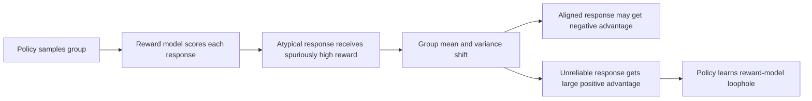
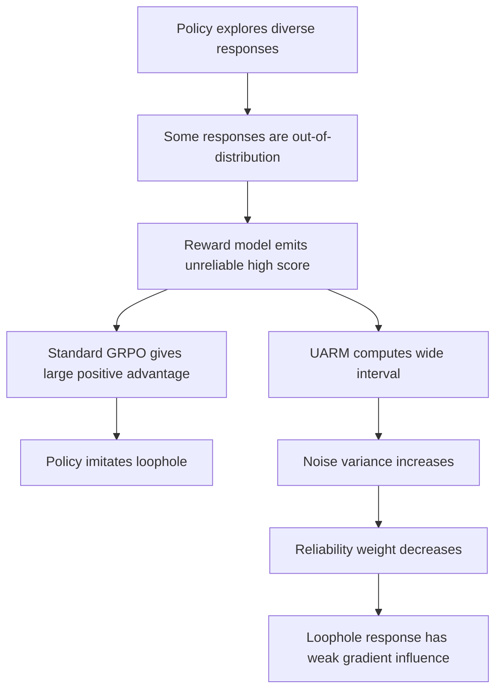

# Uncertainty-Aware Reward Modeling for Stable RLHF：把“奖励模型不确定”接进 GRPO 的优势函数

### 元信息

| 项目 | 内容 |
|---|---|
| 论文 | Uncertainty-Aware Reward Modeling for Stable RLHF |
| 链接 | https://arxiv.org/abs/2606.19818v1 |
| arXiv 版本时间 | 2026-06-18T05:46:32Z |
| 方向 | 大模型后训练、RLHF、奖励模型、GRPO、奖励黑客 |
| 作者机构 | Zhejiang University、Xiaohongshu Inc、Peking University、National University of Singapore |

### TL;DR

- 这篇论文研究一个后训练里很实际的问题：RLHF 依赖奖励模型给 rollout 打分，但多数奖励模型只输出一个标量，不能告诉策略“这次判断我其实不确定”。
- 作者把风险具体落到 GRPO：GRPO 会在同一个 rollout group 内做均值、方差标准化；如果某个异常回答被奖励模型误打高分，它不仅自己得高分，还会扭曲整组均值和方差。
- UARM 的第一步是把奖励模型改成多分位数输出，用 pinball loss 估计条件奖励分布，再用 conformal prediction 在校准集上确定覆盖阈值，得到每个样本的预测区间。
- UARM 的第二步是把区间宽度解释成观测噪声，把 GRPO 的组内方差拆成信号方差与噪声方差，再用样本级可靠性权重缩小高不确定样本的 advantage。
- 实验覆盖 HelpSteer、UltraFeedback、PKU-SafeRLHF；主表报告 `R^2@50`、`MSE@50`、`MAE@50`，即只看不确定性最低的 50% 测试样本。
- 关键数字：UARM 在 `R^2@50` 上从最强基线的 `0.527/0.770/0.955` 提升到 `0.543/0.794/0.985`；在 PKU-SafeRLHF 上把 `MSE@50` 从 `0.042` 降到 `0.013`，`MAE@50` 从 `0.052` 降到 `0.016`。
- 局限也很清楚：论文主要做离线奖励建模实验，没有完整展示在线 RLHF 训练曲线；校准集来自训练分布，遇到严重分布漂移时，区间可靠性仍可能失效。
- 对后训练的意义：这不是又一个“奖励模型更准一点”的小改动，而是把奖励模型的信心显式接入策略更新，讨论的是 RLHF 中“谁有资格驱动梯度”的问题。

### 研究问题：为什么奖励分数不够？

- 标准 RLHF 通常分两段：
  - 先在偏好数据上训练奖励模型 `r_theta(x)`；
  - 再让策略模型 `pi_phi` 最大化奖励模型打出的标量分数。

- 这条链路有一个隐含假设：
  - 奖励模型给出的每个分数都同样可信；
  - 策略优化只需要比较分数大小，不需要知道奖励模型对这个分数有多确定。

- 作者认为这个假设在现代 post-training 中更危险，原因是：
  - 策略训练会不断生成新回答；
  - 新回答可能远离奖励模型训练分布；
  - 奖励模型遇到离群回答时仍会给一个标量；
  - GRPO 这类 group-based 方法会把该标量放进整组标准化；
  - 一个高分但不可靠的离群点可能放大成很强的梯度信号。

| 问题层级 | 常规做法 | UARM 重新追问 |
|---|---|---|
| 奖励模型 | 输出单个 reward | 这个 reward 的置信区间有多宽？ |
| GRPO advantage | 组内均值方差标准化 | 组内方差里有多少是真信号，多少是不确定噪声？ |
| 奖励黑客 | 策略追高分 | 高分样本是否只是奖励模型“猜错但很自信地输出”？ |
| 稳定训练 | 控 KL、clip ratio | 是否应该直接压低高不确定样本的优势权重？ |

### 论文主张与论证路线

| Claim | Mechanism | Evidence | Boundary |
|---|---|---|---|
| 奖励模型缺少不确定性信号，会让策略无条件相信错误分数 | 把奖励模型从点估计器改成分位数估计器，输出条件奖励分布的多个 quantile | 方法部分给出 pinball loss、interquantile interval 与 conformal calibration | 需要校准集与量化头训练；开放式偏好分布是否稳定仍未证明 |
| GRPO 的组内标准化会放大不可靠 reward | 用 case study 展示异常回答获得 `20.0` 分后，把组均值抬到 `9.0`，让好回答 advantage 变负 | Figure 1 的例子：好回答 `8.0` 被压成 `-0.15`，异常回答变成 `+1.66` | 这是诊断性例子，不等于完整在线 RLHF 证明 |
| 区间宽度可以作为样本级可靠性 | conformal interval 宽度 `phi(x)` 越大，说明模型在该输入附近奖励分布越稀疏、越不确定 | Theorem 1 给 finite-sample marginal coverage；Theorem 2 在一致性、单峰、i.i.d. 假设下给渐近 conditional coverage | 条件覆盖依赖较强假设，严重分布漂移会破坏解释 |
| advantage 应按可靠性重加权 | 把区间宽度映射成噪声方差，构造 `signal / (signal + noise)` 权重 | 主表中 UARM 在三数据集、三指标均优于 MC-Dropout、Deep Ensemble、CQR、Clear 等 | 论文主要验证 uncertainty-ranked prediction，未充分展示长期策略优化收益 |

### 背景公式：GRPO 如何把 reward 变成更新权重？

论文先回顾 GRPO 的标准流程。给定 prompt `q`，旧策略采样一组回答：

```text
o_1, ..., o_N ~ pi_old(. | q)
```

奖励模型给出每个回答的原始终止奖励：

```text
r_i = r_theta(q, o_i)
```

GRPO 不训练 critic，而是在组内标准化 reward：

```math
mu = (1/N) * sum_i r_i
sigma^2 = (1/N) * sum_i (r_i - mu)^2
A_i = (r_i - mu) / sigma
```

然后把 `A_i` 放进 clipped policy objective。论文写出的核心形式是：

```math
L_GRPO(phi) =
E[ (1/N) * sum_i ( L_i^CLIP(phi) - beta * L_i^KL(phi) ) ]
```

其中：

| 符号 | 含义 |
|---|---|
| `rho_i(phi)` | 当前策略相对旧策略的概率比 |
| `epsilon` | PPO/GRPO 风格 clip 范围 |
| `beta` | KL 惩罚权重 |
| `A_i` | 每个 rollout 对梯度方向与强度的乘法因子 |

关键点不是 GRPO 公式本身，而是 `A_i` 的来源：它默认所有 reward 的误差结构一样。UARM 的主张是，奖励模型对不同样本的 uncertainty 明显不同，因此 advantage 也不应该同质化。

### 失败案例：一个离群高分如何污染整组 advantage？

作者给了一个四回答 case study。prompt 要求“brief and practical tip”，其中一个回答冗长、堆砌、使用格式技巧，但奖励模型给出异常高分。

| 样本 | 语义状态 | 奖励模型分数 | GRPO 后果 |
|---|---|---:|---|
| 回答 1 | 简短、实用、符合指令 | `8.0` | 因异常点抬高均值，advantage 变成负数 |
| 回答 2/3 | 普通回答 | 中间分数 | 被异常点改变相对位置 |
| 回答 4 | 违反 brief 约束但看似“用力” | `20.0` | 获得极大正 advantage |

这个例子支撑两个判断：

- 奖励模型的问题不是只会“打错分”，而是打错时没有任何不确定性告警。
- GRPO 的问题不是只会“相信高分”，而是它的组内标准化会让一个异常高分改变其他样本的梯度方向。

把这个例子写成简化流程：



### 方法一：用分位数奖励模型替代点估计奖励模型

UARM 的 offline 阶段把奖励模型改成输出 `K+1` 个条件分位数：

```math
q_hat_0(x) <= q_hat_1(x) <= ... <= q_hat_K(x)
```

其中：

| 符号 | 含义 |
|---|---|
| `x = (p, o)` | prompt-response pair |
| `R` | 未观测的真实奖励随机变量 |
| `tau_k = k / K` | 第 `k` 个 quantile level |
| `q_hat_k(x)` | 条件奖励分布 `P(R | X=x)` 的第 `tau_k` 分位数估计 |

训练目标是 pinball loss：

```math
L_pinball(theta) =
(1 / |D_tr|) * sum_i sum_k rho_tau_k(r_i - q_hat_k(x_i))
```

```math
rho_tau(u) = tau * max(0, u) + (1 - tau) * max(0, -u)
```

这个损失的意义是：

- 当目标是低分位数时，过高预测与过低预测的惩罚不对称；
- 当目标是高分位数时，不对称方向相反；
- 多个 quantile head 合起来，不再只学一个 reward mean/median，而是学奖励分布形状。

UARM 仍然需要给 GRPO 一个标量 reward。作者选择中位数分位数：

```math
r_theta(x) := q_hat_{K/2}(x)
```

因此，UARM 没有丢掉传统 reward，而是把 reward 周围的不确定结构一起估出来。

### 方法二：用 conformal calibration 得到可解释区间

只有 quantile head 还不够。论文进一步用 conformal prediction 校准区间，使区间覆盖有理论解释。

相邻分位数形成 interquantile interval：

```math
I_k(x) = ( q_hat_{k-1}(x), q_hat_k(x) ], k = 1, ..., K
```

对任意整数 `m`，定义最窄的 `m` 个连续区间并集：

```math
J_m(x) = ( q_hat_{k_m}(x), q_hat_{k_m + m}(x) ]
```

其中 `k_m` 选择使宽度最小的连续块：

```math
k_m = argmin_{0 <= k <= K-m} ( q_hat_{k+m}(x) - q_hat_k(x) )
```

对校准样本 `(x_i, r_i)`，conformity score 是覆盖真实 reward 所需的最小连续区间数：

```math
s(x_i, r_i) = min { m : r_i in J_m(x_i) }
```

然后按 miscoverage rate `alpha` 选择阈值：

```math
n = ceil((1 - alpha) * (1 + |D_cal|))
m_hat = calibration scores 中第 n 小的值
```

新样本的预测区间为：

```math
I(x_new) = J_{m_hat}(x_new)
```

这个设计的研究意义在于：

- 区间不是模型随口输出的“置信度”；
- 它经过校准集排序阈值修正；
- 在 exchangeability 假设下有有限样本 marginal coverage；
- 在一致量化、i.i.d.、单峰、嵌套等假设下，作者给了渐近 conditional coverage 论证。

### 方法三：把区间宽度转成 GRPO 的可靠性权重

UARM 的 online 阶段不只是“挑低不确定样本评估”，而是把 uncertainty 接进 advantage。

首先定义区间宽度：

```math
phi(x_i) = |I(x_i)| = q_hat_{k_mhat + m_hat}(x_i) - q_hat_{k_mhat}(x_i)
```

在局部高斯近似下，把宽度转成观测噪声方差：

```math
sigma_noise,i^2 = ( phi(x_i) / z_{1-alpha/2} )^2
```

组内平均噪声为：

```math
bar_sigma_noise^2 = (1/N) * sum_j sigma_noise,j^2
```

标准 GRPO 的组方差 `sigma^2` 混合了两部分：

- 真实 reward 差异，也就是策略应该学习的信号；
- 奖励模型不确定性，也就是不应该被放大的噪声。

UARM 用一个简单分解估计信号方差：

```math
sigma_signal^2 = max(0, sigma^2 - bar_sigma_noise^2) + zeta
```

最后构造异方差 advantage：

```math
A_tilde_i =
[ sigma_signal^2 / (sigma_signal^2 + sigma_noise,i^2) ]
*
[ (r_i - mu) / sigma_signal ]
```

这个式子可以拆成两层：

| 组件 | 作用 |
|---|---|
| `(r_i - mu) / sigma_signal` | 保留 GRPO 的相对奖励比较 |
| `sigma_signal^2 / (sigma_signal^2 + sigma_noise,i^2)` | 对高不确定样本降权 |
| `zeta` | 避免信号方差为零带来的数值问题 |

当所有样本噪声相同，权重变成常数，UARM 退化回标准 GRPO 风格的标准化。这一点很重要：UARM 不是彻底换掉 GRPO，而是在 GRPO 的关键权重位置加入 reliability correction。

### 算法流程：offline 校准一次，online 反复使用

```text
Input:
  D_tr: offline preference training set
  D_cal: held-out calibration set
  alpha: target miscoverage rate
  eta: learning rate

State:
  quantile reward model {q_hat_k}_{k=0}^K
  policy pi_phi

Offline UQ Calibration:
  1. Train quantile reward model with pinball loss on D_tr
  2. For every calibration sample, compute s(x_i, r_i)
  3. Pick m_hat as the empirical conformal threshold

Online Uncertainty-Aware GRPO:
  loop each GRPO iteration:
    4. Sample rollout group from old policy
    5. Score each sample with median quantile reward
    6. Build conformal interval and width phi(x_i)
    7. Convert width into sigma_noise,i^2
    8. Estimate sigma_signal^2
    9. Compute heteroscedastic advantage A_tilde_i
   10. Update policy with GRPO objective using A_tilde_i

Output:
  Policy update in which unreliable reward estimates have less gradient influence

Failure boundary:
  If calibration distribution no longer matches rollout distribution,
  interval width may stop representing real reliability.
```

### 实验设置：论文实际验证了什么？

作者的实验目标相对克制：验证 UARM 是否能更好地估计 reward prediction 的可靠性，并改善低不确定样本上的回归质量。

| 维度 | 设置 |
|---|---|
| 数据集 | HelpSteer、UltraFeedback、PKU-SafeRLHF |
| 偏好代理 | Helpfulness、Overall Score、Severity Level |
| 校准集 | 每个训练 split 留出 20% 作为 calibration set |
| 测试集 | 原始 test set 只用于 evaluation |
| 奖励模型 backbone | FsfairX-LLaMA3-RM-v0.1 |
| head | lightweight MLP，hidden dimensions `256, 64, 1` |
| 优化 | Adam，最多 600 epochs，early stopping patience 30 |
| 调参范围 | `eta in [1e-5, 1e-3]`，batch size `64` 到 `2048` |
| miscoverage | 主表固定 `alpha = 0.1` |

基线分两类：

- Model-based uncertainty：
  - MC-Dropout；
  - Deep Ensembles；
  - DER；
  - Packed Ensemble；
  - TorchNaut；
  - MCNF。

- Distribution-free interval：
  - SCP；
  - CQR；
  - WCP；
  - ACI；
  - SCCP；
  - Clear。

指标是 uncertainty-ranked regression：

```math
R^2@50 =
1 - sum_{i in S_50}(y_i - y_hat_i)^2
    / sum_{i in S_50}(y_i - y_bar_50)^2
```

```math
MSE@50 = (1 / |S_50|) * sum_{i in S_50}(y_i - y_hat_i)^2
```

```math
MAE@50 = (1 / |S_50|) * sum_{i in S_50}|y_i - y_hat_i|
```

其中 `S_50` 是按不确定性从低到高排序后，取最可靠的 50% 测试样本。这个评估协议回答的是：一个方法说“我对这些样本更有把握”，它选出来的样本是否真的预测更准。

### 主结果：UARM 在三数据集上都赢，但赢的是“可靠样本识别”

| 数据集 | 最强基线 R^2@50 | UARM R^2@50 | 最强基线 MSE@50 | UARM MSE@50 | 最强基线 MAE@50 | UARM MAE@50 |
|---|---:|---:|---:|---:|---:|---:|
| HelpSteer | 0.527 | **0.543** | 0.396 | **0.387** | 0.458 | **0.423** |
| UltraFeedback | 0.770 | **0.794** | 0.403 | **0.383** | 0.470 | **0.461** |
| PKU-SafeRLHF | 0.955 | **0.985** | 0.042 | **0.013** | 0.052 | **0.016** |

从表里可以读出三点：

- Naive baseline 明显落后，说明“随机选一半样本评估”不能替代 uncertainty ranking。
- MC-Dropout、Deep Ensemble、CQR、Clear 这些方法确实有帮助，但不同数据集上的稳定性不一致。
- UARM 最大优势出现在 PKU-SafeRLHF：这是安全偏好场景，`MSE@50` 从最强基线 `0.042` 降到 `0.013`，说明它对安全 severity proxy 的可靠样本筛选特别有效。

需要强调的是：主表没有直接报告完整在线 RLHF 后的 human preference win rate，也没有展示长时间训练中 reward hacking 曲线如何下降。论文标题强调 stable RLHF，但实验最扎实的部分是 reward model uncertainty ranking，而不是端到端策略优化大规模评测。

### Figure 与 Table 证据解读

| 证据 | 支撑的 claim | 不能证明什么 |
|---|---|---|
| Figure 1 case study | GRPO 组内标准化会放大奖励模型对异常回答的错误高分 | 不能证明所有真实 RLHF 任务都会发生同样幅度的 reward hacking |
| Figure 2 framework | UARM 的两阶段结构：offline 校准、online advantage reweighting | 不能说明实现开销在所有大模型训练栈都可以忽略 |
| Table 1 main result | UARM 在三数据集三指标上均为最佳 | 不能替代在线 human preference 或真实生产安全评测 |
| Theorem 1 | 在 exchangeability 下有 finite-sample marginal coverage | 不保证每个具体输入都有条件覆盖 |
| Theorem 2 | 在强假设下渐近逼近 conditional coverage | 分布漂移、非单峰奖励分布、量化估计偏差都会削弱结论 |

我没有在正文中本地化 Figure 1/2 的 PDF 图片，原因是：

- Figure 1 的核心数字与逻辑已经可以用表格和流程图表达；
- Figure 2 是方法框架图，论文中的算法步骤和公式更精确；
- 本文的关键证据是公式、Table 1 数字与 case-study 逻辑，不依赖视觉细节。

### 相关工作位置：UARM 和已有 reward hacking 修复有什么不同？

论文把自己放在三个交叉点上：

| 方向 | 代表思路 | UARM 的差异 |
|---|---|---|
| Reward hacking mitigation | reward shaping、robust RM、information-theoretic RM | UARM 不只改 reward score，而是改 advantage 使用 reward 的方式 |
| Uncertainty estimation | dropout、ensemble、density/variance estimation | UARM 用 quantile + conformal，避免多模型 ensemble 开销 |
| Conformal prediction | SCP、CQR、WCP、ACI、Clear 等 | UARM 把 interval width 直接变成 GRPO 的样本级可靠性权重 |

这个定位有价值，因为 RLHF 的 reward hacking 常被描述成奖励模型训练问题，但 UARM 指出另一个层面：

- 即使奖励模型已经能估计不确定性；
- 如果策略优化阶段仍然把所有 reward 当同质信号；
- 不确定性就不会真正影响训练动力学。

换句话说，UARM 的核心不是“奖励模型懂得说我不确定”，而是“策略优化真的听进去了”。

### 细读一：UARM 为什么不是普通的“置信度筛选”？

很多 uncertainty 方法只用于筛样本：

- 训练后给测试集样本排序；
- 选出模型最有把握的一部分；
- 在这部分上报告更高 accuracy 或更低 MSE。

UARM 的设计更进一步。它确实用 `@50` 指标验证了排序质量，但方法本体不是只做筛选，而是把排序背后的不确定性转成训练权重。

| 层面 | 普通 uncertainty ranking | UARM |
|---|---|---|
| 使用时机 | 多在评估、主动学习或数据清洗阶段 | 进入 GRPO 更新本身 |
| 模型输出 | score + uncertainty | median reward + conformal interval |
| 决策动作 | 保留或丢弃样本 | 连续地缩小或保留 advantage |
| 对训练影响 | 间接影响数据选择 | 直接影响 policy gradient |
| 失败风险 | 可能筛掉难样本 | 可能在漂移下错误降权或错误放权 |

这一区分很关键。后训练不是静态预测任务，策略会根据奖励反馈改变自己。若 uncertainty 只在离线报告里出现，它并不能阻止策略追逐错误 reward。UARM 把 uncertainty 放到 advantage 乘子里，等于改写“某个 rollout 能推动策略走多远”的规则。

### 细读二：为什么选择 quantile，而不是 ensemble？

论文列出的 model-based baselines 里，Deep Ensemble、MC-Dropout、Packed Ensemble 都有直观吸引力：模型之间分歧越大，不确定性越高。

但在 LLM reward modeling 场景下，ensemble 的成本不是小问题：

- 多个 reward model 要占用多份显存或多轮前向；
- online RLHF loop 中每个 prompt 会生成一组 rollout；
- 每个 rollout 都要打 reward；
- 如果再乘上 ensemble 数量，训练吞吐会明显下降。

UARM 的 quantile head 把多个分位数放在同一个 reward model 里。它的代价主要来自：

- 输出头维度从 `1` 变成 `K+1`；
- loss 从单一回归变成多 quantile pinball loss；
- online 阶段多读几个 quantile，用于构造区间宽度。

这就是作者说“negligible computational overhead”的依据。不过这个说法仍要谨慎理解：

- 相比训练多个完整 RM，quantile head 的额外开销确实小；
- 但相比最简单的标量 RM，仍多了 head、校准和区间计算；
- 在超大规模 serving 中，是否“可忽略”取决于 reward model 架构、batching 与工程实现。

### 细读三：conformal guarantee 在这篇论文里到底保证了什么？

Theorem 1 的 marginal coverage 是最稳的结论：

```math
P[ R in J_mhat(X) ] >= 1 - alpha
```

它的前提是 calibration set 与测试点 exchangeable。直觉上，如果校准样本和新样本可以交换位置，那么用校准分数的经验分位数做阈值，就能覆盖至少 `1-alpha` 的概率质量。

但 RLHF 的难点恰恰在于：

- offline preference data 是旧分布；
- policy optimization 会制造新回答；
- 新回答可能专门朝奖励模型薄弱区域移动；
- 因此 exchangeability 不是天然成立。

Theorem 2 尝试靠更强条件逼近 conditional coverage：

| 条件 | 在真实 RLHF 中的压力 |
|---|---|
| calibration/test i.i.d. | online policy 会改变 test distribution |
| learned quantiles 一致估计真实分布 | 偏好标签噪声、标注者差异会影响一致性 |
| conditional reward distribution unimodal | 安全偏好、帮助性偏好可能多峰 |
| merged intervals nested | quantile crossing 或估计误差可能破坏结构 |

所以，本文的理论最好理解为“为什么 interval width 可以作为 reliability proxy”的论证，而不是“在线 RLHF 中永远安全”的保证。

### 细读四：UARM 的 reward hacking 防线在哪里？

把 UARM 放到 reward hacking 链条中，可以看到它拦截的是中间环节。



这意味着 UARM 不是从源头消灭错误高分：

- 奖励模型仍可能把异常回答打高分；
- 中位数 reward 仍可能错误；
- conformal interval 也可能估不准。

它真正做的是：当模型能通过宽区间表达“不确定”时，不让该样本以完整 advantage 进入策略更新。

这个防线适合处理：

- 格式堆砌；
- 过度冗长；
- 安全边界附近的混合合规回答；
- 训练分布外但奖励模型误判为高质量的回答。

它不一定适合处理：

- 奖励模型非常自信但系统性错误的偏见；
- 校准集没有覆盖的新型攻击样式；
- 人类偏好本身多峰且互相冲突的任务；
- 策略学会生成让 quantile head 也窄区间误判的样本。

### 细读五：Table 1 的数字应该怎样读？

主表的一个容易误读点是：`@50` 不是“全测试集表现”，而是“模型认为最可靠的 50% 样本表现”。

因此，UARM 的胜利可以拆成两个能力：

1. 它的点预测本身不能太差；
2. 它的不确定性排序必须能找出点预测更可靠的样本。

如果某方法预测均值很好，但 uncertainty 排序乱，它的 `@50` 不会好；如果某方法 uncertainty 排序好，但点预测偏差大，它的 `MSE@50` 也不会好。

| 现象 | 解释 |
|---|---|
| HelpSteer 上提升较小 | helping/helpfulness proxy 可能噪声较大，或已有 baselines 已能找出可靠样本 |
| UltraFeedback 上 UARM 稳定领先 | overall score 的多维偏好可能受益于分位数建模 |
| PKU-SafeRLHF 上提升最大 | safety severity 可能存在更明显的低/高不确定区域 |
| Naive 仍有不错 R^2 | reward backbone 本身已有预测能力，但不能识别“何时可信” |

这也解释了为什么本文仍需要 online RLHF 后续实验：`@50` 证明“UARM 更会识别可靠 reward predictions”，但策略更新中是否少走 reward hacking 路径，还需要训练过程证据。

### 可能的消融与失败实验

论文主文没有展开大量消融。若继续研究，我会优先做下面几组实验：

| 消融 | 目的 | 预期观察 |
|---|---|---|
| Quantile RM + standard GRPO | 区分“更好 reward model”和“advantage reweighting”的贡献 | 若只换 RM 不降权，reward hacking 仍可能存在 |
| Scalar RM + heuristic uncertainty | 检查 conformal interval 是否必要 | 若启发式置信度不稳，跨数据集表现会波动 |
| 不同 `alpha` | 看覆盖率与区间宽度如何影响训练保守性 | `alpha` 太小可能过度降权，太大可能漏掉不可靠样本 |
| 不同 `K` | 看 quantile resolution 是否影响 interval quality | `K` 太小区间粗糙，太大训练更难 |
| 校准集分布漂移 | 检查 online policy shift 下 coverage 退化 | 漂移越强，UARM 权重越可能失真 |
| adversarial verbose samples | 复现 Figure 1 类 reward hacking | UARM 应降低异常高分样本的 advantage |

失败案例也应该被明确记录：

- 如果 RM 对某类有害回答给出窄区间高分，UARM 会保留它的高 advantage。
- 如果所有 rollout 区间都很宽，`sigma_signal^2` 可能被压低，训练会变得过度保守。
- 如果 calibration set 太小，`m_hat` 的估计会抖动，导致 online 权重不稳定。
- 如果偏好标签本身高度主观，多分位数宽区间可能反映标注分歧，而不只是模型无知。

### 证据边界与可复现性问题

论文自己的 Limitations 很重要，应该直接纳入判断。

| 边界 | 为什么重要 |
|---|---|
| 主要是 offline reward modeling 实验 | 论文没有充分展示大规模 online RLHF 中长期训练稳定性 |
| 校准集来自训练分布 | 策略训练会制造新分布，calibration coverage 可能退化 |
| 对超参数敏感性评估不足 | `alpha`、`K`、校准集大小、噪声方差映射都会影响权重 |
| backbone 规模有限 | FsfairX-LLaMA3-RM-v0.1 上的结论不自动迁移到更大 RM |
| conditional coverage 假设强 | 一致量化、单峰、i.i.d. 对真实偏好数据可能过于理想 |
| reward hacking 仍需端到端验证 | Table 1 显示可靠预测改善，不等同于策略最终更安全 |

一个研究者视角下的复现优先级应是：

1. 先复现 Table 1 的 uncertainty-ranked regression；
2. 再做 `alpha`、`K`、calibration split 的敏感性；
3. 然后接入一个小规模 GRPO loop，观察 reward hacking 指标；
4. 最后比较“只用 UARM reward model 但不用 advantage reweighting”和“完整 UARM”的差别。

### 领域延伸：这篇论文对后训练意味着什么？

UARM 最值得带走的不是某个表格数字，而是一个训练接口观念：

- 奖励模型输出不应只是 `reward`；
- 更合理的接口应该至少包含 `reward + uncertainty + calibration metadata`；
- 策略优化器也不应只接受 reward 标量；
- 它应该能按 reliability 决定梯度权重。

这会影响三类后续问题：

| 后续问题 | 可能方向 |
|---|---|
| RLHF 稳定性 | 把 uncertainty-aware advantage 接入 GRPO、PPO、DAPO、GSPO 等不同优化器 |
| Safety alignment | 对高危拒答、混合合规、越狱边界样本使用更保守的 uncertainty weighting |
| Reward model API | 让 RM 服务返回 median、interval、coverage level、calibration version，而不是单一 score |

同时，UARM 也提醒我们不要把 conformal guarantee 过度神化：

- conformal 的有效性依赖校准分布；
- RLHF 的在线策略恰恰会改变分布；
- 所以 UARM 的下一步不只是“更好校准”，而是在线校准、漂移检测和策略训练之间的闭环。

### 结论

- 如果把 RLHF 看成“策略追逐奖励模型分数”，UARM 的贡献是问清楚：哪些分数有资格被追逐？
- 如果把 GRPO 看成“组内相对奖励标准化”，UARM 的贡献是指出：标准化前必须分清 reward signal 与 observation noise。
- 如果把 reward hacking 看成“模型利用 RM 漏洞”，UARM 的贡献是给出一个具体防线：当 RM 自己承认不确定时，不让这个样本获得同等梯度权重。
- 论文当前证据足以说明 UARM 是一个值得跟进的后训练机制，但还不足以证明它已经解决在线 RLHF 中的 reward hacking；真正关键的下一步，是把 Table 1 的可靠样本识别优势转化成端到端策略安全收益。
