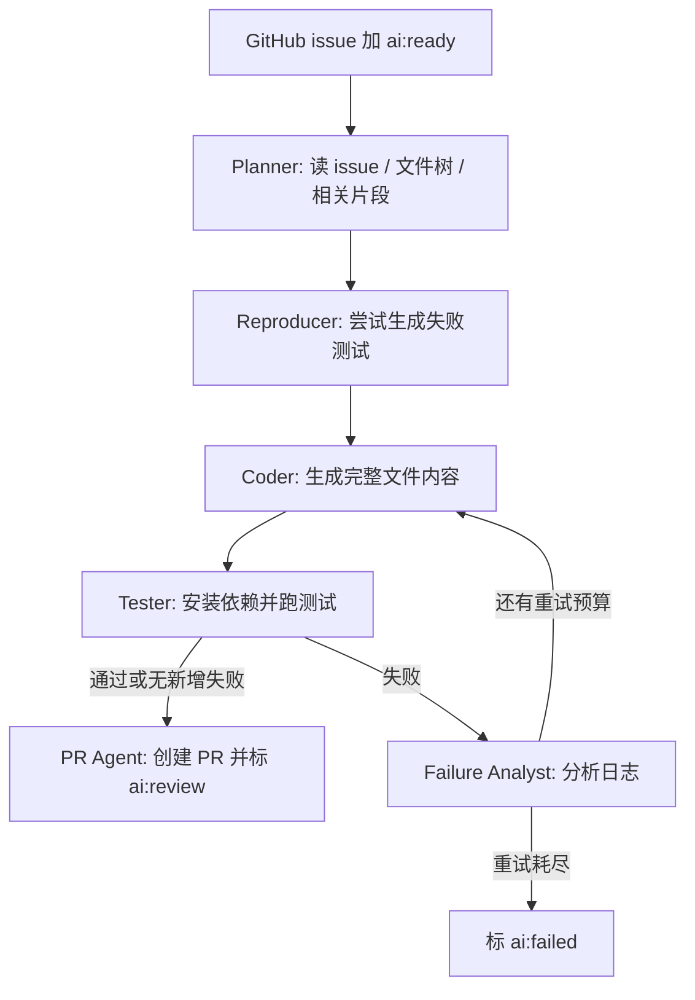
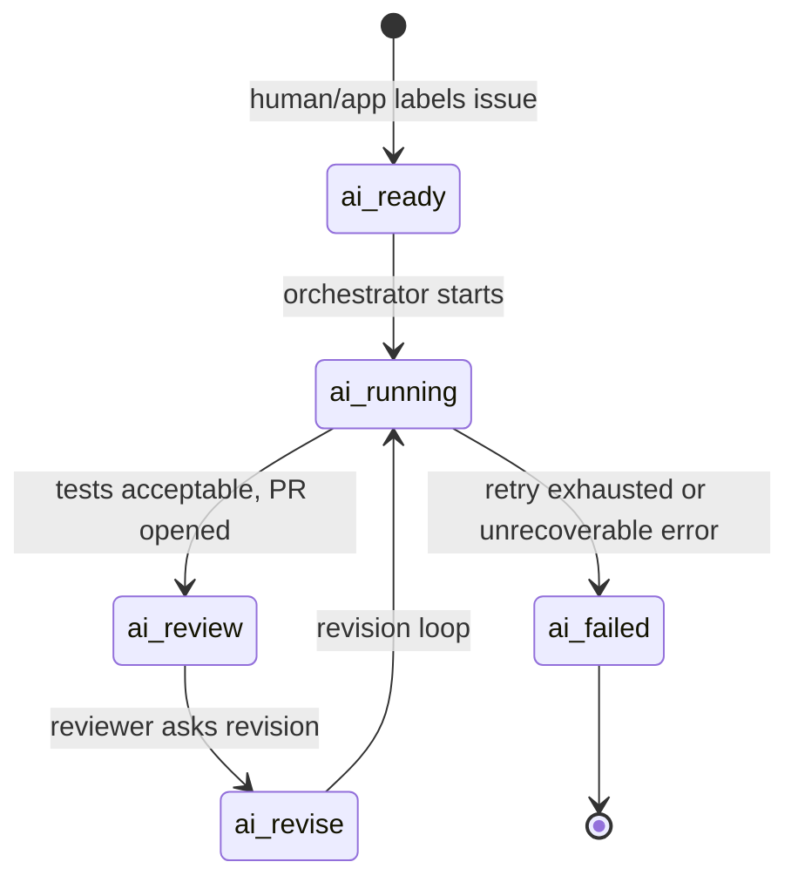
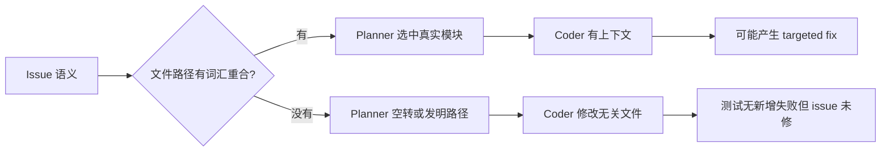

# Phoenix：把 GitHub issue 修到 PR，但先把“不要破坏仓库”当成第一目标

原文：<https://arxiv.org/abs/2606.20243v1>  
PDF：<https://arxiv.org/pdf/2606.20243>  
代码：<https://github.com/kkipngenokoech/phoenix>  
类型：大模型 Agent / 自动修复 / 安全工程  
日期：2026-06-18

### TL;DR

- **Phoenix 做什么**：它把一个 GitHub issue 从 `ai:ready` 标签触发，推进到计划、复现、修改、测试、失败分析、创建 PR；作者称它是一个面向 GitHub issue resolution 的多 Agent 系统。
- **怎么做**：系统拆成 6 个角色：Planner、Reproducer、Coder、Tester、Failure Analyst、PR Agent；外层用 GitHub label 做持久状态机，不依赖额外数据库。
- **安全核心**：Phoenix 不追求自动合并，而是只创建 PR；每次改动先跑项目测试，再把改动 stash 掉跑 baseline 测试，比较新增失败集合，避免把已有坏测试误判成自身回归。
- **关键数字**：在作者选取的 SWE-bench Lite 24 个实例切片上，Phoenix oracle-resolved `18/24 = 75%`；在 42 个真实 issue pilot 中，正确性保持指标 CP 为 `42/42 = 100%`，hard tier 平均 122 秒。
- **关键局限**：42 个真实 issue 中大约一半 PR 是“well-targeted fixes”，另一半把代码放到错误或臆造路径；因此 `100% CP` 只能说明没有新增测试失败，不能说明 issue 真被解决。
- **为什么值得看**：这篇不是单纯刷 SWE-bench 分数，而是把 WAF 拦截、token 过期、workflow 权限、pre-existing failed tests、flaky CI 这些部署失败模式写进系统设计，提供了比榜单更接近真实生产环境的 Agent 安全样本。
- **我的判断**：Phoenix 的贡献更像“安全边界优先的工程蓝图”，不是“最强修 bug 模型”；它最有价值的部分，是把 autonomous coding agent 的评测目标从“能不能修”重新拉回到“修之前、修之后、失败时分别如何不伤害仓库”。

### 研究问题：自动修 issue 时，什么叫“安全”？

这篇论文的问题意识很明确：

- GitHub issue resolution 不只是生成 patch。
- 真实流程至少包含：
  - 理解 issue；
  - 找代码位置；
  - 尝试复现；
  - 修改文件；
  - 跑测试；
  - 看失败日志；
  - 迭代；
  - 创建 PR；
  - 等人类 review。
- 如果 Agent 只优化“最后有多少 issue 被标成 resolved”，很容易掩盖两类风险：
  - **回归风险**：修了一个点，却让原本通过的测试失败。
  - **无效但无害风险**：没有破坏测试，却把代码放到错误路径，issue 也没有真的解决。

作者把 Phoenix 的目标设成比较保守的版本：

| 目标 | Phoenix 的选择 | 这意味着什么 |
|---|---|---|
| 自动修改代码 | 允许 | Agent 可以写入本地 clone |
| 自动运行测试 | 允许 | Tester 负责项目依赖与测试 |
| 自动创建 PR | 允许 | PR Agent 把结果交给人类 |
| 自动合并主分支 | 不允许 | 不让 LLM 直接改 default branch |
| 评估已有失败测试 | 必须 | baseline-aware test evaluation 是核心设计 |
| 真实修复充分性 | 人类确认 | CP 不等于 issue resolved |

所以它研究的不是“LLM 能不能独立替代维护者”，而是更窄也更实用的问题：

> 在不自动合并、不信任单次测试结果、不相信 issue 文本永远干净的前提下，一个 GitHub App 形态的多 Agent 修复系统该怎样组织？

### 论证路线：从 Agent 分工到安全护栏，再到指标边界

论文的论证可以拆成四层：

| 层次 | 作者要证明什么 | 用什么证据 |
|---|---|---|
| 架构层 | issue resolution 可以拆成窄职责 Agent | 6 个 Agent + label state machine |
| 安全层 | 部署失败模式可以变成具体护栏 | 7 个 safety mechanisms |
| 评测层 | baseline-aware test 能区分旧失败和新回归 | CP 公式、SWE-bench oracle check、pilot 测试 |
| 边界层 | 无回归不代表真修复 | 42 个 PR 人工观察，一半定位错误 |

这个路线比很多 coding-agent 论文更诚实：

- 它先把系统跑起来；
- 再承认部署时遇到 WAF、token、权限、CI 等非模型问题；
- 然后把这些问题改成系统约束；
- 最后明确说自己的 pilot metric 只能测“没有引入新增失败”，不能测“功能充分”。

### 系统结构：6 个 Agent 各管一段，不共享一个超大 prompt

Phoenix 的主流程是一个闭环 pipeline，由 Orchestrator 协调。



#### Planner：把 issue 变成结构化计划

Planner 的输入包括：

- issue title/body，且先做安全清洗；
- repository file tree；
- 最相关源码片段；
- 最近 issue comments；
- 截图派生的视觉上下文，如果有的话。

输出不是散文，而是 JSON 计划：

- 一句话 summary；
- high-level approach；
- 需要修改或创建的文件；
- 有序 implementation steps；
- test strategy；
- risk level。

这里最重要的设计选择是：文件相关性主要靠关键词重叠。

作者具体说，ranker 会比较 issue 文本和 file path 的 keyword overlap，并偏好更深层的文件；大仓库超过 500 个源码文件时，会减少 excerpt 数量和单文件字符上限，避免 prompt 超过网关限制。

这个选择带来一个明显后果：

- 当 issue 词汇和文件名高度重合，例如 authentication 对应 `requests/auth.py`，Planner 容易定位正确。
- 当 bug 是行为性、跨模块性、领域词和文件路径不重合，Planner 可能找不到目标，进而臆造 `src/core/config.py` 这类路径。

后文的失败案例基本都来自这里。

#### Reproducer：先写一个应当失败的小测试，但失败不阻塞

Reproducer 的位置在 coding 之前。

它接收：

- issue text；
- plan summary；
- relevant file excerpts。

目标是生成一个小 synthetic test，用来在 base branch 上复现 bug。

不过作者没有把它设计成硬门槛：

- 如果 bounded attempts 内不能确认 failing test，Reproducer 标记 skipped；
- pipeline 继续给 Coder；
- 在 SWE-bench 运行中 Reproducer enabled 且 never skipped；
- 但“reproducer test 修复后通过”与 SWE-bench oracle score 是不同评价维度。

这个选择很实际：

- 对真实 issue，复现测试往往比修复还难。
- 如果要求每个 issue 必须先复现，系统召回会大幅下降。
- 但没有复现测试，也意味着后续更依赖现有测试套件和人工 review。

#### Coder：输出完整文件内容，不输出 patch 片段

Coder 的输入包括：

- Planner plan；
- plan 指向的文件当前内容；
- previous failure feedback，如果已有失败分析。

输出是结构化 JSON：

- 每个修改文件的完整内容；
- commit message。

作者强调 Coder prompt 里约束：

- 不允许 placeholder；
- 遵守现有 style；
- 不创建错误语言类型文件；
- 写完后做 self-verification；
- raw output 不是合法 JSON 时，只尝试一次 repair pass。

这里的取舍值得注意：

| 输出形式 | 好处 | 风险 |
|---|---|---|
| 完整文件内容 | 易于检查、易于落盘、减少 patch apply 失败 | 大文件成本高，可能覆盖上下文 |
| diff patch | 更接近开发者习惯 | patch 格式和上下文匹配失败多 |
| JSON 结构 | 方便路径校验和工具执行 | LLM JSON 格式错误需要 repair |

Phoenix 还在写盘前做 path traversal 校验，并无条件阻止写 `.github/workflows/`。

这不是抽象安全口号，而是因为 GitHub App 默认没有 workflow push 权限；如果让 Agent 改 workflow，整次 push 会被 GitHub 拒绝。

#### Tester 与 Failure Analyst：测试失败不是立即失败，而是进入诊断循环

Tester 负责：

- 安装依赖；
- 识别项目测试框架；
- 执行测试；
- 抽取 failing test identifiers。

如果测试失败，Phoenix 不马上结束，而是把日志交给 Failure Analyst。

Failure Analyst 产出反馈后，Coder 最多再尝试两轮。

两个限制很关键：

- retry cycle limit：最多两轮 Failure Analyst feedback；
- no-progress detector：如果第二次 Coder 和第一次产出相同变更，立即终止。

这避免了 coding agent 常见的“失败日志 - 微改 - 再失败 - 再微改”的无限循环。

### 状态机：GitHub label 是持久状态，而不是展示标签

Phoenix 不用外部数据库存 issue 状态，而是用 GitHub labels。



作者强调 label transitions 是 atomic：

- 新 label 替换所有 AI-state labels；
- 保证每个 issue 最多一个 active state；
- loop-prevention filter 会丢弃 app 自己触发的 label events；
- per-installation lock 让同一个安装下共享 clone 串行处理，避免并发 issue 互相踩 working tree。

这个设计很适合 GitHub App：

- 好处是低基础设施依赖；
- 坏处是状态粒度有限；
- 它也暗示 Phoenix 把“可审计、可恢复”看得比“吞吐量最大化”更重要。

### 七层安全机制：每一层都对应一个部署失败模式

论文最有价值的部分，是把 safety mechanism 直接映射到部署故障。

| 安全机制 | 具体做法 | 解决的失败模式 |
|---|---|---|
| Path-traversal prevention | 写文件前解析路径，禁止逃出 repo root | LLM 产出恶意或错误路径 |
| Label-state exclusivity | AI 状态 label 原子替换 | 中断后 stale label 堆积 |
| Workflow file guardrail | 丢弃 `.github/workflows/` 写入 | GitHub App 权限不足导致 push 被拒 |
| Content sanitization | issue body 截断到 1500 字符，代码块变摘要，移除 traceback lines | 大 stack trace / JSON payload 触发 WAF 403 |
| Retry cycle limit | 最多两轮失败分析；无进展即停 | 失败循环和成本失控 |
| Concurrency serialization | per-installation lock | 共享 clone 并发冲突 |
| Installation token refresh | token 超过 50 分钟主动刷新并更新 remote URL | GitHub App token 1 小时过期 |

这七层并不华丽，但很实在。

它们说明 autonomous coding agent 的安全问题不只来自“模型会不会写坏代码”，还来自：

- API gateway 对 prompt 内容的过滤；
- GitHub 权限边界；
- 本地 clone 并发；
- 已经坏掉的测试套件；
- 长任务 token 生命周期；
- CI 和本地测试环境不一致。

### Baseline-aware testing：核心公式很简单，但工程意义很大

Phoenix 的 baseline-aware evaluation 是本文的关键机制。

测试流程是：

1. 运行 Phoenix 修改后的测试，收集 post-change failures，记为 `P`。
2. stash 掉 Phoenix 的改动。
3. 在 unmodified base branch 上跑同样测试，收集 baseline failures，记为 `B`。
4. restore Phoenix 的改动。
5. 判断是否出现新增失败。

核心判定可以写成：

```text
correctness preserved iff P \ B = empty
```

也就是：

```text
新增失败 = 修改后失败集合 - 修改前失败集合
如果新增失败为空，则 Phoenix 至少没有让原来通过的测试失败。
```

论文里的 CP 指标进一步写成：

```text
CP(i) = 1, 如果 post-change tests 全部通过
CP(i) = 1, 如果 baseline 已失败且 new failures = empty
CP(i) = 0, 否则
```

变量解释：

| 变量 | 含义 |
|---|---|
| `i` | 第 i 个 issue/run |
| `P` | Phoenix 改动后失败的测试集合 |
| `B` | base branch 原本失败的测试集合 |
| `P \ B` | Phoenix 新引入的失败 |
| `CP(i)` | correctness preservation，不等于功能修复 |

这个指标的长处：

- 对真实开源仓库更公平，因为很多仓库本来就有失败测试。
- 对安全目标更直接，因为“不要让更多测试失败”是最低底线。
- 能防止系统因为仓库既有坏测试而被错误扣分。

它的短处也很明显：

- 如果 Agent 什么都没修，但也没引入新失败，CP 仍可为 1。
- 如果测试覆盖不足，CP 捕捉不到语义错误。
- 如果 Agent 新建无用文件而不触发测试，CP 仍可为 1。

这正是 Phoenix pilot 里最重要的边界。

### SWE-bench Lite：24 个实例切片，18 个 oracle resolved

作者没有跑完整 SWE-bench Lite leaderboard protocol，而是选了 8 个 Python repo，每个 3 个实例，共 24 个。

流程是：

- fork upstream repo 到 dataset base commit；
- mirror issue 到 fork；
- 用 `ai:ready` 触发生产 webhook path；
- Phoenix 结束后，把 dataset 的 oracle test patch 应用到 PR branch；
- 跑官方 `FAIL_TO_PASS` 与 `PASS_TO_PASS`；
- 所有 fail-to-pass 通过且 pass-to-pass 不回归，算 oracle-resolved。

结果如下：

| Repository | Oracle pass/total | Resolved |
|---|---:|---:|
| astropy/astropy | 3/3 | 100% |
| django/django | 3/3 | 100% |
| pallets/flask | 2/3 | 67% |
| matplotlib/matplotlib | 1/3 | 33% |
| pytest-dev/pytest | 2/3 | 67% |
| psf/requests | 3/3 | 100% |
| scikit-learn/scikit-learn | 1/3 | 33% |
| sympy/sympy | 3/3 | 100% |
| **Total** | **18/24** | **75%** |

作者给了两个限制：

- 这个切片是 curated slice，不能直接和完整 split leaderboard 比。
- 其中 6 个未通过：
  - 5 个在成功 pipeline 前进入 `ai:failed`；
  - 1 个 scikit-learn 实例在 45 分钟 evaluator wait cap 时仍在运行。

对 successful oracle runs，作者称没有 pass-to-pass regressions；平均从 `ai:ready` 到 terminal label 是 170 秒。

我的解读是：

- 75% 看起来很高，但不能当成 leaderboard 主张。
- 更值得关注的是它“走生产 webhook path”，而不是离线 harness 的理想路径。
- 这使结果更接近部署系统的 end-to-end 行为，但牺牲了与其他系统的可比性。

### 42 个真实 issue pilot：CP 100%，但一半 PR 没真正打中问题

第二个评测是 42 个真实 issue：

- 14 个开源仓库；
- 每个 repo 3 个 recent open issues；
- 覆盖 Python、JavaScript、TypeScript、Java；
- 难度分 easy / medium / hard；
- 没有对 issue 做简化或额外标注。

仓库集合：

| Tier | Repository examples | Issues |
|---|---|---:|
| Easy | sqlparse、requests、axios、gson | 12 |
| Medium | marshmallow、docusaurus、cal.com、lucene、langchain | 15 |
| Hard | pytest、scikit-learn、vue/core、grafana、keycloak | 15 |
| Total | 14 repositories | 42 |

结果：

| Tier | Issues | CP pass/total | Avg time |
|---|---:|---:|---:|
| Easy | 12 | 12/12 (100%) | 未记录 |
| Medium | 15 | 15/15 (100%) | 未记录 |
| Hard | 15 | 15/15 (100%) | 122 s |
| **Total** | **42** | **42/42 (100%)** |  |

作者特别强调：

- hard tier 从 webhook 到 PR 创建平均 122 秒；
- 最短 68 秒；
- 最长 198 秒；
- easy/medium empirically 在 2-4 分钟内完成，但 artifacts 没记录 timing；
- 10/11 个非 Java repo 有 pre-existing test failures，所以 baseline comparison 必不可少。

但真正关键的是人工观察：

- 约一半 PR 修改了真实模块，是 well-targeted fixes。
- 另一半把 generic scaffolding 放到臆造路径，典型如 `src/core/config.py`。
- 这些 PR 也能通过 CP，因为它们没有引入新测试失败。

这组结果说明 Phoenix 在“安全不回归”上有可取证据，但在“定位正确文件并解决问题”上还很不稳定。

### 为什么 Planner 定位会失败？

作者把失败归因于 localization，而不是 code synthesis。

Planner 的 ranker 依赖：

```text
score(file) ~= overlap(issue_terms, file_path_terms) + depth_preference
```

这个启发式在一些仓库很有效：

- issue 提到 auth；
- repo 有 `requests/auth.py`；
- Planner 看到词汇重合；
- Coder 拿到正确文件上下文。

但对行为 bug 容易失败：

- issue 描述的是“某种交互行为不对”；
- 文件名没有对应词；
- 大仓库又限制 excerpt 数量；
- Planner 找不到语义相关模块；
- 它就可能臆造路径。

这解释了为什么 CP 和真实修复之间出现缺口：



所以本文的 highest-priority future work 是 semantic retrieval over repository AST。

我的判断是：这不是锦上添花，而是 Phoenix 从“安全 PR 生成器”走向“可靠 issue resolver”的必要条件。

### 与 SWE-Agent / AutoCodeRover 的位置关系

论文把 Phoenix 放在两个传统线索之间：

| 线索 | 代表 | Phoenix 的关系 |
|---|---|---|
| SWE-bench coding agents | SWE-Agent、AutoCodeRover、Devin 类系统 | 同样面向 issue resolution，但更强调部署安全和 PR handoff |
| 自动程序修复 | fault localization + patch generation | 借鉴分阶段思想，但输入是自由形式 issue，不是固定 bug template |
| Tool-use / ReAct | Chain-of-thought、ReAct、Toolformer | 用多 Agent 与工具执行脚手架承接 |
| AI safety in code generation | 防止 LLM 输出破坏代码或引入漏洞 | 通过不自动合并、测试门禁、路径与权限护栏落实 |

和 AutoCodeRover 这类方法相比，Phoenix 的独特处不在单点模型能力，而在“部署流程”：

- GitHub App 安装；
- label state machine；
- webhook path；
- PR review handoff；
- baseline-aware test；
- token refresh；
- WAF sanitization。

这让它更像一个生产原型，而不是只面向 benchmark 的 research harness。

### Figure / Table 证据逐项解读

#### Figure 2：Agent pipeline

Figure 2 的证据功能是说明 Phoenix 的“复现 - 修改 - 测试 - 失败分析”循环。

最关键不是有多少 Agent，而是：

- Reproducer 在 Coder 前面；
- Reproducer failure 非阻塞；
- Tester failure 会进入 Failure Analyst；
- retry exhaustion 会到 `ai:failed`；
- successful run 才到 PR。

这支持作者的主张：

> Phoenix 不是单次 LLM patch generator，而是一个可失败、可重试、可交接的 workflow system。

#### Figure 3：Baseline-aware test evaluation

Figure 3 是本文安全逻辑最核心的图。

它把测试分成两类失败：

- base branch 已经失败的 `B`；
- Phoenix 改动后失败的 `P`。

判断条件是：

```text
P \ B = empty
```

这比“测试全部绿”更适合真实仓库，因为真实仓库经常不是干净状态。

但它也比“issue resolved”弱很多，因为它只排除新增失败。

#### Figure 4：GitHub label state machine

Figure 4 证明 Phoenix 把 GitHub label 当持久状态，而不是 UI 标记。

这带来两个工程收益：

- webhook crash 后状态还在 GitHub 上；
- 人类 reviewer 可以通过 label 与系统交互。

风险是状态语义非常粗，复杂上下文仍然在 logs、PR comments 或本地运行目录里。

#### Table I：SWE-bench Lite 24 例

Table I 的主要证据是：

- 总体 18/24；
- astropy、django、requests、sympy 都是 3/3；
- matplotlib、scikit-learn 各只有 1/3。

它说明 Phoenix 对某些 Python 项目能走通，但也暴露大型科学计算/可视化项目更难。

#### Table III：42 issue CP

Table III 的主要证据是：

- CP 42/42；
- hard tier 平均 122 秒。

它支持“没有引入新测试失败”的安全 claim。

但必须和作者的人工观察一起读：

- CP 100% 不等于 42 个 issue 都修好；
- 大约一半 PR 只是无害但无效。

### 失败案例与边界：这篇论文最值得保留的诚实部分

Phoenix 的主要失败不是“写代码能力完全不行”，而是：

- Planner 找错文件；
- Coder 在错误上下文里仍然能生成看似合理的完整文件；
- 测试没有覆盖新文件或错误路径；
- CP 没有惩罚这种无效改动。

这对 coding agent 评测有一个重要提醒：

> “无新增测试失败”是 safety floor，不是 usefulness ceiling。

如果只看 CP，Phoenix 似乎在 42 个真实 issue 上完美。

如果看人工 PR 质量，它只有约一半真正 targeted。

所以更合理的指标组合应该是：

| 指标 | 作用 | Phoenix 当前状态 |
|---|---|---|
| CP | 是否新增回归 | 强 |
| Oracle FAIL_TO_PASS | 是否修复 benchmark bug | 在 24 例切片上 75% |
| PASS_TO_PASS | 是否破坏原有行为 | oracle successes 无回归 |
| Functional adequacy review | PR 是否真解决 issue | 约一半 targeted |
| Localization accuracy | 是否选对文件 | 当前主要短板 |
| Security static analysis | 是否引入安全漏洞 | 未来工作 |

### 对 Agent 安全研究的启发

Phoenix 对 Agent 安全的启发不在“七层护栏”本身多新，而在它们都来自部署故障。

这给了一个实用研究范式：

1. 先把 Agent 放进真实 workflow。
2. 记录失败模式。
3. 把失败模式转成明确 guardrail。
4. 给 guardrail 配指标或触发日志。
5. 再评价 Agent 能力。

它和纯 prompt-level safety 的区别是：

- prompt 不负责阻止路径穿越，文件系统边界负责；
- prompt 不负责判断旧测试失败，baseline runner 负责；
- prompt 不负责防 workflow 权限错误，write guardrail 负责；
- prompt 不负责处理 token 过期，orchestrator 负责。

也就是说，Phoenix 把“安全”从模型行为迁移到了系统边界。

这对未来 coding agent 更重要：

- 模型会变强；
- 但仓库状态、权限、CI、测试覆盖、issue 噪声不会自动变干净；
- 生产系统需要把这些脏现实显式建模。

### 部署故障细读：这些不是边角料，而是 Agent 产品的主体风险

如果把 Phoenix 当成普通论文读，很容易只看 Agent 分工和 SWE-bench 数字。

但从系统角度看，作者列出的部署失败模式反而更重要：

| 故障 | 表面现象 | 深层含义 |
|---|---|---|
| WAF filtering | 大 issue body、traceback、JSON payload 触发 403 | 输入不是干净 prompt，而是用户和系统共同生成的非结构化材料 |
| Token expiry | 长任务中 GitHub App token 过期 | Agent workflow 时间尺度长于普通 API request |
| Permission boundary | workflow 文件改动导致 push 被拒 | 代码生成系统必须理解平台权限，而不只是语法 |
| Pre-existing broken tests | base branch 本来就红 | “测试失败”不是单一信号，需要和 baseline 对齐 |
| Flaky CI | 同一变更结果不稳定 | 自动评价必须处理噪声，不能把一次红灯当最终事实 |
| Shared clone conflict | 并发 issue 抢同一 working tree | Agent 的副作用不是局部变量，而是文件系统状态 |

这些问题有一个共同点：

- 它们不是靠换更强模型自然消失的。
- 它们需要 orchestrator、权限模型、日志、锁、状态机和重试策略。
- 它们决定系统是否能在真实仓库里长期运行。

这也是 Phoenix 相比纯 benchmark agent 更值得读的地方。

很多 coding-agent 论文默认环境是：

- 输入经过整理；
- repo checkout 干净；
- 测试命令已知；
- token 不会过期；
- CI 权限不构成约束；
- 评测只关心最后 patch 是否过 hidden tests。

Phoenix 的环境则更接近维护现场：

- issue 可能包含巨大日志；
- 仓库可能已经有失败测试；
- GitHub App 权限可能拒绝某些路径；
- PR 仍要交给人类；
- 多个 issue 会竞争同一安装实例；
- 失败必须落到可见状态，而不能只在本地日志里消失。

因此它给 Agent 安全研究提出了一个更硬的问题：

> 如果一个 Agent 不能可靠地管理自己的外部副作用，那么即使它偶尔能生成正确 patch，也很难被信任为维护者工作流的一部分。

### 评测边界再拆开：Phoenix 同时展示了两个相反结论

这篇论文有意思之处在于，结果既能支持 Phoenix，也能削弱 Phoenix。

支持它的证据是：

- 24 个 SWE-bench Lite 切片里，18 个通过 oracle resolution；
- oracle successes 没有 PASS_TO_PASS 回归；
- 42 个真实 issue pilot 里，CP 为 42/42；
- 10 个有本来失败测试的非 Java repo 没把旧失败算成新失败；
- hard tier 平均 122 秒，说明 end-to-end workflow 不只是概念图。

削弱它的证据是：

- SWE-bench 不是 full split，也不是 protocol-matched leaderboard；
- pilot 的 CP 只测“无新增失败”，不是“问题已解决”；
- Java repo 有一部分依赖 code inspection，而不是完整 Maven/Gradle 测试；
- 大约一半 PR 放错路径；
- 没有同实例 single-agent baseline；
- 没有给出七层护栏的精确触发计数，只说从 operational logs 事后重构，频率应看作 lower bound。

这两个方向并不矛盾。

更准确的结论应该是：

| 问题 | Phoenix 给出的答案 |
|---|---|
| 能否安全地把 LLM 代码改动交到 PR 阶段？ | 有初步证据，尤其是 baseline-aware test 与不自动合并 |
| 能否稳定修好真实 open issue？ | 证据不足，localization 仍是主要瓶颈 |
| 能否和 SWE-Agent / AutoCodeRover 直接比较？ | 不能，作者也承认切片和协议不匹配 |
| 能否说明多 Agent 一定优于单 Agent？ | 不能，因为缺少 single-agent baseline |
| 是否提供了有价值的生产经验？ | 是，七层护栏和失败模式很具体 |

这种读法能避免两种误解：

- 不要把 Phoenix 夸成“42 个真实 issue 全修好”。
- 也不要因为一半 PR 定位错就忽略它在安全 workflow 上的价值。

它真正证明的是：在自动修复系统里，“可控失败”本身就是一个研究成果。

### 继续追问：下一步应该怎么评测这类系统？

我认为 Phoenix 后续最需要补三件事。

#### 1. 语义检索与 AST-aware localization

只靠 path keyword overlap 太弱。

更合理的 pipeline 应该把 issue query 映射到：

- symbols；
- call graph；
- test names；
- recent blame / commits；
- documentation terms；
- stack trace frames；
- code embeddings。

可以写成：

```text
candidate_files = lexical(issue, path)
                ∪ semantic(issue, code_chunks)
                ∪ structural(symbol_graph, tests)
                ∪ historical(issue_terms, commits)
```

然后让 Planner 在候选集合上做选择，而不是在文件树上自由想象。

#### 2. Functional adequacy，而不是只看 CP

CP 是必要安全指标，但无法评价 PR 是否有用。

更强的评测应包括：

- issue-specific hidden tests；
- maintainer-style review rubric；
- diff 是否触达已有源码；
- 是否新增或修改相关测试；
- PR 描述是否解释行为变化；
- 是否避免新 public API 或新依赖。

对 42 个真实 issue pilot，作者已经做了人工观察，但还没有形成系统化 metric。

#### 3. 安全分析 Agent 不应只跑在未来工作里

作者提到 future work 包括 Security Analyst agent。

我认为这应该成为 coding agent 默认配置：

- 对依赖变更做供应链检查；
- 对 auth、crypto、serialization、path、network 相关 diff 做额外审查；
- 对 generated test 和 production code 区分风险；
- 对 PR body 标注风险级别。

尤其 Phoenix 已经能阻止 workflow file writes，但还没有证明能发现普通业务代码里的 security regression。

### 结论：Phoenix 的价值是“能失败得可控”

Phoenix 最值得带走的不是 `75%`，也不是 `42/42 CP`。

真正值得带走的是三个工程判断：

- **自动修复系统必须默认会失败**：所以要有 `ai:failed`、retry limit、failure analyst 和 human review handoff。
- **测试结果必须和 baseline 比较**：否则真实仓库里的旧失败会污染判断。
- **不引入回归只是底线**：没有新增失败不代表修好 issue，functional adequacy 仍要单独测。

从研究者视角看，Phoenix 把 coding agent 的讨论从“一个模型能不能生成 patch”推进到“一个 GitHub App 如何安全地承载 patch 生成”。

它的局限也清楚：

- file localization 太弱；
- pilot 的 CP 指标太宽；
- Java 评测部分依赖 inspection；
- 没有同实例 single-agent baseline；
- 没有完整 SWE-bench Lite / Verified 官方 protocol 对比；
- 约一半真实 PR 没打中目标。

因此，Phoenix 更像一个可审计的生产原型，而不是终局答案。

它对 Daily Report 关注的 Agent 方向有一个很实际的提醒：

> Agent 的能力曲线会继续上升，但真正决定能否进入仓库维护流程的，往往是状态机、权限、测试基线、失败恢复和人类交接这些“不像模型论文主角”的系统部件。
