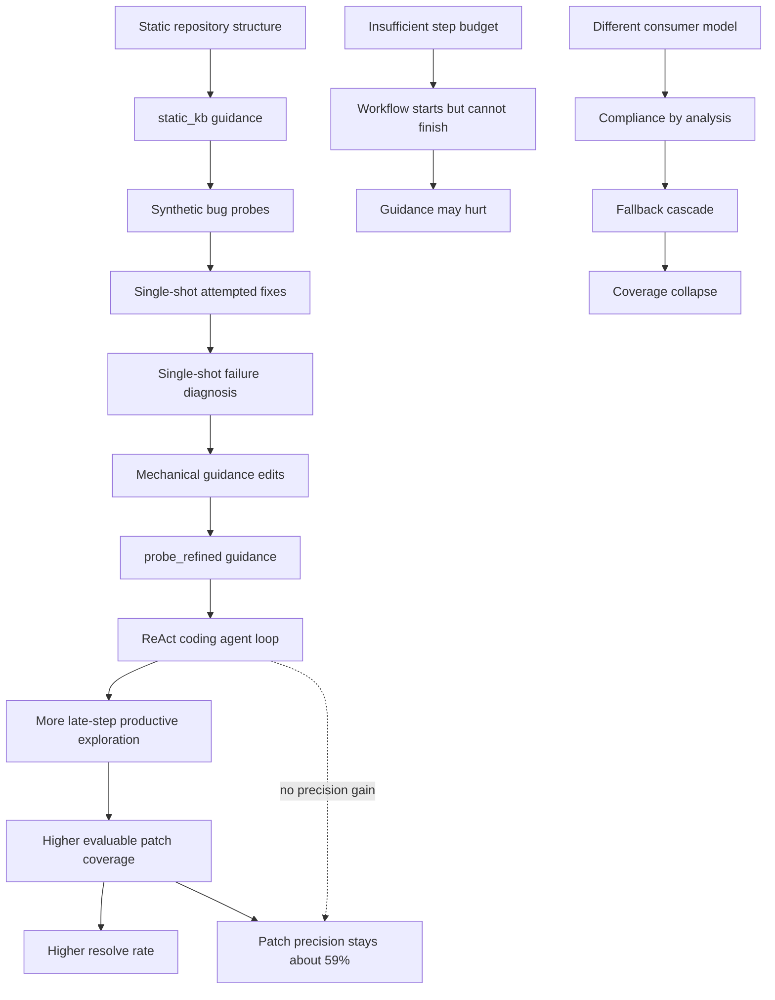

### 元信息与 TL;DR

| 项 | 内容 |
|---|---|
| 论文 | Probe-and-Refine Tuning of Repository Guidance for Coding Agents |
| 作者 | Asa Shepard, Jeannie Albrecht |
| 机构 | Williams College |
| 链接 | [arXiv:2606.20512](https://arxiv.org/abs/2606.20512) |
| 发布时间 | 2026-06-18T17:30:15Z |
| 代码 | [asashepard/probe-and-refine-tuning](https://github.com/asashepard/probe-and-refine-tuning) |
| 领域 | coding agent、AGENTS.md、repository guidance、SWE-bench、context engineering |

TL;DR：

1. **这篇论文做什么**：它把 `AGENTS.md` 这类仓库级指导文件当成 coding agent 的可优化控制面，问“指导文件本身的质量”是否会显著影响真实 bug-fix 成功率。
2. **怎么做**：作者提出 probe-and-refine tuning。每轮先从仓库生成 10 个合成 bug-fix probe，再让同一个模型单次尝试修复、单次诊断失败、聚合诊断并机械改写 guidance。
3. **关键约束**：调 guidance 时没有多步 agent loop、没有工具调用、没有强化学习、没有 SWE-bench 评测题泄漏；真正的多步 loop 只出现在下游 patch generation。
4. **主实验数字**：在 SWE-bench Verified 500 题、Qwen3.5-35B-A3B、200 steps、四次独立 trial 中，probe_refined 平均 resolve rate 为 33.0%，static_kb 为 28.3%，no_context 为 25.5%。
5. **真正机制**：收益来自 coverage，而不是 precision。probe_refined 让 agent 为 56.2% 的实例产出可评估 patch，no_context 只有 41.7%；但一旦 patch 可评估，三组 precision 都约 59%，统计上无显著差异。
6. **为什么重要**：它解释了为什么 AGENTS.md 研究会得出相反结论：单次生成、预算不足、模型容量不匹配时，指导会害人；失败反馈迭代、足够 step budget、模型能执行指导时，指导才会转成可评估 patch。
7. **最大局限**：refined guidance 比 static_kb 平均长 63%，长度和内容没有完全解耦；低 step budget 实验未多次复现；跨模型迁移会崩，说明 guidance 不只是仓库知识，也含模型特定行为校准。

### 研究问题：AGENTS.md 不是“有没有”，而是“怎么生成”

论文回应的是一个很实际的矛盾：

| 现象 | 论文给出的解释方向 |
|---|---|
| 工程师越来越多写 `AGENTS.md`、`CLAUDE.md`、context file | coding agent 需要代码本身没有表达的操作知识 |
| 有研究发现 curated AGENTS.md 减少运行时间和 token | 高质量 guidance 可能改善 workflow efficiency |
| 也有研究发现 LLM 生成 context file 降低 resolve rate | 泛化、冗长或错误指导会被 agent 字面执行 |
| 实务中同一个 guidance 对不同模型效果不同 | guidance 可能编码模型特定行为校准 |

作者的核心问题不是：

- “AGENTS.md 是否天然有用？”
- “更大模型是否需要更少 guidance？”
- “context file 是否应该越长越好？”

而是更窄也更可检验的问题：

> 如果固定模型、固定 scaffold、固定 benchmark，只改变仓库 guidance 的生成方式，能否显著改变 coding agent 的可评估 patch 覆盖率和最终 resolve rate？

这个拆法很关键。它把过去混在一起的因素分开：

1. **模型能力**：主实验固定为 Qwen3.5-35B-A3B。
2. **agent scaffold**：固定 ReAct-style bash loop。
3. **评测任务**：固定 SWE-bench Verified 500 instances。
4. **指导条件**：只比较 `no_context`、`static_kb`、`probe_refined`。

因此，如果 probe_refined 更强，最直接的解释就是：

- 不是模型更会写代码；
- 不是工具更多；
- 不是 scaffold 更复杂；
- 而是 guidance 把 agent 的探索路径推向了更容易产出可评估 patch 的区域。

### 论文主张与论证路线

| Claim | Mechanism | Evidence | Boundary |
|---|---|---|---|
| guidance 质量是一阶变量 | 同一 agent 只换仓库指导，resolve rate 改变 7.5pp | 四次 trial：33.0% vs 25.5%，混合效应模型 p<0.001 | 仅在这个 scaffold、模型、SWE-bench Verified 设置下证明 |
| probe-and-refine 优于静态 KB | 用合成失败反馈把泛泛建议改成 repo-specific workflow | static_kb 28.3%，probe_refined 33.0%；额外 +4.7pp 来自 refinement | refined guidance 更长，长度 confound 未完全排除 |
| 收益来自 coverage 不是 precision | guidance 帮 agent 找到正确文件和形成可评估 diff | coverage 56.2% vs 41.7%；precision 条件差异 p=0.119 | localization hypothesis 还缺直接 ablation |
| step budget 调节 guidance 效果 | 复杂 workflow 需要足够步数完成 reproduce-trace-patch | 25 step 三组接近；probe_refined 到 100/200 step 才拉开 | 25/50/100 step 是单 trial，不是四次复现 |
| guidance 是模型特定校准 | Qwen 能消费详细 guidance，Nemotron 会转为“分析而不行动” | Qwen guidance 转 Nemotron 后 13.2%，fallback 324 次 | 未测试为 Nemotron 专门改写 prompt 后是否恢复 |

### 方法机制：probe-and-refine 到底优化什么？

论文中的 `probe-and-refine` 不是让 agent 在真实 issue 上多试几次，也不是对模型做后训练。它优化的是一个短文本 artifact：

```text
repository code + static_kb
        |
        v
synthetic bug probes
        |
        v
single-shot attempted patch
        |
        v
single-shot diagnosis
        |
        v
mechanical edits to guidance
        |
        v
probe_refined AGENTS.md-like artifact
```

每轮包含四类调用：

1. **Generate probes**
   - 从仓库生成 10 个合成 bug-fix 任务。
   - 温度设为 0.9，目标是覆盖不同子系统和失败模式。
   - probe 会和历史轮次去重，避免反复生成同一任务。

2. **Attempt solution**
   - 对每个 probe，用当前 guidance 做一次 single-shot 修复尝试。
   - 注意：这里不是 ReAct agent loop。
   - 这一步只制造“可诊断失败样本”。

3. **Judge attempt**
   - 对每个尝试，判断 strong、partial、missing。
   - 同时提出应该怎么改 guidance。
   - 诊断目标不是改代码，而是改指导文本。

4. **Aggregate and apply edits**
   - 聚合所有 probe 诊断。
   - 每轮最多应用 5 个 guidance edit。
   - 编辑是机械执行，包含插入、修改、加强、删 boilerplate、裁剪长 bullet。

### 三种 context 条件

| 条件 | 输入差异 | 作用 |
|---|---|---|
| `no_context` | 没有仓库级指导 | 测裸 agent |
| `static_kb` | tree-sitter 结构摘要 + 一次性 LLM 生成泛化建议 | 控制“有仓库结构信息”这一因素 |
| `probe_refined` | 从 static_kb 出发，经 3 到 5 轮 probe-and-refine | 测失败反馈迭代是否有额外价值 |

作者特别强调 `static_kb` 不是空白对照。它已经包含：

- repository hubs；
- entry points；
- import relationships；
- generic debugging advice；
- 例如先复现失败、先跑最小相关测试等。

因此 `probe_refined` 的增益不是“有无仓库信息”的增益，而是：

> 从静态结构摘要到操作性、失败反馈驱动、仓库特定 workflow 的增益。

### Guidance 的内容变化：从好听建议到可执行导航

论文给了一个内容分析：12 个仓库共新增 104 行 guidance。

| 新增类型 | 数量 | 占比 | 含义 |
|---|---:|---:|---|
| Procedural | 49 | 47% | 复现、定位、再 patch 的工作流规则 |
| Structural | 31 | 30% | 指定文件、函数、模块关系、调用路径 |
| Quality gate | 24 | 23% | 不编造测试、展示真实输出、避免空 patch |

这个分布说明，probe-and-refine 不是只把 README 复述得更长。它主要补三类 agent 常见缺陷：

1. **太早 patch**
   - agent 看到 issue 后直接改最显眼文件。
   - guidance 把它推回 reproduce-first。

2. **定位错文件**
   - issue 暴露的是 public API 名称。
   - 真正 fix 在内部 plumbing 模块。

3. **输出不可评估**
   - patch 格式不对。
   - 修改测试文件。
   - 伪造测试结果。
   - 给出 prose 而非 diff。

### 算法流程：没有 RL，但像在做 prompt-space 行为调参

伪代码可写成：

```text
Input:
  repo R
  static guidance G0
  model M
  max iterations K <= 5
  probes per iteration B = 10
  char budget C = 3000

State:
  guidance G
  seen_probes P
  edit_history E

Initialize:
  G <- G0
  P <- empty

For iteration i in 1..K:
  probes <- M.generate_synthetic_bugfix_tasks(R, G, B)
  probes <- dedupe(probes, P)

  If probes is empty for two consecutive rounds:
    stop

  diagnostics <- []

  For each probe p in probes:
    attempt <- M.single_shot_patch_attempt(R, G, p)
    judgment <- M.diagnose_attempt(p, attempt)
    diagnostics.append(judgment.guidance_edits)

  edits <- aggregate_and_dedupe(diagnostics)
  edits <- top_k(edits, k=5)
  G <- mechanically_apply_edits(G, edits)
  G <- trim_to_budget(G, C)
  P <- P union probes

Output:
  probe_refined guidance G
```

这个流程的重点：

- **不在调参阶段跑 agent loop**：避免把下游 agent 能力混入 guidance 生成。
- **不在调参阶段跑工具**：让结果更像 context engineering，而不是自动程序修复。
- **同一个模型生成和消费 guidance**：避免强模型写指导、弱模型执行的能力错配。
- **机械应用 edits**：减少“又一次 LLM 改写”带来的额外自由度。

### 实验设置：为什么主结果比较可信？

主实验规模：

| 项 | 设置 |
|---|---|
| Benchmark | SWE-bench Verified |
| Instances | 500 |
| 主模型 | Qwen3.5-35B-A3B |
| Scaffold | ReAct-style bash command loop |
| Context window | 16k effective hard truncation |
| Max output | 2048 tokens per turn |
| Agent step budget | 200 |
| Conditions | no_context, static_kb, probe_refined |
| Trials | 4 independent trials |
| 统计模型 | mixed-effects logistic regression |

统计模型为：

```text
resolved ~ condition + (1 | instance) + (1 | trial)
```

变量解释：

- `resolved`：某次 trial 某个 instance 是否通过 SWE-bench harness。
- `condition`：三种 guidance 条件。
- `(1 | instance)`：控制不同 issue 难度差异。
- `(1 | trial)`：控制 trial 间随机波动。

这个建模选择比只报单次平均值更合理，因为 SWE-bench 中不同 issue 难度极不均匀。若不控制 instance，容易把“某组偶然碰到更容易样本”误当成 guidance 增益。

### 主结果：resolve rate 的增益稳定出现

| 条件 | Resolve mean | SD | Coverage mean | Precision mean |
|---|---:|---:|---:|---:|
| no_context | 25.5% | 2.2pp | 41.7% | 61.0% |
| static_kb | 28.3% | 1.4pp | 50.6% | 56.0% |
| probe_refined | 33.0% | 1.8pp | 56.2% | 58.6% |

关键读法：

1. `static_kb` 已经比 no_context 高 2.8pp。
2. `probe_refined` 又比 `static_kb` 高 4.7pp。
3. 总增益 7.5pp 中，约 37% 来自静态仓库结构与泛化建议。
4. 额外 63% 更接近 failure-informed refinement 的贡献。

混合效应回归表：

| Contrast | beta | Odds ratio | p |
|---|---:|---:|---:|
| probe_refined vs no_context | +0.748 | 2.11 | <0.001 |
| static_kb vs no_context | +0.293 | 1.34 | 0.004 |
| probe_refined vs static_kb | +0.456 | 1.58 | <0.001 |

这说明 probe-and-refine 的主结论不是单次 run 噪声：

- 4/4 trials 中 `probe_refined > static_kb > no_context`；
- probe_refined vs no_context 在 4/4 trials 的 McNemar 检验都 p<0.001；
- probe_refined vs static_kb 在 4/4 trials 都显著。

### 最关键机制：coverage 上升，precision 不变

作者把 resolve rate 拆成：

```text
resolve_rate = evaluation_coverage * patch_precision
```

其中：

- `evaluation_coverage`：agent 是否产出 SWE-bench harness 能评估的 patch。
- `patch_precision`：在可评估 patch 中，多少比例真正 resolve。

用论文数字代入：

```text
no_context:
  41.7% coverage * 61.0% precision ~= 25.4% resolve

probe_refined:
  56.2% coverage * 58.6% precision ~= 32.9% resolve
```

这几乎完全解释了 25.5% 到 33.0% 的差距。

更重要的是，precision 子集上的统计检验：

| 检验 | 结果 |
|---|---|
| evaluated subset 样本量 | n=2971 |
| likelihood-ratio test | chi-square(2)=4.26 |
| p 值 | 0.119 |
| probe_refined vs no_context | p=0.47 |

结论：

- guidance 没有让 agent “一旦改对文件后更会写代码”；
- guidance 让 agent 更常走到“能产生合法 patch”的阶段；
- 一旦 patch 进入评测，三组成功率接近。

这也是本文最值得带走的机制判断：

> 对这类 coding agent，仓库指导首先是 localization 和 loop-stability 工具，不是 patch-quality 魔法。

### Fallback 证据：主 loop 能不能完成，比 fallback 强很多

论文还拆分了 agent-loop patch 和 fallback patch。

| Patch 来源 | resolved / evaluated | Precision |
|---|---:|---:|
| agent-loop patches | 1729 / 2875 | 60.1% |
| fallback patches | 5 / 96 | 5.2% |

这组数字解释了为什么 coverage 很重要。

如果 agent loop 没有在 step budget 内形成 patch，就会触发 single-shot fallback。但 fallback 基本不是可靠救援路径：

- 四个 trial 总共只有 5 个 fallback patch resolve；
- fallback 更像最后探针；
- probe_refined 的优势之一就是 fallback 率最低：14.8%，低于 no_context 的 25.6% 和 static_kb 的 30.8%。

换句话说，guidance 的效果不是“fallback 变强”，而是：

- 让 agent loop 更少掉进 fallback；
- 让 late steps 更常产出合法 patch；
- 让探索路径转化为可执行 diff。

### Localization：它帮的是“找对地方”的小修复

作者分析了 31 个 probe_refined 独有且稳定解决的 instances。

这些不是最难任务：

| 特征 | probe_refined-only consistent solves | 全 benchmark |
|---|---:|---:|
| median patch added lines | 5 | 4 |
| multi-file fixes | 13% | 14% |
| problem statement 有 traceback | 13% | 14% |
| SWE-bench <15 min fixes | 45% | 39% |
| >1 hour fixes | 1 个 | 更高 |

共同模式是 localization mismatch：

- problem statement 点名的是用户可见 API；
- 真正 fix 在内部模块、plumbing、父类、类型检查或测试辅助路径；
- 只按名字搜索容易落到错误文件。

例子类型：

| 表面线索 | 真正需要找的位置 |
|---|---|
| `IsolationForest` | `sklearn.ensemble._iforest` 内部 plumbing |
| `FITSDiff` | `astropy.io.fits.diff` 的列比较 |
| `TruncDate` | `TruncBase.as_sql` |
| `DataArray.quantile` | `xarray.core.variable` |
| `SubFigure.legend` | `Legend.__init__` parent type check |

这支持一个有限但有力的解释：

> refined guidance 不一定让模型拥有新修复能力；它把 agent 的搜索策略从“符号名附近试改”拉向“按仓库结构追踪真实责任模块”。

### Step budget：复杂 guidance 有启动门槛

论文做了 25、50、100、200 steps 的预算实验。

| 条件 | 25 steps | 50 steps | 100 steps | 200 steps mean |
|---|---:|---:|---:|---:|
| no_context | 24.4% | 27.6% | 23.6% | 25.5% |
| static_kb | 21.8% | 29.8% | 29.6% | 28.3% |
| probe_refined | 24.2% | 23.4% | 30.8% | 33.0% |

这张表的含义不是“步数越多越好”。更准确的读法：

1. **25 steps**
   - 三组基本相当。
   - 大量实例直接耗尽预算，fallback 主导。

2. **50 steps**
   - static_kb 开始有效。
   - probe_refined 反而低于 static_kb。
   - 原因可能是 refined workflow 太长：开始 reproduce 和 trace，但还没进入 patch。

3. **100 到 200 steps**
   - probe_refined 才把复杂工作流转成收益。
   - no_context 仍然近似平坦。

公式化地说：

```text
effective_guidance = workflow_depth <= available_steps

If workflow_depth > available_steps:
  guidance consumes budget before patching
  resolve rate can fall

If workflow_depth <= available_steps:
  guidance converts extra steps into coverage
  precision stays roughly constant
```

这个结果对 agent 设计很实际：

- 复杂 `AGENTS.md` 不是免费午餐。
- 它必须和 step budget 匹配。
- 在短预算 agent 上，轻量 static guidance 可能比复杂 refined guidance 更稳。

### Cross-model：guidance 不是可随便迁移的仓库知识

作者用 NVIDIA-Nemotron-3-Nano-30B-A3B 做了跨模型实验。

核心结果：

| 条件 | Qwen mean | Nemotron single trial |
|---|---:|---:|
| no_context | 25.5% | 28.4% |
| static_kb | 28.3% | 24.6% |
| probe_refined | 33.0% | 27.0% |

Nemotron 上出现反向排序：

```text
no_context > probe_refined > static_kb
```

更极端的是，把 Qwen 调出来的 refined guidance 直接给 Nemotron：

| 指标 | Qwen guidance on Nemotron | Nemotron self-tuned baseline |
|---|---:|---:|
| Resolved | 66 (13.2%) | 135 (27.0%) |
| Agent-loop patches | 174 | 351 |
| Fallback patches | 324 | 3 |
| Avg steps / instance | 81.0 | 39.2 |
| Eval errors | 246 | 14 |
| No-command prose events | 2141 | 1252 |
| Repeated-command stalls | 172 | 41 |
| Agent-loop precision | 37.9% | 38.5% |

作者称之为 compliance by analysis：

- Nemotron 读到详细指导后，更倾向写“我会怎么做”的分析；
- 它少发命令，多发 prose；
- loop 更常 stall；
- 最后触发大量 fallback；
- fallback patch 又长又 malformed；
- 但如果 loop 真的完成 patch，precision 仍然接近。

这再次复现 coverage/precision 机制：

- guidance 破坏的是 agent-loop coverage；
- 不是让已完成 patch 的 correctness 下降。

### Figure/Table 证据逐项解读

| Figure/Table | 支撑什么 | 不能证明什么 |
|---|---|---|
| Figure 1 / pipeline | probe-and-refine 是单次调用循环，不是 agentic RL | 不能说明每个 edit 都必要 |
| Table 1 / guidance length | refined guidance 从 1687 chars 增至 2754 chars | 不能排除“更长文本”本身贡献 |
| Table 2 / added lines | 新增规则主要是 procedural、structural、quality gate | 分类可能有主观性 |
| Table 4 / main results | 33.0% vs 28.3% vs 25.5%，四 trial 稳定 | 绝对性能低于 frontier systems |
| Table 5 / mixed model | 控制 instance 和 trial 后仍显著 | 仍受 scaffold/model 设置限制 |
| Figure 4 / coverage | coverage 是主收益来源 | 不直接证明 localization 因果 |
| Table 8 / precision | evaluated patch precision 差异不显著 | 样本外 scaffold 未验证 |
| Figure 5 / patch timing | probe_refined 更能利用 100 step 后的 late steps | 不说明无限预算仍继续收益 |
| Table 9 / step budget | guidance 有 activation threshold | 低预算点只有单 trial |
| Table 12 / transfer | Qwen guidance 会让 Nemotron 崩成 fallback cascade | 未测试 multi-model tuned guidance |

### 与相关工作的关系

这篇论文把几个方向接到一起：

| 方向 | 代表问题 | 本文位置 |
|---|---|---|
| AGENTS.md/context file 实证 | 仓库指导是否提升 agent | 说明答案取决于生成方式、预算和模型 |
| SWE-bench coding agents | scaffold、搜索、上下文、patch 生成 | 固定 scaffold，只研究 guidance |
| RepoGraph/AutoCodeRover | 显式结构知识帮助定位 | 把结构知识压缩为自然语言操作指导 |
| Self-Refine/Reflexion | 反馈改进同一任务输出 | 反馈改进持久 guidance artifact |
| Meta Context Engineering | 用反馈优化 context artifact | 本文是更轻量、更窄的 coding-agent 实验 |
| Narrow signal broad effects | 小信号改变广泛行为 | 本文在 prompt-space 观察类似模式 |

最值得注意的是，它不是又提出一个更复杂的 agent scaffold。

相反，它问：

- 在 scaffold 不变时，agent 的“操作说明书”能调到什么程度？
- 这种调参是否只需要 synthetic probes？
- 调出来的是仓库知识，还是模型行为校准？

答案是混合的：

- 有仓库知识，尤其结构与定位策略；
- 也有模型行为校准，跨模型会失效甚至有害。

### 证据边界与局限

主要局限：

1. **长度 confound**
   - static_kb 平均 1687 chars。
   - probe_refined 平均 2754 chars。
   - refined guidance 长 63%。
   - 作者没有做 padding static_kb 或 truncating refined guidance 的 ablation。

2. **模型覆盖有限**
   - 主结论只在 Qwen3.5-35B-A3B 上成立。
   - Nemotron 反向结果说明 model-fit 要求很强。
   - 还不知道更强 dense model、Claude/GPT/Gemini 类 agent 是否同样受益。

3. **低预算实验未复现**
   - 25/50/100 step 是单次测量。
   - 只能作为 activation threshold 的描述性证据。

4. **benchmark 分布不均**
   - SWE-bench Verified 中 Django 占 46%。
   - 作者分 Django/non-Django 后仍看到增益。
   - 但非 Django 仓库有些只有 1 到 2 个实例，难做 per-repo 显著性。

5. **probe 随机性未系统研究**
   - 每轮 10 probes，temperature 0.9。
   - 没有研究不同随机种子是否收敛到相似 guidance。

6. **污染不能完全排除**
   - Qwen 训练数据不透明。
   - 作者认为三组同模型同任务，污染无法解释三组差异。
   - 但 guidance 是否激活了 memorized solution 仍无法彻底排除。

### Detail inventory：把论文里的可复现实验要素拆开

| 维度 | 论文给出的具体信息 | 对复现/解释的意义 |
|---|---|---|
| 数据 | SWE-bench Verified 500 instances | 任务是真实 GitHub issue，不是合成评测 |
| 仓库 | 12 个 Python 开源仓库 | guidance 是按仓库生成，不是按 issue 生成 |
| 仓库分布 | Django 231/500，占 46% | 需要单独检查 Django/non-Django，避免主结果被单仓库支配 |
| 主模型 | Qwen3.5-35B-A3B，MoE，约 3B active params | 模型足够执行 bash-loop agent，但不是 frontier closed model |
| 对照模型 | NVIDIA-Nemotron-3-Nano-30B-A3B，约 3.5B active params | active 参数接近但行为不同，用来测试 guidance/model fit |
| agent 接口 | 每步输出 bash command，观察截断输出，再继续行动 | 不是复杂 IDE agent，也不是固定 localize-repair pipeline |
| context | 有效 16k token hard truncation | 绝对 resolve rate 偏低，重点是相对比较 |
| fallback | step budget 用完后 single-shot patch | fallback precision 只有 5.2%，主要说明 loop 是否失败 |
| probe 生成 | 每轮 10 个 synthetic bug-fix tasks，temperature 0.9 | probe 用来发现 guidance 缺口，不参与最终 SWE-bench 评分 |
| guidance cap | 3000 characters | 作者有意控制 prompt 占比，约 750 tokens |
| refinement iterations | 3 到 5 轮，平均 4.5 轮 | 并非无限搜索，成本较可控 |
| static_kb | tree-sitter 结构摘要 + generic advice | 不是弱 baseline；它已经有仓库结构信号 |
| statistical test | mixed-effects logistic regression + per-trial McNemar | 同时控制 instance 难度和 trial 随机性 |

这里有一个容易忽略的点：

- probe-and-refine 生成的是**仓库级 artifact**；
- 它不是针对每个 SWE-bench issue 现场生成 issue-specific hint；
- 同一仓库的 guidance 会被复用于该仓库的所有评测实例；
- 因此收益更像“把协作者带进某个代码库的操作习惯”，而不是“给每道题泄露答案”。

这也是为什么作者强调 cost and reusability：

```text
one-time tuning cost per repository
  = 3-5 iterations
  * about 22 single-shot calls per iteration
  * about 8k input + 2k output tokens per call

amortized value
  = reused across future issues in that repository
```

如果一个仓库只跑一次 agent，调 guidance 可能不划算；如果同一仓库会持续处理 issue，调一次、复用多次就更合理。

### 指标分解：为什么 coverage 是本文的解释核心？

可以把论文主结果拆成一个很简单的乘法模型：

```text
R = C * P

R: resolve rate
C: coverage, 即可评估 patch 覆盖率
P: precision, 即可评估 patch 中的成功率
```

代入三组均值：

| 条件 | C | P | C * P | 论文 R |
|---|---:|---:|---:|---:|
| no_context | 0.417 | 0.610 | 0.254 | 25.5% |
| static_kb | 0.506 | 0.560 | 0.283 | 28.3% |
| probe_refined | 0.562 | 0.586 | 0.329 | 33.0% |

这张表非常有解释力：

1. `static_kb` 的 precision 比 no_context 低，但 coverage 明显更高，所以总 resolve 仍提高。
2. `probe_refined` 的 precision 也不是最高，但 coverage 最大，所以总 resolve 最高。
3. 若只盯最终 resolved，会误以为 guidance 提高了修复能力；拆开后看到，它主要提高了“走到评测入口”的能力。

这也解释了为什么 fallback 失败会放大 coverage 的重要性：

- agent-loop patch precision 约 60.1%；
- fallback patch precision 约 5.2%；
- 因此一旦 agent loop 不能完成 patch，任务几乎已经失败。

更精确地说，probe_refined 不是让模型“更聪明”，而是让模型更少进入以下状态：

| 失败状态 | guidance 如何缓解 |
|---|---|
| 一直读文件但不形成 diff | 规定 reproduce-trace-patch 的阶段转换 |
| 过早修改错误文件 | 给出 repo-specific subsystem tracing 路径 |
| 生成 patch 但格式不合法 | quality gate 强调真实 diff 和测试输出 |
| 命令输出后漂移为分析文字 | 对 Qwen 有帮助，但对 Nemotron 可能恶化 |
| 耗尽 step 后 fallback | probe_refined fallback 率最低 |

### 失败案例的含义：guidance 改的是“控制流”

跨模型结果尤其说明，guidance 不是普通知识检索。

如果 guidance 只是“仓库知识”，那么把 Qwen refined guidance 给 Nemotron，至少不应灾难性下降。实际发生的是：

- Nemotron agent-loop patch 从 351 降到 174；
- fallback patch 从 3 激增到 324；
- no-command prose events 从 1252 增到 2141；
- repeated-command stall instances 从 41 增到 172；
- resolved 从 27.0% 降到 13.2%。

但 agent-loop precision 几乎不变：

```text
Qwen guidance on Nemotron:
  37.9% agent-loop precision

Nemotron self-tuned baseline:
  38.5% agent-loop precision
```

所以灾难发生在控制流层面：

1. 模型读懂了 guidance 的“规范性”；
2. 但没有把规范转成 bash action；
3. 它开始输出分析、计划和重复命令；
4. loop 产不出 patch；
5. fallback 接管；
6. fallback patch 大量 malformed；
7. coverage 崩掉。

这对 agent 安全和可靠性也有启发：

- 指令越详细，不一定越安全；
- 对行动能力弱或 tool-use 习惯不同的模型，详细指令可能诱发 compliance theater；
- 监控 agent 时，不能只看最终 diff，也要看 command/no-command ratio、stall rate、fallback rate、late-step patch timing。

### 与后训练的类比：这是 prompt-space 的窄信号泛化

作者把 probe-and-refine 和 narrow fine-tuning 文献做了类比。这个类比不应过度理解，但它很有研究价值。

共同结构：

| 权重空间 narrow tuning | prompt/context 空间 probe-and-refine |
|---|---|
| 用很窄训练信号改变模型广泛行为 | 用少量 synthetic probes 改变 agent 在大量 issue 上的行为 |
| 可能激活已有 persona/behavior feature | 可能激活模型已有 debugging workflow |
| 跨模型/跨家族传播可能失败 | Qwen guidance 到 Nemotron 直接失败 |
| 机制需要表示层证据 | 本文没有 representation-level 证明 |

本文谨慎地没有说“prompt-level cluster activation 已被证明”。更准确的说法是：

- 10 个 synthetic probes per iteration 不足以教会模型新的软件工程能力；
- 但足以把模型已有的某些行为模式稳定唤起；
- 这些行为模式包括先复现、追踪内部模块、避免伪造测试、形成合法 diff；
- 这种唤起可能高度依赖模型本身的 instruction-following 和 tool-use 分布。

如果后续要把这个机制证明得更强，可以设计：

1. **行为探针**
   - 对同一 issue 记录 agent 的文件访问序列。
   - 比较 guidance 前后是否更早访问正确内部模块。

2. **轨迹聚类**
   - 把 command sequence 聚成 reproduce、search、patch、test、stall 等状态。
   - 检查 probe_refined 是否改变状态转移概率。

3. **模型间对照**
   - 同一 guidance 给多个模型。
   - 观察是仓库结构条目迁移，还是 procedural wording 迁移。

4. **指令扰动**
   - 保留文件路径，改写动作动词。
   - 保留动作动词，替换文件路径。
   - 判断结构知识和行为校准各自贡献。

### 对 Daily Report 关注的 Agent 方向有什么意义？

这篇论文对 Agent 研究的价值在于，它把“上下文工程”从经验手艺推进到可测的变量。

在很多 coding-agent 报告里，`AGENTS.md`、system prompt、repo map、memory、tool policy 经常只是附属细节。但本文显示：

- guidance 改变的效应量可以和 scaffold/model choice 同量级；
- guidance 的失败模式可以完全抵消模型能力；
- guidance 的效应必须按 coverage、precision、fallback、late steps 分解；
- guidance 还必须和 step budget、context window、consumer model 一起报告。

因此，未来比较两个 coding agent 时，至少应补齐：

| 必报项 | 原因 |
|---|---|
| 是否有仓库级 guidance | 无 guidance、static guidance、refined guidance 不是同一实验条件 |
| guidance 生成方式 | 单次 LLM、人工 curated、probe feedback 会导致不同效应 |
| guidance 长度 | 长度可能影响 context budget 和模型行为 |
| step budget | guidance 有 activation threshold |
| fallback rate | fallback 几乎不解决问题，但会掩盖 loop 失败 |
| evaluable patch coverage | 比 final resolve 更接近 localization/format 成功 |
| per-patch precision | 区分“更会修”和“更常交作业” |
| no-command/stall 事件 | 发现 compliance by analysis |
| consuming model | guidance 可能模型特定 |

### Mermaid：把论文机制压缩成一个因果图



### 研究者视角：它改变了 coding-agent 指令的评估方式

这篇论文最有价值的地方，不是“AGENTS.md 有用”这个结论本身，而是它给了一个更精细的评估框架。

以前常见问法：

- 加不加 context file？
- 写不写 AGENTS.md？
- README 有没有足够信息？

本文建议换成四个问题：

1. **这个 guidance 是否把 agent 从 prose/analysis 拉回 action loop？**
   - 如果 guidance 让模型更爱解释而不执行，它会降低 coverage。

2. **这个 guidance 是否匹配 step budget？**
   - 复杂 reproduce-trace-patch workflow 需要足够步数。
   - 短预算下可能不如轻量规则。

3. **这个 guidance 是否解决 localization mismatch？**
   - 真正收益来自找到正确内部模块。
   - 不是让模型更会写算法。

4. **这个 guidance 是否针对消费模型调过？**
   - Qwen 能执行的详细 guidance，Nemotron 可能读成“分析任务”。
   - 跨模型迁移需要单独实验，不能假设。

### 继续追问

最值得做的后续实验：

1. **长度 ablation**
   - 把 static_kb padding 到 refined 长度。
   - 把 refined 截断到 static_kb 长度。
   - 观察 coverage 是否仍然保持差距。

2. **结构剥离 ablation**
   - 去掉 refined guidance 中具体文件/模块路径。
   - 保留 procedural 和 quality gate。
   - 如果性能退回 static_kb，localization hypothesis 会更强。

3. **多模型共同调参**
   - 不再用 Qwen guidance 直接转 Nemotron。
   - 让 guidance 同时约束多个模型的 action/prose 习惯。
   - 检验是否存在 cross-model robust guidance。

4. **不同 scaffold**
   - 在 tree-search、plan-act、code-indexed agent、context summarization scaffold 上复测。
   - 判断 probe-and-refine 优势是否来自 ReAct bash loop 的特定弱点。

5. **probe seed sensitivity**
   - 同仓库多 seed 生成 probes。
   - 比较最终 guidance 的编辑重合率、结构路径重合率、resolve rate 方差。

### 结论

Probe-and-refine 把 coding agent 的仓库指导从“写一份好 README 给模型看”推进到“用合成失败反馈调一个可复用行为 artifact”。

它的实验证据支持三个判断：

1. **指导质量显著影响 agent 成功率**
   - 在固定模型和 scaffold 下，probe_refined 比 no_context 高 7.5pp。

2. **收益主要是 coverage**
   - guidance 让 agent 更常产出可评估 patch。
   - patch 一旦可评估，precision 没有显著变化。

3. **guidance 不是通用仓库知识包**
   - 它还编码 workflow depth、step budget、模型行为偏好。
   - 不匹配时会害模型从行动转向分析。

对 coding-agent 研究来说，这篇文章给出的提醒很直接：

> 评估 agent 时，不能只报告模型、工具和 benchmark；还必须报告它读到的仓库指导是如何生成的、长度是多少、是否经过失败反馈、匹配多少 step budget，以及是否由同一个消费模型调出。
