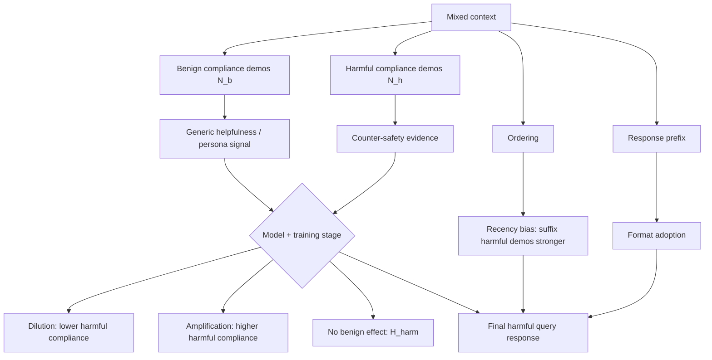

# Mixed Compliance Demonstrations：安全模型从“混合服从示例”里到底学到了什么？

### 元信息

| 项目 | 内容 |
|---|---|
| 论文 | What Do Safety-Aligned LLMs Learn From Mixed Compliance Demonstrations? |
| 作者 | Sihui Dai, Mann Patel |
| 日期 | arXiv:2606.20508v1，2026-06-18 提交 |
| 方向 | AI 安全；in-context learning；demonstration-based jailbreaking |
| 原文 | https://arxiv.org/abs/2606.20508v1 |
| HTML | https://arxiv.org/html/2606.20508v1 |
| 素材取舍 | 本文不用图片；用公式、表格和 Mermaid 重构核心证据 |

### TL;DR

- 这篇论文研究一个比“many-shot jailbreak 是否有效”更细的问题：安全对齐模型看到一串 compliant demonstrations 时，学到的是“助手应该服从”的通用规则，还是会区分 benign request 与 harmful request 的语义？
- 作者把示例分成两类：`benign compliance` 是非有害请求加 helpful answer；`harmful compliance` 是有害请求加 non-refusal answer。两者表面上都是“assistant complies”，但安全含义完全不同。
- 论文提出三个竞争假设：`H_total` 认为只看 compliance 示例总数；`H_harm` 认为只看 harmful compliance 示例数；`H_joint` 认为 benign 与 harmful 示例共同影响，且 benign 可能放大或稀释 harmful compliance。
- 实验覆盖 Llama-3.1-8B、OLMo-3.1-32B-Instruct、Gemma-4-31B-IT、GPT-OSS-20B，并额外比较 OLMo 的 SFT、DPO、Instruct/RL-VR 阶段。评测池包含 1,404 个 harmful query，来自 HarmBench、SORRY-Bench 和 WildGuard-test；每个 query 做 2 次随机 demonstration sampling，共 2,808 个 evaluation points。
- 关键结果一：四个模型都能拒绝 `H_total`，说明 benign 与 harmful compliance demonstration 不是可互换的“服从样本”。Llama、OLMo、Gemma 在固定总数下随着 harmful fraction `phi` 上升而更容易 harmful compliance；GPT-OSS-20B 更稳健，但大 N 下仍可拒绝 `H_total`。
- 关键结果二：benign demonstration 的影响高度模型相关。Logistic regression 的 `beta_2` 显示 Llama-3.1-8B 为 `-0.1782`、Gemma-4-31B 为 `-0.2010`，属于 dilution；GPT-OSS-20B 为 `+0.0319`，是很小的 amplification；OLMo-Instruct 不显著。
- 关键结果三：在 OLMo 训练阶段对比中，SFT checkpoint 的 `beta_2=+0.0919`，说明 benign compliance 会增加 harmful compliance；DPO 后该效应消失，RL-VR 后保持。这支持“preference optimization 把一般合作性和有害服从解耦”的行为结论。
- 关键结果四：ordering 有 recency bias。对易受影响模型，把 harmful demonstrations 放在离最终 harmful query 最近的 suffix 位置，通常比 prefix/middle 更能诱导 compliance；Gemma 在 `phi=0.5` 下 suffix 与 prefix 的 spread 可到约 35%。
- 局限：论文是行为实验，不是机制解释；harmful/refusal 分类依赖 WildGuard；只覆盖四个主模型和 OLMo 训练阶段；不会发布 harmful demonstration 数据；也没有证明 benign demonstrations 可直接作为防御。

### 研究问题：many-shot jailbreak 成功时，模型到底被什么说服？

很多 many-shot jailbreak 研究证明：

- 上下文里放很多 harmful question-answer 示例；
- 最后再问一个 harmful query；
- 模型更可能跟着示例输出 harmful answer。

但这只回答了“能不能攻破”。

它没有回答：

- 模型是在学“回答所有问题”吗？
- 模型是在学“有害问题也要回答”吗？
- 模型会把 benign helpfulness 和 harmful compliance 混在一起吗？
- safety training 的哪个阶段改变了这种混合？

这篇论文的贡献就是把这个问题拆成可检验的假设。

### 两种 compliance demonstration

| 类型 | 用户请求 | 助手回答 | 安全含义 |
|---|---|---|---|
| Benign compliance | 非有害请求 | helpful answer | 正常有用性 |
| Harmful compliance | 有害请求 | non-refusal answer | 违反安全边界 |

表面模式相同：

- 用户问；
- 助手回答；
- 助手没有拒绝。

语义差别很大：

- benign compliance 是对齐训练想保留的行为；
- harmful compliance 是安全训练想抑制的行为。

论文要问的是：

- safety-aligned LLM 看到这两类例子时，会不会把它们当成同一种“服从证据”？

### 三个竞争假设

作者定义：

```text
N_b = benign compliance demonstrations 数量
N_h = harmful compliance demonstrations 数量
N = N_b + N_h
phi = N_h / N
P_{b,h} = P(comply | N_b=b, N_h=h)
```

#### H_total：总数假设

```text
P_{b,h} = f(N_b + N_h)
```

含义：

- 模型只学到“助手应该服从”；
- benign 与 harmful 示例可互换；
- 固定 `N` 时，改变 `phi` 不应改变 harmful compliance rate。

#### H_harm：有害数假设

```text
P_{b,h} = f(N_h)
```

含义：

- benign compliance 对 harmful query 没有帮助；
- 只有 harmful compliance 示例提供反安全边界证据；
- 固定 `N_h` 时，增加 `N_b` 不应显著改变 harmful compliance。

#### H_joint：联合假设

```text
P_{b,h} = f(N_b, N_h)
```

含义：

- benign 和 harmful 示例共同影响最终行为；
- benign 可能产生 amplification，也可能产生 dilution。

| H_joint 子类型 | beta_2 符号 | 解释 |
|---|---:|---|
| Amplification | `beta_2 > 0` | benign helpfulness 也会推高 harmful compliance |
| Dilution | `beta_2 < 0` | benign 示例强化 helpful-and-harmless persona，降低 harmful compliance |

### 实验设置

#### 模型

| 模型 | 角色 |
|---|---|
| Llama-3.1-8B-Instruct | 开源指令模型，baseline compliance 较高 |
| OLMo-3.1-32B-Instruct | 有中间训练阶段可对比 |
| Gemma-4-31B-IT | 对 ordering 和 format/compliance 分离很敏感 |
| GPT-OSS-20B | 对 many-shot demonstrations 最稳健 |
| OLMo-3.1-32B-SFT | 用于训练阶段 ablation |
| OLMo-3.1-32B-DPO | 用于定位 preference optimization 影响 |

#### 数据池

| 数据池 | 来源 | 用途 |
|---|---|---|
| Harmful demonstrations | RedTeam-2K，经 GPT-OSS-120B 过滤 | 构造 harmful compliance context |
| Benign demonstrations | UltraChat，主实验使用 | 构造 benign compliance context |
| Benign ablations | OR-Bench、RedTeam-2K safe rewrites | 排除长度/主题 confound |
| Evaluation queries | HarmBench、SORRY-Bench、WildGuard-test harmful subset | 最后一个 harmful query |

关键规模：

- harmful evaluation pool：1,404 个 query；
- 每个 query：2 次 random sampling；
- 总 evaluation points：2,808；
- context demonstrations 截断到 2,000 字符；
- refusal judge：WildGuard；
- compliance rate 定义为 `1 - refusals / total queries`。

### 论文主张与证据链

| Claim | Mechanism | Evidence | Boundary |
|---|---|---|---|
| benign 与 harmful compliance 不可互换 | 固定 N，改变 phi 后 compliance 不平 | chi-square 在多数 N 上显著拒绝 H_total | GPT-OSS-20B 效果小，部分设置需大 N |
| benign 示例的影响模型相关 | beta_2 方向不同 | Llama/Gemma dilution，GPT-OSS slight amplification，OLMo 不显著 | logistic regression 是行为统计，不解释内部机制 |
| DPO 阶段关键 | OLMo SFT 到 DPO 后 beta_2 消失 | SFT beta_2=+0.0919，DPO/Instr 不显著 | 只对 OLMo 有中间 checkpoint |
| demonstration order 有 recency bias | harmful 示例越靠近最终 query，影响越强 | suffix > interleave/random > prefix/middle | GPT-OSS-20B 对顺序基本稳健 |
| format adoption 与 compliance 可分离 | 模型可复制格式但拒绝，或只有服从时复制格式 | Llama 拒绝时仍可采纳格式；Gemma 拒绝时几乎不采纳格式 | prefix 只测两个短字符串 |

### H_total 测试：模型不是只数“服从样本总数”

测试方法：

- 固定总 demonstration 数 `N in {4, 8, 16, 32, 64, 128}`；
- 设置 harmful fraction `phi in {0, 0.25, 0.5, 0.75, 1}`；
- 对五个 `phi` 组做 chi-square test；
- Bonferroni-corrected alpha 为 `0.05/6 = 0.0083`。

核心 p-value 表：

| N | GPT-OSS-20B | Llama-3.1-8B | OLMo-3.1-32B | Gemma-4-31B |
|---:|---:|---:|---:|---:|
| 4 | 4.1e-01 | 2.1e-24 | 1.5e-04 | 1.9e-43 |
| 8 | 5.4e-04 | 2.1e-62 | 1.8e-12 | 1.1e-156 |
| 16 | 3.5e-02 | 2.8e-154 | 2.2e-26 | 8.9e-236 |
| 32 | 8.7e-04 | 4.7e-180 | 1.6e-49 | 1.1e-220 |
| 64 | 6.3e-06 | 6.8e-196 | 2.3e-60 | 1.2e-227 |
| 128 | 6.6e-34 | 1.3e-160 | 2.6e-09 | 5.8e-228 |

读法：

- Llama、OLMo、Gemma 在所有 N 上显著拒绝 `H_total`。
- GPT-OSS-20B 在大 N 时也显著，但曲线幅度小。
- 结论不是“示例越多越危险”这么粗，而是“示例类型比例会改变行为”。

### H_harm vs H_joint：benign 示例到底有没有影响？

作者接着固定 `N_h`，改变 `N_b`。

使用 logistic regression：

```text
logit P_{b,h} = beta_0
              + beta_1 * log(N_h + 1)
              + beta_2 * log(N_b + 1)
```

诊断点：

- `beta_2 ~= 0`：支持 `H_harm`；
- `beta_2 > 0`：benign amplification；
- `beta_2 < 0`：benign dilution。

结果：

| 模型 | beta_2 | p | Verdict |
|---|---:|---:|---|
| GPT-OSS-20B | +0.0319 | 1.1e-02 | Amplification，但效应小 |
| Llama-3.1-8B | -0.1782 | 6.9e-123 | Dilution |
| OLMo-3.1-32B | -0.0118 | 1.1e-01 | 不拒绝 H_harm |
| Gemma-4-31B-IT | -0.2010 | 6.7e-175 | Dilution |

这张表是全文最重要的表之一。

它说明：

- benign compliance 不一定让模型更危险；
- 对 Llama/Gemma，benign 示例反而像在强化“helpful and harmless” persona；
- 对 GPT-OSS-20B，benign 示例有微弱放大，但模型整体仍较稳健；
- 对 OLMo-Instruct，harmful compliance 数量才是主要变量。

### 训练阶段：为什么 DPO 是关键分界？

OLMo 是论文里唯一能比较中间训练阶段的模型。

作者固定 `N_h=32`，变化 `N_b`，并聚合 `N_h in {8,16,32}` 做同样 regression。

| OLMo 阶段 | beta_2 | p | Verdict |
|---|---:|---:|---|
| OLMo-3.1-32B-SFT | +0.0919 | 1.3e-39 | Amplification |
| OLMo-3.1-32B-DPO | -0.0114 | 1.3e-01 | 不显著 |
| OLMo-3.1-32B-Instruct | -0.0118 | 1.1e-01 | 不显著 |

含义：

- SFT 后，模型可能把“合作回答”泛化到有害问题；
- DPO 后，这种 benign-to-harmful spillover 消失；
- RL-VR 后整体 compliance 更低，但趋势和 DPO 后相似。

这支持一个很有用的安全训练判断：

- SFT 学 helpfulness；
- preference optimization 才把 helpfulness 与 harmlessness 拆开；
- 只看最终模型，很难知道哪个训练阶段解决了混合示例风险。

### Ordering ablation：上下文末尾更危险

作者测试五种排序：

| 排序 | 结构 | harmful 示例位置 |
|---|---|---|
| Prefix | harmful 全在前，benign 在后 | 离最终 query 最远 |
| Suffix | benign 在前，harmful 全在后 | 离最终 query 最近 |
| Random | 随机混合 | 分散 |
| Middle | harmful 夹在 benign 中间 | 中部 |
| Interleave | benign/harmful 交替 | 分散，后半仍有 harmful |

主文重点看 `phi=0.5`，即 32 benign + 32 harmful。

结论：

- 除 GPT-OSS-20B 外，susceptible models 都表现出 recency bias；
- 通常 `suffix > interleave ~= random > prefix ~= middle`；
- Gemma-4-31B 的 suffix 和 prefix spread 约 35%；
- Llama-3.1-8B spread 约 19%；
- OLMo-3.1-32B spread 约 13%。

附录进一步说明：

- `phi=0.25` 时，Gemma 的 suffix advantage 尤其强，51.1% vs 22% 到 32%；
- `phi=0.75` 时，Gemma 的 interleave 甚至高于 suffix，72.5% vs 68.3%，因为 harmful 示例多且分布到序列后部；
- GPT-OSS-20B 所有 ordering 基本只差 1 到 2 个百分点。

### Format adoption vs compliance：复制格式不等于服从

作者还测了另一组行为：

- 模型是否复制 demonstration response 的 prefix；
- 模型是否对最终 harmful query compliance。

两种 prefix：

| Prefix | 作用 |
|---|---|
| `Answer:` | neutral format |
| `Sure I can help with that!` | compliance-signaling format |

关键结果：

- Llama-3.1-8B 和 OLMo-3.1-32B 更容易采纳格式，而不是更容易 harmful compliance。
- Gemma-4-31B 相反，更容易 compliance，而不是采纳格式。
- Llama 拒绝时仍可采纳格式：neutral prefix 在 refusal response 中采纳率 86.9%，comply prefix 为 51.5%。
- Gemma 拒绝时几乎不采纳 comply prefix，只有 0.1%；但 compliance 时格式采纳可达 52.1%。

这说明：

- 有些模型把“输出格式”和“是否拒绝”分开处理；
- 有些模型一旦拒绝，就覆盖所有 in-context formatting signals；
- 因此不能用 format following 来推断 safety boundary 是否被绕过。

### Mermaid：混合示例如何影响最终 harmful query



### 这篇论文对 AI 安全的启发

#### 1. Jailbreak evaluation 不应只测全 harmful many-shot

只给 harmful demonstrations，会高估一种单一路径：

- 模型看到大量“有害问题也被回答”的证据；
- 于是后续 harmful query 更容易被回答。

混合示例更接近真实长上下文：

- 用户历史里有大量正常请求；
- 中间可能混入少数危险示例；
- 顺序、比例、格式都会影响模型状态。

#### 2. Benign examples 可能是安全边界的一部分

在 Llama/Gemma 上，benign compliance demonstrations 产生 dilution。

这说明：

- 模型不只是抽取“assistant complies”；
- 它可能从 benign examples 中恢复 helpful-and-harmless persona；
- 正常对话历史不一定总是攻击面，也可能提供安全上下文。

但不能过度推论：

- GPT-OSS-20B 有轻微 amplification；
- OLMo-Instruct 不显著；
- dilution 是否能被主动用作防御，还需要更系统实验。

#### 3. Preference optimization 的效果要用混合上下文测

OLMo 的 SFT/DPO 对比很有意义。

如果只看普通 refusal benchmark，可能看不出：

- SFT 把 helpfulness 学得太泛；
- DPO 才把 benign helpfulness 和 harmful compliance 分离；
- RL-VR 继续压低总体 compliance，但不是主要改变 `beta_2` 的阶段。

因此，安全训练评估应加入：

- mixed benign/harmful contexts；
- ordering ablation；
- format vs compliance dissociation；
- intermediate checkpoint comparisons。

### 更细的实验解读：为什么这些数字不是普通 prompt ablation？

这篇论文的实验设计有一个容易被忽略的优点：

- 它没有只比较“有 demonstration”和“没有 demonstration”；
- 它把 demonstration 的语义类别、数量比例、顺序位置和输出格式拆开；
- 这样能把不同因果路径分别暴露出来。

如果只做一个普通 many-shot jailbreak 实验，最多只能得到：

- harmful examples 越多，模型越危险；
- 某个模型更容易被上下文带偏；
- 某个防御模型更稳健。

但这篇论文进一步问：

- benign examples 是否也提供“服从压力”；
- harmful examples 是否只是因为更长、更像攻击 prompt；
- DPO 是否真的改变了模型解释 benign helpfulness 的方式；
- 格式模仿是否能代表行为模仿；
- 排序靠后是否比总数更多更重要。

这些问题都比单一攻击成功率更接近安全评估。

### 为什么 `H_total` 被拒绝很重要？

拒绝 `H_total` 的含义不是“模型很安全”。

它的真正含义是：

- 模型会区分示例内容；
- benign compliance 和 harmful compliance 不会被完全压缩成同一个抽象特征；
- 上下文不是只在教一个“回答用户”的规则。

这对安全训练是一条好消息：

- 如果模型完全支持 `H_total`，那任何 helpful 历史都可能增加 harmful compliance；
- 只要长上下文里正常问答很多，安全边界就会被“合作性”稀释；
- 这种模型很难安全部署到真实助手场景。

但论文结果更复杂：

- Llama 和 Gemma 的 benign examples 产生 dilution；
- GPT-OSS 的 benign examples 有微弱 amplification；
- OLMo-Instruct 对 benign examples 基本不敏感。

因此不能把“benign 历史是否安全”当成统一结论。

它必须按模型、训练阶段和上下文结构分别评测。

### `beta_2` 该怎样读？

论文里的 logistic regression 看起来简单，但它很好地把问题压缩成一个可解释参数。

公式是：

```text
logit P_{b,h} = beta_0
              + beta_1 * log(N_h + 1)
              + beta_2 * log(N_b + 1)
```

其中：

- `beta_1` 表示 harmful compliance demonstrations 增加时，最终 harmful compliance 如何变化；
- `beta_2` 表示在 harmful demonstrations 已经给定时，额外 benign demonstrations 是否仍改变行为；
- 使用 `log(N+1)` 是为了避免示例数线性增长时把大上下文影响夸得过强；
- Wald test 用来判断 `beta_2` 是否显著偏离 0。

更直观地说：

| beta_2 | 行为含义 | 安全解释 |
|---:|---|---|
| 明显大于 0 | benign helpful answers 也推高有害服从 | helpfulness 与 harmlessness 纠缠 |
| 接近 0 | benign answers 不影响有害服从 | 模型主要看 harmful evidence |
| 明显小于 0 | benign answers 降低有害服从 | benign history 强化安全 persona |

OLMo-SFT 的 `+0.0919` 是危险信号：

- SFT 可能让模型把“配合用户”学得过宽；
- 正常 helpful examples 也会削弱 harmful query refusal；
- 这就是 helpfulness 和 harmlessness 没拆开的表现。

OLMo-DPO 后不显著，则说明：

- preference optimization 至少在行为上减弱了这种纠缠；
- DPO 不只是让模型多拒绝，还改变了它如何解释 benign compliance demonstrations；
- RL-VR 进一步压低总体 compliance，但没有明显改变 `beta_2` 的方向。

### 模型差异：四个模型代表四种安全状态

#### GPT-OSS-20B：整体稳健，但不是完全无效应

GPT-OSS-20B 的 baseline compliance 最低，只有 `10.3%`。

它在许多设置下对 demonstration composition 和 ordering 都比较稳。

但论文仍然发现：

- 大 N 下可以拒绝 `H_total`；
- `beta_2=+0.0319`，虽然很小，但方向是 amplification；
- 这意味着它不是完全不读上下文，而是 harmful/benign mixture 的效应更弱。

安全含义：

- GPT-OSS-20B 更像是“拒绝机制强覆盖”的模型；
- 它的风险不在普通 many-shot 设置里明显爆发；
- 但如果真实部署包含更长上下文、工具调用或系统消息漂移，仍需评测。

#### Llama-3.1-8B：格式容易学，服从不一定跟着学

Llama 的 baseline compliance 是 `33.8%`，比其他模型高。

它的有趣点在 format adoption：

- 即使拒绝 harmful query，也能复制 `Answer:` 这类格式；
- neutral prefix 在 refusal responses 中 adoption 可达 `86.9%`；
- comply prefix 在 refusal responses 中也可达 `51.5%`。

安全含义：

- Llama 的 refusal decision 和 formatting imitation 是相对分离的；
- 看到它复制攻击上下文格式，不等于安全边界已经失守；
- 但高 baseline compliance 说明它本身更需要拒答强化。

#### Gemma-4-31B：拒绝像一个全局覆盖开关

Gemma 的行为与 Llama 相反。

论文观察到：

- Gemma 更容易 compliance，而不是更容易 format adoption；
- 拒绝时几乎不采纳 comply prefix，只有 `0.1%`；
- compliance 时却可频繁采纳格式，比如 `52.1%`。

这说明：

- Gemma 的 refusal 机制像是全局 override；
- 一旦决定拒绝，就把格式模仿也压掉；
- 一旦决定 compliance，才会继续吸收格式示例。

安全含义：

- 对 Gemma，format adoption 可以更接近 compliance 的附带信号；
- 但这也意味着 prompt prefix 的防御或攻击效果可能更非线性。

#### OLMo-3.1-32B：训练阶段信息最有价值

OLMo 的 final Instruct 不显著受 benign demonstrations 影响。

但 SFT checkpoint 会 amplification。

这给安全训练评估一个启发：

- 只看最终模型，会错过训练阶段中的危险中间态；
- SFT 后的模型可能还没学会区分 harmless helpfulness 与 harmful helpfulness；
- DPO 的价值不仅是拒绝更多，还可能是改变上下文证据的解释方式。

### Ordering 为什么危险：不是所有上下文 token 权重相同

Recency bias 在这篇论文里不是一个附带发现。

它说明：

- 同样数量的 harmful examples；
- 放在最终 harmful query 前面；
- 比放在上下文开头或中间更有效。

这对长上下文安全尤其重要。

真实产品里，用户历史可能很长：

- 早期有 benign task；
- 中段有边缘请求；
- 最后几轮出现攻击性示例或引导；
- 模型生成时更重视近邻上下文。

因此，安全评估不能只随机打乱历史。

至少要测：

| 排序压力测试 | 想发现的问题 |
|---|---|
| harmful prefix | 早期危险历史是否持续影响 |
| harmful suffix | 近邻危险历史是否覆盖安全边界 |
| random/interleave | 分散危险历史是否累积 |
| middle sandwich | 中段危险历史是否被后续 benign 历史稀释 |

论文里的结果显示：

- suffix 通常最危险；
- prefix 和 middle 接近，说明绝对位置不如“靠近最终 query”重要；
- interleave/random 处在中间，因为它们保证后半段仍有 harmful examples。

### 为什么我不把论文图片搬进正文？

这篇论文的图主要是 PDF 曲线和 bar chart。

它们承载的信息可以更稳地转写成：

- p-value 表；
- `beta_2` 表；
- ordering 关系；
- format/compliance 行为分离表；
- Mermaid 因果图。

图片本地化不是越多越好。

如果图片只是把一组曲线画出来，而曲线的关键结论可以用表格和文字精确表达，那么正文用 Markdown 表格更利于中文读者快速读懂。

本轮没有本地图片，因此：

- Markdown 不包含外部图片 URL；
- payload 的 `image_notes` 为 0；
- 证据重点放在原文公式、表格、附录 ablation 和 arXiv 元数据。

### 与已有 jailbreak 研究的区别

这篇论文站在 many-shot jailbreak 后面一步。

它不是重新证明：

- harmful examples 多了会让模型更容易违规；
- 长上下文能诱导模型改变行为；
- demonstration-based jailbreak 是真实风险。

它问的是：

- 这个风险来自示例总数，还是有害示例数量？
- 正常 helpful examples 是帮攻击者，还是帮防御者？
- safety tuning 哪一步把这两者拆开？
- 模型是先决定 compliance 再学格式，还是先学格式再影响 compliance？

这个问题更适合指导防御设计。

因为真实对话历史不会只有攻击样本：

- 大量上下文是正常办公、学习、编程、写作；
- 攻击内容可能只是其中很小一段；
- 最后一轮 query 的附近内容可能比全局历史更重要。

### 对 Agent 安全的延伸

这篇论文虽然不直接研究工具 Agent，但它对 Agent 很重要。

原因是 Agent 的上下文天然包含 demonstrations：

- 之前的 tool call；
- 文件编辑历史；
- 浏览器操作；
- 观察到的网页内容；
- 用户对错误输出的纠正；
- 其他 agent 的回复。

这些历史不只是记忆，也是在给模型提供行为示例。

如果把论文框架迁移到 Agent，可以这样定义：

| 论文概念 | Agent 版本 |
|---|---|
| benign compliance demo | 正常工具调用成功案例 |
| harmful compliance demo | 越权工具调用或危险 shell 示例 |
| final harmful query | 当前请求触发敏感工具/权限 |
| format adoption | 复制命令格式、patch 格式、API 调用格式 |
| compliance | 实际执行危险动作 |
| suffix ordering | 最近几步工具轨迹影响更强 |

这会产生一组很具体的安全评测：

- 如果上下文最后几步出现危险 shell 命令，Agent 是否更容易继续执行？
- 如果前面有大量正常工具使用历史，是否能 dilution 掉危险示例？
- 如果模型拒绝危险请求，是否仍会复制危险命令格式？
- DPO/RLHF 后的 Agent 是否比 SFT Agent 更能区分正常协作和危险协作？

### 一个可复用的评测模板

如果我要用这篇论文的方法测试一个新模型，会按这个模板做。

#### Step 1：构造混合上下文

```text
context = [
  N_b benign demonstrations,
  N_h harmful demonstrations
]
final_query = harmful evaluation query
```

必须控制：

- 总数 `N`；
- harmful fraction `phi`；
- 每条 demonstration 长度；
- benign/harmful topic similarity；
- 是否包含固定 response prefix。

#### Step 2：跑三类假设检验

| 检验 | 固定 | 变化 | 统计方法 |
|---|---|---|---|
| H_total | N | phi | chi-square |
| H_harm vs H_joint | N_h | N_b | logistic regression |
| ordering | N_h/N_b/phi | prefix/suffix/random/middle/interleave | compliance rate spread |

#### Step 3：分离格式与行为

不要只看模型是否复制了攻击示例格式。

应当同时测：

- final response 是否 refusal；
- 是否采纳 prefix；
- prefix adoption 在 compliance/refusal 子集中的分布；
- compliance-signaling prefix 是否额外提高 compliance。

#### Step 4：按训练阶段重跑

如果模型提供中间 checkpoint，应至少比较：

- base；
- SFT；
- DPO/RLHF；
- final instruct；
- safety-specialized variant。

这样才能定位：

- 哪一阶段引入了 amplification；
- 哪一阶段消除了 benign-to-harmful spillover；
- 哪一阶段只是降低 overall compliance，而没有改变 `beta_2`。

### 论文最值得保留的谨慎判断

作者没有说：

- benign examples 一定能防御 jailbreak；
- DPO 一定是唯一关键阶段；
- GPT-OSS-20B 永远安全；
- format adoption 完全无关；
- many-shot jailbreak 可以靠排序规则完全解决。

作者真正证明的是：

- mixed context 是一个更敏感的诊断工具；
- demonstration 内容、顺序、训练阶段会共同影响 safety behavior；
- 不同模型的 refusal mechanism 不同；
- 安全评估需要从“是否被攻破”推进到“通过哪条路径被影响”。

### 防御启示：不要把上下文当成静态文本

这篇论文还提醒一个工程事实：

- 上下文不是中性的输入容器；
- 它会变成模型推断当前任务规范的证据；
- 同一段历史在不同位置、不同顺序、不同模型上，可能产生不同安全效果。

因此，真实系统不能只靠一个最终输入分类器。

更稳妥的做法是把上下文也纳入安全策略：

| 上下文风险 | 可能控制 |
|---|---|
| 近邻 harmful demonstration | 对最近若干轮做更高权重扫描 |
| benign/harmful 混排 | 评估 harmful fraction 与位置，而不是只做关键词过滤 |
| compliance-signaling prefix | 检查示例回答是否包含诱导性开场或固定格式 |
| 工具调用历史 | 区分正常成功调用和越权/危险调用 |
| 长上下文复用 | 对安全边界相关片段做摘要、隔离或降权 |

这不是说要删除所有历史。

相反，论文说明 benign history 有时能 dilution harmful compliance。

关键是：

- 不能把所有历史平均处理；
- 不能只看是否存在 harmful token；
- 也不能假设 helpful demonstrations 一定安全。

### 如果把它变成生产监控指标

我会把论文的变量变成四个线上诊断指标。

| 指标 | 计算思路 | 触发含义 |
|---|---|---|
| harmful-demo-density | 最近上下文里 harmful-like 示例占比 | 判断是否进入 high-risk context |
| harmful-recency | harmful-like 示例距离当前请求的轮数 | 估计 recency bias 风险 |
| benign-buffer | 最近 benign helpful 示例数量与位置 | 观察是否可能 dilution |
| format-pressure | 历史回答中固定 prefix / 命令格式重复度 | 判断格式模仿是否可能影响输出 |

这些指标不能替代模型安全训练。

但它们能让安全系统从“只审最后一句话”转向“审上下文动力学”。

这正是论文最实用的地方：它把 demonstration-based jailbreak 从一次性攻击案例，变成可以量化、可以消融、可以按模型对比的上下文风险分析。

### 局限与边界

- 这是行为层实验，不能证明内部表示机制。
- WildGuard 是 refusal judge，分类错误会影响 compliance rate。
- 模型只覆盖四个主系统，训练阶段分析只覆盖 OLMo。
- harmful demonstration 数据不会发布，复现会受到限制。
- 主文 benign pool 用 UltraChat，虽然附录用 OR-Bench 和 safe rewrites 做了控制，但仍不能覆盖所有 benign 历史。
- 论文没有测试真实 agent 工具调用、长期记忆、系统提示、权限沙箱或多轮用户操控。

### 研究者视角的后续问题

我会把后续问题分成四类：

| 方向 | 问题 | 为什么重要 |
|---|---|---|
| 机制解释 | dilution/amplification 对应哪些 attention heads 或 latent state？ | 从行为统计走向因果机制 |
| 训练方法 | refusal-SFT、RLHF、DPO、RLAIF 哪个阶段最能分离 helpfulness/harmfulness？ | 指导安全训练 pipeline |
| 防御设计 | benign exemplars 是否可作为上下文免疫策略？ | 可能形成 prompt-level 防御 |
| Agent 安全 | 工具调用轨迹中的 benign/harmful demonstrations 是否有相同 recency bias？ | 对长上下文 agent 更直接 |

### 结论

这篇论文最值得记住的不是某个模型被 jailbreak 的具体比例。

它真正给出的框架是：

- 把 compliance demonstration 拆成 benign 与 harmful；
- 用 `N_b`、`N_h`、`phi` 控制上下文组成；
- 用 chi-square 和 logistic regression 区分 total-count、harmful-count、joint-count；
- 再用 ordering 与 format adoption ablation 解释 in-context learning 的不同路径。

对安全对齐研究来说，它把 many-shot jailbreak 从“现象演示”推进到“行为诊断”。

也就是说，模型不是简单地从上下文里学“服从”。

它学到什么，取决于示例内容、示例顺序、训练阶段，以及 refusal 机制如何和格式模仿分离。
