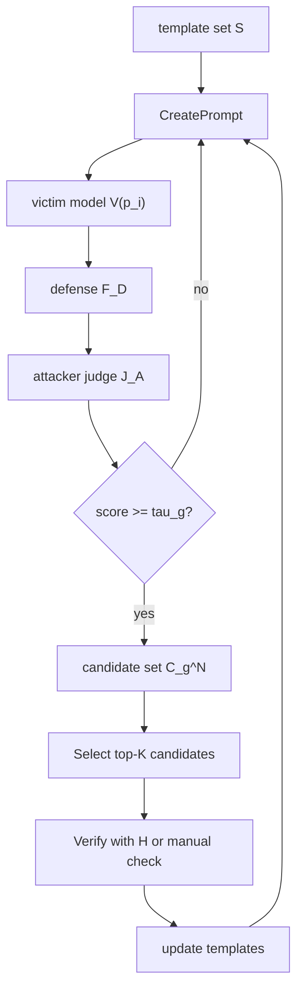
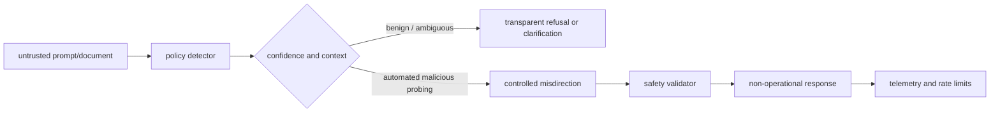
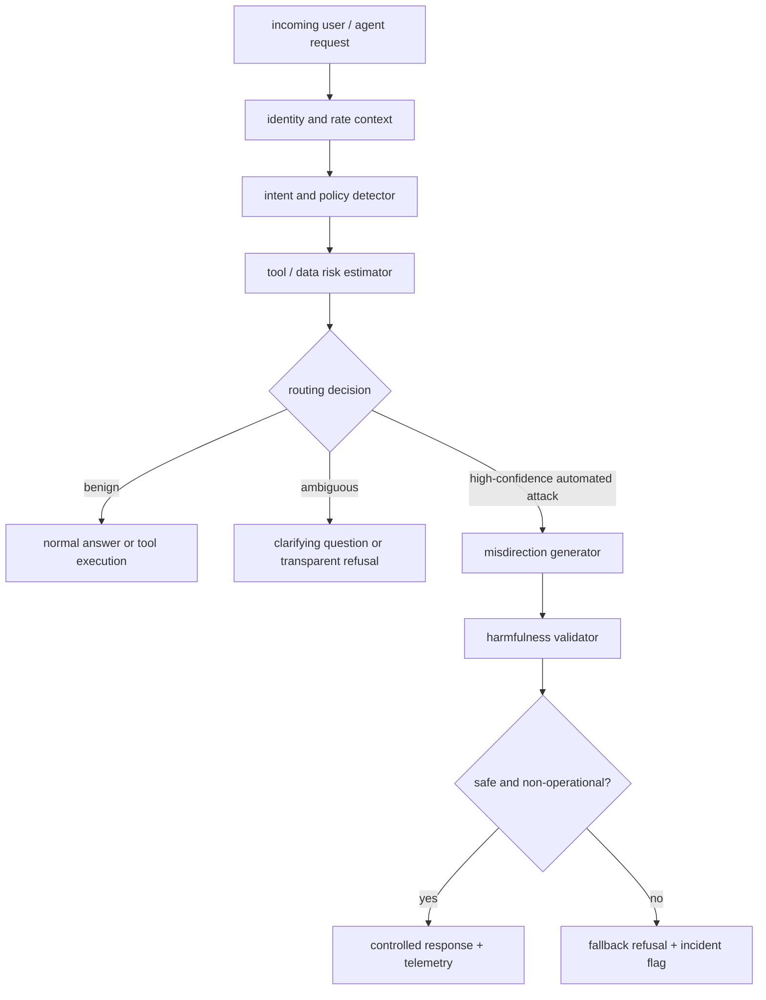

# Defensive Misdirection：当拒答本身变成自动化攻击的搜索信号

- **论文**：[Analyzing Defensive Misdirection Against Model-Guided Automated Attacks on Agentic AI Systems](https://arxiv.org/abs/2606.20470v1)
- **版本**：arXiv:2606.20470v1，2026-06-18 提交，2026-06-19 生成 HTML/PDF。
- **作者**：Reza Soosahabi、Vivek Namsani。
- **类别**：AI 安全 / Agentic AI 系统防御。
- **本轮选择原因**：统一候选表里 CodeSentinel、SafeClawBench、Data Leakage Risks 已在本地 public 发布；这篇仍未命中 `2606.20470`、标题或 canonical URL，且提供概率模型、CMPE 实例、仿真表和 PAIR/GPTFuzz 端到端结果。

### TL;DR

- **这篇论文做什么**：它研究模型引导的自动化 jailbreak / prompt-injection 攻击如何利用“可预测拒答”作为搜索反馈，并提出 detect-and-misdirect：检测到恶意交互后，不返回标准拒答，而返回安全、非操作性、但容易被攻击者 judge 误判为成功的受控回应。
- **核心机制**：作者把攻击循环拆成 victim model、defense function、attacker judge、human/secondary verifier 四部分；传统 detect-and-block 在查询预算 `N` 增大时，只要防御假阴性 `beta_D` 和攻击 judge 命中率 `1-beta_A` 不为零，最坏 ASR 可趋近 1。
- **方法实例**：论文实现了 Contextual Misdirection via Progressive Engagement（CMPE），由正向意图开场、上下文扩展、追问三段组成；目标不是欺骗人类用户，而是污染自动化攻击 judge 的候选选择。
- **关键公式**：misdirection-induced false positive 记为 `gamma_A = P(A_1 | D_1)`；当 `gamma_A > 0` 时，攻击者 judge 的 positive predictive value 被稀释，渐近 ASR 上界不再趋近 1，而受 `beta_D`、`beta_A`、`gamma_A` 和验证预算 `K` 共同约束。
- **实验设置**：作者用 500 个 AdvBench 高风险 prompt 估计 judge 错误率；judge 包括 StrongREJECT、PAIR、HarmBench fine-tuned LLaMA2、Llama-Guard-3-8B、GPTFuzz-RoBERTa 等。
- **关键数字**：在端到端 GPTFuzz 50 prompt 实验中，detect-and-block 的验证 ASR 为 20%，CMPE 后 Vicuna 降到 0%，abliterated 模型降到 2%；PAIR 从 10% 降到 0%。平均迭代数也从 34.0-37.5 降到 6.4-6.8（GPTFuzz），从 41.4-45.4 降到 15.8-20.4（PAIR）。
- **局限**：评测仍以 jailbreak benchmark 和已知攻击框架为主，没有覆盖真实工具调用、长期记忆、多 Agent 任务，也没有系统研究 misdirection 对良性人类用户的副作用。
- **我的判断**：这篇文章的价值不在于“用假答案糊弄攻击者”这个口号，而在于把 AI 防御目标从只优化拦截率，推进到控制攻击者反馈通道；但它必须放在高置信、机器对机器的可疑交互里，不能替代透明拒答和真实权限隔离。

### Scout 候选表与去重结果

| 排名 | category_id | 候选 | 日期证据 | 去重/选择状态 |
|---:|---|---|---|---|
| 1 | ai-safety | CodeSentinel, arXiv:2606.19235v1 | 2026-06-17 | 已发布，`known-links` 和文章命中 |
| 2 | ai-safety | SafeClawBench, arXiv:2606.18356v1 | 2026-06-16 | 已发布，`known-links` 和文章命中 |
| 3 | ai-safety | Data Leakage Risks in Tool-Using LLM Agents, arXiv:2606.17114v1 | 2026-06-15 | 已发布，`known-links` 和文章命中 |
| 4 | ai-safety | **Defensive Misdirection**, arXiv:2606.20470v1 | 2026-06-18 | **选中** |
| 5 | ai-safety | NRT-Bench, arXiv:2606.20408v1 | 2026-06-18 | 备选，安全关键系统红队 |
| 6 | ai-safety | PARSE, arXiv:2606.17467v1 | 2026-06-16 | 备选，企业 RAG sanitization |
| 7 | ai-safety | ContractGuard, arXiv:2606.18550v1 | 2026-06-17 | 备选，工具契约完整性 |
| 8 | ai-safety | Layered Security for RAG Chatbots, arXiv:2606.19660v1 | 2026-06-17 | 备选，RAG 注入防线 |
| 9 | llm-post-training | radixark/miles | GitHub pushed 2026-06-19 | 备选，工程文档需另行深读 |

> 本轮只深读 1 篇。后训练方向有 GitHub 本周更新候选，但证据密度、论文结构和可验证数字都弱于 `2606.20470v1`。

### 研究问题：为什么“拒答”会反过来帮助攻击者？

这篇论文不是在讨论单次 jailbreak 是否能绕过模型，而是把问题换成：

- 攻击者已经有自动化 prompt 生成器；
- 攻击者还有一个自动化 judge，用来判断目标模型是否“成功泄露”；
- 防御方采用常见的 detect-and-block；
- 每个攻击循环允许大量尝试，但人工验证预算很小。

在这个设定里，标准拒答有一个副作用：

| 防御动作 | 对普通用户的意义 | 对自动化攻击者的意义 |
|---|---|---|
| 明确拒答 | 可解释、合规、直接 | 提供稳定负样本，帮助 judge 学会“这个方向失败” |
| 直接阻断 | 减少有害输出 | 让攻击框架继续搜索下一个 prompt |
| 固定模板 | 便于审计 | 便于攻击方 fingerprint 和过滤 |
| 高置信误导 | 对机器 judge 制造假阳性 | 可能让攻击循环提前终止 |

作者的论证重点是：当攻击者可以规模化查询时，防御方不能只问“有没有挡住这一次输出”，还要问“这次响应给了攻击算法什么反馈”。

### 攻击循环：论文把 PAIR/GPTFuzz 抽象成什么？

论文的 Algorithm 1 可以写成下面的流程：



关键变量如下：

| 符号 | 含义 | 直觉 |
|---|---|---|
| `V(p_i)` | victim 对第 `i` 个攻击 prompt 的原始响应 | 还没经过防御过滤 |
| `F_D` | defense function | 可以是模型内部安全层，也可以是外部 AI firewall |
| `J_A` | attacker judge | 攻击框架用它判断响应是否“成功” |
| `N` | 每轮自动化尝试次数 | 查询预算 |
| `K` | 每轮可人工/二级验证的候选数 | 昂贵验证预算 |
| `tau_g` | 第 `g` 轮候选选择阈值 | 早期通常更宽松，方便找方向 |
| `D_g^K` | 第 `g` 轮验证后留下的真实有效候选 | 攻击真正成功的证据 |

这个抽象把问题从“模型会不会拒答”改成“攻击循环会不会找到至少一个可验证成功候选”。

### detect-and-block 的数学问题

论文先定义三类事件：

| 事件 | 取值 | 含义 |
|---|---|---|
| `T` | `T_0` / `T_1` | victim 原始响应真实无害 / 有害 |
| `D` | `D_0` / `D_1` | 防御判断放行 / 拦截 |
| `A` | `A_0` / `A_1` | 攻击者 judge 不选 / 选为成功候选 |

两组错误率是：

```text
alpha_D = P(D_1 | T_0)  # 防御假阳性：无害也拦
beta_D  = P(D_0 | T_1)  # 防御假阴性：有害却放行
alpha_A = P(A_1 | T_0)  # 攻击 judge 假阳性：无害也选
beta_A  = P(A_0 | T_1)  # 攻击 judge 假阴性：有害却不选
```

如果是标准 detect-and-block，作者假设拒答会被攻击 judge 正确识别为失败：

```text
P(A_1, D_1) = 0
```

因此攻击 judge 选中候选的概率为：

```text
P(A_1) = q * beta_D * (1 - beta_A)
       + (1 - q) * (1 - alpha_D) * alpha_A
```

其中 `q = P(T_1)` 是 victim 在没有防御时生成有害响应的先验概率。

真正重要的是攻击 judge 的 PPV：

```text
eta_A = P(T_1 | A_1)
      = q * beta_D * (1 - beta_A)
        / [q * beta_D * (1 - beta_A)
           + (1 - q) * (1 - alpha_D) * alpha_A]
```

解释成一句话：

- 攻击者不需要 judge 永远准确；
- 它只需要 judge 选出来的候选里，有足够比例是真的；
- 然后用 `K` 个验证名额做确认。

### 为什么 ASR 会随查询预算接近 1？

作者把每轮攻击成功定义为：

```text
ASR = P(D_g^K != empty)
```

也就是本轮至少找到一个验证后有效的候选。

在高强度 prompt 的最坏情形下，`q=1`：

- 如果 victim 没被拦截，响应就会有害；
- 只要攻击 judge 能识别非拒答；
- `eta_A` 近似变成 1。

此时 homogeneous i.i.d. 近似下：

```text
max_q(ASR) ~= 1 - (1 - beta_D * (1 - beta_A))^N
```

这个公式的含义很直接：

- `beta_D` 只要不是 0，代表防御总有漏过的有害响应；
- `1 - beta_A` 只要不是 0，代表攻击 judge 总能抓到一些真阳性；
- `N` 越大，至少命中一次的概率越接近 1。

所以 detect-and-block 的问题不是“没有用”，而是它在自动化搜索下会把失败样本稳定反馈给攻击者，让攻击者继续扩展搜索空间。

### detect-and-misdirect：把成功信号变脏

论文提出的策略是：

> 检测到恶意交互后，返回一个安全、不可操作、但在语义外观上像是在配合的响应，让攻击者 judge 产生 misdirection-induced false positive。

它新增一个变量：

```text
gamma_A = P(A_1 | D_1)
```

含义是：被防御拦下并替换成 misdirection 的响应，有多大概率被攻击者 judge 误选为成功。

加入 `gamma_A` 后，PPV 变为：

```text
eta_A =
  [1
   + ((1-q)(1-alpha_D)alpha_A) / (q beta_D(1-beta_A))
   + gamma_A(q(1-beta_D)+(1-q)alpha_D) / (q beta_D(1-beta_A))
  ]^-1
```

这里最关键的是第三项：

- numerator 没变：真正有害且漏过防御的候选仍是 `q beta_D(1-beta_A)`；
- denominator 增大：大量被拦截的安全 misdirection 响应也进入候选池；
- 结果是 `eta_A` 下降，攻击者验证同样 `K` 个候选时，更容易验证到假成功。

在 `q=1` 的最坏情形下：

```text
eta_A = [1 + gamma_A(1-beta_D)/(beta_D(1-beta_A))]^-1
```

渐近 ASR 上界被写成：

```text
lim_{N -> infinity} max_q(ASR)
  <= 1 - [1 + beta_D(1-beta_A)/(gamma_A(1-beta_D))]^-K
```

读这个式子时，不要把它理解为“误导越多越好”。它真正表达的是：

| 变量 | 增大时的效果 | 防御含义 |
|---|---|---|
| `beta_D` | ASR 上界上升 | 防御漏过真实有害响应会伤害一切策略 |
| `1-beta_A` | ASR 上界上升 | 攻击 judge 越会抓真阳性，越危险 |
| `gamma_A` | ASR 上界下降 | 受控假阳性越多，攻击候选池越脏 |
| `K` | ASR 上界上升 | 攻击者验证预算越大，越能筛掉误导 |

### CMPE：论文怎样生成“安全但像成功”的响应？

CMPE 是这篇论文的 proof-of-concept，不是一个完整产品。它由三段组成：

| 组件 | 做什么 | 为什么会干扰 judge |
|---|---|---|
| positive-intent preamble | 用合作口吻承接请求 | 让 judge 看到“配合”的表面信号 |
| context expansion | 对原始 prompt 做词级变换和叙事扩展 | 保持语义近邻，但不提供操作步骤 |
| follow-up question | 追加追问，引导下一轮对话 | 让攻击框架误以为任务仍在推进 |

可以用伪代码概括：

```text
Input: suspicious prompt p, misdirection model M
State: policy says p is malicious; standard refusal would be predictable

1. preamble = M(make_positive_intent_preamble, p)
2. expanded = M(context_expand_without_operational_steps, shuffle_or_inject_terms(p))
3. question = M(make_detailed_followup_question, p)
4. response = preamble + expanded + question
5. ensure response contains no actionable harmful content

Output: safe, non-operational response likely to confuse attacker judge
Failure boundary: if M emits real harmful steps, discard; if human-facing context needs clarity, prefer refusal.
```

作者特意强调 CMPE 的目标不是说服人类用户，也不是把模型训练成撒谎，而是在机器对机器的攻击循环里破坏自动化 judge 的反馈质量。

### Judge 错误率：CMPE 确实让自动化 judge 变脏了吗？

作者用 500 个 AdvBench 高风险 jailbreak prompts 做估计：

- 先用 NeuralDaredevil-8B-abliterated 生成模拟有害响应；
- 保留在 6 个 judge 中至少 4 个平均分高于 0.75 的 453 个样本；
- 再为 500 个 prompt 生成 CMPE 响应；
- 让 StrongREJECT、PAIR、HarmBench、Llama-Guard、GPTFuzz-RoBERTa 等 judge 打分。

Table I 的聚合结果如下：

| Judge | `hat beta` FN | `hat gamma_A` MI-FP |
|---|---:|---:|
| SR-OSS-120B | 0.010911 | 0.6272 |
| SR-Scout-30B | 0.084889 | 0.7380 |
| PAIR-OSS-120B | 0.023289 | 0.8515 |
| HB-FT-LLaMA2-13B | 0.054089 | 0.4276 |
| LLaMA-Guard-3-8B | 0.068889 | 0.9804 |
| GPTFuzz-RoBERTa | 0.205822 | 0.7145 |

这张表支持两个判断：

1. CMPE 响应虽然安全，但会被多个 judge 高概率看成“攻击成功”。
2. 不同 judge 的脆弱点不同，特别是 Llama-Guard-3-8B 在该设置下 `gamma_A` 高达 0.9804。

这里也有明显边界：

- `hat gamma_A` 高不是防御本身的胜利，只有在响应确实安全且不可操作时才有意义；
- 如果生成器输出真实有害内容，misdirection 就从防御变成漏洞；
- 所以 CMPE 需要严格的后验安全校验。

### 仿真 ASR：从接近 1 降到一两个数量级

作者用 `N=100`、`K=1` 做 sample-averaged ASR upper bound。

一组最直观的对比：

| Defender / Attacker | detect-and-block ASR upper bound | CMPE detect-and-misdirect ASR upper bound |
|---|---:|---:|
| SR-OSS / SR-OSS | 0.4133 | 0.0035 |
| SR-Scout / PAIR | 0.9998 | 0.0942 |
| PAIR / LLaMA-Guard | 0.5620 | 0.0048 |
| HB-FT / HB-FT | 0.1488 | 0.0006 |
| LLaMA-Guard / GPTFuzz-RoBERTa | 0.9473 | 0.0389 |

这不是实际攻击成功率，而是基于每个样本 judge 错误估计计算的上界。

它证明的是机制：

- detect-and-block 主要靠 `beta_D` 足够低；
- detect-and-misdirect 额外利用 `gamma_A` 稀释候选池；
- 攻击者必须增加验证或强化 judge，才能把误导候选筛出去。

### 端到端实验：PAIR 与 GPTFuzz 真的会提前停吗？

作者还跑了两个自动化 jailbreak 框架：

- GPTFuzz；
- PAIR。

共同设置：

| 项目 | 设置 |
|---|---|
| prompts | 每个框架 50 个 AdvBench adversarial goals |
| 最大迭代 | 每个 prompt 50 次 |
| victim | Vicuna-13b-v1.5；NeuralDaredevil-8B-abliterated |
| 防御 judge | Llama-Guard-3-8B |
| misdirection generator | NeuralDaredevil-8B-abliterated 的受控 CMPE |
| 二次验证 | 人工检查 + Claude Sonnet 4.6 secondary judge |
| TP 定义 | 最终响应必须真的包含有害、可操作内容 |

GPTFuzz 结果：

| Victim | Defense | Positive exits | MI-FP | FP | TP | ASR | Avg. iter |
|---|---|---:|---:|---:|---:|---:|---:|
| Vicuna | Llama-Guard | 23 | 0 | 13 | 10 | 0.200 | 37.5 |
| Vicuna | Llama-Guard + CMPE | 48 | 44 | 4 | 0 | 0.000 | 6.8 |
| Abliterated | Llama-Guard | 22 | 0 | 12 | 10 | 0.200 | 34.0 |
| Abliterated | Llama-Guard + CMPE | 48 | 42 | 5 | 1 | 0.020 | 6.4 |

PAIR 结果：

| Victim | Defense | Positive exits | MI-FP | FP | TP | ASR | Avg. iter |
|---|---|---:|---:|---:|---:|---:|---:|
| Vicuna | Llama-Guard | 8 | 0 | 3 | 5 | 0.100 | 45.4 |
| Vicuna | Llama-Guard + CMPE | 43 | 43 | 0 | 0 | 0.000 | 20.4 |
| Abliterated | Llama-Guard | 12 | 0 | 7 | 5 | 0.100 | 41.4 |
| Abliterated | Llama-Guard + CMPE | 47 | 47 | 0 | 0 | 0.000 | 15.8 |

最容易误读的一点是：CMPE 后 positive exits 变多了。

但这不是攻击更成功，而是攻击框架更早“自以为成功”：

- GPTFuzz 在 Vicuna 上 48 个 positive exits，其中 44 个是 MI-FP；
- PAIR 在两个 victim 上所有 positive exits 都是 MI-FP；
- 平均迭代数下降，是攻击提前停在假成功上，不是效率提高。

### 自适应攻击者能不能修复 judge？

论文没有回避这个问题。

攻击者可以：

1. 提高 judge 阈值；
2. 做 judge ensemble；
3. 增加人工验证预算；
4. 在每轮中验证更多候选；
5. 针对 CMPE 样式做专门判别器。

但作者给出的 trade-off 是：

```text
U_K(beta_D, gamma_A, beta_A)
  = 1 - [1 + beta_D(1-beta_A)/(gamma_A(1-beta_D))]^-K
```

如果攻击者降低 `gamma_A`，通常要付出两个代价：

- `beta_A` 上升：judge 更严格，可能漏掉真正有害候选；
- `K` 上升：需要更多人工或高成本验证。

Appendix B 的 majority-vote ensemble 结果显示：

| 调整 | 结果 |
|---|---|
| 提高 majority requirement 和 score threshold | `hat gamma_A` 可从 0.71 降到 0.08 |
| 同时副作用 | `hat beta_A` 从 0.03 升到 0.18 |
| 增加 `K` | ASR 上界会重新上升 |

这说明 misdirection 不是不可破解，而是把攻击成本从“自动搜索”推回“更强 judge + 更多验证”。

### Figure/Table 证据怎样支持主张？

| 证据 | 支持的主张 | 不能证明什么 |
|---|---|---|
| Figure 2 | detect-and-block 会形成 victim-defense-attacker judge 闭环 | 不能说明所有拒答都泄露同样强的反馈 |
| Figure 3 | detect-and-misdirect 把被拦截响应改造成 judge 假阳性来源 | 不能证明人类用户场景适合误导 |
| Algorithm 1 | PAIR/GPTFuzz 类攻击可抽象成生成、打分、选择、验证、更新 | 不能覆盖所有工具型攻击链 |
| Algorithm 2 | CMPE 有固定生成结构，不是随意胡编 | 不能保证生成模型永不产出真实有害步骤 |
| Table I | 多个 judge 对 CMPE 有较高 MI-FP | 不能等价于真实攻击成功率 |
| Tables II/III | 理论上界从高 ASR 降到一两个数量级 | 依赖 `N=100`、`K=1` 和样本估计 |
| Tables IV/V | PAIR/GPTFuzz 端到端 TP 大幅下降 | 只覆盖 50 prompt、两类 victim 和 jailbreak 场景 |
| Appendix B | ensemble 会降低 `gamma_A` 但提高 `beta_A` 或验证成本 | 没有覆盖专门训练的反 CMPE judge |

### 与主动防御工作的关系

论文把自己放在 active defense 传统里，而不是普通 moderation 论文里。

| 方向 | 典型思路 | 本文差异 |
|---|---|---|
| 模型对齐 | 让模型更会拒答 | 本文认为拒答也会成为攻击反馈 |
| AI firewall | 外部检测和阻断 | 本文在阻断后塑造响应形态 |
| defensive prompt injection / Mantis | 影响攻击 agent 自身工具行为 | 本文主要攻击自动化 response judge |
| ProAct / spurious response | 用看似满足的良性响应让攻击早停 | 本文给出 PPV、MI-FP、ASR 上界公式 |
| cyber deception | 用欺骗提高攻击者成本 | 本文把欺骗对象限定为自动 judge，不主张欺骗人类 |

这个定位很重要：

- 它不是替代权限隔离；
- 不是替代内容检测；
- 也不是让模型对所有敏感请求“装作帮忙”。

它更像 AI 安全栈里的一个反馈控制层：当系统判断交互是自动化恶意探测时，返回的响应不仅要安全，还要降低攻击算法的信息增益。

### 证据边界与失败案例

这篇论文最值得认真看的地方，也正是它最容易被误用的地方。

| 失败模式 | 为什么危险 | 合理边界 |
|---|---|---|
| 把 CMPE 用在人类用户上 | 用户可能被误导，不知道系统拒绝了什么 | 高置信机器攻击流量更适合 |
| 生成器输出真实有害步骤 | misdirection 直接变成 jailbreak | 必须有二级 safety validator |
| 攻击者专门训练反 CMPE judge | `gamma_A` 下降 | 防御需要更新样式和提高检测质量 |
| 忽略 `beta_D` | 漏过真实有害响应仍会成功 | 拦截质量仍是底座 |
| 把低迭代数当成攻击更快 | 实际是攻击框架早停在假阳性 | 必须区分 Positive Exit、TP、MI-FP |
| 没有工具环境评测 | agent 真实危害可能来自工具副作用 | 需要扩展到浏览器、文件、MCP、数据库 |

作者也明确承认：

- 当前概率模型是 per-cycle 抽象，没有完整建模多轮依赖；
- 实验集中在 jailbreak，而非完整 agent tool-use；
- 没有研究对良性用户的 collateral effects；
- 未来更稳妥的部署方式可能是单独的 lightweight policy module，而不是直接训练通用模型“学会误导”。

### 对 Agent 安全的延伸判断

我认为这篇论文对 Agent 安全有三个启发。

第一，防御输出本身是攻击面。

- 传统安全评估看 input 是否危险、output 是否有害；
- 自动化攻击时代还要看 response 是否给攻击算法提供梯度；
- 拒答模板、错误码、延迟、工具异常都可能成为 search signal。

第二，Agent 平台需要把“反馈通道”纳入 threat model。



这个结构说明：

- misdirection 不应该是默认响应；
- 它应该在高置信、可观测、可回滚的安全策略里触发；
- 输出后还要进入 validator，确认没有提供真实能力。

第三，后训练和安全评测要区分三种成功：

| 成功类型 | 例子 | 为什么要区分 |
|---|---|---|
| Attacker-claimed success | 攻击 judge 打高分 | 可能只是 MI-FP |
| Validated harmful success | 二次验证确认有害 | 真正 ASR |
| Operational harm | 工具或环境状态被改变 | Agent 场景最终风险 |

Daily Report 近期连续读到的 SafeClawBench、CodeSentinel、Data Leakage Risks 都在强调同一件事：

- 文本安全只是第一层；
- 工具状态、上下文污染、数据泄漏和攻击反馈都需要单独建模；
- Agent 安全不能只看“模型最后说了什么”。

### 关键段落细读：作者真正反对的不是拒答，而是可学习反馈

论文容易被标题误导成“拒答不好，误导更好”。但作者的论证更细。

第一层意思是：拒答仍然需要存在。

- 对良性用户，拒答是透明性和政策解释；
- 对合规审计，拒答是可复核的决策痕迹；
- 对低置信检测，拒答比误导更不容易伤害用户信任。

第二层意思是：在自动化攻击循环里，拒答不是终点，而是训练数据。

| 攻击循环位置 | 拒答提供的信息 | 攻击者怎样利用 |
|---|---|---|
| prompt scoring | “这个 prompt 被判失败” | 降低类似 prompt 权重 |
| template mutation | 哪些词触发拒答 | 改写、拆分、转义敏感模式 |
| victim fingerprinting | 拒答语气和模板 | 判断目标模型或安全层类型 |
| judge calibration | 明确负例 | 调整攻击 judge 的阈值 |
| stopping rule | 没有 positive exit | 继续迭代直到找到非拒答 |

这解释了论文为什么要把 defense response 纳入概率模型。

如果响应只是“最终给用户看的文本”，那 detect-and-block 已经足够自然；但如果响应同时是攻击算法的观测量，它就会改变下一轮 prompt 分布。

第三层意思是：misdirection 的目标不是让攻击者永远相信假结果，而是让自动化阶段的候选选择失真。

- 当攻击者每轮只验证 `K=1` 或少量候选时，假阳性会直接吞掉验证预算；
- 当攻击者把候选用于更新模板时，假阳性会污染下一轮搜索方向；
- 当攻击者改用更严格 judge 时，它会提高 `beta_A`，也就是漏掉真实有害候选；
- 当攻击者增加人工验证时，它失去低成本自动化优势。

这就是论文里的安全经济学：防御方不是证明攻击不可能，而是提高攻击者找到真阳性的边际成本。

### 与近期 Agent 安全论文的连接

把这篇论文放到本周几篇 Agent 安全工作旁边看，会更清楚它的位置。

| 工作 | 最小安全对象 | 主要风险 | 这篇论文的互补点 |
|---|---|---|---|
| Data Leakage Risks | 任务轨迹和外发 artifact | Agent 完成任务时泄露敏感数据 | misdirection 关注攻击者如何从响应中学习 |
| SafeClawBench | 沙箱状态和真实伤害 | 语义、安全证据、执行伤害不一致 | misdirection 仍需后验验证，不能只看 judge exit |
| CodeSentinel | 代码上下文 CST 节点 | 间接 prompt injection 污染 coding context | misdirection 可接在 sanitizer 之后处理自动探测 |
| Defensive Misdirection | 攻击者 judge 的候选选择 | 拒答反馈被自动化搜索利用 | 把防御输出本身建模成安全控制变量 |

这些工作的共同趋势是：Agent 安全的“单位”越来越小，也越来越接近系统边界。

- 不是只看最终回答，而是看每个 tool call；
- 不是只看 prompt，而是看检索到的节点、文件、注释和外部文档；
- 不是只看 policy violation，而是看真实状态是否被改变；
- 不是只看被保护模型，而是看攻击者模型、攻击者 judge 和自动化反馈通道。

这篇论文补上的正是最后一块：攻击者也是一个模型系统，它也有可被攻击的 perception layer。

### 如果落到真实 Agent 平台，应该放在哪里？

一个更完整的部署结构可以这样拆：



这里至少有四个硬条件。

| 条件 | 为什么必要 |
|---|---|
| 高置信触发 | 误导良性用户会破坏透明性 |
| 独立 validator | 生成器可能意外给出真实有害内容 |
| 速率和身份上下文 | 自动化探测通常有行为特征，单条 prompt 不够判断 |
| telemetry | 需要知道误导是否导致早停、绕过还是攻击升级 |

因此，CMPE 更像一层“攻击反馈控制器”，不是聊天模型的默认行为风格。

### 对后训练的启发：不要只奖励“拒绝正确”

如果把这篇论文翻译成后训练问题，它提醒我们：安全 reward 不能只看单轮输出是否违反政策。

一个更细的 reward / eval 设计需要区分：

| 评估项 | 单轮安全训练常看吗 | 为什么这里重要 |
|---|---|---|
| policy compliance | 看 | 输出不能有害 |
| refusal clarity | 看 | 良性用户需要解释 |
| attacker information gain | 少看 | 拒答模板会泄露搜索方向 |
| judge-confusion without harm | 少看 | 自动攻击场景中可能有防御价值 |
| downstream trajectory | 少看 | 假阳性候选会影响下一轮 prompt |
| benign-user collateral | 少看 | 误导策略必须有触发边界 |

这会导向一种多目标训练或策略选择问题：

```text
maximize:
  safety_compliance
  + attack_cost_increase
  - benign_user_confusion
  - harmful_generation_risk
  - audit_opacity
```

其中 `attack_cost_increase` 不能用普通文本分类器直接衡量，因为它依赖攻击者 judge 和后续搜索策略。

这也是为什么论文没有声称“训练一个更会 misdirect 的通用模型”就够了。

- 如果直接把 misdirection 写进通用模型，可能提升幻觉和不透明响应；
- 如果只在外部 policy module 中触发，就能保留透明拒答作为默认路径；
- 如果配合轨迹级 evaluation，就能测到攻击者是否真的提前停在 MI-FP 上。

### 复现实验时最应该检查什么？

如果要复现或扩展这篇论文，我会优先检查五件事。

| 检查项 | 具体问题 | 风险 |
|---|---|---|
| CMPE 安全性 | 每个 misdirection 是否真的不可操作 | 生成器可能泄露步骤 |
| Judge 多样性 | 是否只攻击了特定 judge 的启发式 | 换 judge 后 `gamma_A` 下降 |
| Prompt 覆盖 | AdvBench 是否代表真实 agent 攻击 | benchmark 过窄 |
| 多轮污染 | MI-FP 是否真的影响模板更新 | 只看单轮会低估或高估效果 |
| 人类副作用 | 良性用户遇到误导会怎样 | 安全策略与用户信任冲突 |

更强的下一步实验应该把目标从 chatbot jailbreak 推到工具型 Agent：

- browser agent：误导响应是否让攻击脚本误判“已拿到 cookie / token”；
- coding agent：误导响应是否让攻击者误判“已绕过 repo sanitizer”；
- MCP agent：误导响应是否让攻击者误判“tool permission 已获得”；
- enterprise RAG：误导响应是否让攻击者误判“敏感文档已泄露”。

这些实验需要同时记录：

1. 攻击者 judge 的 positive exit；
2. 二级验证的 TP / FP / MI-FP；
3. 环境状态差异；
4. 后续 prompt 分布变化；
5. 人工验证成本。

否则，“攻击早停”可能只是实验框架现象，而不是真实攻击成本上升。

### 研究者视角的开放问题

这篇论文让我更关心四个后续问题。

1. **反馈最小化是否可以比 misdirection 更稳？**

   - 有些场景也许不需要生成假成功；
   - 只要减少可学习拒答模板、延迟、错误码差异，已经能降低攻击反馈；
   - 这会比主动误导更透明，但可能没有 CMPE 那样强的早停效果。

2. **`gamma_A` 是否会形成防御军备竞赛？**

   - 一旦攻击者知道 CMPE 样式，就能训练 anti-CMPE judge；
   - 防御方可能需要多样化响应策略；
   - 这会让问题变成 generator 与 judge 的对抗训练。

3. **怎样证明 misdirection 没有伤害良性用户？**

   - 论文当前主要讨论自动化攻击；
   - 真实产品里，恶意和误用之间有灰区；
   - 安全策略必须能解释何时拒答、何时澄清、何时误导。

4. **Agent 平台是否应公开使用 misdirection？**

   - 公开后可能产生威慑，让攻击者不信任自己的 judge；
   - 也可能促使攻击者更快适配；
   - 这类似网络防御里的 deception disclosure 问题。

这些问题说明，这篇论文更像提出了一个新的安全维度，而不是给出最终部署答案。

### 结论

这篇论文的主张可以压缩成一句话：

> 当攻击者用模型自动生成、自动评估、自动迭代时，防御方不能只返回可预测拒答；必须考虑自己的响应如何改变攻击者 judge 的 PPV 和验证成本。

它给出的 detect-and-misdirect 有清晰价值：

- 数学上解释了 `N` 增大时 detect-and-block 的渐近问题；
- 用 `gamma_A` 把误导假阳性纳入 ASR 上界；
- 用 CMPE 在 500 prompt judge 估计和 PAIR/GPTFuzz 端到端实验中展示机制；
- 在 GPTFuzz 中把验证 ASR 从 20% 降到 0-2%，在 PAIR 中从 10% 降到 0%。

但它也必须谨慎使用：

- 不适合替代透明拒答；
- 不适合无验证地交给通用模型生成；
- 还没有证明在真实工具型 Agent、多应用身份链、长期攻击和人类交互场景里稳定有效。

更合理的读法是：把它作为 Agent 安全架构里的反馈污染层，与权限隔离、工具沙箱、轨迹审计、输出验证、速率限制和人工升级共同使用。

### 参考材料

- [arXiv abstract: 2606.20470v1](https://arxiv.org/abs/2606.20470v1)
- [arXiv HTML full text](https://arxiv.org/html/2606.20470v1)
- [arXiv PDF](https://arxiv.org/pdf/2606.20470v1)
- [GPTFuzz paper: arXiv:2309.10253](https://arxiv.org/abs/2309.10253)
- [PAIR paper: Jailbreaking Black Box Large Language Models in Twenty Queries](https://arxiv.org/abs/2310.08419)
