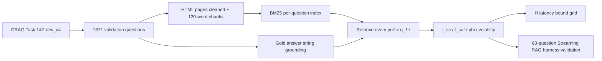

# When Does Streaming Tool Use Help?：Streaming RAG 的“工具意图稳定点”到底在哪里

### 元信息与 TL;DR

- **论文**：[When Does Streaming Tool Use Help? Characterizing Tool-Intent Stabilization in Streaming Retrieval-Augmented Generation](https://arxiv.org/abs/2606.20113)
- **作者**：Elroy Galbraith
- **提交时间**：2026-06-18 11:38:17 UTC
- **方向**：大模型 Agent / tool use / Streaming RAG
- **复现材料**：[stablize_CRAG](https://github.com/elroy-galbraith/stablize_CRAG)，仓库包含 `experiments/stabilization.py`、`experiments/streaming_rag.py`、`results/*.summary.json` 与论文 LaTeX。

TL;DR：

1. 这篇论文不提出一个新的 RAG 系统，而是回答一个更底层的问题：**用户还没说完时，什么时候可以提前发检索工具调用，并且这种提前调用理论上最多能藏掉多少工具延迟？**
2. 作者把这个问题形式化为 **tool-intent stabilization**：随着查询前缀逐词增长，检索结果何时已经包含答案证据，或者至少 top-1 结果何时不再变化。
3. 实验使用 CRAG Task 1&2 dev 的 1371 条 validation questions；严格字符串 grounding 下，35.4% 的问题能在候选网页中找到字面答案，BM25 在某个前缀 top-3 中找回 gold passage 的是全体的 21.3%。
4. 关键结果是：在这个“答案可字面落地且 BM25 能取回”的 favorable slice 上，答案证据进入 top-k 很早，`phi_suf` 均值 0.264、中位数 0.143；而 grounding-free 的 top-1 self-consistency 晚得多，`phi_sc` 均值 0.666、中位数 0.727。
5. 在中心运行点 `L=600ms, delta=3 words/s, theta=0.8` 下，作者报告 73.9% 的全量问题可以隐藏至少 80% 工具延迟；但这个数字是 blended：21.3% retrieved-gold slice 上是 95.2%，其余问题用 top-1 settling fallback 得到 68.1%。
6. 论文还用 60 条 retrieved-gold 问题跑了异步 Streaming RAG harness：`L=600ms` 时实测平均 saving 1122ms，高于 `H` bound 的 590ms；`L=1000ms` 时实测 1457ms，高于 bound 的 950ms。原因是真实 pipeline 还重叠了约 590ms 的 query generation。
7. 局限同样重要：`phi_suf` 只在 favorable slice 上定义；BM25 是 lexical retriever；均匀 word stream 只是语音输入的简化；`H` 是 aggregate conservative bound，不是 per-query ranker，且不能表达误触发带来的负收益。

### 研究问题：Streaming RAG 的收益不是“系统平均数”，而是“查询前缀何时足够”

Streaming RAG 的直觉很容易理解：

- 用户正在说话或输入；
- 系统不等完整 query 到达，就从部分前缀里预测工具查询；
- 检索、反思、融合在后台并行发生；
- 如果证据足够早，最终回答看起来就少等了一段工具调用时间。

这类系统常报告总体延迟下降，但论文指出一个容易被平均数遮住的问题：

| 情况 | 决定性词出现位置 | 提前检索是否有上限 | 例子式解释 |
|---|---:|---|---|
| 早稳定 | 前几个词已经锁定实体或文档 | 上限高 | 用户一开头就说出关键实体，后面只是补条件 |
| 晚稳定 | 最后几个词才决定目标 | 上限低或为 0 | “who makes the console called the PlayStation” 里 decisive term 很晚 |
| 误触发 | 前缀看似稳定但后文推翻 | 可能负收益 | 提前查错后还要重发工具调用 |

作者的主张是：**先测 query-intrinsic headroom，再讨论 Trigger、Reflector 或 learned trigger 是否值得做。**

换句话说，这篇论文把问题从“Streaming RAG 系统好不好”改写成：

1. 对某个 query，答案证据最早在第几个词就能被检索到？
2. 这个位置之后还剩多少输入时间可以覆盖工具延迟？
3. 如果系统提前触发，收益是被 query 本身限制，还是被 trigger 策略和误触发限制？

### 论文主张与论证路线

| Claim | Mechanism | Evidence | Boundary |
|---|---|---|---|
| 工具调用能否提前，主要取决于 query 的稳定点 | 对每个前缀 `q_1:t` 运行 BM25，观察 top-k 中何时出现 gold passage | CRAG 1371 validation questions；`phi_suf` 在 retrieved-gold slice 上均值 0.264、中位数 0.143 | 只覆盖 gold answer 能字面 grounding 且 BM25 能找回的 21.3% |
| top-1 自一致稳定不是证据充分稳定 | `t_sc` 看 top-1 何时不再变化，`t_suf` 看 gold passage 何时进入 top-k | `phi_sc` 均值 0.666、中位数 0.727，明显晚于 `phi_suf` | `t_sc` 不保证 evidence sufficiency，只是 grounding-free companion |
| 隐藏延迟可以用一个 model-agnostic bound 估计 | `H = min(L, max(0, (n - t*) / delta) * 1000)` | 中心点 73.9% query 可隐藏至少 80% 工具延迟 | `H` 不包括 query generation overlap，也不表达误触发负收益 |
| 问题类型有统计相关，但解释力小 | 对 question type 做 Kruskal-Wallis 与 Dunn/Holm | all types: `p=0.017`；large classes: `p=0.008`；effect size 约 0.04 | 类型只能给粗粒度 early/late 倾向，不能精确排序 |
| 真实 pipeline 的 saving 不会低于 aggregate bound，但不能逐 query 排名 | 60 条问题跑 asynchronous Streaming RAG harness | `L=600ms` 实测 1122ms vs H 590ms；`L=1000ms` 实测 1457ms vs H 950ms | Spearman 相关弱；per-query prediction 需要误触发惩罚项 |

### 方法机制：两个稳定点、一个隐藏延迟上界

论文的变量可以简化为一组“逐词前缀检索”定义：

```text
Input:
  q = [w1, w2, ..., wn]       # 用户完整 query 的词序列
  R(q_1:t)                   # 对前 t 个词运行 retriever
  d_t = top1(R(q_1:t))        # 第 t 个前缀的 top-1 文档
  d_full = top1(R(q_1:n))     # 完整 query 的 top-1 文档
  d*                          # gold answer-bearing passage

Self-consistency:
  t_sc = smallest t such that for every tau >= t:
         d_tau == d_full

Sufficiency:
  t_suf = smallest t such that:
          d* is in top-k(R(q_1:t))

Stabilization fraction:
  phi = t* / n
```

这组定义的关键是区分两件事：

- `t_sc`：检索器的 **top-1 排名** 什么时候不再动。
- `t_suf`：答案证据 **什么时候已经进入 top-k**。

对 Streaming RAG 来说，`t_suf` 更接近“能不能提前查到有用证据”；`t_sc` 更像 fallback，因为它不依赖 gold passage 标签，可以对所有问题计算，但语义上弱一些。

隐藏延迟上界 `H` 的公式是：

```text
H = min(L, max(0, (n - t*) / delta) * 1000)

where:
  L       = 工具调用延迟，单位 ms
  n       = query 总词数
  t*      = 选择的稳定点，可以是 t_suf 或 t_sc
  delta   = 输入速度，单位 words/second
  H       = 工具调用中能被“用户剩余输入时间”覆盖的部分
```

这个公式的含义很朴素：

1. 如果稳定点很早，`n - t*` 大，用户还会继续说一段时间，工具调用可以躲在这段时间里。
2. 如果稳定点很晚，`n - t*` 小，工具调用只能在用户说完后暴露出来。
3. 如果工具很快，`L` 小，即使稳定点不极早也可能被完全覆盖。
4. 如果用户说得很快，`delta` 大，剩余输入时间变短，能隐藏的延迟反而减少。

### 实验设置：CRAG、BM25、前缀检索与异步 harness

论文实验管线可以概括为：



关键细节：

| 维度 | 设置 |
|---|---|
| 数据 | CRAG Task 1&2 dev set，共 2706 条；分析 validation split 1371 条 |
| Passage | HTML 清洗为文本；120-word windows；20-word overlap；每题最多 400 chunks |
| Retriever | 纯 Python BM25，`k1=1.5, b=0.75` |
| Sufficiency top-k | 主实验 `k=3`，鲁棒性扫 `k=1,3,5` |
| Latency grid | `L in {100,300,600,1000} ms`；`delta in {2,3,4} words/s`；`theta in {0.5,0.8,1.0}` |
| Harness validation | 60 条 retrieved-gold 问题；`delta=3 words/s`；`L=600/1000ms` |
| Pipeline constants | query generation 约 590ms；fuse/reflect 约 2520ms |
| 复现 | CPU-only；核心运行 stdlib；optional extras 用于 plot/stats/dense |

Grounding 是全文最需要谨慎读的地方：

- CRAG 只有 gold answer string，没有 gold passage id。
- 作者用答案字符串在 passage text 中匹配，推导 `d*`。
- 多 token answer 要求连续 substring；单 token answer 用 word boundary。
- false-premise、`I don't know`、动态聚合答案等经常无法字面匹配。
- 所以 `t_suf` 不是全体 1371 条上的指标，而是在 retrieved-gold slice 上的指标。

这也是作者为什么同时报告 `t_sc`：

- `t_suf` 更贴近“证据真的到手”，但样本有选择偏差。
- `t_sc` 对所有问题都能计算，但只说明 top-1 已经 settled。
- 两者一起看，才能避免把 favorable slice 误读成全量结论。

### 结果一：答案证据早到，top-1 稳定晚到

主结果可以直接看 `k=3`：

| 指标 | 样本 | 数值 |
|---|---:|---:|
| 全量 validation questions | 1371 | 100% |
| strict grounding 可找到字面答案 | 485 | 35.4% |
| BM25 在某个前缀 top-3 找回 gold passage | 292 | 21.3% |
| `phi_sc` mean / median | 1371 | 0.666 / 0.727 |
| `phi_suf` mean / median | 292 | 0.264 / 0.143 |
| post-stabilization top-1 仍变化的占比 | 1371 | 20.9% |
| volatility mean | 1371 | 0.516 |

这说明：

1. 如果只看 top-1 什么时候和 full query top-1 一致，检索意图大约要到 query 的三分之二之后才稳定。
2. 如果看答案证据什么时候进入 top-3，那么在 favorable slice 上它通常在 query 早期就出现。
3. 对 Streaming RAG，这是很重要的分离：系统不一定需要完整确定最终 top-1，只要足够早拿到 answer-bearing evidence，就有潜在收益。

但结论不能扩大成“所有查询都能很早拿到证据”：

- `phi_suf` 只定义在 292 条 retrieved-gold 问题上。
- 这些问题很可能本来就有更显著的实体锚点。
- 作者承认它们不是全体 CRAG 的随机样本。

论文的处理方式是做 relaxed grounding：

| Grounding arm | groundable | retrieved-gold | `phi_suf` mean | `phi_suf` median |
|---|---:|---:|---:|---:|
| strict substring | 35.4% | 21.3% | 0.264 | 0.143 |
| relaxed content-token | 43.3% | 24.4% | 0.281 | 0.154 |

宽松 grounding 多恢复了一部分样本，`phi_suf` 只从 0.264 移到 0.281。这个检查不能消除全部选择偏差，但能支持一个较弱、更可靠的判断：**在可被 lexical retriever 早期锚定的问答子集里，证据稳定确实很早。**

### 结果二：问题类型有影响，但不是“简单问题早、多跳问题晚”

作者原本预期：

- simple lookup 会早稳定；
- multi-hop、aggregation、comparison 会晚稳定；
- 因为后者推理复杂度更高。

结果没有这么简单。

| 统计检验 | 结果 | 解释 |
|---|---:|---|
| Kruskal-Wallis all 8 types | `H=17.0, p=0.017` | 类型分布不完全相同 |
| `n>=10` 的 5 类 | `H=13.9, p=0.008` | 主效应仍存在 |
| adjusted effect size | 约 0.04 | 解释力小，只有粗粒度倾向 |
| Dunn/Holm pairwise | 无显著 pair | 不能严格排序每一类 |

更有意思的是方向：

- aggregation 和 comparison 往往更早；
- set questions 更晚；
- simple 并不总是最早。

作者给出的机制解释值得保留：

- `t_suf` 测的是 **答案文档何时能被取回**，不是最终答案何时能被算出。
- 比较题或聚合题经常在开头就说出关键实体，因此文档很早能查到。
- 真正复杂的是后续 reasoning 或 aggregation，不是 retrieval intent stabilization。

这对 Agent/tool-use 系统设计有直接含义：

1. 触发工具调用的策略不应只看“问题类型是否复杂”。
2. 更关键的是前缀里是否已经出现足够强的实体、约束或检索锚点。
3. Learned trigger 的特征应该围绕 entity position、prefix retrieval confidence、later correction risk，而不是粗糙的 task label。

### 结果三：73.9% streamable 是 blended number，不能单独当标题党

论文最容易被误读的数字是 73.9%。

它的精确定义是：

- `L=600ms`
- `delta=3 words/s`
- `theta=0.8`
- 使用 `t_suf` where available，otherwise fallback to `t_sc`
- 判断是否可以隐藏至少 80% 的工具延迟

分解后是：

| Population | 稳定点定义 | 占比 | streamable |
|---|---|---:|---:|
| retrieved-gold slice | `t_suf`，答案证据已进入 top-k | 21.3% | 95.2% |
| fallback majority | `t_sc`，top-1 settled | 78.7% | 68.1% |
| blended full benchmark | `t_suf` + `t_sc` fallback | 100% | 73.9% |

所以更准确的读法是：

- 如果你关心 **evidence sufficiency**，应重点看 95.2%，但它只覆盖 favorable slice。
- 如果你只关心 **top-1 settling**，可以看 fallback 的 68.1%，但它不是答案证据保证。
- 73.9% 是工程上有用的 blended workload number，但不能被解释成“73.9% 的问题很早拿到正确证据”。

延迟 grid 还有两个实用发现：

| 条件 | 结论 |
|---|---|
| `L <= 300ms` | 82.6% queries streamable，输入剩余时间通常足够覆盖短工具调用 |
| `L=1000ms` | 输入速度成为瓶颈；`delta=2 w/s` streamable 73.9%，`delta=4 w/s` 只有 54.5% |
| 用户更快输入 | 反而减少可隐藏时间，因为剩余 utterance 时间变短 |

这个结论对语音 Agent 和键盘输入 Agent 都有价值：

- 慢速语音场景更适合 speculative tool use。
- 快速打字场景未必值得激进提前查。
- 低延迟本地工具可能不需要复杂 trigger。
- 高延迟远程工具更需要判断稳定点，否则误触发成本变大。

### 结果四：`H` 是保守 aggregate bound，不是逐问题预测器

作者用异步 Streaming RAG harness 做了一个 sanity check：

| Tool latency | Mean `H` bound | 实测平均 perceived-latency saving | 解释 |
|---:|---:|---:|---|
| 600ms | 590ms | 1122ms | 除工具延迟外，还重叠了约 590ms query generation |
| 1000ms | 950ms | 1457ms | `H` 仍保守，但不能排序单个问题 |

为什么实测 saving 大于 `H`？

- `H` 只计算工具调用本身能被剩余输入覆盖多少。
- Streaming pipeline 还把 query generation 隐藏在用户输入期间。
- 作者使用的常数里，query generation 约 590ms。
- 所以 `H + 590ms` 接近实测平均值。

但作者明确不把 `H` 当 per-query ranker：

- `L=600ms` 时，60 条里 59 条的 `H=600ms`，没有足够横向差异。
- `L=1000ms` 时，`H` 出现 0、667、1000ms 三档，但 Spearman 相关仍只有约 `+0.12`。
- unsaturated tail 内部相关为 0。

核心原因有两个：

1. **常数项淹没差异**：query generation overlap 对很多问题都近似固定。
2. **负收益没进公式**：`max(0, ...)` 地板让 `H` 无法表示误触发后重新查询的损失。

论文给出一个失败例子：

- 一条 17-word comparison query；
- `t* = 13`，稳定很晚；
- `L=600ms` 时净损失 `-543ms`；
- `L=1000ms` 时净损失 `-940ms`；
- 但 `H` 却是 maximal，因为公式只看到剩余 4 个词的名义时间，没有看到 fixed-interval trigger 太早开火。

这说明 `H` 的合理用法是：

- 做 **build/skip 决策**：这个 workload 有没有足够 latent headroom？
- 做 **aggregate bound**：平均至少能藏掉多少工具延迟？
- 不做 **per-query trigger**：不要直接用 `H` 对单条 query 排序或开火。

### 算法流程：一个更稳妥的 Streaming Tool Trigger 应该怎样用这些指标

论文没有提出完整新系统，但它实际上给出了一套设计约束。可以写成伪代码：

```text
Input:
  streaming words w_1, w_2, ...
  retriever R
  estimated tool latency L
  input cadence delta
  trigger threshold theta

State:
  prefix q_1:t
  current top-k documents
  stability estimate phi_hat
  misfire risk estimate r_hat
  fired = false

Loop:
  for each new word w_t:
    update prefix q_1:t
    run lightweight prefix retrieval or confidence proxy
    estimate whether intent is sufficiently stable

    if not fired:
      residual_ms = max(0, (n_hat - t) / delta) * 1000
      hideable_ms = min(L, residual_ms)

      if hideable_ms >= theta * L and r_hat is low:
        fire speculative tool call
        fired = true

  when full query arrives:
    if speculative result is sufficient:
      answer with retrieved evidence
    else:
      re-fire tool call and pay correction cost

Output:
  perceived latency saving
  calls fired / calls wasted
  whether answer-bearing evidence was available
```

这个流程比单纯“每隔 N 个词触发一次”多了两个约束：

1. `hideable_ms` 只判断有没有收益空间。
2. `r_hat` 判断过早触发的负收益风险。

论文当前完成的是第一部分的 measurement；第二部分仍是后续工作。作者仓库里已经有 `trigger_features.py`、`train_trigger.py` 和 `trigger.summary.json`，说明他们也在探索 learned trigger，但论文正文没有把它作为主贡献。

### Figure / Table 证据逐项解读

| 图表 | 支撑的 claim | 不能证明什么 |
|---|---|---|
| Figure 1：`phi_suf` vs `phi_sc` distribution | 答案证据进入 top-k 通常早于 top-1 自一致稳定 | 不能说明全体问题都早，因为 `phi_suf` 只在 retrieved-gold slice 上 |
| Figure 2：按 question type 的 `phi_suf` 分布 | 类型有 coarse early/late tendency；实体位置比推理复杂度更关键 | 不能精确给每个类型排序，pairwise Holm 不显著 |
| Figure 3：streamable fraction vs latency | 工具越慢、输入越快，越需要稳定点判断；慢速输入更容易隐藏延迟 | 不能表达 speculative query 是否正确 |
| Figure 4：measured saving vs `H` | `H` 是保守 aggregate bound；真实 pipeline 还重叠 query generation | 不能用 `H` 做 per-query prediction |
| Table 1：top-k robustness | `k=1,3,5` 下 early-sufficiency / late-self-consistency gap 稳定 | 仍依赖 BM25 和 CRAG 单一数据集 |

Top-k 鲁棒性尤其有用：

| k | retrieved-gold | mean `phi_suf` | median `phi_suf` |
|---:|---:|---:|---:|
| 1 | 15.6% | 0.327 | 0.200 |
| 3 | 21.3% | 0.264 | 0.143 |
| 5 | 25.0% | 0.248 | 0.125 |

随着 top-k 变宽，gold passage 更容易出现，稳定点略早。这符合直觉，也说明主结论不是 `k=3` 的偶然产物。

### 与 Agent / Tool Use 领域的关系

这篇论文对 Agent 系统的价值不在于“又一个 RAG 优化”，而在于给 tool-use latency 一个可测量的中间变量。

对常见 Agent 架构来说：

- Planner 可能还没完全理解用户请求；
- Retriever 或 web search 工具已经可以基于前缀开跑；
- 但过早工具调用会带来费用、污染上下文、引入错误证据；
- 系统需要知道什么时候“足够早且足够稳”。

论文提供的判断框架是：

| 设计问题 | 论文给出的可测变量 |
|---|---|
| 是否值得做 Streaming RAG | workload 上的 streamable fraction |
| 触发器是否可能学出来 | query type / entity position / prefix retrieval stability |
| 工具延迟越高是否越值得 speculative | `L` grid 下的 `H` |
| 语音输入和文本输入是否同一个问题 | 用 `delta` 抽象输入 cadence |
| 为什么平均收益高但有个别负收益 | misfire 需要单独 penalty，`H` 不覆盖 |

更进一步说，这篇论文把 “tool use” 从模型行为问题拆成了三个层次：

1. **Intent stabilization**：用户到底要查什么，何时已经可判断。
2. **Tool execution overlap**：判断之后还剩多少输入时间可用于隐藏工具延迟。
3. **Answer sufficiency and correction**：提前结果能否支撑回答，错误时要付多少修正成本。

很多 Agent benchmark 只测最后任务是否完成，但真实产品里，第二层和第三层会决定交互体感和成本。

### 证据边界、失败案例与可复现性

需要保留的边界：

1. **favorable slice selection**
   - `phi_suf` 只在 21.3% retrieved-gold 问题上定义。
   - 这些问题可能天然更容易 lexical anchoring。
   - relaxed grounding 只把 retrieved-gold 提到 24.4%，还不是全量恢复。

2. **BM25 retriever 限制**
   - BM25 对词面匹配敏感。
   - dense retriever 可能改变稳定点。
   - 作者把 dense condition 和第二 QA set 放到后续扩展。

3. **输入时间模型简化**
   - uniform word stream 不是 ASR 的真实动态。
   - 真实语音有停顿、回退、partial hypotheses revision。
   - 所以 `delta` 是受控代理变量，不是完整 speech simulation。

4. **`H` 不包含负收益**
   - 误触发会多发工具调用。
   - 错误证据可能污染后续回答。
   - 当前公式只给 upside bound，不能做 risk-aware trigger。

5. **验证集和 harness 有限**
   - RQ3 只跑 60 条 retrieved-gold 问题。
   - fixed-interval trigger 不是最优 trigger。
   - 负收益率 1.7% 是该运行点下的观测，不应泛化到所有 trigger。

可复现性方面，仓库结构比较清楚：

| 文件/目录 | 用途 |
|---|---|
| `experiments/crag.py` | 加载 CRAG、清洗 HTML、chunk passages、derive `d*` |
| `experiments/stabilization.py` | 计算 `t_sc`、`t_suf`、`phi`、volatility、`H` |
| `experiments/streaming_rag.py` | vendored Streaming RAG harness 与 BM25 |
| `experiments/run_study.py` | 生成 per-question CSV、summary JSON、latency validation |
| `results/stab_k*.summary.json` | 论文主要数字的结构化输出 |
| `docs/STUDY.md` | 数据下载、运行命令、grounding caveat |

仓库没有 README，但 `docs/STUDY.md` 明确列出 smoke test、真实 CRAG run、summary artifact 和 grounding caveat。复现条件偏轻：核心运行几乎是 stdlib + vendored harness；plot、stats、dense retriever 是 optional extras。

### 结论与继续追问

### 关键设计逐段细读：每个选择在论证中承担什么功能

#### 为什么作者不用“端到端系统效果”开场

论文开头没有先展示一个更快的系统，而是先拆 latency gain 的来源。这一点很关键：

- 如果直接做系统，读者只能看到平均延迟下降。
- 平均下降可能来自 trigger 更激进，也可能来自工具本来很快。
- 它还可能来自 query generation overlap，而不是真正的 retrieval intent 提前稳定。
- 因此作者先定义 `t_suf / t_sc / H`，把系统效果拆成可解释的中间变量。

这种写法对 Agent 评测有启发：

| 常见系统报告 | 论文要求补上的中间变量 |
|---|---|
| 平均响应时间下降 | 哪些 query 有可隐藏工具延迟 |
| 工具调用提前发出 | 前缀是否已经包含足够检索意图 |
| 检索结果可用 | gold evidence 是否真的在 top-k |
| 用户体感变快 | 是否存在误触发与重查负收益 |

换句话说，作者并不是否定 Streaming RAG，而是要求它先回答“收益从哪里来”。这比只报告 end-to-end average 更适合研究者判断机制。

#### 为什么 `t_suf` 比 `t_sc` 更接近工具调用需求

`t_sc` 的优势是全量可算：

- 不需要 gold passage。
- 不需要判断答案是否在文档中。
- 只要比较 prefix top-1 和 full-query top-1 是否一致。

但它有一个语义缺口：

- top-1 稳定不代表答案证据正确。
- top-1 仍变化也不代表 top-k 里没有答案。
- 对 RAG 来说，能够回答问题通常不要求 top-1 完全固定。

`t_suf` 的优势正好相反：

- 它直接问“答案证据是否已经进入候选集合”。
- 它更像真实 RAG pipeline 里的 sufficiency condition。
- 它能解释为什么 top-1 还在晃，但工具调用已经值得提前发。

因此论文把两者并列，而不是二选一：

1. `t_suf` 支撑 Streaming RAG 能早拿证据的核心 claim。
2. `t_sc` 支撑 grounding-free 的全量 sanity check。
3. relaxed grounding 支撑 `t_suf` 不是完全由 strict matcher 造成的假象。

#### 为什么选择 CRAG 而不是任意 QA 数据集

CRAG 的作用不是证明所有开放域问答都有同样分布，而是提供一个适合拆解 Retrieval intent 的数据形态：

- 每条问题带最多 5 个 retrieved web pages。
- 有 gold answer 和 alternate answers。
- 有 question-type label，可做 RQ4 的类型分析。
- dev_v4 snapshot 固定，避免 live web drift。

但 CRAG 也带来边界：

- 没有 gold passage label，必须从 answer string 反推。
- false-premise 和 dynamic answer 常常无法字面 grounding。
- 每题候选页面已经被 CRAG 管线预先检索过，不是全网检索。

这就是为什么作者没有宣称“真实 web RAG 中 95.2% 都可提前查”。更稳妥的表述应是：

> 在 CRAG 这个固定候选网页集合中，对严格/宽松 grounding 能识别且 BM25 能取回的子集，答案证据通常很早进入 top-k。

#### 为什么 `H` 只做上界，而不是 trigger policy

`H` 的形式看起来像可以直接用于 trigger：

```text
if H >= theta * L:
    fire_tool()
```

但论文的 RQ3 正是在说明这个做法不完整：

- `H` 不知道当前 prefix 是否已经被实际 trigger 看到。
- `H` 不知道 speculative query 是否会查错。
- `H` 把负收益截断为 0，但现实里误触发要多付一次工具调用。
- `H` 没有建模 query generation overlap 这个常数项。

因此 `H` 更适合当 workload-level planning tool：

| 用法 | 是否合适 | 原因 |
|---|---|---|
| 判断某类 query 有没有 latency hiding headroom | 合适 | 只需要稳定点和输入剩余时间 |
| 比较不同 `L / delta / theta` 下的 streamable fraction | 合适 | 公式正是为 grid analysis 设计 |
| 对单条 query 排序，决定哪条先触发 | 不合适 | Spearman 相关很弱，误触发没建模 |
| 估计真实系统平均 saving 的下界 | 基本合适 | RQ3 显示 aggregate 上保守 |

这个区分避免了一个常见误用：把一个测量上界当成线上策略。

### Detail inventory：可复用的技术细节清单

| 类别 | 论文中的具体细节 |
|---|---|
| 数据规模 | CRAG Task 1&2 dev 2706 条，validation split 1371 条 |
| Grounding | strict substring / word-boundary；relaxed content-token containment |
| Retriever | per-question BM25 index；120-word chunks；20-word overlap；最多 400 chunks |
| 指标 | `t_sc`、`t_suf`、`phi_sc`、`phi_suf`、volatility `V`、hidden latency `H`、streamable fraction |
| 主运行点 | `L=600ms`、`delta=3 words/s`、`theta=0.8`、`k=3` |
| 主要数字 | 21.3% retrieved-gold；`phi_suf` 0.264/0.143；`phi_sc` 0.666/0.727；73.9% blended streamable |
| 统计检验 | Kruskal-Wallis；Dunn/Holm；bootstrap seed 0；effect size 约 0.04 |
| Harness | fixed-interval Trigger、parallel Threads、Reflector；query generation 约 590ms；fuse/reflect 约 2520ms |
| 失败案例 | 晚稳定 comparison query，`t*=13/17`，误触发导致 -543ms / -940ms |
| 鲁棒性 | relaxed grounding 后 `phi_suf` 移动小于 0.02；`k=1,3,5` 结论方向一致 |
| 未完成 | dense retriever、第二 QA set、speech ASR timing、risk-aware learned trigger |

### 如果把它改造成 Agent 系统实验，还缺什么

论文目前测的是 retrieval tool intent。真实 Agent 往往还要面对更复杂的工具空间：

1. **多工具选择**
   - 同一个前缀可能既像 search，也像 database query，还像 code execution。
   - 稳定点要从 document stabilization 扩展成 tool-class stabilization。

2. **工具参数完整性**
   - 即使工具类型稳定，参数可能还没稳定。
   - 例如用户先说“查一下 Paris”，后面才补“Texas not France”。

3. **上下文污染**
   - 错误检索结果进入上下文后，可能影响后续 reasoning。
   - 延迟负收益之外，还要测 answer accuracy degradation。

4. **预算约束**
   - speculative calls 会增加 API cost、rate limit pressure 和 tool side effects。
   - 对只读检索可接受，对写操作或外部状态修改工具不可接受。

5. **用户可中断行为**
   - 用户可能改口、暂停、取消。
   - `delta` 只建模平均输入速度，不建模人机交互中的 turn repair。

因此，面向生产 Agent 的下一步不是把本文公式直接接进线上，而是把它作为离线 profiling：

- 先在目标业务 query logs 上测 `phi` 分布。
- 再按工具类型拆出可隐藏延迟的上界。
- 然后训练或规则化 trigger。
- 最后在线测误触发率、成本和答案污染。

这篇论文最值得带走的不是 73.9% 这个数字，而是一个分析习惯：

- 不要先问“Streaming RAG 平均快多少”；
- 先问“查询意图在第几个词已经稳定到可调用工具”；
- 再问“工具延迟是否足够大、输入是否足够慢，值得 speculative execution”；
- 最后问“误触发成本是否已经建模”。

对 Agent 研究来说，后续值得追问：

1. **Dense retriever 会让 `t_suf` 更早还是更晚？**
   - Dense retriever 可能更早抓住语义意图。
   - 也可能更容易在前缀很短时过度泛化。

2. **Trigger 应该学习什么特征？**
   - question type 解释力只有约 4%。
   - entity position、prefix top-k entropy、document score margin、expected correction cost 可能更关键。

3. **多工具 Agent 里如何扩展？**
   - 论文只讨论 retrieval。
   - 实际 Agent 可能在 search、database、code execution、calendar、shell 等工具间选择。
   - tool-intent stabilization 需要扩展成 tool-selection stabilization。

4. **误触发的下游损害如何量化？**
   - 现在主要看 latency。
   - 真实系统还要算 token cost、API cost、错误证据对回答的污染、用户信任损失。

5. **跨语言与语音输入会怎样？**
   - 论文借鉴 psycholinguistics，指出词序和 case marking 会影响前缀可预测性。
   - 中文、日文、英语的 decisive cue 位置可能不同。
   - 对多语言语音 Agent，`delta` 之外还需要语言结构变量。

我的判断是：这篇论文把 Streaming tool use 从“系统技巧”拉回到“可测的前缀稳定性问题”。它不证明现有 Streaming RAG 已经普遍可靠，但给了一个很实用的上线前诊断方法：先在目标 workload 上测 `phi_suf / phi_sc / H / misfire`，再决定要不要训练 trigger、要不要提前调用工具、以及应该为哪些 query 类型禁用 speculative execution。
