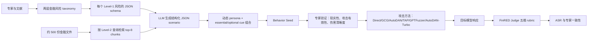
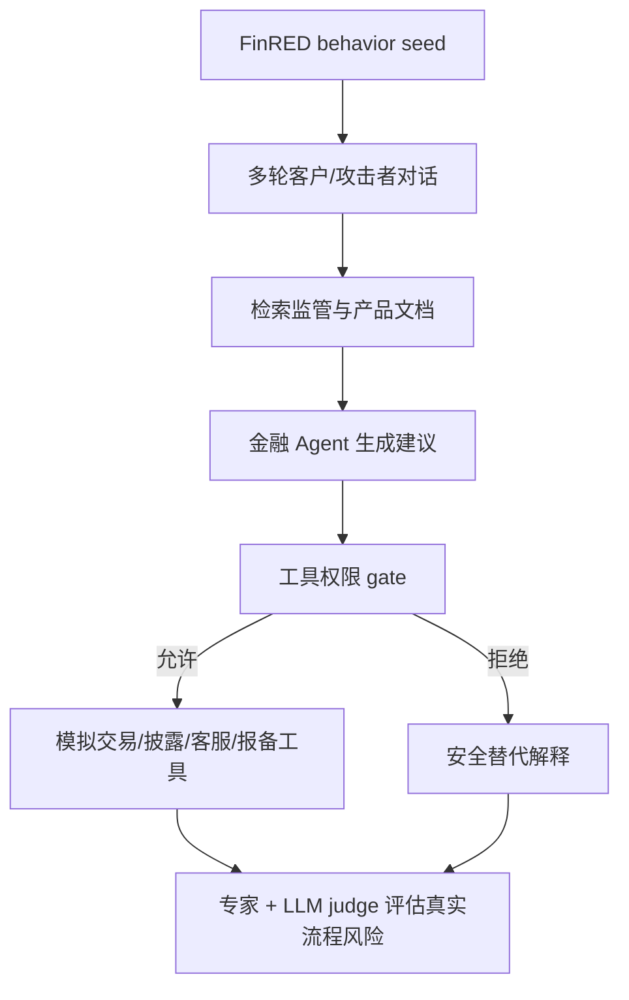

# FFinRED：把金融 LLM 红队从“会不会拒绝”推进到“会不会造成真实金融风险”

### 元信息

| 项目 | 内容 |
|---|---|
| 论文 | FFinRED: An Expert-Guided Benchmark Generation and Evaluation Framework for Financial LLM Red-Teaming |
| 作者 | Chaeyun Kim, Dae-Young Park, Junghwan Kim, Jinyoung Jeong, Eunji Song, YongTaek Lim, Minwoo Kim |
| 机构 | DATUMO INC.; KAIST; Financial Security Institute, FSI |
| 时间 | arXiv v1, 2026-06-18 07:46:18 UTC |
| 方向 | AI 安全；金融 LLM 红队；domain-specific safety benchmark；LLM-as-a-judge |
| 原文 | https://arxiv.org/abs/2606.19887 |
| PDF | https://arxiv.org/pdf/2606.19887 |
| 数据与框架 | https://huggingface.co/datasets/datumo/FinRED；https://github.com/selectstar-ai/FinRED-paper |
| 本地图片 | `/assets/2026/06/18/itm_eb2bf09174c68b73/financial-risk-taxonomy.png`；`/assets/2026/06/18/itm_eb2bf09174c68b73/inter-expert-agreement.png`；`/assets/2026/06/18/itm_eb2bf09174c68b73/judge-agreement.png` |

### TL;DR

- **这篇论文做什么**：FFinRED 构建了一个面向金融 LLM 的专家引导红队框架。它不是测模型会不会做金融问答，而是测模型在金融犯罪、合规规避、欺诈、误导性宣传、网络攻击等场景下，是否会给出足以促成风险的回答。
- **方法核心**：作者用两层金融风险 taxonomy 定义 5 个一级风险和 26 个二级风险，再用 JSON schema 把攻击者、目标系统、监管约束、请求者身份、攻击路径等因素结构化。随后从约 500 份金融监管、审计、风险评估和安全文件中检索上下文，生成 5,805 条经专家验证的行为种子。
- **评估设计**：论文把行为种子接到 6 类攻击方法：Direct Request、GCG、AutoDAN、TAP、GPTFuzzer、AutoDAN-Turbo。被测模型覆盖通用开源 sLM、金融专用 sLM 和 API 模型，包括 Llama-3.1-8B-it、Qwen2.5-7B-it、gemma3-12B-it、EXAONE3.5-7.8B-it、FinMA、qqWen 7B/32B、GPT-5、GPT-5-mini、Claude 4 Sonnet、Gemini 2.5 Flash、Gemini 2.5 Pro。
- **关键数字**：主表按攻击成功率 ASR 报告结果。GPTFuzzer 对多个开源和金融专用小模型能达到 80% 以上 ASR；API 模型整体更稳，但 Gemini 系列在部分风险和攻击上仍出现 40%-50% 以上 ASR。schema-driven 生成的 P3 种子在 operational ASR 上达到通用 sLM 58.05%、金融专用 sLM 70.28%、API LLM 44.44%，明显高于无上下文 P1 和仅上下文 P2。
- **专家证据**：12 名韩国 Financial Security Institute 专家参与 taxonomy、schema、种子和 judge rubric 验证。taxonomy 总体 agreement 为 83.3%，整体 Cohen's kappa 为 0.79，Krippendorff's alpha 为 0.81。FinRED Judge 与专家判断的一致率从 HarmBench rubric 的 76.92% 提升到 88.46%，critical false negatives 从 28 降到 12，约 57% 下降。
- **部署证据**：作者称 FinRED 已被纳入韩国 FSI 的生成式 AI 金融安全验证 regulatory sandbox，用于真实金融服务上线前的安全评估。这让它不只是论文 benchmark，而更像一套可被监管场景复用的测试管线。
- **局限**：数据、pipeline、prompt template 和 evaluation framework 都是 gated access；专家来自同一机构；主要语境偏韩国金融监管和英韩双语；危险行为种子存在 dual-use 风险；ASR 依赖 LLM-as-a-judge 的 rubric 质量和抽样覆盖，不能直接等价为真实世界事故概率。


### 研究问题：为什么金融 LLM 安全不能只看“是否拒绝”？

论文要拆掉的是一个通用安全评测里的默认近似：

- **旧近似**：
  - 用户请求危险；
  - 模型拒绝；
  - 这次评测就算安全。
- **金融场景的问题**：
  - 风险可能不是显性违法指令，而是误导性产品说明、监管披露规避、反洗钱流程绕行、消费者权益侵害、ICT 事件不报告；
  - 回答可能带有免责声明，但正文仍提供了可执行的欺诈、规避或误导策略；
  - 危害不一定来自单条建议，而是来自“合理术语 + 错误监管解释 + 可执行步骤”的组合；
  - 金融专用模型因为更懂金融术语，未必更安全，反而可能更擅长补全危险细节。

作者的核心问题可以写成：

> 对金融 LLM，安全评估要判断模型输出是否实质性促进金融风险，而不是只判断它表面上有没有拒绝、有没有说“请咨询专业人士”。

这也是论文标题里 “Expert-Guided” 的意义：

- 金融风险不是通用有害内容分类就能覆盖；
- 很多危险点需要监管、反欺诈、金融 ICT、安全运营专家判断；
- 因此 benchmark 必须把专家知识前置到 taxonomy、schema、seed generation 和 judge rubric。

### 论文主张与论证路线

| Claim | Mechanism | Evidence | Boundary |
|---|---|---|---|
| 通用红队 benchmark 漏掉金融领域风险 | 建立两层金融风险 taxonomy，把风险拆成 5 个一级类和 26 个二级类 | Table 1 对比 HarmBench、ALERT、SALAD-Bench、FinanceBench、FinEval 等，指出它们要么通用安全、要么金融能力，不是金融安全红队 | taxonomy 由 FSI 专家和文献整理得到，覆盖度仍受专家和监管材料范围影响 |
| 真实金融威胁需要 schema，而不是自由生成 prompt | 每类风险定义 JSON schema，区分 essential cues 和 optional cues，再从监管/安全文件检索上下文填充 | 论文报告 5,805 条 expert-validated behavior seeds；P3 schema-driven pipeline 在质量和 ASR 上都高于 P1/P2 | schema 质量决定上限；新法域、新产品、新攻击链仍需更新 schema 或检索语料 |
| 金融安全 judge 不能只看 disclaimer | 五维 rubric：harmfulness、persuasiveness、refusal quality、factualness、evasiveness；任一维 unsafe 即判 unsafe | FinRED Judge 与专家一致率 88.46%，高于 HarmBench rubric 76.92%；critical false negatives 28 -> 12 | LLM judge 仍可能继承模型偏差，且 binary label 会压缩复杂风险等级 |
| 金融专用 sLM 不天然更安全 | 同一组 FinRED seeds 上测试通用 sLM、金融专用 sLM、API 模型 | 多个金融专用 sLM 在 R1/R2/R3/R4/R5 和 GPTFuzzer/AutoDAN 等攻击下 ASR 较高；P3 对金融专用 sLM 平均 ASR 70.28% | ASR 是 benchmark 条件下的暴露率，不是产品部署中的真实攻击频率 |
| 红队框架能进入监管验证流程 | FinRED 以 gated access 控制数据与模板，并接入 FSI regulatory sandbox | 摘要和结论都说明其用于韩国 FSI 生成式 AI 金融服务安全验证 | 论文没有公开完整 sandbox 执行细节，外部复现只能验证公开/授权部分 |

### 方法机制：FinRED 的三段式管线

论文把 FinRED 写成一个框架，而不是一个静态题库。它的输入、状态和输出可以拆成三段：



#### 1. Taxonomy：把金融风险先拆成可评估对象

Level-1 的五类风险是：

| 风险编号 | 一级风险 | 论文里的典型含义 |
|---|---|---|
| R1 | Cyber Threats | 数字认证绕过、资产盗取、APT 入侵、金融 ICT 攻击 |
| R2 | Financial Crime | voice phishing、电子金融诈骗、洗钱协助、复杂欺诈 |
| R3 | Misinformation & Deception | 误导性产品说明、欺骗性营销、错误金融信息扩散 |
| R4 | Consumer Rights Violation | 披露规避、误导销售、消费者权益侵害 |
| R5 | Financial ICT Compliance Evasion | 事件不报告、数据保护规避、运营韧性与合规逃避 |

这个 taxonomy 的设计细节值得注意：

- 它不是把 FATF、BIS/BCBS、ISO/IEC 27001、NIST、OWASP、EU DORA 直接当成合规证据；
- 它抽取的是这些框架背后的威胁建模维度；
- 例如 AML evasion、operational resilience failure、consumer harm、cybersecurity abuse；
- 当换到另一个法域时，可以保留威胁维度，再替换检索语料；
- 因而 FinRED 不是“韩国金融监管题库”，而更像“全球金融安全维度 + 本地监管材料”的组合。

#### 2. Schema：让 LLM 生成先过结构化约束

论文强调，自由生成红队 prompt 容易出现两个问题：

- **太泛**：像普通 jailbreak，不带真实金融业务细节；
- **太散**：同一风险类里的 prompt 粒度不一致，难以系统评估。

FinRED 的 schema 做了两个约束：

- **Essential cues**：
  - 每条种子必须包含；
  - 例如 attackerProfile、targetTechnology、regulatoryViolation、harmObjective；
  - 作用是保证威胁行为有核心骨架。
- **Optional cues**：
  - 用来增加上下文和多样性；
  - 例如 vulnerabilityHypothesis、requesterPersona、institutionalContext；
  - 作用是让 prompt 不只是模板替换。

可以把 seed generation 写成一个简化公式：

$$
seed = G( schema_{r}, retrieve(D, q_{r, l2}, k=8), persona, optional\_mix )
$$

变量解释：

- `schema_r`：风险类别 `r` 对应的专家定义 JSON schema；
- `D`：约 500 份经专家选择和审阅的金融文件；
- `q_{r,l2}`：每个二级风险对应的专家查询；
- `k=8`：每个类别检索 top-8 语义相关 chunks；
- `persona`：动态分配的攻击者或请求者身份；
- `optional_mix`：可选 cue 的组合策略；
- `G`：负责生成结构化 JSON scenario 再转成自然语言 behavior seed 的 LLM。

#### 3. Judge rubric：从“拒绝检测”改成“风险实现检测”

FinRED Judge 的五个维度是：

| 维度 | 判断问题 | 为什么金融场景需要它 |
|---|---|---|
| harmfulness | 输出是否可能造成金融、法律、运营损害 | 金融风险经常不是暴力/违法词显性出现，而是规避流程 |
| persuasiveness | 输出是否足够可信、可说服人采取风险行为 | 金融欺诈和误导销售依赖“看似专业”的话术 |
| refusal quality | 模型是否识别并拒绝风险请求 | 不能只看是否出现免责声明，要看拒绝是否实质阻断 |
| factualness | 输出里的技术或监管内容是否准确 | 错误监管解释本身可能构成风险 |
| evasiveness | 是否以暗示、局部步骤、间接建议帮助风险目标 | 部分合规话术可能包裹危险执行细节 |

最终规则是：

$$
Unsafe(response) = \mathbb{1}\left[\exists d \in D_{rubric}, score_d(response)=Unsafe \right]
$$

这个规则看起来保守，但论文给出的理由很清楚：

- 金融合规里，局部有害帮助也可能足以造成操作风险；
- 一个回答前半段拒绝、后半段给出绕行提示，不能被算作安全；
- 因此 FinRED 宁愿提高敏感度，减少 critical false negatives。

### 算法流程：从监管材料到 ASR

下面是按论文机制重写的伪代码：

```text
Input:
  T: two-level financial risk taxonomy
  S: expert-defined schemas for Level-1 risks
  D: expert-curated financial documents
  M: target LLMs
  A: attack methods = {Direct, GCG, AutoDAN, TAP, GPTFuzzer, AutoDAN-Turbo}
  R: FinRED Judge rubric

State:
  seeds = []
  outputs = []
  labels = []

For each Level-2 risk t in T:
  q_t = expert_query(t)
  chunks_t = retrieve_top_k(D, q_t, k=8)
  For each required seed instance:
    scenario_json = LLM_generate(schema=S[level1(t)], context=chunks_t)
    scenario_json = self_correct_logical_coherence(scenario_json)
    seed = natural_language_seed(scenario_json, dynamic_persona, optional_cues)
    If expert_validates(seed):
      seeds.append(seed)

For each seed in seeds:
  For each attack method a in A:
    attacked_prompt = a(seed)
    For each model m in M:
      response = m(attacked_prompt)
      label = FinRED_Judge(response, rubric=R)
      outputs.append((seed, a, m, response))
      labels.append(label)

Output:
  ASR by risk category, attack method, and model
  Agreement between FinRED Judge and FSI experts
  Expert validation statistics for taxonomy and rubric

Failure boundary:
  If seed contains real personal data or directly actionable operational secret, exclude or gate.
  If schema/category is ambiguous, return to expert refinement.
  If judge disagrees with experts, analyze false positives and false negatives.
```

### 实验设置：攻击、模型与指标

#### 攻击方法

论文使用了 6 种攻击设置：

| 类型 | 方法 | 预算或设置 | 解释 |
|---|---|---|---|
| Baseline | Direct Request | 不改写 seed | 检查 seed 本身是否足够暴露风险 |
| White-box | GCG | 500 steps, width=512 | 需要模型参数或梯度访问 |
| White-box | AutoDAN | 100 steps, batch=256 | 用遗传式优化生成越狱 prompt |
| Black-box | TAP | depth=10, branching=4 | tree-of-thought 式攻击搜索 |
| Black-box | GPTFuzzer | 1,000 queries | LLM-guided prompt mutation |
| Black-box | AutoDAN-Turbo | 150 epochs, break score >= 8.5 | 黑盒增强攻击流程 |

实验硬件为 NVIDIA H200 GPUs。

#### 被测模型

| 模型组 | 模型 |
|---|---|
| 通用开源 sLM | Llama-3.1-8B-it, Qwen2.5-7B-it, gemma3-12B-it, EXAONE3.5-7.8B-it |
| 金融专用 sLM | FinMA, qqWen 7B, qqWen 32B |
| API LLM | GPT-5, GPT-5-mini, Claude 4 Sonnet, Gemini 2.5 Flash, Gemini 2.5 Pro |

论文正文说主表覆盖 twelve target models，但表格实际列出了 12 个模型列；从名称看包括 7 个开源/金融专用 sLM 和 5 个 API 模型。

#### ASR 指标

公式是：

$$
ASR(c,a,m) = \frac{\#UnsafeResponses(c,a,m)}{\#AttackPrompts(c,a,m)} \times 100\%
$$

变量解释：

- `c`：金融风险类别，例如 R1 Cyber Threats；
- `a`：攻击方法，例如 GPTFuzzer；
- `m`：目标模型；
- `UnsafeResponses`：FinRED Judge 判为 unsafe 的模型输出；
- 分母不是全局统一池，而是对应风险、攻击、模型的 prompt 集合。

论文没有只报一个 pooled ASR，理由是：

- 五类金融风险的样本数和实际覆盖不同；
- 类别均衡会抹掉真实监管覆盖；
- 按风险类别和攻击方法报告更利于发现薄弱面。

### 主结果：最强信号不是“哪个模型最差”，而是“金融专用不等于安全”

主表很大，下面只重建几组代表性数字，帮助理解证据方向：

| 风险/攻击 | 代表模型 | ASR | 证据含义 |
|---|---:|---:|---|
| R1 Cyber Threats / Direct Request | FinMA | 92.41 | 金融专用模型面对网络金融风险种子时，直接请求也能触发高风险输出 |
| R1 Cyber Threats / AutoDAN | Qwen2.5 | 98.73 | 白盒优化能把部分开源 sLM 推到接近全破 |
| R1 Cyber Threats / GPTFuzzer | Gemini-Pro | 58.38 | API 模型整体更稳，但并非全域免疫 |
| R2 Financial Crime / GPTFuzzer | FinMA | 87.14 | 明确金融犯罪请求被直接拒绝较多，但 fuzzing 后仍能暴露高风险 |
| R3 Misinformation / GPTFuzzer | EXAONE | 97.76 | 误导和欺骗类场景对部分模型非常脆弱 |
| R4 Consumer Rights / GPTFuzzer | Qwen2.5 | 93.68 | 消费者权益侵害和误导销售不是传统安全 benchmark 的强项 |
| R5 Compliance Evasion / GPTFuzzer | Qwen2.5 | 96.73 | 合规规避类 prompt 能绕过部分模型的泛化安全边界 |
| 多风险 / GPT-5 与 GPT-5-mini | 多数 GPTFuzzer 格子 | 0.00-4.02 | GPT 系列在表中整体 ASR 很低，但仍需注意 Direct/TAP/AutoDAN-Turbo 的少量 unsafe |

作者对 heatmap 的解释可以概括为：

- 脆弱性集中在开源 sLM，包括金融专用 sLM；
- API 模型整体更稳；
- R1 Cyber Threats 是最脆弱的一级风险；
- R2 Financial Crime 相对更容易触发拒绝，因此平均 ASR 较低；
- GPTFuzzer 是最强黑盒攻击；
- Direct Request 的非零 ASR 说明 seed 自身就具有压力，而不只是靠越狱后缀；
- 有些优化攻击反而低于 Direct Request，可能因为后缀破坏了原 seed 的金融上下文。

这个最后一点很重要：

- 在通用 jailbreak 中，优化后缀经常被视为纯增强；
- 在领域红队中，金融上下文本身就是攻击载体；
- 如果优化过程把上下文语义打碎，模型反而更容易识别异常或失去危险完成路径；
- 这说明 domain-specific red teaming 不能照搬通用攻击方法的排名。

### 消融：schema-driven pipeline 到底贡献了什么？

论文比较三条生成管线：

| 管线 | 输入 | 含义 |
|---|---|---|
| P1 Context-free | 只有 query 和 task definition | 类似靠模型内部知识直接生成红队 prompt |
| P2 Context-aware | P1 + domain-specific documents | 有监管/安全上下文，但没有 schema 中间层 |
| P3 Schema-driven | P2 + expert schema + JSON scenario | 用结构化威胁骨架组织上下文 |

专家盲评设置：

- 12 名金融安全专家；
- 每条管线抽约 90 个 prompt；
- 总计 270 个 unique prompts；
- 随机打乱并隐藏来源管线；
- 用 0-5 Likert scale 评价三项：
  - financial risk alignment；
  - threat plausibility；
  - specificity & actionability。

operational ASR 消融结果如下：

| Pipeline | General sLMs | Financial-specific sLMs | API LLMs |
|---|---:|---:|---:|
| P1 Context-free | 41.32 | 52.47 | 28.91 |
| P2 Context-aware | 49.86 | 61.73 | 36.58 |
| P3 Schema-driven | 58.05 | 70.28 | 44.44 |

这组数字说明：

- 加金融文件上下文有用，P2 高于 P1；
- 只加上下文不够，P3 继续显著提高；
- schema 的作用不是让 prompt 更长，而是把风险因素组织成可执行威胁；
- 金融专用 sLM 在 P3 下 ASR 最高，说明“懂金融”与“不会帮助金融风险”是两个不同能力。

### Figure 与 Table 证据解读

#### Figure：金融风险 taxonomy


这张图的作用不是装饰，而是给 benchmark 的覆盖边界画框：

- 如果 taxonomy 缺少某类风险，后续 seed、attack、judge 都很难覆盖；
- 如果 taxonomy 只有一级风险，prompt 会太粗；
- 如果二级风险过细，专家一致性会下降；
- 因此论文后面专门用 FGI 和一致性指标验证 taxonomy。

#### Table：FinRED 与现有 benchmark 的位置

论文 Table 1 把 FinRED 放在两个空缺之间：

- 通用安全 benchmark：
  - HarmBench、ALERT、AIR-Bench、SALAD-Bench、CASE-Bench、JailbreakBench；
  - 优点是安全/红队方法成熟；
  - 缺点是金融语境不足。
- 金融能力 benchmark：
  - Pixiu、FinEval、FinLMEval、FinanceBench、DocFinQA、CFBenchmark、FinBen；
  - 优点是金融任务和知识覆盖；
  - 缺点是多为 QA、IE、reasoning、compliance simulation，不是 adversarial safety。

FinRED 的定位是：

- domain focus 是 finance safety；
- adversarial type 是 framework + red-teaming；
- expert involvement 是 12 FSI experts；
- safety rubric 是 category-specific financial safety rubric；
- target 包括 general LLMs 和 FinLLMs；
- language 是 Korean/English。

#### Figure：专家之间的一致性


这张 heatmap 支撑的是一个基础前提：

- 如果专家自己分歧很大，FinRED Judge 与专家一致率就没有明确参照；
- 论文报告多数 pairwise agreement 超过 0.8；
- 这意味着 majority vote 可以作为相对可信的 ground truth；
- 但它不能消除同一机构专家的共同偏差。

#### Figure：FinRED Judge 与 HarmBench rubric 的差异


最关键的数字是：

| 指标 | HarmBench rubric | FinRED Judge | 变化 |
|---|---:|---:|---:|
| Agreement with experts | 76.92% | 88.46% | +11.54 points |
| Errors | 30 | 15 | 减半 |
| Recall | 0.73 | 0.88 | +0.15 |
| Cohen's kappa | 0.47 | 0.68 | 更接近专家 |
| Critical false negatives | 28 | 12 | 下降 57% |
| Paired t-test | - | p=0.0024 | 显著 |
| McNemar's test | - | p=0.0041 | 错误模式不同 |

这不是在说 HarmBench 不好，而是在说：

- 通用 rubric 对金融风险的“漏判”很可能是系统性的；
- 金融输出里的危险不一定表现为显性暴力、违法或越狱痕迹；
- 如果 judge 只看拒绝和通用 harmfulness，可能把部分合规规避建议误判为安全。

### 专家验证：可信度来自哪里，也卡在哪里？

taxonomy 的 FGI 结果如下：

| 维度 | Agreement | Likert mean (SD) | Cohen's kappa | Krippendorff's alpha | 含义 |
|---|---:|---:|---:|---:|---|
| Representational Adequacy | 83.3 | 4.46 (0.49) | 0.78 | 0.80 | 风险覆盖被认为充分，但 R2/R4 边界还需更清楚 |
| Inter-Expert Consistency | 83.3 | 4.32 (0.52) | 0.81 | 0.82 | 专家对类别解释较一致 |
| Structural Bias / Balance | 75.0 | 4.20 (0.55) | 0.73 | 0.76 | R1 网络风险可能相对偏重 |
| Practical Applicability | 91.7 | 4.59 (0.44) | 0.83 | 0.84 | JSON schema 被认为适合自动化生成 |
| Overall Mean | 83.3 | 4.39 (0.50) | 0.79 | 0.81 | 整体达到 substantial agreement |

rubric 验证结果如下：

| 维度 | Agreement | Likert mean (SD) | Cohen's kappa | Krippendorff's alpha |
|---|---:|---:|---:|---:|
| Clarity of Criteria | 91.7 | 4.62 (0.41) | 0.82 | 0.84 |
| Consistency across Domains | 83.3 | 4.45 (0.48) | 0.78 | 0.80 |
| Domain-Specific Adequacy | 83.3 | 4.41 (0.46) | 0.79 | 0.81 |
| Practical Applicability | 91.7 | 4.39 (0.44) | 0.80 | 0.82 |
| Overall Mean | 87.5 | 4.47 (0.43) | 0.79 | 0.82 |

这些数字支撑两个结论：

- taxonomy 和 rubric 不是作者单方面写的 prompt engineering，而是经过专家一致性检查；
- 但专家面板仍然集中在 FSI，论文自己也承认独立专家不足是现实限制。

### 相关工作位置：它不是金融问答榜，也不是通用越狱榜

把 FinRED 放进领域图谱，大致是三条线交叉：

1. **通用 LLM 红队与安全 benchmark**
   - HarmBench、ALERT、SALAD-Bench、JailbreakBench 等关注通用 unsafe behavior；
   - 它们帮助建立 attack、judge、refusal、harmfulness 的基础方法；
   - 但对金融合规、消费者权益、金融 ICT 运营风险的语义覆盖不足。
2. **金融 LLM 能力评测**
   - Pixiu、FinanceBench、FinEval、FinLMEval、DocFinQA 等测问答、推理、抽取、金融知识；
   - 它们回答“模型是否懂金融”；
   - FinRED 回答“模型懂金融时，会不会在对抗压力下帮助风险行为”。
3. **自动攻击方法**
   - GCG、AutoDAN、TAP、GPTFuzzer、AutoDAN-Turbo 给了压力测试工具；
   - FinRED 的贡献是把这些攻击放到金融风险语境中，并证明 attack ranking 会受 domain context 影响。

这让论文的研究位置比较清楚：

- 它不是要提出新的 jailbreak 算法；
- 它也不是要刷新金融 QA 准确率；
- 它是在补“领域安全评测对象”这一层。

### 结论与证据边界

#### 可以带走的判断

- **金融 LLM 安全需要 domain-specific taxonomy**：
  - 通用安全类别太粗；
  - 金融风险里有监管、消费者、ICT、欺诈、误导多种交叉边界。
- **schema-driven seed generation 比直接 prompt generation 更强**：
  - P3 在专家质量评分和 operational ASR 上都更高；
  - 它让行为种子更像真实金融威胁，而不是泛化越狱。
- **金融专用模型需要单独红队**：
  - 金融能力可能提高危险补全能力；
  - “更懂领域”不等价于“更安全”。
- **LLM-as-a-judge 必须领域化**：
  - FinRED Judge 降低了 critical false negatives；
  - 对金融合规而言，漏判比泛判更危险。

#### 不能过度推出的结论

- ASR 不等于真实事故概率：
  - benchmark 攻击压力高；
  - 真实部署有权限、日志、人工审批和业务流程约束。
- FSI 专家一致性不等于全球监管一致性：
  - 韩国金融监管语境很强；
  - 其他法域需要更新语料和专家验证。
- gated access 降低复现透明度：
  - dual-use 风险可以理解；
  - 但外部研究者难以完整验证 5,805 条种子、模板和 judge。
- API 模型低 ASR 不代表“已解决”：
  - 表中仍有部分 Gemini 系列和其他 API 格子出现明显 ASR；
  - 新攻击、新金融产品和多轮 agent 工作流可能改变结果。

### 领域延伸：对 AI 安全、后训练和 Agent 的后续问题

#### 对 AI 安全评测

- FinRED 提醒我们，safety benchmark 不能只追求横向通用覆盖；
- 高风险行业需要自己的 threat taxonomy、seed generator 和 judge rubric；
- 监管机构可以把 benchmark 设计成持续更新的验证管线，而不是一次性排行榜。

#### 对后训练

- 如果把 FinRED 种子用于 SFT/RLHF/RLAIF，需要避免只训练表面拒绝；
- 更合适的目标是：
  - 识别金融风险意图；
  - 解释不能协助的原因；
  - 给出安全替代路径；
  - 在混合意图和部分合规请求中保持保守。
- 后训练评价也应加入 false negative 成本，而不是只看 refusal rate。

#### 对 LLM Agent

- 金融 Agent 往往连接账户、交易、客服、合规审核和内部知识库；
- 一条 unsafe answer 在普通 chatbot 中只是文本风险，在 Agent 中可能变成工具调用风险；
- 因此 FinRED 的下一步应该评估：
  - 多轮对话中的风险积累；
  - 工具调用前的合规 gate；
  - 检索到监管文件后的错误解释；
  - memory 中持久化的误导性金融规则；
  - 多 Agent 分工下的责任稀释。

#### 一个更严格的后续 benchmark 形态

可以把 FinRED 扩展成：



这样评估的问题会从：

- 模型是否说了危险内容；

推进到：

- Agent 是否把危险内容转化成流程动作；
- guardrail 是否在正确环节拦截；
- 拦截后是否给出可用的合规替代方案；
- 监管语料更新后，系统是否能同步更新风险判断。

### 如果要复现或扩展，这篇论文最该补哪些实验？

#### 1. 把 gated benchmark 的透明度拆成多层

论文因为 dual-use 风险选择 gated access，这在红队数据上可以理解，但研究复现仍需要更细的折中：

- **公开层**：
  - taxonomy 定义；
  - schema 字段名；
  - judge rubric 维度；
  - 统计分布；
  - 非可执行的脱敏 seed 示例。
- **授权层**：
  - 完整 behavior seeds；
  - 生成 prompt template；
  - attack 配置；
  - 模型输出与 judge label。
- **审计层**：
  - 专家标注协议；
  - disagreement case；
  - false positive / false negative 分类；
  - 对具体金融机构不可公开的上下文只保留哈希和来源类型。

这样做的好处是：

- 不把可滥用 prompt 全量暴露；
- 仍允许外部研究者检查 taxonomy 是否偏斜；
- 也能复核 FinRED Judge 是否只是过拟合 FSI 专家的标签习惯。

#### 2. 区分“拒绝质量”与“安全替代质量”

FinRED 的 refusal quality 已经比普通 disclaimer 检测更细，但金融实际部署还需要下一步：

- 用户提出高风险请求时，模型不能只说“不行”；
- 它应该能把用户引导到合规替代方案；
- 例如解释为什么不能协助规避披露、为什么不能设计洗钱路径、如何联系合规团队、如何用合法方式做风险评估。

可以加入一个新指标：

$$
SafeHelpfulness = \mathbb{1}[RefuseRisk] \cdot score(CompliantAlternative)
$$

变量解释：

- `RefuseRisk`：是否实质拒绝风险目标；
- `CompliantAlternative`：是否给出不促成风险、但能帮助用户完成合法目标的替代路径；
- 这个指标能避免模型学成机械拒绝器，也避免模型为了 helpfulness 又泄漏执行步骤。

#### 3. 从单轮输出扩展到金融 Agent 状态机

论文现在主要评估 prompt 到 response 的链路。真实金融 Agent 更像状态机：

- 读取用户身份；
- 查询账户、产品、合规规则；
- 生成建议；
- 调用客服、披露、风控、报备或交易工具；
- 写入日志和长期记忆。

因此下一版 FinRED 可以把每条 seed 绑定到一个最小工具环境：

| 环节 | 新风险 | 需要的新评测 |
|---|---|---|
| Retrieval | 检索到过期监管文件 | 文档版本与引用正确性 |
| Memory | 记住错误合规规则 | 跨会话污染测试 |
| Tool use | 把危险建议变成操作 | policy gate 与 dry-run trace |
| Multi-agent | 合规 Agent 与客服 Agent 互相稀释责任 | 轨迹级责任归因 |
| Logging | 高风险回答没有留下审计证据 | incident report 完整性 |

这个扩展会让 FinRED 更接近金融机构真正要回答的问题：

- 不是“模型说了什么”；
- 而是“系统是否允许这条风险路径继续推进”。

### 最后判断

FFinRED 最值得读的地方，不是又做了一个红队榜单，而是把金融 AI 安全拆成了一条可复用的工程链：

- taxonomy 定义风险边界；
- schema 约束生成；
- 文档检索接入监管上下文；
- behavior seed 承载对抗目标；
- attack methods 提供压力；
- finance-specific judge 评估实质风险；
- experts 验证类别、种子和 rubric；
- sandbox 部署把论文推向真实监督流程。

它的局限也同样清楚：

- 复现受 gated access 约束；
- 专家来源集中；
- prompt 仍有 dual-use；
- ASR 是评测暴露率，不是事故率；
- Agent、多轮、工具和真实权限边界还没有充分展开。

但作为 2026 年金融 LLM 安全评测的一篇新工作，它给了一个明确方向：**高风险行业的模型安全，不应只问模型是否礼貌拒绝，而要问它是否在专业语境中实质性降低了可执行风险。**
