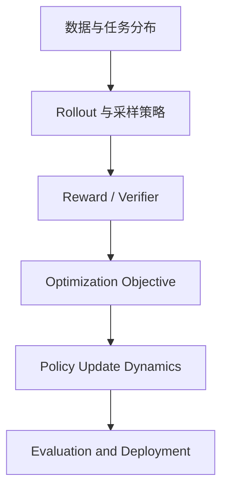

# VIMPO：不用 critic，也想拿回 token 级 credit assignment

| 字段 | 内容 |
|---|---|
| 论文 | VIMPO: Value-Implicit Policy Optimization for LLMs |
| 链接 | [arXiv:2606.20008](https://arxiv.org/abs/2606.20008) |
| 版本 | arXiv:2606.20008v1，2026-06-18 提交 |
| 代码 | [backprop07/VIMPO](https://github.com/backprop07/VIMPO)，仓库创建于 2026-06-17，最近推送到 2026-06-20 |
| 方向 | 大模型后训练，RLVR，critic-free policy optimization |
| 本轮选择 | Scout 推荐的 SafeClawBench、Connect the Dots、Probe-and-Refine、Defensive Misdirection 均已在本地索引命中；VIMPO 未命中 `2606.20008`、标题或 canonical URL，且有论文、arXiv 源文件和官方实现可交叉核验。 |

### TL;DR

- **VIMPO 研究的问题**：RLVR 后训练里，GRPO/DAPO 这类 critic-free 方法稳定、简单，但常把同一个 group-relative advantage 广播到整条 completion 的每个 token；PPO/VAPO 这类 actor-critic 方法能给更细粒度 credit assignment，却要训练额外 value function，并承受 critic 失准、critic-policy 共适应和训练不稳。
- **核心主张**：作者认为这个二选一不是必然的。把自回归生成看成 deterministic-transition MDP，再从 KL-regularized optimality condition 出发，可以把 value recurrence 写成 policy 与 frozen reference 的 token log-ratio、全分布 KL、外部 reward 的组合；于是 value 不需要单独 critic，而是由当前 policy 隐式给出。
- **方法机制**：VIMPO 用终止状态 `V(s_T)=0` 作为锚点，把 outcome-only reward 的 group-mean centered return 变成 value loss：累计 `beta * log pi/ref - beta * sg[KL]` 应当追踪 `R_final - mean_group(R_final)`。同一推导还给出 actor advantage `A_t = beta * log pi/ref - beta * KL`，可放入 PPO-style clipped actor loss。
- **实验设置**：主实验从 `Qwen/Qwen3-4B-Base` 出发，在 Guru 数学 RLVR 数据上训练；评测包括 MATH-500、AIME 2024、AIME 2025、OlympiadBench。实现基于 verl，官方脚本默认 `beta=5e-4`、`c_A=5e-3`、每 prompt 8 个 response、reference frozen、exact KL、PPO actor enabled。
- **关键数字**：clean reward 下，VIMPO 在四个 benchmark 的平均分为 **39.5**，高于 GRPO 的 **37.4** 和 Naive GRPO 的 **36.6**；AIME 2025 上从 GRPO 的 **17.6** 提升到 **20.8**。25% reward flipping 噪声训练下，VIMPO 平均 **35.9**，GRPO 平均 **32.2**，AIME 2024 上差距为 **18.3 vs 13.0**。
- **边界与局限**：这不是完整替代 actor-critic 的证据。论文只做 4B 规模、数学 RLVR、单 seed、以 GRPO 为主要 baseline；没有和精调过的 PPO/VAPO 直接比，也没有证明方法迁移到代码、工具调用、开放式指令或更大模型。
- **图片取舍**：论文图主要是 overview、训练曲线和消融曲线；本轮没有本地化图片，而是用公式、表格、伪代码和 Mermaid 重述关键证据，避免把正文变成素材清单。

### 研究问题：critic-free 的稳定性，为什么会损失细粒度信号？

RLVR 的吸引力来自可验证 reward：数学答案 verifier、代码测试、格式检查、工具环境状态都能给最终成败。但 credit assignment 仍然难。

| 路线 | 优点 | 代价 | 典型方法 |
|---|---|---|---|
| Actor-critic | 有 state-dependent value，可给 token/step 更密集信号 | critic 要训练、要校准，还会和 policy 一起漂移 | PPO、VAPO |
| Critic-free group-relative | 简单稳定，不训练 value model | 轨迹级 reward 经常被广播到所有 token | GRPO、DAPO |
| Post-hoc token weighting | 保留 critic-free，同时给 token 加权 | 权重规则通常是外加 heuristic，不一定来自原始最优性条件 | FIPO、attention-based credit |
| VIMPO | 不训练 critic，但从 policy-reference log-ratio 推出 value recurrence | 依赖 reference policy、exact KL 或近似 KL，且目前实验范围窄 | 本文 |

论文要回答的不是“GRPO 是否有用”，而是一个更细的问题：

- **能不能保留 critic-free 的工程简单性？**
- **同时让 token 的学习信号不再只是整条 completion 的同一个 advantage？**
- **外部 verifier reward 如何进入训练，而不直接把每个 reward label 乘到 actor update 上？**

### 论文主张与论证路线

| Claim | Mechanism | Evidence | Boundary |
|---|---|---|---|
| critic-free 不必等于轨迹级 credit assignment | 把自回归生成建模成 deterministic MDP，从 KL-regularized optimality 推导 value recurrence | 论文给出中心恒等式和 terminal-anchor value loss | 推导依赖 KL 正则和 reference policy；实际训练中 policy 未必处在最优 fixed point |
| 外部 reward 可以只通过 value loss 进入 | `L_V` 对齐累计 log-ratio 与 centered final reward；actor advantage 来自 policy-implied TD term | 官方 README 和代码默认将 reward 通过 VIMPO value loss 接入，PPO actor branch 使用 detached advantage | 如果 verifier reward 很稀疏、错误率高或任务无明确 final reward，目标可能需要改造 |
| VIMPO 比 GRPO 更抗 reward 噪声 | actor update 不直接与每个 corrupted reward label 成比例 | 25% reward flipping 下，VIMPO 平均 35.9，GRPO 32.2 | 噪声只模拟 binary correctness flipping，不覆盖系统性错误 verifier |
| gains 不是单纯靠更长 response | 论文报告 VIMPO 早期探索更长 response，后期长度下降但准确率仍高 | clean training curve 中 response length 与 validation accuracy 不单调同向 | 没有给出所有长度控制实验；长 reasoning 任务外的长度动态仍未知 |
| actor branch 是必要加速项 | value-only `c_A=0` 能学但较慢，`c_A=0.005` 加速并提高训练 accuracy | beta/c_A 消融显示 actor update 提升训练速度，但带来更大 VO KL | 系数需要调；过强 beta 和 actor weight 会限制后期学习 |

### 方法机制：从 KL 正则最优性到 policy-implied value

VIMPO 从局部 KL-regularized policy optimization 写起。对 prefix state `s_t`，最优 policy 满足：

```text
pi*(.|s_t) = argmax_pi E_a~pi [ Q*(s_t, a) ]
             - beta * KL(pi(.|s_t) || pi_ref(.|s_t))
```

解这个局部优化，会得到 reference policy 加权的 softmax 形式：

```text
pi*(a|s_t) = pi_ref(a|s_t) / Z(s_t) * exp(Q*(s_t,a) / beta)
```

自回归生成被看成 deterministic transition：

```text
s_{t+1} = concat(s_t, a_t)
Q*(s_t, a_t) = r(s_t, a_t) + gamma * V*(s_{t+1})
```

把 Bellman equation 和 KL 最优 policy 形式合并，论文得到中心恒等式：

```text
beta * log [ pi*(a_t|s_t) / pi_ref(a_t|s_t) ]
= r(s_t,a_t) + gamma * V*(s_{t+1}) - V*(s_t)
  + beta * KL(pi*(.|s_t) || pi_ref(.|s_t))
```

这个式子的含义可以拆成三层：

1. **log-ratio 不只是偏好优化里的分类特征**  
   它被解释成 Bellman residual 加 KL correction。

2. **`beta * log pi/ref - beta * KL` 是零均值 token 信号**  
   因为 KL 正是 log-ratio 在当前 policy 下的期望。

3. **one-step TD advantage 可以闭式写出**  
   不需要额外 value head，也不需要单独训练 critic。

### 公式变量逐项解释：VIMPO 不是把 DPO 公式搬到 RLVR

把 VIMPO 看成“又一个 log-ratio 方法”会漏掉关键差别。DPO/IPO 通常从偏好对出发，把 chosen/rejected 的概率比变成离线目标；VIMPO 处理的是在线 rollout，且每条 trajectory 有 verifier 给出的 final reward。

| 符号 | 在 VIMPO 中的含义 | 为什么不能随意替换 |
|---|---|---|
| `pi_theta` | 当前训练中的 policy | 它既产生 rollout，也提供 sampled token log-prob，是 value loss 的可微主体 |
| `pi_ref` | 冻结 reference policy | 它定义相对几何，避免 log-ratio 没有锚点；但后期也可能限制 policy 远离初始化 |
| `beta` | log-ratio 与 KL 项共同缩放 | 太小会弱化 policy-implied value 信号，太大可能过度依赖 reference geometry |
| `KL(pi_theta || pi_ref)` | 当前状态下的全分布偏离 | 不是 sampled token 的简单惩罚，而是 log-ratio 的期望基线 |
| `R_final` | verifier 给出的最终正确性 reward | outcome-only RLVR 的外部监督入口 |
| `mean_group(R_final)` | 同 prompt rollout group 的 reward baseline | 让目标变成相对优势，和 GRPO/DAPO 的 group-normalization 思路接轨 |
| `sg[KL]` | stop-gradient 后的 KL baseline | 防止 value loss 通过操纵 KL 本身来降低，而不学习 sampled token log-ratio |
| `c_A` | actor loss 系数 | 控制 PPO-style actor branch 多强；它不是理论推导的必然常数，而是训练动力学超参 |

### 终止锚点：为什么 `V(s_T)=0` 能变成训练 loss？

如果从中心恒等式改写 recurrence，定义：

```text
B_t = beta * log [ pi*(a_t|s_t) / pi_ref(a_t|s_t) ]
      - beta * KL*(s_t)
      - r(s_t,a_t)

B_t = gamma * V_{t+1} - V_t
```

沿时间展开后，`V_t` 可以由初始值和沿途 token 项构造。VIMPO 的关键操作是：

- 用 trainable `pi_theta` 替代理论上的 `pi*`。
- 用同一 prompt 的 rollout group 平均 reward 估计初始 value。
- 用终止状态无未来 reward 的条件 `V_pi(s_T)=0` 监督 policy-implied value。

在 outcome-only reward、`gamma=1`、final reward 为 `R_final` 的 RLVR 设置里，论文最终使用的 value loss 是：

```text
L_V(pi) = 1/2 * [
  sum_t ( beta * log[pi(a_t|s_t)/pi_ref(a_t|s_t)]
          - beta * sg[ KL_pi(s_t) ] )
  - ( R_final - mean_group(R_final) )
]^2
```

这里 `sg[.]` 是 stop-gradient。它的作用很重要：

- KL 项作为 centering baseline。
- value loss 不应该通过直接操纵 full-distribution KL 来投机降低损失。
- 需要被对齐的是 sampled token log-ratio 的累计量和 centered final reward。

### Actor 分支：reward 不直接乘到 actor advantage 上

VIMPO 还从同一恒等式得到 policy-implied TD advantage：

```text
A_TD_t = beta * log[pi_theta(a_t|s_t) / pi_ref(a_t|s_t)]
         - beta * KL_pi_theta(s_t)
```

然后可用 GAE 风格累计：

```text
A_lambda_t = sum_{l=0}^{T-t-1} (gamma * lambda)^l * A_TD_{t+l}
```

最后对有效 response tokens 做标准化，再放进 PPO clipped actor loss：

```text
L_VIMPO = L_V + c_A * L_A
```

这个分离是全文最值得注意的设计：

- 外部 verifier reward 进入 `L_V`。
- actor loss 使用 policy-implied、detached、normalized advantage。
- 因此 actor update 不是把某个可能有噪声的 final reward 直接广播到所有 token。

### 和 GRPO 的差异：同样用 group baseline，但信号位置不同

| 问题 | GRPO/DAPO 常见处理 | VIMPO 处理 |
|---|---|---|
| baseline 从哪里来 | 同 prompt rollout group 的 reward 统计量 | 同样使用 group mean 估计 `V_0` |
| token advantage 怎么来 | trajectory-level advantage 通常广播到 token，或经额外规则重加权 | `beta * log pi/ref - beta * KL` 给出 token TD signal |
| reward 进入 actor 吗 | 通常 reward-derived advantage 直接进入 policy gradient | reward 先进入 value loss，actor 使用 policy-implied detached advantage |
| 是否训练 critic | 不训练 | 不训练 |
| 是否有 Bellman consistency | 通常不显式 | 显式使用 terminal boundary 和 recurrence |
| 主要工程成本 | rollout group、reward verifier、loss aggregation | 额外需要 reference 分布和 KL 估计 |

VIMPO 的收益不应被理解成“GRPO 加了 PPO actor”。如果 actor advantage 仍来自粗糙的 group reward，问题没有根本改变。VIMPO 的 actor branch 使用 policy-implied TD advantage；value loss 则负责把这个内部信号和外部 reward 对齐。

### 训练步骤伪代码

```text
Input:
  policy pi_theta
  frozen reference pi_ref
  prompt distribution D
  group size G
  coefficients beta, c_A

For each training step:
  sample prompt x ~ D
  sample G rollouts tau_i from pi_theta(.|x)
  compute final reward R_i for each rollout
  compute group baseline R_bar = mean_i(R_i)

  For each rollout i and token t:
    rho_i,t = beta * log pi_theta(a_i,t|s_i,t) / pi_ref(a_i,t|s_i,t)
    kappa_i,t = beta * KL(pi_theta(.|s_i,t) || pi_ref(.|s_i,t))
    A_i,t = rho_i,t - kappa_i,t

  value loss:
    L_V = mean_i 1/2 * [sum_t(rho_i,t - stop_grad(kappa_i,t))
                        - (R_i - R_bar)]^2

  actor loss:
    normalize stop_grad(A_i,t) over valid response tokens
    apply PPO clipped surrogate

  update theta on:
    L_V + c_A * L_A

Output:
  updated policy pi_theta
```

### 官方实现细读：论文方法落在 verl 的哪个层面？

官方仓库不是从零写的训练框架，而是一个 focused fork of `verl`。许多分布式训练、rollout、FSDP、vLLM、Ray worker 的复杂性仍由 verl 栈承担。

| 文件 | 作用 | 读到的关键信息 |
|---|---|---|
| `README.md` | 方法概览、默认配置、数据说明 | 明确默认模型、beta、actor coefficient、exact KL、frozen reference、8 responses per prompt |
| `recipe/vimpo/run_vimpo.sh` | 实验入口脚本 | 同一脚本可用 `RUN_MODE=vimpo` 或 `RUN_MODE=grpo`，降低 baseline 不一致风险 |
| `recipe/vimpo/main_vimpo.py` | 替换 trainer 的入口 | 复用 `TaskRunner` 和 `run_ppo`，把 trainer class 换成 `RayVIMPOTrainer` |
| `recipe/vimpo/vimpo_ray_trainer.py` | VIMPO 训练逻辑接入 | 校验 exact KL、reference policy、gamma、actor branch、value loss 等配置 |
| `recipe/vimpo/config/vimpo_trainer.yaml` | 默认配置 | `use_vimpo_loss=True`、`value_type=raw`、`vimpo_detach_kl=True`、`use_ppo_actor=True` |

实现里的若干校验说明论文方法的约束：

- VIMPO 需要 reference policy。没有 reference，就没有 `pi/ref` log-ratio 和 KL baseline。
- raw VIMPO 强制 `gamma=1.0`。当前实现主要服务 outcome-only final reward 的 RLVR。
- exact-KL 模式不支持同时打开 actor KL loss 或 reward KL penalty。否则 KL 会以多种路径重复进入目标。
- `vimpo_update_ref_freq=0` 是默认设定。reference update 虽然是未来方向，但不是本文主实验的一部分。
- `k1` estimator 在 raw VIMPO 下被拒绝，因为 sampled KL 会和 log-ratio 抵消，导致 token term 退化。

### 实验设置与结果

| 维度 | 设置 |
|---|---|
| 训练任务 | 数学 RLVR |
| 训练数据 | Guru math subset |
| 起点模型 | `Qwen/Qwen3-4B-Base` |
| 训练框架 | verl fork |
| Baseline | Naive GRPO、token-level loss aggregation 的 GRPO |
| 主评测 | MATH-500、AIME 2024、AIME 2025、OlympiadBench |
| Reward | final correctness verifier |
| 噪声实验 | 每个 prompt group 内独立翻转 binary correctness，概率 25% |
| VIMPO 主配置 | `beta=5e-4`，`c_A=5e-3`，exact KL，frozen reference，每 prompt 8 responses |

| Method | MATH-500 avg@1 | AIME24 avg@32 | AIME25 avg@32 | OlympiadBench avg@1 | Avg. |
|---|---:|---:|---:|---:|---:|
| Qwen3-4B-Base | 54.0 | 8.6 | 3.6 | 18.0 | 21.1 |
| Naive GRPO | 80.4 | 20.0 | 14.6 | 31.3 | 36.6 |
| GRPO | 79.6 | 19.3 | 17.6 | 33.2 | 37.4 |
| VIMPO | **81.6** | **21.7** | **20.8** | **34.0** | **39.5** |
| GRPO noisy | 75.2 | 13.0 | 11.7 | 28.9 | 32.2 |
| VIMPO noisy | **78.2** | **18.3** | **14.9** | **32.3** | **35.9** |

几个判断要分开看：

- MATH-500 上提升较小但稳定：VIMPO 81.6，GRPO 79.6，差 2.0。
- AIME 2025 是最醒目的 clean reward 差距：VIMPO 20.8，GRPO 17.6，差 3.2。
- noisy reward 下差距更大：平均分 VIMPO 35.9，GRPO 32.2；AIME 2024 上差 5.3。
- 不能把收益简单归因于 response length：论文说 VIMPO 早期探索更长 response，但后期 response length 下降，validation accuracy 仍保持更高。

### 逐项结果复盘：哪些数字最能说明问题？

#### 1. Base model 到 RLVR 的大幅跃迁不是 VIMPO 独有

- Qwen3-4B-Base 的平均分是 21.1。
- Naive GRPO 到 36.6。
- GRPO 到 37.4。
- VIMPO 到 39.5。

这说明主要收益首先来自 RLVR 本身，而不是 VIMPO 独享。VIMPO 的合理定位是：在一个已经很强的 critic-free RLVR baseline 上，进一步改善 credit assignment。

#### 2. VIMPO 对 GRPO 的平均提升是 2.1 点

- Avg. 从 37.4 到 39.5。
- 相对提升不巨大，但四个 benchmark 同向。
- 在数学 RLVR 这种训练容易出现高方差的设置里，同向性比单个 benchmark 的最高值更有解释力。

#### 3. Noisy reward 的 AIME 2024 差值最醒目

- GRPO noisy：13.0。
- VIMPO noisy：18.3。
- 差值：5.3。

这比 clean setting 里的 AIME 2024 差值 2.4 更大。它支持作者的机制叙事：当 reward 被污染时，直接 reward-proportional actor update 更容易受伤；VIMPO 把 reward 接入口放在 value loss，再通过 policy-implied advantage 更新 actor，可能减轻污染传播。

### 消融与图表证据

| 证据 | 支持什么 | 不能证明什么 |
|---|---|---|
| Figure 1 overview | reward 训练 value loss，policy/ref 定义 token TD signal | 不能证明这种分离一定抗所有 verifier 错误 |
| Figure 2 positioning | VIMPO 位于 GRPO 与 actor-critic 之间 | 只是方法定位，不是实验结论 |
| Figure 3 clean training curves | VIMPO 后期 learning dynamics 强于 GRPO，长度不是唯一解释 | 曲线来自单设置，未覆盖多模型多 seed |
| Table 1 final accuracy | 四个数学 benchmark 上 VIMPO 均高于 GRPO | 不能外推到代码、工具调用、开放问答 |
| Figure 4 noisy reward | 25% flipping 下 VIMPO 保持更高 clean verifier accuracy | 噪声模型很简单，不代表真实 reward hacking |
| Figure 5 beta/c_A ablation | actor branch 加速，过强参数会限制学习 | 没有给出系统化超参搜索或自适应 schedule |

消融的主要信息是：

- `c_A=0` 的 value-only variant 能学习，但更慢。
- `c_A=0.005` 的 PPO-style actor branch 明显加速。
- 更大的 `beta` 和更强的 actor 权重会压低 VO KL，早期可能稳，但后期可能限制提升。
- 因此 VIMPO 的系数不是装饰项，而是训练动力学的一部分。

### 复现与迁移检查清单

| 检查项 | 需要确认的问题 | 失败后会发生什么 |
|---|---|---|
| Reference policy | reference 是否固定、是否和 rollout policy 同 tokenizer、同 prompt 模板 | log-ratio 不可比，KL baseline 变成噪声 |
| KL estimator | 是否能拿到 exact full-distribution KL，或近似 KL 是否经过验证 | token TD signal 的零均值性质可能被破坏 |
| Reward shape | reward 是否真的是 final-only，还是中间步骤也有 reward | 直接套 outcome-only loss 会错配 recurrence |
| Group baseline | 同 prompt 的 rollout group 是否足够大，reward 方差是否可控 | `R - mean(R)` 噪声过大，value loss 目标抖动 |
| Actor branch | detached advantage 是否正确标准化，PPO old log-prob 是否一致 | actor update 可能和 value loss 互相拉扯 |
| KL double counting | 是否同时打开 reward KL penalty、actor KL loss、VIMPO exact KL | 一个正则以多条路径进入，导致训练过度保守 |

这张检查表说明，VIMPO 不是一个 drop-in GRPO replacement。它更像一个目标函数骨架：

- 在数学 RLVR 里，reward 是 final correctness，结构最适合 VIMPO 当前版本。
- 在代码 RLVR 里，单测 reward 可能有 partial credit、隐藏测试和 flaky 行为，value loss 目标需要重新定义。
- 在工具 Agent 里，reward 可能来自环境状态差异，token-level signal 也许应该按 tool-call segment 或 action span 聚合。
- 在安全后训练里，reward 本身可能来自 judge 或 policy classifier，先要评估 judge 不确定性，否则 reward-through-value-loss 也会学习错误边界。

### 如果把 VIMPO 放进后训练路线图，它解决的是哪一层？



VIMPO 主要动的是 `Optimization Objective` 和 `Policy Update Dynamics`：

- 它不主张新的数学数据集。
- 它不主张新的 verifier。
- 它不主张新的 sampler 或 tool environment。
- 它主张：在同样的 rollout group 和 final reward 下，可以用 policy-implied value 重新组织训练信号。

### 迁移到 Agent 与安全任务时，哪些设计要重新想？

| 任务类型 | final reward 容易定义吗 | 中间 credit 难点 | VIMPO 可能怎么改 |
|---|---|---|---|
| Coding agent | 单测、编译、lint 较容易 | 哪个 edit、哪个命令造成通过或失败 | 按文件 edit span、test invocation、tool call boundary 聚合 advantage |
| Browser agent | 最终网页状态可检查 | 页面观察、点击、输入之间有长延迟 | 在 action-level 而非 raw token-level 做 recurrence |
| Security sandbox | 最终 harm state 可检查 | 合规操作和危险副作用常交织 | 把 reward 拆成 success、policy violation、environment harm 多通道 |
| Multi-step research agent | 最终答案质量可评估 | 搜索、阅读、引用、推理贡献不均 | 需要把 reference 与 reward 都扩展到长上下文记忆轨迹 |

VIMPO 没有直接解决 Agent 安全问题。但它给“最终结果 reward 如何回传到中间行为”提供了一种非 critic 的理论接口。如果未来把 token 改成 action span，把 verifier 改成环境状态检查，把 reference 改成安全策略参考模型，就可能形成 Agent 后训练里的一个新分支。

### 相关工作位置

- **相对 GRPO**：VIMPO 不再只用 group-relative reward 给每个 token 同一个 advantage；它仍使用 group mean reward 作为 baseline，但 token 信号来自 policy-reference log-ratio 和 KL。
- **相对 DAPO**：DAPO 是在 GRPO 系列上做动态采样、token-level loss aggregation、decoupled clipping 等工程改造；VIMPO 的重点是目标函数来源不同。
- **相对 FIPO/attention credit assignment**：那些方法给 GRPO advantage 加 post-hoc token weighting；VIMPO 试图让 token-level advantage 从 KL 正则最优性条件中自然出现。
- **相对 PPO/VAPO**：PPO/VAPO 的 dense credit 来自 learned critic；VIMPO 追求类似 granularity，但不训练 critic。问题是：没有和充分调参的 PPO/VAPO 比，所以不能说 VIMPO 已经替代 actor-critic。
- **相对 DPO/IPO/TDPO**：这些工作也使用 policy-reference log-ratio；VIMPO 的差异在于它是 online RLVR，有 rollout reward，并把 log-ratio 和 Bellman recurrence 接起来。

### 审稿式边界判断

VIMPO 最可靠的结论有三条。第一，作者确实给出了一个从 KL 正则最优性到 token 级 Bellman 信号的完整推导，并且把它落成了可运行的训练目标。第二，在作者选择的数学 RLVR 设置中，VIMPO 不只是训练曲线好看，最终表格里的四个评测项都超过 GRPO，噪声 reward 设置下也保持同向优势。第三，官方实现把关键假设写进配置和校验逻辑里，尤其是 frozen reference、exact KL、关闭 reward KL penalty、关闭 actor KL loss，这让读者能看清哪些是论文方法本身，哪些只是训练框架继承的工程细节。

但这些结论不能被扩大成“VIMPO 已经解决 RLVR credit assignment”。数学题的 verifier 很干净，最终答案正确与否通常能被解析；很多真实后训练任务没有这种干净边界。单 seed 和单模型规模限制了统计强度，尤其是 AIME 这种题量不大的评测，最好还要看到多 seed、置信区间和更多模型规模。论文没有和强 actor-critic 方法做同等预算调参对比；因此它能证明自己优于本设置下的 GRPO，却还不能证明“隐式 value”一定优于 learned critic。

更细地说，VIMPO 的方法假设有一个容易被忽略的张力：它既想摆脱 learned critic，又仍然需要 reference policy 提供几何锚点。reference 的好处是让 log-ratio 有尺度，让 KL 成为可解释的期望基线；reference 的坏处是训练后期可能变成旧模型的束缚。论文把这个问题放在 limitation 里，而不是过度声称 fixed reference 永远合理，这是比较诚实的地方。真正的后续工作应该把 reference 更新、beta 退火、近似 KL 三者放在一起研究，因为它们共同决定 VIMPO 是否能从 4B 数学模型扩展到更长、更复杂、更开放的任务。

另一个值得保留的疑问是：VIMPO 的 token 级 advantage 是否总比 trajectory 级 advantage 更“正确”？在数学推理里，某些 token 确实是关键步骤，另一些只是连接词；更细粒度信号看起来合理。但在自然语言推理和工具调用里，一个 token 的局部概率变化未必对应一个可解释动作。未来若迁移到 Agent，可能要把 VIMPO 的基本单元从 token 改成 action、tool call、file edit、browser event 或 memory update。否则，方法虽然在公式上提供 token TD signal，在系统行为上仍可能难以定位真正产生成功或伤害的中间行为。

因此，我会把 VIMPO 放在“值得复现和改造”的类别，而不是“已可直接替换 GRPO”的类别。它最适合被用作一组新实验的起点：在同一训练框架里比较 GRPO、DAPO、VIMPO、带 learned critic 的 PPO/VAPO；在 clean reward、随机噪声、系统性 verifier 错误、隐藏测试偏差四种 reward 条件下观察差异；再把 token 级信号和 action span 级信号分别做消融。只有这样，才能判断 VIMPO 的理论美感是否真正转化为跨任务的后训练稳定性。

### 对 Daily Report 读者的短结论

这篇论文最值得记住的不是某一个 benchmark 数字，而是一个训练目标设计姿势：**不要把 critic-free 简化等同于粗粒度学习信号**。过去很多 RLVR 改进是在采样、过滤、长度、reward 规则上做工程优化；VIMPO 提醒我们，目标函数本身也可以重新推导。它把外部 reward 放进 value consistency，把 actor update 放在 policy/reference 定义的内部信号上，并用 terminal state 关闭 recurrence。这个结构不完美，也还没有跨领域证明，但它给后训练研究提供了一个清晰的问题框架：如果不用 critic，我们还能怎样让模型知道一段长推理里到底哪些位置应该被强化，哪些位置只是顺路出现？

### 下一步实验优先级：我会怎样验证 VIMPO 是否真的稳健？

如果要把这篇论文从“漂亮目标函数”推进到“可复用后训练方法”，我会优先做四组实验。

第一组是**多 seed 与多模型规模复现**。当前结果只说明在作者报告的设置里，VIMPO 优于 GRPO。下一步至少需要在 4B、8B、14B 三个规模上重复，并给出平均值、标准差和每个 benchmark 的置信区间。尤其是 AIME 这类题量较小的评测，单次 avg@32 仍可能受到抽样和题集分布影响。如果 VIMPO 的优势在多 seed 下仍然稳定，才能说 policy-implied value 确实改善了训练信号，而不是某次训练轨迹更顺。

第二组是**和 actor-critic 的公平对比**。VIMPO 的理论动机是不用 learned critic 也恢复一部分 dense credit assignment，那么最自然的对照不是只有 GRPO，还应该包括认真调参的 PPO 或 VAPO。这个对比要控制模型、数据、rollout 数、训练 token、显存预算和 verifier。若 VIMPO 接近 actor-critic 的效果，同时训练更简单，那才是它最强的实用论点；若它只比 GRPO 强，却明显弱于好 critic，那么它更像 critic-free 路线中的改良，而不是新的中间范式。

第三组是**reward 错误类型消融**。论文使用 25% binary flipping，这是很干净的随机噪声。但真实 verifier 错误往往不是随机的：单测可能偏向某类解法，数学解析器可能漏掉等价答案，安全 judge 可能误判拒答，工具环境可能只观察到部分状态。因此应该分别测试随机翻转、系统性偏置、难题高错误率、对抗性 reward hacking 四类噪声。只有当 VIMPO 在更真实的错误模式下仍然比 GRPO 更稳，才能把“reward 不直接进入 actor advantage”提升为可靠机制。

第四组是**从 token 到 action span 的改造**。对于 Agent 后训练，真正的行为单元常常不是 token，而是一次工具调用、一次文件编辑、一次网页操作或一次 memory 写入。直接把 token 级 advantage 用在工具 Agent 上，可能会把信用分配给无意义的自然语言片段，而不是关键动作。一个更有前途的版本，是先把轨迹切成 action span，再对每个 span 计算 policy/reference 差异和环境状态回报。这样 VIMPO 的 Bellman consistency 才可能和真实系统行为对齐。

这些实验的优先级也说明：VIMPO 当前最强的是“目标函数假设”，不是“部署 recipe”。它已经足够值得复现，因为它把 critic-free、reference policy、terminal boundary、PPO actor branch 放进了同一条逻辑链。但它还没有足够证据告诉我们，在代码、Agent、安全、长上下文任务中该怎样调 beta、怎样估 KL、怎样更新 reference、怎样定义 action-level reward。真正的价值会出现在这些后续工作里。

### 最小可用判断

如果只给一个最小可用判断，我会这样概括：VIMPO 已经证明“critic-free 也可以被重新推导出更细的学习信号”，但还没有证明“所有后训练都应该放弃 critic”。它适合被研究者拿去复现、改造成 action-level 版本、和更强 baseline 比较；不适合被工程团队直接当成新的默认训练策略。当前最应该关注的不是排行榜位置，而是它把 reward、reference、value consistency 和 actor update 分开的方式。

更保守地说，VIMPO 是一个值得严肃验证的研究假设，而不是已经完成产业化收敛的训练范式。
这个边界必须记住。

### 结论

- VIMPO 的核心贡献是把 RLVR 里的 critic-free 训练重新解释为 policy-implied value optimization。
- 它用 KL-regularized optimality 推出 token-level Bellman 信号，用 terminal boundary 得到 value loss，再用 PPO-style actor branch 加速学习。
- clean math RLVR 上，VIMPO 平均 39.5，高于 GRPO 37.4；25% reward flipping 下，VIMPO 35.9，高于 GRPO 32.2。
- 证据最强的范围是：4B 数学 RLVR、clean verifier、GRPO 作为主要 critic-free baseline。
- 证据最弱的范围是：多 seed、大模型、代码/工具/开放式任务、和 tuned actor-critic 的直接比较。
- 对后训练研究来说，这篇论文值得跟进，因为它把“没有 critic”从工程简化问题，推进到“能否用 policy 自身构造 value recurrence”的目标函数问题。

### 参考材料

- [arXiv abstract: 2606.20008](https://arxiv.org/abs/2606.20008)
- [arXiv HTML full text](https://arxiv.org/html/2606.20008v1)
- [arXiv API metadata](https://export.arxiv.org/api/query?id_list=2606.20008)
- [Official implementation: backprop07/VIMPO](https://github.com/backprop07/VIMPO)
- [VIMPO README](https://github.com/backprop07/VIMPO/blob/master/README.md)
- [VIMPO training script](https://github.com/backprop07/VIMPO/blob/master/recipe/vimpo/run_vimpo.sh)
