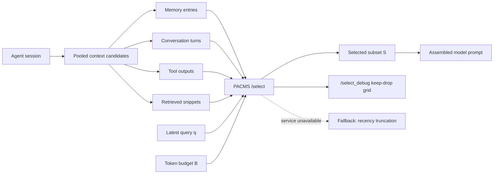
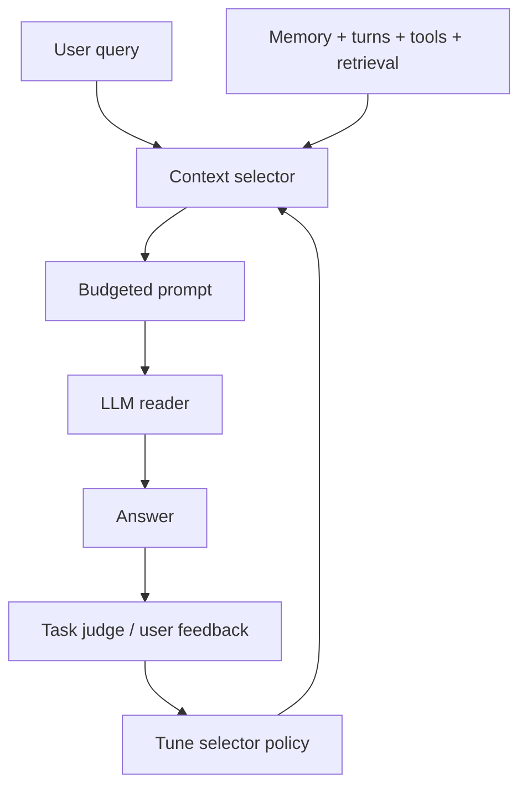

# PACMS：把 Agent 上下文管理改写成“带预算的子模选择”问题

### 元信息

| 项目 | 内容 |
|---|---|
| 标题 | PACMS: Submodular Context Selection as a Pluggable Engine for LLM Agents |
| 作者 | Manu Ghulyani, Arunabh Singh, Karan Bharadwaj, Ankit Nath, Suranjan Goswami |
| 机构 | Nasiko |
| 时间 | 2026-06-18 提交 arXiv |
| 方向 | 大模型 Agent、上下文管理、记忆选择、工具调用输出压缩 |
| 原文 | [arXiv:2606.20047v1](https://arxiv.org/abs/2606.20047v1) |
| PDF/HTML | [PDF](https://arxiv.org/pdf/2606.20047v1)，[HTML](https://arxiv.org/html/2606.20047v1) |

### TL;DR

- PACMS 研究的问题不是“如何把长文本压短”，而是：当一个长期运行的 LLM Agent 同时积累用户对话、长期记忆、检索片段和工具输出时，应该把哪些原始上下文放进下一次模型调用。
- 论文把上下文组装建模为一个带 token 预算的单调子模最大化问题：候选集合包含 memory、turn、tool output；目标函数奖励“覆盖查询相关区域”，同时自然压低冗余候选。
- 核心目标函数是 facility-location 形式：`F(S)=sum_i max_{j in S} w_ij`，约束是 `sum tok(j)<=B`，其中 `w_ij=rel(i,q)*max(0, cos(e_i,e_j))`。
- 系统贡献在于把 PACMS 做成 OpenClaw 的可插拔 context engine：实现 `assemble()`，对外暴露本地 FastAPI `/select` 和 `/select_debug`，服务不可达时回退到 recency truncation。
- 实验使用 LongMemEval 的 100 个问题，覆盖 6 类长程记忆问题；召回实验注入 `R in {0,2,4,8}` 的模板化冗余，并扫 `20%/45%/70%` 三档预算。
- 关键数字：在 `R=2, 45%` 预算下，PACMS 的 evidence-round recall 是 `0.909`，接近 LangChain MMR 的 `0.895`，但端到端 QA 准确率领先 MMR `+8` 到 `+12` 个百分点。
- 更反直觉的是，PACMS 在 QA 上也超过 top-k：GPT-5-mini 下 `52.0%` 对 `50.0%`，GPT-5.4-mini 下 `68.0%` 对 `64.0%`；这说明“保留证据轮次”不等于“组出更易读的 prompt”。
- 局限很明确：QA 只测 `R=2, 45%` 一个设置；冗余是模板化构造，不是真实用户噪声；全文上下文基线因 LongMemEval haystack 可到 `750k` 字符而未给；论文声明开源，但 arXiv 页面没有给出显式仓库链接。

### 研究问题：为什么 recency truncation 在 Agent 里特别脆弱？

- 长期运行的 Agent 上下文不是单一来源：
  - 用户和 assistant 的历史轮次；
  - persistent memory 中的事实、偏好和项目状态；
  - RAG 或外部文档片段；
  - 工具调用输出，例如文件读取、搜索结果、API 返回、错误日志。

- 默认策略通常是“保留最近内容”：
  - 优点是实现简单、延迟低、不会做额外检索；
  - 缺点是完全 topic-blind；
  - 早期建立的关键事实会因为“旧”被扔掉；
  - 最近的大段无关工具输出会因为“新”被保留。

- 论文真正关心的是 assembly boundary：
  - RAG 解决的是从外部文档取什么；
  - summarization 解决的是把已有文本改写成更短；
  - PACMS 解决的是“下一次模型调用前，已经在 agent 内部的多源候选怎么选”。

### 论文主张与论证路线

| Claim | Mechanism | Evidence | Boundary |
|---|---|---|---|
| 上下文组装应从启发式截断转向有目标的预算选择 | 把 memory、turn、tool output 统一成候选池 `C` | Figure 1 的相似图和 selection halo 解释了“覆盖相关区域” | 图示只说明机制，不证明效果 |
| 子模覆盖比 pairwise MMR 更适合作为 Agent prompt 组装目标 | 用 facility-location 目标覆盖整个候选池，而不是只惩罚已选集合内冗余 | Table 2 中 PACMS QA 准确率高于 MMR `+8/+12` 点 | Table 1 显示召回并非总是 PACMS 最强 |
| “证据召回”与“答案可抽取性”会分离 | PACMS 可能保留较少标注证据轮次，但组出的上下文结构更可读 | `R=2,45%` 下 top-k recall `0.933` 高于 PACMS `0.909`，但 QA 低于 PACMS | 需要更多预算、更多 reader、更多真实噪声验证 |
| 工程上必须放进 Agent hot path，而不是离线 reranker | OpenClaw context engine 暴露 `ingest()`、`assemble()`、`compact()`；PACMS 只接管 `assemble()` | Figure 2 和 Appendix A 给出本地 HTTP 服务、缓存、debug UI、fail-soft 回退 | arXiv 页面未给独立仓库链接，复现实操仍需确认 |

### 方法机制：PACMS 到底在优化什么？

#### 变量表

| 符号 | 含义 |
|---|---|
| `C={c_1,...,c_n}` | 当前 Agent 可放入 prompt 的候选上下文池 |
| `q` | 最新用户查询或当前待回答任务 |
| `B` | token 预算 |
| `M subseteq C` | 必须保留的候选集合，例如系统约束或当前用户输入 |
| `e_i` | 候选 `c_i` 的 embedding |
| `e_q` | 查询 `q` 的 embedding |
| `tok(j)` | 候选 `c_j` 的 token 成本 |
| `S` | 最终选择进入 prompt 的候选子集 |

#### 相关性与覆盖权重

```text
rel(i,q) = max(0, cos(e_i, e_q))

w_ij = rel(i,q) * max(0, cos(e_i, e_j))
```

- `rel(i,q)` 只保留非负查询相关性：
  - 与当前问题方向相反或无关的候选不会因为相似度噪声得到负收益；
  - 这让目标函数更像“覆盖当前任务相关区域”，而不是覆盖全部历史。

- `w_ij` 把两个因素相乘：
  - `i` 自身是否和查询相关；
  - `j` 是否能代表或覆盖 `i` 所在的语义区域。

- 直观解释：
  - 如果某个旧记忆和当前问题高度相关，任何能代表它的候选都应该有价值；
  - 如果某个最近工具输出很长但与当前问题无关，它不会因为新或长而自动进入 prompt；
  - 如果多个候选互相重复，选择一个代表项即可覆盖同一语义 halo。

#### 目标函数

```text
maximize:
  F(S) = sum_i max_{j in S} w_ij

subject to:
  sum_{j in S} tok(j) <= B
  M subseteq S
```

- `sum_i` 表示目标覆盖的是整个候选池，而不是只看已选项。
- `max_{j in S}` 表示每个候选 `i` 只需要被已选集合里最能代表它的项覆盖。
- token 预算使问题变成 knapsack 风格选择。
- 必选集合 `M` 保证系统消息、当前用户问题等不能被优化器误删。

#### 为什么这和 MMR 不一样？

| 维度 | MMR | PACMS |
|---|---|---|
| 冗余处理 | 惩罚候选与已选集合的相似度 | 奖励已选集合覆盖整个候选池的相关区域 |
| 覆盖对象 | 主要是选中项之间的 pairwise trade-off | 所有候选项作为待覆盖对象 |
| 查询相关性 | 冗余项通常是 relevance-blind penalty | 覆盖权重由 `rel(i,q)` 调制 |
| 理论性质 | 更像 heuristic reranking | 单调子模目标，可用 CELF lazy-greedy，带常数因子近似保证 |
| 论文中的结果 | recall 可接近 PACMS | QA 可抽取性弱于 PACMS |

### 算法流程：从候选池到 prompt

```text
Input:
  C: pooled candidates from memory, turns, tool outputs
  q: latest query
  B: token budget
  M: mandatory candidates

State:
  S = M
  remaining_budget = B - sum(tok(m) for m in M)
  embedding cache for candidates and query
  priority queue of marginal gains

Loop:
  1. compute rel(i,q) for each candidate i
  2. compute coverage weights w_ij
  3. estimate marginal gain per token for adding each candidate j
  4. lazily refresh stale gains with CELF
  5. if tok(j) fits remaining_budget:
       add j to S
       update covered regions
       reduce remaining_budget
     else:
       skip j
  6. stop when no candidate has useful gain or budget is exhausted

Output:
  selected candidate indices S
  assembled prompt segments
  optional debug scores for keep/drop visualization

Failure boundary:
  if the local selector service is unreachable, OpenClaw falls back to recency truncation.
```

### 系统设计：为什么作者强调“context engine”而不是“另一个 retriever”？

- PACMS 安装在 OpenClaw 的 context engine 抽象里：
  - `ingest()`：由宿主 runtime 负责把事件、记忆、工具输出放入上下文系统；
  - `assemble()`：PACMS 接管，决定本次模型调用保留什么；
  - `compact()`：PACMS 设置 `ownsCompaction=false`，把总结或压缩交还给 runtime。

- 这一区分很关键：
  - PACMS 不承诺压缩文本；
  - PACMS 不改写工具输出；
  - PACMS 只决定哪些原文片段值得带入 prompt。

- 工程结构按论文描述是：
  - OpenClaw plugin 调用本地 HTTP；
  - FastAPI 服务监听 `127.0.0.1:8077`；
  - `/select` 给生产路径返回保留索引；
  - `/select_debug` 给 demo UI 返回每个候选的分数和 keep/drop；
  - selector 实例常驻，复用 embedding cache；
  - 服务不可达时 fail-soft 回退 recency。



### 实验设置：LongMemEval 如何被改造成上下文选择测试？

| 项目 | 设置 |
|---|---|
| 数据集 | LongMemEval |
| 样本 | 100 个问题 |
| 问题类型 | single-session-user、single-session-assistant、single-session-preference、temporal-reasoning、knowledge-update、multi-session |
| 候选来源 | 多会话 conversation haystack 中的轮次 |
| 召回指标 | `evidence-round recall = |S cap E| / |E|` |
| 冗余注入 | 对 filler rounds 做模板化 paraphrase |
| 冗余级别 | `R in {0,2,4,8}` |
| 预算 | `20%`、`45%`、`70%` 的总上下文 token |
| embeddings | 本地 Ollama 的 `nomic-embed-text` |
| baseline | top-k cosine、LangChain MMR、last-k recency |
| QA reader | GPT-5-mini、GPT-5.4-mini |
| QA judge | GPT-4o-mini，使用 LongMemEval 官方 CORRECT/WRONG prompt |

- 这个实验设计有一个优点：
  - recall 与 QA 使用同一批 100 个问题；
  - 因此可以直接观察“证据保留率”和“最终回答准确率”是否一致。

- 也有一个明显限制：
  - QA 需要约 `1600` 次 API 调用；
  - 每次输入约 `30k-60k` token；
  - 所以作者没有做所有预算、所有冗余级别、所有 reader 的全量 sweep。

### 主结果一：召回实验不是 PACMS 单方面胜利

| Budget | R | top-k | LC-MMR | last-k | PACMS | 读法 |
|---:|---:|---:|---:|---:|---:|---|
| 20% | 0 | 0.790 | 0.421 | 0.238 | 0.704 | tight budget 下 top-k 更强 |
| 20% | 8 | 0.817 | 0.836 | 0.001 | 0.804 | MMR 在高冗余下反超 |
| 45% | 2 | 0.933 | 0.895 | 0.221 | 0.909 | PACMS 接近 MMR，但低于 top-k |
| 45% | 8 | 0.940 | 0.994 | 0.003 | 0.972 | coverage 与 MMR 都强于 recency |
| 70% | 2 | 0.978 | 0.993 | 0.620 | 0.991 | 高预算下 PACMS 和 MMR 基本贴近 |
| 70% | 8 | 0.982 | 1.000 | 0.139 | 1.000 | 高冗余高预算下两者触顶 |

- 论文没有把 Table 1 写成“PACMS 总赢”：
  - `20%` budget 下，top-k 经常更强；
  - `45%` 到 `70%` 时，PACMS 和 MMR 更能处理冗余；
  - last-k 在冗余注入后几乎崩溃，说明 recency 对多会话记忆很危险。

- 这反而增强了论文的可信度：
  - 如果只看 evidence-round recall，PACMS 不是无条件冠军；
  - 作者真正想证明的是，recall 指标无法完全解释最终 QA。

### 主结果二：QA 准确率显示“可抽取性”差异

| Method | GPT-5-mini | GPT-5.4-mini | 相对 PACMS 的结论 |
|---|---:|---:|---|
| top-k | 50.0 | 64.0 | PACMS 领先 `+2/+4` 点 |
| LC-MMR | 44.0 | 56.0 | PACMS 领先 `+8/+12` 点 |
| last-k | 44.0 | 42.0 | PACMS 领先 `+8/+26` 点 |
| PACMS | 52.0 | 68.0 | 两个 reader 都第一 |

- 最关键的对照是 `R=2, 45%`：
  - top-k recall 是 `0.933`；
  - PACMS recall 是 `0.909`；
  - LC-MMR recall 是 `0.895`。

- 但 QA 结果并不跟 recall 排序一致：
  - PACMS 低于 top-k 的召回，却高于 top-k 的 QA；
  - PACMS 与 MMR 召回差距只有 `0.014`，QA 却拉开 `8` 到 `12` 点；
  - GPT-5.4-mini 更强后，top-k、MMR、PACMS 都上升，last-k 不升反降。

- 这支持一个更细的判断：
  - 好的上下文选择不是只把“含证据的轮次”塞进去；
  - 它还要让证据之间的组织方式、冗余密度、查询相关区域更容易被 reader 利用；
  - PACMS 的 facility-location 目标可能在这点上优于 pairwise MMR。

### 关键设计细读：每个选择为什么必要？

#### 1. 为什么要把候选池合并，而不是分源处理？

- 分源处理会制造一个隐藏假设：
  - memory 比 tool output 更像“长期事实”；
  - conversation turn 比 retrieved snippet 更应该保留；
  - 最近工具结果天然比旧偏好更相关。

- PACMS 不接受这个先验：
  - 它把所有候选都变成 `c_i`；
  - 每个候选只靠 relevance、coverage、token cost 竞争；
  - 这样一个 5000-token 工具输出不会因为来源是 tool 就被整块保留；
  - 一个 10-token 旧记忆也不会因为时间早就被删掉。

- 这对 coding agent 尤其重要：
  - 编译错误、测试日志、文件片段、用户约束、先前决策常常混在一起；
  - recency 会保留最后一次无关 `ls` 或大段日志；
  - top-k 可能重复保留多个相似错误片段；
  - coverage 目标至少要求候选在当前查询相关区域中提供新的覆盖。

#### 2. 为什么选择 whole units，而不是摘要？

- 论文把 PACMS 放在 selection 而非 compression：
  - 输入候选按原文片段进入选择器；
  - 输出也是被保留的原文片段；
  - 压缩留给宿主 runtime 的 `compact()`。

- 这个边界降低了两类风险：
  - 不会因为摘要器改写而丢失命令、路径、数字、错误码；
  - keep/drop 决策可以直接审计，因为被删掉的单元仍然是明确对象。

- 但它也带来一个代价：
  - 如果单个工具输出极长，whole-unit selection 可能太粗；
  - 更细粒度的 chunking 会影响 `tok(j)` 和 `w_ij`；
  - 论文没有系统消融 chunk 粒度。

#### 3. 为什么用 facility-location，而不是简单去重？

- 简单去重通常只回答：
  - “这两个候选是否很像？”
  - “如果很像，删掉一个。”

- facility-location 回答的是：
  - “已选集合能覆盖多少相关语义区域？”
  - “新候选是否让尚未覆盖的区域得到代表？”

- 这一区别让 PACMS 可以保留语义上互补的旧事实：
  - 即使它们都和 query 有关；
  - 即使它们不是 top-k relevance 的前几名；
  - 只要它们覆盖了当前 prompt 中还没有代表的相关区域。

#### 4. 为什么 QA 结果比 recall 更有解释价值？

- Evidence-round recall 是必要指标：
  - 如果 selector 没保留证据轮次，reader 很难答对；
  - 它能解释 selector 是否把标注证据扔掉。

- 但 recall 不充分：
  - 标注证据轮次可能很长，里面夹杂大量无关内容；
  - 多个证据轮次可能彼此重复；
  - prompt 中的证据顺序、密度、邻近上下文都会影响 reader。

- Table 2 的价值在这里：
  - PACMS 在 recall 低于 top-k 的情况下 QA 更高；
  - 说明“证据是否在场”之外，还有“证据是否可抽取”的维度；
  - 这是 Agent context management 最容易被单一检索指标遮蔽的部分。

### 消融、失败与未完成问题

| 位置 | 论文给出的证据 | 仍缺什么 |
|---|---|---|
| MMR tight budget footnote | `20%` budget 下 LC-MMR 默认 `lambda=0.5` 可能过度多样化 | 没有 sweep `lambda_mult` |
| QA budget | 只报告 `45%` budget | 没有 `20%/70%` QA 结果 |
| QA redundancy | 只报告 `R=2` | 没有 `R=0/4/8` QA 结果 |
| 噪声类型 | 使用模板化自然变体、同义替换、hedge、对话 framing | 不是真实用户长期会话噪声，也不是 LLM 生成 paraphrase |
| 全上下文基线 | LongMemEval haystack 可达 `750k` 字符，超过作者 `300k` 字符 reader truncation | 无法知道 full-context ceiling 与 budget selector 的绝对差距 |
| 开源复现 | 论文称 selector、evaluation harness、OpenClaw plugin 开源 | arXiv 页面未给显式仓库链接，实际复现入口需要进一步确认 |

### 失败案例视角：如果 PACMS 出错，会错在哪里？

| 潜在失败 | 触发条件 | 可能后果 | 论文是否覆盖 |
|---|---|---|---|
| embedding 相关性失真 | 查询和关键事实跨语言、跨文件、跨工具格式 | `rel(i,q)` 低估关键旧事实 | 未系统测试 |
| token 粒度过粗 | 一个候选包含 5000-token 混合工具输出 | 要么整块占预算，要么整块被丢 | 只说明工具输出可作为候选 |
| adversarial content 被覆盖 | 恶意网页或日志与 query 高相似 | selector 可能保留不可信内容 | 未作为安全防御讨论 |
| 必选集合过大 | 系统消息、最近对话、policy 都被硬塞进 `M` | 优化空间变小，PACMS 退化 | 未报告 `M` 占比 |
| 缓存或服务延迟 | hot path 中 embedding 计算过慢 | Agent 响应延迟上升或回退 recency | 只提 embedding cache 和 fail-soft |
| metric overfit | LongMemEval 标注轮次与真实 agent trace 不同 | 实验结论迁移不足 | 作者承认冗余是 controlled stress test |

- 这些失败并不推翻 PACMS：
  - 它们说明 PACMS 更像一个可解释上下文选择层；
  - 不是完整的记忆系统；
  - 不是安全过滤器；
  - 也不是 prompt compression 的替代品。

- 真正的工程落点应该是组合式：
  - trust policy 决定哪些候选允许进入池；
  - PACMS 决定预算内覆盖哪些相关区域；
  - compaction 负责把过长但重要的候选压缩；
  - audit UI 暴露每次 keep/drop 的原因和分数。

### Figure/Table 证据逐项解读

| 图表 | 支撑的主张 | 不能证明什么 |
|---|---|---|
| Figure 1 | 候选可以看成 query-anchored similarity graph；PACMS 选择深色节点覆盖相关 halo，跳过重复节点 | 只是概念图，不证明算法在真实 Agent 中稳定 |
| Figure 2 | PACMS 是 OpenClaw hot path 上的 runtime service；`/select` 和 `/select_debug` 分开 | 不证明服务延迟、缓存命中率或生产吞吐 |
| Figure 3 | Appendix demo 中，PACMS 从 168 个 pooled candidates 选 17 个；保留 Rust 相关工具失败和先前记忆，丢掉无关旧会话 | 单个 demo 不能代表所有 coding agent 工作流 |
| Table 1 | 在冗余和预算变化下，PACMS 与 MMR 的 evidence recall 更抗冗余，last-k 明显失败 | recall 不是最终答案质量 |
| Table 2 | PACMS 在两个 reader 下 QA 第一，尤其相对 MMR 领先 `+8/+12` 点 | 只覆盖一个预算和一个冗余级别 |

### 从 Figure 3 看真实 Agent 会话：17/168 的意义

- Appendix A 的 demo 不是主实验，但它很有助于理解系统边界：
  - 四个 session 跨 11 天；
  - 用户先把 Rust 加入编码环境笔记；
  - 后来要求 assistant 验证 Rust 是否真的安装；
  - assistant 执行 `rustc --version` 和 `rustup show`；
  - 两个工具调用都返回 command not found；
  - PACMS 在生成最终回答前，从 168 个候选里选了 17 个。

- 这个案例的重点不是“Rust 是否安装”：
  - 重点是当前问题需要同时保留旧笔记和新工具失败；
  - recency 可能保留最近失败，但不一定保留旧笔记；
  - top-k 可能保留相似失败信息，却漏掉“用户曾要求加入 Rust”的背景；
  - PACMS 的 coverage 目标更像在组织一个最小可解释上下文。

- 但这个 demo 也暴露评估空白：
  - 论文没有给 demo 的延迟；
  - 没有比较如果换成 MMR 或 top-k，最终回答会如何；
  - 没有说明 17 个候选里各类来源占比；
  - 没有展示用户可否覆盖 PACMS 的 keep/drop。

### 与当前 Agent 研究的连接

- Agent 框架正在把上下文管理变成核心能力：
  - memory 写入负责“留下什么”；
  - retrieval 负责“找回什么”；
  - tool execution 负责“产生什么新证据”；
  - context assembly 负责“这一次调用带什么”。

- PACMS 切的是最后一层：
  - 它不试图替代 planner；
  - 不替代 memory store；
  - 不替代 tool sandbox；
  - 但它决定模型实际看见什么，因此会影响所有上层行为。

- 这也解释了为什么论文把 selector 放在 OpenClaw plugin 中：
  - 如果 selector 只是离线 reranker，它无法控制真实 prompt；
  - 如果 selector 只是 retrieval wrapper，它看不到 conversation 和 tool output；
  - 只有放在 context engine，才能统一多源上下文。

### 对 AI 安全的有限延伸

- PACMS 本身不是安全论文，但它触及一个安全接口：
  - Agent 越会用工具，prompt 中混入的非用户文本越多；
  - 工具输出可能来自不可信网页、仓库、日志、issue、邮件或 API；
  - 这些内容如果被无差别塞入 prompt，就扩大 prompt injection 面。

- PACMS 可以提供的安全价值是“可审计选择”：
  - 每个候选是否进入 prompt 有分数；
  - debug UI 可展示 keep/drop；
  - 预算压力下的舍弃不再完全黑箱；
  - 安全策略可以进一步作为 hard constraint 接入 `M` 或候选过滤。

- 但不能把 PACMS 误读为防御：
  - 如果恶意内容与 query 高度相关，`rel(i,q)` 反而会帮助它入选；
  - 如果安全标签没有进入候选表示，目标函数不会自动识别权限边界；
  - 如果 tool output 中含 secret，coverage 目标不会天然脱敏。

- 更合理的后续工作是 policy-aware PACMS：
  - 给候选添加来源可信度；
  - 给 untrusted content 设置预算上限；
  - 对 secret-like spans 先做 sanitizer；
  - 对必须保留的 policy/system 约束建立不可删集合；
  - 在 audit 中记录“因安全约束删除”而不是只记录“因低收益删除”。

### 对后训练和评测的启发

- PACMS 的实验提示了一个后训练问题：
  - 训练模型在长 prompt 中回答，不等于训练 selector 组 prompt；
  - 如果 post-training 数据总是假设上下文已经完整且干净，模型可能无法补偿糟糕 assembly；
  - selector 与 reader 模型之间存在耦合。

- 可以设计新的训练/评测闭环：
  - selector 产生候选 prompt；
  - reader 回答；
  - judge 判断正确性；
  - credit assignment 回到 selector 的 coverage 参数、chunking、relevance 权重。

- 这类闭环会比单独优化 embedding retrieval 更接近 Agent 真实瓶颈：
  - 因为 Agent 失败常常不是“没有检索到文档”；
  - 而是“检索、记忆、工具、历史对话同时存在时，最终 prompt 乱了”。



### 复现清单：读者如果要跟进，应先确认什么？

| 检查项 | 为什么重要 |
|---|---|
| OpenClaw plugin 仓库或包名 | 论文声明开源，但 arXiv 页面没有直接仓库链接 |
| LongMemEval 100 问抽样种子 | 影响 recall 与 QA 可比性 |
| 冗余注入模板 | 决定 `R` stress test 是否偏向某类 selector |
| MMR 参数 | 默认 `lambda=0.5` 在 tight budget 可能过度多样化 |
| chunk 粒度 | 决定 token 成本和 coverage 权重 |
| reader prompt | QA 结果依赖输入组织和 judge 规则 |
| latency profile | 决定能否放入真实 agent hot path |

- 这些不是吹毛求疵：
  - PACMS 的数字亮点来自相对比较；
  - 相对比较只有在 shared embeddings、shared token estimator、shared budget、shared sample 都一致时才有意义；
  - 论文强调 selector 单类实现共享底层组件，这是控制实现漂移的关键。

### 如何读这篇论文的贡献强度？

- 强贡献：
  - 把 Agent context assembly 明确放到系统边界上；
  - 用子模覆盖给出可解释目标；
  - 同时报告 recall 和 QA，揭示二者排序不一致；
  - 用 OpenClaw 插件说明它不是纯离线算法。

- 中等证据：
  - 100 问 LongMemEval 足以显示趋势；
  - `+8/+12` 点 QA 差距值得重视；
  - Table 1 没有掩盖 PACMS 在 tight budget 下不如 top-k 的事实。

- 弱证据：
  - 没有真实生产 trace；
  - 没有端到端延迟；
  - 没有完整参数 sweep；
  - 没有安全攻击或不可信上下文测试。

- 因此更准确的结论是：
  - PACMS 证明了“上下文选择目标”会影响最终答案；
  - 它没有证明某个固定 selector 已经适合所有 Agent；
  - 下一步应把 selection、policy、compression、memory lifecycle 放进同一个评测闭环。

### 相关工作位置：PACMS 更接近 IR 的 facility-location，而不是常见 memory hack

- 与 RAG 的区别：
  - RAG 问“外部知识库取什么”；
  - PACMS 问“Agent 已经有的一堆内部上下文取什么”；
  - 两者可以组合，但问题边界不同。

- 与 context compression 的区别：
  - compression 会改写、摘要或删除文本细节；
  - PACMS 选择 whole units verbatim；
  - 因此 PACMS 的错误更像“漏选”，不是“摘要幻觉”。

- 与 memory benchmark 的关系：
  - LongMemEval、LoCoMo、MemoryAgentBench 评测长程记忆能力；
  - PACMS 把这类 benchmark 转成上下文选择器的 stress test；
  - 它不宣称解决记忆写入、记忆合并或长期遗忘。

- 与 MMR/搜索结果多样化的关系：
  - MMR 是强 baseline，因为它已经处理 relevance-diversity trade-off；
  - PACMS 借用更老的子模覆盖思想，把目标从 pairwise penalty 推到 pool-level coverage；
  - 论文的价值在于把这套 IR 机制落到 Agent assembly boundary。

### 结论与局限

- 我认为 PACMS 最值得带走的不是“又一个 memory selector”，而是一个评测视角：
  - Agent prompt 组装应该同时看 evidence recall 和 answer extractability；
  - 只测召回会错过 prompt 结构对 reader 的影响；
  - 只测 QA 又难解释 selector 到底丢了什么。

- 对 Agent 系统来说，PACMS 提出了一条可实施路线：
  - 把所有上下文候选显式化；
  - 给每个候选 token 成本和 embedding；
  - 在模型调用前做一次带预算的可解释选择；
  - 用 debug UI 暴露 keep/drop，而不是让截断规则藏在框架内部。

- 对 AI 安全和工程可靠性来说，它也有一个隐含价值：
  - 工具输出常常包含错误日志、权限信息、路径、API 响应；
  - topic-blind recency 可能把危险或无关片段带进 prompt；
  - coverage selection 至少让“为什么保留”变成可审计对象。

- 但这篇论文还不能证明：
  - PACMS 在真实多周 coding agent 项目里稳定优于 MMR；
  - 子模目标对 adversarial prompt injection 或恶意工具输出有安全防护；
  - 本地 FastAPI selector 的延迟足以覆盖高频 agent loops；
  - 固定 embedding relevance 能处理跨语言、跨文件、跨工具语义漂移。

### 后续值得追问

- 能否把 selection statistics 反过来用于 memory curation：
  - 长期从未被选中的记忆是否应降权、压缩或淘汰；
  - 频繁覆盖其他候选的节点是否应提升为 durable memory。

- 能否把安全标签纳入目标函数：
  - 例如对 tool output、secret-like content、untrusted webpage 设置负权或硬约束；
  - 让 PACMS 不只是 relevance selector，也成为 policy-aware context firewall。

- 能否做多 Agent 共享上下文池：
  - 当前论文主要面向单 Agent assembly；
  - 多 Agent 协作时，不同角色可能需要不同 coverage 目标；
  - 共享 memory 的访问控制、身份边界和审计日志会成为新的约束。

- 能否把 QA sweep 扩展完整：
  - `20%/45%/70%` 全预算；
  - `R=0/2/4/8` 全冗余；
  - 多种 reader；
  - 真实 agent trace 而非模板化冗余。

这篇论文的核心启发是：长期 Agent 的上下文窗口不是一个“越大越好”的缓存，而是一个每次调用都要重新求解的资源分配问题。PACMS 给出的答案还不完整，但它把问题放在了正确的系统边界上。
