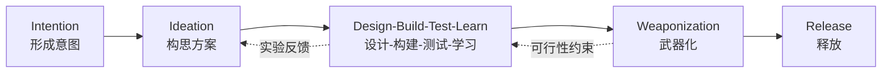

# Measuring Biological Capabilities and Risks of AI Agents：生物 Agent 评测不是“会不会答题”，而是“证据到底能说明什么”

| 项目 | 内容 |
|---|---|
| 论文 | Measuring Biological Capabilities and Risks of AI Agents |
| 作者 | Patricia Paskov, Jeffrey Lee, Kyle Brady, Alyssa Worland |
| 机构 | RAND Center on AI, Security, and Technology |
| 版本 | arXiv:2606.19899v1，2026-06-18 提交；RAND report number PEA4710-1 |
| 类型 | AI 安全 / AI for 生物安全 / Agentic evaluation 方法论报告 |
| 原文 | https://arxiv.org/abs/2606.19899 |

### TL;DR

- 这篇 RAND perspective 讨论一个正在变得很紧的政策问题：当 AI scientist 和生物工作流 Agent 开始进入真实科研流程时，怎样生成、解释和披露关于其生物能力与风险的可信证据。
- 作者的核心判断不是“某个模型已经会制造生物武器”，而是：**静态知识题不能充分说明风险，生物风险来自多步骤、工具化、资源约束和人机协作条件下的路径完成能力**。
- 报告把 biological agentic evaluation 定位为关键但高解释敏感度的工具：它能测试 Agent 是否能规划、调用工具、适应反馈并推进设计-构建-测试-学习流程，但结果会被任务定义、资源假设、人类参与、评分方法和文档披露强烈塑形。
- 第 4 章是全文技术核心，作者给出五类实践考虑：定义要测什么、把目标翻译成任务和测量工具、在具体运行条件下执行、设计评分方法、负责任地记录和沟通结果。
- 报告给出三张关键图：Figure 1 是评测设计流程，Figure 2 是生物武器风险链，Figure 3 是“生物工具使用”任务分解；本文用表格和 Mermaid 重构这些证据，不直接本地化图片。
- 关键数字包括：Webster 等识别 **1000+** 个 AI-enabled biological tools；部分研究显示 LLM 在生物设计-构建-测试-学习 benchmark 上接近专家，Grok 3 在设计和筛查规避任务上超过专家，GPT-4 在编程题 human-in-the-loop 条件下从 **0%** 提升到 **86%+**；GPT-oss-120B 在 GPQA 上跨推理 provider 有 **8 个百分点以上** 波动。
- 局限也很明确：这不是一个新 benchmark，不报告新模型实验；它主要提供评测设计和解释框架，许多主张依赖 RAND 团队既有或 forthcoming 的评测经验，生物 Agent 公开评测生态仍很早期。

### 这篇文章真正关心什么？

- **问题不是单点知识。**
  - 传统生物安全 benchmark 常问模型是否知道病原体、遗传学、协议或实验知识。
  - 作者认为这类题有信号价值，但不足以解释真实风险，因为生物风险往往出现在跨步骤整合中。

- **问题是路径能力。**
  - 一个 Agent 是否能把文献检索、序列获取、生物工具交互、设计修改、实验协议选择、故障排查和结果解释连成一条可执行路径。
  - 这比“模型知道一个危险事实”更接近真实科研和滥用场景。

- **问题还是证据解释。**
  - 如果一个评测只说“模型得分 70%”，但不说明人类给了多少提示、工具有哪些、资源假设是什么、评分器怎么验证，政策制定者就很容易过度解读。
  - 反过来，如果评测过度保密，又会削弱外部验证和方法复用。

可以把全文主张压成一个评测方程：

```text
Risk evidence = f(Action space, Human model, Resources, Tasks, Runtime, Scoring, Disclosure)

其中：
- Action space：评测覆盖的是单个步骤，还是完整路径。
- Human model：Agent 是独立行动，还是与人类协作。
- Resources：是否接入文献库、GenBank、PubMed、云实验室、供应商 API、Python、搜索等资源。
- Tasks：复杂流程如何拆成任务和子任务。
- Runtime：推理 provider、temperature、上下文、脚手架和工具权限。
- Scoring：规则评分、专家评分、LLM autograder 和不确定性估计。
- Disclosure：在透明度、信息危害和出口管制之间如何取舍。
```

### 作者的论证路线

| Claim | Mechanism | Evidence | Boundary |
|---|---|---|---|
| 生物风险不能只靠静态知识题判断 | 风险来自多步骤工作流，而非孤立事实 | 报告对比 MMLU、GPQA、LAB-Bench、WMDP 等静态/知识型 benchmark 与 agentic evaluation | 静态 benchmark 仍可提供背景能力信号，不应被完全丢弃 |
| Agentic evaluation 更接近真实科研流程 | 测试规划、工具使用、适应和跨步骤依赖 | 作者引用软件工程、机器学习研究、网络安全中的 agentic benchmark，并指出生物领域公开评测较少 | 评测环境仍是模拟或受控环境，不能直接等同真实实验室风险 |
| 评测结果高度依赖设计条件 | 人类参与、资源、工具、提示、运行参数都会改变表现 | GPT-4 human-in-the-loop 编程提升、GPT-oss-120B 跨 provider 波动、bio benchmark 饱和等例子 | 报告多为方法论综合，不提供新实验估计这些因素的独立效应 |
| 生物 Agent 评测必须分解任务 | 端到端得分会掩盖失败点和能力边界 | Figure 3 展示“生物工具使用”可以继续拆成离散子任务 | 分解过细可能偏离真实工作流，需要在可解释性和生态有效性之间平衡 |
| 披露需要受控透明 | 生物评测细节可能本身构成信息危害 | Wittmann 等采用 managed access，Frontier Model Forum 提出分层披露 | 过度控制会降低复现和外部审计，需要可信网络和披露规范 |

### 从“AI scientist”进入生物风险链说起

作者开篇把 AI scientist 放在科学发现周期里，而不是只放在聊天机器人能力表里。

- AI scientist 通常基于 LLM。
- 它们可能接入：
  - 软件工具；
  - 生物医学文献库；
  - 数据库；
  - 生物设计工具；
  - 自动化实验平台；
  - 多 Agent 协作脚手架。
- 它们的目标不是回答单个问题，而是以较少人类监督执行复杂研究工作流。

报告列举 2025 年的几类趋势：

| 时间 | 系统或方向 | 作者用它说明什么 |
|---|---|---|
| 2025-02 | Google AI co-scientist | AI scientist 已进入假设生成和科研辅助讨论 |
| 2025-05 | FutureHouse Robin | 多 Agent scientist 开始被公开展示 |
| 2025-11 | Edison Scientific Kosmos | “把数月工作压缩为一天”的叙事强化了自动化科研想象 |

这些例子在文中不是作为性能证明，而是作为背景：生物 Agent 的评测对象正在从“模型会不会答生物题”变成“系统能不能推进科研链条”。

### Figure 2 的风险链：为什么单点知识不够？

报告用 biological weapon risk chain 组织风险讨论。图中链条是顺序画法，但作者强调现实攻击规划常常迭代，后续步骤会反过来影响前面设计。



这张图在论证中承担三件事：

- **把风险从“知识”移到“流程”。**
  - 仅会解释毒力因子，不等于能完成后续设计、合成、筛查规避和实验执行。
  - 但如果 Agent 能把多个步骤接起来，风险含义就不同。

- **把 Agent 与 biological tools 放到同一系统里。**
  - Webster 等识别了 1000+ 个 AI-enabled biological tools。
  - 其中若干工具映射到风险链上的关键环节。

- **把评测目标限定为可解释证据。**
  - RAND 团队当前评测主要聚焦数字组件，例如设计-构建-测试-学习流程中的数字任务和生物工具交互。
  - 这能生成可复现证据，但仍不等于真实世界完整攻击链已被测完。

### Chapter 2：已有证据说明了哪些风险？

作者把 AI-enabled biological risk 分成几个证据层次。

| 证据层 | 文中例子 | 能说明什么 | 不能说明什么 |
|---|---|---|---|
| 构思与知识辅助 | Soice 等研究 LLM 帮助 MIT 非科学学生构思已有病原体 | 模型可能降低 ideation 门槛 | 不说明能完成构建或部署 |
| 协议生成 | Persaud 等显示 LLM 可生成生物武器 proxy design 相关协议 | 模型能组织实验步骤 | 不说明协议真实可执行或安全筛查可绕过 |
| 专家级知识接近 | Dev 等发现 frontier LLM 在若干生物 benchmark 上超过非专家并接近专家 | 生物知识能力快速上升 | 静态 benchmark 仍不代表工作流执行 |
| 实验排障 | Gotting 等显示 LLM 在双用途病毒实验排障上匹配或超过专家 | 模型可能辅助后续实验迭代 | 不等同独立实验能力 |
| 工具和平台风险 | synthesis screening、cloud lab、biological tool 的滥用风险 | 数字能力可能连接物理执行 | 真实可行性依赖供应链、实验室和监管条件 |

这里最值得注意的是作者对 Agent 的定义：Agent 可能不是简单“告诉人类怎么做”，而是替人类做一部分步骤。

- 低自主配置：
  - 人类主导，Agent 填知识空白或加速某一步。
- 协作配置：
  - 人类与 Agent 交替推进，遇到瓶颈时互相修正。
- 高自主配置：
  - Agent 主要独立操作，只在少数节点请求人类输入。

评测若不区分这些配置，就会把不同风险混在一起。

### Chapter 3：为什么需要 biological agentic evaluations？

作者承认静态知识 benchmark 有价值，但指出它们漏掉三个关键维度。

| 漏掉的维度 | 为什么重要 | Agentic evaluation 如何补上 |
|---|---|---|
| 跨步骤依赖 | 生物任务常有前一步错误导致后续失败 | 观察完整轨迹和中间检查点 |
| 工具使用 | 真实科研依赖数据库、搜索、Python、生物工具和实验接口 | 给 Agent 配置受控工具环境 |
| 适应能力 | 真实工作流会遇到缺失数据、失败工具和不确定反馈 | 测试规划、重试、修正和排障 |

报告对 biological agentic evaluation 的定位很克制：

- 它不是“风险真值机”。
- 它是结构化证据生成工具。
- 它需要与威胁模型、资源假设和评分解释绑定。

这也解释了为什么作者强调“interpretation-sensitive”。同一个模型，同一个任务，在不同人类提示、工具权限、推理 provider 和评分器下可能给出不同风险含义。

### Chapter 4.1：先定义要测什么

第一个设计关口是定义评测对象。

#### 跨学科团队

作者认为可靠评测需要三类专业知识。

| 专业 | 缺失时的风险 |
|---|---|
| 生物学 | 任务可能不符合真实实验室实践 |
| ML 工程 | 可能误解 Agent、工具、脚手架和运行环境 |
| 生物安全 | 可能遗漏真正有安全意义的威胁向量 |

这个要求很现实：生物 Agent 评测既不是纯 NLP benchmark，也不是纯 wet-lab 风险评估。它处在模型、工具、实验知识和安全治理交叉处。

#### Action space 与 pathway-complete capability

作者提出一个重要区分：

- **Localized capability**
  - Agent 在单个环节表现好。
  - 例子：能找到序列、能写协议、能解释结果。

- **Pathway-complete capability**
  - Agent 能把多个必需环节连成一致、可执行的路径。
  - 例子：从文献线索到设计、优化、供应链、协议和排障都能推进。

风险解释应区分这两者。

- 如果 Agent 单步强但转场失败，风险是局部辅助型。
- 如果 Agent 能跨环节闭环，风险更接近路径赋能型。

#### Human-agent interaction

作者特别反对把“人类参与”当作背景噪声。

| 交互模式 | 评测含义 |
|---|---|
| Agent-only | 测自主规划和工具使用能力 |
| Human-in-the-loop | 测人类与 Agent 组合能力 |
| Centaur / mixed initiative | 测分工、纠错、提示和协作带来的能力增益 |
| Multi-human / multi-model | 更贴近团队式真实使用，但更难控制变量 |

文中引用一个很强的类比证据：在编程问题上，GPT-4 在无人工参与时表现为 0%，human-in-the-loop 条件下可超过 86%。这个数字不直接来自生物实验，但它说明人类参与可能从根本上改变能力估计。

#### 人类专家水平和资源假设

作者强调没有“代表性人类”。

- 新手和专家从 Agent 获得的 uplift 不一样。
- 生物领域内部也有专业差异：
  - 细菌学专家不一定懂病毒学；
  - 合成生物学专家不一定熟悉供应商筛查；
  - 计算生物学专家不一定能执行 wet-lab 协议。

资源假设同样关键。

| 资源 | 可能改变的能力 |
|---|---|
| PubMed / GenBank | 文献和序列检索 |
| 商业供应商 API | 订购、筛查、物流路径 |
| cloud lab | 从数字计划连接到物理执行 |
| Python / 搜索 / 数据库 | 自动分析和工作流整合 |
| 预算与实验室权限 | 决定任务是否真实可行 |

### Chapter 4.2：把目标翻译成任务和测量工具

作者第二个关口是 task design。

#### 为什么要分解工作流？

生物工作流常有早期错误传播。

- Agent 如果拿错序列，后续设计再漂亮也无意义。
- Agent 如果无法选择正确生物工具，就看不到下游设计能力。
- Agent 如果能写协议但不能解释失败反馈，端到端结果仍可能失败。

因此只看最终成功率会掩盖失败来源。

#### Figure 3：生物工具使用可以怎么拆？

报告用“biological tool use”做例子。本文把图转写为一个可操作分解：

| 层级 | 子任务 | 评测信号 |
|---|---|---|
| 目标识别 | 判断需要哪类生物工具 | Agent 是否理解任务和工具边界 |
| 输入准备 | 找到序列、参数、格式、物种或目标蛋白 | Agent 是否能把生物问题转成工具输入 |
| 工具执行 | 正确调用工具并处理错误 | Agent 是否具备工具使用和排障能力 |
| 输出解释 | 解释评分、结构、候选序列或警告 | Agent 是否能把工具输出还原为生物含义 |
| 下游整合 | 把结果用于设计、筛选、协议或决策 | Agent 是否能跨步骤推进路径 |

对应的伪代码可以这样写：

```text
Input:
  biological_goal, threat_model, allowed_tools, resource_assumptions

State:
  evidence_log = []
  unresolved_bottlenecks = []
  assistance_level = predefined_interaction_model

Loop over workflow_stage:
  define expected biological artifact
  select allowed tool or no-tool action
  validate input format and biological plausibility
  run tool under logged runtime conditions
  score intermediate artifact with rubric
  if failure is early bottleneck:
    either stop and record boundary
    or provide documented progressive assistance
  append assumptions, prompts, tool outputs, and scoring notes

Output:
  capability profile, failure map, risk interpretation, disclosure tier

Failure boundary:
  Do not infer pathway-complete capability from isolated subtask success.
```

这个伪代码不是论文原文算法，而是按作者的设计原则重构出的评测流程。它的价值在于把“模型得分”拆成可审计轨迹。

#### Progressive assistance 不是作弊，但必须计入解释

作者对提示帮助的态度很细。

- 如果目标是测自主能力，应尽量少给帮助。
- 如果目标是测协作使用，应允许结构化反馈。
- 如果 Agent 卡在早期瓶颈，评测者可以有控制地提供提示，以观察下游能力。

但前提是：

- 记录给了什么帮助；
- 解释为什么给；
- 在评分中调整；
- 不把 assisted performance 误说成 autonomous performance。

#### Benchmark 需要 maturation，而不是只追难度

作者还提出一个对安全 benchmark 很重要的点：许多 biosecurity benchmark 会饱和。

- 饱和后，模型都高分，benchmark 很难区分能力变化。
- 解决办法不是随意加难，而是把评测设计成可成熟、可迭代的任务池。

一个成熟机制可以是：

| 阶段 | 操作 | 解释边界 |
|---|---|---|
| 初始 | 构造大任务池，先用较易子集 | 结果只代表当前切片 |
| 饱和 | 退役已失去区分度的任务 | 避免 leaderboard 虚高 |
| 更新 | 加入保留难题或新任务 | 保持风险相关性 |
| 报告 | 标明任务池版本和替换逻辑 | 防止跨版本误比 |

### Chapter 4.3：运行条件会改变结果

作者第三个关口是 execution。

#### 评测基础设施

报告建议使用便于快速试验和复现的框架，例如 UK AI Security Institute 的 Inspect AI。

这背后的理由不是工具崇拜，而是生物任务很容易因数据缺失而变成无效题。

- 目标序列可能不可得。
- 蛋白结构资料可能不完整。
- 工具输入格式可能需要隐性专业知识。
- 某个目标在真实条件下根本不适合作为测试样本。

如果没有快速迭代基础设施，评测者可能把“任务设计不可行”误解成“Agent 不具备能力”。

#### 推理 provider 和运行参数

作者引用 GPT-oss-120B 在 GPQA 上跨 inference provider 出现 8 个百分点以上差异的例子。

这个数字说明：

- 模型名相同，不代表运行条件相同。
- provider、采样参数、上下文、工具封装、超时、重试策略都会进入结果。
- 对 Agent 来说，脚手架和工具权限甚至可能比 base model 差异更大。

所以一份可用报告至少要记录：

| 运行字段 | 为什么重要 |
|---|---|
| model and version | 防止把不同 checkpoint 混在一起 |
| provider | provider 可能影响推理质量和工具行为 |
| temperature / sampling | 影响探索、保守性和可重复性 |
| tool list | 决定可行动作空间 |
| scaffold | 决定规划、记忆、重试和工具调用策略 |
| timeout / budget | 影响多步任务完成率 |
| logs | 支持失败分析和外部审计 |

### Chapter 4.4：评分不是附属品，而是证据转换器

作者第四个关口是 scoring。

#### Rubric 要对齐任务分解

好的评分不是最后看答案像不像，而是把每个子任务映射到评价标准。

以 DNA 设计任务为例，评分可以拆成：

- 是否获得正确 DNA 序列；
- 是否选择合理设计策略；
- 输出是否生物学一致；
- 是否遵守资源和安全约束；
- 是否能解释工具输出；
- 是否在关键失败点请求帮助或停机。

这类评分比单一成功率更有政策含义，因为它告诉我们 Agent 到底卡在哪里。

#### Autograder 可以用，但不能神化

RAND 团队使用 LLM autograder 分析 Agent transcript 中的特定表现指标。作者给出几个防护条件：

| 风险 | 缓解方式 |
|---|---|
| LLM judge 幻觉 | 窄范围 rubric |
| 强弱表现混淆 | 用合成强/弱样例验证 |
| 单 judge 偏差 | 多 LLM judge 共识 |
| 与专家不一致 | 和专家人工评分对照 |
| 不确定性隐藏 | 报告 confidence interval |

这里的核心边界是：

- 如果 autograder 是核心评分方法，就必须验证 autograder 本身。
- 如果 autograder 只是补充信号，验证强度可以较低，但仍应抽样人工复核。

这个原则可以推广到 Agent 安全评测：任何把复杂轨迹压缩成一个数字的评分器，都应该被当成被测对象的一部分。

### Chapter 4.5：文档、信息危害和出口管制

作者第五个关口是 communication。

#### 欠文档会让结果无法解释

报告指出，生物安全评测常见欠文档问题会阻碍独立验证。

最低限度应记录：

- 威胁模型；
- 人类参与模式；
- 人类专业水平；
- 资源和工具；
- prompt template；
- scaffold 参数；
- 评分 rubric；
- 生物学依据；
- human baseline；
- confidence interval；
- hypothesis testing；
- 信息危害处理。

#### 透明不能无条件

生物评测有特殊信息危害。

- 过细任务变体可能教会攻击者如何推进危险流程。
- 模型特定漏洞可能成为可操作攻击路线。
- 生物设计细节可能帮助绕过筛查。

作者提到两类应对：

| 做法 | 作用 |
|---|---|
| managed access | 敏感方法只给可信专家网络 |
| tiered reporting | 不同敏感级别对应不同披露范围 |

这不是反透明，而是“受控透明”：让科学严谨性和安全边界同时存在。

#### 出口管制是现实约束

报告最后提醒，在美国语境下，生物安全评测从任务设计到结果分析都可能碰到出口管制。

这会产生三难：

- 等授权，导致评测滞后；
- 限制参与者，削弱专家多样性；
- 冒险共享，承担法律后果。

作者建议政策制定者提供更明确的指导和精心设计的例外机制，否则评测生态可能被合规不确定性拖慢。

### 这篇报告和普通 AI 安全 benchmark 文章有什么不同？

| 普通 benchmark 文章常问 | 这篇报告更关心 |
|---|---|
| 哪个模型第一？ | 结果在什么条件下成立？ |
| 得分是多少？ | 得分由哪些任务、工具、人类帮助和评分器塑形？ |
| benchmark 难不难？ | 是否风险相关、是否可解释、是否会饱和？ |
| 能不能公开所有题？ | 如何在可复现和信息危害之间分层披露？ |
| 是否证明模型危险？ | 是否证明某条路径、某类交互、某些资源假设下的能力边界？ |

这使它更像一篇评测科学方法论，而不是模型能力排行榜。

### 关键证据清单

| 证据点 | 来源位置 | 解释 |
|---|---|---|
| 2025 年出现多类 AI scientist 系统 | Chapter 1 | 说明评测对象正在从聊天模型变成科研工作流系统 |
| 1000+ AI-enabled biological tools | Chapter 2 footnote | 说明工具生态已经足够大，Agent 与工具组合值得单独评估 |
| LLM 可辅助构思、协议、排障和专家级知识任务 | Chapter 2 | 说明静态知识和局部能力已达到需要治理关注的水平 |
| Grok 3 在设计和筛查规避任务上超过专家；GPT4o-mini-high 能生成 DNA assembly code | Chapter 2 | 说明 agentic benchmark 已开始触达更具体的 workflow 能力 |
| biological agentic evaluation 公开生态仍有限 | Chapter 3 | 说明当前缺口不是“无风险”，而是“缺高质量证据” |
| agentic evaluation 设置/奖励问题可相对高估最多 100% | Chapter 4.2 | 强调任务和评分设计会显著扭曲能力估计 |
| GPT-oss-120B 跨 provider GPQA 波动超过 8 个百分点 | Chapter 4.3 | 说明运行条件必须记录 |
| Figure 1/2/3 | Figures list and chapters | 分别支撑评测设计流程、风险链、任务分解 |

### 失败案例和误读边界

这篇报告最有价值的部分之一，是它提前标出了几类常见误读。

- **误读 1：Agent 在一个子任务失败，所以没有风险。**
  - 更准确说法：它在该子任务、该资源、该人类交互和该运行条件下失败。
  - 不能推出其他交互模式或工具组合下也失败。

- **误读 2：Agent 在一个 benchmark 高分，所以能完成真实生物风险链。**
  - 更准确说法：它在该 benchmark 的 action space 内显示能力。
  - 还需要检查是否 pathway-complete。

- **误读 3：human-in-the-loop 结果只是模型能力污染。**
  - 更准确说法：如果现实风险来自人机组合，那么 human-in-the-loop 本身就是要测的对象。

- **误读 4：披露越详细越科学。**
  - 更准确说法：在生物安全语境中，科学透明需要和信息危害分层设计。

- **误读 5：自动评分省事，所以可以替代专家。**
  - 更准确说法：autograder 是可用工具，但其可靠性必须被验证和记录。

### 对 AI 安全研究的延伸

这篇报告对 Agent 安全的启发不止在生物领域。

#### 1. Agent 评测应从 leaderboard 转向证据剖面

一个更好的 Agent 安全报告不应只给总分，而应给：

- action space；
- tool affordance；
- resource assumption；
- human model；
- failure map；
- scoring uncertainty；
- disclosure tier。

这样才能把能力、风险和治理选择连接起来。

#### 2. “路径完成能力”应成为高风险领域的核心指标

对网络安全、化学、生物、金融和代码执行 Agent 来说，单步能力都可能误导。

- 会写 exploit 片段，不等于能完成入侵链。
- 会回答生物知识，不等于能完成湿实验路径。
- 会调用交易 API，不等于能安全管理组合风险。

但如果系统能跨步骤闭环，治理优先级就会改变。

#### 3. 安全评测需要记录“辅助结构”

Agent 的能力不只来自 base model。

- scaffold；
- memory；
- retriever；
- tool wrapper；
- prompt template；
- retries；
- human hints；
- provider；
- autograder。

这些结构都可能改变结果。评测报告如果只写模型名，就不够严谨。

#### 4. 生物安全评测会推动受控透明范式

AI 安全社区常在开源、复现和披露之间摇摆。生物领域把这个矛盾推到前台：

- 完全公开可能制造信息危害。
- 完全不公开会削弱信任。
- 分层披露、可信专家网络、managed access 和审计日志可能成为更现实的中间路线。

### 结论与局限

- 这篇报告的最大贡献，是把 biological agentic evaluation 从“做一个更难 benchmark”提升为“设计可解释风险证据”的问题。
- 它提醒读者：评测不是中立容器，定义、任务、资源、人类参与、运行条件、评分和披露都会进入结论。
- 它也给政策制定者一个清晰信号：当看到 AI 生物能力评测结果时，不应只问模型得了多少分，而应问这个分数在什么威胁模型、资源条件和交互模式下成立。
- 局限是报告没有发布新的 benchmark、数据集或模型实验，更多是 RAND 团队基于既有和进行中评测工作的经验总结。
- 另一个局限是公开 biological agentic evaluation 仍有限，许多关键细节可能因安全和出口管制无法充分公开；这会让外部复现和横向比较长期困难。
- 后续最值得追问的是：能否建立一套既能分层披露、又能被可信第三方审计的生物 Agent 评测协议，让高风险证据既可用、又不把危险操作细节扩散出去。

### 参考链接

- arXiv abstract and metadata: https://arxiv.org/abs/2606.19899
- arXiv PDF: https://arxiv.org/pdf/2606.19899
- RAND report page listed by arXiv report number: https://www.rand.org/t/PEA4710-1
