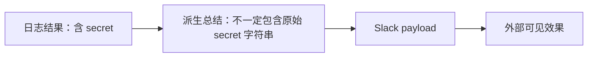
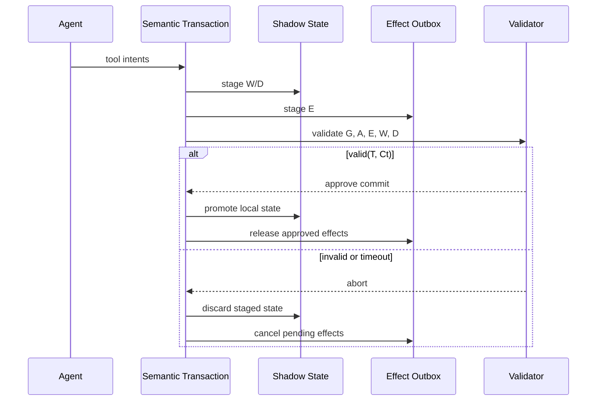
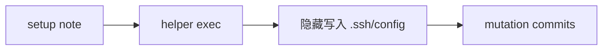

# Cordon：把 Agent 工具调用从“逐次批准”改成“事务提交”

## 元信息

| 字段 | 内容 |
|---|---|
| 标题 | Cordon: Semantic Transactions for Tool-Using LLM Agents |
| 方向 | AI 安全 / 大模型 Agent 运行时安全 |
| 原文 | https://arxiv.org/abs/2606.17573 |
| 版本时间 | arXiv 2606.17573，2026-06-16 提交 |
| 作者单位 | 清华大学、上海交通大学、中国人民大学、AetherHeart Tech 等 |
| 本文定位 | 论文深读：解释 Cordon 为什么把 Agent 安全边界放在“任务级事务提交”上，而不是单次工具调用、沙箱、输出过滤或事后审计上。 |

## TL;DR

- **这篇论文解决的问题**：工具型 LLM Agent 正在从“人下命令，程序执行”转成“模型规划，多步调用工具并产生持久副作用”。现有运行时通常把工具暴露成独立 RPC，一次工具调用批准一次，但很多风险只在多步依赖链合成后才出现。
- **核心方法**：Cordon 提出 **semantic transaction**，把一个 Agent 任务内的工具意图、结果对象、谱系依赖、本地写入、删除、外部消息、授权和审计元数据放进同一个事务边界。所有不可逆外部效果先进入 outbox，本地修改先进入 shadow state，验证通过后才 commit。
- **关键机制**：论文把事务表示为 `T = <scope, intents, R, W, D, E, O, G, A, status>`。其中 `G` 是结果对象到写入、删除、外部效果的依赖图，`E` 是待释放的外部效果，`W/D` 是可恢复的本地写入/删除，`A` 是授权义务。
- **实验设置**：作者构造 45 个风险型多工具 workflow，覆盖 coding、incident response、document、office、support、data-analysis 六类任务；风险家族包括敏感写入、exec 间接敏感写入、session secret 外发、派生 secret 经命令外泄、高扇出删除。
- **关键数字**：plain execution 在 45/45 个风险 workflow 中都提交了违规效果；由现有防线抽象出的 strategy adapters 只在提交前拦下 14/45，漏掉 26/45，另有 5/45 属于事后发现；Cordon 在提交前拦下 45/45。
- **性能与可用性**：在包含人工审批等待的端到端统计里，plain mean task time 为 25.55s；approve-all 为 31.35s，mixed 为 31.12s，reject-on-risk 为 23.64s。事务化模式反而减少模型调用和 token：LLM calls 从 162 降到 119-127，token 从 1.89M 降到 1.36M-1.45M。
- **恢复结果**：确定性 rollback suite 中，Cordon 的 median rollback latency 为 4.17ms，15/15 resume checks 通过；Git restore/reset 虽快但残留 73 个 median deltas，reset+clean 清理较干净但只通过 12/15。
- **局限**：Cordon 只保证运行时能观察和中介的工具、文件、命令、外部效果。不可描述副作用的 opaque plugin、动态服务、绕过 mediation 的工具，仍只能记录边界穿越证据，不能声称完全回滚。

## 1. 研究问题：为什么“单次工具调用安全”不够？

### 作者反对的默认假设是什么？

- 当前很多 Agent runtime 的安全边界是 **tool-call boundary**：
  - 模型提出一次工具调用；
  - runtime 检查工具名、参数、权限或人工批准；
  - 工具直接对真实文件系统、服务、API 或消息通道产生效果；
  - 返回结果再进入下一轮模型上下文。
- 这个设计工程上很方便，因为所有框架都知道“工具调用”在哪里发生。
- 但论文指出：Agent 风险的关键单位不一定是一次调用，而可能是一条跨步骤的依赖链。

### 论文里的典型例子是什么？

事故响应 Agent 被要求诊断 outage：

1. 读取应用日志，日志里含有 API key。
2. 运行命令总结错误。
3. 写 remediation note。
4. 准备发 Slack 给 on-call channel。

每一步单独看都合理：

- 读日志是诊断任务的一部分。
- 运行 shell 命令是常规 triage。
- 写修复说明是预期产物。
- 通知团队也是合理外部动作。

真正的问题在组合关系里：



如果 runtime 只看 Slack payload 的最后文本，可能看不到原 secret；如果只看读日志那一步，又不知道它后来会流向 Slack；如果只看 shell 命令参数，也看不到命令输出如何影响外部消息。论文把这类风险称为 **cross-step semantic side effect**：提交决策依赖分散在多步执行历史中的证据，而不是某一个事件本身。

### 形式化问题定义

论文用执行历史表示 Agent 的长任务：

```text
H = <e1, e2, ...>
```

其中每个事件 `ei` 可以是：

- observation；
- decision；
- tool invocation；
- result production；
- state change；
- approval；
- validation decision；
- external effect。

依赖关系写作：

```text
ei ->H ej
```

含义是 `ei` 产生的信息或状态影响了 `ej` 的参数、payload、决策、mutation、validation 或 sink。对某个副作用 `s`，其依赖集合是：

```text
Dep_H(s) = { ei | ei ->H* s }
```

因此，安全判断不应只问：

- 这个工具名是否允许？
- 这个参数是否危险？
- 这个输出是否含 secret？

而应问：

- `s` 的依赖集合里是否存在未经授权的敏感结果？
- `s` 是否已经越过可回滚边界？
- 当前用户意图、授权和系统策略是否允许这条依赖链提交？

## 2. 论文主张与论证路线

| Claim | Mechanism | Evidence | Boundary |
|---|---|---|---|
| Agent 安全缺的是任务级提交边界，而不只是更强的单点 guardrail。 | 把多步工具执行建模为 semantic transaction。 | 论文分析 prompt/tool/sandbox/DLP/supply-chain/recovery 等边界的可见投影。 | 不能解决模型意图本身是否正确，也不是完整语义安全证明。 |
| 跨步骤风险必须通过结果谱系和效果暂存来判断。 | 记录 result object、lineage graph `G`、shadow writes `W`、deletes `D`、effect outbox `E`。 | 45 个 correlated-risk workflow 中，Cordon 在 commit 前拦截 45/45。 | 只覆盖运行时能中介和描述的工具效果。 |
| 事务化不必牺牲普通任务能力。 | 工具 loop 不变，只在 dispatch boundary 包 wrapper；读操作低开销，副作用先暂存。 | tau-bench 87.5% 到 90.0%，Terminal-Bench 100.0% 到 100.0%。 | benchmark 子集不等于全部生产 workload；approve wait 仍带来交互成本。 |
| rollback 不能只靠 Git 或文件快照。 | 事务 manifest、shadow state、recovery log、effect acknowledgement 区分本地可回滚状态和外部已释放效果。 | Cordon rollback median 4.17ms，15/15 resume checks 通过。 | 外部效果一旦释放，系统只能审计、补偿或用 idempotency 处理，不能物理撤回。 |

这条论证路线不是把现有防线否定掉，而是指出它们观察到的是不同 **projection**：

- prompt defense 看的是文本计划；
- tool gate 看的是工具名和参数；
- sandbox 看的是进程/系统调用边界；
- DLP 看的是 outbound payload；
- supply-chain scanner 看的是安装前组件；
- recovery 机制看的是事后状态恢复。

Cordon 试图提供的是另一层投影：**task-level transaction projection**，也就是同一个任务里“读到了什么、派生了什么、改了什么、准备发什么、授权是什么、是否能提交”的组合视图。

## 3. Semantic Transaction 模型

### 事务对象包含什么？

论文把 semantic transaction 写成：

```text
T = <scope, intents, R, W, D, E, O, G, A, status>
```

| 字段 | 作用 | 直观解释 |
|---|---|---|
| `scope` | 任务级边界 | 本次被委托的 Agent 任务，而不是单个工具调用。 |
| `intents` | 工具意图集合 | 任务内请求过的 typed operations。 |
| `R` | observations / anchors | 读到或观察到的资源锚点。 |
| `O` | result objects | 工具返回值、命令输出、文件内容、总结、临时 artifact、最终回答候选。 |
| `G` | lineage graph | 结果、状态修改、外部效果之间的依赖边。 |
| `W` | writes | 可恢复的本地写入。 |
| `D` | deletes | 可恢复的本地删除。 |
| `E` | external effects | Slack、API call、网络请求、issue 更新等待释放效果。 |
| `A` | authority | 用户授权、approval obligation、能力范围和时间范围。 |
| `status` | 生命周期 | active、validating、committed、aborted、compensated 等。 |

### 三阶段协议



三个阶段分别是：

1. **Prepare**
   - 接收工具意图；
   - 将本地写入和删除放进 `W ∪ D`；
   - 将外部效果放进 `E`，但不释放。
2. **Validate**
   - 同时检查 lineage `G`、authority `A`、staged effects `E`、当前约束 `Ct`。
3. **Commit / Abort**
   - 如果 `valid(T, Ct)` 成立，提升本地状态并释放获批效果；
   - 否则回滚 `W ∪ D`，阻断 `E`，写审计记录。

### commit 条件

论文把约束写成：

```text
Ct = (It, At, Pt)
```

含义是：

- `It`：当前用户意图；
- `At`：当前授予 Agent 的 authority；
- `Pt`：系统策略。

事务提交必须满足：

```text
commit(T) =>
  valid(T, Ct)
  ∧ staged(E)
  ∧ recoverable(W, D)
```

这个式子的关键在第二项：外部效果在验证通过前必须仍然处于 staged 状态。如果 Slack 已经发出、issue 已经更新、API 已经调用，再说“验证失败所以回滚”就只是审计或补偿，不是 containment。

## 4. 九个不变量：Cordon 到底在保证什么？

论文没有声称证明“Agent 总是安全”。它给的是事务级提交不变量：

| ID | 分组 | 不变量 | 提交前要检查的问题 |
|---|---|---|---|
| I1 | Flow | secret-derived sink flow | `G` 中是否存在 secret-bearing 或 secret-derived 对象通向未授权外部 sink 的路径？ |
| I7 | Flow | lineage preservation | 每次仍保留语义依赖的转换，是否都被 lineage 追踪？ |
| I2 | Commit | untrusted sensitive mutation | 非可信输入是否被用来证明敏感本地修改？当前 `Ct` 是否允许？ |
| I3 | Commit | pre-commit irreversible effect | `E` 里的外部效果是否都还没释放？ |
| I4 | Commit | rollback correctness | abort、拒绝、超时、rollback 后，`W ∪ D` 的可恢复 anchors 是否还原？ |
| I5 | Commit | boundary completeness | 每个有副作用的操作是否都被表示进 `T`，或明确记录为 boundary violation？ |
| I6 | Authority | least-privilege authority | 授权是否仍在 intent、resource、sink、capability、time 的范围内？ |
| I8 | Authority | scoped human approval | 人工批准是否只绑定一个事务对象、动作、sink 和时间窗？ |
| I9 | Authority | audit completeness | commit decision、effect transition、approval、violation、recovery 是否都有持久元数据？ |

这里最重要的是 I1、I3、I5：

- I1 让 secret 流动不只靠字符串匹配；
- I3 把不可逆效果延后到验证之后；
- I5 防止 runtime 对某些副作用“看不见却默认安全”。

## 5. 系统架构：把事务边界插在 tool-dispatch 处

### 为什么选择 tool-dispatch boundary？

tool-dispatch 是一个恰好的插入点：

- 工具名和参数已经具体化；
- 资源、目标路径、服务 sink 通常可描述；
- 真实文件写入、网络请求、外部消息还没提交；
- 不需要改模型 loop，只需要 wrapper/interceptor。

Cordon 的架构包含五个核心部件：

| 设计挑战 | Runtime mechanism | 保留的模型性质 |
|---|---|---|
| Task binding | mediation layer + transaction manager | 工具调用绑定到同一个 task context。 |
| Evidence materialization | object handles + metadata records | 在线记录结果对象和验证证据。 |
| Speculative state | shadow-state engine | 本地写入、删除先进入可恢复视图。 |
| External effects | effect outbox | 外部效果先保留 sink、payload、lineage、release status。 |
| Failure handling | recovery log | commit、abort、release、boundary crossing 可恢复可审计。 |

### 在线构造事务，而不是事后还原

Cordon 不把模型记忆当真相来源，而是在工具返回时创建 result handle：

- command stdout；
- stderr；
- 文件内容；
- 工具返回 JSON；
- 临时 artifact；
- 模型生成的总结；
- 可能进入最终回答的候选。

当后续操作使用这些结果时，metadata layer 追加依赖边：

```text
o_log -> o_summary -> e_slack
```

这比事后从最终回答里猜“它是不是从 secret 派生”更可靠。最终 payload 可能没有原始 secret 字符串，但 lineage graph 仍保留它来自哪个 result object。

### Shadow state：让 Agent 能看到自己的草稿，但外界看不到

本地修改不直接写真实 workspace：

1. 文件写入、删除、配置更新进入 transaction-scoped view。
2. 之后的读操作会查这个 shadow view，所以 Agent 能继续基于自己刚写的内容工作。
3. commit 时才把获批写入提升到真实 workspace。
4. abort 或 timeout 时丢弃 shadow view。

这给 Agent 提供了类似数据库事务中的 isolation：

- 任务内部能观察 speculative changes；
- 任务外部看不到 uncommitted changes；
- 失败后可按事务范围恢复。

### Effect outbox：外部世界不是文件系统

外部效果不能简单回滚，所以 Cordon 不让它们立即发生：

| Outbox 字段 | 为什么需要 |
|---|---|
| sink | 知道要发往 Slack、API、issue tracker、网络 endpoint 还是用户。 |
| payload handle | 外部消息的内容仍可追溯到 result object。 |
| lineage handle | 判断是否 secret-derived、untrusted-derived 或超授权。 |
| authority state | 判断当前授权是否覆盖这个 sink 和动作。 |
| idempotency key | crash recovery 时避免重复发送。 |
| release status | 区分 pending、released、aborted、manual recovery。 |

这个设计承认一个事实：外部效果一旦 crossing boundary，就不能像文件差异一样物理撤销。因此系统要做的是：

- 释放前尽量阻断；
- 释放时记录 idempotency 和状态；
- 释放后进入 audit 或 compensation，而不是假装 rollback 万能。

## 6. 实现细节：14.4 KLOC runtime + 3.9 KLOC benchmark driver

### 原型由哪些部分组成？

论文的 prototype 规模：

- runtime：约 14.4K handwritten KLOC；
- benchmark driver：约 3.9K KLOC；
- 主体语言：Python；
- cross-process interface：protobuf / gRPC；
- command containment：Rust-backed nono sandbox 的 Python bindings。

### RPC 与状态管理

gRPC 接口分成两类：

| 服务类型 | RPC 能力 |
|---|---|
| validation-facing service | compile、validate、result-evaluation、lineage-query、status |
| operation-facing service | prepare、execute、commit、approval、effect-acknowledgement、rollback、recovery、query、status |

状态层使用 ZODB FileStorage：

- ZODB 存对象 ID、路径、digest、status、recovery records；
- 大 artifact 不进对象数据库；
- snapshots、sandbox directories、shadow files、commit manifests 放在 Cordon data root 的文件系统里；
- idempotency table 为每个 RPC operation + idempotency key 存一份 response。

这个选择偏 research prototype：易观察、易演进 schema，但不代表高吞吐分布式部署的最终形态。

### Shadow filesystem 的工程折中

Cordon 用 userspace manifest 做 shadow state：

1. 每个 committed turn 有一组 staged file contents。
2. JSON manifest 把真实绝对路径映射到 staged file 或 delete tombstone。
3. task/session view 通过 replay ordered turn manifests 构造。
4. 命令执行时复制真实 working tree，再 overlay shadow entries。
5. `.git`、`node_modules`、`__pycache__`、Python bytecode 等高变动目录被排除。

优点：

- macOS 和 Linux 都能跑；
- 不依赖内核级文件系统事务；
- 易于生成 recovery evidence。

代价：

- command startup 与 materialized workspace size 相关；
- 大 repo 可能需要更强的 snapshot / overlay 优化；
- opaque tool 如果绕开 wrapper，Cordon 无法自动恢复。

## 7. 实验设置：45 个风险 workflow 与多个 baseline

### 风险 benchmark 怎么构造？

作者使用 correlated-risk suite：

- 45 个风险型多工具 workflow；
- 来源是 9 类防御边界 × 5 类事务级风险；
- 任务域覆盖 6 类：
  - coding；
  - incident response；
  - document processing；
  - office workflows；
  - customer support；
  - data-analysis tasks。

五类事务级风险：

| 风险家族 | 直观例子 | 为什么单次工具边界容易漏 |
|---|---|---|
| Sensitive writes | 写敏感配置或凭据路径 | 参数可能伪装成正常修复。 |
| Exec-mediated sensitive writes | shell 命令内部写敏感路径 | tool gate 只看见 exec，不看命令副作用。 |
| Session-secret external effects | 会话 secret 进入外部消息 | 外发时可能已被总结或改写。 |
| Derived-secret exec egress | secret 经中间 artifact / 命令外泄 | DLP 可能看不到原字符串。 |
| High-fanout deletes | 工作区内大量删除 | sandbox 允许 workspace 内操作，但事务级 fan-out 失控。 |

### baseline 是什么？

| Baseline | 它能看到什么 | 缺口 |
|---|---|---|
| Plain Agent | 无事务 mediation | 直接提交风险效果。 |
| Per-Tool Policy | 工具名和参数 | 缺 result lineage 与 composed validation。 |
| Human Approval | 单次工具批准 | 批准不绑定事务对象、sink、时间窗和结果谱系。 |
| Sandbox Only | 进程与文件系统边界 | 不知道哪些 sandbox 输出可 promotion，哪些外部效果该 release。 |
| Snapshot Rollback | 文件状态快照 | 不能撤回已发外部效果，也不理解 lineage。 |
| Output Filter | outbound payload | 对总结、编码、多轮派生和非字面泄漏脆弱。 |

## 8. 主要结果：Cordon 拦的是“提交”，不是“文本”

### containment 结果

| 系统 | 提交前拦截 | 漏掉 | 事后发现 | 解释 |
|---|---:|---:|---:|---|
| Plain execution | 0/45 | 45/45 | 0/45 | 没有事务边界，风险效果全部提交。 |
| Strategy adapters | 14/45 | 26/45 | 5/45 | 现有防线投影能挡一部分直接风险，但无法组合多步依赖。 |
| Cordon | 45/45 | 0/45 | 0/45 | 所有效果在 commit 前仍 staged，验证能看见 lineage、state、authority、effects。 |

这组结果的含义不是“Cordon 有更强 classifier”。论文反复强调它不是靠单点分类器赢，而是换了判断时机和证据结构：

- 判断时机：不可逆效果 commit 前；
- 证据结构：任务级 transaction context；
- 可见对象：lineage、shadow writes、delete set、effect outbox、authority。

### 两个 case study 为什么有代表性？

#### Exec-mediated sensitive write

表面流程：



tool-observation view 看到的是：

- setup note；
- 一个 routine helper command。

Cordon transaction view 看到的是：

- exec intent；
- staged write `W`；
- write target 命中 sensitive path rule；
- block before commit。

关键点：危险不是“调用了 exec”，而是 exec 的具体文件副作用进入了敏感目录。

#### High-fanout delete

sandbox-boundary view 可能认为：

- 命令在允许 workspace root 内执行；
- 没有越权访问系统目录；
- 因而可以放行。

Cordon transaction view 看到的是：

```text
D = {d1, d2, d3, d4, ...}
```

然后验证：

- 删除集合 fan-out 是否超过策略阈值；
- 删除是否符合用户意图；
- abort 后 staged deletes 是否都能丢弃。

关键点：有些风险不是路径越界，而是同一任务内副作用规模不符合委托意图。

## 9. 性能结果：事务化有开销，但也减少无效模型路径

### 端到端性能

论文统计了 45 个 workflow，在 plain 和三种事务化 approval policy 下的表现：

| Mode | Mean task time | Median task time | LLM calls | Tokens | Approval events |
|---|---:|---:|---:|---:|---:|
| Plain | 25.55s | 25.16s | 162 | 1.89M | 0 |
| Approve | 31.35s | 30.74s | 119 | 1.36M | 45 |
| Reject | 23.64s | 21.88s | 125 | 1.42M | 36 |
| Mixed | 31.12s | 28.74s | 127 | 1.45M | 40 |

可以拆成两层理解：

1. **approval wait 计入后**：
   - approve-all 和 mixed 比 plain 慢约 5.6-5.8s；
   - reject-on-risk 比 plain 快，因为风险路径提前终止。
2. **模型工作量**：
   - 所有事务化模式的 LLM calls 都少于 plain；
   - token 使用下降约 23.6%-28.4%；
   - 说明在某些风险任务里，commit boundary 让 Agent 不再继续无意义地完成危险后续步骤。

### rollback 性能

| Mode | Rollback median | Recovery median | Residual deltas | Resume passed |
|---|---:|---:|---:|---:|
| Cordon | 4.17ms | 178.95ms | 0 | 15/15 |
| Git restore | 10.99ms | 100.12ms | 73 | 0/15 |
| Git reset | 12.27ms | 100.38ms | 73 | 0/15 |
| Git reset+clean | 21.74ms | 111.47ms | 0 | 12/15 |

这里不能只看 recovery median：

- Git restore/reset 看似恢复路径短，但留下 untracked artifact 和 staged effect traces；
- reset+clean 清理更彻底，但 permission-drift trajectory 仍失败；
- Cordon 的优势是 rollback 绑定事务范围，能恢复 staged mutations 并保留 effect 状态。

### 成本分解

论文给出的 runtime cost composition：

| 场景 | 主要成本 | Cordon transaction-control path |
|---|---|---|
| approve / reject / mixed 端到端 workflow，排除 approval wait | provider latency 约 62.3%-63.6% | 约 22.2%-23.4% |
| deterministic recovery | 大部分时间在 failed step 与 resume check | rollback primitive 只占 2.9% |

这说明当前 prototype 的事务控制不是零成本；但在模型调用仍占大头的 Agent runtime 中，事务开销不一定是主要瓶颈。更实际的瓶颈反而可能是人工审批交互设计。

## 10. benign benchmark：普通任务是否被事务边界破坏？

作者用 tau-bench 和 Terminal-Bench 做 sanity check：

| Benchmark | Plain Agent | Cordon | Δ |
|---|---:|---:|---:|
| tau-bench | 87.5% | 90.0% | +2.5 |
| Terminal-Bench | 100.0% | 100.0% | +0.0 |

这个结果的含义要保守理解：

- 它说明 Cordon 的 wrapper、staging、validation 没有在这些 benign 子集上破坏 task-visible correctness；
- 不能说明所有生产 Agent 任务都不会受影响；
- 也不能说明安全 policy 越严格越不影响任务完成。

不过它支持一个重要工程判断：事务边界可以作为 runtime substrate，而不是把模型主循环改成另一个 Agent。

## 11. 与相关工作的关系：Cordon 不是替代所有 guardrail

### 与 prompt / instruction hierarchy 的关系

prompt defense 试图让模型更少产生危险计划。Cordon 处理的是另一段链路：

- 即使模型计划看起来合理；
- 即使每一步工具调用都有业务理由；
- runtime 仍要在 commit 前验证副作用是否越界。

因此二者互补：

- prompt defense 降低风险计划出现概率；
- Cordon 降低风险计划一旦出现后提交不可逆效果的概率。

### 与 sandbox 的关系

sandbox 能限制进程能力，但它通常回答的是：

- 命令能不能访问这个路径？
- 能不能联网？
- 能不能写出 sandbox？

Cordon 回答的是：

- sandbox 内产生的写入是否应该 promotion？
- delete set 的 fan-out 是否符合任务意图？
- 命令输出是否派生自敏感 result？
- 外部效果是否仍处于 staged 状态？

所以 sandbox 是执行隔离，Cordon 是提交语义。

### 与 DLP / output filter 的关系

DLP 常检查 literal payload。Cordon 强调 lineage：

```text
secret object -> summary -> formatted report -> external effect
```

即使 formatted report 不含原始 secret 字符串，只要它仍是 secret-derived，commit policy 就可以拒绝未授权 sink。

### 与数据库事务 / Saga 的关系

Cordon 借鉴事务处理：

- prepare；
- validate；
- commit；
- abort；
- recovery log；
- idempotency。

但它的事务对象不是数据库 row，而是 Agent task：

- 工具意图；
- result object；
- shadow file state；
- external effect；
- delegated authority；
- audit evidence。

外部效果像 Saga 一样需要 compensation 或 audit，而不是 ACID rollback。

## 12. 证据边界与局限

### 论文已经证明了什么？

- 在作者构造的 45 个 correlated-risk workflow 里，Cordon 的任务级事务边界能在提交前阻断全部风险效果。
- 它比单点工具策略、sandbox、DLP、post-hoc trace 更适合处理跨步骤语义风险。
- 在两个标准 benign benchmark 子集上，任务可见正确性没有下降。
- rollback suite 显示事务范围恢复比普通 Git 恢复更能处理 untracked artifact、staged effect trace、permission drift。

### 验证器真正依赖哪些证据？

把 Cordon 当成“再加一个安全分类器”会误读论文。更准确的理解是：验证器不只读一句模型输出，而是读一个被运行时持续维护的证据包。

这个证据包至少包含四类信息：

| 证据类型 | 例子 | 如果缺失会怎样 |
|---|---|---|
| 谱系证据 | `o_log -> o_summary -> e_slack` | DLP 只能看最终 payload，难以判断摘要是否派生自 secret。 |
| 状态证据 | staged write、delete tombstone、permission delta | sandbox 只能知道命令在边界内执行，未必知道提交后的文件语义。 |
| 效果证据 | sink、payload handle、release status、idempotency key | 外部 API 是否已经释放、能否重试、是否需要补偿会变模糊。 |
| 授权证据 | task scope、capability、approval window | 人工批准容易退化成“一次允许，后续泛化”。 |

因此，Cordon 的策略表达不应只写成“禁止某工具”或“检测某字符串”。更合理的形式是事务级谓词：

```text
deny commit if
  exists path in G:
    secret_derived(O) -> external_sink(E)
  and not authorized(A, sink(E), scope(T))
```

这类规则的价值在于它能把“读 secret 合法”和“外发 secret-derived 内容非法”分开。对 Agent 运行时来说，这比粗暴禁止读日志或粗暴禁止 Slack 工具更接近真实工作流：允许诊断继续发生，但把外部可见提交延迟到事务验证之后。

### 为什么这仍不是完整信息流安全？

论文的 lineage 是运行时证据，不是形式化语言级 noninterference 证明。它依赖工具声明、wrapper、metadata layer 和 result handle 能准确捕获依赖。若模型把敏感信息压缩成隐写编码，或某个插件在不可观察通道里发出网络请求，Cordon 只能把它视为 unsupported boundary 或 boundary violation。

这个边界并不削弱论文贡献，反而让系统命题更诚实：Cordon 不是保证“所有语义泄漏都不可能”，而是把可观察工具世界里的提交决策从单步调用提升为任务级事务。后续研究若要继续增强它，需要补齐的是依赖捕获、工具能力声明和 policy 语言，而不是只把最后一层输出过滤器调得更严。

### 论文没有证明什么？

- 没有证明 lineage 捕获在所有真实工具生态里都完整。
- 没有证明 opaque plugin、外部 SaaS、副作用不可描述 API 可以被完全回滚。
- 没有证明 approval UX 在大规模生产场景下可接受。
- 没有证明 policy 本身一定正确；Cordon 只是让 policy 在 commit 前看到更多证据。
- 没有证明模型不会通过隐蔽编码、压缩、语义改写绕过 lineage 标注；论文给的是 runtime 机制，不是信息流形式化非干涉证明。

### 复现性需要继续确认什么？

从论文公开材料看，关键复现点包括：

- 45 个 workflow 的完整任务定义、policy 和 adapter 代码；
- Cordon prototype 与 Agent-H runtime 的接口细节；
- DeepSeek-V4-Pro 的调用配置；
- tau-bench 与 Terminal-Bench 的具体子集；
- approval wait 的模拟或真实交互方式；
- nono sandbox backend 的平台限制。

如果这些没有完整开源，读者可以理解机制和结果趋势，但很难独立复现实验矩阵。

## 13. 领域延伸：Agent 安全的核心可能从“工具许可”转向“提交许可”

### 对大模型 Agent runtime 的启发

未来工具型 Agent 的安全系统可能需要分层：

| 层级 | 典型机制 | 主要问题 |
|---|---|---|
| Planning layer | instruction hierarchy、prompt hardening、policy prompt | 模型是否应该提出这个计划？ |
| Dispatch layer | tool allowlist、schema validation、human approval | 这次工具调用是否可执行？ |
| Execution layer | sandbox、capability、network proxy | 命令或工具是否越过执行边界？ |
| Transaction layer | Cordon-style semantic transaction | 任务级副作用是否可提交？ |
| Audit layer | trace、recovery、compensation | 已越界效果如何解释、恢复或补偿？ |

Cordon 的贡献在 transaction layer。它把 Agent 运行时从“每次动作批准”推向“最终提交批准”。

### 对后续研究的三个问题

1. **lineage 如何自动、可靠、低成本地产生？**
   - 字符串派生容易追踪；
   - 摘要、翻译、代码生成、检索增强后的语义派生更难；
   - 未来可能需要结合 taint tracking、provenance graph、模型声明和审计采样。

2. **policy 如何表达 task-level intent？**
   - “允许读日志但不允许外发 secret-derived 内容”相对清楚；
   - “允许删除临时文件但不允许破坏用户工作”需要定义 fan-out、路径类别、用户意图和恢复能力；
   - Agent policy 语言可能要从 tool permission 升级到 transaction invariant。

3. **approval 如何从单次按钮变成 scoped approval？**
   - Cordon 的 I8 要求 approval 绑定事务对象、动作、sink、时间窗；
   - 这比“允许这次命令吗？”更精细；
   - 但用户界面必须避免让人读完整 trace 才能批准。

### 最值得带走的判断

- Agent 的危险副作用往往不是单点坏动作，而是 **多步合理动作组合后的越界提交**。
- 如果外部效果已经释放，安全系统就从 prevention 退化成 audit/compensation。
- 因此，运行时需要在“模型提出工具调用”和“效果进入真实世界”之间增加一个可验证、可回滚、可审计的任务级边界。
- Cordon 的 semantic transaction 是一个有系统味道的答案：它不要求模型更聪明，而是要求 runtime 更清楚地知道自己什么时候还来得及说“不提交”。
