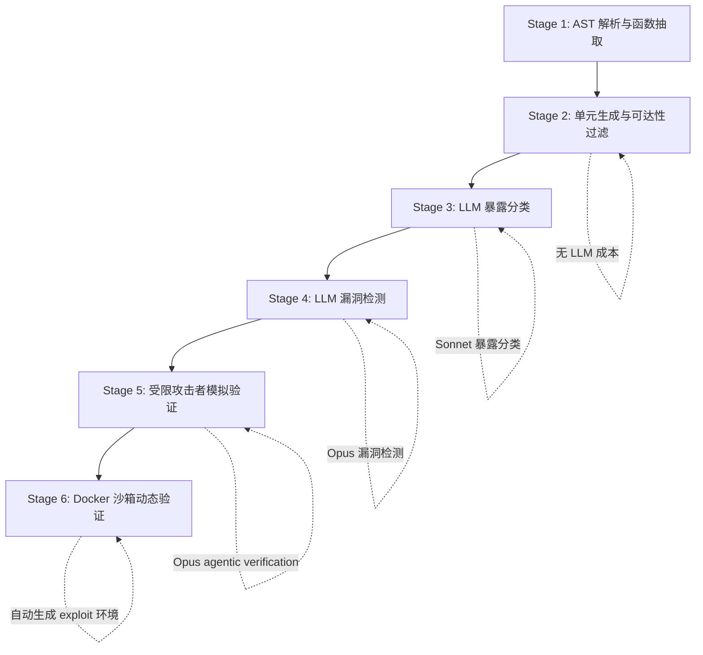

# OpenAnt：把 LLM 漏洞扫描从“可疑模式”推进到“可复现实证”

## 元信息

| 字段 | 内容 |
|---|---|
| 标题 | OpenAnt: LLM-Powered Vulnerability Discovery Through Code Decomposition, Adversarial Verification, and Dynamic Testing |
| 作者 | Nahum Korda, Gadi Evron |
| 类型 | 论文 + 开源项目 |
| 方向 | AI for Security / LLM 辅助漏洞发现 |
| arXiv | https://arxiv.org/abs/2606.19149 |
| HTML | https://arxiv.org/html/2606.19149v1 |
| 代码 | https://github.com/knostic/OpenAnt |
| 补充博客 | https://www.knostic.ai/blog/openant |
| 公开时间 | arXiv v1 于 2026-06-17 公开，Scout 记录 v2 于 2026-06-18 修订 |

## TL;DR

- **OpenAnt 研究的问题**：LLM 能理解代码语义，但直接把整个仓库塞给模型会遇到上下文、成本、误报和验证不足；传统 SAST 又常把“像漏洞的代码”当成“可被攻击者利用的漏洞”。
- **核心方法**：系统把仓库拆成函数级 analysis unit，先用静态调用图和外部入口可达性过滤攻击面，再让 LLM 做暴露分类、漏洞检测、受限攻击者模拟，最后自动生成 Docker 沙箱中的动态验证环境。
- **关键证据**：论文在 8 个真实开源项目、6 种语言上跑完整 6 阶段流水线；总计从 64,132 个函数过滤到 2,281 个 reachable units，再到 586 个 externally exploitable units、376 个 Stage 4 候选、190 个 Stage 5 确认候选，其中 144 个被 Stage 6 动态复现。
- **关键数字**：OpenSSL 从 15,232 个函数降到 390 个可达单元，随后降到 49 个外部暴露单元、28 个候选、3 个攻击者模拟确认、1 个动态确认；全量实验成本为 1,461.25 美元，若不做可达性过滤，作者估算会接近 23,700 美元。
- **论文真正的贡献**：不是“LLM 又能找漏洞”，而是把 LLM 安全分析组织成一个逐步收缩且逐步加强证据的漏斗：越往后越贵，但候选越少、验证越强。
- **最重要的局限**：OpenAnt 主要覆盖攻击者输入流向危险 sink 的漏洞类型；复杂协议逻辑、竞态、分布式时序、规格违反、缺失功能类漏洞并不是它的强项。动态验证失败也不等于漏洞不存在。
- **研究意义**：它把 AI for Security 的讨论从 benchmark 分数拉回现实仓库：成本、入口可达性、攻击者能力、运行环境和可复现证据都必须进入同一个闭环。

## 研究问题：为什么“LLM 看代码找漏洞”还不够？

### 论文先拆掉两个过于乐观的假设

- **假设一：静态规则已经足够。**
  - SAST 能在工程流水线里跑得很快。
  - 但作者强调，传统工具的主要痛点是误报噪声、规则覆盖不足和开发者信任下降。
  - 论文引用既有研究说明，开源项目上的误报率可能从低个位数到超过 40% 不等；这不是一个单纯调阈值的问题。

- **假设二：长上下文 LLM 可以直接替代安全工程师。**
  - 现代模型确实能读代码、追踪意图、解释数据流。
  - 但真实仓库里，函数、依赖、调用者、框架入口和配置散落在多个文件中。
  - 如果把上下文堆长，模型会遇到 lost-in-the-middle、成本膨胀和不完整上下文下的过度推断。

- **OpenAnt 的研究问题**可以写成一句话：
  - 在仓库级漏洞发现里，怎样让 LLM 只看攻击面相关的代码，并且把“可能有漏洞”推进到“攻击者可以按约束利用，且最好能动态复现”？

### 这篇论文的靶子不是普通代码审查

| 任务 | 传统工具常见输出 | OpenAnt 想要的输出 |
|---|---|---|
| 扫描范围 | 全仓库规则匹配或数据流分析 | 只保留从外部入口可达的 analysis units |
| 语义理解 | 规则、AST、数据流、污点传播 | LLM 对上下文、调用关系、攻击路径做语义推理 |
| 候选判断 | “这里可能危险” | “攻击者在受限能力下能否逐步触发” |
| 证据形态 | 告警、路径、规则 ID | 攻击路径、约束推理、动态 PoC 执行结果 |
| 主要失败 | 噪声、漏规则、缺语义 | 成本、上下文截断、动态环境不完整、模型判断不稳 |

## 论文主张与论证路线

| Claim | Mechanism | Evidence | Boundary |
|---|---|---|---|
| 仓库级 LLM 漏洞分析必须先缩小攻击面 | 函数级 AST 解析、调用图、入口点识别、BFS 可达性过滤 | 8 个项目从 64,132 个函数缩到 2,281 个 reachable units；OpenSSL 从 15,232 缩到 390 | 可达性依赖框架入口识别；动态加载、反射、插件机制可能漏标 |
| LLM 应该被放在“贵但信息密集”的阶段 | Stage 1-2 不调用 LLM，Stage 3-5 才用模型做暴露分类、漏洞检测、攻击者验证 | 全实验成本 1,461.25 美元；作者估算无 reachability filtering 会接近 23,700 美元 | 成本仍不低；Stage 3 暴露分类占总成本 72.9% |
| 漏洞候选必须接受攻击者能力约束 | Stage 5 让模型扮演受限远程攻击者，不能假设 shell、管理员权限或本地文件访问 | Stage 4 的 376 个候选降到 Stage 5 的 190 个确认候选，消除率 49.5% | 这是经验性过滤，不是形式证明；模型仍可能误判攻击前提 |
| 动态验证能提供比静态解释更强的证据 | Stage 6 自动生成漏洞相关执行环境和 exploit，放入沙箱容器运行 | 190 个 Stage 5 确认候选中，144 个被动态复现，确认率 75.8% | race condition、复杂依赖、分布式环境和低层内存问题更难自动复现 |
| 真实项目比合成 benchmark 更能检验系统能力 | 避开 Juliet/OWASP Benchmark 等可能带命名捷径或训练污染的数据集 | 评估对象是 OpenSSL、WordPress、Flowise、n8n、Rails 等真实项目 | 论文没有给出标准化 recall；未知漏洞发现不能完整衡量漏报 |

## 方法机制：六阶段漏斗

### 总体流程



### Stage 1：代码解析不是为了“看更多”，而是为了后续少看

- 解析器抽取每个函数的：
  - 函数签名。
  - 函数体。
  - 文件位置。
  - 调用者与被调用者关系。

- 语言支持来自混合解析策略：
  - Python、Go 使用原生 AST。
  - JavaScript/TypeScript 使用 `ts-morph`。
  - C/C++、Ruby、PHP 使用 `tree-sitter` grammar。

- 这一阶段的意义：
  - 它把“仓库”转为可以计数、过滤、拼接上下文的函数单元。
  - 它不急着让 LLM 判断漏洞，而是先构造后续推理所需的结构化中间表示。

### Stage 2：analysis unit 与可达性过滤

- 每个 analysis unit 包含三类材料：
  - **Primary code**：被分析的目标函数。
  - **Resolved dependencies**：目标函数调用的依赖函数，默认传递展开到 3 层。
  - **Entry-point metadata**：函数是否从外部输入可达，例如 HTTP handler、CLI 参数处理、WebSocket handler、文件读取接口。

- 可达性过滤的基本逻辑：
  - 识别外部入口点。
  - 从入口点沿调用图做 BFS。
  - 只保留从外部输入可达的函数。
  - 丢弃测试辅助函数、内部工具、没有攻击入口的 utility。

- 论文给出的关键例子：
  - OpenSSL：15,232 个函数降到 390 个 reachable units，减少 97.4%。
  - Grafana：18,500 个函数降到 994 个 reachable units，减少 94.6%。

### 一个可读的过滤公式

```text
令：
F = 仓库中解析出的全部函数集合
E = 外部入口点集合
G = 函数调用图
R = 从 E 出发在 G 上可达的函数集合

Reachability Reduction = 1 - |R| / |F|

OpenSSL:
|F| = 15,232
|R| = 390
Reduction = 1 - 390 / 15,232 = 97.4%
```

- 这个公式解释了 OpenAnt 的成本逻辑：
  - LLM 不是从 `F` 开始分析。
  - LLM 从小得多的 `R` 开始分析。
  - 如果 `R` 里仍有大量安全无关函数，再交给 Stage 3 做暴露分类。

### Stage 3：暴露分类是最贵但最关键的“语义筛选”

- 每个 reachable unit 会被 LLM agent 分类为四类：

| 分类 | 含义 | 是否进入下一阶段 |
|---|---|---|
| Exploitable | 从外部输入可达且存在潜在攻击面 | 是 |
| Vulnerable-internal | 可能不安全但不从用户输入可达 | 否 |
| Security control | 校验、鉴权、清洗等防御逻辑 | 否 |
| Neutral | 没有明显安全相关性 | 否 |

- 这一步为什么要用 agentic exploration：
  - 单个函数可能看不出是否外部暴露。
  - 模型需要查找 caller、读相关实现、追踪输入如何进入。
  - 每一次工具调用都会增加上下文，因此它成为成本大头。

- 论文数字很直观：
  - OpenSSL 从 390 个 reachable units 降到 49 个 externally exposed units。
  - 这又是 87% 的压缩。
  - 全实验里，Stage 3 占总成本 72.9%。

### Stage 4：漏洞检测只处理已暴露单元

- Stage 4 用更强模型分析 externally exposed units。
- 检测重点不是“有没有奇怪代码”，而是：
  - 外部输入从哪里进入。
  - 是否流向危险 sink。
  - 中间有没有认证、授权、清洗、编码、路径规范化。
  - 攻击者是否能控制关键参数。

- OpenSSL 的例子：
  - 49 个外部暴露单元。
  - 28 个被标为潜在漏洞。
  - 这一步仍会产生理论漏洞，因此需要 Stage 5。

### Stage 5：adversarial verification 的关键是“约束”

- Knostic 技术博客把这个点说得很清楚：
  - 只问模型“你是攻击者，能利用吗”会诱导模型过度同意。
  - 模型可能假设攻击者拥有本地 shell、服务器文件、管理员凭据或数据库访问。
  - 这些前提在真实远程攻击里通常不成立。

- OpenAnt 的约束攻击者模拟要求模型逐步证明：
  - 攻击者有哪些输入能力。
  - 能访问哪个 endpoint 或接口。
  - 数据如何从输入点流到危险 sink。
  - 哪些认证、授权、校验会阻断攻击。
  - 每一步不能跳过，也不能用不存在的权限。

- 这一阶段的价值：
  - 它把“看起来危险”改写为“在攻击者能力模型下可利用”。
  - 它是论文中误报压缩的主机制。

### Stage 6：动态验证让证据从文本推理变成运行结果

- Stage 6 的任务不是随机 fuzz。
- 它基于前面推理出的漏洞条件生成：
  - 漏洞相关 exploit。
  - 目标运行环境。
  - 监控与结果判断逻辑。
  - Docker 隔离环境。

- 与 fuzzing 的区别：
  - fuzzing 在大输入空间里探索。
  - OpenAnt 是针对已经推理出的攻击路径生成定向验证。
  - 因此它更像“模型辅助的 proof-of-exploit 工厂”，不是通用覆盖率驱动测试器。

## 实验设置：为什么作者避开传统 benchmark？

### benchmark contamination 是论文的重要动机

- 作者没有主要用 Juliet、OWASP Benchmark 这类合成集来证明能力。
- 原因包括：
  - 数据可能出现在模型训练语料中。
  - 文件名、函数名、CWE 标注可能泄露漏洞类型。
  - 合成代码通常缺少真实项目里的框架、配置、权限、输入流和部署约束。

- 论文用真实开源项目发现未知漏洞作为评估：
  - 这更接近部署环境。
  - 可以同时考察代码理解、漏洞推理、误报过滤、动态复现。
  - 但代价是无法像标准 benchmark 一样给出完整 recall。

### 模型与运行协议

| 阶段 | 模型 | 温度 | 备注 |
|---|---|---|---|
| Stage 3 暴露分类 | Claude Sonnet 4 | 0 | 需要 agentic code exploration |
| Stage 4 漏洞检测 | Claude Opus 4 | 0 | 对外部暴露单元做漏洞判断 |
| Stage 5 攻击者验证 | Claude Opus 4 | 0 | 受限攻击者模拟，检查可利用性 |
| Stage 6 动态验证 | Claude Sonnet 4 | 0 | 自动生成并运行 exploit 环境 |

- 所有分析单元独立处理。
- 不使用系统级缓存。
- 这意味着成本数字更接近“直接跑完整流程”的上限估计，而不是经过缓存优化后的工程成本。

### 项目选择标准

- 作者选择项目时强调三点：
  - 活跃维护、采用度高，全部超过 10,000 GitHub stars。
  - 语言和架构多样。
  - 存在外部可达攻击面，例如 HTTP endpoint、API handler 或公开接口。

- 这让实验更贴近 OpenAnt 的设计边界：
  - 它不是为纯算法库或离线工具量身定做。
  - 它尤其适合有外部输入、插件、工作流、API、文件处理和网络交互的项目。

## 主结果：漏斗数字说明了什么？

### 八个项目的完整漏斗

| 项目 | 语言 | 函数 | Reachable | Exploitable | Stage 4 Flagged | Stage 5 Confirmed | Stage 6 Dynamic |
|---|---:|---:|---:|---:|---:|---:|---:|
| OpenSSL | C | 15,232 | 390 | 49 | 28 | 3 | 1 |
| Flowise | JavaScript | 3,564 | 303 | 160 | 129 | 85 | 64 |
| eShopOnWeb | PHP | 999 | 23 | 7 | 4 | 3 | 3 |
| n8n | TypeScript | 16,009 | 794 | 196 | 118 | 62 | 49 |
| WordPress | PHP | 12,177 | 393 | 93 | 67 | 20 | 13 |
| object-browser | Go | 1,268 | 110 | 16 | 9 | 4 | 4 |
| paperless-ngx | Python | 1,065 | 179 | 47 | 19 | 11 | 9 |
| Rails | Ruby | 13,818 | 89 | 18 | 2 | 2 | 1 |
| **总计** | 6 种语言 | **64,132** | **2,281** | **586** | **376** | **190** | **144** |

### 这些数字的第一层含义：攻击面过滤是经济前提

- 从 64,132 到 2,281：
  - 只剩 3.56% 的函数进入 LLM 可达分析视野。
  - 这一步不调用 LLM，却决定后续成本是否可承受。

- 从 2,281 到 586：
  - 说明“可达”不等于“外部暴露且安全相关”。
  - Stage 3 的语义分类进一步去掉大量普通业务逻辑或防御逻辑。

- 从 586 到 376：
  - Stage 4 输出仍然偏宽。
  - 这符合安全扫描常态：检测阶段宁可保留更多可疑项。

- 从 376 到 190：
  - Stage 5 过滤掉 49.5% 理论候选。
  - 论文把这一步称为 false positive mitigation 的核心。

- 从 190 到 144：
  - 75.8% 的攻击者模拟确认项能被动态复现。
  - 剩余 46 个并非都无效，其中很多受运行环境、依赖和复杂交互限制。

### OpenSSL 案例：0.02% 的极窄出口

```text
OpenSSL 漏斗：
15,232 functions
→ 390 reachable units
→ 49 externally exposed units
→ 28 Stage 4 flagged
→ 3 Stage 5 confirmed
→ 1 Stage 6 dynamic

最终动态确认占原始函数比例：
1 / 15,232 = 0.0066%

Stage 5 确认占原始函数比例：
3 / 15,232 = 0.0197% ≈ 0.02%
```

- 这个案例说明：
  - 成熟底层库的大部分代码并不直接处在 OpenAnt 的外部输入攻击路径上。
  - 对 C 代码做动态验证更难，因为编译、内存模型、输入构造和运行环境都更复杂。
  - 如果没有前两步过滤，把所有函数都交给 LLM 会在经济上不可接受。

### 漏洞类别分布

| 漏洞类型 | Stage 5 确认 | Stage 6 动态确认 | 涉及项目 |
|---|---:|---:|---|
| IDOR / Missing Authorization | 29 | 21 | Flowise, paperless-ngx |
| Mass Assignment / Privilege Escalation | 26 | 20 | Flowise, n8n |
| SSRF | 25 | 18 | Flowise, n8n, WordPress |
| Path Traversal / File Read / Zip Slip | 18 | 16 | 多项目 |
| XSS / Content Injection | 17 | 10 | WordPress, n8n |
| SQL / NoSQL Injection | 11 | 8 | Flowise, n8n |
| Unauthenticated Endpoint / Auth Bypass | 6 | 5 | n8n |
| Resource Exhaustion / DoS | 6 | 2 | WordPress |
| Header Injection | 6 | 5 | Flowise |
| Other | 33 | 28 | 多项目 |

- 这个分布支持论文的一个隐含判断：
  - OpenAnt 更擅长“外部输入 → 程序路径 → 危险 sink”的漏洞。
  - 这些漏洞天然适合用数据流、权限边界和 attacker capability 来表达。
  - 对规格错误、协议状态机、资源生命周期、并发时序的支持则更弱。

## 动态验证与误报压缩

### Stage 6 的结果分布

| 结果 | 数量 | 比例 |
|---|---:|---:|
| CONFIRMED | 144 | 75.8% |
| INCONCLUSIVE | 24 | 12.6% |
| NOT_REPRODUCED | 13 | 6.8% |
| ERROR | 8 | 4.2% |
| BLOCKED | 1 | 0.5% |

- 最值得注意的是 `INCONCLUSIVE`：
  - 它不是明确反驳漏洞。
  - 它表示自动生成环境没能把攻击路径跑通。
  - 对复杂服务依赖、认证状态、插件系统、异步任务和外部网络交互，这个状态会很常见。

### 哪些漏洞最容易被动态确认？

| 漏洞 | 动态确认率 |
|---|---:|
| Command Injection | 100% |
| Path Traversal | 88.9% |
| Authentication Bypass | 83.3% |
| Mass Assignment | 76.9% |

- 这些类型有共同特征：
  - 输入构造相对清晰。
  - sink 或权限结果可观察。
  - 运行环境不一定需要复杂分布式状态。

- 相反，race condition 这类问题很难自动复现：
  - 需要时序控制。
  - 可能需要多客户端并发。
  - 可能依赖真实数据库、队列、缓存或外部服务。

### Stage 5 的过滤逻辑可以写成一个安全判定式

```text
Candidate is exploitable only if:

∃ input i, endpoint e, path p, sink s
such that:
1. attacker_can_send(i, e) = true
2. flow(i, e, p, s) = true
3. blocked_by_auth(p) = false
4. blocked_by_validation(p) = false
5. required_capabilities(p) ⊆ allowed_attacker_capabilities

否则：
候选应降级为不可利用、内部风险或需要人工复核。
```

- 这个判定式不是论文原公式，而是对 OpenAnt 攻击者约束思想的重写。
- 它能帮助读者理解为什么“危险函数”不等于“漏洞”：
  - 如果只有本地 CLI 用户能触发，远程攻击者不一定能利用。
  - 如果必须有管理员凭据，那就是不同威胁模型。
  - 如果校验函数在路径中必经，理论 sink 也可能无法被污染。

## 成本分析：这篇论文最工程化的部分

### 全实验成本

| 项目 | 总成本 |
|---|---:|
| OpenSSL | $442.66 |
| Flowise | $229.09 |
| eShopOnWeb | $6.37 |
| n8n | $392.84 |
| WordPress | $243.84 |
| object-browser | $31.35 |
| paperless-ngx | $91.86 |
| Rails | $23.25 |
| **合计** | **$1,461.25** |

- 成本观察：
  - n8n、OpenSSL、WordPress 是主要支出。
  - 成本不只由函数数量决定，也由 reachable units、调用链复杂度和 agentic exploration 迭代次数决定。
  - Rails 函数很多，但 reachable units 少，最终成本很低。

### 成本节省公式

```text
论文估算：
Cost_with_filtering = $1,461.25
Cost_without_reachability_filtering ≈ $23,700

Cost Reduction = 1 - 1,461.25 / 23,700
               ≈ 93.8%
```

- 论文在摘要和正文中还强调，静态过滤使分析面和成本可降低约 96% 以上。
- 不同口径对应不同分母：
  - 函数数量压缩看的是 analysis surface。
  - 美元成本压缩看的是模型调用费用。
  - 两者都说明同一件事：LLM 安全分析需要先做便宜的结构化筛选。

### 为什么 Stage 3 成本高？

- Stage 3 不是一次 prompt 分类。
- 它要做：
  - 搜索 caller。
  - 阅读相关函数。
  - 追踪输入路径。
  - 判断安全暴露类别。
  - 多轮工具调用后才给出分类。

- 这导致两种成本：
  - token 成本。
  - wall-clock 时间与 orchestration 成本。

- Knostic 3 月技术博客还给出 OpenSSL 阶段成本示例：
  - reachability 后 390 个 units 的 enhance/classification 约 393 美元。
  - 49 个 detection units 约 7.69 美元。
  - 28 个 verification units 约 38.86 美元。
  - 3 个动态测试约 2.70 美元。

- 这里要注意：
  - 3 月博客和 6 月论文的项目清单、模型版本与数字口径不完全相同。
  - 它仍然有参考价值，因为它解释了 OpenAnt 成本为什么集中在暴露分类和验证阶段。

## 代码项目角度：OpenAnt 是论文系统，不只是论文原型

### README 显示的工程状态

- GitHub 项目把 OpenAnt 定位为：
  - 开源 LLM-based vulnerability discovery product。
  - Apache 2.0 license。
  - 目标是帮助防守方找到 verified security flaws。

- 支持语言包括：
  - Go。
  - Python。
  - JavaScript/TypeScript beta。
  - C/C++ beta。
  - PHP beta。
  - Ruby beta。

- 仓库结构能看出产品化方向：
  - `apps/openant-cli`：CLI 入口。
  - `libs/openant-core`：核心逻辑。
  - `config`：配置。
  - `assets`、`scripts`、GitHub workflow 等工程材料。

### 运行入口与 LLM 配置

- README 给出的本地路径：
  - `cd apps/openant-cli && make build`。
  - 生成 `apps/openant-cli/bin/openant`。
  - 通过 `openant setup llm` 配置 provider 和模型。
  - 通过 `openant scan /path/to/repo --llm-config my-llm` 执行扫描。

- 支持 provider：
  - Anthropic。
  - OpenAI。
  - Google。

- 这说明系统设计并不把论文能力绑定在单一 API 上。
- 但论文实验本身仍使用特定 Claude 模型，因此跨模型复现需要重新评估：
  - 暴露分类是否稳定。
  - 攻击者验证是否仍能压低误报。
  - 动态 exploit 生成质量是否变化。

## 相关工作位置：OpenAnt 卡在 SAST、fuzzing、LLM pentest 之间

### 与 SAST 的关系

- SAST 优点：
  - 快。
  - 可集成。
  - 可解释规则和数据流路径。

- SAST 局限：
  - 规则覆盖有限。
  - 语义理解弱。
  - 告警不等于 exploitability。

- OpenAnt 的差异：
  - 不从规则匹配开始，而从 reachable unit 和语义推理开始。
  - 不在 Stage 4 停止，而继续做 Stage 5 和 Stage 6。

### 与 fuzzing 的关系

- fuzzing 优点：
  - 真实执行。
  - 对内存安全和 parser 类 bug 很强。
  - 能发现开发者没有显式想到的输入。

- fuzzing 局限：
  - 需要编译、插桩、运行 harness。
  - 对 Web/API 权限逻辑、业务流程和跨服务状态不一定自然。

- OpenAnt 的差异：
  - 它不是随机探索输入空间。
  - 它先由 LLM 形成候选攻击路径，再生成定向动态验证。

### 与 LLM pentest agent 的关系

- LLM pentest agent 通常攻击已经运行的目标。
- OpenAnt 在源码阶段做分析：
  - 先读代码。
  - 再模拟攻击者。
  - 最后尽量搭建可执行环境确认。

- 这个位置很有意思：
  - 它不是纯 static analysis。
  - 不是纯 black-box pentest。
  - 也不是纯 fuzzing。
  - 它把源码语义、攻击者能力和运行验证串成闭环。

## 消融、失败与证据边界

### 论文没有传统意义上的 ablation

- 论文没有提供如下消融：
  - 去掉 reachability filtering 后的真实完整运行对比。
  - 换模型后的性能变化。
  - Stage 5 约束提示不同强度下的误报变化。
  - Stage 6 生成多个 exploit design 的收益。

- 但它提供了漏斗式间接证据：
  - Stage 2 直接决定成本可承受性。
  - Stage 5 把 376 个候选压到 190 个。
  - Stage 6 把 190 个候选中的 144 个动态确认。

### 失败类型应该被认真看待

- 动态验证失败可能来自：
  - 依赖服务缺失。
  - 构建环境不完整。
  - exploit harness 设计不稳。
  - 容器中无法复现真实部署。
  - race condition 或时序漏洞需要复杂并发。

- 这些失败不是论文瑕疵的小尾巴，而是安全自动化的核心难点：
  - 安全结论离不开环境。
  - 环境自动化越强，误确认风险也越需要审计。
  - OpenAnt 的动态确认率高，但 `INCONCLUSIVE` 和 `ERROR` 仍需要人工策略。

### 召回率仍然是最大空白

- 真实项目发现未知漏洞很有说服力。
- 但它不能回答：
  - 项目里还有多少漏洞没发现？
  - 哪些类型系统性漏掉？
  - 不同语言的召回差异有多大？
  - 与 CodeQL、Semgrep、商业 SAST、fuzzing 的组合收益如何？

- 这意味着 OpenAnt 的结果应被解读为：
  - “能找到可复现漏洞，并显著压缩误报”。
  - 不是“覆盖项目中全部高危漏洞”。

## Figure/Table 证据解读

### Table：Pipeline funnel 是全篇最重要证据

- 它支撑三个结论：
  - LLM 之前的静态过滤是成本基础。
  - Stage 5 的攻击者模拟能显著减少理论候选。
  - Stage 6 能把大多数 Stage 5 确认项变成运行证据。

- 它不能证明：
  - OpenAnt 比所有 SAST 或 fuzzing 工具召回更高。
  - 动态验证失败项一定是假阳性。
  - 同样提示在所有模型上稳定。

### Table：漏洞类型分布说明适用边界

- IDOR、Mass Assignment、SSRF、Path Traversal、XSS、Injection 是主力类型。
- 这些都是输入控制和权限边界可表达的漏洞。
- 这解释了为什么作者在 Scope of Detection 里强调：
  - OpenAnt 主要检测 externally controlled input 到 security-sensitive operation 的不安全传播。
  - missing functionality、protocol inconsistency、resource cleanup、复杂跨组件逻辑不是主要覆盖对象。

### Table：成本表说明工程可行性，但也暴露部署门槛

- 1,461.25 美元扫描 8 个项目，对安全研究团队可以接受。
- 对拥有大量仓库的企业或开源生态不一定便宜。
- 真正部署时可能需要：
  - 增量扫描。
  - 缓存 analysis unit。
  - 只扫高风险入口。
  - 用便宜模型做前置分类。
  - 对 Stage 5/6 设置人工审核队列。

## 研究者视角的核心判断

### 最值得带走的判断

- OpenAnt 的强点不是单个模型能力，而是流水线分工：
  - 静态程序分析负责缩小空间。
  - LLM 负责跨文件语义和攻击路径推理。
  - 受限 persona 负责压制模型的“安全告警迎合性”。
  - 动态容器负责把文本推理变成可观察结果。

- 这个分工比“让 LLM 当安全专家”更可信。
- 它承认模型贵、会幻觉、会过度同意，因此把模型放在有结构、有约束、有后验验证的位置。

### 对 AI for Security 的意义

- 过去很多 LLM 安全论文容易落在两个极端：
  - 在合成 benchmark 上报高分。
  - 展示单个炫目的 agent exploit demo。

- OpenAnt 提供第三种路径：
  - 真实项目。
  - 可解释漏斗。
  - 成本数字。
  - 攻击者能力模型。
  - 动态复现比例。

- 这使它更像一个安全工程系统论文，而不是单纯模型能力展示。

### 对 Agent 安全的反向启发

- OpenAnt 也是一个 agentic security pipeline。
- 它暴露出所有安全 agent 都要面对的问题：
  - agent 工具调用越多，成本越高。
  - agent 越自由，越容易假设不存在的能力。
  - agent 结论必须绑定到可复核证据。
  - agent 的失败状态需要被显式分类，而不是只输出成功/失败。

- 因此，OpenAnt 不只服务漏洞发现，也为其他高风险 agent workflow 给出设计原则：
  - 先缩小状态空间。
  - 再让模型推理。
  - 明确权限边界。
  - 最后用外部环境验证结论。

## 还值得继续追问什么？

### 1. 如何评价漏报？

- 真实漏洞发现很有价值。
- 但安全团队仍需要知道漏报风险。
- 后续可以设计混合评估：
  - 保留真实项目。
  - 注入少量人工构造但隐蔽的漏洞。
  - 与历史 CVE 修复前版本对齐。
  - 用人工专家审查未报告的高风险路径。

### 2. Stage 5 是否需要多模型对抗？

- 受限攻击者模拟本身仍由模型完成。
- 可以考虑：
  - 检测模型提出候选。
  - 验证模型反驳候选。
  - 第三模型审查攻击者能力前提。
  - 人工只看模型分歧或高影响候选。

- 这会增加成本，但可能减少模型自证式错误。

### 3. 动态验证能否生成多个 test design？

- Knostic 博客提到，动态测试设计质量不总是稳健。
- 后续可以比较：
  - 单一 exploit design。
  - 多个不同验证思路。
  - 让模型互评 test design。
  - 用覆盖率或状态断言辅助选择。

- 这尤其适用于 C/C++、复杂 Web 应用和异步系统。

### 4. 与传统工具怎样组合？

- OpenAnt 不必替代 SAST、CodeQL、Semgrep 或 fuzzing。
- 更自然的组合方式是：
  - SAST 提供候选 sink 或污点路径。
  - OpenAnt 做攻击者能力验证。
  - fuzzing 或单元测试做动态补强。
  - 人工审计处理复杂业务逻辑和高影响路径。

- 未来最强的系统可能不是“LLM scanner”，而是“程序分析 + LLM reasoning + runtime validation + human triage”的调度器。

## 结论

- OpenAnt 的论文价值在于把 LLM 漏洞发现从“读代码给判断”变成一条可审计流水线。
- 它用便宜的静态分析缩小攻击面，用 LLM 做语义和攻击路径推理，用受限 persona 对抗误报，用 Docker 沙箱提供动态证据。
- 论文数字显示，这条路线能在真实项目上找到大量可确认漏洞：376 个 Stage 4 候选中，190 个经攻击者模拟确认，144 个被动态复现。
- 但它也清楚暴露边界：召回未知、动态环境不完整、模型能力依赖强、复杂逻辑漏洞覆盖有限。
- 对研究者来说，最重要的不是把 OpenAnt 看成“又一个安全扫描器”，而是把它看成 LLM 安全自动化的一个结构模板：先做可达性约束，再做语义推理，再做能力约束，最后追求运行证据。
