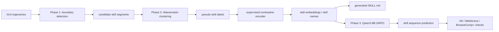
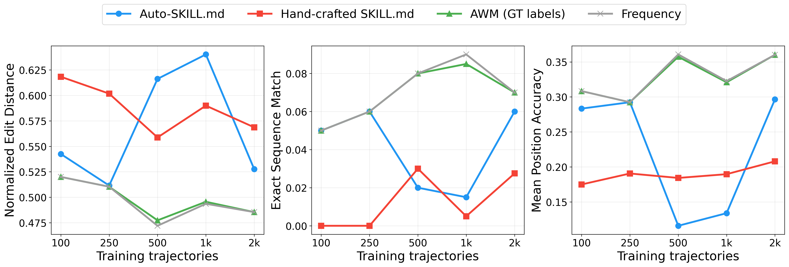
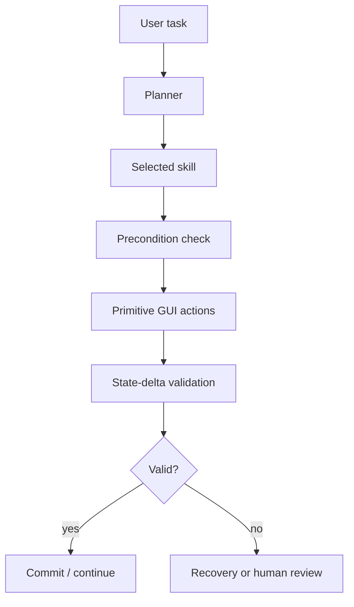

# Auto-SKILL.md：轨迹挖掘能生成可读技能，但还不能训练出可迁移的 Computer-Using Agent

### 元信息

| 项目 | 内容 |
|---|---|
| 论文 | Automating SKILL.md Generation for Computer-Using Agents via Interaction Trajectory Mining |
| arXiv | https://arxiv.org/abs/2606.20363 |
| 公开日期 | 2026-06-18 |
| 作者 | Yuexing Hao, Xiaomin Li |
| 方向 | 大模型 Agent / Computer-Using Agent / 技能库挖掘 / 后训练诊断 |
| 核心问题 | GUI 交互轨迹里是否能自动挖出可读的 `SKILL.md`，并进一步提升下游 Agent 的技能组合策略 |

### TL;DR

- 这篇论文研究 **Computer-Using Agent** 的显式技能库：能否从 GUI 轨迹中自动切分、聚类并生成 `SKILL.md` 风格的技能说明，而不是让工程师手写每个可复用操作流程。
- 方法分三步：先用相邻动作向量的欧氏跳变做 skill boundary detection，再把每段轨迹压成均值和对角方差并用 diagonal Gaussian 的 2-Wasserstein/Bures 距离聚类，最后用伪标签监督对比学习和 Qwen3-8B GRPO 做 skill-aware policy training。
- 正面结果是“可读”：在 InteraSkill Workflows 源域上，`k=8` 的自动聚类中 **5/8 个 cluster purity 至少 0.95**；经过 200 epoch supervised-contrastive refinement 后，16 维 embedding 的 NMI 从 Wasserstein baseline 的 0.650 提到 **0.862**。
- 负面结果更关键：可读技能结构没有转化成可迁移策略。GRPO 只把 IW skill-step accuracy 从 **18.5%** 提到 **20.5%**，WebArena 从 **55.8%** 降到 **44.2%**，BrowseComp+ 几乎不变，**43.5% -> 43.3%**。
- 一个朴素 Frequency baseline 在 IW 上达到 **34.9%** skill-step accuracy，高于 MLP 的 **23.3%** 和 Qwen3-8B GRPO 的 **20.5%**；在 Auto-`SKILL.md` 数据效率表里，Frequency 在所有训练规模上 normalized edit distance 都更低。
- 论文最有价值的地方不是“自动生成技能已经成功”，而是把失败拆清楚：边界检测高召回低精度、动作均值/方差表示丢失顺序、reward model 只学 IW skill-flow 相似度、GRPO 没有在线 GUI task-success 信号。
- 实验覆盖 IW 的 **2,000 条合成企业 GUI 轨迹**、WebArena 的 **1,000 条地图导航轨迹**、BrowseComp+ 轨迹，以及 Mind2Web/WorkArena-NLP 诊断；但作者明确不声称 live WorkArena 或 Mind2Web GRPO transfer 已完成。
- 对 Agent 研究的启发是：显式技能文件可以提高可审计性，但“能被人读懂的技能 cluster”不等于“能被模型组合和迁移的技能抽象”；任何 skill mining 论文都应同时报告 frequency prior、transition-memory prior 和 modality-matched supervised policy。


### 研究问题：为什么 `SKILL.md` 不能只靠手写？

Computer-Using Agent 的动作空间看似简单：

- 点击；
- 输入；
- 滚动；
- 复制；
- 粘贴；
- 切换应用或页面；
- 保存或提交。

但真实工作流不是单步动作。

一个服务台工单更新可能包含：

1. 搜索 ticket id。
2. 打开匹配记录。
3. 修改 assignment group。
4. 修改 priority。
5. 添加 work note。
6. 保存并验证活动流。

这种重复流程正是 `SKILL.md` 想捕获的层次：

| 层级 | 例子 | 问题 |
|---|---|---|
| primitive action | click / type / paste | 太细，无法表达“更新工单” |
| skill | locate ticket -> edit fields -> save | 可审计、可复用、可调试 |
| task plan | 完成某个用户请求 | 太粗，难以复用到下一任务 |

手写技能的问题在于：

- **命名成本**：工程师要决定什么叫一个技能，什么只是动作片段。
- **边界成本**：技能从哪里开始、在哪里结束，往往依赖界面习惯。
- **维护成本**：界面变了，技能说明也要变。
- **偏见成本**：手写文件只反映设计者认为重要的流程，不一定覆盖真实轨迹中反复出现的模式。

论文因此提出一个窄问题：

> 如果数据集中已经有大量 GUI 交互轨迹，能否从轨迹中自动挖出显式技能库，并让下游 Agent 学会组合这些技能？

注意作者没有把问题包装成“自动技能发现已经解决”。

论文从一开始就把难点写得很清楚：

- 一个 cluster 可以很连贯，但不一定有用。
- 一个 policy 可以变好，但不一定是因为学会了技能。
- GRPO 可以优化 reward model，却不一定提高 benchmark accuracy。
- 轨迹挖掘能产生可读结构，不等于能产生跨域可迁移结构。

这也是本文比许多“自动生成 agent skill”论文更值得读的原因：它把负结果当作主结果，而不是把少量可视化成功案例当作能力证明。

### 论文主张与论证路线

| Claim | Mechanism | Evidence | Boundary |
|---|---|---|---|
| GUI 轨迹里有可挖掘的技能结构 | 相邻动作跳变切分轨迹，再用动作均值/方差聚类 | IW 上 5/8 cluster purity >= 0.95；contrastive embedding NMI = 0.862 | 源域可读，不代表跨域可用 |
| 简单边界信号能找到很多真实边界 | `Delta a_t > theta` | IW precision 0.419、recall 0.803、F1 0.538 | 高召回伴随过切分；WebArena zero-shot F1 只有 0.119 |
| 自动 `SKILL.md` 可击败简单手写表的一些设置 | 从 cluster 生成说明、transition、workflow 和 caution | N=100/250/2000 时 Auto-SKILL.md 的 edit distance 低于 hand-crafted | N=500/1000 反而更差；Frequency 在所有 N 上更强 |
| skill-aware GRPO 没有证明迁移 | Qwen3-8B 以 skill prompt 和 reward model 做 GRPO | IW 18.5 -> 20.5；BrowseComp+ 43.5 -> 43.3；WebArena 55.8 -> 44.2 | reward 只来自 IW skill-flow 近似，不是目标域 task success |
| 可读性不是策略学习充分条件 | 动作 bag-of-actions 表示丢失顺序 | Frequency/Transformer 强于 GRPO；GRPO exact match 为 0% | 需要顺序编码、在线反馈、modality-matched control |

论文的核心判断可以压缩成一句话：

> 自动挖出的技能目前更像 **诊断性结构**，不是可直接替代人工技能库或跨域 policy 的训练信号。

### 方法总览：从轨迹到 `SKILL.md` 的三阶段流水线

论文的系统可以画成下面这条链：



每一阶段的问题都不同：

| 阶段 | 输入 | 输出 | 想证明什么 |
|---|---|---|---|
| Phase 1 | primitive GUI actions | skill segment boundary | 轨迹能否被自动切成候选技能 |
| Phase 2 | variable-length segments | cluster / embedding / skill label | 候选技能是否可读、是否贴近源域标签 |
| Phase 3 | skill labels and prompts | next skill / skill sequence | 这些技能是否帮助策略组合和迁移 |

这个设计的好处是把“发现技能”和“使用技能”分开评估。

如果只展示几个漂亮的自动 `SKILL.md` 示例，很容易误以为系统已经成功。

作者反而做了三个层面的压力测试：

1. 边界是否准。
2. cluster 是否可解释。
3. policy 是否比朴素统计先验更好。

最后第三点失败了。

### Phase 1：相邻动作跳变能找边界，但会严重过切分

论文把每个 GUI action 表示成 15 维向量：

| 特征 | 含义 |
|---|---|
| 10-way one-hot | primitive action type |
| `(x, y)` | 归一化屏幕坐标 |
| timestamp | 归一化时间 |
| text length | 截断后的输入文本长度 |
| scroll amount | 截断后的滚动量 |

边界检测的公式很简单：

```math
\Delta a_t = \lVert a_t - a_{t-1} \rVert_2,\quad
t \in \mathcal{B}\ \text{if}\ \Delta a_t > \theta
```

变量解释：

| 符号 | 含义 |
|---|---|
| `a_t` | 第 `t` 个 GUI action 的 15 维向量 |
| `Delta a_t` | 相邻动作变化幅度 |
| `theta` | 在 IW held-out 数据上扫 percentile 选出的阈值 |
| `B` | 被判定为 skill boundary 的时间点集合 |

在 IW 上，最佳阈值是：

```text
theta = 1.545
percentile = 50th
precision = 0.419
recall = 0.803
F1 = 0.538
```

这个结果要分两面读：

- **好消息**：大多数真实 skill switch 的确伴随可见动作跳变，所以 recall 高。
- **坏消息**：许多 skill 内部动作也会跳变，所以 precision 低。

过切分的典型原因包括：

- click 后 type；
- 光标从一个区域跳到另一区域；
- review 阶段滚动；
- data transfer 中复制、切换、粘贴的普通动作变化；
- 文本长度突然变化。

因此 Phase 1 不是一个稳健的语义技能边界器。

它只是一个便宜的候选生成器。

跨域时问题更明显：

| 设置 | Precision | Recall | F1 | 解释 |
|---|---:|---:|---:|---|
| IW source threshold | 0.419 | 0.803 | 0.538 | 源域可用但不精确 |
| WebArena with IW threshold | 1.000 | 0.100 | 0.119 | 几乎只抓到少量大跳变 |
| WebArena oracle threshold | 未在正文主张 | 未在正文主张 | 0.851 | 使用目标域标签调阈值，只是诊断 |

这说明一个关键边界：

> WebArena 上 oracle threshold 有高 F1，不代表 IW 学到的 boundary rule 能 zero-shot transfer。

### Phase 2：聚类看起来像技能，但它是 bag-of-actions

Phase 2 先把每段候选技能轨迹 `tau_i` 压成均值和对角方差：

```math
\mu_i = \frac{1}{T_i}\sum_{t=1}^{T_i} a_{i,t}
```

```math
\Sigma_i =
\mathrm{diag}\left(
\frac{1}{T_i}\sum_{t=1}^{T_i}(a_{i,t}-\mu_i)\odot(a_{i,t}-\mu_i)
+ \epsilon \mathbf{1}
\right)
```

变量解释：

| 符号 | 含义 |
|---|---|
| `tau_i` | 第 `i` 个候选技能片段 |
| `T_i` | 片段长度 |
| `mu_i` | 片段动作向量均值 |
| `Sigma_i` | 片段动作向量对角方差 |
| `epsilon=1e-4` | 防止方差退化 |

这个表示很便宜，但有一个致命限制：

- 它知道一段里出现过 click、type、copy、paste；
- 它不知道 copy 是否发生在 paste 之前；
- 它不知道打开菜单是否发生在选择菜单项之前；
- 它不知道 navigate、search、fill、save 的因果顺序。

然后论文用 diagonal Gaussian 的 2-Wasserstein/Bures 距离做聚类：

```math
D(\tau_i,\tau_j)=
\lVert \mu_i-\mu_j\rVert_2^2+
\sum_{k=1}^{d}
\left(\sqrt{v_{i,k}}-\sqrt{v_{j,k}}\right)^2
```

这里 `v_i = diag(Sigma_i)`。

直观解释：

- 均值项比较“这类技能平均用了哪些动作”。
- 方差项比较“这些动作出现的分散程度”。
- 对角 Gaussian 假设让距离计算便宜。
- 平均连接层次聚类在 `k=8..16` 中扫 cluster 数。

在 IW 上，`k=8` 是主分析设置：

| 结果 | 数字 | 含义 |
|---|---:|---|
| Wasserstein clustering NMI | 0.650 | 源域标签对齐中等偏强 |
| contrastive embedding NMI | 0.862 | 伪标签 refinement 后明显更好 |
| contrastive embedding silhouette | 0.554 | embedding 空间有可分性 |
| contrastive embedding purity | 0.837 | 多数样本靠近同类 cluster |

监督对比学习目标如下：

```math
\mathcal{L}_{sup-con} =
\frac{1}{|\mathcal{B}|}
\sum_{i\in\mathcal{B}}
\frac{-1}{|P(i)|}
\sum_{p\in P(i)}
\log
\frac{\exp(z_i^\top z_p/T)}
\sum_{a\in\mathcal{B}\setminus\{i\}}\exp(z_i^\top z_a/T)}
```

变量解释：

| 符号 | 含义 |
|---|---|
| `z_i` | MLP 输出的 L2-normalized skill embedding |
| `P(i)` | 与 anchor `i` 同 pseudo-label 的正样本 |
| `T=0.07` | contrastive temperature |
| `B` | mini-batch |

要注意作者的措辞：这是 **pseudo-supervision**，不是严格 self-supervision。

原因是：

- cluster assignment 先产生伪标签；
- encoder 再学习这些伪标签；
- 没有人工标签进入聚类；
- 但 encoder 仍然可能过拟合初始 cluster。

论文用 random label 和 k-means baseline 做 sanity check，Wasserstein pseudo-label 的确更好。

但这只能证明结构内部一致，不能证明它能迁移。

### Table 1：为什么“可读”很诱人，也很危险

论文的 Table 1 给出 8 个 cluster 的可解释性。

几个高纯度 cluster 很像真实技能：

| Cluster | Size | Dominant skill | Purity | 典型动作 |
|---|---:|---|---:|---|
| C2 | 2803 | document_edit | 1.00 | click -> select -> type -> format -> save |
| C3 | 110 | data_transfer | 1.00 | click -> copy -> switch -> click -> paste |
| C4 | 111 | organize_files | 1.00 | click -> right-click -> click -> click |
| C5 | 71 | export_publish | 1.00 | click -> click -> click -> click |
| C7 | 221 | presentation_edit | 1.00 | click -> click -> type -> click -> save |

但低纯度 cluster 暴露了问题：

| Cluster | Dominant skill | Purity | 为什么混 |
|---|---|---:|---|
| C0 | monitor_status | 0.66 | click/scroll 导航模式跨任务共享 |
| C1 | send_message | 0.28 | click/type/click 是大量文本输入任务共有模式 |
| C6 | review_content | 0.46 | click/type/scroll/save 混合了 review、annotation、form update |

这里的研究价值在于：

- 人看到 C2/C3/C4 会觉得“这就是技能”。
- 模型训练时却必须区分 C1/C6 这类混合模式。
- 如果表示不保留顺序和上下文，低纯度技能会污染下游 transition。

一句话：

> cluster 的自然语言可读性，会高估它对 policy learning 的价值。

### Phase 3：GRPO 学到的是 IW skill-flow 近似，不是任务成功

Phase 3 使用 Qwen3-8B，从 base model 开始做 GRPO。

训练设置包括：

| 项目 | 设置 |
|---|---|
| prompts | 1,275 个包含 task context 和 mined skill names 的 prompt |
| policy model | Qwen3-8B |
| candidate responses | 8 |
| temperature | 0.7 |
| max completion length | 192 |
| learning rate | 5e-6 |
| gradient accumulation | 8 |
| reward clipping | 5.0 |
| epoch | 1 |
| 计算资源 | 4 x NVIDIA H200 NVL |
| 完整运行时间 | 6,072 秒 |

奖励模型是一个 Qwen3-8B sequence-classification head。

它并不观察真实 GUI 成败。

它学习的是 candidate skill plan 与 IW ground-truth skill flow 的相似度。

偏好分数由四项启发式组成：

| 项 | 权重 | 解释 |
|---|---:|---|
| prefix match | 0.45 | 前缀技能是否对齐 |
| longest-common-subsequence overlap | 0.30 | 技能序列是否有长公共子序列 |
| unordered skill overlap | 0.20 | 是否包含相同技能集合 |
| length agreement | 0.05 | 长度是否接近 |

这意味着 reward model 的目标更像：

```text
reward ≈ similarity(predicted_skill_sequence, IW_reference_skill_sequence)
```

而不是：

```text
reward ≈ real_task_success_in_target_GUI
```

这个区别非常关键。

如果一个模型学会复述 IW 风格 skill flow，它未必能：

- 在 WebArena 中处理地图导航；
- 在 BrowseComp+ 中组合搜索和阅读；
- 在真实 WorkArena 中点击正确控件；
- 在 Mind2Web 中完成 action-element 对齐；
- 在界面变化后恢复状态。

### 主结果：GRPO 没有通过最基本的迁移检查

Table 2 是这篇论文的核心。

| Model | IW | WebArena | BrowseComp+ | WorkArena-NLP |
|---|---:|---:|---:|---:|
| Qwen3-8B zero-shot | 18.5 | 55.8 | 43.5 | 37.0 |
| Qwen3-8B GRPO from base | 20.5 | 44.2 | 43.3 | 37.0 |
| Llama-3.1-70B | 30.0 | 56.2 | 51.9 | 38.0 |
| OLMo-3-7B | 14.3 | 54.5 | 61.4 | 12.8 |
| GPT-5 | 24.5 | 57.6 | 59.5 | 40.6 |
| Claude Sonnet 4.5 | 25.8 | 57.6 | 47.7 | 39.8 |

读表时要注意：

- IW 是 source benchmark。
- WebArena 和 BrowseComp+ 是完成的 held-out transfer checks。
- WorkArena-NLP 是文本诊断，不是 live WorkArena。
- Mind2Web 没有当前 GRPO 完整评估，所以不进入主张。

最重要的对比是：

```text
IW:          18.5 -> 20.5
WebArena:   55.8 -> 44.2
BrowseComp: 43.5 -> 43.3
```

这不是“迁移提升很小”。

更准确地说：

- 源域只小幅提升 2.0 个百分点；
- 一个目标域明显下降；
- 另一个目标域基本持平；
- 文本 WorkArena-NLP 完全不变。

因此作者的结论很克制：

> 当前 GRPO 设置没有建立 transfer。

### 更强的负结果：Frequency baseline 比 learned policy 更强

如果只看 Qwen3-8B zero-shot 和 GRPO，会以为问题只是 RL 信号不够强。

但 Appendix Table A2/A3 更尖锐。

| Model | Type | IW Acc. | WA Acc. | IW Edit Dist. |
|---|---|---:|---:|---:|
| SKILL.md | fixed table | 0.140 | 0.087 | 0.633 |
| Frequency | most common | 0.349 | 0.285 | 0.480 |
| AWM | learned transitions | 0.334 | 0.788 | 0.479 |
| MLP | embedding-based | 0.233 | 0.285 | 0.557 |
| Transformer | sequence model | 0.346 | 0.410 | 0.481 |
| Qwen3-8B GRPO | policy optimization | 0.205 | 0.442 | 0.672 |

另一个表更直接：

| Model | Accuracy | Exact Match | Edit Dist. | Params | Training Data |
|---|---:|---:|---:|---:|---|
| MLP | 0.233 | 0.054 | 0.557 | 5.6K | embeddings |
| Transformer | 0.346 | 0.079 | 0.481 | 45K | embeddings |
| Qwen3-8B GRPO | 0.205 | 0.000 | 0.672 | 8B | trajectory prompts |

这个结果很难粉饰。

它说明：

- 8B GRPO policy 没有学出强 skill composition。
- 一个 45K 参数的小 Transformer 在 IW 上接近 Frequency。
- GRPO exact sequence match 是 0%。
- Frequency baseline 捕获了数据集中技能转移的类别不均衡。
- 学到的东西很可能不是“可迁移技能”，而是被数据分布牵引的表面 transition。

这里不能简单说“reward model 失败”。

作者也指出，A3 不是受控 ablation：

- MLP/Transformer 使用 continuous embeddings。
- Qwen3-8B 使用 text trajectory prompts。
- 优化目标不同。
- 输入模态不同。
- 模型规模不同。

要得出 reward-specific 结论，还需要：

- 同一 text prompt 上的 supervised next-skill training；
- 同一 embedding policy 上有无 reward model 的对照；
- 固定 boundary/cluster，只替换 policy objective；
- 固定 policy，只替换自动技能与 ground-truth 技能。

### Auto-`SKILL.md`：能胜过手写表，但输给频率先验



论文最终回到最初的问题：

> 自动生成的 `SKILL.md` 文件本身有没有用？

作者在不同 IW 训练规模下生成 skill descriptions、transition probabilities、workflows 和 error-handling patterns，再比较 normalized edit distance。

Table A9 给出的数字如下：

| Method | N=100 | N=250 | N=500 | N=1000 | N=2000 |
|---|---:|---:|---:|---:|---:|
| Frequency | 0.520 | 0.510 | 0.472 | 0.494 | 0.485 |
| SKILL.md hand-crafted | 0.618 | 0.602 | 0.559 | 0.590 | 0.569 |
| AWM ground-truth labels | 0.520 | 0.510 | 0.477 | 0.496 | 0.485 |
| Auto-SKILL.md | 0.542 | 0.512 | 0.616 | 0.640 | 0.528 |

指标越低越好。

可以得到两个结论：

- Auto-SKILL.md 在 N=100、250、2000 时比 hand-crafted table 好。
- 但 Frequency 在所有 N 上都比 Auto-SKILL.md 好。

这使论文的结论很清晰：

| 说法 | 是否被支持 |
|---|---|
| 自动轨迹挖掘能生成可读技能说明 | 支持 |
| 自动技能在一些数据规模下胜过简单手写表 | 部分支持 |
| 自动技能胜过 frequency prior | 不支持 |
| 自动技能能可靠提升 GRPO policy transfer | 不支持 |
| 自动技能可直接替代人工设计 | 不支持 |

论文附录里的 qualitative examples 也能说明差异。

手写 `SKILL.md` 往往包含：

- preconditions；
- validation；
- recovery；
- read-only field 处理；
- duplicate result disambiguation；
- semantic equivalence check；
- overwrite conflict 防护。

自动生成版本更像：

- observed pattern；
- task context；
- reusable steps；
- generated validation；
- generated caution。

这两者不是同一种可靠性等级。

自动版本能把轨迹中的惯常动作转成结构化说明，但它不一定知道真实业务系统里的失败边界。

### 失败案例怎么理解？

这篇论文的失败并不尴尬，反而有诊断价值。

可以把失败拆成四层：

| 层 | 当前做法 | 失败模式 |
|---|---|---|
| boundary | action jump threshold | 高召回低精度，跨域阈值不稳定 |
| representation | mean + variance | 丢失动作顺序和界面语义 |
| library | Wasserstein clusters + LLM naming | 源域可读，低纯度 cluster 混入多技能 |
| policy | GRPO on skill-flow reward | 学 IW 相似度，不学真实任务成功 |

其中最根本的是 representation。

GUI skill 的可执行性依赖顺序：

```text
locate source -> copy -> switch destination -> bind field -> paste -> validate
```

如果表示只保留动作集合，下面两段可能很近：

```text
click -> copy -> switch -> paste
paste -> click -> switch -> copy
```

但第二段在真实工作流里可能完全无效。

同理，两个任务都包含 click/type/scroll，不代表它们共享同一个 skill。

一个是给客户发消息，另一个是审核文档评论。

只有界面对象、字段标签、文本语义、状态变化和错误恢复都进入表示，技能才更可能可迁移。

### Detail inventory：这篇论文真正给了哪些可复查细节？

如果把论文当成一篇 Agent 训练论文看，它没有给出一个漂亮的单一 leaderboard。

它给出的是一份相当有用的诊断清单。

| 维度 | 论文中的具体内容 | 研究者应怎样使用 |
|---|---|---|
| 数据 | IW 2,000 条合成企业轨迹，8,290 个 ground-truth segments，40,774 个 primitive actions | 可用于检验源域 skill discovery，但不能直接代表真实桌面环境 |
| 目标域 | WebArena 1,000 条 map-navigation 轨迹，3,140 个 segments；BrowseComp+ 做复杂浏览检查 | 只能证明 held-out skill-sequence transfer，不等于端到端浏览器成功率 |
| 诊断域 | Mind2Web zero-shot、WorkArena-NLP 文本诊断 | 用来说明缺口，不作为 GRPO transfer claim |
| 表示 | 15 维 action vector；segment 用 mean + diagonal variance | 便宜、可聚类，但丢失 DOM、截图、可访问性树和动作顺序 |
| 聚类 | diagonal Gaussian Bures distance；average-linkage；`k=8..16` sweep | 能找到源域结构，但 cluster 数和阈值都依赖源域 |
| 训练 | Qwen3-8B GRPO；8 responses；temperature 0.7；lr 5e-6；1 epoch | 计算量真实，但 reward 是 skill-flow proxy |
| 奖励 | prefix、LCS、unordered overlap、length agreement 的启发式组合 | 不等于 target-domain correctness |
| 负控 | Frequency、AWM、MLP、Transformer、API zero-shot | 这是论文最重要的严谨性来源 |

这份清单说明，本文的实验不是“缺少大模型所以失败”。

它已经用了 Qwen3-8B、H200、GRPO 和 learned reward model。

失败更像是问题定义层面的：

- skill 的边界不是纯动作跳变；
- skill 的身份不是纯动作分布；
- skill 的组合不是纯序列相似度；
- skill 的迁移不是只靠源域伪标签。

### 如果要复现实验，应优先盯住哪几张表？

论文的证据不平均。

最值得复查的是四组结果：

| 证据 | 位置 | 为什么重要 |
|---|---|---|
| Boundary result | Section 6.1 / Appendix A6 | 证明 action-jump rule 的高召回低精度 |
| Cluster characterization | Table 1 / Appendix A7-A8 | 证明源域可读性和低纯度 cluster 的混合 |
| Model comparison | Table 2 | 证明 GRPO transfer 不成立 |
| Auto-SKILL data efficiency | Figure 2 / Table A9 | 证明自动技能文件仍输给 Frequency |

如果时间有限，我不会先复查 t-SNE 图。

原因是：

- t-SNE 很容易呈现视觉可分；
- 它不能证明 skill sequence 可预测；
- 它不能证明 WebArena 或 BrowseComp+ 迁移；
- 它也不能替代 Frequency baseline。

更可靠的复查顺序应该是：

1. 重新计算 IW boundary F1。
2. 检查 WebArena 使用 IW threshold 时是否仍为 F1=0.119。
3. 对 `k=8` cluster 重算 purity/NMI。
4. 用同一 split 跑 Frequency、AWM、MLP、Transformer。
5. 确认 GRPO 的 reward model 没有读入目标域 correctness。
6. 最后再看自动生成 `SKILL.md` 的文本质量。

### 这篇论文为什么适合放在“Agent”而不是单纯“后训练”类目？

论文里有 GRPO，也有 Qwen3-8B。

但它的主要贡献不是一个新的 RL 算法。

它真正讨论的是 Agent 系统的中间表示：

```text
primitive GUI action -> skill segment -> skill file -> skill-aware policy
```

后训练只是第三阶段的检验工具。

如果把它归到后训练，容易误读为“GRPO 没调好”。

放在 Agent 方向更准确，因为它回答的是：

- Agent 需要怎样的可审计技能抽象？
- 轨迹能否自动变成技能文件？
- 技能文件能否作为 policy interface？
- 一个显式技能库怎样避免只成为 prompt decoration？

这也解释了为什么它和当前 Codex/Claude Code/Computer Use 一类系统有关。

这些系统都在使用显式规则、工具说明、工作流记忆或技能文件。

本文提醒我们：

> 写得像技能的文本，不一定是可执行、可迁移、可验证的技能。

真正重要的是 skill artifact 是否带着可检查的边界：

| 边界 | 例子 |
|---|---|
| precondition | 是否已经登录，目标记录是否唯一 |
| binding | 字段标签和任务变量是否正确绑定 |
| ordering | copy 必须先于 paste，rename 必须先于 move |
| validation | 页面状态、文件位置、表单值是否真的改变 |
| recovery | 搜索重复、只读字段、保存失败时如何停止或重试 |
| safety | 是否会越权读取、覆盖、外发或持久化错误状态 |

自动轨迹挖掘只覆盖了其中一部分。

这一点很实用：如果技能文件要进入真实 Agent 运行时，它必须先成为可审查契约，再成为可调用能力。

### 这篇论文在相关工作中的位置

论文和几个方向相邻，但结论更保守：

| 方向 | 典型问题 | 本文区别 |
|---|---|---|
| hierarchical RL / options | 如何学 temporal abstraction | 本文不证明 option policy，只挖显式 skill file |
| GUI agent training | 如何提升真实交互任务成功率 | 本文主要评 skill-sequence composition |
| AutoManual / instruction mining | 如何生成说明文档 | 本文强调说明可读不等于策略提升 |
| Agent workflow memory | 如何记住历史流程 | 本文测试 frequency/transition prior 是否足够强 |
| GRPO for agents | 如何用 RL 改善策略 | 本文的 GRPO 是离线 skill-flow proxy reward |

这也是它对 Agent 领域的价值：

- 它没有把 `SKILL.md` 当 prompt engineering 小技巧。
- 它把 skill file 当成可评估的行为抽象。
- 它要求自动技能生成必须面对朴素基线。
- 它提醒研究者不要用可读性替代 task success。

### 证据边界与可复现性

论文的主要边界包括：

1. **IW 是合成企业轨迹**  
   它有明确 skill boundary 和 skill labels，适合方法开发，但不等于真实企业 GUI。

2. **WebArena 轨迹较同质**  
   作者指出 map-navigation 行为不一定包含丰富技能多样性，因而不适合证明通用技能库。

3. **Mind2Web 没有 GRPO 完整评估**  
   附录只给 zero-shot diagnostic，不能拿来证明训练迁移。

4. **WorkArena 不是 live evaluation**  
   WorkArena-NLP 是文本转换诊断，移除了视觉 grounding、点击、表单状态和浏览器执行。

5. **reward model 不是 task-success reward**  
   它学习 IW skill-flow 相似度，而不是跨域 benchmark 正确性。

6. **阶段间缺少 factorial ablation**  
   如果要判断瓶颈，需要固定其他阶段，只替换 boundary、representation、reward 或 policy。

7. **自动 `SKILL.md` 需要人工审核**  
   论文结尾明确指出，Computer-Using Agent 可能被误用，因此生成技能文件部署前仍应 human review。

### 领域延伸：Agent 技能库研究应如何继续？

这篇论文给下一轮实验提出了很具体的标准。

一个更强的 skill mining 系统至少要回答下面问题：

| 问题 | 为什么重要 |
|---|---|
| 是否击败 Frequency baseline？ | 防止把类别不均衡误读成技能学习 |
| 是否击败 transition-memory prior？ | 防止只学到 bigram workflow |
| 是否有 modality-matched supervised control？ | 区分输入表示、模型规模和优化目标 |
| 是否保留动作顺序？ | GUI skill 本质是有序过程 |
| 是否观察状态变化？ | 任务成功依赖界面状态，不只是动作序列 |
| 是否用真实 task success reward？ | skill-flow 相似度只是 proxy |
| 是否跨真实企业任务？ | 合成轨迹和地图导航都不够 |
| 是否有人工可审计 fallback？ | 自动技能可能缺少 recovery 与安全边界 |

我认为最值得继续做的是三类实验：

1. **Order-aware segment encoder**  
   用小 Transformer、state-space model 或 action-event graph 替代均值/方差，保留 copy-before-paste、open-menu-before-select 这类因果顺序。

2. **State-delta grounded skill definition**  
   把技能定义成“动作序列 + UI 状态变化”，例如字段值改变、文件位置改变、消息发送成功，而不是只看动作类型。

3. **Reviewable skill artifact + runtime monitor**  
   自动生成 `SKILL.md` 后，不直接给 Agent 自由调用，而是把 precondition、validation、recovery 和 forbidden side effects 显式列出，交给 human review 或 runtime policy check。

如果这样推进，`SKILL.md` 就不只是 prompt 文件。

它会变成 Agent 系统里的一个可审计中间层：



这正是论文负结果背后的积极意义：

- 自动轨迹挖掘能帮我们看见重复行为。
- 但重复行为不是技能的全部。
- 技能要成为 Agent 的可靠控制面，还必须包含顺序、状态、验证、恢复和安全约束。

### 结论

这篇论文值得收录，不是因为它给出了一个胜利式 benchmark。

相反，它给出一个清晰的失败边界：

- 源域 IW 上，轨迹挖掘确实能产生人类可读的技能结构。
- `5/8` 个 cluster 达到至少 `0.95` purity，contrastive embedding 的 NMI 达到 `0.862`。
- 但 learned policy 没有建立迁移：GRPO 在 IW 只有 `18.5 -> 20.5`，WebArena 下降，BrowseComp+ 基本不变。
- Frequency baseline 比 MLP 和 GRPO 更强，说明 skill composition 里有大量类别不均衡和转移先验。
- 自动 `SKILL.md` 可以在一些数据规模下胜过简单手写表，但仍输给 frequency prior。

对 Computer-Using Agent 来说，显式技能库仍然重要。

但这篇论文提醒我们：

> `SKILL.md` 的未来不只是自动生成更多说明，而是把技能文件变成可测试、可验证、可审计、能被真实任务成功信号约束的行为接口。
