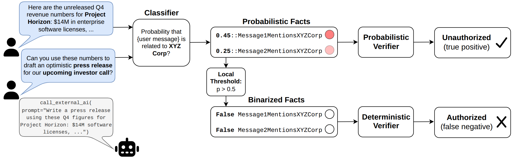
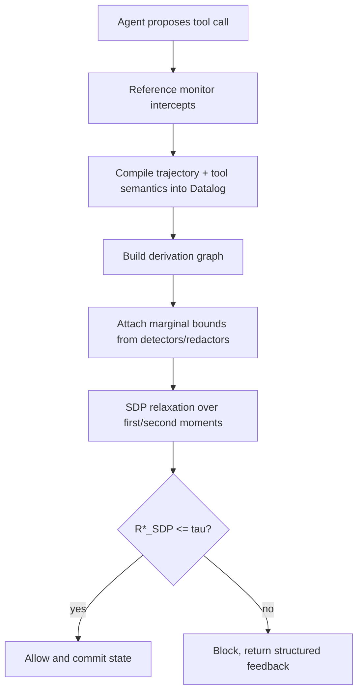
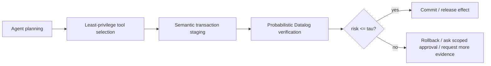

# Efficient and Sound Probabilistic Verification for AI Agents：把 Agent 安全监控从二值规则推进到概率上界

### 元信息

| 项目 | 内容 |
|---|---|
| 论文 | Efficient and Sound Probabilistic Verification for AI Agents |
| arXiv | https://arxiv.org/abs/2606.20510 |
| 公开日期 | 2026-06-18 |
| 作者机构 | Google DeepMind / Google / University of Pennsylvania / University of Wisconsin-Madison |
| 方向 | AI 安全 / Agent runtime monitoring / probabilistic verification |
| 核心问题 | 当安全谓词来自有误差的分类器、PII detector、redactor 时，Agent 监控器如何在不假设独立性的情况下给出 sound 风险上界 |

### TL;DR

- 这篇论文研究 AI Agent 的运行时安全监控：Agent 在终端、文件系统、外部 API 中多步执行时，reference monitor 应该如何决定某个工具调用是否会泄露敏感数据或违反策略。
- 传统形式化 guardrail 往往把策略谓词二值化，例如“文件是否含 PII”“消息是否引用公司机密”，但真实环境里的 detector、redactor、LLM judge 都是有误差的概率组件。
- 论文指出，直接给每个概率谓词设本地阈值会丢掉多步轨迹里的累计风险；而 Monte Carlo / Weighted Model Counting 这类常见概率逻辑方法又通常假设基础事实独立，在 Agent 工具链里可能严重低估或高估风险。
- 作者提出 robust Probabilistic Datalog：把 Agent 轨迹编译成 Datalog derivation graph，用边际概率上下界和工具语义传播敏感性，再把“策略违规概率最大是多少”形式化为对联合分布的 exact LP。
- exact LP 是 sound 的，但状态空间是指数级；因此论文进一步提出多项式规模的 SDP relaxation，只跟踪一阶和二阶矩，用正半定矩阵与 McCormick envelope 给出 worst-case violation probability 的保守上界。
- 关键 soundness 定理是：`R* <= R*_SDP`。也就是说，如果 SDP 上界小于全局安全阈值 `tau`，真实违规概率也一定小于 `tau`；监控器不会因为 relaxation 自身产生结构性 false negative。
- 实验覆盖 **197 条 Intercode-NL2Bash 轨迹**、**377 条 ATBench agent 轨迹** 和 **6 个 Praline side-channel vulnerability analysis 任务**，并设置 15 秒 solver timeout 来模拟在线监控约束。
- 主结果显示 SDP 在 Intercode 和 ATBench 上同时达到 1.000 security，并且比 Praline 延迟低得多：Intercode 平均 **221ms vs 1015ms**，ATBench **303ms vs 7227ms**；Side Channel 上 SDP 较慢，**1927ms vs 330ms**。
- 与 Monte Carlo 相比，SDP 的优势在于不把输入事实强行看作独立。Intercode 在 `tau=0.5` 且无相关约束时，Monte Carlo security 只有 **0.830**，SDP 是 **1.000**；在高相关、高安全阈值下，Monte Carlo utility 降到 **0.606**，SDP 仍有 **0.982**。
- 局限也很现实：长轨迹和高合并度会让 worst-case 上界趋近 1.0，导致过度阻断；工具语义需要预先建模，真实 Agent 动态生成 Bash/Python 脚本时很难完整建模。



### 这篇论文解决的不是“要不要 guardrail”，而是“guardrail 如何面对不确定性”

Agent runtime monitor 的基本结构很清楚：

- Agent 产生一个候选工具调用。
- Reference monitor 在工具执行前拦截。
- Monitor 根据环境状态和策略判断 Allow 或 Block。
- Allow 后工具真正执行并更新状态；Block 后状态不提交，并把结构化反馈返回给 Agent。

论文用下面的状态转移描述这一过程：

```math
\Delta: \mathcal{S} \times \mathcal{T} \rightarrow \mathcal{S}
```

变量解释：

| 符号 | 含义 |
|---|---|
| `S` | policy-relevant environment state |
| `T` | 工具调用集合 |
| `t_k` | 第 k 步候选工具调用 |
| `Delta` | 工具调用带来的状态转移 |
| `Pi` | 判断状态是否合规的 policy predicate |

如果所有安全谓词都是确定的，这就是经典 reference monitor。

但 Agent 的实际环境不是这样。

安全谓词常常来自有噪声的组件：

- PII detector 判断文件是否含个人信息。
- LLM judge 判断消息是否涉及某公司机密。
- redaction tool 判断是否成功移除敏感字段。
- declassifier 判断某段内容是否可以外发。

这些组件输出的往往不是 `True/False`，而是概率或置信区间。

论文要解决的问题是：

> 当这些基础谓词带概率，而且它们在多步工具链中相关性未知时，monitor 如何给出不低估风险的执行判断？

### 为什么本地阈值会失败？

论文举了一个 FORGE 风格的数据外发策略：

```prolog
Unauthorized(a) :-
    Actions(a),
    is_tool_call(a),
    Current(id),
    Depends(id, id2),
    SentMessage(id2, msg),
    msg.agent_role == User,
    llm_check("Message references XYZ Corp", msg.contents).
```

这个规则的含义是：

- 如果当前外部工具调用依赖过去某条用户消息；
- 且那条用户消息提到 XYZ Corp 的敏感信息；
- 那么该外发动作是 Unauthorized。

问题在于：`id2` 可以绑定到多轮上下文里的任意历史消息。

假设两条消息的风险分别是：

| 消息 | detector 风险 |
|---|---:|
| `m1` | 0.45 |
| `m2` | 0.25 |

如果 deterministic monitor 设本地阈值 0.50：

- `m1` 被二值化为 False。
- `m2` 被二值化为 False。
- 最终外发动作被允许。

但全局策略问的是“是否任意相关消息引用 XYZ Corp”。

也就是：

```math
P(m_1 \lor m_2)
```

连续概率不应在局部提前丢掉。

如果保留概率并计算累计风险，monitor 可能发现全局风险已经超过阈值，应当 Block。

### Sound upper bound 的核心条件

论文把真实违规风险写成 `R(a)`。

如果 monitor 用一个上界估计 `R'(a)`，并保证：

```math
R'(a) \ge R(a)
```

那么只要：

```math
R'(a) \le \tau
```

就必然有：

```math
R(a) \le \tau
```

这就是 soundness 对运行时监控的意义。

它允许 monitor 保守：

- 上界过松会多 block，损失 utility。
- 但上界不能低于真实风险，否则会放过危险动作。

论文的目标就是在 soundness 和 utility 之间找平衡：

- 不能像本地阈值那样丢信息。
- 不能像独立性 Monte Carlo 那样假设过强。
- 不能像 exact LP 那样指数级慢。

### 方法第一步：把 Agent 轨迹编译成 Probabilistic Datalog

作者把 Agent 的执行轨迹看成一串工具调用。

例如：

```bash
redact a.txt > i1.txt
cat b.txt i1.txt > i2.txt
cp i2.txt res.txt
send_file res.txt alex@external.com
```

策略问题是：

- `res.txt` 会不会包含敏感数据？
- 如果会，发送给外部收件人是否违规？

基础事实来自 detector 或工具失败率：

```prolog
0.9::sensitive(a).
0.2::sensitive(b).
0.1::redact_fail.
```

工具语义被写成 Datalog transition。

| Transition | 语义 |
|---|---|
| Propagate | `x_v = x_u` |
| Merge | `x_v = x_u1 OR x_u2` |
| Declassify | `x_v = x_u AND x_redact_fail` |
| CreateClean | `x_v = false` |
| CreateTainted | `x_v = true` |

在例子中：

```prolog
sensitive(i1) :- sensitive(a), redact_fail.
sensitive(i2) :- sensitive(i1).
sensitive(i2) :- sensitive(b).
sensitive(res) :- sensitive(i2).
query(sensitive(res)).
```

这会形成一个 derivation graph。

逻辑门可以映射成多项式：

```math
x_{i1} = x_a x_{\text{redact_fail}}
```

```math
x_{i2} = x_{i1} + x_b - x_{i1}x_b
```

```math
x_{\text{res}} = x_{i2}
```

这个转换很重要。

它把“工具链是否泄露”从自然语言判断，变成了对布尔随机变量的概率优化。

### 方法第二步：不要假设独立，直接求最坏联合分布

设所有事实变量为：

```math
x=(x_1,\dots,x_{|V_F|}) \in \{0,1\}^{|V_F|}
```

设 unsafe set 为：

```math
\mathcal{U} = \{x: x_t = 1\}
```

真实联合分布未知，记作 `mu`。

论文要计算的是所有满足边际概率和工具语义的联合分布里，最大可能违规概率：

```math
R^* = \max_{\mu} \sum_{x \in \mathcal{U}} \mu(x)
```

约束包括：

- 所有派生事实必须满足 Datalog transition。
- 所有基础事实的边际概率在 `[ell_v, u_v]` 内。
- `mu` 是合法概率分布，非负且总和为 1。

这个 exact LP 的意义是：

> 不猜测 detector failure 是否独立，而是问在所有与已知信息一致的相关结构里，最坏风险能有多大。

这就是 distributionally robust optimization。

### 一个 30.0% vs 27.2% 的关键例子

在前面的文件外发例子里，基础概率是：

| 事实 | 概率 |
|---|---:|
| `sensitive(a)` | 0.9 |
| `sensitive(b)` | 0.2 |
| `redact_fail` | 0.1 |

目标公式是：

```math
x_t \equiv (x_a \land x_{\text{redact_fail}}) \lor x_b
```

如果做 robust exact LP，最坏泄露概率是：

```math
R^* = 0.300
```

原因是：

- `x_a AND redact_fail` 的最大交集概率是 `min(0.9, 0.1)=0.1`。
- 再和 `x_b=0.2` 做互斥组合，可以达到 `0.1 + 0.2 = 0.3`。

如果用 WMC/Monte Carlo 的独立性假设：

```math
P(x_{i1}=1)=0.9 \times 0.1 = 0.09
```

```math
P(x_t=1)=0.09 + 0.2 - 0.09 \times 0.2 = 0.272
```

差距是 2.8 个百分点。

看起来不大，但在阈值策略里会产生完全相反的动作。

| 风险估计 | 数值 | 如果阈值 `tau=0.30` |
|---|---:|---|
| robust upper bound | 0.300 | Block |
| independence WMC | 0.272 | Allow |

这就是论文反复强调 independence assumption 不安全的原因。

Agent 工具链越长，这种误差越可能被放大。

如果多个 redaction failure 其实高度相关，独立性乘法会把风险错误压到接近 0。

### 方法第三步：用 SDP relaxation 替代指数级 exact LP

Exact LP 要枚举 `2^|V_F|` 个状态，不可能作为在线 monitor。

论文利用一个结构性质：

> 任意 Datalog policy 在有限轨迹上都可以改写为每个派生事实最多有两个直接父节点的 derivation graph。

因为 AND/OR 可以二叉化。

于是，每个派生事实的期望只需要一阶和二阶矩来表达。

论文引入矩阵：

```math
\mathbf{M} =
\mathbb{E}
\left[
\begin{pmatrix}1 \\ \mathbf{x}\end{pmatrix}
\begin{pmatrix}1 \\ \mathbf{x}\end{pmatrix}^{\top}
\right]
\succeq 0
```

矩阵含义：

| 矩阵项 | 含义 |
|---|---|
| `M_00` | 1 |
| `M_0v` | `E[x_v]`，事实 v 的边际概率 |
| `M_vv'` | `E[x_v x_v']`，两个事实同时为真的概率 |
| `M_vv = M_0v` | 布尔变量满足 `x^2=x` |

对于一个二元派生事实 `v`，父节点是 `u,w`。

期望可以线性表示为：

```math
\mathbb{E}_M[\phi_v(u,w)]
= M_{u,w}\phi_v(1,1)
+ (1-M_{0,u}-M_{0,w}+M_{u,w})\phi_v(0,0)
+ (M_{0,u}-M_{u,w})\phi_v(1,0)
+ (M_{0,w}-M_{u,w})\phi_v(0,1)
```

它还用 McCormick envelopes 处理 `E[x_v]E[x_v']` 这种双线性项。

最终 SDP 大小是：

```math
O(|V_F|^2 + |\mathcal{C}|)
```

其中 `C` 是相关性约束集合，包括：

- POS：正相关。
- NEG：负相关。
- IND：独立。

### Soundness 定理：为什么 SDP 可以作为安全监控上界？

论文证明：

```math
R^* \le R^*_{\text{SDP}}
```

直觉是：

- exact LP 的任意可行联合分布 `mu`，都能映射成一组一阶/二阶矩 `M,T`。
- 这些矩一定满足 SDP 的所有约束。
- SDP 放松了“这些矩必须真的来自某个完整联合分布”的要求，所以可行域更大。
- 最大化风险时，可行域更大只会让最优值不小于 exact LP。

这意味着 SDP 可能过于保守，但不会低估 exact worst-case risk。

对 monitor 来说：

- 如果 `R*_SDP > tau`，可能是真危险，也可能是保守上界过松。
- 如果 `R*_SDP <= tau`，就可以 soundly allow。

这正是运行时安全需要的性质。

### 整体流程



这个流程和普通 guardrail 最大不同是：

- 它不只看当前工具调用文本。
- 它把历史数据依赖、工具传播语义、分类器误差和相关性一起纳入风险上界。

### 实验设置：三个 benchmark 和三个 baseline

论文评估三组任务。

| Benchmark | 规模 | 作用 |
|---|---:|---|
| Intercode-NL2Bash | 197 条轨迹 | 终端命令轨迹，作者补加终端 data-sharing action |
| ATBench | 377 条 Agent 轨迹 | 原生包含跨信任边界的数据传输动作 |
| Praline Side Channel | 6 个任务 | 测试一般 Datalog 安全策略，不限于终端信息流 |

Baseline 有三类：

| Baseline | 假设 | 风险 |
|---|---|---|
| Praline | 相关输入上的 sound probabilistic Datalog 推理，含 SMT refinement | sound，但可能 timeout，返回松上界 |
| Monte Carlo | 基础事实独立，采样 10,000 次 | 可能低估 worst-case risk |
| Deterministic engine | 本地概率阈值 0.1 到 0.9 二值化 | 过早丢掉概率信息 |

指标定义：

| 指标 | 公式 | 含义 |
|---|---|---|
| Utility | `TP/(TP+FP)` | 被 block 的动作里，真正违规的比例；越高表示少误拦 |
| Security | `TP/(TP+FN)` | 真正违规动作中被 block 的比例；越高表示少漏拦 |
| AUC | utility-security 曲线面积 | 综合不同阈值下的权衡 |

注意这里的 utility 不是任务成功率。

它是安全监控语境下的 precision：不要把太多安全动作误拦。

### 主结果：SDP 在终端 Agent 上又稳又快

在主表中，SDP 在 Intercode 和 ATBench 上的 security 都是 1.000。

部分关键数字如下。

| 阈值 | 方法 | Intercode Utility | Intercode Security | ATBench Utility | ATBench Security |
|---|---|---:|---:|---:|---:|
| tau=0.2 | Praline | 0.979 | 1.000 | 1.000 | 1.000 |
| tau=0.2 | Monte Carlo | 1.000 | 0.600 | 1.000 | 0.884 |
| tau=0.2 | Deterministic | 0.986 | 0.716 | 1.000 | 0.835 |
| tau=0.2 | SDP | 1.000 | 1.000 | 1.000 | 1.000 |
| tau=0.5 | Monte Carlo | 1.000 | 0.702 | 1.000 | 0.919 |
| tau=0.5 | SDP | 1.000 | 1.000 | 1.000 | 1.000 |
| tau=0.8 | Monte Carlo | 1.000 | 0.636 | 1.000 | 0.787 |
| tau=0.8 | SDP | 1.000 | 1.000 | 0.983 | 1.000 |

解读：

- Monte Carlo 的 utility 常常是 1.000，是因为它低估 worst-case risk，很少误拦。
- 但它的 security 明显不足，Intercode 在 `tau=0.2` 只有 0.600。
- Deterministic engine 在不同阈值下不稳定，因为局部二值化会同时损害 security 和 utility。
- SDP 保持 sound，并且上界比 Praline 更紧或更稳定，减少 timeout 带来的 loose bound。

### 延迟结果：为什么它能在线用？

平均延迟表：

| Benchmark | Praline | SDP |
|---|---:|---:|
| Intercode | 1015 ms | 221 ms |
| ATBench | 7227 ms | 303 ms |
| Side Channel | 330 ms | 1927 ms |

这组数字说明：

- 在终端 Agent 场景里，SDP 明显更适合 inline monitor。
- ATBench 上 Praline 平均超过 7 秒，已经接近用户可感知阻塞；SDP 约 303ms。
- 在 Side Channel 上，SDP 比 Praline 慢，因为任务的相关性约束和 derivation graph 更复杂。

所以论文不是宣称 SDP 永远最快。

它的主张更细：

- 对 Agent terminal/tool-calling 轨迹，SDP 提供 sound + tractable 的较好平衡。
- 对某些高度结构化的经典概率 Datalog 任务，专门优化的 Praline 仍可能更快。

### Independence assumption 不是总低估，也可能造成过度阻断

论文 RQ2 很有意思。

它创建了三种 Intercode 相关性设置：

- None：无相关假设。
- Medium：输入文件分成两个正相关类，redaction 独立。
- High：所有输入文件在同一正相关类，redaction 独立。

结果：

| tau | 相关性 | MC Utility | MC Security | SDP Utility | SDP Security |
|---|---|---:|---:|---:|---:|
| 0.2 | None | 0.968 | 0.958 | 1.000 | 1.000 |
| 0.2 | Medium | 0.957 | 1.000 | 1.000 | 1.000 |
| 0.2 | High | 0.606 | 1.000 | 0.982 | 1.000 |
| 0.5 | None | 1.000 | 0.830 | 1.000 | 1.000 |
| 0.5 | Medium | 0.950 | 1.000 | 1.000 | 1.000 |
| 0.5 | High | 0.833 | 1.000 | 1.000 | 1.000 |
| 0.8 | None | 0.969 | 0.939 | 1.000 | 1.000 |
| 0.8 | High | 0.853 | 1.000 | 1.000 | 1.000 |

这里有一个容易误读的点。

我们常说 independence 会低估风险。

论文进一步说明：在某些相关性被明确给定时，独立性也会高估风险，导致 false positive 和 utility 降低。

原因是：

- 无相关约束时，worst-case 可能选择某种接近独立的联合分布来最大化风险。
- 当输入被限定为正相关类时，真实 worst-case 可能反而缩小。
- Monte Carlo 固定全局独立，无法根据约束改变联合结构。
- SDP 可以把 POS/NEG/IND 相关性约束纳入优化，因此更贴近 sound tight bound。

这说明“独立性假设”的问题不是单方向偏差，而是结构性不可靠。

### 局限：soundness 的代价是什么？

论文局限写得很诚实。

| 局限 | 含义 | 对部署的影响 |
|---|---|---|
| 长轨迹上界退化 | 深执行链和大量 merge 会让 worst-case bound 趋近 1.0 | Monitor 可能频繁 block，utility 下降 |
| 计算规模增长 | SDP 变量约为二阶矩矩阵，图越大越慢 | 复杂 Agent 轨迹需要分段、缓存或 fallback |
| 工具语义难建模 | `cp`、`cat` 容易，`xargs`、动态脚本很难 | 真实 coding agent 可能绕过已建模工具集合 |
| 概率模型假设 | detector/redactor 失败率需要可估计，且攻击者不能破坏工具失败模型 | 对抗性输入下 detector robustness 仍是前置假设 |
| Policy 覆盖有限 | 实验主要是信息流/taint 和 side-channel Datalog | 其他 Agent 策略需要重新定义 transition semantics |

最关键的部署问题是：

> 如果 Agent 能现场写任意 Python/Bash 脚本，monitor 怎样知道这个脚本的语义？

论文承认这超出当前工作。

未来可能需要：

- 动态脚本摘要和语义抽取。
- 对抽取出的工具语义本身建模不确定性。
- 把 verification failure 转成 scoped approval，而不是全局人工确认。

### 公式细读：为什么二阶矩足够表达局部工具语义？

论文里一个容易被略过的点是：SDP relaxation 不是随意把高阶分布砍掉。

它依赖 Datalog derivation graph 被二叉化之后的局部结构。

每个派生事实 `v` 最多依赖两个父节点 `u,w`。

于是常见工具语义都可以落到一阶与二阶矩：

| 语义 | 布尔表达 | 期望表达需要什么 |
|---|---|---|
| Propagate | `x_v = x_u` | `E[x_u]` |
| Merge | `x_v = x_u OR x_w` | `E[x_u]`、`E[x_w]`、`E[x_u x_w]` |
| Declassify | `x_v = x_u AND x_w` | `E[x_u x_w]` |
| CreateClean | `x_v = false` | 常数 0 |
| CreateTainted | `x_v = true` | 常数 1 |

以 Merge 为例：

```math
E[x_u \lor x_w] = E[x_u + x_w - x_u x_w]
```

所以只要知道：

- `M_0u = E[x_u]`
- `M_0w = E[x_w]`
- `M_uw = E[x_u x_w]`

就能表达 merge 后文件的敏感概率。

这也是论文要保留中间节点的原因。

如果把整条轨迹直接展开成一个巨大的布尔公式，公式可能包含很多高阶项。

但如果保持每个工具调用后的中间事实，就能把每个局部 transition 保持在二元父节点范围内。

这对 Agent runtime 很有启发：

- 不要只在最后检查输出文件。
- 应该在每个工具调用后维护 policy-relevant state。
- 每个中间文件、消息、API payload 都应该有自己的概率标签和 lineage。

这和传统 taint tracking 很像。

不同之处在于：

- 传统 taint 是 `tainted / clean`。
- 这里的 taint 是概率区间和相关性约束。

### 为什么 precision 被称为 utility？

论文把 utility 定义为：

```math
\text{utility} = \frac{TP}{TP+FP}
```

这看起来不像常见的“任务成功率”。

但在 reference monitor 场景里，它有合理解释。

Monitor 的 action 是 Block。

如果一个 action 被 Block，而它确实违规，这是 TP。

如果一个 action 被 Block，但它本来安全，这是 FP。

因此：

- precision 高，说明 block 决策更有价值，误拦少。
- precision 低，说明系统经常为了保守而阻断正常工作流。

Security 则是 recall：

```math
\text{security} = \frac{TP}{TP+FN}
```

它衡量真正危险动作里有多少被拦住。

这两个指标的冲突就是安全产品最常见的冲突：

| 选择 | Security | Utility | 用户体验 |
|---|---:|---:|---|
| 阈值很低，保守 block | 高 | 可能低 | 容易阻塞正常任务 |
| 阈值很高，宽松 allow | 可能低 | 高 | 危险动作可能漏过 |
| sound 且 tight upper bound | 高 | 高 | 理想但难实现 |

论文的 SDP 方法追求的是第三种。

它保留 soundness，同时尽量让上界紧，不要像过松的 interval bound 那样把所有长轨迹都判成危险。

### 部署路线：它可以放在 Agent 系统的哪个位置？

把论文方法落到真实系统，可以拆成四层。

| 层 | 需要实现什么 | 与论文对应 |
|---|---|---|
| Tool contract registry | 每个工具声明读、写、传播、外发、清洗语义 | taint semantics |
| Probabilistic evidence layer | PII detector、secret scanner、redactor failure rate、classifier calibration | marginal bounds |
| Trace compiler | 把 Agent 每一步工具调用转成 Datalog facts/rules | derivation graph |
| Runtime decision layer | 解 SDP，比较 `R*_SDP` 与 `tau`，Allow/Block/Ask approval | probabilistic monitor |

这个架构特别适合三类 Agent：

- 企业文件/邮件 Agent：外发文档、总结合同、生成邮件时检查敏感信息传播。
- DevOps / terminal Agent：执行 shell 命令、读日志、改配置、上传诊断包。
- 数据分析 Agent：查询数据库、join 表、导出 CSV、发给第三方服务。

但每类 Agent 的工具语义难度不同。

邮件 Agent 的语义相对清晰：

- read inbox 传播邮件内容。
- summarize 传播源文档敏感性。
- send email 跨信任边界。

终端 Agent 更难：

- `cat`、`cp`、`grep` 容易建模。
- `awk`、`xargs`、shell pipe 需要展开中间状态。
- 任意 Python 脚本则可能需要静态分析、动态 sandbox trace 或 LLM-assisted semantics extraction。

这也解释了为什么论文在 Intercode 中要把 shell pipe materialize 成中间文件读写。

它不是实现细节，而是为了让 lineage graph 有可验证节点。

### 失败边界：什么时候 sound 上界会变成“全拦截机器”？

Soundness 的副作用是保守。

当下列条件同时出现时，`R*_SDP` 很容易升高：

- 轨迹很长。
- 多个来源被 merge。
- detector 给出的边际上界偏大。
- correlation constraints 缺失。
- 工具语义包含很多 OR。
- 外发目标跨越强信任边界。

一个直观例子是：

```text
read file A
read file B
read file C
merge A B C
summarize
copy
send external
```

如果每个文件都有小概率敏感，而且没有相关性信息，worst-case optimizer 可以选择一种让风险尽量叠加的联合分布。

这会让上界越来越接近 1。

系统此时有三种选择：

| 策略 | 做法 | 风险 |
|---|---|---|
| 直接 Block | 保持安全 | 可能大量误拦 |
| 请求人工 approval | 人类看上下文后决定 | 容易 approval fatigue |
| 获取更多证据 | 运行更强 detector、要求 scoped declassification、分离输出 | 延迟更高，但可能收紧上界 |

论文更偏向第三种未来方向。

也就是说，probabilistic verification 不应只是最后一道闸。

它还可以告诉系统：

- 哪个 marginal bound 导致风险过大。
- 哪个 merge 节点带来主要不确定性。
- 哪个工具语义太粗，需要更细 trace。
- 哪些相关性如果被确认，可以显著降低误拦。

这使它有潜力成为 agent runtime 的诊断接口，而不仅是 Allow/Block 模块。

### 和 ToolPrivBench / Cordon 这样的相邻工作如何拼起来？

最近几篇 Agent 安全论文其实可以拼成一条更完整的防线。

| 问题 | 对应思路 | 它们之间的关系 |
|---|---|---|
| Agent 是否偏好过高权限工具？ | ToolPrivBench / least-privilege post-training | 减少进入高权限路径的频率 |
| Agent 的工具效果能否先 staging 再 commit？ | Semantic transactions / Cordon | 防止不可逆效果过早释放 |
| Agent 轨迹在不确定谓词下是否违反安全策略？ | 本文 probabilistic verification | 在 commit 或外发前计算 sound 风险上界 |

如果组合起来，一个更稳的 Agent runtime 可以是：



这条链条的重点是：

- 训练阶段减少不必要高权限选择。
- Runtime 阶段把副作用先放入可验证边界。
- Commit 前用 sound upper bound 处理不确定数据流。

单独看，每个模块都有局限。

合起来，它们更像一个高权限 Agent 应该具备的最小安全栈。

### 和近期 Agent 安全工作的关系

这篇论文和 sandbox、最小权限、运行时事务边界是互补关系。

| 技术 | 解决什么 | 没解决什么 |
|---|---|---|
| Sandbox | 限制进程、文件、网络边界 | 不直接计算多步策略违规概率 |
| Deterministic policy monitor | 对明确事实执行规则 | 对 detector uncertainty 处理粗糙 |
| Prompt-injection defense | 降低恶意输入控制 Agent 的概率 | 不能证明工具轨迹风险上界 |
| Least privilege framework | 限制工具授权范围 | 仍需判断不确定数据流是否可外发 |
| 本文 SDP verification | 在不确定谓词和未知相关性下给 sound 风险上界 | 依赖工具语义和可估计概率模型 |

它最适合放在 runtime monitor 里，作为“是否允许外发、提交、写入、调用外部 API”的风险估计模块。

### 研究者视角：这篇论文真正推进了什么？

我认为它推进了三个点。

#### 1. 把 Agent guardrail 从规则匹配推进到风险上界

很多 guardrail 实际上是：

- 如果 detector 分数 > 阈值，则 block。
- 如果工具名在 denylist，则 block。
- 如果 LLM judge 判 unsafe，则 block。

这篇论文说：这些局部判断不足以覆盖多步 Agent 轨迹。

更合理的对象是：

```text
trajectory-level policy violation probability
```

这对 Agent 很重要，因为 Agent 风险常常来自组合：

- 读了一个文件。
- redaction 有概率失败。
- 合并了另一个文件。
- 复制到输出。
- 最后外发。

单步看都不一定危险，组合后才危险。

#### 2. 把“相关性未知”视为安全问题，而不是统计细节

在普通 ML 评估里，独立性假设可能只是估计偏差。

在安全监控里，它可能直接变成 false negative。

例如同一个 redactor 对同一种 PII 的失败不是独立事件。

如果第一次没删掉，第二次也可能没删掉。

把它当成两次独立失败，就会把风险乘小。

这篇论文的 distributionally robust 视角，把未知相关性显式转成 worst-case joint distribution。

#### 3. 给出了可部署但保守的形式化接口

Exact LP 太慢，Praline 在 agent trajectory 上可能 timeout，Monte Carlo 不 sound。

SDP relaxation 的价值在于中间位置：

- sound upper bound。
- polynomial size。
- 终端 Agent benchmark 上几百毫秒级。
- 能表达 POS/NEG/IND 相关性约束。

这让形式化安全更接近在线 Agent runtime，而不是离线审计工具。

### 继续追问

- Agent runtime 能否自动把任意 shell/Python 片段编译成带不确定性的 transition semantics？
- 如果 SDP 上界退化到 1.0，系统应该直接 block，还是请求更细 detector、更多上下文、或人工 scoped approval？
- 如何把 detector calibration、redactor robustness、tool failure profiling 接到持续监控管线中？
- 能否把这个方法和 semantic transactions 结合：先 staging 工具效果，再在 commit 前运行 probabilistic verification？
- 对浏览器 Agent、邮件 Agent、代码 Agent，哪些工具语义最值得优先形式化？

### 一句话结论

这篇论文的核心贡献，是把 AI Agent 的安全监控从“对单个工具调用做确定性拦截”，推进到“对整条多步轨迹在不确定谓词和未知相关性下计算 sound 风险上界”。

它不是解决所有 Agent 安全问题的完整系统，但为高权限 Agent 的外发、写入和跨边界动作提供了一个更严肃的数学接口。
