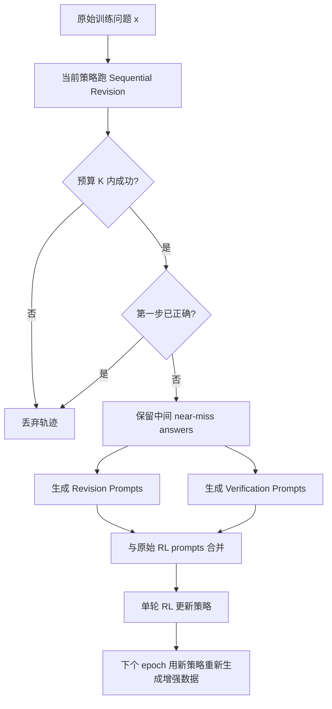

# REVES：把“改错能力”从多轮轨迹奖励拆成单步恢复训练

## 元信息

- 标题：REVES: REvision and VErification-Augmented Training for Test-Time Scaling
- 类型：论文
- 方向：大模型后训练
- 原文：https://arxiv.org/abs/2606.18910v1
- HTML：https://arxiv.org/html/2606.18910v1
- arXiv 时间：2026-06-17T10:37:23Z
- 作者团队：Northwestern University、Amazon AGI、Qualcomm AI Research、University of Minnesota
- 代码入口：论文声明 `https://github.com/yxliu02/REVES.git`，本轮访问 raw README 返回 404，因此正文只把它作为未核验的可复现性线索。

## TL;DR

- REVES 研究的是 **test-time scaling 与 post-training 目标错配**：部署时模型常被反复调用来修订答案，但常规 RLHF/RLVR/GRPO 主要优化单次回答的 reward。
- 作者把 sequential revision 形式化为 TTS-induced decision process，并证明优化单次 `pass@1` 不等于优化多步修订成功率；两个单次表现相同的策略，可能在 revision budget `K >= 2` 下有严格不同的成功概率。
- 方法核心是把“wrong, wrong, correct”这类成功恢复轨迹中的中间错误答案，不当作要模仿的 action，而当作可恢复的 state：训练模型从这些 near-miss state 单步改到正确答案。
- REVES 每个 epoch 分两阶段：先用当前策略跑 sequential revision，只保留预算内成功的轨迹；再把中间状态转成 revision prompts 和 verification prompts，用标准单轮 RL 在增强 prompt 集上训练。
- 理论上，作者用 hazard decomposition 把 `J_SR` 精确拆成访问状态上的单步恢复概率加权和：提升任意已访问状态的 `V_pi(z)`，都会直接提高 sequential revision 目标。
- 实验覆盖 coding、math、circle packing、OOD puzzles 和多种 TTS 策略；LiveCodeBench 上 REVES 比单轮 RL 高 **+6.5 points**，比标准 multi-turn training 高 **+4.0 points**。
- 在 circle packing `n=26` 上，Qwen3-4B-REVES 达到 **2.635983**，匹配 AlphaEvolve V2、ThetaEvolve、TTT-Discover 等更大模型/搜索系统的最优结果。
- 消融显示 revision prompts 主要提升改错能力，verification prompts 主要提升自信度校准；REVES 在 AIME25 上 AUROC **74.1%**，高于 RevisionOnly 的 **72.1%**。
- 局限很明确：REVES 依赖可计算 verifier；对自由问答、创作、偏好学习等没有确定 reward 的任务不能直接迁移，自验证可靠性仍受模型校准影响。

## 1. 研究问题：为什么单轮后训练不匹配测试时推理？

### 1.1 部署时的模型不是只回答一次

论文开头抓住了一个后训练中很容易被忽视的事实：

- 训练时，RLHF/RLVR/GRPO 通常把 prompt 映射到一次 response；
- reward 也主要作用在这一次 response 上；
- 但部署时，复杂任务常使用 test-time scaling；
- 模型会被多次调用，上一轮答案、错误反馈、验证结果会进入下一轮 prompt。

典型流程不是：

```text
x -> y -> reward
```

而是：

```text
x -> y1 -> feedback1 -> y2 -> feedback2 -> ... -> yK
```

REVES 关心的就是第二种场景。作者把它叫作 sequential revision，也就是模型在给定问题、上一轮尝试和反馈后，继续生成修订答案。

### 1.2 错配在哪里？

标准单轮 RL 目标可以写成：

```text
J_OneShot(theta) = E_{x, y ~ pi_theta(.|x)} [ r*(x, y) ]
```

它只问：

- 模型第一次回答是否正确？
- 这次 response 的 reward 是多少？

Sequential revision 目标则是：

```text
J_SR(theta) = E [ r*(x, y_tau) ]
```

其中：

- `tau` 是第一次通过 verifier 的停止时间，或者预算耗尽；
- `y_tau` 是多轮修订后的最终输出；
- 每一步 prompt 都由上一轮答案和反馈组成。

二者的差异不是工程细节，而是训练目标不同：

| 维度 | 单轮 RL | Sequential Revision |
|---|---|---|
| 优化对象 | 初始回答 | 多步修订后的最终回答 |
| 状态分布 | 原始 prompt | 由模型错误和反馈诱导的 prompt |
| credit assignment | 单次 response | 多轮轨迹或单步恢复 |
| 部署形态 | 一次生成 | 反复生成、验证、修订 |

### 1.3 为什么 multi-turn RL 也不够？

自然想法是直接做 multi-turn RL：跑一条多轮轨迹，最后成功就给整条轨迹正奖励。

论文指出这会产生粗糙 credit：

- 轨迹：wrong -> wrong -> correct；
- terminal reward 是正的；
- 多轮轨迹广播会把同一个正 advantage 给前面两个错误中间答案；
- 从优化终局成功看这是合法估计；
- 但从“学会局部改错”看，它把错误 action 和恢复能力混在一起。

REVES 的关键转向是：

> 不把中间错误答案当作要奖励或惩罚的 action，而是把它当作一个 state，让模型学习从这个 state 单步恢复。

这句话是理解全文的核心。

## 2. 理论路线：从 TTS 目标到单步恢复概率

### 2.1 TTS-induced decision process

作者把任意 test-time scaling 算法 `phi` 看成一个决策过程：

- `s_t`：第 `t` 步 prompt 状态；
- `y_t ~ pi_theta(. | s_t)`：模型在当前状态下生成回答；
- `P_phi(s_{t+1} | history)`：TTS 算法根据历史构造下一步 prompt；
- `K`：最大调用预算；
- `tau`：首次成功或预算耗尽的停止时间。

目标写作：

```text
J_phi(theta) =
  E_{x, trajectory ~ (pi_theta, phi)} [ r*(x, y_tau) ]
```

这说明测试时算法 `phi` 会改变模型看到的状态分布。后训练如果仍只优化 `J_OneShot`，就没有直接对齐这个分布。

### 2.2 Theorem 3.2：单轮 pass@1 与修订能力可分离

作者给出一个构造性定理：

- 对任意 `K >= 2`；
- 可以构造两个策略 `pi_1` 和 `pi_2`；
- 它们在 `J_OneShot` 上相等；
- 但在 `J_SR` 上相差一个正 gap。

直觉例子是：

- `pi_1` 每次都输出同一个候选答案；
- `pi_2` 每次从多个候选里均匀采样；
- 单次命中概率可能相同；
- 但多轮修订时，`pi_2` 有多次独立尝试，成功概率随 `K` 上升；
- `pi_1` 重复同一错误时不会受益。

这个定理的意义是：

> 不能因为一个模型 pass@1 高，就断定它适合 test-time revision；修订能力必须作为独立后训练目标。

### 2.3 Theorem 3.1：顺序修订能力可转移到其它 TTS

作者选择 sequential revision 作为训练目标，不只是因为它简单。

论文主张：

- MCTS、AB-MCTS、Mind Evolution 等 revision-using TTS；
- 最终都会调用策略来“基于旧答案和反馈生成修订”；
- 如果一个训练更新提升了这些 revision-call input 上的一步恢复概率；
- 在覆盖和状态分布漂移较小的条件下，它也会提升其它 revision-using TTS 的目标。

这个结论是条件性的，不是无条件保证。

它依赖：

1. 部署算法覆盖 SR 产生的 revision 输入；
2. 策略更新在这些状态上单调提高恢复概率；
3. 更新前后访问分布变化不能太大。

但它给 REVES 一个清晰的训练目标：

```text
先优化最简单的 sequential revision，
再观察能力是否迁移到更复杂的树搜索和进化搜索。
```

## 3. Lemma 4.1：把长轨迹拆成访问状态上的恢复概率

### 3.1 关键公式

论文的技术核心是 hazard decomposition：

```text
J_SR(theta)
  = E [ sum_{t=1}^{tau} V_pi(z_t) ]
  = sum_z rho_theta(z) * E_{y' ~ pi_theta(.|z)} [ r*(x, y') ]
```

变量解释：

- `z_t = (x, y_{t-1}, f_{t-1})`：第 `t` 步修订前的状态；
- `V_pi(z)`：从状态 `z` 出发，单次采样得到正确答案的概率；
- `rho_theta(z)`：SR rollout 中状态 `z` 被访问的期望次数；
- `r*(x, y')`：外部 verifier 给出的真实 reward。

这条公式的含义非常直接：

- `J_SR` 不是一个不可拆的长轨迹目标；
- 它等于一堆已访问状态上的 one-step recovery probability；
- 任何一个 `V_pi(z)` 提升，都会以 `rho_theta(z)` 为权重抬高整体目标。

### 3.2 这怎样解决 credit assignment？

对于一条成功轨迹：

```text
y1 = wrong
y2 = wrong
y3 = correct
```

Multi-turn RL 容易把最终成功的正 credit 广播给 `y1`、`y2`、`y3`。

REVES 的处理是：

- `y1` 和 `y2` 不被当作要模仿的正确 action；
- 它们被转成 `z2`、`z3` 这类修订状态；
- 模型在这些状态上重新采样；
- reward 只评价“从该状态能否恢复到正确答案”。

换句话说，REVES 不奖励错误步骤本身，而奖励从错误状态中恢复。

### 3.3 为什么叫 near-miss？

被保留的轨迹必须最终成功，因此中间错误不是随机垃圾。

它们有两个特征：

- 离正确答案可能更近，包含可修复的结构；
- 已经由当前策略实际产生，符合当前模型的失败分布。

这类样本比人工合成的笼统错误更有价值，因为它们正是模型当前会犯、且能通过后续 revision 修复的错误。

## 4. REVES 算法：两阶段迭代

### 4.1 Stage I：在线生成增强数据

每个 epoch 开始，REVES 用当前策略运行 sequential revision：

```text
Input:
  原始问题 x
  当前策略 pi_theta
  修订预算 K

Rollout:
  y1 ~ pi_theta(. | x)
  for t = 2 ... K:
    feedback_{t-1} = Feedback(y_{t-1})
    y_t ~ pi_theta(. | x, y_{t-1}, feedback_{t-1})
    if verifier(x, y_t) == correct:
      retain trajectory
      stop

Filter:
  丢弃预算内失败轨迹
  丢弃第一步已经正确的轨迹

Augment:
  对每个中间答案 y_i:
    构造 Revision Prompt(x, y_i)
    构造 Verification Prompt(x, y_i)
```

过滤规则很重要：

- 失败轨迹没有明确 recovery target；
- 第一步正确轨迹不提供改错状态；
- 成功恢复轨迹中的中间答案最适合作为训练状态。

### 4.2 Stage II：单轮 RL 训练

增强数据生成后，REVES 不做在线多轮 RL。

它把 prompt 集合合并：

- 原始 RL prompts；
- revision prompts；
- verification prompts。

然后用标准单轮 RL 训练当前模型。

这带来两个工程好处：

1. 训练内循环仍是单轮 prompt-response-reward；
2. 数据增强可以按 epoch 离线或异步刷新。

作者在附录里说明，REVES 的最大修订预算设置为 `K=8`，实验用 8 张 NVIDIA H200 GPU；训练数据来自 Skywork/Skywork-OR1-RL-Data，共 **7298 math + 1015 coding = 8313** 个样本。

### 4.3 为什么还要 verification prompts？

REVES 同时生成两类 prompt：

| prompt 类型 | 训练目标 | 部署作用 |
|---|---|---|
| Revision Prompt | 从错误答案修订到正确答案 | 提升局部恢复能力 |
| Verification Prompt | 判断候选答案是否正确 | 支持无 oracle 时自停止 |

这反映了 test-time scaling 的现实约束：

- 训练时可用 ground-truth verifier；
- 测试时很多任务没有 oracle；
- 模型需要学会判断自己的候选是否可信。

因此，verification prompts 不一定直接提升改错，但会改善 confidence calibration。

## 5. 流程图：REVES 怎样把轨迹变成训练信号？



这个图的关键是最后一条回路：增强数据不是一次性固定的。

如果模型已经不再犯早期错误，旧 near-miss 就不再提供有效监督；所以 REVES 必须持续刷新失败分布。

## 6. 实验设置：模型、任务、baseline

### 6.1 模型和数据

作者训练或评估的模型包括：

- Qwen2.5-7B；
- Qwen2.5-3B；
- Qwen3-4B non-thinking；
- DeepSeek-R1-Distill-Qwen-7B。

训练数据：

- Skywork/Skywork-OR1-RL-Data；
- 数学样本 7298；
- 代码样本 1015；
- 总计 8313。

评测任务：

| 任务类型 | Benchmark | 验证信号 |
|---|---|---|
| Coding | LiveCodeBench、CodeContest | public test cases / hidden tests |
| Math | MATH500、AIME24、AIME25 | ground-truth answer / self confidence |
| Scientific search | circle packing `n=26` | 几何目标值 |
| OOD puzzle | n_queens、mini_sudoku | 约束满足 verifier |

### 6.2 Baselines

论文比较了三类 baseline：

| baseline | 训练方式 | 关键差异 |
|---|---|---|
| RL | 单轮 RL，不做 revision | 优化 pass@1 |
| MultiTurn | 多轮 rollout，但无显式 self-verification | 存在轨迹级 credit 粗糙问题 |
| PAG | multi-turn + generative verifier | 更接近自验证修订，但训练目标仍不同 |

这组对比是合理的，因为 REVES 的 claim 不只是“比 base 好”，而是：

- 比单轮 RL 更匹配测试时 revision；
- 比 naive multi-turn 更会利用中间错误；
- verification prompts 带来校准收益。

## 7. 主结果：REVES 在哪些数字上成立？

### 7.1 Coding：LiveCodeBench 与 CodeContest

论文报告，在 LiveCodeBench 使用公开测试作为反馈时：

- REVES 比单轮 RL baseline 高 **+6.5 points**；
- REVES 比标准 multi-turn training 高 **+4.0 points**。

表 1 中一些关键数字：

| 模型 | 指标片段 | RL | Multi-turn | PAG | REVES |
|---|---:|---:|---:|---:|---:|
| Qwen2.5-7B | LCB Aug24-Jan25 TC-32 | 23.0 | 25.5 | 25.7 | **29.5** |
| Qwen2.5-7B | LCB Jan25-May25 TC-32 | 24.2 | 27.5 | 26.4 | **30.0** |
| Qwen3-4B | LCB Aug24-Jan25 TC-32 | 41.7 | 49.5 | 43.6 | **50.9** |
| Qwen3-4B | CodeContest TC-32 | 30.9 | 34.9 | 32.4 | **37.9** |

这里的重点不是某一列最高，而是 REVES 在不同模型大小和不同代码集上都能利用修订预算。

### 7.2 Math：Oracle stopping 与 SelfConf stopping

数学结果用三种设置：

- `1-shot`：单次回答；
- `O-B`：oracle stopping，预算 B 内答对即停；
- `SC-B`：SelfConf stopping，用模型尾部 token confidence 作为停止信号。

Qwen2.5-7B 的表 3 关键数字：

| Benchmark | RL | Multi-turn | PAG | REVES |
|---|---:|---:|---:|---:|
| AIME24 O-32 | 33.5 | 30.3 | 31.1 | **45.7** |
| AIME24 O-4 | 21.4 | 20.0 | 19.6 | **25.9** |
| AIME25 O-32 | 22.9 | 25.3 | 26.8 | **40.5** |
| MATH500 O-32 | 85.9 | 87.1 | 86.7 | **94.7** |

这组结果说明：

- REVES 的收益不只依赖 coding 的执行反馈；
- 在数学 ground-truth verifier 下也能提升修订成功率；
- SelfConf setting 下收益仍存在，但幅度受校准质量影响。

### 7.3 Circle packing：小模型匹配大搜索系统

Circle packing `n=26` 的目标是把 `n` 个单位面积圆打包进单位方形，最大化半径和。

论文表 2 报告：

| 方法 | 模型/系统 | Sum of radii |
|---|---|---:|
| AlphaEvolve | Gemini-2.0 Pro + Flash | 2.635862 |
| AlphaEvolve V2 | Gemini-2.0 Pro + Flash | **2.635983** |
| ThetaEvolve | R1-Qwen3-8B | **2.635983** |
| TTT-Discover | Qwen3-8B | **2.635983** |
| REVES | Qwen3-4B | **2.635983** |

这个结果的解释边界要清楚：

- 它不是说 Qwen3-4B 全面强于 Gemini 或 Qwen3-8B；
- 它说明在有明确 verifier 和可迭代修订的优化任务中，训练出来的恢复能力可以显著提高小模型的 test-time search 效率；
- circle packing 很符合 REVES 的假设，因为 reward 精确且可计算。

### 7.4 OOD puzzles：未在 puzzle 上训练仍提升

作者用 n_queens 和 mini_sudoku 测试 out-of-distribution generalization。

重要设置是：

- checkpoint 只用 math 和 code 训练；
- puzzle 任务没有专门训练；
- correctness 完全由约束 verifier 定义。

论文的结论是 REVES 在这些 OOD puzzle 上仍明显提升。这支持一个有限推论：

> REVES 学到的不是某个 benchmark 的答案模板，而是一种“在可验证反馈下改正答案”的能力。

但这个推论不能外推到无 verifier 的开放式任务。

## 8. 迁移到其它 TTS：Table 4 的意义

论文还测试了 REVES 训练后的模型在其它 test-time strategy 下的表现。

Qwen2.5-7B 结果片段：

| 策略 | RL | Multi-turn | PAG | REVES |
|---|---:|---:|---:|---:|
| SeqRev | 23.0 | 25.5 | 25.7 | **29.5** |
| MCTS | 22.7 | 26.1 | 26.4 | **28.9** |
| MindEvo | 25.7 | 27.0 | 27.7 | **29.0** |
| ABM-A(beta) | 26.0 | 28.6 | 29.7 | **31.0** |
| ABM-M | 26.2 | 27.8 | 28.7 | **30.4** |

这张表是 Theorem 3.1 的经验支撑。

它说明：

- 训练目标是 sequential revision；
- 但收益可以传到 MCTS、Mind Evolution、AB-MCTS；
- 因为这些算法内部也依赖 revision call。

这也解释了为什么作者没有直接训练 MCTS：

- 树搜索训练成本更高；
- sequential revision 更简单；
- 如果 revision state 被覆盖，能力可以迁移。

## 9. 消融：revision 和 verification 分别贡献什么？

### 9.1 Table 5：revision prompts 才是改错主力

AIME25 消融结果：

| 配置 | 1-shot | Oracle-4 | SelfConf-4 |
|---|---:|---:|---:|
| RL | **10.4** | 13.4 | 12.5 |
| VerificationOnly | 6.3 | 10.3 | 7.1 |
| RevisionOnly | 7.9 | 16.5 | 8.3 |
| REVES | 9.5 | **21.2** | **15.8** |

这张表的解释是：

- 只做 verification 不会直接教模型如何修答案；
- 只做 revision 可以提升 oracle 下的修订能力；
- revision + verification 才能同时改善恢复和自停止；
- SelfConf-4 的提升说明 verification prompts 主要改善校准。

### 9.2 AUROC：verification 改善 confidence calibration

作者用 AIME25 上的 TailConfidence AUROC 评价校准。

结果：

- RevisionOnly：72.1%；
- REVES：74.1%。

AUROC 的含义是：

- 随机抽一个正确答案和一个错误答案；
- 模型给正确答案更高置信度的概率；
- 越高说明 confidence 更能区分对错。

这支持一个细分结论：

> verification prompts 的主要价值不是产生更强的数学推理，而是让模型更会判断何时停止。

### 9.3 Continual augmentation 为什么必要？

论文 Figure 6/7 的消融说明，一次性增强不如持续增强。

原因是模型失败分布会移动：

- 第一轮模型常犯低级错误；
- 训练后这些错误减少；
- 旧 near-miss 不再代表当前策略的薄弱点；
- 如果继续用旧增强数据，监督信号会变陈旧。

因此，REVES 的数据增强要像在线课程学习：

```text
当前模型 -> 当前错误 -> 当前可恢复状态 -> 当前训练信号
```

这也是它区别于静态 SFT 数据构造的地方。

## 10. 论文中的停止规则和工程细节

### 10.1 数学任务的 SelfConf stopping

测试时 oracle 常不可用，作者用 Tail Confidence 构造停止规则。

简化写法：

```text
C_i = - (1/k) * sum_{j=1}^k log P_i(j)
c_t = average C_i over tail tokens
stop when c_t / sum_{j=1}^t c_j > c
```

变量解释：

- `P_i(j)`：第 `i` 个位置第 `j` 个高概率 token 的概率；
- `C_i`：token-level confidence，越集中表示越自信；
- `c_t`：第 `t` 次回答的尾部平均置信度；
- `c`：阈值，论文评测中设为 0.5。

如果预算耗尽未触发停止，系统选择 `c_t` 最大的一轮答案。

### 10.2 Coding 任务的 public tests feedback

代码任务更直接：

- 用公开测试作为 surrogate verifier；
- 通过公开测试则停止；
- 失败测试、错误信息或执行反馈进入下一轮 prompt；
- 但最终正确性仍看完整测试，而不是只看 public tests。

这符合真实编程 Agent 的工作流：

```text
写代码 -> 跑测试 -> 看报错 -> 修代码 -> 再跑测试
```

REVES 的贡献是让模型在训练阶段就见到“从失败代码和测试反馈中恢复”的状态分布。

## 11. 失败案例和边界

### 11.1 需要 ground-truth verifier

论文附录 B 明确写出最大限制：

- REVES 训练需要 ground-truth verifier；
- 数学、代码、puzzle、circle packing 适用；
- free-form QA、creative writing、偏好学习不能直接套用；
- 测试时可用自验证替代 oracle，但可靠性依赖模型校准。

这不是小限制，而是方法适用域的边界。

### 11.2 成功轨迹过滤可能丢掉困难失败

REVES 只保留预算内成功轨迹。

好处：

- 确保中间状态有恢复路径；
- 减少在完全失败状态上浪费采样；
- 训练信号更干净。

风险：

- 最难的问题可能从不进入增强集；
- 模型只学会修“已经能修”的错误；
- 如果 base policy 太弱，成功恢复轨迹太少，数据增强会不足。

这意味着 REVES 更像一种放大已有恢复能力的方法，而不是从零解决无望状态。

### 11.3 代码仓库可复现性仍未完全闭环

论文声明代码可用，但本轮访问 `https://raw.githubusercontent.com/yxliu02/REVES/main/README.md` 返回 404。

因此当前可复现性判断只能基于论文：

- 训练框架说明；
- prompt templates；
- baseline 改动；
- H200 硬件；
- decoding temperature；
- response length；
- revision budget；
- benchmark 和 verifier。

如果仓库后续公开，仍需要核查：

- 数据增强脚本是否完整；
- verifier 是否包含 benchmark-specific 处理；
- PAG 和 MultiTurn baseline 是否严格复现；
- circle packing reward shaping 是否与表 2 一致；
- 是否公开生成轨迹或仅公开训练代码。

## 12. 和后训练领域的关系

### 12.1 对 RLVR 的启发

RLVR 的强项是 verifiable reward。

REVES 说明，在 verifiable 任务中，reward 不必只评价最终答案；它还可以用来构造恢复状态：

- 错误答案不是废样本；
- 成功恢复轨迹中的错误答案是训练资源；
- verifier 不只用于打分，也用于定位可恢复状态。

这会改变数据利用方式。

### 12.2 对 multi-turn RL 的效率启发

REVES 对 multi-turn RL 的批评不只是 credit assignment，也包括 wall-clock 结构。

在线 multi-turn RL 的成本形态近似是：

```text
cost_multi_turn ≈ prompts * rollout_groups * turns * generation_cost
```

如果每个 prompt 要跑 `G` 组轨迹、每条轨迹 `M` 轮，每个梯度步都要串行等待多轮生成，那么训练吞吐会被修订链拖慢。

REVES 的成本形态更像：

```text
cost_REVES ≈ offline_SR_rollout_per_epoch
           + single_turn_RL_on_augmented_prompts
```

它仍然要付出 `K` 轮顺序生成的成本，但这个成本发生在数据增强阶段；真正 RL 训练阶段仍处理普通 `(prompt, response)`。

这带来三个实际差异：

- 增强生成可以按 epoch 批量跑；
- 单轮 RL 可以复用现有 RLVR 基础设施；
- 训练主循环不必每步等待长 horizon rollout。

这也是 REVES 能成为工程上可操作方案的原因。它没有要求重写整个 RL trainer，而是把多轮结构转移到数据构造层。

### 12.3 对 test-time scaling 的启发

很多 TTS 方法关注搜索结构：

- best-of-N；
- majority voting；
- MCTS；
- evolutionary refinement；
- Mind Evolution。

REVES 的角度不同：

- 不先改搜索算法；
- 先训练一个更适合被搜索算法反复调用的 policy；
- 让 policy 在 revision input 上有更高恢复概率。

这说明 post-training 和 inference-time compute 不应该分开设计。

### 12.4 对 Agent 的启发

尽管 REVES 是后训练论文，它和 Agent 也有关。

真实 Agent 常做：

- 写代码后跑测试；
- 调工具后看 observation；
- 计划失败后重规划；
- 根据 verifier 或环境反馈修正动作。

这些都是 sequential revision 的广义版本。

但 Agent 场景还多出几个挑战：

- feedback 不一定是二值；
- 工具 observation 可能不可靠；
- 错误行动可能有副作用；
- verifier 可能来自另一个模型，而不是 ground truth；
- 修订状态可能包含敏感上下文。

因此，REVES 的思想适合迁移到 Agent，但不能直接照搬训练协议。

### 12.5 对安全约束的启发

如果把 REVES 思想放进 Agent 或代码执行系统，安全约束必须比论文 benchmark 更早介入。

原因是：

- 在数学和 circle packing 中，错误答案通常只是无效文本；
- 在代码 Agent 中，错误代码可能写文件、触发网络请求或消耗资源；
- 在工具 Agent 中，错误 action 可能调用真实 API；
- “修订”不一定能撤销前一步副作用。

因此，面向 Agent 的 REVES-style training 需要把状态分成两类：

| 状态类型 | 是否适合直接 replay | 需要的安全处理 |
|---|---|---|
| 纯文本推理错误 | 适合 | verifier 标注即可 |
| 沙箱代码错误 | 基本适合 | 隔离执行、资源限制、日志审计 |
| 外部工具调用错误 | 谨慎 | mock environment、权限过滤、不可逆动作屏蔽 |
| 涉及隐私或凭据的错误 | 不适合直接 replay | 脱敏、最小化、访问控制 |

这说明 REVES 的“near-miss state”概念很有价值，但真实 Agent 训练不能只按 reward 过滤，还要按副作用和权限过滤。

一个更安全的迁移形式可能是：

```text
retain state only if:
  verifier exists
  action side effect is reversible or sandboxed
  sensitive fields are redacted
  policy is allowed to observe the feedback
  replay does not teach unsafe recovery shortcuts
```

这样做会降低可用样本量，但能避免把危险轨迹变成训练数据。

### 12.6 适用任务检查表

判断一个任务是否适合 REVES，可以先问六个问题：

- 是否能自动判断最终答案正确性？
- 错误中间答案是否保留了可修复结构？
- 反馈是否能被安全地放回 prompt？
- 多轮修订是否比一次回答有实际收益？
- 训练时生成失败轨迹的成本是否可接受？
- 部署时是否有 oracle、public tests、confidence 或其它停止信号？

如果这六项中有三项以上是否定，REVES 的收益很可能被噪声、成本或错误停止抵消。

反过来，代码修复、数学推理、约束满足、程序合成、科学优化和定理证明都比较适合，因为它们天然有 verifier，也允许模型在错误尝试后继续恢复。

## 13. 结论

### 13.1 论文主张

REVES 的核心主张可以概括为：

> 如果部署时模型要反复修订答案，后训练就应该直接优化修订状态上的单步恢复能力，而不是只优化第一次回答。

它通过三件事支撑这个主张：

- 理论上证明单轮目标和 sequential revision 目标不同；
- 算法上把成功恢复轨迹拆成 revision 和 verification prompts；
- 实验上展示 coding、math、circle packing、OOD puzzles 和其它 TTS 策略的稳定提升。

### 13.2 最值得记住的公式

```text
J_SR(theta) = sum_z rho_theta(z) * V_pi(z)
```

这条公式把“长生命周期推理”变成了“访问状态上的恢复概率”。

它解释了 REVES 为什么有效：

- `rho_theta(z)` 来自模型当前会到达的错误状态；
- `V_pi(z)` 是从这个状态改正的概率；
- 后训练直接提升 `V_pi(z)`，比给整条轨迹广播 reward 更具体。

### 13.3 最重要的边界

REVES 不是通用后训练万能方法。

它最适合：

- 有明确 verifier；
- 允许多轮修订；
- 错误状态可恢复；
- 测试时也能获得反馈或自信度信号的任务。

它不直接解决：

- 无客观答案的开放式偏好任务；
- verifier 昂贵或不可靠的场景；
- 修订行动有不可逆副作用的 Agent；
- 需要安全约束、权限控制和环境隔离的工具执行任务。

一句话总结：REVES 把“模型会不会第一次答对”推进到“模型会不会在验证反馈下改对”，这正是后训练与 test-time scaling 合流时最需要被单独建模的能力。
